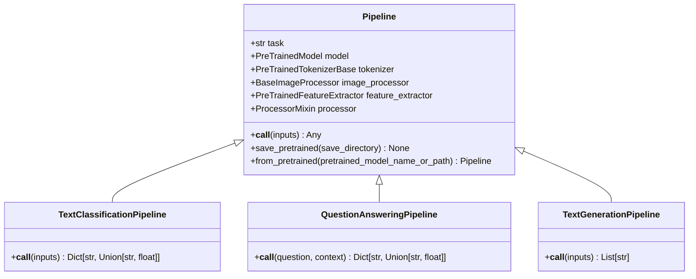
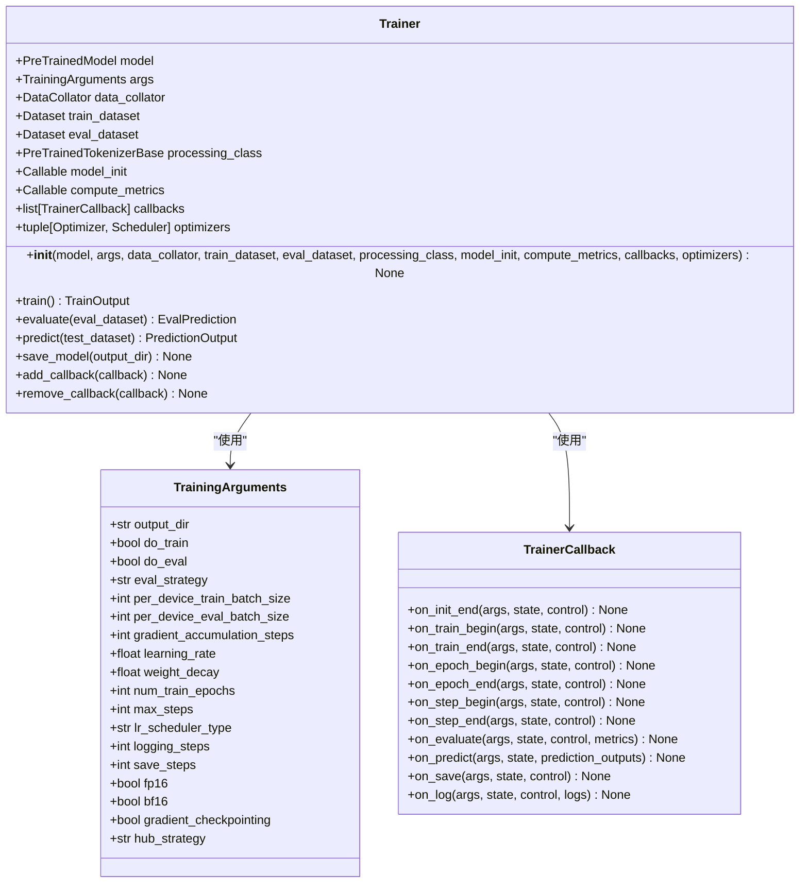
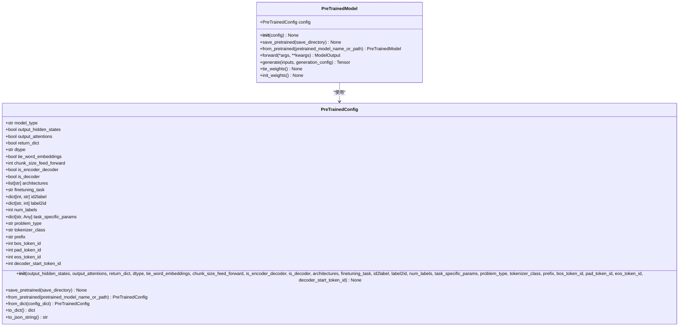

# API参考

<cite>
**本文档中引用的文件**   
- [__init__.py](file://src/transformers/__init__.py)
- [trainer.py](file://src/transformers/trainer.py)
- [training_args.py](file://src/transformers/training_args.py)
- [base.py](file://src/transformers/pipelines/base.py)
- [configuration_utils.py](file://src/transformers/configuration_utils.py)
- [modeling_utils.py](file://src/transformers/modeling_utils.py)
</cite>

## 目录
1. [简介](#简介)
2. [Pipeline API](#pipeline-api)
3. [Trainer API](#trainer-api)
4. [模型API](#模型api)
5. [错误处理](#错误处理)
6. [版本兼容性](#版本兼容性)

## 简介
transformers库提供了一套全面的API，用于自然语言处理、计算机视觉和音频处理任务。本API参考文档详细介绍了库中的主要接口，包括Pipeline API、Trainer API和模型API。这些API设计用于简化机器学习模型的使用、训练和部署过程，支持从简单的推理到复杂的模型微调的各种用例。

**Section sources**
- [__init__.py](file://src/transformers/__init__.py#L1-L790)

## Pipeline API

transformers库的Pipeline API提供了一个高级接口，用于执行各种机器学习任务，如文本分类、问答、文本生成等。Pipeline系统自动处理预处理、模型推理和后处理步骤，使用户能够以最少的代码执行复杂的任务。

### Pipeline类
`Pipeline`类是所有具体Pipeline实现的基类，定义了所有Pipeline共享的核心功能和接口。



**Diagram sources**
- [base.py](file://src/transformers/pipelines/base.py#L743-L1275)
- [__init__.py](file://src/transformers/pipelines/__init__.py#L1-L1073)

### pipeline函数
`pipeline`函数是创建Pipeline实例的主要入口点。它根据指定的任务类型自动选择合适的模型和处理器。

**参数说明：**
- **task** (`str`): 要执行的任务类型，如"sentiment-analysis"、"question-answering"等。
- **model** (`str` 或 `PreTrainedModel`): 要使用的模型。可以是模型标识符或预训练模型实例。
- **config** (`str` 或 `PreTrainedConfig`): 模型配置。如果未提供，将自动加载。
- **tokenizer** (`str` 或 `PreTrainedTokenizer`): 用于编码文本的分词器。如果未提供，将自动加载。
- **feature_extractor** (`str` 或 `PreTrainedFeatureExtractor`): 用于提取特征的特征提取器。如果未提供，将自动加载。
- **image_processor** (`str` 或 `BaseImageProcessor`): 用于处理图像的图像处理器。如果未提供，将自动加载。
- **processor** (`str` 或 `ProcessorMixin`): 用于处理多模态数据的处理器。如果未提供，将自动加载。
- **device** (`int` 或 `str` 或 `torch.device`): 指定模型运行的设备。
- **device_map** (`str` 或 `dict`): 设备映射配置，用于分布式训练。

**返回值：**
- `Pipeline`: 根据任务类型返回相应的Pipeline实例。

**使用示例：**
```python
from transformers import pipeline

# 情感分析Pipeline
analyzer = pipeline("sentiment-analysis")

# 问答Pipeline
oracle = pipeline(
    "question-answering", 
    model="distilbert/distilbert-base-cased-distilled-squad", 
    tokenizer="google-bert/bert-base-cased"
)

# 命名实体识别Pipeline
recognizer = pipeline("ner", model=model, tokenizer=tokenizer)
```

**Section sources**
- [__init__.py](file://src/transformers/pipelines/__init__.py#L1-L1073)

## Trainer API

Trainer API提供了用于训练和评估PyTorch模型的完整训练和评估循环，特别针对transformers库进行了优化。它简化了训练过程，提供了许多高级功能，如分布式训练、混合精度训练和模型检查点。

### Trainer类
`Trainer`类是训练循环的核心，负责管理训练过程的所有方面。



**Diagram sources**
- [trainer.py](file://src/transformers/trainer.py#L288-L5222)
- [training_args.py](file://src/transformers/training_args.py#L198-L2764)

### TrainingArguments类
`TrainingArguments`类包含了训练循环的所有超参数和配置选项。

**参数说明：**
- **output_dir** (`str`): 模型预测和检查点的输出目录。
- **do_train** (`bool`): 是否运行训练。
- **do_eval** (`bool`): 是否在验证集上运行评估。
- **eval_strategy** (`str` 或 `IntervalStrategy`): 训练期间采用的评估策略。
- **per_device_train_batch_size** (`int`): 每个设备的训练批次大小。
- **per_device_eval_batch_size** (`int`): 每个设备的评估批次大小。
- **gradient_accumulation_steps** (`int`): 在执行反向传播/更新步骤之前累积梯度的更新步骤数。
- **learning_rate** (`float`): AdamW优化器的初始学习率。
- **weight_decay** (`float`): AdamW优化器中除所有偏置和LayerNorm权重外所有层的权重衰减。
- **num_train_epochs** (`float`): 要执行的训练周期总数。
- **max_steps** (`int`): 如果设置为正数，则要执行的总训练步骤数。覆盖`num_train_epochs`。
- **lr_scheduler_type** (`str` 或 `SchedulerType`): 要使用的调度器类型。
- **logging_steps** (`int`): 如果`logging_strategy="steps"`，则在两次日志记录之间的更新步骤数。
- **save_steps** (`int`): 如果`save_strategy="steps"`，则在两次检查点保存之间的更新步骤数。
- **fp16** (`bool`): 是否使用fp16 16位（混合）精度训练而不是32位训练。
- **bf16** (`bool`): 是否使用bf16 16位（混合）精度训练而不是32位训练。
- **gradient_checkpointing** (`bool`): 如果为True，则使用梯度检查点来节省内存。
- **hub_strategy** (`str` 或 `HubStrategy`): 定义推送到Hub的内容范围和时间。

**使用示例：**
```python
from transformers import TrainingArguments, Trainer

# 定义训练参数
training_args = TrainingArguments(
    output_dir="./results",
    num_train_epochs=3,
    per_device_train_batch_size=8,
    per_device_eval_batch_size=8,
    warmup_steps=500,
    weight_decay=0.01,
    logging_dir="./logs",
    logging_steps=10,
    evaluation_strategy="steps",
    eval_steps=500,
    save_strategy="steps",
    save_steps=500,
    load_best_model_at_end=True,
    metric_for_best_model="accuracy",
)

# 创建Trainer实例
trainer = Trainer(
    model=model,
    args=training_args,
    train_dataset=train_dataset,
    eval_dataset=eval_dataset,
    compute_metrics=compute_metrics,
)
```

**Section sources**
- [training_args.py](file://src/transformers/training_args.py#L198-L2764)
- [trainer.py](file://src/transformers/trainer.py#L288-L5222)

## 模型API

模型API提供了用于定义、配置和使用深度学习模型的核心类和方法。这些API允许用户创建、加载和保存模型配置，以及管理模型权重。

### PreTrainedConfig类
`PreTrainedConfig`类是所有模型配置类的基类，处理所有模型配置共有的参数和方法。



**Diagram sources**
- [configuration_utils.py](file://src/transformers/configuration_utils.py#L52-L1216)
- [modeling_utils.py](file://src/transformers/modeling_utils.py#L1-L5420)

### 配置参数说明
- **model_type** (`str`): 模型类型的标识符，在JSON文件中序列化，并用于在`AutoConfig`中重新创建正确的对象。
- **output_hidden_states** (`bool`): 模型是否应返回所有隐藏状态。
- **output_attentions** (`bool`): 模型是否应返回所有注意力。
- **return_dict** (`bool`): 模型是否应返回`ModelOutput`而不是普通元组。
- **dtype** (`str`): 权重的`dtype`。此属性可用于将模型初始化为非默认`dtype`（通常为`float32`），从而允许最佳存储分配。
- **tie_word_embeddings** (`bool`): 模型的输入和输出词嵌入是否应绑定。
- **is_encoder_decoder** (`bool`): 模型是否用作编码器/解码器。
- **architectures** (`list[str]`): 可与模型预训练权重一起使用的模型架构。
- **finetuning_task** (`str`): 用于微调模型的任务名称。
- **id2label** (`dict[int, str]`): 从索引到标签的映射。
- **label2id** (`dict[str, int]`): 从标签到索引的映射。
- **num_labels** (`int`): 模型最后一层使用的标签数量，通常用于分类任务。
- **tokenizer_class** (`str`): 要使用的关联分词器类的名称。
- **bos_token_id** (`int`): _beginning-of-stream_标记的id。
- **pad_token_id** (`int`): _padding_标记的id。
- **eos_token_id** (`int`): _end-of-stream_标记的id。
- **decoder_start_token_id** (`int`): 如果编码器-解码器模型以不同于_bos_的标记开始解码，则该标记的id。

**使用示例：**
```python
from transformers import AutoConfig, AutoModel

# 从预训练模型加载配置
config = AutoConfig.from_pretrained("google-bert/bert-base-uncased")

# 修改配置参数
config.num_labels = 5
config.finetuning_task = "sentiment-analysis"

# 保存配置
config.save_pretrained("./my_config")

# 从字典创建配置
config_dict = {
    "vocab_size": 30522,
    "hidden_size": 768,
    "num_hidden_layers": 12,
    "num_attention_heads": 12,
    "intermediate_size": 3072,
}
config = PreTrainedConfig.from_dict(config_dict)
```

**Section sources**
- [configuration_utils.py](file://src/transformers/configuration_utils.py#L52-L1216)

## 错误处理

transformers库提供了全面的错误处理机制，确保在使用API时能够提供清晰和有用的错误信息。

### 常见异常类型
- **ValueError**: 当传递给函数或方法的参数无效时引发。
- **OSError**: 当文件操作失败时引发，如无法加载模型文件。
- **RuntimeError**: 当运行时发生错误时引发，如模型不支持的操作。
- **PipelineException**: 当Pipeline处理`__call__`时引发的特定异常。
- **TrainerException**: 当Trainer在训练过程中遇到问题时引发的特定异常。

### 错误处理最佳实践
1. **验证输入参数**: 在调用API之前，确保所有输入参数都有效且符合预期格式。
2. **处理文件操作**: 在加载模型或配置文件时，使用适当的异常处理来处理文件不存在或无法访问的情况。
3. **检查设备兼容性**: 确保模型和数据在正确的设备上，避免设备不匹配错误。
4. **处理分布式训练**: 在分布式训练环境中，确保所有进程都能正确访问所需的资源。

**使用示例：**
```python
from transformers import pipeline, PipelineException

try:
    # 尝试创建Pipeline
    pipe = pipeline("sentiment-analysis")
    result = pipe("This is a great product!")
    print(result)
except PipelineException as e:
    print(f"Pipeline错误: {e}")
except ValueError as e:
    print(f"参数错误: {e}")
except OSError as e:
    print(f"文件操作错误: {e}")
except Exception as e:
    print(f"未知错误: {e}")
```

**Section sources**
- [base.py](file://src/transformers/pipelines/base.py#L743-L1275)
- [trainer.py](file://src/transformers/trainer.py#L288-L5222)

## 版本兼容性

transformers库遵循语义化版本控制，确保向后兼容性并提供清晰的弃用警告。

### 版本兼容性信息
- **主要版本**: 重大更改，可能包含不兼容的API更改。
- **次要版本**: 向后兼容的功能添加。
- **补丁版本**: 向后兼容的错误修复。

### 弃用警告
transformers库使用标准的Python弃用警告机制来通知用户即将弃用的功能。建议用户定期检查日志中的弃用警告，并更新代码以使用推荐的替代方法。

**最佳实践：**
1. **定期更新**: 定期更新transformers库以获取最新的功能和安全修复。
2. **监控弃用警告**: 在开发和测试环境中启用详细的日志记录，以捕获弃用警告。
3. **使用稳定版本**: 在生产环境中使用稳定版本，避免使用预发布版本。
4. **检查文档**: 在升级库版本时，检查官方文档以了解任何重大更改。

**使用示例：**
```python
import warnings
from transformers import TrainingArguments

# 启用所有警告
warnings.filterwarnings("always")

# 创建训练参数（可能触发弃用警告）
training_args = TrainingArguments(
    output_dir="./results",
    # 旧参数（可能已弃用）
    do_train=True,
    do_eval=True,
    # 新参数
    per_device_train_batch_size=8,
    per_device_eval_batch_size=8,
)
```

**Section sources**
- [__init__.py](file://src/transformers/__init__.py#L1-L790)
- [trainer.py](file://src/transformers/trainer.py#L288-L5222)