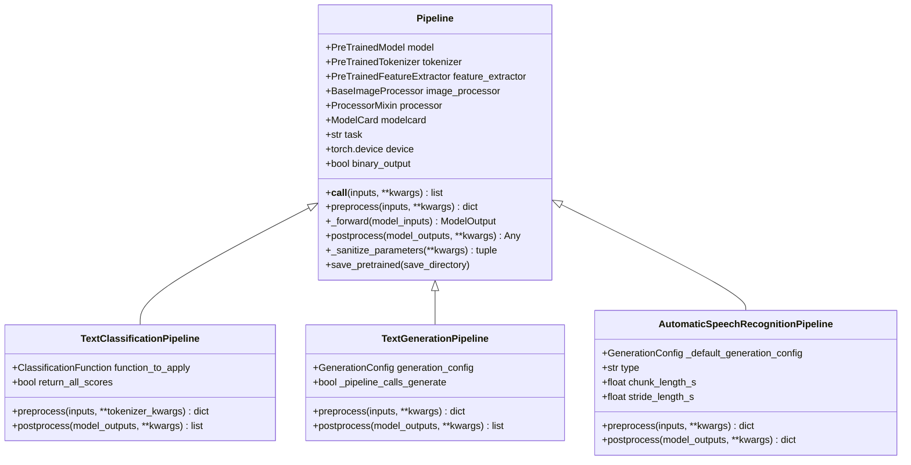
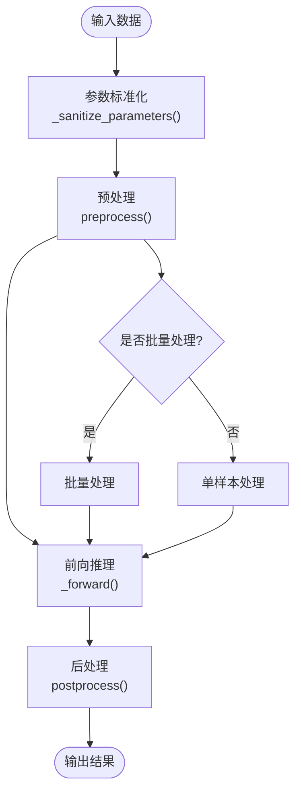
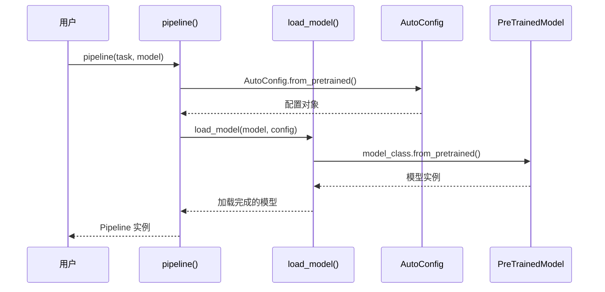
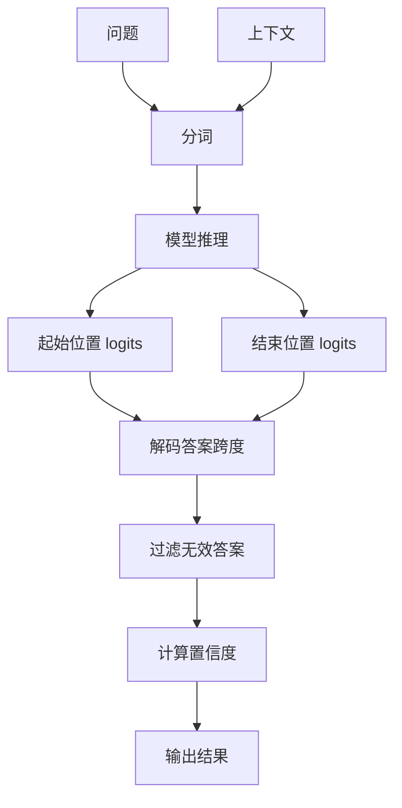
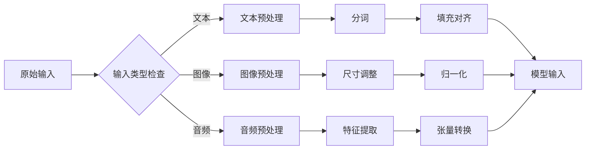
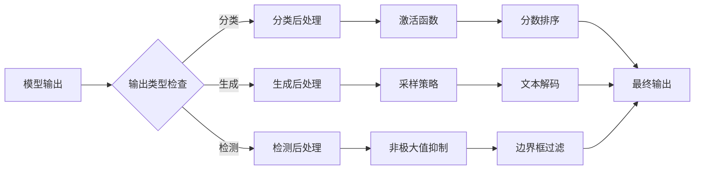
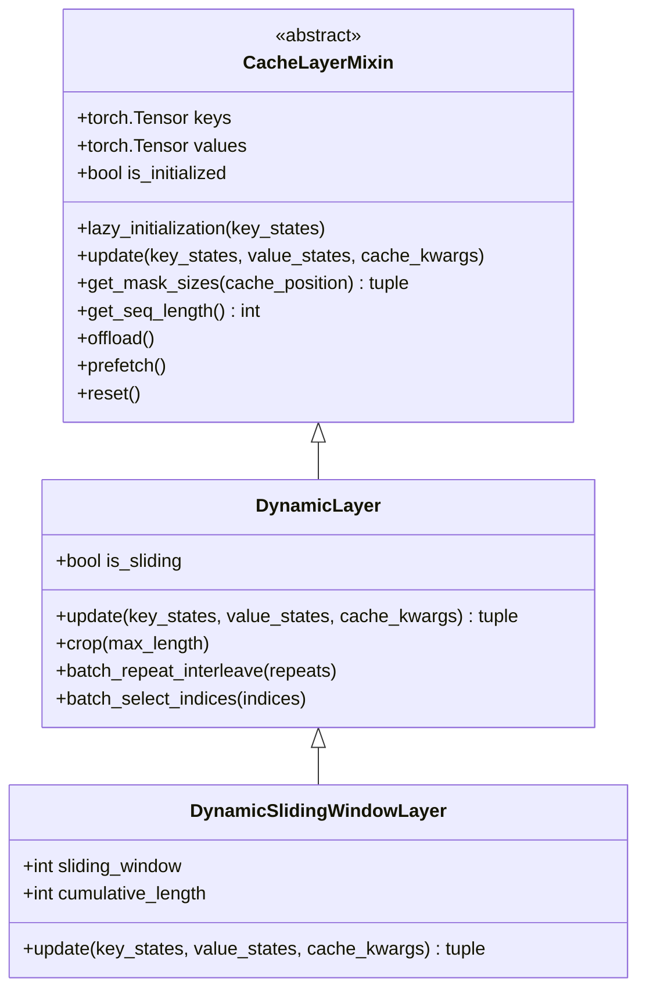
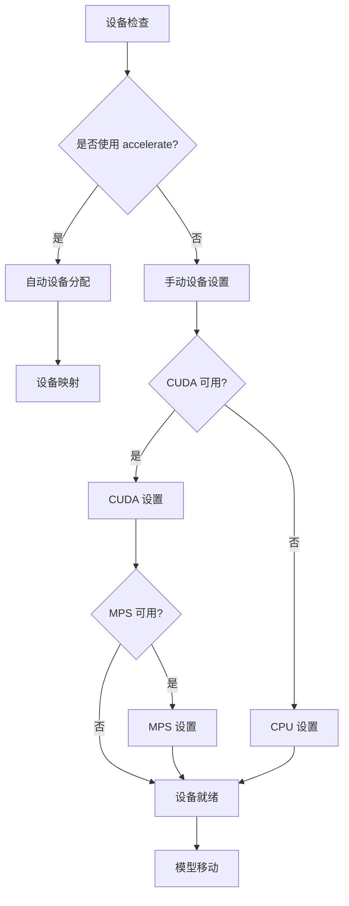
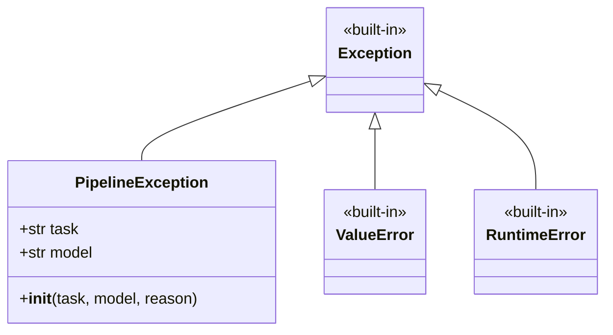

# Pipeline API 文档

<cite>
**本文档中引用的文件**
- [src/transformers/pipelines/__init__.py](file://src/transformers/pipelines/__init__.py)
- [src/transformers/pipelines/base.py](file://src/transformers/pipelines/base.py)
- [src/transformers/pipelines/text_classification.py](file://src/transformers/pipelines/text_classification.py)
- [src/transformers/pipelines/text_generation.py](file://src/transformers/pipelines/text_generation.py)
- [src/transformers/pipelines/question_answering.py](file://src/transformers/pipelines/question_answering.py)
- [src/transformers/pipelines/image_classification.py](file://src/transformers/pipelines/image_classification.py)
- [src/transformers/pipelines/automatic_speech_recognition.py](file://src/transformers/pipelines/automatic_speech_recognition.py)
- [src/transformers/cache_utils.py](file://src/transformers/cache_utils.py)
- [src/transformers/pipelines/pt_utils.py](file://src/transformers/pipelines/pt_utils.py)
</cite>

## 目录
1. [简介](#简介)
2. [Pipeline 基类设计](#pipeline-基类设计)
3. [核心方法详解](#核心方法详解)
4. [任务类型详解](#任务类型详解)
5. [预处理和后处理机制](#预处理和后处理机制)
6. [缓存机制和性能优化](#缓存机制和性能优化)
7. [错误处理和异常管理](#错误处理和异常管理)
8. [最佳实践指南](#最佳实践指南)
9. [实际使用示例](#实际使用示例)
10. [总结](#总结)

## 简介

Pipeline API 是 Hugging Face Transformers 库中的高级抽象层，它简化了机器学习模型的使用过程。通过统一的接口，用户可以轻松地在各种任务上部署预训练模型，包括文本分类、文本生成、问答、图像分类、语音识别等。

Pipeline 的设计理念是将复杂的模型推理流程封装成简单的调用接口，隐藏了底层的预处理、模型推理和后处理细节。这种设计使得非专家用户也能快速上手使用先进的深度学习模型。

## Pipeline 基类设计

### 架构概览

Pipeline 基类采用模块化设计，支持多种模态的数据处理：



**图表来源**
- [src/transformers/pipelines/base.py](file://src/transformers/pipelines/base.py#L700-L850)
- [src/transformers/pipelines/text_classification.py](file://src/transformers/pipelines/text_classification.py#L40-L80)
- [src/transformers/pipelines/text_generation.py](file://src/transformers/pipelines/text_generation.py#L40-L80)

### 核心组件配置

Pipeline 基类通过类属性指示需要的预处理组件：

| 类属性 | 类型 | 描述 |
|--------|------|------|
| `_load_processor` | bool/None | 是否加载通用处理器，None表示可选 |
| `_load_image_processor` | bool/None | 是否加载图像处理器，None表示可选 |
| `_load_feature_extractor` | bool/None | 是否加载特征提取器，None表示可选 |
| `_load_tokenizer` | bool/None | 是否加载分词器，None表示可选 |

**节来源**
- [src/transformers/pipelines/base.py](file://src/transformers/pipelines/base.py#L700-L750)

## 核心方法详解

### `__call__` 方法

`__call__` 方法是 Pipeline 的主要入口点，实现了完整的推理流水线：



**图表来源**
- [src/transformers/pipelines/base.py](file://src/transformers/pipelines/base.py#L1200-L1300)

### `from_pretrained` 和 `save_pretrained` 方法

虽然 Pipeline 本身不直接实现 `from_pretrained` 方法，但通过 `pipeline()` 工厂函数提供了类似功能：



**图表来源**
- [src/transformers/pipelines/base.py](file://src/transformers/pipelines/base.py#L180-L250)
- [src/transformers/pipelines/__init__.py](file://src/transformers/pipelines/__init__.py#L860-L890)

**节来源**
- [src/transformers/pipelines/base.py](file://src/transformers/pipelines/base.py#L919-L946)

## 任务类型详解

### 文本分类 Pipeline

文本分类 Pipeline 处理序列分类任务，支持二分类和多分类：

| 参数 | 类型 | 默认值 | 描述 |
|------|------|--------|------|
| `return_all_scores` | bool | False | 是否返回所有预测分数 |
| `function_to_apply` | str | "default" | 应用的激活函数：sigmoid, softmax, none |

**节来源**
- [src/transformers/pipelines/text_classification.py](file://src/transformers/pipelines/text_classification.py#L40-L100)

### 文本生成 Pipeline

文本生成 Pipeline 支持语言建模和对话生成：

| 参数 | 类型 | 默认值 | 描述 |
|------|------|--------|------|
| `max_new_tokens` | int | 256 | 生成的最大新标记数 |
| `do_sample` | bool | True | 是否使用采样 |
| `temperature` | float | 0.7 | 采样温度 |
| `top_k` | int | None | Top-k 采样参数 |
| `top_p` | float | None | Top-p 采样参数 |

**节来源**
- [src/transformers/pipelines/text_generation.py](file://src/transformers/pipelines/text_generation.py#L80-L150)

### 问答 Pipeline

问答 Pipeline 处理抽取式问答任务：



**图表来源**
- [src/transformers/pipelines/question_answering.py](file://src/transformers/pipelines/question_answering.py#L30-L80)

**节来源**
- [src/transformers/pipelines/question_answering.py](file://src/transformers/pipelines/question_answering.py#L150-L200)

### 图像分类 Pipeline

图像分类 Pipeline 处理视觉分类任务：

| 参数 | 类型 | 默认值 | 描述 |
|------|------|--------|------|
| `top_k` | int | 5 | 返回的最高分数类别数量 |
| `function_to_apply` | str | "default" | 应用的激活函数 |
| `timeout` | float | None | 图像下载超时时间 |

**节来源**
- [src/transformers/pipelines/image_classification.py](file://src/transformers/pipelines/image_classification.py#L80-L120)

### 自动语音识别 Pipeline

自动语音识别 Pipeline 支持流式处理和长音频：

| 参数 | 类型 | 默认值 | 描述 |
|------|------|--------|------|
| `chunk_length_s` | float | 0 | 分块长度（秒） |
| `stride_length_s` | float | chunk_length_s/6 | 步幅长度（秒） |
| `decoder` | BeamSearchDecoderCTC | None | 语言模型解码器 |

**节来源**
- [src/transformers/pipelines/automatic_speech_recognition.py](file://src/transformers/pipelines/automatic_speech_recognition.py#L150-L200)

## 预处理和后处理机制

### 预处理流程

预处理阶段负责将原始输入转换为模型可接受的格式：



**图表来源**
- [src/transformers/pipelines/base.py](file://src/transformers/pipelines/base.py#L1200-L1300)

### 后处理流程

后处理阶段将模型输出转换为人类可读的结果：



**图表来源**
- [src/transformers/pipelines/text_classification.py](file://src/transformers/pipelines/text_classification.py#L150-L200)

**节来源**
- [src/transformers/pipelines/base.py](file://src/transformers/pipelines/base.py#L1200-L1300)

## 缓存机制和性能优化

### 内存缓存系统

Pipeline 使用动态缓存系统来优化推理性能：



**图表来源**
- [src/transformers/cache_utils.py](file://src/transformers/cache_utils.py#L30-L100)

### 批处理优化

Pipeline 支持多种批处理策略以提高吞吐量：

| 批处理类型 | 适用场景 | 性能特点 |
|------------|----------|----------|
| 单样本批处理 | 小规模推理 | 低延迟，高精度 |
| 固定大小批处理 | 中等规模推理 | 平衡性能和资源 |
| 动态批处理 | 大规模推理 | 最大吞吐量 |
| 流式批处理 | 实时推理 | 最低延迟 |

**节来源**
- [src/transformers/pipelines/pt_utils.py](file://src/transformers/pipelines/pt_utils.py#L100-L200)

### 设备优化

Pipeline 自动选择最优设备配置：



**图表来源**
- [src/transformers/pipelines/base.py](file://src/transformers/pipelines/base.py#L800-L850)

**节来源**
- [src/transformers/pipelines/base.py](file://src/transformers/pipelines/base.py#L800-L900)

## 错误处理和异常管理

### Pipeline 异常体系

Pipeline 定义了专门的异常类型来处理推理过程中的错误：



**图表来源**
- [src/transformers/pipelines/base.py](file://src/transformers/pipelines/base.py#L355-L370)

### 常见错误类型和解决方案

| 错误类型 | 常见原因 | 解决方案 |
|----------|----------|----------|
| `PipelineException` | 模型加载失败 | 检查模型路径和依赖 |
| `ValueError` | 输入格式错误 | 验证输入数据格式 |
| `RuntimeError` | 设备不兼容 | 检查硬件配置 |
| `OSError` | 文件访问错误 | 检查文件权限 |

**节来源**
- [src/transformers/pipelines/base.py](file://src/transformers/pipelines/base.py#L355-L370)

## 最佳实践指南

### 内存管理

1. **合理设置批处理大小**：根据可用内存调整 `batch_size`
2. **使用设备映射**：对于大模型使用 `device_map="auto"`
3. **及时释放资源**：使用完 Pipeline 后调用 `del` 或设置为 `None`

### 性能优化

1. **启用量化**：使用 `torch_dtype=torch.float16` 减少内存占用
2. **使用编译**：启用 `torch.compile()` 提升推理速度
3. **预热模型**：首次推理前进行预热以避免冷启动延迟

### 批处理策略

1. **小批量处理**：适合实时应用，降低延迟
2. **大批量处理**：适合离线批处理，提高吞吐量
3. **混合策略**：根据任务特性动态调整

### 资源监控

1. **内存使用监控**：定期检查 GPU/CPU 内存使用情况
2. **推理时间监控**：跟踪每个 Pipeline 的推理延迟
3. **错误率监控**：记录和分析失败请求的原因

## 实际使用示例

### 基础文本分类

```python
# 创建文本分类 Pipeline
classifier = pipeline("text-classification", model="distilbert-base-uncased-finetuned-sst-2-english")

# 单个预测
result = classifier("This movie is amazing!")
print(result)  # [{'label': 'POSITIVE', 'score': 0.999}]

# 批量预测
texts = ["Great product!", "Terrible service", "Average quality"]
results = classifier(texts)
```

### 文本生成

```python
# 创建文本生成 Pipeline
generator = pipeline("text-generation", model="gpt2")

# 基础生成
prompt = "The future of AI is"
output = generator(prompt, max_new_tokens=50)
print(output[0]['generated_text'])

# 对话生成
chat = [
    {"role": "user", "content": "What is artificial intelligence?"}
]
response = generator(chat, max_new_tokens=100)
```

### 图像分类

```python
# 创建图像分类 Pipeline
classifier = pipeline("image-classification", model="microsoft/beit-base-patch16-224")

# 从 URL 加载图像
url = "https://example.com/cat.jpg"
result = classifier(url)
print(result)  # [{'label': 'cat', 'score': 0.95}]

# 本地文件处理
from PIL import Image
image = Image.open("dog.jpg")
result = classifier(image)
```

### 语音识别

```python
# 创建语音识别 Pipeline
transcriber = pipeline("automatic-speech-recognition", model="openai/whisper-base")

# 从文件识别
audio_file = "speech.wav"
result = transcriber(audio_file)
print(result['text'])

# 流式处理长音频
long_audio = "long_speech.mp3"
result = transcriber(long_audio, chunk_length_s=30, stride_length_s=5)
```

### 自定义 Pipeline

```python
# 创建自定义 Pipeline
custom_pipeline = pipeline(
    "text-classification",
    model="custom-model",
    tokenizer="custom-tokenizer",
    device=0,
    batch_size=8
)

# 使用自定义参数
results = custom_pipeline(
    "Test text",
    function_to_apply="softmax",
    top_k=3
)
```

## 总结

Pipeline API 为 Hugging Face Transformers 提供了一个强大而灵活的高级接口，使用户能够轻松地在各种机器学习任务上部署预训练模型。通过统一的接口设计、智能的预处理和后处理机制、高效的缓存系统和完善的错误处理，Pipeline API 大大降低了使用复杂深度学习模型的门槛。

关键优势包括：
- **易用性**：简洁的 API 设计，无需深入了解底层实现
- **灵活性**：支持多种任务类型和自定义配置
- **性能**：内置优化机制，支持批处理和设备优化
- **可靠性**：完善的错误处理和异常管理

随着 Transformers 库的不断发展，Pipeline API 将继续演进，为用户提供更好的体验和更强大的功能。开发者应该充分利用这些工具，结合最佳实践，构建高效可靠的机器学习应用。