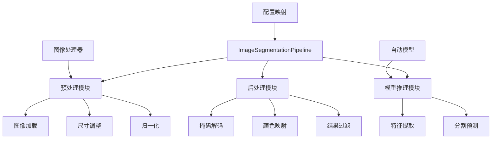
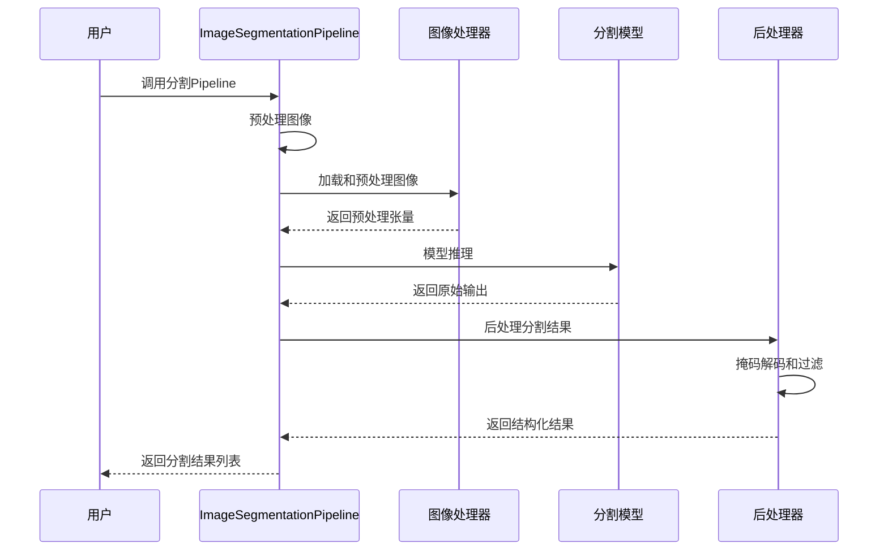
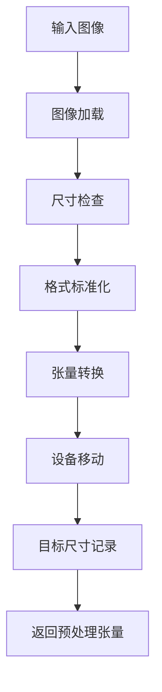
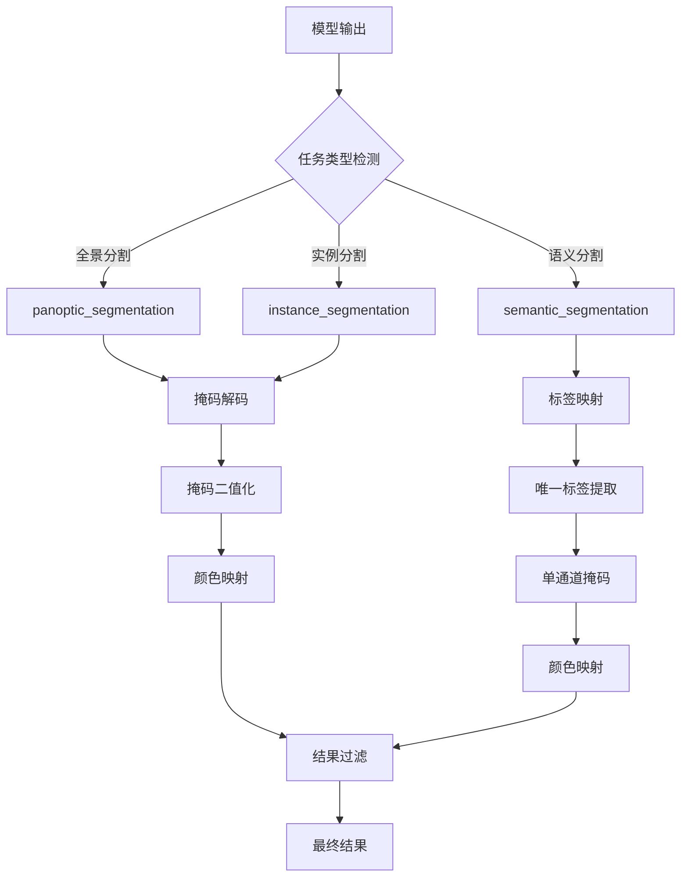
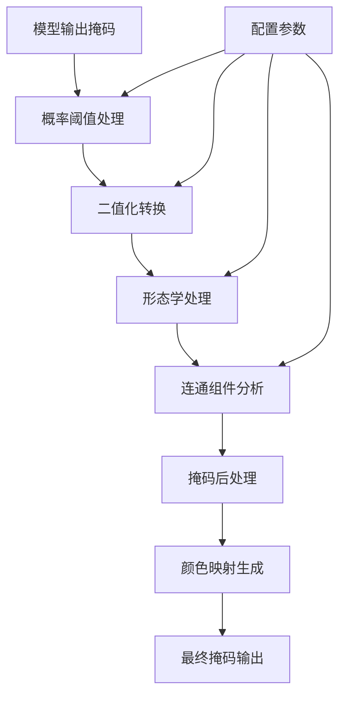

# 图像分割Pipeline

<cite>
**本文档中引用的文件**
- [image_segmentation.py](file://src/transformers/pipelines/image_segmentation.py)
- [test_pipelines_image_segmentation.py](file://tests/pipelines/test_pipelines_image_segmentation.py)
- [modeling_auto.py](file://src/transformers/models/auto/modeling_auto.py)
- [image_processing_utils.py](file://src/transformers/image_processing_utils.py)
- [detr/image_processing_detr.py](file://src/transformers/models/detr/image_processing_detr.py)
- [maskformer/image_processing_maskformer.py](file://src/transformers/models/maskformer/image_processing_maskformer.py)
- [seggpt/image_processing_seggpt.py](file://src/transformers/models/seggpt/image_processing_seggpt.py)
- [oneformer/modeling_oneformer.py](file://src/transformers/models/oneformer/modeling_oneformer.py)
</cite>

## 目录
1. [简介](#简介)
2. [项目结构](#项目结构)
3. [核心组件](#核心组件)
4. [架构概览](#架构概览)
5. [详细组件分析](#详细组件分析)
6. [分割类型详解](#分割类型详解)
7. [掩码解码与处理](#掩码解码与处理)
8. [配置参数详解](#配置参数详解)
9. [性能优化策略](#性能优化策略)
10. [故障排除指南](#故障排除指南)
11. [结论](#结论)

## 简介

ImageSegmentationPipeline是Hugging Face Transformers库中的一个强大工具，专门用于执行图像分割任务。该Pipeline支持多种分割类型，包括语义分割、实例分割和全景分割，能够从输入图像中识别出不同的对象并生成精确的掩码。

该Pipeline的核心优势在于：
- 支持多种分割任务类型
- 自动处理不同分辨率的输入图像
- 提供灵活的配置参数
- 集成先进的掩码后处理算法
- 支持批量处理和内存优化

## 项目结构



**图表来源**
- [image_segmentation.py](file://src/transformers/pipelines/image_segmentation.py#L25-L75)
- [image_processing_utils.py](file://src/transformers/image_processing_utils.py#L38-L169)

**章节来源**
- [image_segmentation.py](file://src/transformers/pipelines/image_segmentation.py#L1-L224)

## 核心组件

### ImageSegmentationPipeline类

ImageSegmentationPipeline是整个分割Pipeline的核心类，继承自基础Pipeline类，专门负责图像分割任务的完整流程。

#### 主要特性
- **多模型支持**：支持语义分割、实例分割和全景分割模型
- **智能任务选择**：根据可用的后处理函数自动选择最适合的分割任务
- **灵活的输入处理**：支持本地文件路径、HTTP链接和PIL图像对象
- **批量处理能力**：高效处理多个图像输入

#### 关键属性
- `_load_processor = False`：不加载通用处理器
- `_load_image_processor = True`：加载图像处理器
- `_load_feature_extractor = False`：不加载特征提取器
- `_load_tokenizer = None`：部分模型需要分词器（如OneFormer）

**章节来源**
- [image_segmentation.py](file://src/transformers/pipelines/image_segmentation.py#L25-L75)

## 架构概览



**图表来源**
- [image_segmentation.py](file://src/transformers/pipelines/image_segmentation.py#L133-L224)

## 详细组件分析

### 预处理阶段

预处理阶段负责将原始图像转换为模型可接受的格式：



**图表来源**
- [image_segmentation.py](file://src/transformers/pipelines/image_segmentation.py#L133-L156)

#### 预处理步骤详解

1. **图像加载**：使用`load_image()`函数处理各种输入格式
2. **尺寸记录**：保存原始图像尺寸以便后续调整
3. **张量转换**：将图像转换为PyTorch张量
4. **设备适配**：将数据移动到正确的计算设备

**章节来源**
- [image_segmentation.py](file://src/transformers/pipelines/image_segmentation.py#L133-L156)

### 后处理阶段

后处理阶段是Pipeline的核心，负责将模型输出转换为用户友好的分割结果：



**图表来源**
- [image_segmentation.py](file://src/transformers/pipelines/image_segmentation.py#L178-L224)

**章节来源**
- [image_segmentation.py](file://src/transformers/pipelines/image_segmentation.py#L178-L224)

## 分割类型详解

### 语义分割 (Semantic Segmentation)

语义分割将图像中的每个像素分配给一个语义类别，但不区分同一类别的不同实例。

#### 特点
- **全局视角**：关注整体场景理解
- **类别覆盖**：标记所有像素的语义类别
- **无实例区分**：相同类别的所有区域使用相同标签

#### 应用场景
- 场景理解
- 城市规划
- 农业监测

### 实例分割 (Instance Segmentation)

实例分割不仅识别像素的语义类别，还能区分同一类别中的不同实例。

#### 特点
- **实例级识别**：区分同一类别的不同对象
- **边界精确**：提供精确的对象轮廓
- **数量统计**：可以统计每个类别的实例数量

#### 应用场景
- 自动驾驶
- 医学影像分析
- 工业质检

### 全景分割 (Panoptic Segmentation)

全景分割结合了语义分割和实例分割的优点，既识别实例又处理背景区域。

#### 特点
- **统一框架**：同时处理前景和背景
- **无缝分割**：避免实例分割和语义分割之间的边界问题
- **完整性**：确保图像中每个像素都有明确的标签

#### 应用场景
- 计算机视觉研究
- 自动驾驶系统
- 增强现实

**章节来源**
- [modeling_auto.py](file://src/transformers/models/auto/modeling_auto.py#L915-L955)

## 掩码解码与处理

### 掩码解码过程

掩码解码是将模型的高维输出转换为可读的二进制掩码的关键步骤：



**图表来源**
- [image_segmentation.py](file://src/transformers/pipelines/image_segmentation.py#L178-L224)

### 颜色映射生成

颜色映射是将语义标签转换为可视化颜色的过程：

#### 单通道掩码
对于语义分割，生成单通道灰度掩码：
- 白色像素 (255) 表示目标区域
- 黑色像素 (0) 表示背景区域

#### 多通道掩码
对于实例和全景分割，生成彩色掩码：
- 使用唯一的颜色标识不同实例
- 支持透明度处理
- 可配置调色板

**章节来源**
- [seggpt/image_processing_seggpt.py](file://src/transformers/models/seggpt/image_processing_seggpt.py#L66-L191)

### 结果可视化方法

#### 掩码可视化
- **二值掩码**：黑白对比显示
- **伪彩色**：使用调色板映射
- **叠加显示**：与原图叠加展示

#### 性能指标
- **掩码质量评估**：计算IoU等指标
- **边界精度**：测量边缘准确性
- **实例完整性**：验证实例检测效果

## 配置参数详解

### 核心配置参数

| 参数名称 | 默认值 | 类型 | 描述 |
|---------|--------|------|------|
| `threshold` | 0.9 | float | 概率阈值，过滤低置信度预测 |
| `mask_threshold` | 0.5 | float | 掩码二值化阈值 |
| `overlap_mask_area_threshold` | 0.5 | float | 掩码重叠面积阈值，消除小片段 |
| `subtask` | None | str | 强制指定分割任务类型 |

### 高级配置选项

#### 批处理配置
- `batch_size`：控制批处理大小以优化内存使用
- `timeout`：设置图像下载超时时间

#### 内存优化配置
- `device`：指定计算设备（CPU/GPU）
- `dtype`：数据类型配置（float32/float16）

### 参数调优指南

#### 高精度模式
```python
segmenter = pipeline("image-segmentation", model="model_name")
result = segmenter(image, 
                   threshold=0.95,
                   mask_threshold=0.6,
                   overlap_mask_area_threshold=0.3)
```

#### 高性能模式
```python
result = segmenter(image,
                   threshold=0.7,
                   mask_threshold=0.4,
                   overlap_mask_area_threshold=0.7)
```

**章节来源**
- [image_segmentation.py](file://src/transformers/pipelines/image_segmentation.py#L77-L112)

## 性能优化策略

### 内存优化

#### 动态内存管理
- **梯度检查点**：在推理过程中减少内存占用
- **混合精度**：使用float16降低内存需求
- **批次大小调整**：根据GPU内存动态调整

#### 缓存策略
- **模型权重缓存**：避免重复加载
- **预处理结果缓存**：加速相同输入的处理
- **后处理结果缓存**：存储常用配置的结果

### 计算优化

#### 并行处理
- **多线程预处理**：并发处理多个图像
- **异步推理**：重叠预处理和模型推理
- **GPU加速**：充分利用CUDA计算能力

#### 算法优化
- **快速掩码处理**：使用向量化操作
- **近似算法**：在精度和速度间权衡
- **剪枝技术**：移除低重要性分支

**章节来源**
- [image_processing_utils.py](file://src/transformers/image_processing_utils.py#L38-L169)

## 故障排除指南

### 常见问题及解决方案

#### 掩码边界模糊

**症状**：生成的掩码边缘不够清晰
**原因**：掩码阈值设置过低或模型精度不足
**解决方案**：
1. 提高`mask_threshold`值（建议0.6-0.7）
2. 使用更高精度的模型
3. 应用形态学操作进行边缘锐化

#### 类别标签不准确

**症状**：预测的类别与预期不符
**原因**：模型训练数据与输入图像差异大
**解决方案**：
1. 调整`threshold`参数
2. 使用领域特定的预训练模型
3. 进行微调以适应特定场景

#### 性能问题

**症状**：处理速度慢或内存溢出
**原因**：输入图像过大或配置不当
**解决方案**：
1. 减小输入图像分辨率
2. 调整`batch_size`参数
3. 使用更高效的模型变体

#### 内存泄漏

**症状**：长时间运行后内存持续增长
**原因**：未正确释放中间变量
**解决方案**：
1. 显式清理不需要的张量
2. 使用上下文管理器
3. 定期重启进程

### 调试技巧

#### 结果验证
```python
# 检查掩码质量
def validate_mask_quality(masks):
    for mask in masks:
        # 检查掩码形状
        assert mask["mask"].size == original_image.size
        # 检查标签有效性
        assert mask["label"] in model_config.label_names
```

#### 性能监控
```python
import time
import psutil

def monitor_performance():
    start_time = time.time()
    memory_before = psutil.Process().memory_info().rss
    
    # 执行分割
    result = segmenter(image)
    
    memory_after = psutil.Process().memory_info().rss
    execution_time = time.time() - start_time
    
    print(f"执行时间: {execution_time:.2f}s")
    print(f"内存使用: {(memory_after - memory_before)/1024**2:.2f}MB")
```

**章节来源**
- [test_pipelines_image_segmentation.py](file://tests/pipelines/test_pipelines_image_segmentation.py#L400-L599)

## 结论

ImageSegmentationPipeline是Hugging Face Transformers库中功能强大的图像分割工具，提供了完整的分割解决方案。通过支持多种分割类型、灵活的配置选项和先进的后处理算法，它能够满足从研究到生产环境的各种需求。

### 主要优势
- **易用性**：简洁的API设计，开箱即用
- **灵活性**：支持多种分割任务和配置选项
- **性能**：优化的内存管理和计算效率
- **扩展性**：支持自定义模型和处理器

### 最佳实践建议
1. 根据具体应用场景选择合适的分割类型
2. 合理配置参数以平衡精度和性能
3. 在部署前充分测试和验证
4. 监控资源使用情况，及时优化

通过深入理解这些概念和实践，开发者可以充分发挥ImageSegmentationPipeline的潜力，构建高质量的图像分割应用。