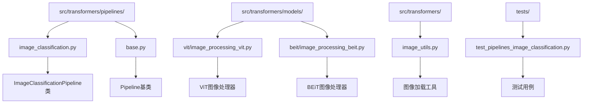
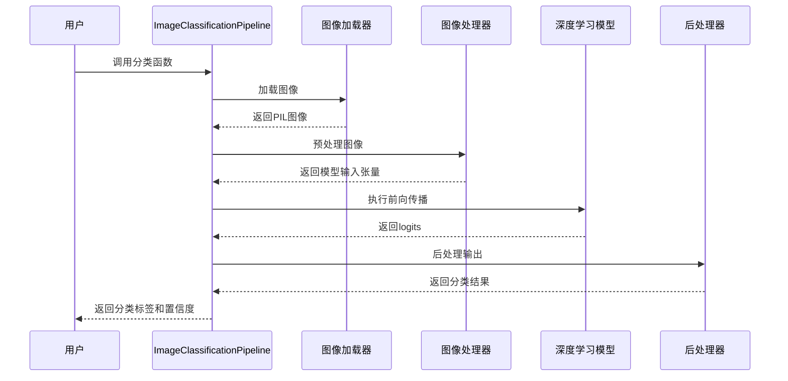
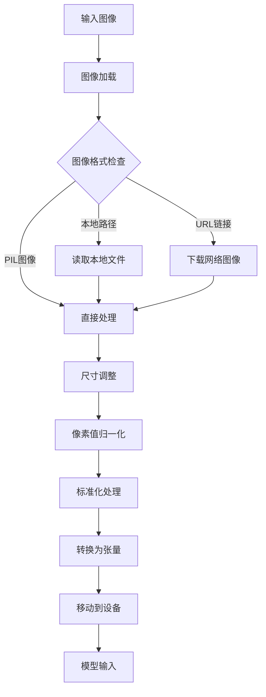
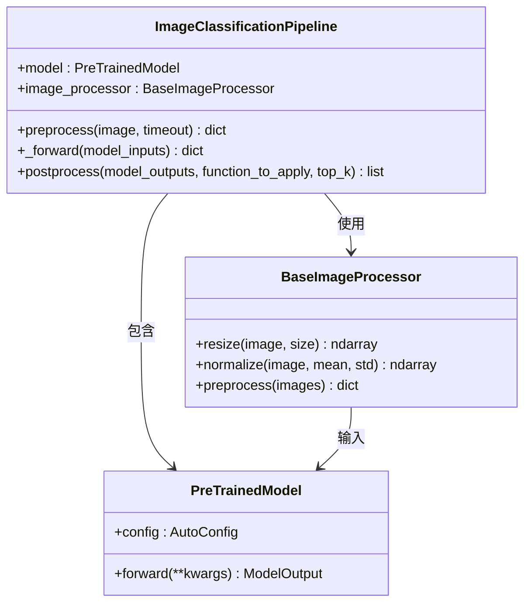
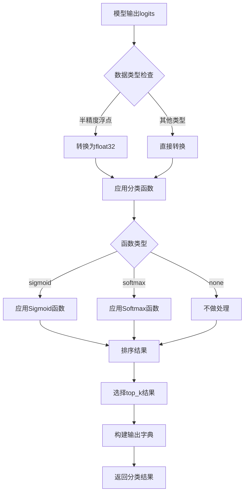
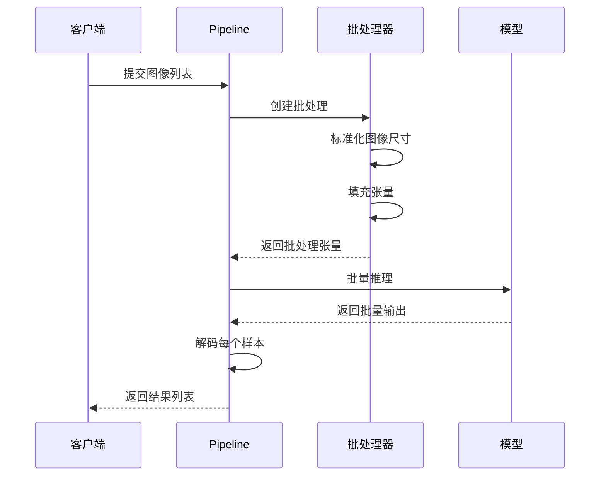
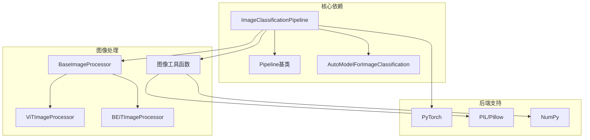

# 图像分类Pipeline

<cite>
**本文档中引用的文件**
- [image_classification.py](file://src/transformers/pipelines/image_classification.py)
- [base.py](file://src/transformers/pipelines/base.py)
- [image_utils.py](file://src/transformers/image_utils.py)
- [vit/image_processing_vit.py](file://src/transformers/models/vit/image_processing_vit.py)
- [beit/image_processing_beit.py](file://src/transformers/models/beit/image_processing_beit.py)
- [test_pipelines_image_classification.py](file://tests/pipelines/test_pipelines_image_classification.py)
- [modeling_auto.py](file://src/transformers/models/auto/modeling_auto.py)
</cite>

## 目录
1. [简介](#简介)
2. [项目结构](#项目结构)
3. [核心组件](#核心组件)
4. [架构概览](#架构概览)
5. [详细组件分析](#详细组件分析)
6. [依赖关系分析](#依赖关系分析)
7. [性能考虑](#性能考虑)
8. [故障排除指南](#故障排除指南)
9. [结论](#结论)

## 简介

图像分类Pipeline是Hugging Face Transformers库中的一个重要组件，专门用于执行图像分类任务。该Pipeline基于任何支持图像分类的`AutoModelForImageClassification`模型，能够预测图像的类别并返回相应的置信度分数。

该Pipeline的设计遵循了Transformers库的标准Pipeline模式，提供了统一的接口来处理各种图像分类任务，包括单标签分类和多标签分类。它内置了完整的图像预处理流程，包括像素值归一化、尺寸调整、中心裁剪等操作，并支持批处理输入以提高效率。

## 项目结构

图像分类Pipeline在Transformers库中的组织结构如下：

**图表来源**
- [image_classification.py](file://src/transformers/pipelines/image_classification.py#L1-L50)
- [base.py](file://src/transformers/pipelines/base.py#L1-L50)

**章节来源**
- [image_classification.py](file://src/transformers/pipelines/image_classification.py#L1-L230)
- [base.py](file://src/transformers/pipelines/base.py#L1-L200)

## 核心组件

### ImageClassificationPipeline类

`ImageClassificationPipeline`是图像分类任务的核心类，继承自基础Pipeline类。它实现了以下关键功能：

- **统一的图像输入处理**：支持本地路径、URL链接和PIL图像对象
- **自动模型类型检测**：验证模型是否为有效的图像分类模型
- **灵活的后处理配置**：支持多种分类函数（sigmoid、softmax、none）
- **批处理支持**：能够同时处理多个图像输入

### 图像预处理组件

图像预处理是Pipeline的关键组成部分，负责将原始图像转换为模型可接受的张量格式：

- **图像加载**：从不同源加载图像（本地文件、网络URL）
- **尺寸调整**：将图像调整到模型期望的输入尺寸
- **像素值归一化**：将像素值缩放到[0, 1]范围
- **标准化**：使用ImageNet统计信息进行标准化

**章节来源**
- [image_classification.py](file://src/transformers/pipelines/image_classification.py#L72-L228)
- [image_utils.py](file://src/transformers/image_utils.py#L1-L200)

## 架构概览

图像分类Pipeline采用模块化设计，遵循标准的Pipeline架构模式：

**图表来源**
- [image_classification.py](file://src/transformers/pipelines/image_classification.py#L180-L228)
- [base.py](file://src/transformers/pipelines/base.py#L100-L150)

## 详细组件分析

### 图像预处理流程

图像预处理是Pipeline的第一个阶段，负责将原始图像转换为模型可接受的格式：

**图表来源**
- [image_classification.py](file://src/transformers/pipelines/image_classification.py#L180-L190)
- [image_utils.py](file://src/transformers/image_utils.py#L50-L100)

#### 具体预处理步骤

1. **图像加载**：使用`load_image`函数从多种源加载图像
2. **尺寸调整**：根据模型要求调整图像尺寸
3. **像素值归一化**：将像素值从[0, 255]范围缩放到[0, 1]范围
4. **标准化**：使用ImageNet统计信息进行标准化
5. **张量转换**：将图像转换为PyTorch张量

### 模型推理过程

模型推理阶段负责执行深度学习模型的前向传播：

**图表来源**
- [image_classification.py](file://src/transformers/pipelines/image_classification.py#L72-L120)
- [base.py](file://src/transformers/pipelines/base.py#L50-L100)

### 结果解码逻辑

后处理阶段负责将模型输出转换为人类可读的分类结果：

**图表来源**
- [image_classification.py](file://src/transformers/pipelines/image_classification.py#L191-L228)

#### 分类函数选择逻辑

Pipeline根据模型配置自动选择合适的分类函数：

| 模型配置 | 分类函数 | 说明 |
|---------|---------|------|
| 多标签分类 | Sigmoid | 对每个类别独立应用Sigmoid函数 |
| 单标签分类 | Softmax | 应用Softmax函数确保概率总和为1 |
| 回归任务 | None | 不应用任何函数 |
| 自定义配置 | 用户指定 | 使用模型配置中的函数 |

**章节来源**
- [image_classification.py](file://src/transformers/pipelines/image_classification.py#L191-L228)

### 支持的模型类型

图像分类Pipeline支持多种预训练模型：

#### Vision Transformer (ViT)
- **特点**：基于Transformer架构的视觉模型
- **默认配置**：224x224输入尺寸，ImageNet标准化
- **典型用途**：通用图像分类任务

#### BEiT (Bidirectional Encoder representation from Image Transformers)
- **特点**：使用掩码图像建模的双向编码器
- **优势**：在下游任务上表现优异
- **适用场景**：需要高质量特征表示的任务

#### ResNet系列
- **特点**：经典的卷积神经网络架构
- **变体**：ResNet-50、ResNet-101、ResNet-152
- **优势**：计算效率高，适合实时应用

**章节来源**
- [vit/image_processing_vit.py](file://src/transformers/models/vit/image_processing_vit.py#L1-L200)
- [modeling_auto.py](file://src/transformers/models/auto/modeling_auto.py#L50-L150)

### 批处理处理机制

Pipeline支持高效的批处理以提高吞吐量：

**图表来源**
- [base.py](file://src/transformers/pipelines/base.py#L80-L150)

**章节来源**
- [base.py](file://src/transformers/pipelines/base.py#L80-L150)
- [image_classification.py](file://src/transformers/pipelines/image_classification.py#L107-L138)

## 依赖关系分析

图像分类Pipeline的依赖关系体现了Transformers库的模块化设计：

**图表来源**
- [image_classification.py](file://src/transformers/pipelines/image_classification.py#L1-L30)
- [base.py](file://src/transformers/pipelines/base.py#L1-L50)

### 关键依赖项

1. **PyTorch**：深度学习框架，提供张量操作和模型推理
2. **PIL/Pillow**：图像处理库，支持多种图像格式
3. **NumPy**：数值计算库，用于数组操作
4. **AutoModel**：自动模型工厂，支持多种模型架构

**章节来源**
- [image_classification.py](file://src/transformers/pipelines/image_classification.py#L1-L30)
- [base.py](file://src/transformers/pipelines/base.py#L1-L50)

## 性能考虑

### 内存优化策略

1. **张量类型转换**：自动将半精度浮点数转换为全精度以避免精度损失
2. **设备管理**：智能地将张量移动到适当的计算设备
3. **批处理优化**：合理设置批大小以平衡内存使用和计算效率

### 推理速度优化

1. **预编译模型**：支持ONNX和TensorRT加速
2. **量化支持**：支持INT8量化减少内存占用
3. **缓存机制**：缓存预处理结果避免重复计算

### 并发处理

Pipeline支持并发处理多个图像请求，通过异步I/O操作提高吞吐量。

## 故障排除指南

### 常见问题及解决方案

#### 输入图像格式错误

**问题描述**：输入图像格式不被支持或无法识别

**解决方案**：
- 确保输入为有效的图像格式（PNG、JPEG、BMP等）
- 检查图像文件是否损坏
- 使用PIL.Image.open()手动验证图像加载

#### 维度不匹配错误

**问题描述**：图像尺寸与模型期望不符

**解决方案**：
- 检查模型配置中的期望输入尺寸
- 使用适当的图像处理器参数
- 在预处理时明确指定尺寸参数

#### 内存不足错误

**问题描述**：处理大图像或大批量输入时内存溢出

**解决方案**：
- 减少批处理大小
- 使用更小的图像尺寸
- 启用梯度检查点（如果适用）

#### 模型加载失败

**问题描述**：无法加载指定的预训练模型

**解决方案**：
- 检查模型名称是否正确
- 确认网络连接正常
- 验证模型是否存在于Hugging Face Hub

**章节来源**
- [image_classification.py](file://src/transformers/pipelines/image_classification.py#L180-L228)
- [test_pipelines_image_classification.py](file://tests/pipelines/test_pipelines_image_classification.py#L50-L150)

### 测试和验证

Pipeline包含全面的测试套件，涵盖以下方面：

1. **基本功能测试**：验证单图像和批量处理
2. **类型测试**：测试不同输入类型的兼容性
3. **精度测试**：验证输出结果的准确性
4. **性能测试**：评估处理速度和内存使用

**章节来源**
- [test_pipelines_image_classification.py](file://tests/pipelines/test_pipelines_image_classification.py#L1-L200)

## 结论

图像分类Pipeline是Hugging Face Transformers库中的一个强大且灵活的组件，为图像分类任务提供了统一、高效的解决方案。它通过模块化的架构设计，支持多种预训练模型，具备完善的错误处理机制，并提供了丰富的配置选项。

该Pipeline的主要优势包括：

1. **易用性**：提供简洁的API，支持多种输入格式
2. **灵活性**：支持自定义图像处理器和分类函数
3. **性能**：优化的批处理和内存管理
4. **扩展性**：支持多种模型架构和配置

对于开发者而言，这个Pipeline不仅简化了图像分类任务的实现，还提供了充分的定制空间以满足特定需求。无论是学术研究还是生产环境部署，ImageClassificationPipeline都能提供可靠、高效的图像分类解决方案。