# 图像相关Pipeline

<cite>
**本文档中引用的文件**
- [image_classification.py](file://src/transformers/pipelines/image_classification.py)
- [image_segmentation.py](file://src/transformers/pipelines/image_segmentation.py)
- [object_detection.py](file://src/transformers/pipelines/object_detection.py)
- [depth_estimation.py](file://src/transformers/pipelines/depth_estimation.py)
- [base.py](file://src/transformers/pipelines/base.py)
- [image_processing_utils.py](file://src/transformers/image_processing_utils.py)
- [image_transforms.py](file://src/transformers/image_transforms.py)
- [__init__.py](file://src/transformers/__init__.py)
</cite>

## 目录
1. [简介](#简介)
2. [项目结构](#项目结构)
3. [核心组件](#核心组件)
4. [架构概览](#架构概览)
5. [详细组件分析](#详细组件分析)
6. [依赖关系分析](#依赖关系分析)
7. [性能考虑](#性能考虑)
8. [故障排除指南](#故障排除指南)
9. [结论](#结论)

## 简介

transformers库提供了强大的图像处理Pipeline，专门用于处理各种计算机视觉任务。这些Pipeline封装了复杂的图像预处理、模型推理和后处理流程，为开发者提供了简单易用的接口来执行图像分类、目标检测、图像分割和深度估计等任务。

本文档深入介绍了transformers库中图像相关Pipeline的实现机制，包括：
- 图像预处理管道（归一化、尺寸调整）
- 模型推理引擎
- 结果解码和后处理
- 批处理优化策略
- 不同任务类型的特定处理逻辑

## 项目结构

transformers库中的图像Pipeline组织结构清晰，主要分布在以下目录中：

```mermaid
graph TD
A[src/transformers/pipelines/] --> B[image_classification.py]
A --> C[image_segmentation.py]
A --> D[object_detection.py]
A --> E[depth_estimation.py]
A --> F[base.py]
G[src/transformers/] --> H[image_processing_utils.py]
G --> I[image_transforms.py]
G --> J[models/*/image_processing_*.py]
K[examples/pytorch/] --> L[image-classification/]
K --> M[semantic-segmentation/]
K --> N[object-detection/]
O[tests/pipelines/] --> P[image_classification_test.py]
O --> Q[image_segmentation_test.py]
O --> R[object_detection_test.py]
```

**图表来源**
- [base.py](file://src/transformers/pipelines/base.py#L1-L50)
- [image_classification.py](file://src/transformers/pipelines/image_classification.py#L1-L30)

**章节来源**
- [base.py](file://src/transformers/pipelines/base.py#L1-L100)
- [__init__.py](file://src/transformers/__init__.py#L1-L50)

## 核心组件

### Pipeline基类架构

所有图像Pipeline都继承自统一的基类，提供了标准化的工作流程：

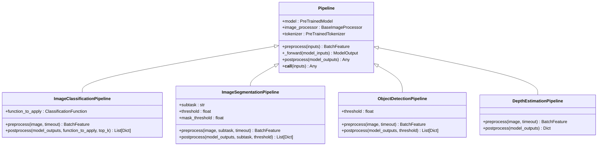

**图表来源**
- [base.py](file://src/transformers/pipelines/base.py#L700-L800)
- [image_classification.py](file://src/transformers/pipelines/image_classification.py#L60-L120)

### 图像处理工具链

图像处理系统包含多个层次的处理组件：

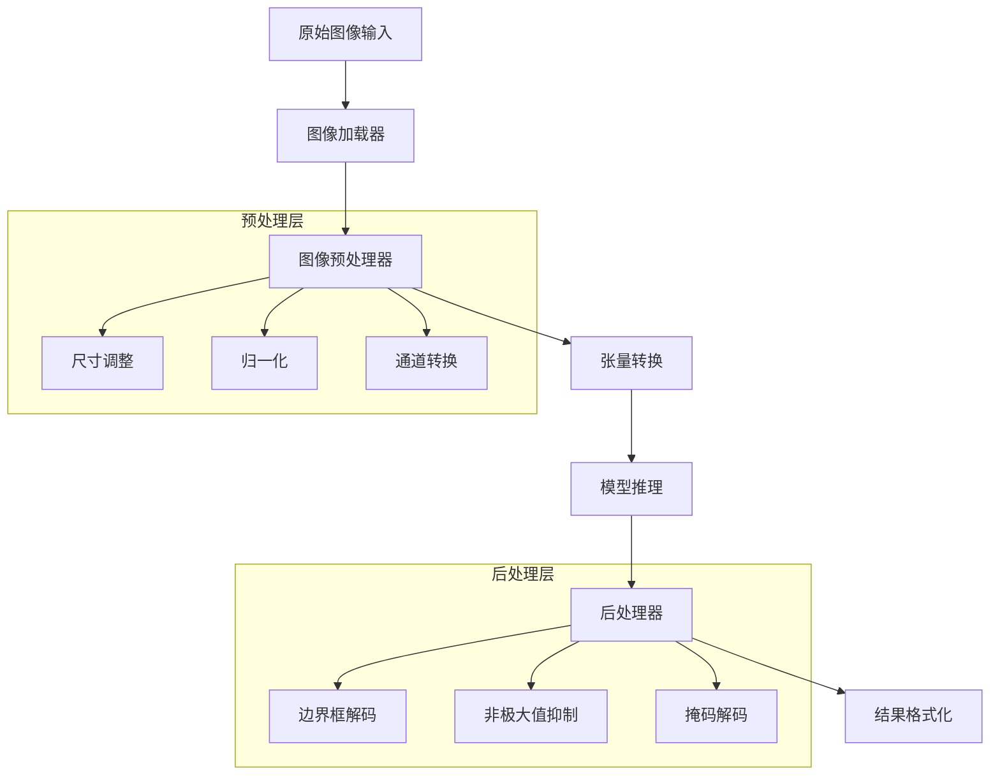

**图表来源**
- [image_processing_utils.py](file://src/transformers/image_processing_utils.py#L50-L150)
- [image_transforms.py](file://src/transformers/image_transforms.py#L50-L100)

**章节来源**
- [base.py](file://src/transformers/pipelines/base.py#L700-L900)
- [image_processing_utils.py](file://src/transformers/image_processing_utils.py#L1-L200)

## 架构概览

### 统一Pipeline工作流

所有图像Pipeline遵循标准的三阶段处理流程：

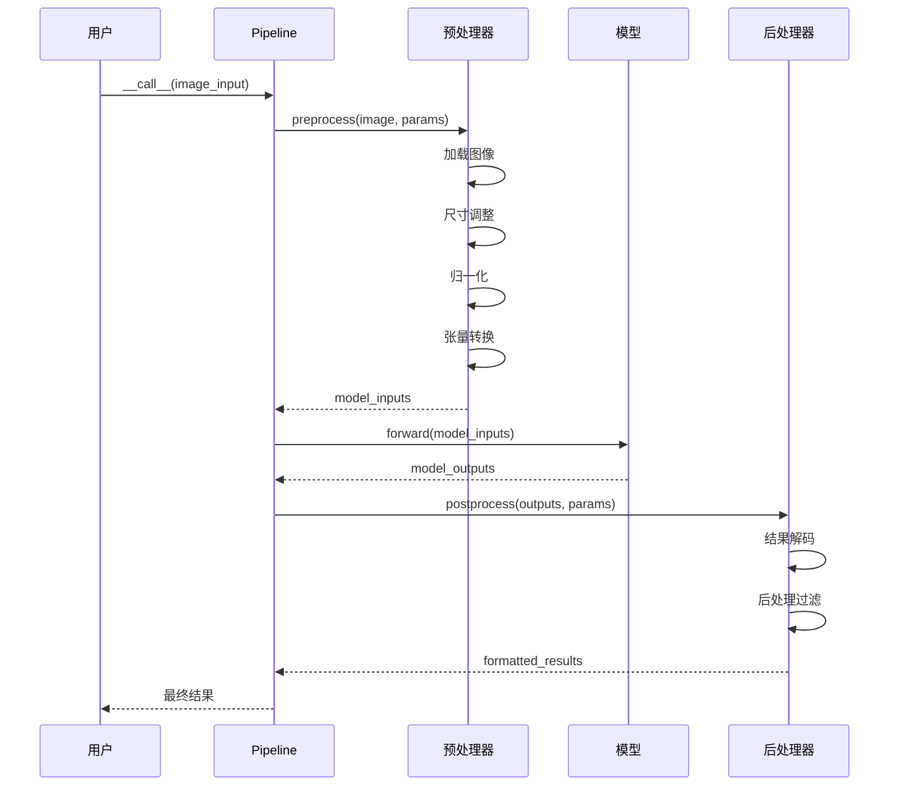

**图表来源**
- [base.py](file://src/transformers/pipelines/base.py#L800-L900)
- [image_classification.py](file://src/transformers/pipelines/image_classification.py#L150-L200)

### 批处理优化机制

Pipeline支持高效的批处理以提升性能：

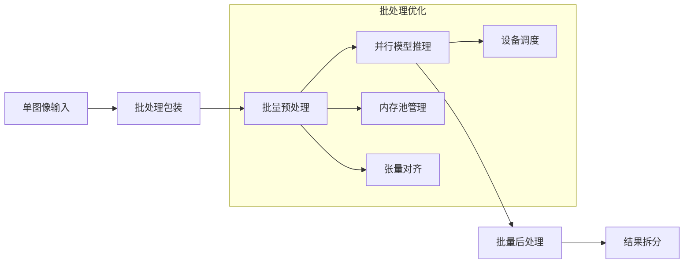

**图表来源**
- [base.py](file://src/transformers/pipelines/base.py#L100-L200)

## 详细组件分析

### 图像分类Pipeline

图像分类Pipeline专门处理单标签和多标签分类任务，具有智能的函数应用机制。

#### 核心特性

| 特性 | 描述 | 默认行为 |
|------|------|----------|
| 分类函数 | 自动选择合适的激活函数 | 基于问题类型自动判断 |
| 多标签支持 | 支持同时预测多个标签 | 使用sigmoid函数 |
| 单标签支持 | 只预测一个最可能的标签 | 使用softmax函数 |
| 置信度排序 | 返回按置信度排序的结果 | top_k参数控制数量 |

#### 预处理流程

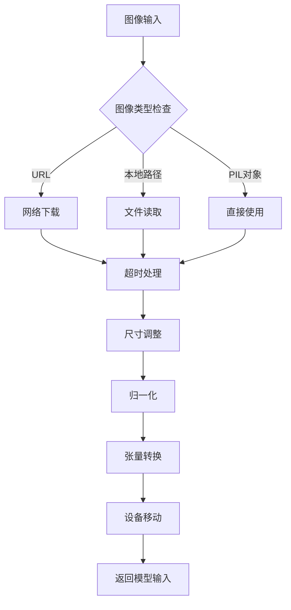

**图表来源**
- [image_classification.py](file://src/transformers/pipelines/image_classification.py#L150-L180)

#### 后处理逻辑

分类Pipeline的后处理包含智能的函数选择机制：

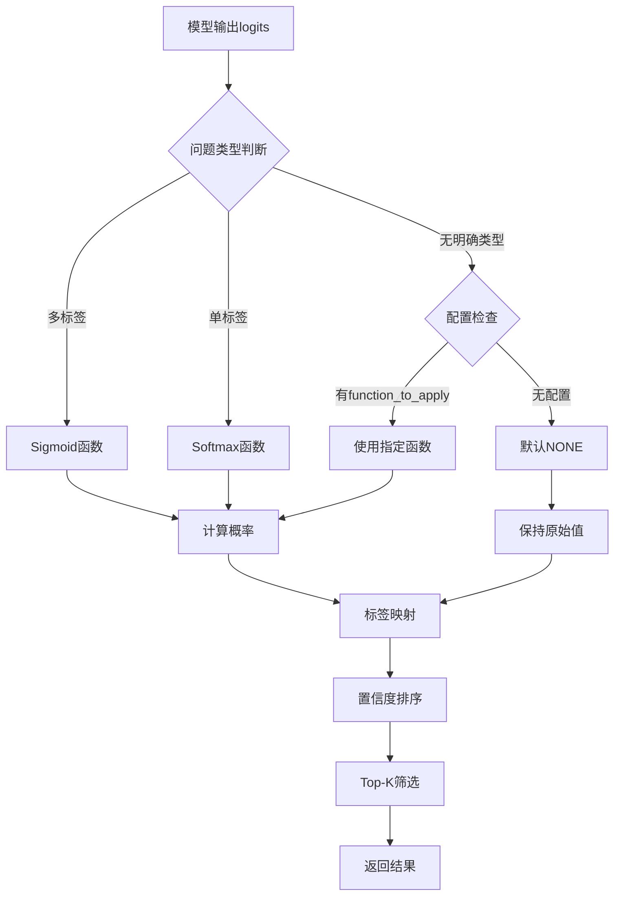

**图表来源**
- [image_classification.py](file://src/transformers/pipelines/image_classification.py#L180-L230)

**章节来源**
- [image_classification.py](file://src/transformers/pipelines/image_classification.py#L60-L230)

### 图像分割Pipeline

图像分割Pipeline支持多种分割任务类型，包括语义分割、实例分割和全景分割。

#### 分割任务类型

| 任务类型 | 描述 | 输出格式 | 应用场景 |
|----------|------|----------|----------|
| 语义分割 | 区分不同语义类别 | 单一掩码 | 场景理解 |
| 实例分割 | 区分不同实例 | 多个独立掩码 | 目标跟踪 |
| 全景分割 | 结合语义和实例 | 混合掩码 | 完整场景解析 |

#### 掩码处理流程

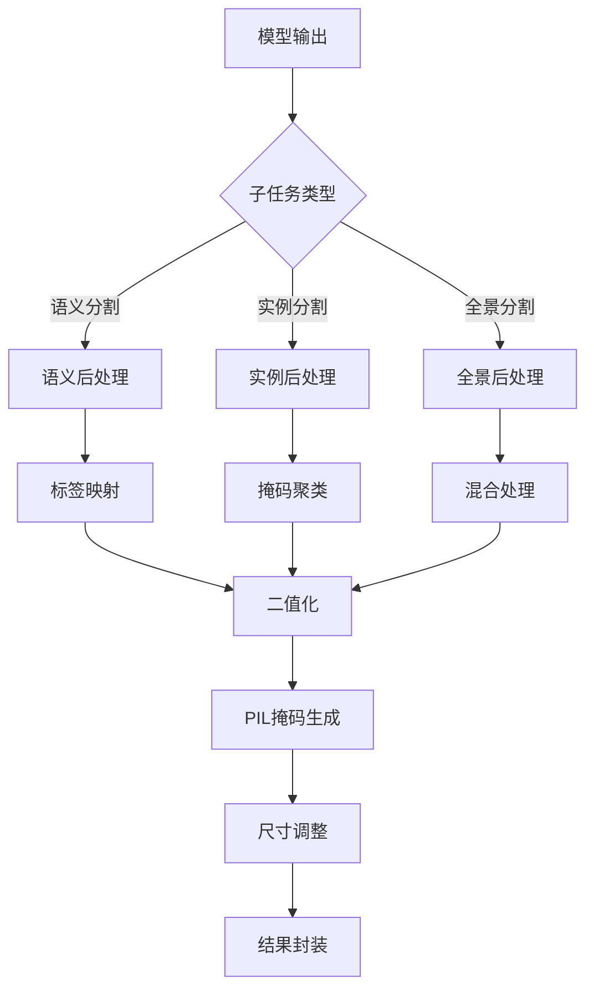

**图表来源**
- [image_segmentation.py](file://src/transformers/pipelines/image_segmentation.py#L178-L223)

#### OneFormer特殊处理

对于OneFormer模型，Pipeline需要额外的任务输入：

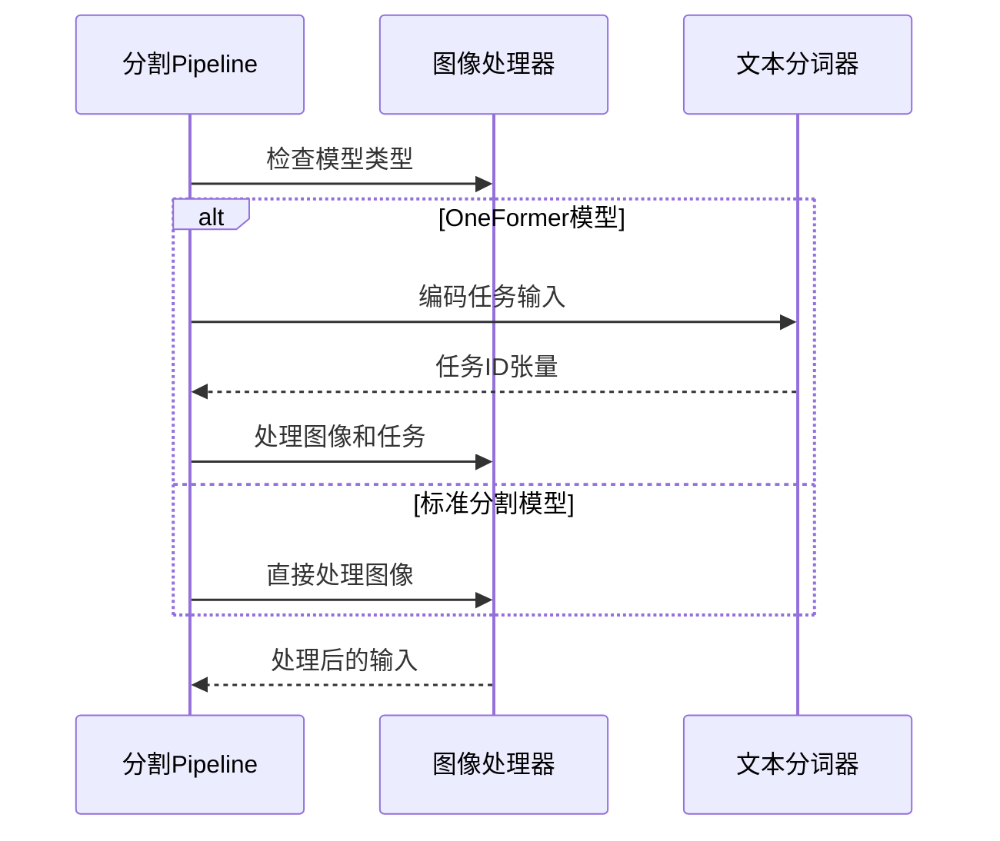

**图表来源**
- [image_segmentation.py](file://src/transformers/pipelines/image_segmentation.py#L120-L150)

**章节来源**
- [image_segmentation.py](file://src/transformers/pipelines/image_segmentation.py#L20-L223)

### 目标检测Pipeline

目标检测Pipeline负责识别图像中的对象并定位其位置。

#### 边界框处理机制

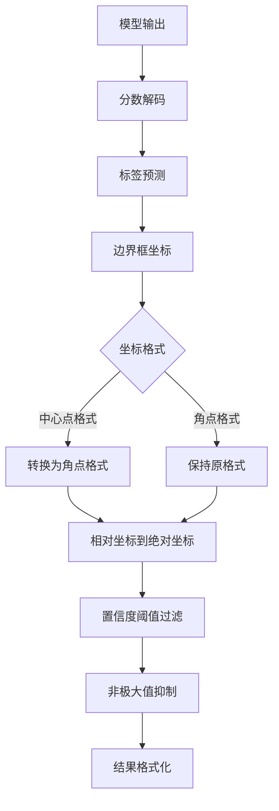

**图表来源**
- [object_detection.py](file://src/transformers/pipelines/object_detection.py#L120-L170)

#### 特殊处理：LayoutLM集成

对于集成了LayoutLM的模型，Pipeline需要特殊的坐标处理：

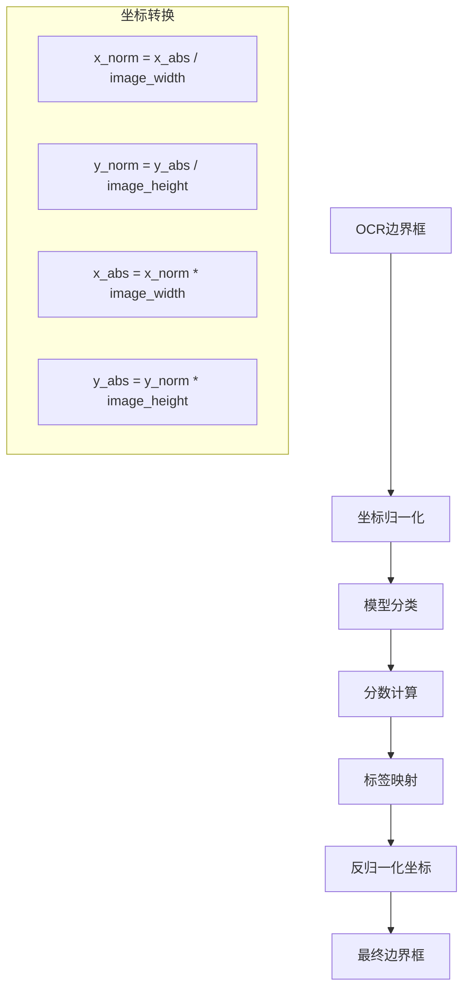

**图表来源**
- [object_detection.py](file://src/transformers/pipelines/object_detection.py#L140-L170)

**章节来源**
- [object_detection.py](file://src/transformers/pipelines/object_detection.py#L20-L197)

### 深度估计Pipeline

深度估计Pipeline输出每个像素的深度值，常用于3D重建和机器人导航。

#### 输出格式和处理

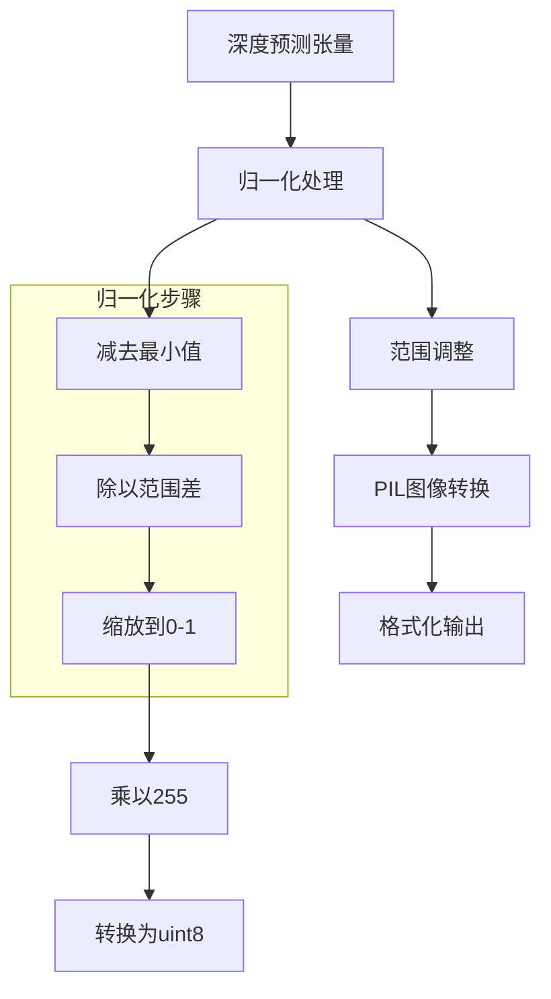

**图表来源**
- [depth_estimation.py](file://src/transformers/pipelines/depth_estimation.py#L120-L145)

#### 应用场景

| 应用领域 | 深度信息用途 | 技术挑战 |
|----------|--------------|----------|
| 3D重建 | 计算点云坐标 | 精度要求高 |
| 机器人导航 | 障碍物检测 | 实时性要求 |
| 增强现实 | 视觉融合 | 精确对齐 |
| 自动驾驶 | 环境感知 | 复杂场景处理 |

**章节来源**
- [depth_estimation.py](file://src/transformers/pipelines/depth_estimation.py#L20-L145)

## 依赖关系分析

### 核心依赖图

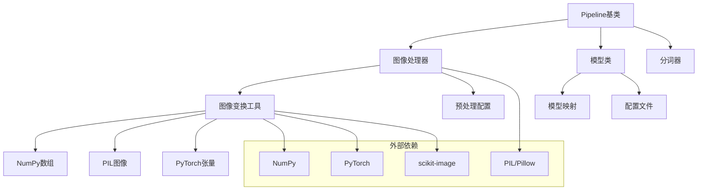

**图表来源**
- [base.py](file://src/transformers/pipelines/base.py#L1-L50)
- [image_processing_utils.py](file://src/transformers/image_processing_utils.py#L1-L50)

### 模型类型映射

不同Pipeline对应不同的模型类型：

| Pipeline类型 | 支持的模型类型 | 主要用途 |
|--------------|----------------|----------|
| 图像分类 | AutoModelForImageClassification | 图像分类任务 |
| 图像分割 | AutoModelForImageSegmentation | 分割任务 |
| 目标检测 | AutoModelForObjectDetection | 目标定位 |
| 深度估计 | AutoModelForDepthEstimation | 深度预测 |

**章节来源**
- [base.py](file://src/transformers/pipelines/base.py#L1-L100)

## 性能考虑

### 批处理优化策略

1. **内存管理**：使用内存池和张量重用减少分配开销
2. **设备调度**：智能选择CPU/GPU执行路径
3. **并行处理**：支持多线程预处理和后处理
4. **缓存机制**：缓存常用的图像处理配置

### 图像张量转换优化

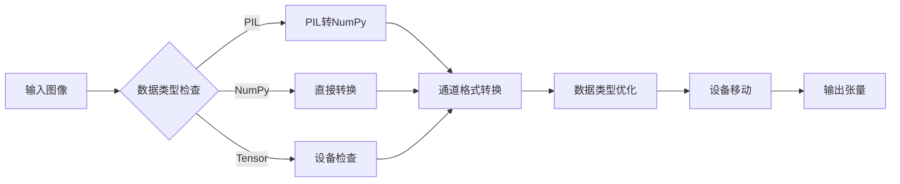

### 内存使用模式

| 操作阶段 | 内存峰值 | 优化策略 |
|----------|----------|----------|
| 图像加载 | 输入大小 | 流式处理 |
| 预处理 | 输入×1.5 | 批量操作 |
| 模型推理 | 模型参数×2 | 梯度关闭 |
| 后处理 | 输出大小 | 就地操作 |

## 故障排除指南

### 常见问题及解决方案

#### 图像加载失败
- **症状**：无法加载远程图像或本地文件
- **原因**：网络超时、文件权限、格式不支持
- **解决**：检查网络连接，验证文件格式，设置适当超时

#### 内存不足错误
- **症状**：CUDA out of memory
- **原因**：批次大小过大，图像分辨率过高
- **解决**：减小批次大小，降低图像分辨率

#### 类型转换错误
- **症状**：张量类型不匹配
- **原因**：设备不一致，数据类型错误
- **解决**：统一设备设置，检查数据类型

**章节来源**
- [base.py](file://src/transformers/pipelines/base.py#L300-L400)

## 结论

transformers库的图像Pipeline系统提供了强大而灵活的计算机视觉处理能力。通过统一的架构设计和模块化的组件结构，它成功地简化了复杂的图像处理任务，同时保持了高度的可扩展性和性能。

### 主要优势

1. **统一接口**：所有Pipeline共享相同的调用模式
2. **智能预处理**：自动处理图像格式和尺寸
3. **灵活后处理**：支持多种输出格式和过滤选项
4. **高性能**：内置批处理和优化机制
5. **易于扩展**：清晰的架构便于添加新功能

### 发展方向

随着计算机视觉技术的不断发展，这些Pipeline将继续演进，支持更多先进的模型和任务类型，为研究者和开发者提供更加强大和易用的工具。