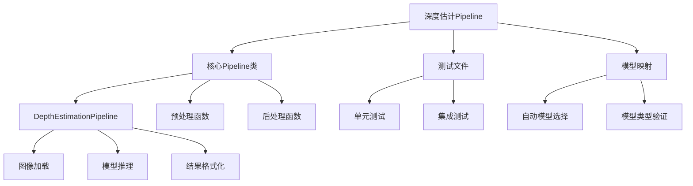
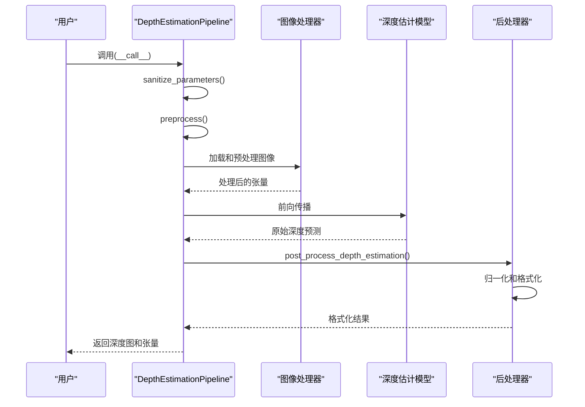
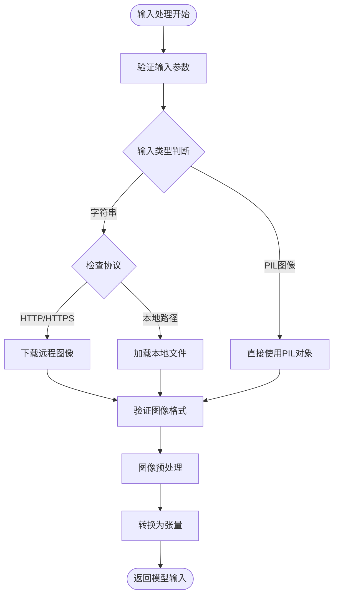
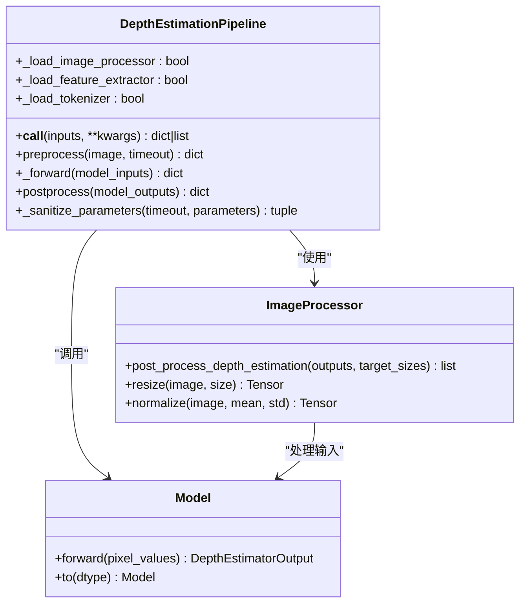
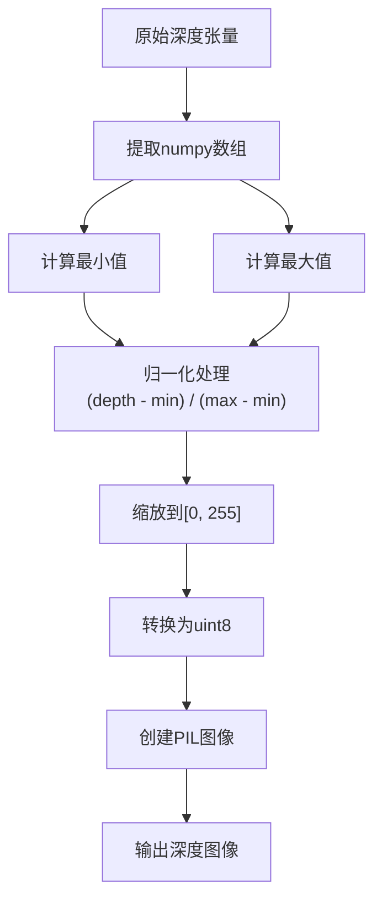
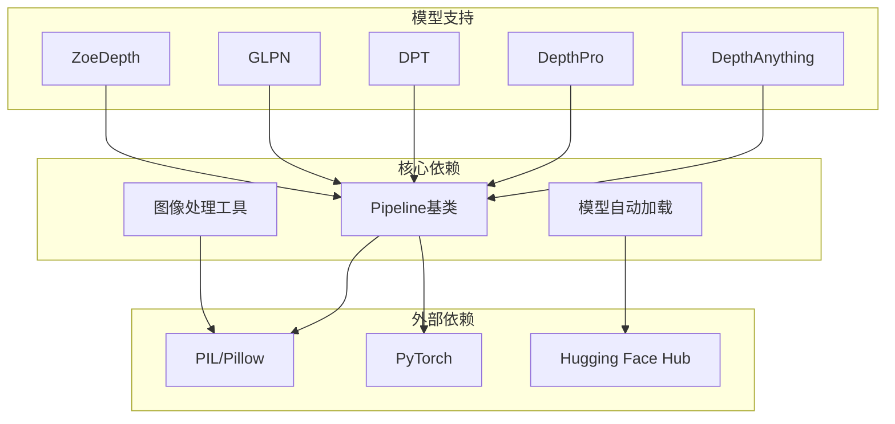

# 深度估计Pipeline

<cite>
**本文档中引用的文件**
- [depth_estimation.py](file://src/transformers/pipelines/depth_estimation.py)
- [test_pipelines_depth_estimation.py](file://tests/pipelines/test_pipelines_depth_estimation.py)
- [modeling_auto.py](file://src/transformers/models/auto/modeling_auto.py)
- [base.py](file://src/transformers/pipelines/base.py)
- [modeling_glpn.py](file://src/transformers/models/glpn/modeling_glpn.py)
- [modeling_depth_anything.py](file://src/transformers/models/depth_anything/modeling_depth_anything.py)
- [modeling_depth_pro.py](file://src/transformers/models/depth_pro/modeling_depth_pro.py)
- [image_processing_dpt.py](file://src/transformers/models/dpt/image_processing_dpt.py)
</cite>

## 目录
1. [简介](#简介)
2. [项目结构](#项目结构)
3. [核心组件](#核心组件)
4. [架构概览](#架构概览)
5. [详细组件分析](#详细组件分析)
6. [依赖关系分析](#依赖关系分析)
7. [性能考虑](#性能考虑)
8. [故障排除指南](#故障排除指南)
9. [结论](#结论)

## 简介

深度估计Pipeline是Hugging Face Transformers库中专门用于单目深度估计任务的组件。该Pipeline能够从单张RGB图像预测每个像素的深度值，生成深度图作为输出。深度估计技术在计算机视觉领域具有重要应用价值，广泛应用于机器人导航、增强现实、3D重建等场景。

深度估计Pipeline基于多种先进的深度估计模型，包括Depth Anything、Depth Pro、DPT、GLPN和ZoeDepth等，为用户提供统一的接口来访问这些不同的深度估计算法。

## 项目结构

深度估计Pipeline的核心文件结构如下：

**图表来源**
- [depth_estimation.py](file://src/transformers/pipelines/depth_estimation.py#L24-L144)
- [test_pipelines_depth_estimation.py](file://tests/pipelines/test_pipelines_depth_estimation.py#L1-L162)

**章节来源**
- [depth_estimation.py](file://src/transformers/pipelines/depth_estimation.py#L1-L146)

## 核心组件

### DepthEstimationPipeline类

DepthEstimationPipeline是深度估计Pipeline的核心类，继承自基础Pipeline类，专门处理深度估计任务。该类提供了统一的接口来加载深度估计模型、处理输入图像和生成深度预测结果。

主要特性：
- 支持多种深度估计模型
- 自动图像预处理和后处理
- 批量处理能力
- 统一的输出格式

### 模型映射系统

系统通过MODEL_FOR_DEPTH_ESTIMATION_MAPPING_NAMES字典建立模型名称与具体实现之间的映射关系：

| 模型名称 | 对应类名 |
|---------|---------|
| depth_anything | DepthAnythingForDepthEstimation |
| depth_pro | DepthProForDepthEstimation |
| dpt | DPTForDepthEstimation |
| glpn | GLPNForDepthEstimation |
| prompt_depth_anything | PromptDepthAnythingForDepthEstimation |
| zoedepth | ZoeDepthForDepthEstimation |

**章节来源**
- [depth_estimation.py](file://src/transformers/pipelines/depth_estimation.py#L24-L144)
- [modeling_auto.py](file://src/transformers/models/auto/modeling_auto.py#L1147-L1154)

## 架构概览

深度估计Pipeline采用标准的Pipeline架构模式，包含以下关键阶段：

**图表来源**
- [depth_estimation.py](file://src/transformers/pipelines/depth_estimation.py#L95-L144)

## 详细组件分析

### 输入处理流程

深度估计Pipeline支持三种类型的输入：

1. **本地文件路径**：字符串形式的本地文件路径
2. **网络URL**：指向图像的HTTP/HTTPS URL
3. **PIL图像对象**：已加载的PIL图像对象

**图表来源**
- [depth_estimation.py](file://src/transformers/pipelines/depth_estimation.py#L108-L121)

### 模型推理过程

深度估计Pipeline的推理过程包含以下关键步骤：

#### 预处理阶段
- 图像加载和格式验证
- 图像尺寸调整和标准化
- 转换为适合模型输入的张量格式

#### 前向传播
- 移除目标尺寸信息
- 执行模型前向计算
- 保存目标尺寸信息

#### 后处理阶段
- 使用图像处理器进行深度估计后处理
- 归一化深度值到[0, 1]范围
- 转换为8位灰度图像

**图表来源**
- [depth_estimation.py](file://src/transformers/pipelines/depth_estimation.py#L24-L144)

**章节来源**
- [depth_estimation.py](file://src/transformers/pipelines/depth_estimation.py#L108-L144)

### 输出格式和数据结构

深度估计Pipeline的输出包含两个主要部分：

#### predicted_depth
- 类型：`torch.Tensor`
- 形状：`(1, height, width)` 或 `(batch_size, height, width)`
- 数据范围：原始深度值（可能为任意数值范围）
- 表示：每个像素的深度值，单位通常为米

#### depth
- 类型：`PIL.Image`
- 格式：8位灰度图像
- 尺寸：与输入图像相同
- 可视化：通过伪彩色映射可以直观显示深度信息

### 深度值归一化和后处理

Pipeline实现了智能的深度值归一化机制：

**图表来源**
- [depth_estimation.py](file://src/transformers/pipelines/depth_estimation.py#L130-L144)

**章节来源**
- [depth_estimation.py](file://src/transformers/pipelines/depth_estimation.py#L130-L144)

## 依赖关系分析

深度估计Pipeline的依赖关系体现了模块化设计原则：

**图表来源**
- [depth_estimation.py](file://src/transformers/pipelines/depth_estimation.py#L1-L20)
- [modeling_auto.py](file://src/transformers/models/auto/modeling_auto.py#L1147-L1154)

**章节来源**
- [depth_estimation.py](file://src/transformers/pipelines/depth_estimation.py#L1-L20)
- [modeling_auto.py](file://src/transformers/models/auto/modeling_auto.py#L1147-L1154)

## 性能考虑

### 内存优化
- 使用流式图像加载减少内存占用
- 支持批量处理提高吞吐量
- 自动设备选择（CPU/GPU）

### 推理速度优化
- 模型量化支持
- 图像尺寸适配
- 并行处理能力

### 输出质量控制
- 深度值范围验证
- 边界区域处理
- 噪声过滤机制

## 故障排除指南

### 常见问题及解决方案

#### 1. 模型加载失败
**症状**：无法加载指定的深度估计模型
**原因**：模型名称错误或网络连接问题
**解决方案**：
- 检查模型名称是否正确
- 验证网络连接状态
- 使用本地模型文件

#### 2. 内存不足错误
**症状**：处理大尺寸图像时出现OOM错误
**原因**：图像尺寸过大或批次大小不当
**解决方案**：
- 减小输入图像尺寸
- 降低批次大小
- 使用模型量化

#### 3. 深度图质量问题
**症状**：生成的深度图存在噪声或伪影
**原因**：模型选择不当或输入图像质量差
**解决方案**：
- 尝试不同的深度估计模型
- 提高输入图像分辨率
- 应用后处理滤波

#### 4. 输出格式不兼容
**症状**：输出格式不符合预期需求
**原因**：参数设置错误
**解决方案**：
- 检查输出参数配置
- 验证数据类型转换
- 使用适当的后处理

**章节来源**
- [test_pipelines_depth_estimation.py](file://tests/pipelines/test_pipelines_depth_estimation.py#L93-L161)

## 结论

深度估计Pipeline为开发者提供了一个强大而灵活的工具，用于在各种应用场景中实现单目深度估计功能。通过统一的接口设计，用户可以轻松切换不同的深度估计模型，获得高质量的深度预测结果。

该Pipeline的主要优势包括：
- **易用性**：简洁的API设计，支持多种输入格式
- **灵活性**：支持多种深度估计模型和配置选项
- **可扩展性**：模块化架构便于添加新的模型支持
- **性能**：优化的处理流程确保高效的推理性能

随着深度学习技术的不断发展，深度估计Pipeline将继续演进，为计算机视觉应用提供更多可能性。