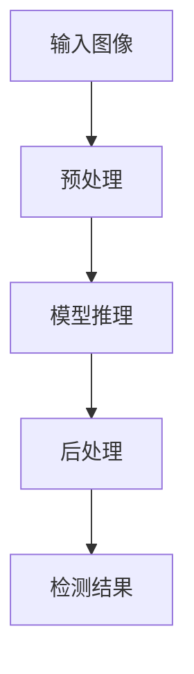

# 目标检测Pipeline

<cite>
**本文档中引用的文件**
- [object_detection.py](file://src/transformers/pipelines/object_detection.py)
- [base.py](file://src/transformers/pipelines/base.py)
- [image_processing_detr.py](file://src/transformers/models/detr/image_processing_detr.py)
- [image_processing_utils.py](file://src/transformers/image_processing_utils.py)
- [modeling_detr.py](file://src/transformers/models/detr/modeling_detr.py)
- [modeling_yolos.py](file://src/transformers/models/yolos/modeling_yolos.py)
- [run_object_detection.py](file://examples/pytorch/object-detection/run_object_detection.py)
- [README.md](file://examples/pytorch/object-detection/README.md)
</cite>

## 目录
1. [简介](#简介)
2. [核心组件](#核心组件)
3. [架构概述](#架构概述)
4. [详细组件分析](#详细组件分析)
5. [后处理机制](#后处理机制)
6. [多模型支持](#多模型支持)
7. [批处理与优化](#批处理与优化)
8. [实际应用示例](#实际应用示例)
9. [常见问题与解决方案](#常见问题与解决方案)
10. [结论](#结论)

## 简介
目标检测Pipeline是transformers库中用于执行对象检测任务的核心组件，它能够识别图像中的多个对象并返回其边界框、类别标签和置信度分数。该Pipeline支持多种先进的检测模型，如DETR和YOLOS，通过统一的接口简化了目标检测的实现过程。它不仅提供了开箱即用的功能，还允许用户自定义检测参数，以适应不同的应用场景。本文档将深入探讨ObjectDetectionPipeline的内部工作机制，包括边界框解码、非极大值抑制（NMS）算法和置信度阈值过滤等关键技术，以及如何处理多目标检测场景和输出结果的数据结构。

## 核心组件
目标检测Pipeline的核心组件包括预处理、模型推理和后处理三个阶段。在预处理阶段，输入图像被加载并转换为模型所需的格式，包括调整大小、归一化和张量转换。模型推理阶段利用预训练的检测模型对图像进行分析，生成原始的检测结果。后处理阶段则负责将这些原始结果转换为用户友好的格式，包括边界框解码、非极大值抑制和置信度阈值过滤。整个流程通过Pipeline的`__call__`方法协调执行，确保了从输入到输出的无缝衔接。

**Section sources**
- [object_detection.py](file://src/transformers/pipelines/object_detection.py#L1-L197)

## 架构概述
目标检测Pipeline的架构设计遵循模块化原则，各组件之间通过清晰的接口进行通信。整体架构可以分为输入处理、特征提取、对象检测和结果输出四个主要部分。输入处理负责接收和准备图像数据；特征提取利用预训练的视觉模型提取图像特征；对象检测模块执行实际的检测任务，生成候选框和类别预测；结果输出则对检测结果进行后处理，生成最终的检测报告。这种分层架构不仅提高了代码的可维护性，还便于集成新的检测模型和算法。



**Diagram sources**
- [object_detection.py](file://src/transformers/pipelines/object_detection.py#L1-L197)

## 详细组件分析
### 预处理组件分析
预处理组件负责将原始图像转换为模型可以处理的格式。它首先使用`load_image`函数加载图像，然后通过`image_processor`进行必要的图像变换，如调整大小和归一化。预处理过程中还会计算目标尺寸，以便在后处理阶段将边界框坐标转换回原始图像尺寸。

**Section sources**
- [object_detection.py](file://src/transformers/pipelines/object_detection.py#L1-L197)

### 模型推理组件分析
模型推理组件是目标检测Pipeline的核心，它利用预训练的检测模型对图像进行分析。对于不同的检测模型，如DETR和YOLOS，该组件能够自动适配相应的模型架构和输出格式。模型推理的结果通常包括边界框坐标、类别预测和置信度分数，这些结果将被传递给后处理组件进行进一步处理。

**Section sources**
- [object_detection.py](file://src/transformers/pipelines/object_detection.py#L1-L197)

### 后处理组件分析
后处理组件负责将模型推理的原始结果转换为最终的检测输出。它执行边界框解码、非极大值抑制和置信度阈值过滤等操作，以提高检测结果的质量。后处理过程中还会将边界框坐标从模型的输入尺寸转换回原始图像尺寸，确保检测结果的准确性。

**Section sources**
- [object_detection.py](file://src/transformers/pipelines/object_detection.py#L1-L197)

## 后处理机制
### 边界框解码
边界框解码是将模型输出的归一化坐标转换为原始图像坐标的过程。在DETR等模型中，边界框通常以中心点坐标和宽高比的形式输出，需要通过特定的转换公式将其转换为左上角和右下角坐标。这一过程确保了检测结果能够准确地映射到原始图像上。

**Section sources**
- [image_processing_detr.py](file://src/transformers/models/detr/image_processing_detr.py#L0-L199)

### 非极大值抑制
非极大值抑制（NMS）是一种用于消除冗余检测框的算法。当多个检测框重叠且指向同一对象时，NMS会选择置信度最高的框并抑制其他重叠框。这一过程显著减少了误检，提高了检测结果的清晰度和准确性。

**Section sources**
- [image_processing_utils.py](file://src/transformers/image_processing_utils.py#L0-L200)

### 置信度阈值过滤
置信度阈值过滤是通过设定一个最小置信度阈值来筛选检测结果的方法。只有当检测框的置信度高于该阈值时，才会被保留为有效检测。这一机制有助于过滤掉低质量的检测结果，提高整体检测性能。

**Section sources**
- [object_detection.py](file://src/transformers/pipelines/object_detection.py#L1-L197)

## 多模型支持
目标检测Pipeline支持多种检测模型，包括DETR、YOLOS等。每种模型都有其独特的架构和特点，但Pipeline通过统一的接口使它们的使用变得简单一致。例如，DETR采用基于Transformer的架构，能够处理长距离依赖关系；而YOLOS则基于Vision Transformer，适用于大规模图像数据集。用户可以根据具体需求选择合适的模型。

**Section sources**
- [modeling_detr.py](file://src/transformers/models/detr/modeling_detr.py#L0-L199)
- [modeling_yolos.py](file://src/transformers/models/yolos/modeling_yolos.py#L0-L199)

## 批处理与优化
目标检测Pipeline支持批处理，可以同时处理多张图像，从而提高处理效率。批处理过程中，所有图像会被统一调整到相同的尺寸，并打包成一个批次进行模型推理。此外，Pipeline还实现了多种优化策略，如异步图像加载和内存管理，以进一步提升性能。

**Section sources**
- [base.py](file://src/transformers/pipelines/base.py#L0-L200)

## 实际应用示例
### 基本使用
使用目标检测Pipeline的基本方法非常简单。首先，通过`pipeline`函数创建一个检测器实例，然后调用该实例对图像进行检测。以下是一个使用DETR模型进行目标检测的示例：

```python
from transformers import pipeline

detector = pipeline(model="facebook/detr-resnet-50")
result = detector("https://example.com/image.jpg")
```

**Section sources**
- [README.md](file://examples/pytorch/object-detection/README.md#L0-L233)

### 自定义参数
用户可以通过传递额外的参数来自定义检测行为。例如，可以设置置信度阈值来控制检测结果的严格程度：

```python
result = detector("https://example.com/image.jpg", threshold=0.8)
```

**Section sources**
- [object_detection.py](file://src/transformers/pipelines/object_detection.py#L1-L197)

### 结果可视化
检测结果可以通过简单的代码进行可视化。以下是一个使用PIL库绘制检测框的示例：

```python
from PIL import ImageDraw

draw = ImageDraw.Draw(image)
for box in result:
    draw.rectangle(box['box'].values(), outline="red", width=2)
```

**Section sources**
- [README.md](file://examples/pytorch/object-detection/README.md#L0-L233)

## 常见问题与解决方案
### 漏检问题
漏检通常是由于置信度阈值设置过高或模型训练不足导致的。解决方法包括降低置信度阈值或使用更强大的预训练模型。

### 误检问题
误检可能是由于背景噪声或模型过拟合引起的。可以通过增加训练数据多样性或调整NMS参数来改善。

### 边界框不准确
边界框不准确可能源于模型架构限制或训练数据标注误差。优化模型架构或提高标注质量可以有效解决此问题。

**Section sources**
- [README.md](file://examples/pytorch/object-detection/README.md#L0-L233)

## 结论
目标检测Pipeline提供了一个强大而灵活的框架，用于执行对象检测任务。通过深入理解其内部工作机制，用户可以更好地利用这一工具解决实际问题。无论是简单的应用场景还是复杂的工业级项目，目标检测Pipeline都能提供可靠的支持。