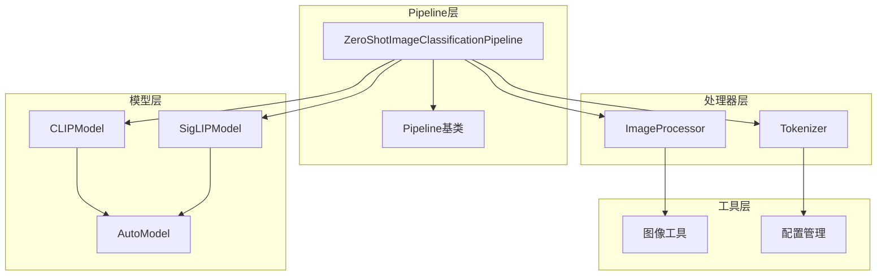
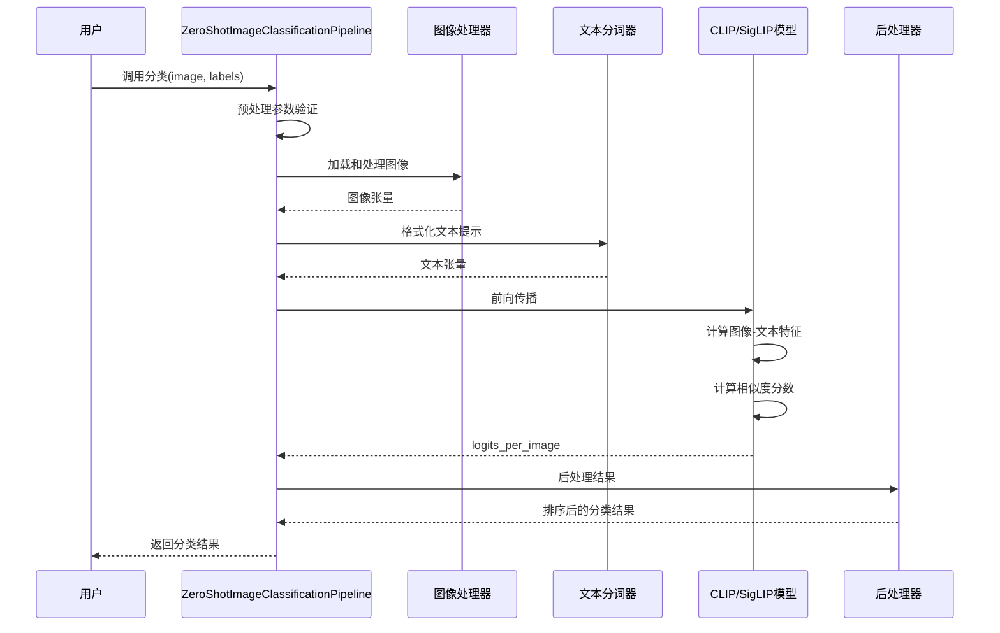
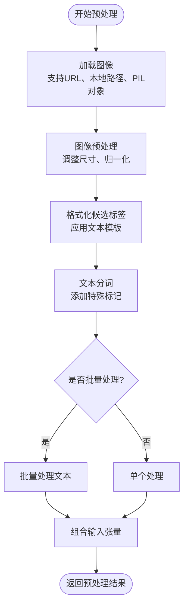
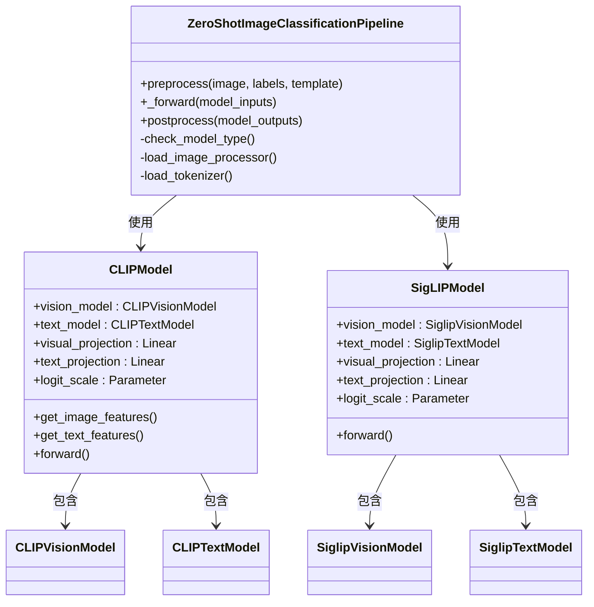
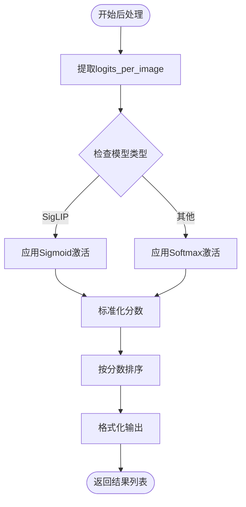
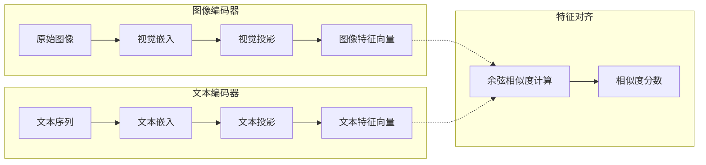
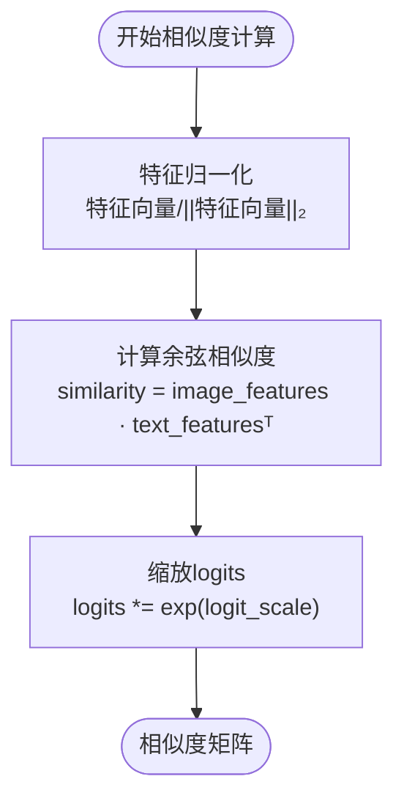
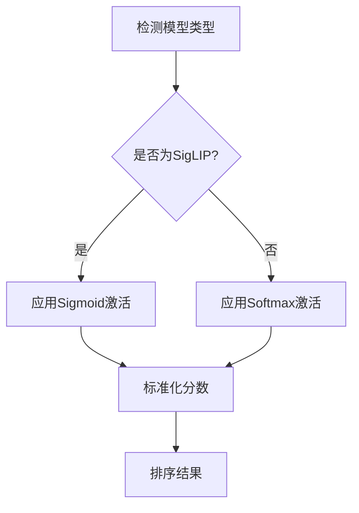

# 零样本图像分类Pipeline

<cite>
**本文档中引用的文件**
- [zero_shot_image_classification.py](file://src/transformers/pipelines/zero_shot_image_classification.py)
- [modeling_clip.py](file://src/transformers/models/clip/modeling_clip.py)
- [modeling_siglip.py](file://src/transformers/models/siglip/modeling_siglip.py)
- [modeling_auto.py](file://src/transformers/models/auto/modeling_auto.py)
- [zero_shot_classification.py](file://src/transformers/pipelines/zero_shot_classification.py)
- [test_pipelines_zero_shot_image_classification.py](file://tests/pipelines/test_pipelines_zero_shot_image_classification.py)
</cite>

## 目录
1. [简介](#简介)
2. [项目结构](#项目结构)
3. [核心组件](#核心组件)
4. [架构概览](#架构概览)
5. [详细组件分析](#详细组件分析)
6. [跨模态推理机制](#跨模态推理机制)
7. [相似度计算方法](#相似度计算方法)
8. [实际使用示例](#实际使用示例)
9. [性能考虑](#性能考虑)
10. [故障排除指南](#故障排除指南)
11. [结论](#结论)

## 简介

零样本图像分类Pipeline是Hugging Face Transformers库中的一个重要功能，它允许用户在没有特定训练数据的情况下对图像进行分类。该Pipeline基于CLIP（Contrastive Language-Image Pre-training）模型的跨模态能力，通过文本编码器和图像编码器的联合特征表示来计算图像与候选标签之间的相似度。

这种零样本学习方法的核心优势在于：
- **无需特定领域训练数据**：可以直接对未见过的类别进行分类
- **灵活的标签定义**：用户可以动态指定任何候选标签
- **跨模态语义理解**：利用文本描述来指导图像分类
- **强大的泛化能力**：能够处理各种复杂的视觉概念

## 项目结构

零样本图像分类Pipeline的实现分布在多个模块中：



**图表来源**
- [zero_shot_image_classification.py](file://src/transformers/pipelines/zero_shot_image_classification.py#L29-L201)
- [modeling_clip.py](file://src/transformers/models/clip/modeling_clip.py#L742-L936)
- [modeling_siglip.py](file://src/transformers/models/siglip/modeling_siglip.py#L1-L199)

**章节来源**
- [zero_shot_image_classification.py](file://src/transformers/pipelines/zero_shot_image_classification.py#L1-L203)

## 核心组件

### ZeroShotImageClassificationPipeline类

这是零样本图像分类的主要入口点，继承自基础Pipeline类并实现了专门的预处理、前向传播和后处理逻辑。

主要特性：
- 支持单张和批量图像输入
- 自动处理图像加载和格式转换
- 提供灵活的文本提示模板系统
- 支持多种CLIP变体模型

### 模型映射系统

系统支持多种零样本图像分类模型：

| 模型类型 | 模型名称 | 特点 |
|---------|---------|------|
| CLIP | CLIPModel | 基础对比语言-图像预训练模型 |
| SigLIP | SiglipModel | 改进的对比语言-图像预训练模型 |
| AltCLIP | AltCLIPModel | 多语言支持的CLIP变体 |
| BLIP | BlipModel | 图像-文本预训练模型 |

**章节来源**
- [zero_shot_image_classification.py](file://src/transformers/pipelines/zero_shot_image_classification.py#L29-L81)
- [modeling_auto.py](file://src/transformers/models/auto/modeling_auto.py#L1675-L1689)

## 架构概览

零样本图像分类Pipeline采用经典的流水线架构，包含以下关键步骤：



**图表来源**
- [zero_shot_image_classification.py](file://src/transformers/pipelines/zero_shot_image_classification.py#L120-L201)

## 详细组件分析

### 预处理阶段

预处理阶段负责将原始输入转换为模型可接受的格式：



**图表来源**
- [zero_shot_image_classification.py](file://src/transformers/pipelines/zero_shot_image_classification.py#L120-L150)

#### 图像处理流程

图像处理包括以下步骤：
1. **图像加载**：支持多种输入格式（URL、本地文件、PIL对象）
2. **尺寸调整**：根据模型要求调整图像尺寸
3. **归一化**：应用标准的图像归一化
4. **张量转换**：转换为PyTorch张量格式

#### 文本处理流程

文本处理涉及：
1. **模板应用**：将候选标签插入到文本模板中
2. **分词处理**：使用适当的分词器处理文本
3. **填充策略**：根据模型类型选择合适的填充策略
4. **长度限制**：对长文本进行截断处理

**章节来源**
- [zero_shot_image_classification.py](file://src/transformers/pipelines/zero_shot_image_classification.py#L120-L150)

### 前向传播阶段

前向传播阶段执行核心的跨模态推理：



**图表来源**
- [zero_shot_image_classification.py](file://src/transformers/pipelines/zero_shot_image_classification.py#L152-L170)
- [modeling_clip.py](file://src/transformers/models/clip/modeling_clip.py#L742-L936)

**章节来源**
- [zero_shot_image_classification.py](file://src/transformers/pipelines/zero_shot_image_classification.py#L152-L170)

### 后处理阶段

后处理阶段负责将模型输出转换为用户友好的格式：



**图表来源**
- [zero_shot_image_classification.py](file://src/transformers/pipelines/zero_shot_image_classification.py#L172-L201)

**章节来源**
- [zero_shot_image_classification.py](file://src/transformers/pipelines/zero_shot_image_classification.py#L172-L201)

## 跨模态推理机制

零样本图像分类的核心在于跨模态推理，即将图像和文本映射到共同的语义空间中进行比较。

### 特征提取机制



**图表来源**
- [modeling_clip.py](file://src/transformers/models/clip/modeling_clip.py#L850-L936)

### CLIP模型的工作原理

CLIP模型通过对比学习训练图像-文本匹配任务：

1. **图像编码**：将图像转换为固定维度的特征向量
2. **文本编码**：将文本描述转换为对应的特征向量
3. **特征对齐**：在共享的嵌入空间中对齐图像和文本特征
4. **相似度计算**：计算图像特征与所有文本特征之间的余弦相似度

### SigLIP模型的改进

SigLIP在CLIP基础上进行了多项改进：
- 更大的训练数据规模
- 改进的训练目标函数
- 更好的零样本性能
- 支持更长的文本序列

**章节来源**
- [modeling_clip.py](file://src/transformers/models/clip/modeling_clip.py#L850-L936)
- [modeling_siglip.py](file://src/transformers/models/siglip/modeling_siglip.py#L1-L199)

## 相似度计算方法

### 余弦相似度计算

零样本图像分类使用余弦相似度来衡量图像和文本特征之间的相似性：



**图表来源**
- [modeling_clip.py](file://src/transformers/models/clip/modeling_clip.py#L850-L936)

### 分数计算差异

不同模型采用不同的分数计算方法：

| 模型类型 | 分数计算方法 | 输出范围 | 归一化方式 |
|---------|-------------|----------|-----------|
| CLIP | softmax(logits) | [0, 1] | 所有标签总和为1 |
| SigLIP | sigmoid(logits) | [0, 1] | 单独归一化每个标签 |

### 特殊处理机制

对于SigLIP模型，系统会自动检测并应用相应的处理策略：



**图表来源**
- [zero_shot_image_classification.py](file://src/transformers/pipelines/zero_shot_image_classification.py#L172-L190)

**章节来源**
- [zero_shot_image_classification.py](file://src/transformers/pipelines/zero_shot_image_classification.py#L172-L190)

## 实际使用示例

### 基础使用示例

以下是零样本图像分类的基本使用方法：

```python
# 基础分类示例
from transformers import pipeline

# 创建分类器
classifier = pipeline("zero-shot-image-classification", 
                     model="google/siglip-so400m-patch14-384")

# 对单张图像进行分类
result = classifier(
    "https://example.com/image.jpg",
    candidate_labels=["动物", "风景", "建筑"]
)

# 批量分类
results = classifier(
    ["image1.jpg", "image2.jpg", "image3.jpg"],
    candidate_labels=["猫", "狗", "鸟"]
)
```

### 自定义文本提示模板

用户可以通过自定义文本提示模板来优化分类效果：

```python
# 使用自定义模板
result = classifier(
    image,
    candidate_labels=["黑白摄影", "彩色照片", "油画"],
    hypothesis_template="这是一张{}的照片"
)

# 不使用模板（直接使用标签）
result = classifier(
    image,
    candidate_labels=["猫", "狗", "鸟"],
    hypothesis_template="{}"
)
```

### 多标签场景处理

虽然零样本图像分类本质上是单标签任务，但可以通过阈值设置实现多标签分类：

```python
# 设置阈值过滤低置信度结果
high_confidence_results = [
    item for item in result 
    if item['score'] > 0.3
]
```

### 性能优化技巧

```python
# 批量处理优化
results = classifier(
    images,
    candidate_labels=labels,
    batch_size=8,  # 控制批次大小
    timeout=30.0   # 设置超时时间
)

# 使用GPU加速
classifier = pipeline(
    "zero-shot-image-classification",
    model="google/siglip-so400m-patch14-384",
    device=0  # 使用GPU
)
```

**章节来源**
- [test_pipelines_zero_shot_image_classification.py](file://tests/pipelines/test_pipelines_zero_shot_image_classification.py#L171-L203)

## 性能考虑

### 模型选择建议

不同模型在性能和效率方面各有特点：

| 模型 | 参数量 | 推理速度 | 零样本准确率 | 内存需求 |
|------|--------|----------|-------------|----------|
| CLIP-B/32 | ~300M | 快 | 中等 | 低 |
| CLIP-L/14 | ~600M | 中等 | 高 | 中等 |
| SigLIP-B/16 | ~300M | 快 | 高 | 低 |
| SigLIP-L/14 | ~600M | 中等 | 很高 | 中等 |

### 批处理优化

```python
# 优化批处理大小
def optimize_batch_size(classifier, images, labels):
    batch_sizes = [1, 2, 4, 8, 16]
    best_time = float('inf')
    best_batch_size = 1
    
    for batch_size in batch_sizes:
        try:
            start_time = time.time()
            results = classifier(images, labels, batch_size=batch_size)
            end_time = time.time()
            
            if end_time - start_time < best_time:
                best_time = end_time - start_time
                best_batch_size = batch_size
        except:
            continue
    
    return best_batch_size
```

### 内存管理

对于大规模图像分类任务，建议：
- 使用较小的批次大小
- 及时释放不需要的中间结果
- 考虑使用混合精度推理

## 故障排除指南

### 常见问题及解决方案

#### 1. 标签歧义问题

**问题**：候选标签之间存在语义重叠导致分类不准确

**解决方案**：
```python
# 使用更具体的标签
candidate_labels = ["黑色猫", "白色猫", "虎斑猫"]  # 比 "猫" 更具体

# 添加上下文描述
candidate_labels = ["黑白摄影风格", "彩色写实风格", "抽象艺术风格"]
```

#### 2. 相似度分数偏差

**问题**：某些标签获得异常高的分数

**解决方案**：
```python
# 应用分数校正
def correct_scores(results):
    total_score = sum(item['score'] for item in results)
    if total_score > 1.0:
        return [
            {'label': item['label'], 'score': item['score'] / total_score}
            for item in results
        ]
    return results
```

#### 3. 模型兼容性问题

**问题**：使用的模型不支持零样本图像分类

**解决方案**：
```python
# 检查模型兼容性
from transformers import AutoModelForZeroShotImageClassification

try:
    model = AutoModelForZeroShotImageClassification.from_pretrained("model_name")
except ValueError as e:
    print("该模型不支持零样本图像分类:", e)
```

#### 4. 输入格式错误

**问题**：图像或标签格式不正确

**解决方案**：
```python
# 图像格式验证
def validate_image_input(image):
    if isinstance(image, str):
        # 检查是否为有效URL或文件路径
        if not (image.startswith('http') or os.path.exists(image)):
            raise ValueError("无效的图像路径或URL")
    elif not isinstance(image, Image.Image):
        raise ValueError("图像必须是URL、文件路径或PIL.Image对象")
    
    return image

# 标签格式验证
def validate_labels(labels):
    if not labels or not isinstance(labels, (list, tuple)):
        raise ValueError("候选标签必须是非空列表")
    return labels
```

### 调试技巧

```python
# 启用详细日志
import logging
logging.basicConfig(level=logging.DEBUG)

# 检查模型配置
print(f"模型类型: {classifier.model.config.model_type}")
print(f"隐藏层维度: {classifier.model.config.hidden_size}")

# 分析中间结果
def debug_pipeline(classifier, image, labels):
    # 获取预处理后的输入
    inputs = classifier.preprocess(image, labels)
    
    # 获取模型输出
    outputs = classifier._forward(inputs)
    
    # 检查logits形状
    print(f"logits形状: {outputs['logits'].shape}")
    
    return outputs
```

**章节来源**
- [zero_shot_image_classification.py](file://src/transformers/pipelines/zero_shot_image_classification.py#L100-L120)

## 结论

零样本图像分类Pipeline代表了计算机视觉领域的重要进展，它突破了传统监督学习的限制，使模型能够在没有特定训练数据的情况下理解和分类新的视觉概念。

### 主要优势

1. **灵活性**：用户可以动态定义任何候选标签
2. **泛化能力**：能够处理未见过的类别和概念
3. **跨模态理解**：结合视觉和语言信息进行推理
4. **易于使用**：简洁的API设计降低了使用门槛

### 技术创新

- **跨模态特征对齐**：通过共同的嵌入空间实现图像和文本的语义对齐
- **对比学习**：利用对比损失函数学习有意义的特征表示
- **可扩展架构**：支持多种CLIP变体和未来的新模型

### 应用前景

零样本图像分类在以下领域具有广阔的应用前景：
- **内容审核**：识别未知类型的有害内容
- **医疗影像分析**：辅助诊断新出现的疾病模式
- **工业质检**：检测新产品中的缺陷
- **安全监控**：识别异常行为和物体

随着模型能力和算法的不断进步，零样本图像分类将在更多实际应用场景中发挥重要作用，为计算机视觉技术的发展开辟新的道路。