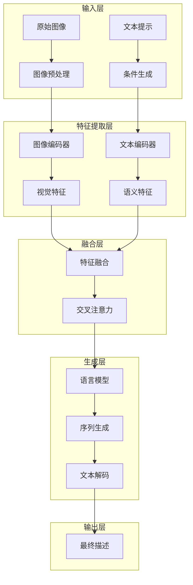
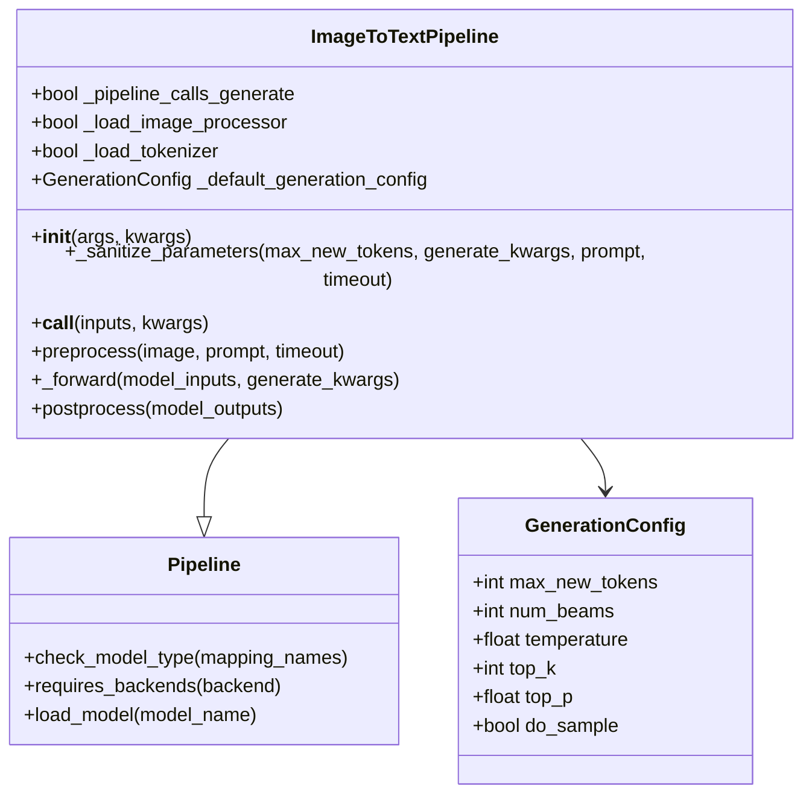
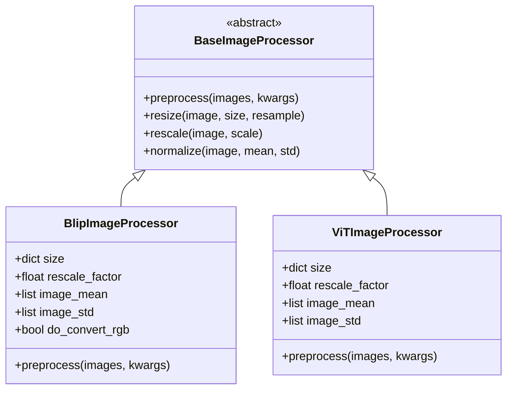
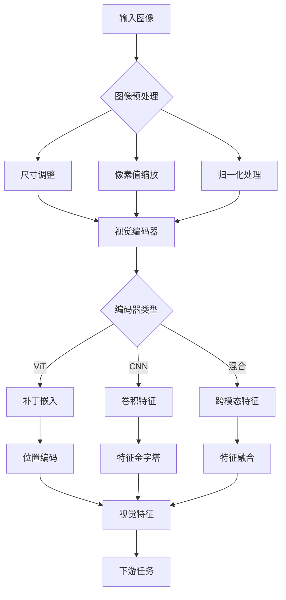
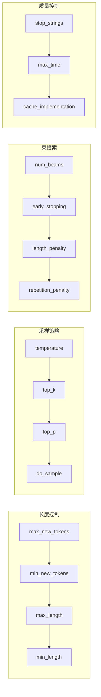
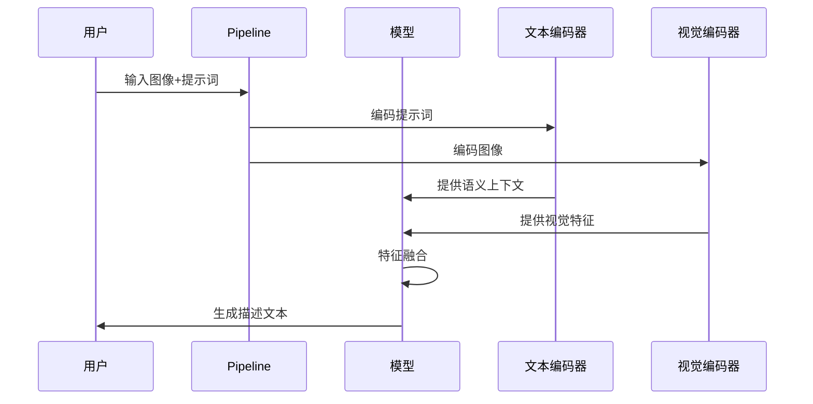
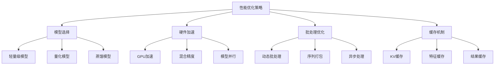
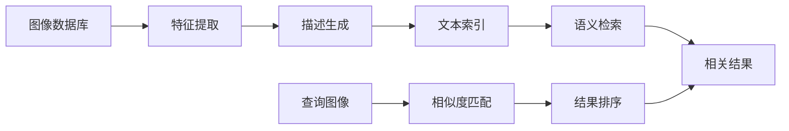

# 图像描述生成Pipeline

<cite>
**本文档中引用的文件**
- [image_to_text.py](file://src/transformers/pipelines/image_to_text.py)
- [image_text_to_text.py](file://src/transformers/pipelines/image_text_to_text.py)
- [configuration_utils.py](file://src/transformers/generation/configuration_utils.py)
- [image_processing_blip.py](file://src/transformers/models/blip/image_processing_blip.py)
- [image_processing_vit.py](file://src/transformers/models/vit/image_processing_vit.py)
- [test_pipelines_image_to_text.py](file://tests/pipelines/test_pipelines_image_to_text.py)
- [modeling_auto.py](file://src/transformers/models/auto/modeling_auto.py)
</cite>

## 目录
1. [简介](#简介)
2. [系统架构概述](#系统架构概述)
3. [核心组件分析](#核心组件分析)
4. [图像特征提取机制](#图像特征提取机制)
5. [文本生成参数配置](#文本生成参数配置)
6. [实际应用示例](#实际应用示例)
7. [性能优化与限制](#性能优化与限制)
8. [辅助技术应用](#辅助技术应用)
9. [故障排除指南](#故障排除指南)
10. [总结](#总结)

## 简介

图像描述生成Pipeline是transformers库中一个强大的多模态系统，专门用于从视觉输入生成自然语言描述。该系统结合了计算机视觉和自然语言处理技术，能够将图像转换为连贯、准确的文本描述，广泛应用于辅助技术、内容索引和智能交互等领域。

该Pipeline支持多种先进的图像编码器，包括基于CNN的传统卷积神经网络和基于Transformer的视觉变换器(ViTs)，并通过精心设计的生成策略确保输出文本的质量和相关性。

## 系统架构概述

图像描述生成Pipeline采用模块化架构设计，主要包含以下几个关键层次：



**图表来源**
- [image_to_text.py](file://src/transformers/pipelines/image_to_text.py#L1-L50)
- [configuration_utils.py](file://src/transformers/generation/configuration_utils.py#L1-L100)

**章节来源**
- [image_to_text.py](file://src/transformers/pipelines/image_to_text.py#L1-L230)
- [modeling_auto.py](file://src/transformers/models/auto/modeling_auto.py#L1014-L1039)

## 核心组件分析

### ImageToTextPipeline类

ImageToTextPipeline是图像描述生成的核心类，继承自基础Pipeline类并实现了专门的图像到文本转换功能。



**图表来源**
- [image_to_text.py](file://src/transformers/pipelines/image_to_text.py#L40-L80)
- [configuration_utils.py](file://src/transformers/generation/configuration_utils.py#L100-L200)

该类的主要特性包括：

1. **默认生成配置**：设置最大新令牌数为256，平衡生成质量和计算效率
2. **多模态输入处理**：支持图像和可选的文本提示输入
3. **批处理支持**：能够同时处理单个或批量图像输入
4. **灵活的参数配置**：允许用户自定义生成参数

**章节来源**
- [image_to_text.py](file://src/transformers/pipelines/image_to_text.py#L40-L120)

### 图像处理器系统

系统支持多种图像处理器，每种都针对特定的视觉模型进行了优化：



**图表来源**
- [image_processing_blip.py](file://src/transformers/models/blip/image_processing_blip.py#L45-L100)
- [image_processing_vit.py](file://src/transformers/models/vit/image_processing_vit.py#L43-L100)

**章节来源**
- [image_processing_blip.py](file://src/transformers/models/blip/image_processing_blip.py#L45-L288)
- [image_processing_vit.py](file://src/transformers/models/vit/image_processing_vit.py#L43-L279)

## 图像特征提取机制

### 视觉编码器类型

系统支持多种视觉编码器，每种都有其独特的优势：

| 编码器类型 | 模型示例 | 特点 | 适用场景 |
|-----------|---------|------|----------|
| ViT (Vision Transformer) | BLIP, BLIP-2 | 基于Transformer架构，全局感受野 | 复杂场景理解 |
| CNN (卷积神经网络) | GIT, ImageGPT | 局部特征提取能力强 | 精细细节识别 |
| 混合架构 | CLIP, ALIGN | 跨模态特征对齐 | 多模态任务 |

### 特征提取流程



**图表来源**
- [image_processing_blip.py](file://src/transformers/models/blip/image_processing_blip.py#L150-L250)
- [image_processing_vit.py](file://src/transformers/models/vit/image_processing_vit.py#L150-L250)

**章节来源**
- [image_processing_blip.py](file://src/transformers/models/blip/image_processing_blip.py#L150-L288)
- [image_processing_vit.py](file://src/transformers/models/vit/image_processing_vit.py#L150-L279)

## 文本生成参数配置

### 生成策略配置

系统提供了丰富的生成参数来控制文本生成的质量和风格：



**图表来源**
- [configuration_utils.py](file://src/transformers/generation/configuration_utils.py#L100-L200)

### 关键参数详解

| 参数名称 | 默认值 | 功能描述 | 调优建议 |
|---------|--------|----------|----------|
| max_new_tokens | 256 | 最大生成令牌数 | 根据应用场景调整，一般32-512 |
| temperature | 1.0 | 采样温度 | 低值(0.1-0.7)更确定，高值(0.8-1.5)更创造性 |
| top_k | 50 | 保留最高概率词汇数 | 小模型用较小值(10-30)，大模型用较大值(50-100) |
| top_p | 1.0 | 核采样阈值 | 推荐范围0.9-0.95，平衡质量和多样性 |
| num_beams | 1 | 束搜索数量 | 1表示贪婪搜索，2-8提升质量但增加计算成本 |

**章节来源**
- [configuration_utils.py](file://src/transformers/generation/configuration_utils.py#L100-L300)

### 条件生成机制

系统支持基于文本提示的条件生成，允许用户指定特定的描述风格或主题：



**图表来源**
- [image_to_text.py](file://src/transformers/pipelines/image_to_text.py#L140-L200)

**章节来源**
- [image_to_text.py](file://src/transformers/pipelines/image_to_text.py#L140-L230)

## 实际应用示例

### 基础图像描述生成

以下展示了如何使用不同的模型进行基础图像描述生成：

```python
# 基础使用示例
from transformers import pipeline

# 加载BLIP模型
captioner = pipeline("image-to-text", model="Salesforce/blip-image-captioning-base")

# 处理单张图像
image_path = "path/to/image.jpg"
result = captioner(image_path)
print(result[0]['generated_text'])

# 批量处理
images = [image_path1, image_path2, image_path3]
results = captioner(images)
```

### 条件生成示例

```python
# 使用提示词引导生成
captioner = pipeline("image-to-text", model="Salesforce/blip-image-captioning-base")

# 引导生成特定风格的描述
prompt = "这是一张专业的摄影作品，"
result = captioner(image_path, prompt=prompt)

# 生成技术性描述
technical_prompt = "从技术角度描述这张图像，"
technical_result = captioner(image_path, prompt=technical_prompt)
```

### 高级参数配置

```python
# 自定义生成参数
custom_config = {
    "max_new_tokens": 100,
    "temperature": 0.7,
    "top_p": 0.9,
    "do_sample": True,
    "num_beams": 3
}

result = captioner(image_path, generate_kwargs=custom_config)
```

**章节来源**
- [test_pipelines_image_to_text.py](file://tests/pipelines/test_pipelines_image_to_text.py#L50-L150)

## 性能优化与限制

### 计算资源需求

图像描述生成系统的性能受以下因素影响：

1. **模型大小**：大型模型(如BLIP-2)需要更多GPU内存和计算时间
2. **图像分辨率**：高分辨率图像需要更多的特征提取计算
3. **生成长度**：较长的描述需要更多的解码步骤
4. **批处理大小**：适当的批处理可以提高吞吐量

### 性能优化策略



### 已知限制

1. **复杂场景理解**：对于包含多个对象或抽象概念的复杂图像，可能产生不准确的描述
2. **文化背景知识**：缺乏特定文化或专业领域的背景知识
3. **实时性能**：大型模型在实时应用中可能面临延迟问题
4. **多语言支持**：主要支持英语，其他语言的性能可能较差

**章节来源**
- [test_pipelines_image_to_text.py](file://tests/pipelines/test_pipelines_image_to_text.py#L100-L200)

## 辅助技术应用

### 视觉辅助功能

图像描述生成在辅助技术领域具有重要应用价值：

1. **视觉障碍辅助**：为视障用户提供图像内容的语音描述
2. **教育工具**：帮助特殊教育环境中的学生理解视觉材料
3. **内容无障碍**：使网站和应用程序对所有用户更具可访问性

### 内容索引和检索



### 内容创作支持

1. **创意写作辅助**：为作家提供图像灵感和描述参考
2. **社交媒体内容**：自动生成帖子描述和标签
3. **营销材料制作**：快速生成产品描述和广告文案

**章节来源**
- [image_to_text.py](file://src/transformers/pipelines/image_to_text.py#L25-L45)

## 故障排除指南

### 常见问题及解决方案

| 问题类型 | 症状 | 可能原因 | 解决方案 |
|---------|------|----------|----------|
| 内存不足 | CUDA out of memory | 模型过大或批处理过大 | 减少批处理大小或使用量化模型 |
| 生成质量差 | 描述不准确或重复 | 温度过高或参数不当 | 调整temperature和top_p参数 |
| 处理速度慢 | 响应时间过长 | 模型过大或硬件不足 | 使用轻量级模型或升级硬件 |
| 输入格式错误 | 加载失败 | 图像格式不支持 | 确保输入为PIL图像或有效路径 |

### 调试技巧

```python
# 启用详细日志
import logging
logging.basicConfig(level=logging.DEBUG)

# 检查模型配置
print(model.config)

# 验证输入格式
from transformers import load_image
image = load_image(image_path)
print(f"Image shape: {image.size}")

# 测试小规模生成
result = captioner(image_path, max_new_tokens=50)
```

**章节来源**
- [test_pipelines_image_to_text.py](file://tests/pipelines/test_pipelines_image_to_text.py#L200-L270)

## 总结

图像描述生成Pipeline代表了多模态人工智能的重要进展，它成功地将视觉理解和自然语言生成结合起来，为各种应用场景提供了强大的技术支持。通过深入理解其架构设计、特征提取机制和生成策略，开发者可以更好地利用这一工具解决实际问题。

随着模型技术的不断发展，图像描述生成系统将在准确性、效率和应用广度方面持续改进，为构建更加智能和包容的人工智能系统做出贡献。