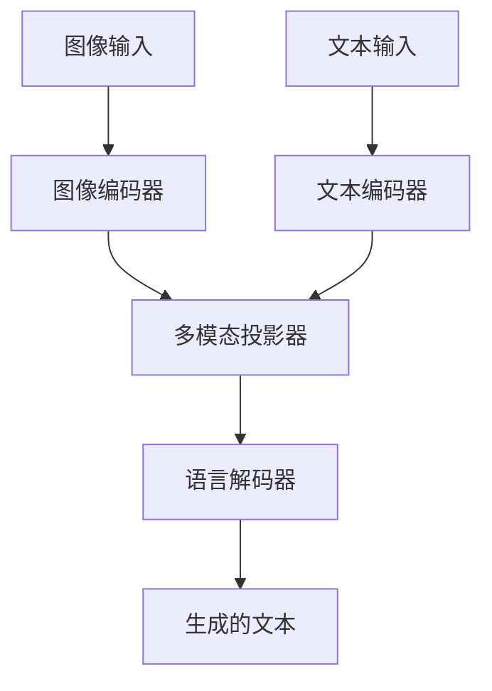
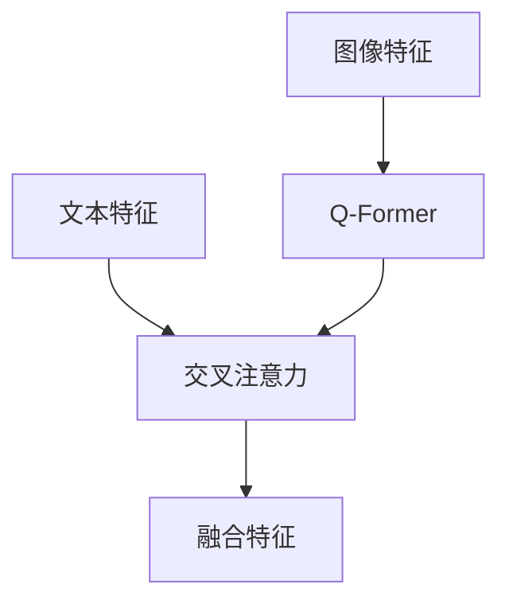
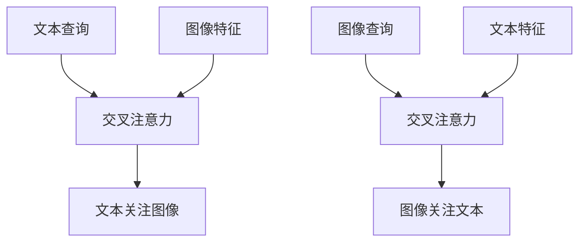

# 图文到文本生成Pipeline

<cite>
**本文档引用的文件**
- [image_text_to_text.py](file://src/transformers/pipelines/image_text_to_text.py)
- [modeling_blip_2.py](file://src/transformers/models/blip_2/modeling_blip_2.py)
- [modeling_florence2.py](file://src/transformers/models/florence2/modeling_florence2.py)
- [modeling_llava.py](file://src/transformers/models/llava/modeling_llava.py)
- [modeling_kosmos2_5.py](file://src/transformers/models/kosmos2_5/modeling_kosmos2_5.py)
- [modeling_grounding_dino.py](file://src/transformers/models/grounding_dino/modeling_grounding_dino.py)
- [modeling_mm_grounding_dino.py](file://src/transformers/models/mm_grounding_dino/modeling_mm_grounding_dino.py)
- [modeling_auto.py](file://src/transformers/models/auto/modeling_auto.py)
</cite>

## 目录
1. [简介](#简介)
2. [核心架构](#核心架构)
3. [多模态融合机制](#多模态融合机制)
4. [注意力机制](#注意力机制)
5. [图文输入处理](#图文输入处理)
6. [生成过程控制](#生成过程控制)
7. [应用场景](#应用场景)
8. [与其他Pipeline的对比](#与其他pipeline的对比)
9. [结论](#结论)

## 简介
图文到文本生成Pipeline是transformers库中用于处理多模态输入的核心组件，它能够结合图像和文本输入生成新的文本内容。该Pipeline支持多种先进的多模态模型，如BLIP-2、Florence2、LLaVA等，这些模型在视觉对话、图文推理和跨模态检索等任务中表现出色。通过将图像特征与文本特征在不同层次进行对齐和交互，该系统能够实现对异构数据的有效表示和处理。

**Section sources**
- [image_text_to_text.py](file://src/transformers/pipelines/image_text_to_text.py#L1-L511)

## 核心架构
图文到文本生成Pipeline的核心架构由多个组件构成，包括图像编码器、文本编码器、多模态投影器和语言解码器。图像编码器负责提取图像的视觉特征，通常基于Vision Transformer（ViT）或卷积神经网络（CNN）架构。文本编码器则负责处理输入的文本信息，通常基于Transformer架构。多模态投影器将图像特征映射到与文本特征相同的语义空间，以便进行有效的融合。最后，语言解码器根据融合后的多模态表示生成新的文本内容。

**Diagram sources**
- [modeling_blip_2.py](file://src/transformers/models/blip_2/modeling_blip_2.py#L1-L2170)
- [modeling_florence2.py](file://src/transformers/models/florence2/modeling_florence2.py#L1-L1035)

**Section sources**
- [modeling_blip_2.py](file://src/transformers/models/blip_2/modeling_blip_2.py#L1-L2170)
- [modeling_florence2.py](file://src/transformers/models/florence2/modeling_florence2.py#L1-L1035)

## 多模态融合机制
多模态融合机制是图文到文本生成Pipeline的关键，它通过将图像特征和文本特征在不同层次进行对齐和交互来实现有效的信息融合。在BLIP-2模型中，使用了Q-Former（Querying Transformer）作为中间模块，将图像特征转换为一组查询向量，然后与文本特征进行交叉注意力计算。在Florence2模型中，采用了多模态投影器将图像特征线性映射到文本特征空间，并添加位置编码以保留空间信息。LLaVA模型则通过一个简单的多层感知机（MLP）将视觉特征投影到语言模型的嵌入空间。

**Diagram sources**
- [modeling_blip_2.py](file://src/transformers/models/blip_2/modeling_blip_2.py#L1-L2170)
- [modeling_florence2.py](file://src/transformers/models/florence2/modeling_florence2.py#L1-L1035)
- [modeling_llava.py](file://src/transformers/models/llava/modeling_llava.py#L1-L486)

**Section sources**
- [modeling_blip_2.py](file://src/transformers/models/blip_2/modeling_blip_2.py#L1-L2170)
- [modeling_florence2.py](file://src/transformers/models/florence2/modeling_florence2.py#L1-L1035)
- [modeling_llava.py](file://src/transformers/models/llava/modeling_llava.py#L1-L486)

## 注意力机制
注意力机制在图文到文本生成Pipeline中起着至关重要的作用，它使语言模型能够关注图像的特定区域和输入文本的相关部分。在BLIP-2模型中，Q-Former的查询向量通过交叉注意力机制与图像特征进行交互，从而选择性地关注图像中的重要区域。在Grounding Dino模型中，实现了双向交叉注意力机制，既可以让文本关注图像，也可以让图像关注文本。这种双向交互有助于更好地理解图文之间的关系。

**Diagram sources**
- [modeling_blip_2.py](file://src/transformers/models/blip_2/modeling_blip_2.py#L1-L2170)
- [modeling_grounding_dino.py](file://src/transformers/models/grounding_dino/modeling_grounding_dino.py#L1-L2000)
- [modeling_mm_grounding_dino.py](file://src/transformers/models/mm_grounding_dino/modeling_mm_grounding_dino.py#L1-L2000)

**Section sources**
- [modeling_blip_2.py](file://src/transformers/models/blip_2/modeling_blip_2.py#L1-L2170)
- [modeling_grounding_dino.py](file://src/transformers/models/grounding_dino/modeling_grounding_dino.py#L1-L2000)
- [modeling_mm_grounding_dino.py](file://src/transformers/models/mm_grounding_dino/modeling_mm_grounding_dino.py#L1-L2000)

## 图文输入处理
图文输入处理是图文到文本生成Pipeline的第一步，它负责将原始的图像和文本输入转换为模型可以处理的格式。在transformers库中，这一过程由Processor组件完成。对于图像输入，通常需要进行预处理，如调整大小、归一化等。对于文本输入，则需要进行分词和编码。在处理图文对时，还需要将图像标记（如`<image>`）插入到文本序列中，以指示图像的位置。此外，一些模型还支持聊天格式的输入，其中包含多个角色（如用户、助手）的对话历史。

**Section sources**
- [image_text_to_text.py](file://src/transformers/pipelines/image_text_to_text.py#L1-L511)

## 生成过程控制
生成过程控制允许用户通过各种参数来调节文本生成的行为。在图文到文本生成Pipeline中，可以通过设置`max_new_tokens`参数来限制生成文本的长度。还可以通过`generate_kwargs`参数传递更复杂的生成配置，如温度、top-k采样、top-p采样等。此外，用户可以选择是否返回完整的输入文本，或者只返回新生成的部分。对于支持聊天模式的模型，还可以通过`continue_final_message`参数控制是否继续最后一个助手消息。

**Section sources**
- [image_text_to_text.py](file://src/transformers/pipelines/image_text_to_text.py#L167-L215)

## 应用场景
图文到文本生成Pipeline在多个应用场景中发挥着重要作用。在视觉对话中，它可以作为智能助手回答关于图像的问题。在图文推理中，它能够根据图像内容生成详细的描述或解释。在跨模态检索中，它可以将图像内容转换为文本查询，从而在文本数据库中进行搜索。此外，该Pipeline还可用于图像字幕生成、视觉问答、文档理解等任务。随着多模态大模型的发展，其应用范围还在不断扩大。

**Section sources**
- [image_text_to_text.py](file://src/transformers/pipelines/image_text_to_text.py#L1-L511)

## 与其他Pipeline的对比
与其他多模态Pipeline相比，图文到文本生成Pipeline具有独特的特点。与视觉问答Pipeline相比，它不仅限于回答特定问题，而是可以生成更自由的文本内容。与图像字幕生成Pipeline相比，它不仅依赖于图像信息，还可以结合额外的文本提示进行生成。与文本到图像生成Pipeline相比，它的方向是相反的，从视觉信息生成语言描述。此外，图文到文本生成Pipeline通常支持更复杂的交互模式，如多轮对话，这使得它在人机交互应用中更具优势。

**Section sources**
- [image_text_to_text.py](file://src/transformers/pipelines/image_text_to_text.py#L1-L511)
- [modeling_auto.py](file://src/transformers/models/auto/modeling_auto.py#L1014-L1066)

## 结论
图文到文本生成Pipeline是transformers库中一个强大而灵活的工具，它能够有效地结合图像和文本输入生成高质量的文本内容。通过深入理解其多模态融合机制、注意力机制和生成过程控制，开发者可以更好地利用这一工具解决各种实际问题。随着多模态人工智能技术的不断发展，图文到文本生成Pipeline将在更多领域展现出其价值。