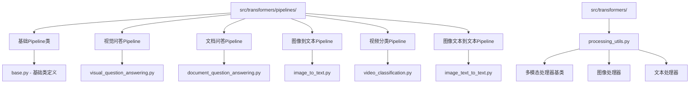
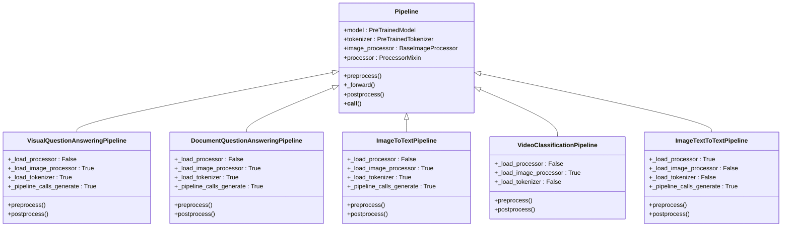
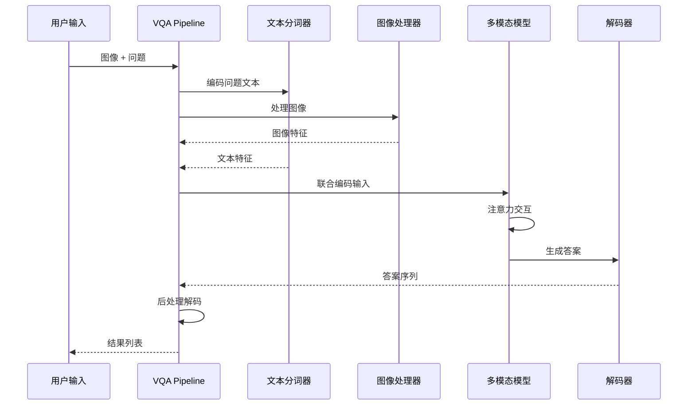
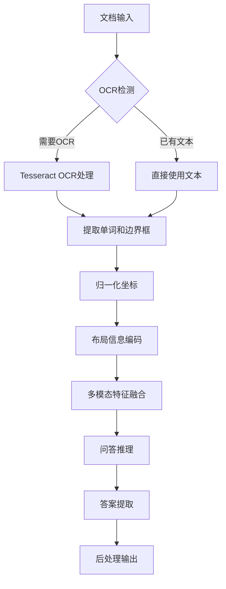
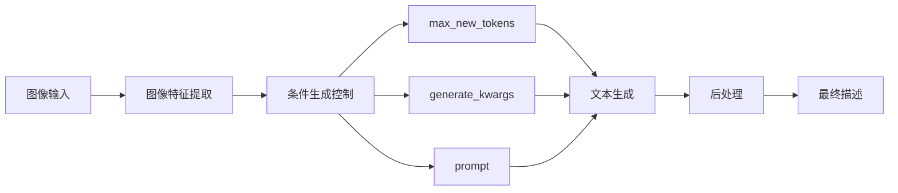
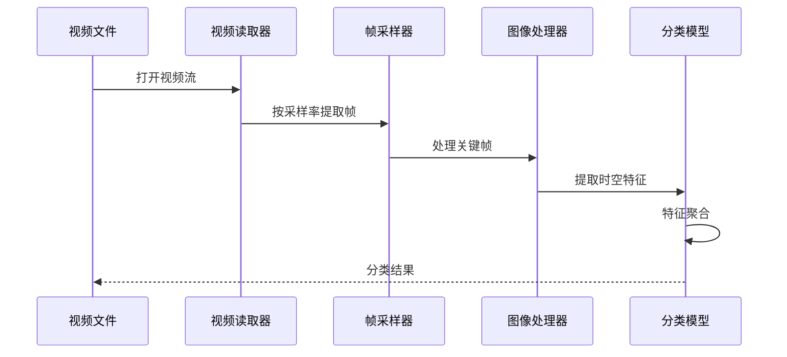
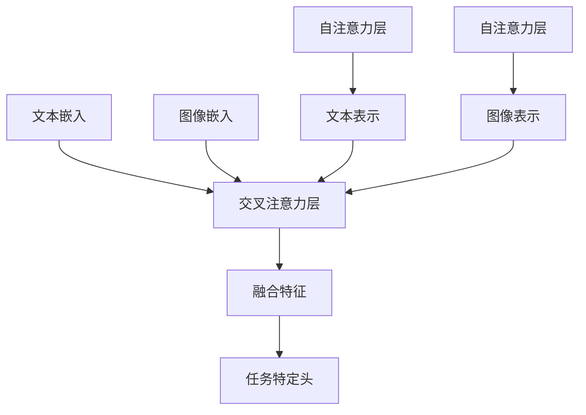

# 多模态相关Pipeline

<cite>
**本文档中引用的文件**
- [src/transformers/pipelines/__init__.py](file://src/transformers/pipelines/__init__.py)
- [src/transformers/pipelines/visual_question_answering.py](file://src/transformers/pipelines/visual_question_answering.py)
- [src/transformers/pipelines/document_question_answering.py](file://src/transformers/pipelines/document_question_answering.py)
- [src/transformers/pipelines/image_to_text.py](file://src/transformers/pipelines/image_to_text.py)
- [src/transformers/pipelines/video_classification.py](file://src/transformers/pipelines/video_classification.py)
- [src/transformers/pipelines/image_text_to_text.py](file://src/transformers/pipelines/image_text_to_text.py)
- [src/transformers/pipelines/base.py](file://src/transformers/pipelines/base.py)
- [src/transformers/processing_utils.py](file://src/transformers/processing_utils.py)
</cite>

## 目录
1. [简介](#简介)
2. [项目结构概览](#项目结构概览)
3. [核心多模态Pipeline](#核心多模态pipeline)
4. [视觉问答(VQA)Pipeline](#视觉问答vqa-pipeline)
5. [文档问答Pipeline](#文档问答pipeline)
6. [图像到文本生成Pipeline](#图像到文本生成pipeline)
7. [视频分类Pipeline](#视频分类pipeline)
8. [多模态融合机制](#多模态融合机制)
9. [性能优化与配置](#性能优化与配置)
10. [实际应用示例](#实际应用示例)
11. [故障排除指南](#故障排除指南)
12. [总结](#总结)

## 简介

transformers库提供了强大的多模态Pipeline，能够处理多种数据类型的组合输入，包括文本、图像、视频等多种模态。这些Pipeline专门设计用于处理复杂的多模态任务，如视觉问答、文档分析、图像描述生成和视频分类等。

多模态Pipeline的核心优势在于：
- **统一接口**：提供一致的API来处理不同类型的输入
- **自动预处理**：智能处理图像加载、文本编码和模态对齐
- **灵活配置**：支持多种模型架构和生成参数
- **批处理支持**：高效处理批量输入数据

## 项目结构概览

transformers库中的多模态Pipeline主要分布在以下目录结构中：



**图表来源**
- [src/transformers/pipelines/__init__.py](file://src/transformers/pipelines/__init__.py#L1-L50)
- [src/transformers/pipelines/base.py](file://src/transformers/pipelines/base.py#L1-L100)

**章节来源**
- [src/transformers/pipelines/__init__.py](file://src/transformers/pipelines/__init__.py#L1-L100)

## 核大多模态Pipeline

transformers库支持的任务类型在`SUPPORTED_TASKS`字典中定义，其中多模态任务占据重要位置：



**图表来源**
- [src/transformers/pipelines/visual_question_answering.py](file://src/transformers/pipelines/visual_question_answering.py#L15-L50)
- [src/transformers/pipelines/document_question_answering.py](file://src/transformers/pipelines/document_question_answering.py#L60-L100)
- [src/transformers/pipelines/image_to_text.py](file://src/transformers/pipelines/image_to_text.py#L25-L60)
- [src/transformers/pipelines/video_classification.py](file://src/transformers/pipelines/video_classification.py#L30-L70)
- [src/transformers/pipelines/image_text_to_text.py](file://src/transformers/pipelines/image_text_to_text.py#L100-L140)

**章节来源**
- [src/transformers/pipelines/__init__.py](file://src/transformers/pipelines/__init__.py#L150-L250)

## 视觉问答(VQA)Pipeline

视觉问答Pipeline是处理图像和文本联合输入的经典多模态任务。它能够理解图像内容并回答相关问题。

### 架构设计

VQA Pipeline采用联合编码器架构，通过注意力机制实现视觉和文本的深度融合：



**图表来源**
- [src/transformers/pipelines/visual_question_answering.py](file://src/transformers/pipelines/visual_question_answering.py#L150-L200)

### 关键特性

1. **开放式问答支持**：支持自由形式的答案生成
2. **封闭式问答模式**：从预定义选项中选择答案
3. **多答案排序**：返回多个可能答案及其置信度分数
4. **超时处理**：支持网络图像加载的超时控制

### 实现细节

VQA Pipeline的核心实现包含以下关键步骤：

| 步骤 | 功能 | 输入 | 输出 |
|------|------|------|------|
| 预处理 | 图像加载和文本编码 | 图像URL/路径、问题文本 | 模型输入张量 |
| 前向传播 | 多模态特征融合 | 联合编码特征 | 模型输出 |
| 后处理 | 答案解码和排序 | 生成序列 | 置信度分数列表 |

**章节来源**
- [src/transformers/pipelines/visual_question_answering.py](file://src/transformers/pipelines/visual_question_answering.py#L1-L213)

## 文档问答Pipeline

文档问答Pipeline专门处理PDF文档和其他文档类型的问答任务，具有独特的PDF解析和布局理解能力。

### 特殊处理流程

文档问答Pipeline需要特殊的预处理流程来处理文档特有的信息：



**图表来源**
- [src/transformers/pipelines/document_question_answering.py](file://src/transformers/pipelines/document_question_answering.py#L300-L400)

### 支持的模型类型

文档问答Pipeline支持三种主要的模型架构：

| 模型类型 | 特点 | 适用场景 |
|----------|------|----------|
| LayoutLM | 基于Transformer的布局感知模型 | 标准文档问答 |
| LayoutLMv2/v3 | 改进的布局理解和多模态融合 | 复杂文档分析 |
| VisionEncoderDecoder | 图像到文本的端到端模型 | Donut等特定模型 |

### PDF解析和表格理解

对于PDF文档，Pipeline提供了以下特殊功能：

1. **OCR集成**：自动调用Tesseract进行文字识别
2. **布局保持**：保留文档的原始布局信息
3. **表格结构理解**：识别和理解表格结构
4. **多语言支持**：支持多种语言的OCR处理

**章节来源**
- [src/transformers/pipelines/document_question_answering.py](file://src/transformers/pipelines/document_question_answering.py#L1-L545)

## 图像到文本生成Pipeline

图像到文本生成Pipeline负责将图像转换为自然语言描述，广泛应用于图像标注、内容摘要等任务。

### 生成控制机制

该Pipeline提供了丰富的生成参数控制：



**图表来源**
- [src/transformers/pipelines/image_to_text.py](file://src/transformers/pipelines/image_to_text.py#L80-L120)

### 支持的模型类型

不同的模型类型有不同的生成策略：

| 模型类型 | 生成方式 | 特殊参数 |
|----------|----------|----------|
| GIT | 条件生成 | prompt参数 |
| Pix2Struct | 表格理解 | header_text |
| VisionEncoderDecoder | 端到端生成 | 无特殊参数 |
| 其他 | 标准生成 | 通用参数 |

### 文本长度和风格控制

用户可以通过多种方式控制生成文本的特性：

- **max_new_tokens**：控制最大生成长度
- **generate_kwargs**：传递完整生成配置
- **prompt**：提供条件生成提示
- **timeout**：控制网络请求超时

**章节来源**
- [src/transformers/pipelines/image_to_text.py](file://src/transformers/pipelines/image_to_text.py#L1-L230)

## 视频分类Pipeline

视频分类Pipeline处理视频数据的时空特征提取和分类任务。

### 时空特征提取

视频处理涉及复杂的时空特征提取过程：



**图表来源**
- [src/transformers/pipelines/video_classification.py](file://src/transformers/pipelines/video_classification.py#L120-L170)

### 帧采样策略

视频分类Pipeline支持灵活的帧采样策略：

| 参数 | 默认值 | 说明 |
|------|--------|------|
| num_frames | 模型配置 | 从视频中采样的帧数 |
| frame_sampling_rate | 1 | 帧采样间隔 |
| function_to_apply | softmax | 输出后处理函数 |

### 支持的视频格式

Pipeline支持多种视频输入格式：
- 本地视频文件路径
- HTTP/HTTPS视频URL
- 视频流对象

**章节来源**
- [src/transformers/pipelines/video_classification.py](file://src/transformers/pipelines/video_classification.py#L1-L192)

## 多模态融合机制

transformers库中的多模态模型采用了多种融合机制来实现视觉和文本的有效结合。

### 注意力机制

多模态模型的核心是交叉注意力机制：



### 联合编码策略

不同模型采用不同的联合编码策略：

1. **早期融合**：在输入层就进行特征拼接
2. **晚期融合**：分别编码后再融合
3. **中间融合**：在特定层进行特征交互

### 对齐参数配置

多模态模型的关键对齐参数包括：

| 参数 | 类型 | 作用 |
|------|------|------|
| vision_feature_layer | int/list | 视觉特征提取层 |
| vision_feature_select_strategy | str | 特征选择策略 |
| image_seq_length | int | 图像序列长度 |
| multimodal_projector_bias | bool | 投影层偏置 |

**章节来源**
- [src/transformers/pipelines/base.py](file://src/transformers/pipelines/base.py#L1-L200)

## 性能优化与配置

多模态Pipeline提供了多种性能优化选项和配置参数。

### 内存优化

1. **批处理优化**：自动处理批量输入以提高效率
2. **设备映射**：支持跨设备分布计算
3. **精度控制**：支持混合精度训练和推理

### 生成配置

所有生成类Pipeline都支持以下配置选项：

| 参数 | 默认值 | 说明 |
|------|--------|------|
| max_new_tokens | 256 | 最大生成长度 |
| temperature | 1.0 | 采样温度 |
| top_k | 50 | Top-k采样 |
| top_p | 1.0 | Top-p采样 |

### 并发处理

Pipeline支持多种并发处理模式：
- 单线程处理
- 批量处理
- 异步处理

**章节来源**
- [src/transformers/pipelines/__init__.py](file://src/transformers/pipelines/__init__.py#L800-L1000)

## 实际应用示例

以下是多模态Pipeline的实际使用示例：

### 视觉问答示例

```python
# 基本VQA使用
from transformers import pipeline

vqa_pipeline = pipeline("visual-question-answering", model="dandelin/vilt-b32-finetuned-vqa")
result = vqa_pipeline(
    image="https://example.com/image.jpg",
    question="图片中有什么？"
)

# 多答案排序
results = vqa_pipeline(
    image="https://example.com/image.jpg",
    question="图片中有多少人？",
    top_k=3
)
```

### 文档问答示例

```python
# 文档问答使用
doc_qa = pipeline("document-question-answering", model="impira/layoutlm-document-qa")
result = doc_qa(
    image="document.pdf",
    question="发票号码是多少？"
)
```

### 图像描述生成示例

```python
# 图像到文本生成
captioner = pipeline("image-to-text", model="ydshieh/vit-gpt2-coco-en")
description = captioner(
    "photo.jpg",
    max_new_tokens=50
)
```

### 视频分类示例

```python
# 视频分类
video_classifier = pipeline("video-classification", model="MCG-NJU/videomae-base-finetuned-kinetics")
results = video_classifier(
    "video.mp4",
    num_frames=16,
    frame_sampling_rate=4
)
```

### 多模态对话示例

```python
# 图像文本到文本对话
chat_pipe = pipeline("image-text-to-text", model="llava-hf/llava-interleave-qwen-0.5b-hf")
messages = [
    {
        "role": "user",
        "content": [
            {"type": "image", "url": "image.jpg"},
            {"type": "text", "text": "描述这张图片"}
        ]
    }
]
response = chat_pipe(text=messages, max_new_tokens=30)
```

## 故障排除指南

### 常见问题及解决方案

1. **内存不足错误**
   - 减少批处理大小
   - 使用更小的模型
   - 启用梯度检查点

2. **网络超时**
   - 设置适当的timeout参数
   - 使用本地文件替代网络路径
   - 检查网络连接

3. **OCR失败**
   - 安装pytesseract依赖
   - 检查Tesseract安装
   - 提供手动OCR结果

4. **模型不兼容**
   - 检查模型版本兼容性
   - 更新transformers库
   - 使用正确的模型标识符

### 性能调优建议

1. **模型选择**：根据任务需求选择合适的模型大小
2. **硬件配置**：确保足够的GPU内存和计算能力
3. **批处理优化**：合理设置批处理大小
4. **缓存策略**：利用模型和处理器缓存

**章节来源**
- [src/transformers/pipelines/base.py](file://src/transformers/pipelines/base.py#L100-L200)

## 总结

transformers库的多模态Pipeline提供了强大而灵活的工具集，能够处理各种复杂的多模态任务。通过统一的API接口，用户可以轻松地在文本、图像、视频等多种模态之间进行转换和分析。

### 主要优势

1. **易用性**：简洁的API设计，降低使用门槛
2. **灵活性**：支持多种模型架构和配置选项
3. **扩展性**：模块化设计，易于扩展新功能
4. **性能**：优化的实现，支持大规模部署

### 发展方向

随着多模态AI技术的发展，transformers库的多模态Pipeline将继续演进：
- 更高效的模型架构
- 更丰富的模态组合
- 更智能的融合机制
- 更好的用户体验

通过深入理解这些Pipeline的设计原理和实现细节，开发者可以更好地利用transformers库的强大功能，构建创新的多模态应用。