# 文档问答Pipeline

<cite>
**本文档中引用的文件**
- [document_question_answering.py](file://src/transformers/pipelines/document_question_answering.py)
- [visual_question_answering.py](file://src/transformers/pipelines/visual_question_answering.py)
- [test_pipelines_document_question_answering.py](file://tests/pipelines/test_pipelines_document_question_answering.py)
- [layoutlm/__init__.py](file://src/transformers/models/layoutlm/__init__.py)
- [layoutlmv2/modeling_layoutlmv2.py](file://src/transformers/models/layoutlmv2/modeling_layoutlmv2.py)
- [layoutlmv3/configuration_layoutlmv3.py](file://src/transformers/models/layoutlmv3/configuration_layoutlmv3.py)
- [tapas/tokenization_tapas.py](file://src/transformers/models/tapas/tokenization_tapas.py)
- [tapas/modeling_tapas.py](file://src/transformers/models/tapas/modeling_tapas.py)
- [florence2/processing_florence2.py](file://src/transformers/models/florence2/processing_florence2.py)
- [nougat/tokenization_nougat_fast.py](file://src/transformers/models/nougat/tokenization_nougat_fast.py)
- [pix2struct/test_processing_pix2struct.py](file://src/transformers/models/pix2struct/test_processing_pix2struct.py)
</cite>

## 目录
1. [简介](#简介)
2. [项目结构](#项目结构)
3. [核心组件](#核心组件)
4. [架构概览](#架构概览)
5. [详细组件分析](#详细组件分析)
6. [PDF解析和布局信息提取](#pdf解析和布局信息提取)
7. [表格理解特殊处理](#表格理解特殊处理)
8. [文档问答与视觉问答的区别](#文档问答与视觉问答的区别)
9. [常见应用场景](#常见应用场景)
10. [性能考虑](#性能考虑)
11. [故障排除指南](#故障排除指南)
12. [结论](#结论)

## 简介

文档问答Pipeline是transformers库中专门用于处理结构化文档并回答相关问题的强大工具。它结合了计算机视觉、自然语言处理和OCR技术，能够从扫描文档、PDF文件和其他结构化文档中提取信息并回答用户的问题。

该Pipeline支持多种文档类型，包括发票、合同、报告等，并能够处理复杂的文档布局，如多列文本、表格、图片和页眉页脚。通过集成LayoutLM系列模型、Donut模型和Nougat等先进的文档理解技术，该Pipeline提供了业界领先的文档问答能力。

## 项目结构

文档问答Pipeline的核心实现位于以下关键文件中：

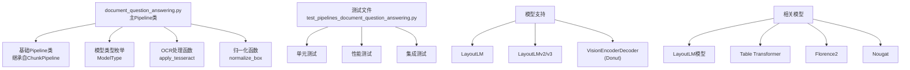

**图表来源**
- [document_question_answering.py](file://src/transformers/pipelines/document_question_answering.py#L102-L545)

**章节来源**
- [document_question_answering.py](file://src/transformers/pipelines/document_question_answering.py#L1-L50)

## 核心组件

文档问答Pipeline包含以下核心组件：

### 主要类结构

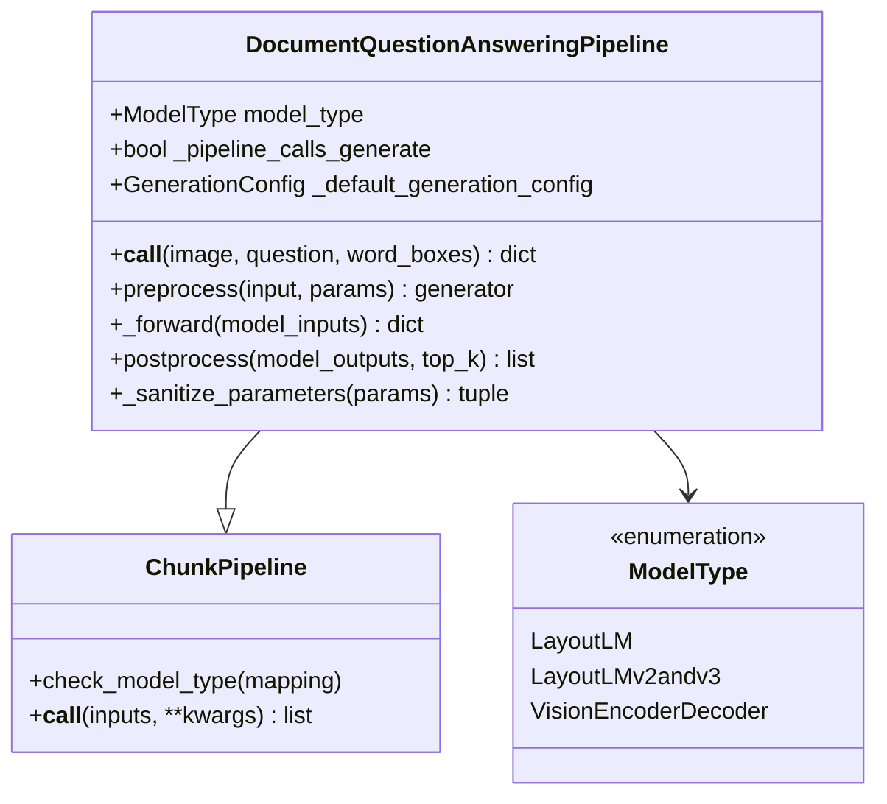

**图表来源**
- [document_question_answering.py](file://src/transformers/pipelines/document_question_answering.py#L102-L163)

### 关键功能模块

1. **OCR处理模块**：使用Tesseract引擎进行文本识别和位置提取
2. **布局分析模块**：识别文档中的文本块、表格、标题等元素
3. **空间编码模块**：为每个文本元素添加位置信息
4. **问答推理模块**：基于文档内容和问题生成答案

**章节来源**
- [document_question_answering.py](file://src/transformers/pipelines/document_question_answering.py#L102-L230)

## 架构概览

文档问答Pipeline采用分层架构设计，从输入处理到最终输出生成包含多个处理阶段：

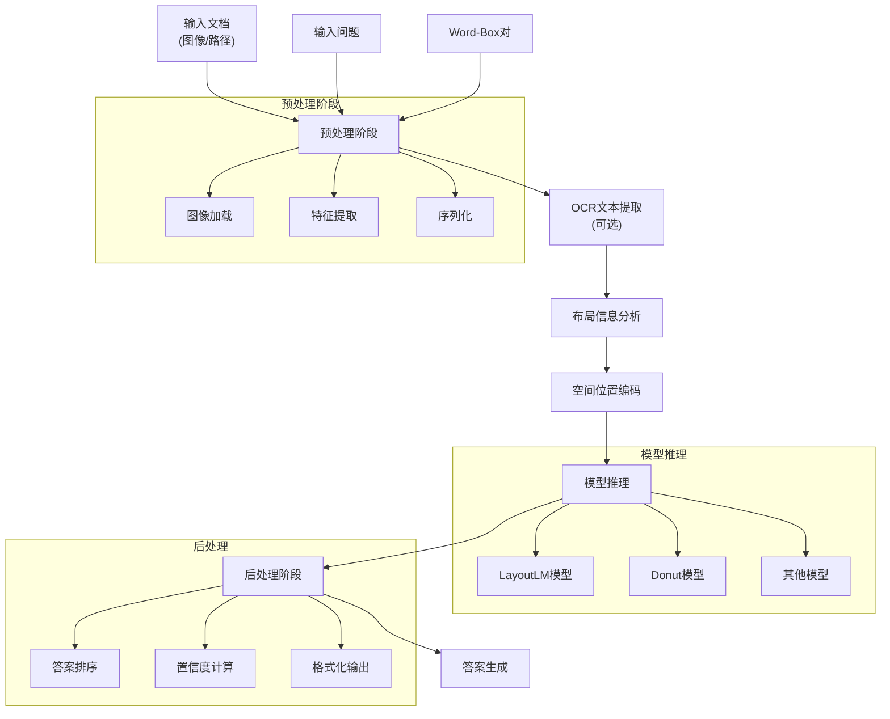

**图表来源**
- [document_question_answering.py](file://src/transformers/pipelines/document_question_answering.py#L309-L452)
- [document_question_answering.py](file://src/transformers/pipelines/document_question_answering.py#L454-L543)

## 详细组件分析

### OCR文本提取组件

OCR处理是文档问答Pipeline的重要组成部分，负责从图像中提取文本内容和位置信息：

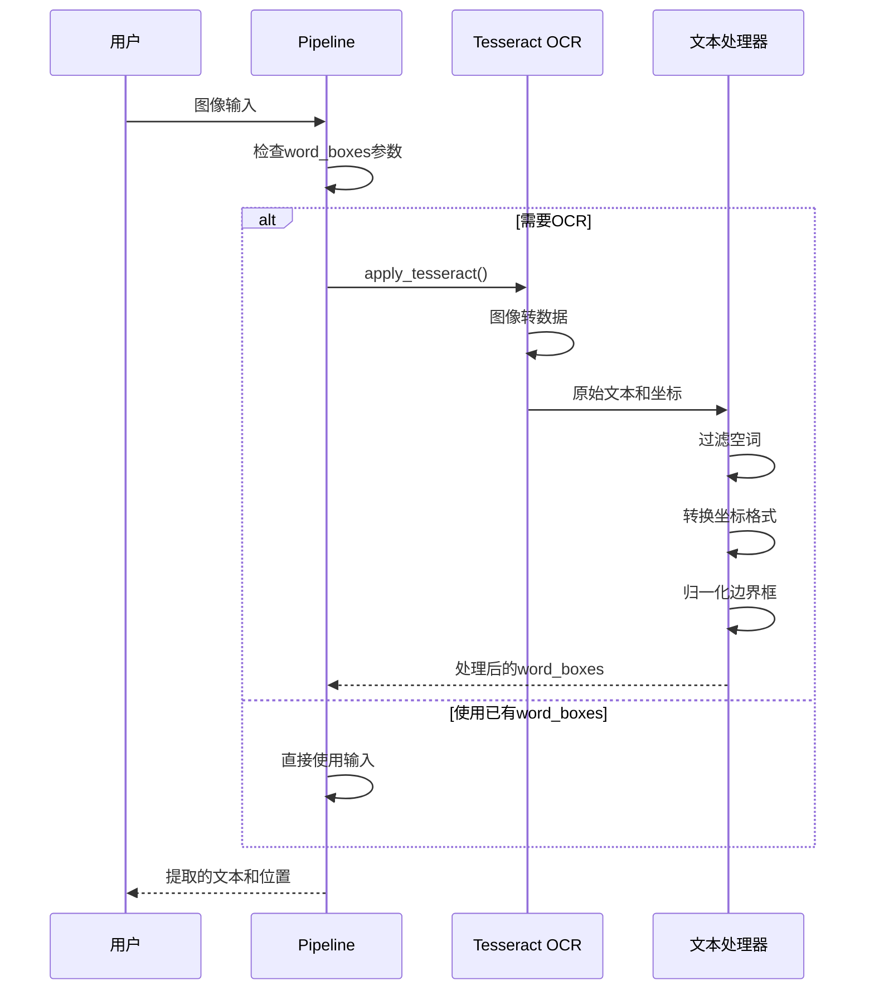

**图表来源**
- [document_question_answering.py](file://src/transformers/pipelines/document_question_answering.py#L54-L82)

#### OCR处理流程详解

1. **图像预处理**：调整图像大小和格式
2. **文本检测**：识别图像中的文本区域
3. **字符识别**：将文本转换为机器可读格式
4. **位置提取**：获取每个字符或单词的边界框
5. **坐标转换**：将像素坐标转换为标准化坐标
6. **数据过滤**：移除无效的空白字符

**章节来源**
- [document_question_answering.py](file://src/transformers/pipelines/document_question_answering.py#L54-L82)

### 空间位置编码组件

空间位置编码是LayoutLM系列模型的核心特性，为每个文本元素添加精确的位置信息：

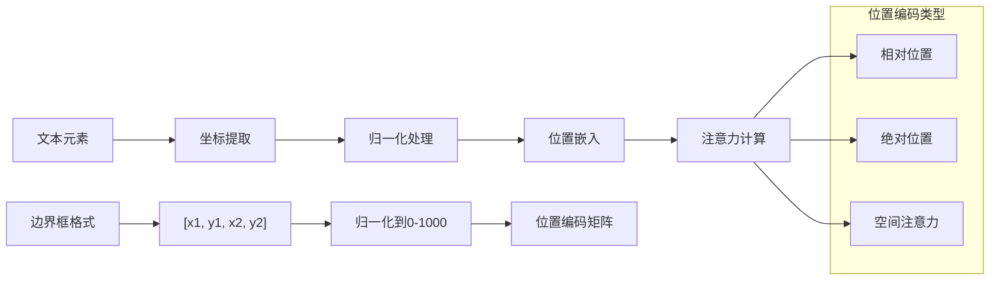

**图表来源**
- [document_question_answering.py](file://src/transformers/pipelines/document_question_answering.py#L42-L52)

#### 位置编码机制

1. **坐标归一化**：将像素坐标归一化到0-1000范围
2. **边界框构建**：为每个文本元素创建矩形边界框
3. **注意力掩码**：生成p_mask以排除不可回答的token
4. **空间关系建模**：捕捉文本元素间的空间关系

**章节来源**
- [document_question_answering.py](file://src/transformers/pipelines/document_question_answering.py#L42-L52)

### 模型推理组件

不同类型的模型采用不同的推理策略：

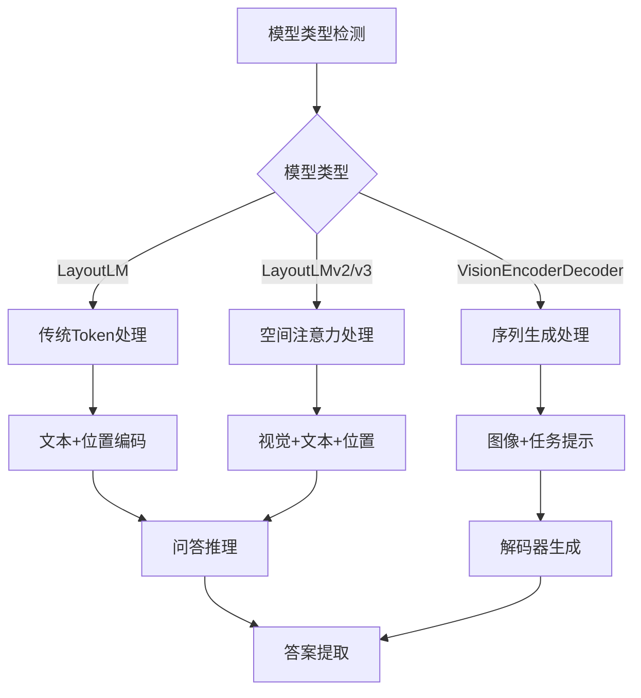

**图表来源**
- [document_question_answering.py](file://src/transformers/pipelines/document_question_answering.py#L154-L163)
- [document_question_answering.py](file://src/transformers/pipelines/document_question_answering.py#L454-L475)

**章节来源**
- [document_question_answering.py](file://src/transformers/pipelines/document_question_answering.py#L454-L475)

## PDF解析和布局信息提取

### 文档元素识别

文档问答Pipeline能够识别和处理各种文档元素：

| 元素类型 | 识别方法 | 处理策略 | 应用场景 |
|---------|---------|---------|---------|
| 文本块 | OCR + 布局分析 | 逐段处理 | 普通文档阅读 |
| 表格 | 结构化识别 | 单元格关系建模 | 数据提取 |
| 标题 | 层级分析 | 语义优先级 | 内容导航 |
| 页眉页脚 | 位置检测 | 排除干扰 | 精确定位 |
| 图片 | 视觉识别 | 描述性处理 | 信息补充 |

### 布局信息提取流程

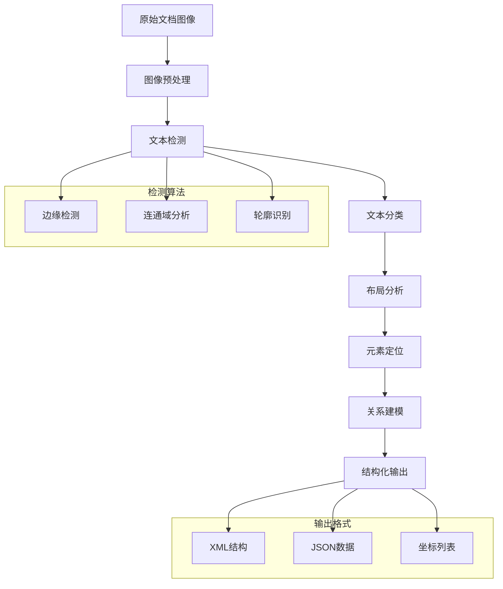

**图表来源**
- [document_question_answering.py](file://src/transformers/pipelines/document_question_answering.py#L309-L452)

**章节来源**
- [document_question_answering.py](file://src/transformers/pipelines/document_question_answering.py#L309-L452)

## 表格理解特殊处理

### 表结构识别

表格理解是文档问答Pipeline的重要功能，需要特殊的处理流程：

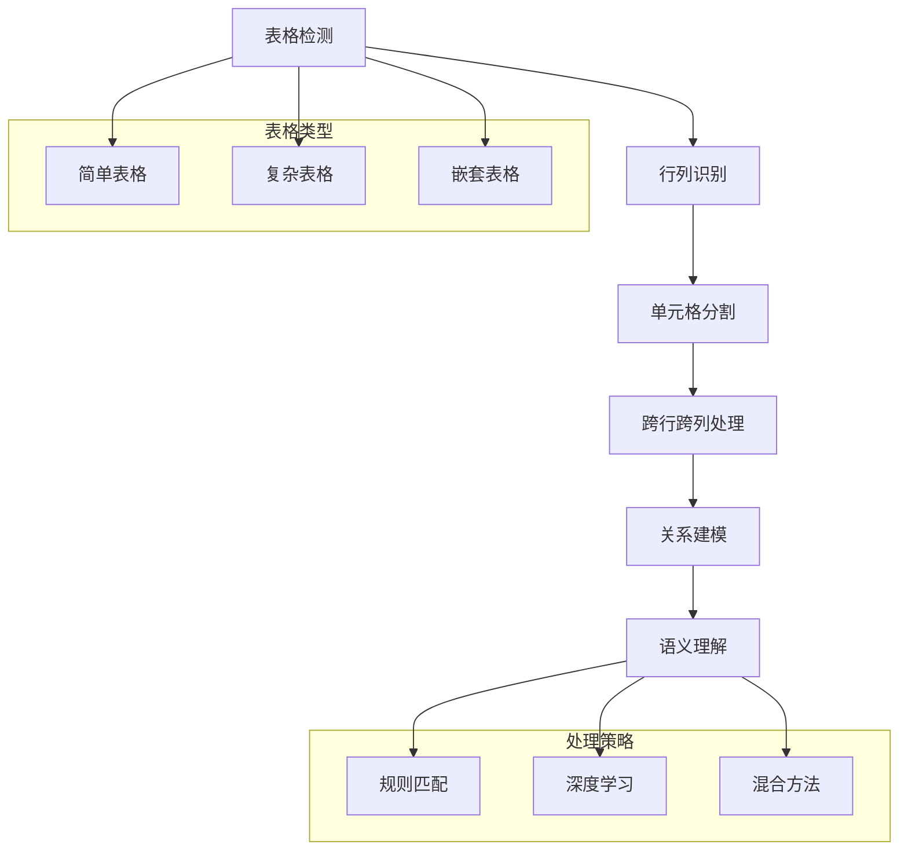

**图表来源**
- [tapas/tokenization_tapas.py](file://src/transformers/models/tapas/tokenization_tapas.py#L1542-L1606)

### 跨行跨列表格处理

表格理解面临的主要挑战是处理跨行跨列的复杂单元格：

1. **单元格合并检测**：识别跨越多个行列的单元格
2. **关系映射**：建立单元格间的逻辑关系
3. **数值计算**：处理表格中的数学运算
4. **查询优化**：针对表格结构优化问答查询

**章节来源**
- [tapas/tokenization_tapas.py](file://src/transformers/models/tapas/tokenization_tapas.py#L1542-L1606)
- [tapas/modeling_tapas.py](file://src/transformers/models/tapas/modeling_tapas.py#L932-L973)

### 表格理解模型架构

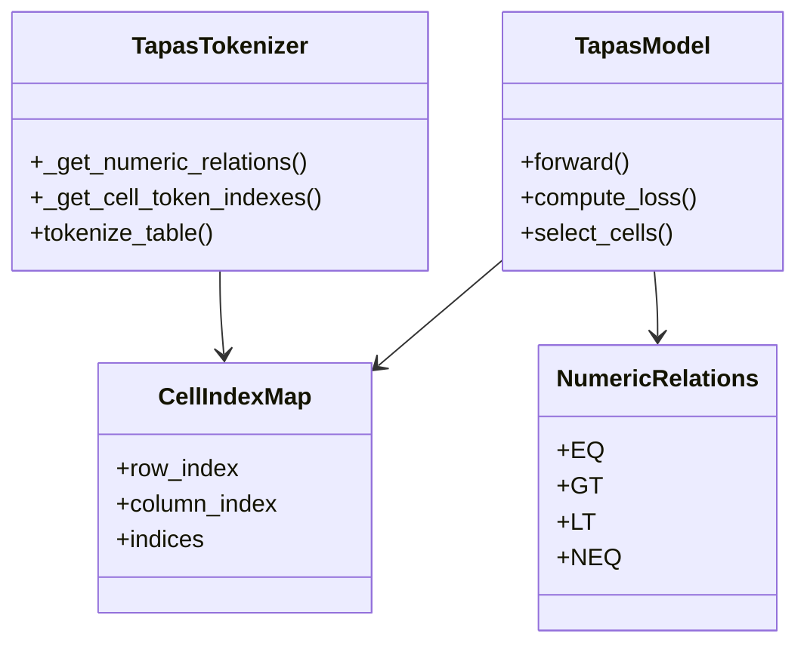

**图表来源**
- [tapas/tokenization_tapas.py](file://src/transformers/models/tapas/tokenization_tapas.py#L1542-L1606)
- [tapas/modeling_tapas.py](file://src/transformers/models/tapas/modeling_tapas.py#L932-L973)

## 文档问答与视觉问答的区别

### 核心差异对比

| 特征 | 文档问答 | 视觉问答 |
|------|---------|---------|
| 输入类型 | 图像/文档 | 图像 |
| 理解层次 | 结构化理解 | 直观理解 |
| 空间编码 | 二维位置 | 二维位置 |
| 上下文处理 | 长文档处理 | 短文本处理 |
| 表格支持 | 完整支持 | 基础支持 |
| 批处理能力 | 强大 | 中等 |

### 技术架构对比

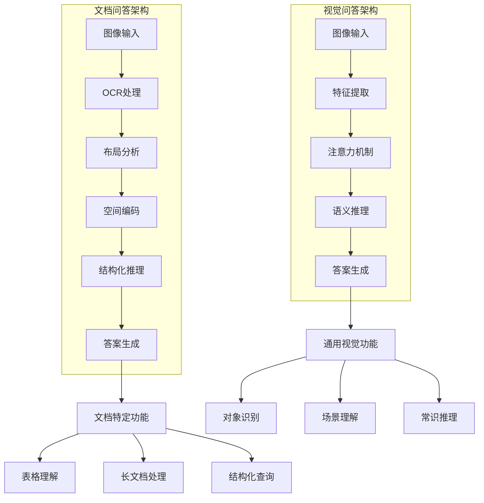

**图表来源**
- [document_question_answering.py](file://src/transformers/pipelines/document_question_answering.py#L102-L230)
- [visual_question_answering.py](file://src/transformers/pipelines/visual_question_answering.py#L18-L212)

### 空间位置编码的使用

文档问答中的空间位置编码具有更复杂的维度：

1. **二维坐标系统**：精确的X-Y坐标表示
2. **层级结构**：文档元素的嵌套关系
3. **动态范围**：适应不同分辨率的图像
4. **语义关联**：位置与内容的语义绑定

**章节来源**
- [document_question_answering.py](file://src/transformers/pipelines/document_question_answering.py#L42-L52)

## 常见应用场景

### 财务报表分析

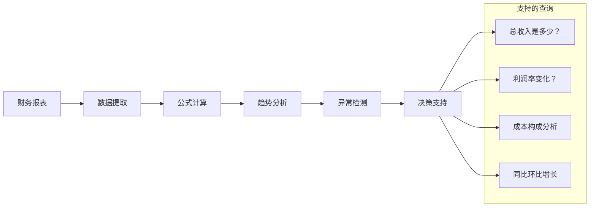

### 法律文档审查

法律文档审查需要高精度的文本理解和上下文分析：

1. **条款识别**：自动识别重要法律条款
2. **冲突检测**：发现条款间的矛盾
3. **风险评估**：评估潜在的法律风险
4. **合规检查**：验证文档符合性要求

### 医疗记录处理

医疗文档处理涉及敏感信息的保护和专业术语的理解：

1. **患者信息提取**：准确识别患者基本信息
2. **诊断结果解读**：理解医学术语和诊断结果
3. **治疗方案分析**：提取治疗建议和用药信息
4. **病史关联**：建立时间线和关联关系

**章节来源**
- [test_pipelines_document_question_answering.py](file://tests/pipelines/test_pipelines_document_question_answering.py#L90-L154)

## 性能考虑

### 处理速度优化

文档问答Pipeline在处理大型文档时需要考虑性能优化：

1. **分块处理**：将长文档分割成可管理的块
2. **并行处理**：利用多核CPU和GPU加速
3. **缓存机制**：重用OCR结果和中间计算
4. **模型选择**：根据需求选择合适的模型大小

### 内存管理

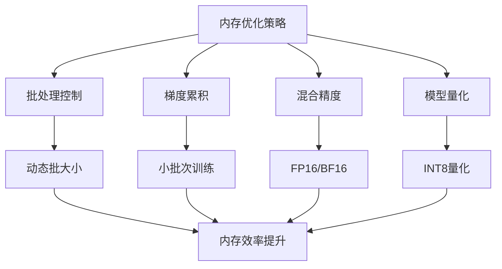

### 可扩展性设计

1. **分布式处理**：支持大规模文档集处理
2. **云端部署**：利用云资源弹性扩展
3. **微服务架构**：模块化设计便于维护
4. **API设计**：RESTful接口支持多种客户端

## 故障排除指南

### 常见问题及解决方案

| 问题类型 | 症状 | 可能原因 | 解决方案 |
|---------|------|---------|---------|
| OCR失败 | 无法识别文本 | 图像质量差 | 提高图像分辨率，使用图像增强 |
| 位置错误 | 答案位置不准确 | 坐标计算错误 | 检查归一化过程，验证坐标系统 |
| 性能问题 | 处理速度慢 | 模型过大 | 选择轻量级模型，启用量化 |
| 内存溢出 | 系统崩溃 | 文档过大 | 启用分块处理，减少批大小 |

### 调试技巧

1. **日志分析**：启用详细日志记录
2. **可视化工具**：显示OCR结果和位置信息
3. **单元测试**：验证各组件功能
4. **性能监控**：跟踪资源使用情况

**章节来源**
- [document_question_answering.py](file://src/transformers/pipelines/document_question_answering.py#L165-L213)

## 结论

文档问答Pipeline代表了文档理解领域的前沿技术，通过整合OCR、计算机视觉和自然语言处理技术，实现了对复杂文档的智能理解和问答能力。其主要优势包括：

1. **全面的文档理解**：支持多种文档格式和结构
2. **精确的空间定位**：提供准确的答案位置信息
3. **强大的表格处理**：完整支持表格结构的理解
4. **灵活的模型适配**：兼容多种先进的文档理解模型
5. **工业级稳定性**：经过大量测试验证的可靠性

随着文档理解技术的不断发展，文档问答Pipeline将在更多领域发挥重要作用，为用户提供更加智能和高效的文档处理体验。未来的发展方向包括更好的多语言支持、更强的复杂文档处理能力和更优的性能表现。