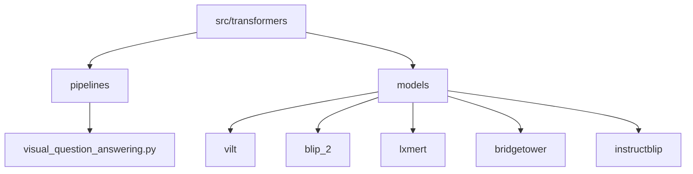
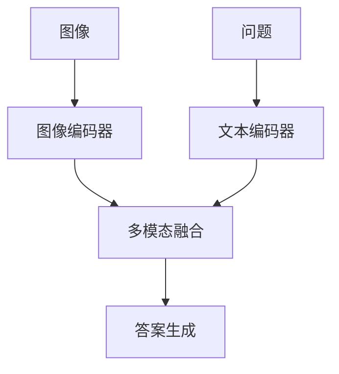
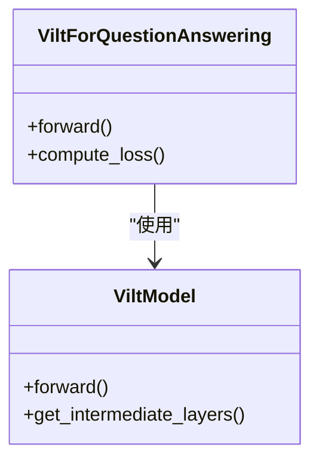
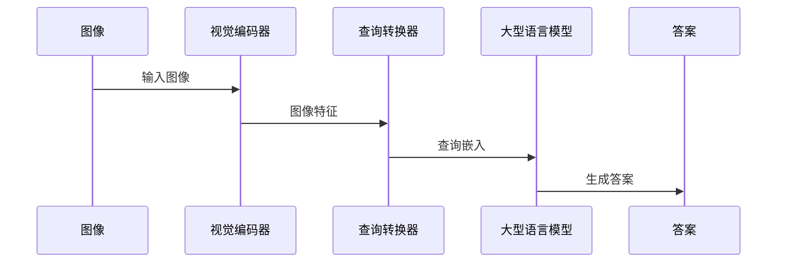
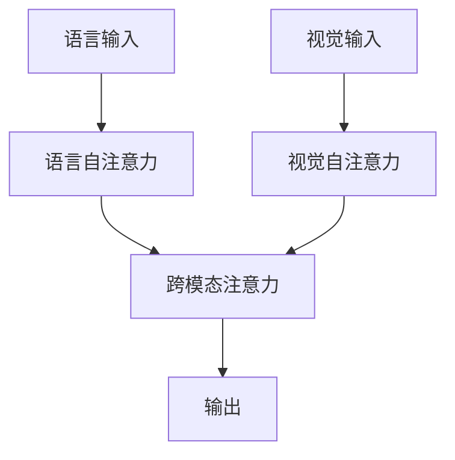
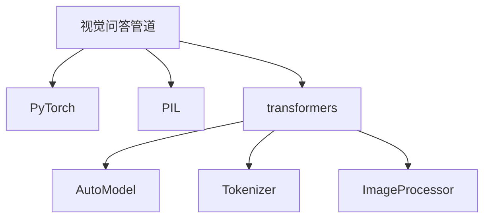

# 视觉问答Pipeline

<cite>
**本文档中引用的文件**  
- [visual_question_answering.py](file://src/transformers/pipelines/visual_question_answering.py)
- [modeling_vilt.py](file://src/transformers/models/vilt/modeling_vilt.py)
- [modeling_blip_2.py](file://src/transformers/models/blip_2/modeling_blip_2.py)
- [modeling_lxmert.py](file://src/transformers/models/lxmert/modeling_lxmert.py)
- [modeling_bridgetower.py](file://src/transformers/models/bridgetower/modeling_bridgetower.py)
- [modeling_instructblip.py](file://src/transformers/models/instructblip/modeling_instructblip.py)
- [modeling_auto.py](file://src/transformers/models/auto/modeling_auto.py)
- [visual_question_answering.md](file://docs/source/en/tasks/visual_question_answering.md)
</cite>

## 目录
1. [简介](#简介)
2. [项目结构](#项目结构)
3. [核心组件](#核心组件)
4. [架构概述](#架构概述)
5. [详细组件分析](#详细组件分析)
6. [依赖分析](#依赖分析)
7. [性能考虑](#性能考虑)
8. [故障排除指南](#故障排除指南)
9. [结论](#结论)

## 简介
视觉问答（VQA）是根据图像回答开放式问题的任务。输入通常包括图像和问题，输出是用自然语言表达的答案。transformers库提供了多种实现VQA的模型和管道，支持从分类到生成式问答的各种方法。本文件详细介绍了transformers库中VQA系统的实现，重点介绍图像和文本的联合编码机制、多模态对齐、注意力机制以及开放式和封闭式问答的不同处理流程。

## 项目结构
transformers库中的VQA功能分布在多个模块中，主要位于`src/transformers/pipelines`和`src/transformers/models`目录下。关键文件包括视觉问答管道实现、各种VQA模型（如ViLT、BLIP-2、LXMERT等）以及相关的配置和处理器。

**图源**  
- [visual_question_answering.py](file://src/transformers/pipelines/visual_question_answering.py)
- [modeling_vilt.py](file://src/transformers/models/vilt/modeling_vilt.py)
- [modeling_blip_2.py](file://src/transformers/models/blip_2/modeling_blip_2.py)

**章节源**  
- [visual_question_answering.py](file://src/transformers/pipelines/visual_question_answering.py)
- [modeling_vilt.py](file://src/transformers/models/vilt/modeling_vilt.py)

## 核心组件
视觉问答管道的核心组件包括`VisualQuestionAnsweringPipeline`类，它负责处理图像和文本输入，调用相应的模型进行推理，并返回答案。该管道支持多种输入格式，包括单个图像和问题、批量图像和问题等。管道内部使用`AutoModelForVisualQuestionAnswering`来自动选择合适的VQA模型。

**章节源**  
- [visual_question_answering.py](file://src/transformers/pipelines/visual_question_answering.py)
- [modeling_auto.py](file://src/transformers/models/auto/modeling_auto.py)

## 架构概述
VQA系统的架构通常包括图像编码器、文本编码器和多模态融合模块。图像编码器（如ViT）将图像转换为特征向量，文本编码器（如BERT）将问题转换为文本嵌入，多模态融合模块通过注意力机制将两者结合，生成最终的答案。

**图源**  
- [modeling_vilt.py](file://src/transformers/models/vilt/modeling_vilt.py)
- [modeling_blip_2.py](file://src/transformers/models/blip_2/modeling_blip_2.py)

## 详细组件分析
### ViLT模型分析
ViLT模型通过将文本嵌入整合到视觉变换器（ViT）中，实现了视觉和语言的预训练。对于VQA任务，ViLT在[CLS]标记的最终隐藏状态之上添加一个分类头（线性层），并随机初始化。视觉问答因此被视为一个**分类问题**。

**图源**  
- [modeling_vilt.py](file://src/transformers/models/vilt/modeling_vilt.py)

**章节源**  
- [modeling_vilt.py](file://src/transformers/models/vilt/modeling_vilt.py)
- [visual_question_answering.md](file://docs/source/en/tasks/visual_question_answering.md)

### BLIP-2模型分析
BLIP-2模型采用了一种新的视觉-语言预训练范式，可以结合任何预训练的视觉编码器和大型语言模型（LLM）。这种方法在多个视觉-语言任务上实现了最先进的结果，包括视觉问答。

**图源**  
- [modeling_blip_2.py](file://src/transformers/models/blip_2/modeling_blip_2.py)

**章节源**  
- [modeling_blip_2.py](file://src/transformers/models/blip_2/modeling_blip_2.py)
- [visual_question_answering.md](file://docs/source/en/tasks/visual_question_answering.md)

### LXMERT模型分析
LXMERT模型通过跨模态注意力机制实现视觉和语言的深度融合。它包含语言自注意力、视觉自注意力和跨模态注意力模块，能够有效地在图像区域和文本token之间建立关联。

**图源**  
- [modeling_lxmert.py](file://src/transformers/models/lxmert/modeling_lxmert.py)

**章节源**  
- [modeling_lxmert.py](file://src/transformers/models/lxmert/modeling_lxmert.py)

## 依赖分析
VQA系统依赖于多个外部库和内部模块，包括PyTorch、PIL、transformers库中的其他模型和处理器等。这些依赖关系确保了系统的完整性和功能性。

**图源**  
- [visual_question_answering.py](file://src/transformers/pipelines/visual_question_answering.py)
- [modeling_auto.py](file://src/transformers/models/auto/modeling_auto.py)

**章节源**  
- [visual_question_answering.py](file://src/transformers/pipelines/visual_question_answering.py)
- [modeling_auto.py](file://src/transformers/models/auto/modeling_auto.py)

## 性能考虑
在实际应用中，VQA系统的性能受到多种因素的影响，包括模型大小、输入图像分辨率、问题复杂度等。为了优化性能，可以采用以下策略：
- 使用更高效的模型架构（如轻量级ViT）
- 降低输入图像的分辨率
- 限制生成答案的最大长度
- 使用GPU加速推理过程

## 故障排除指南
在使用VQA系统时可能会遇到一些常见问题，如模型加载失败、输入格式错误等。以下是一些解决方案：
- 确保所有依赖库已正确安装
- 检查输入图像和问题的格式是否符合要求
- 确认模型检查点路径正确无误
- 查看日志文件以获取详细的错误信息

**章节源**  
- [visual_question_answering.py](file://src/transformers/pipelines/visual_question_answering.py)
- [modeling_vilt.py](file://src/transformers/models/vilt/modeling_vilt.py)

## 结论
transformers库提供了强大的视觉问答功能，支持多种模型和方法。通过深入理解其内部机制和架构，开发者可以更好地利用这些工具来构建高效的VQA应用。未来的工作可以集中在进一步优化模型性能、扩展支持的模型类型以及提高系统的鲁棒性上。