# 视频分类Pipeline

<cite>
**本文档中引用的文件**
- [video_classification.py](file://src/transformers/pipelines/video_classification.py)
- [video_processing_utils.py](file://src/transformers/video_processing_utils.py)
- [video_utils.py](file://src/transformers/video_utils.py)
- [timesformer/modeling_timesformer.py](file://src/transformers/models/timesformer/modeling_timesformer.py)
- [videomae/modeling_videomae.py](file://src/transformers/models/videomae/modeling_videomae.py)
- [vivit/modeling_vivit.py](file://src/transformers/models/vivit/modeling_vivit.py)
- [modeling_auto.py](file://src/transformers/models/auto/modeling_auto.py)
- [test_pipelines_video_classification.py](file://tests/pipelines/test_pipelines_video_classification.py)
</cite>

## 目录
1. [简介](#简介)
2. [项目结构](#项目结构)
3. [核心组件](#核心组件)
4. [架构概览](#架构概览)
5. [详细组件分析](#详细组件分析)
6. [时空特征提取技术](#时空特征提取技术)
7. [帧采样策略](#帧采样策略)
8. [模型架构对比](#模型架构对比)
9. [实际应用示例](#实际应用示例)
10. [性能优化考虑](#性能优化考虑)
11. [故障排除指南](#故障排除指南)
12. [结论](#结论)

## 简介

视频分类Pipeline是Hugging Face Transformers库中专门用于处理视频数据并进行分类任务的核心组件。该系统基于先进的时空特征提取技术，能够从视频序列中学习复杂的时空模式，实现高精度的动作识别和事件检测。

视频分类Pipeline的主要特点包括：
- 支持多种时空特征提取模型（TimeSformer、VideoMAE、ViViT等）
- 灵活的帧采样策略，适应不同的计算资源和精度需求
- 高效的视频预处理和后处理流程
- 完整的批处理支持，提升推理效率

## 项目结构

视频分类Pipeline的实现分布在多个模块中，形成了一个层次化的架构：

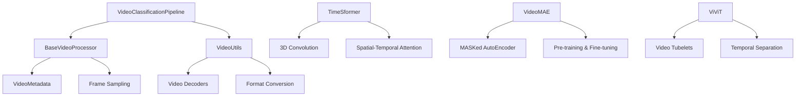

**图表来源**
- [video_classification.py](file://src/transformers/pipelines/video_classification.py#L1-L50)
- [video_processing_utils.py](file://src/transformers/video_processing_utils.py#L1-L100)

**章节来源**
- [video_classification.py](file://src/transformers/pipelines/video_classification.py#L1-L192)
- [video_processing_utils.py](file://src/transformers/video_processing_utils.py#L1-L866)

## 核心组件

### VideoClassificationPipeline类

VideoClassificationPipeline是视频分类任务的主要入口点，继承自基础Pipeline类，提供了完整的视频处理和分类功能。

主要功能特性：
- 支持本地视频文件和远程视频链接
- 可配置的帧采样参数
- 多种后处理函数（softmax、sigmoid、无处理）
- 批量视频处理能力

### BaseVideoProcessor基类

BaseVideoProcessor提供了视频预处理的核心框架，包含以下关键组件：

- **帧采样机制**：支持均匀采样、FPS采样等多种策略
- **尺寸变换**：调整视频分辨率以匹配模型输入要求
- **归一化处理**：标准化像素值到标准范围
- **格式转换**：支持多种视频格式和数据类型

**章节来源**
- [video_classification.py](file://src/transformers/pipelines/video_classification.py#L35-L192)
- [video_processing_utils.py](file://src/transformers/video_processing_utils.py#L150-L300)

## 架构概览

视频分类Pipeline采用模块化设计，将视频处理、特征提取和分类决策分离：

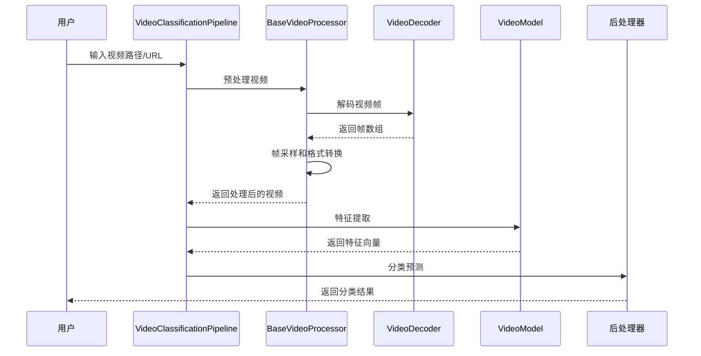

**图表来源**
- [video_classification.py](file://src/transformers/pipelines/video_classification.py#L147-L192)
- [video_processing_utils.py](file://src/transformers/video_processing_utils.py#L400-L500)

## 详细组件分析

### 视频预处理组件

#### 帧采样策略

视频预处理的核心在于帧采样，系统提供了多种采样策略：

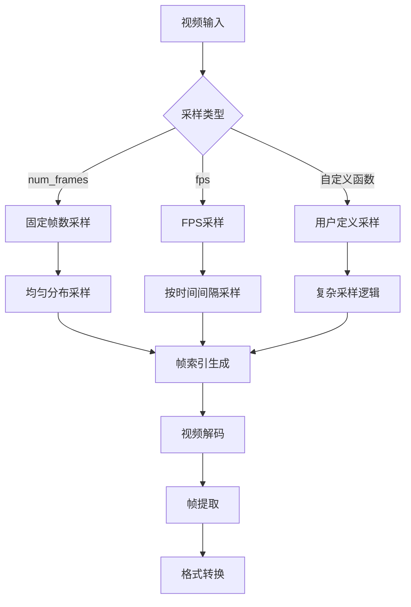

**图表来源**
- [video_utils.py](file://src/transformers/video_utils.py#L200-L300)
- [video_processing_utils.py](file://src/transformers/video_processing_utils.py#L250-L350)

#### 视频解码器

系统支持多种视频解码后端，每种都有其特定的优势：

| 解码器 | 优势 | 适用场景 |
|--------|------|----------|
| PyAV | 高质量解码，支持多种格式 | 通用视频处理 |
| Decord | 高性能，GPU加速 | 大规模视频处理 |
| OpenCV | 简单易用，快速解码 | 实时应用 |
| TorchCodec | 深度集成，高效内存管理 | PyTorch生态 |

**章节来源**
- [video_utils.py](file://src/transformers/video_utils.py#L400-L600)

### 模型适配层

#### 自动模型映射

系统通过自动模型映射机制支持多种视频分类模型：

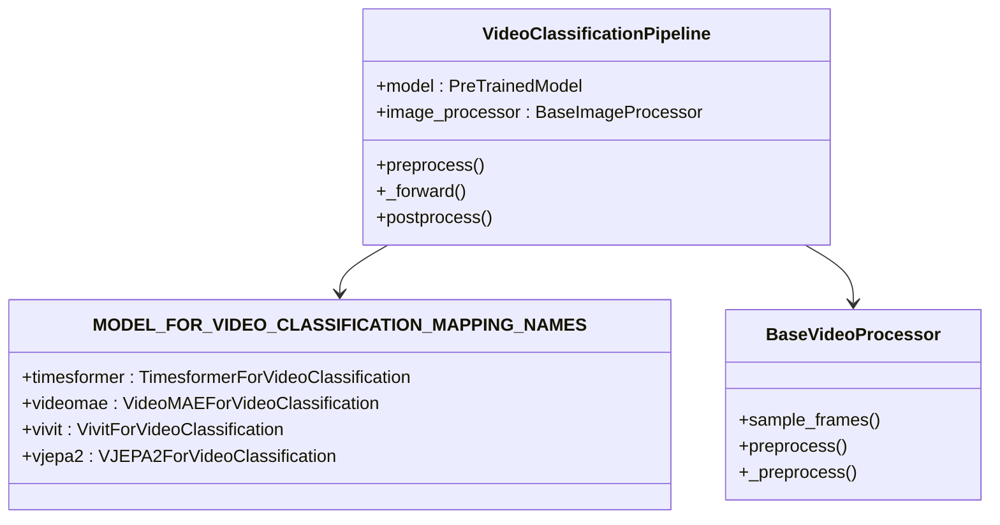

**图表来源**
- [modeling_auto.py](file://src/transformers/models/auto/modeling_auto.py#L957-L975)

**章节来源**
- [modeling_auto.py](file://src/transformers/models/auto/modeling_auto.py#L957-L975)

## 时空特征提取技术

### TimeSformer的时空分离注意力

TimeSformer采用了创新的时空分离注意力机制，将空间和时间维度分开处理：

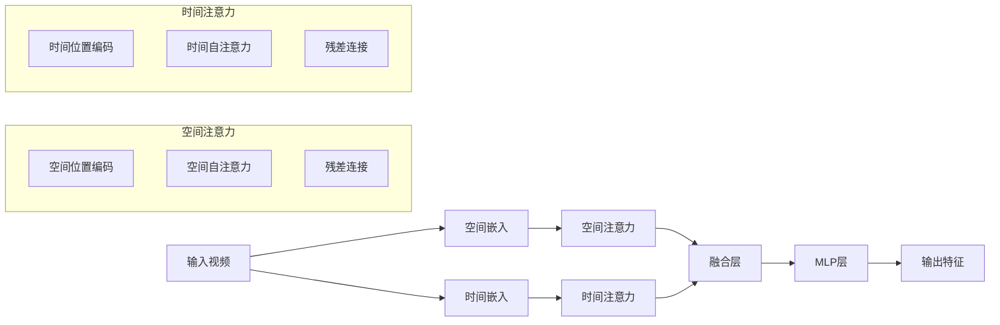

**图表来源**
- [timesformer/modeling_timesformer.py](file://src/transformers/models/timesformer/modeling_timesformer.py#L308-L405)

#### 技术细节

1. **空间嵌入**：使用2D卷积将视频帧转换为空间补丁
2. **时间嵌入**：为每个时间步添加时间位置编码
3. **注意力分离**：先处理空间注意力，再处理时间注意力
4. **特征融合**：通过残差连接融合时空特征

### VideoMAE的掩码自编码器

VideoMAE采用掩码自编码器架构，在预训练阶段学习视频的时空表示：

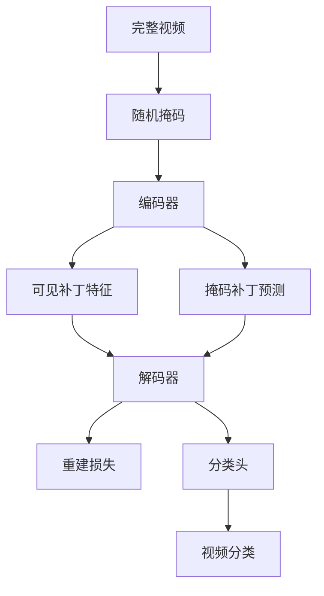

**图表来源**
- [videomae/modeling_videomae.py](file://src/transformers/models/videomae/modeling_videomae.py#L532-L563)

### ViViT的视频管子嵌入

ViViT通过视频管子（tubelets）的概念将3D卷积分解为时空分离的处理：

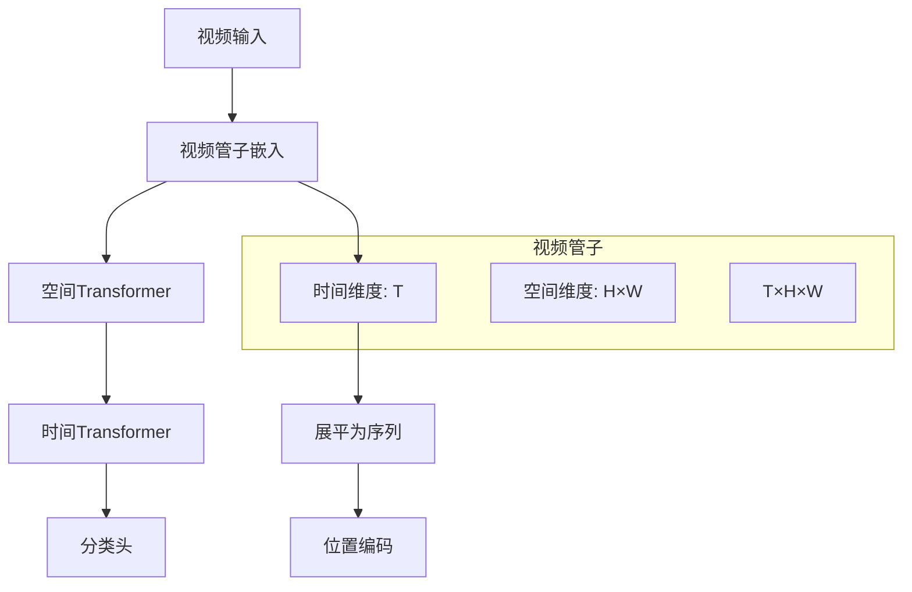

**图表来源**
- [vivit/modeling_vivit.py](file://src/transformers/models/vivit/modeling_vivit.py#L62-L90)

**章节来源**
- [timesformer/modeling_timesformer.py](file://src/transformers/models/timesformer/modeling_timesformer.py#L81-L150)
- [videomae/modeling_videomae.py](file://src/transformers/models/videomae/modeling_videomae.py#L94-L130)
- [vivit/modeling_vivit.py](file://src/transformers/models/vivit/modeling_vivit.py#L62-L90)

## 帧采样策略

### 均匀采样

均匀采样是最简单的策略，按照固定的时间间隔从视频中抽取帧：

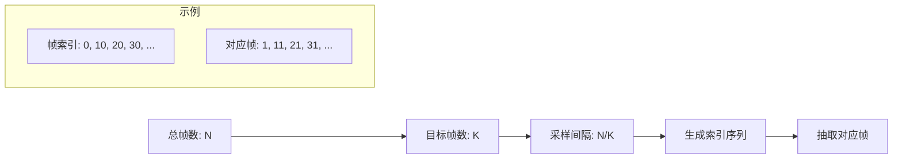

**图表来源**
- [video_utils.py](file://src/transformers/video_utils.py#L250-L280)

### FPS采样

FPS采样根据视频的实际帧率和目标帧率进行采样：

| 参数 | 说明 | 计算公式 |
|------|------|----------|
| 总帧数 | 视频的总帧数 | `total_num_frames` |
| 目标FPS | 目标帧率 | `fps` |
| 目标帧数 | 计算得到的目标帧数 | `int(total_num_frames / fps * target_fps)` |
| 采样间隔 | 每隔多少帧采样一次 | `total_num_frames / target_frame_count` |

### 中心采样

中心采样策略优先选择视频中间部分的帧，适用于动作识别任务：

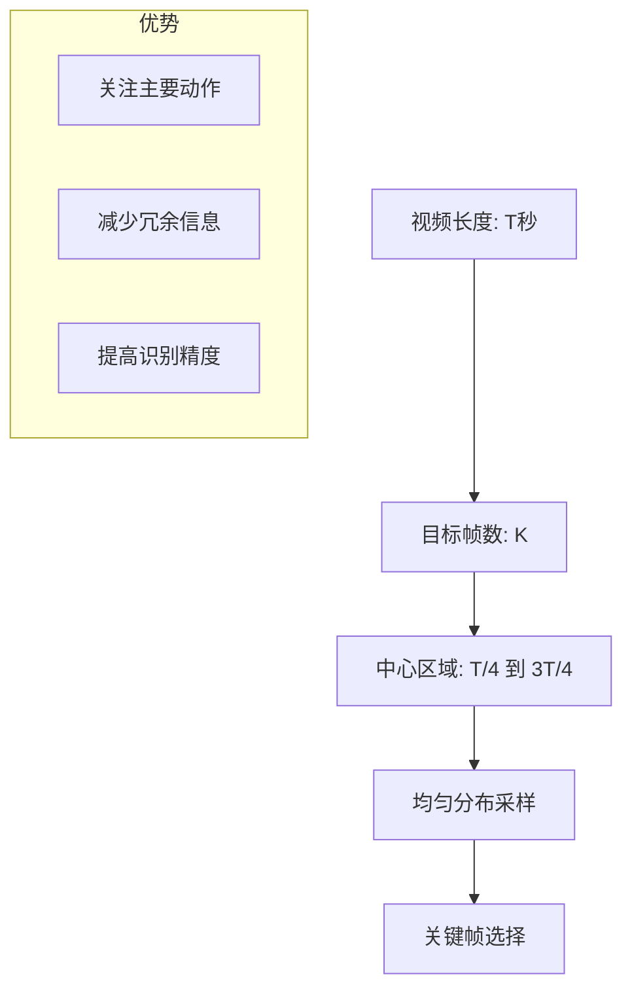

### 稀疏采样

稀疏采样结合了多种策略，只在关键时刻采样：

- **基于运动检测**：在运动变化剧烈的时刻增加采样密度
- **基于内容变化**：在视觉内容变化显著的时刻增加采样
- **基于语义重要性**：在语义信息丰富的时刻增加采样

**章节来源**
- [video_utils.py](file://src/transformers/video_utils.py#L250-L350)
- [video_processing_utils.py](file://src/transformers/video_processing_utils.py#L200-L300)

## 模型架构对比

### 性能对比表

| 模型 | 参数量 | 推理速度 | 精度 | 内存需求 | 适用场景 |
|------|--------|----------|------|----------|----------|
| TimeSformer | 中等 | 快 | 高 | 中等 | 动作识别 |
| VideoMAE | 大 | 中等 | 最高 | 高 | 通用视频理解 |
| ViViT | 小 | 最快 | 中等 | 低 | 实时应用 |
| V-JEPA2 | 中等 | 中等 | 高 | 中等 | 大规模数据集 |

### 计算复杂度分析

```mermaid
graph LR
A[输入视频: B×T×H×W×C] --> B[时空特征提取]
B --> C[TimeSformer: O(T×H×W×d²)]
B --> D[VideoMAE: O(T×H×W×d²)]
B --> E[ViViT: O(T×H×W×d²)]
C --> F[注意力计算]
D --> G[掩码重建]
E --> H[管子嵌入]
F --> I[分类预测]
G --> I
H --> I
```

**图表来源**
- [timesformer/modeling_timesformer.py](file://src/transformers/models/timesformer/modeling_timesformer.py#L1-L50)
- [videomae/modeling_videomae.py](file://src/transformers/models/videomae/modeling_videomae.py#L1-L50)
- [vivit/modeling_vivit.py](file://src/transformers/models/vivit/modeling_vivit.py#L1-L50)

**章节来源**
- [timesformer/modeling_timesformer.py](file://src/transformers/models/timesformer/modeling_timesformer.py#L1-L100)
- [videomae/modeling_videomae.py](file://src/transformers/models/videomae/modeling_videomae.py#L1-L100)
- [vivit/modeling_vivit.py](file://src/transformers/models/vivit/modeling_vivit.py#L1-L100)

## 实际应用示例

### 基础使用示例

```python
# 加载视频分类管道
from transformers import pipeline

# 创建管道实例
classifier = pipeline(
    "video-classification",
    model="MCG-NJU/videomae-base-finetuned-kinetics",
    feature_extractor="MCG-NJU/videomae-base-finetuned-kinetics"
)

# 处理单个视频
video_path = "path/to/video.mp4"
results = classifier(video_path, top_k=5)

# 处理批量视频
video_list = ["video1.mp4", "video2.mp4", "video3.mp4"]
batch_results = classifier(video_list, top_k=3)
```

### 高级配置示例

```python
# 自定义预处理参数
from transformers import VideoMAEImageProcessor

processor = VideoMAEImageProcessor(
    size={"shortest_edge": 224},
    crop_size={"height": 224, "width": 224},
    do_normalize=True,
    image_mean=[0.485, 0.456, 0.406],
    image_std=[0.229, 0.224, 0.225]
)

# 自定义采样策略
classifier = pipeline(
    "video-classification",
    model="facebook/timesformer-base-finetuned-k400",
    feature_extractor=processor,
    frame_sampling_rate=2,  # 每2帧采样1帧
    num_frames=16  # 固定采样16帧
)
```

### 不同格式视频处理

```python
# 处理不同格式的视频输入
video_inputs = [
    "https://example.com/video.mp4",      # 远程视频
    "/local/path/video.avi",              # 本地视频文件
    "path/to/frame1.jpg",                 # 图像序列
    ["frame1.jpg", "frame2.jpg", ...],    # 多个图像帧
]

# 统一处理接口
results = classifier(video_inputs, top_k=10)
```

**章节来源**
- [test_pipelines_video_classification.py](file://tests/pipelines/test_pipelines_video_classification.py#L70-L125)

## 性能优化考虑

### 计算资源优化

#### 内存管理

1. **批处理优化**：合理设置批次大小，避免内存溢出
2. **梯度检查点**：在训练时使用梯度检查点减少内存占用
3. **混合精度**：使用FP16半精度计算提升效率

#### 推理加速

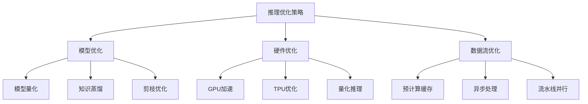

### 采样策略优化

| 优化目标 | 采样策略 | 性能影响 |
|----------|----------|----------|
| 精度优先 | 增加采样帧数 | 提升精度，增加计算量 |
| 速度优先 | 减少采样帧数 | 提升速度，可能降低精度 |
| 平衡策略 | 自适应采样 | 动态调整，兼顾性能 |
| 实时应用 | 稀疏采样 | 最大化速度，牺牲部分精度 |

### 长视频处理

对于超长视频，系统提供了分段处理策略：

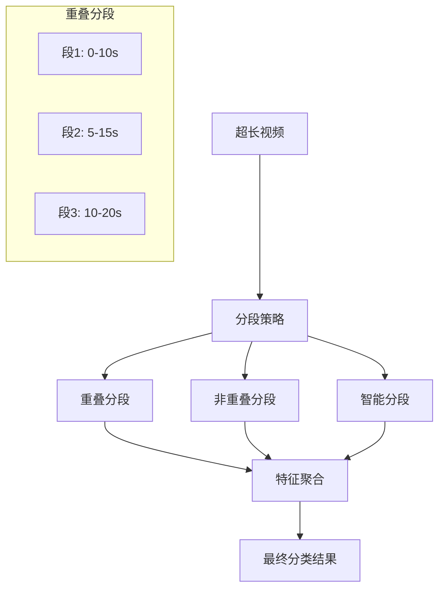

## 故障排除指南

### 常见问题及解决方案

#### 视频格式问题

**问题**：不支持的视频格式导致解码失败
**解决方案**：
1. 使用ffmpeg转换视频格式
2. 检查视频编解码器兼容性
3. 转换为标准的MP4/H.264格式

#### 内存不足错误

**问题**：处理大视频时出现内存溢出
**解决方案**：
1. 减少采样帧数
2. 降低输入分辨率
3. 使用更小的模型
4. 增加系统内存或使用分布式处理

#### 性能问题

**问题**：推理速度过慢
**解决方案**：
1. 优化帧采样策略
2. 使用模型量化
3. 启用混合精度计算
4. 并行处理多个视频

### 调试技巧

```python
# 启用详细日志
import logging
logging.basicConfig(level=logging.DEBUG)

# 检查视频元数据
from transformers import VideoMAEImageProcessor
processor = VideoMAEImageProcessor.from_pretrained("model_name")
print(processor.video_metadata)

# 验证预处理结果
video = load_video("test.mp4")
processed = processor(video, return_tensors="pt")
print(f"Processed shape: {processed['pixel_values'].shape}")
```

**章节来源**
- [video_utils.py](file://src/transformers/video_utils.py#L700-L884)
- [video_processing_utils.py](file://src/transformers/video_processing_utils.py#L700-L866)

## 结论

视频分类Pipeline代表了当前视频理解领域的先进技术水平，通过整合多种时空特征提取方法，为各种视频分类任务提供了强大而灵活的解决方案。

### 主要优势

1. **技术先进性**：采用最新的时空分离注意力机制和掩码自编码器架构
2. **灵活性强**：支持多种采样策略和模型架构
3. **易于使用**：提供简洁的API接口，支持批量处理
4. **性能优异**：在保持高精度的同时提供良好的推理速度

### 应用前景

视频分类Pipeline在以下领域具有广阔的应用前景：
- **动作识别**：体育赛事分析、行为监控
- **事件检测**：安全监控、异常行为识别
- **内容理解**：视频内容分类、推荐系统
- **实时应用**：直播内容分析、实时监控

随着技术的不断发展，视频分类Pipeline将继续演进，为更多复杂的视频理解任务提供支持。