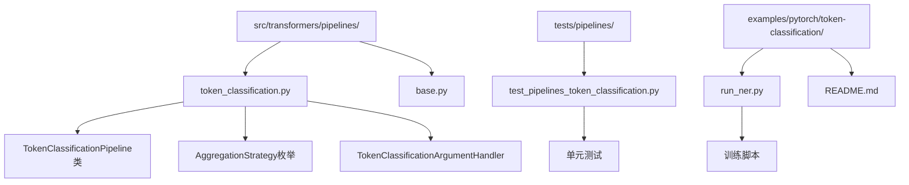
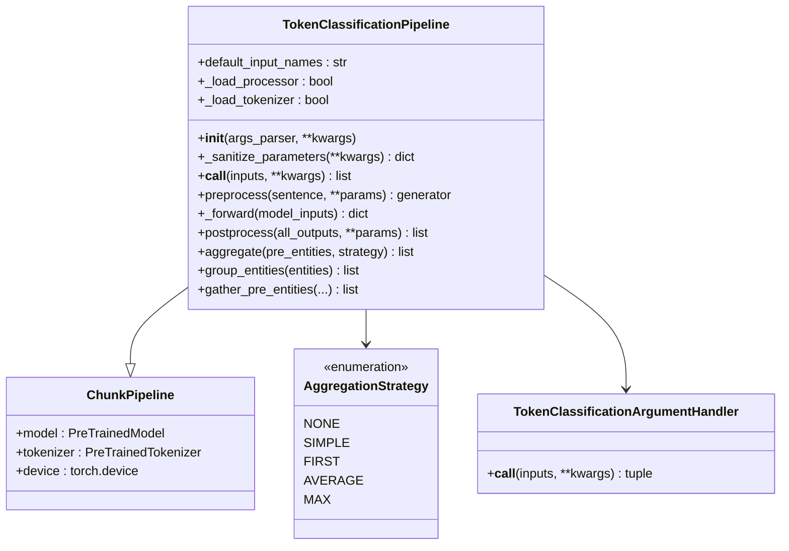
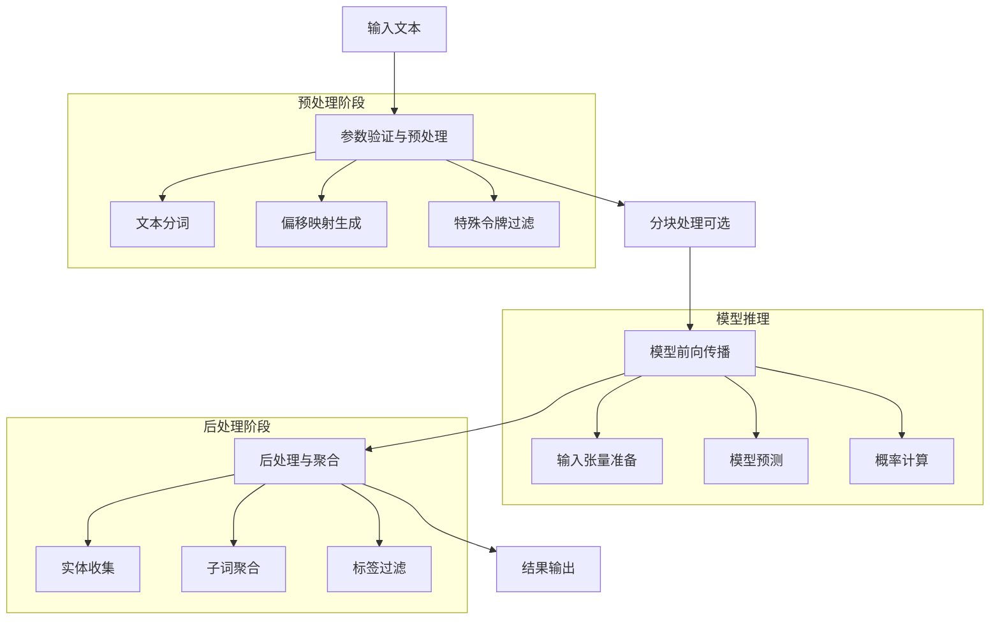
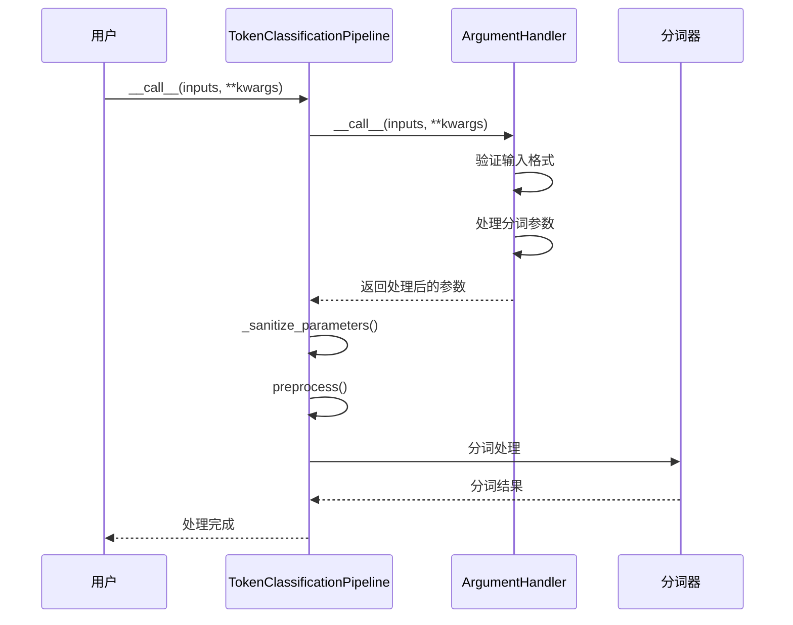
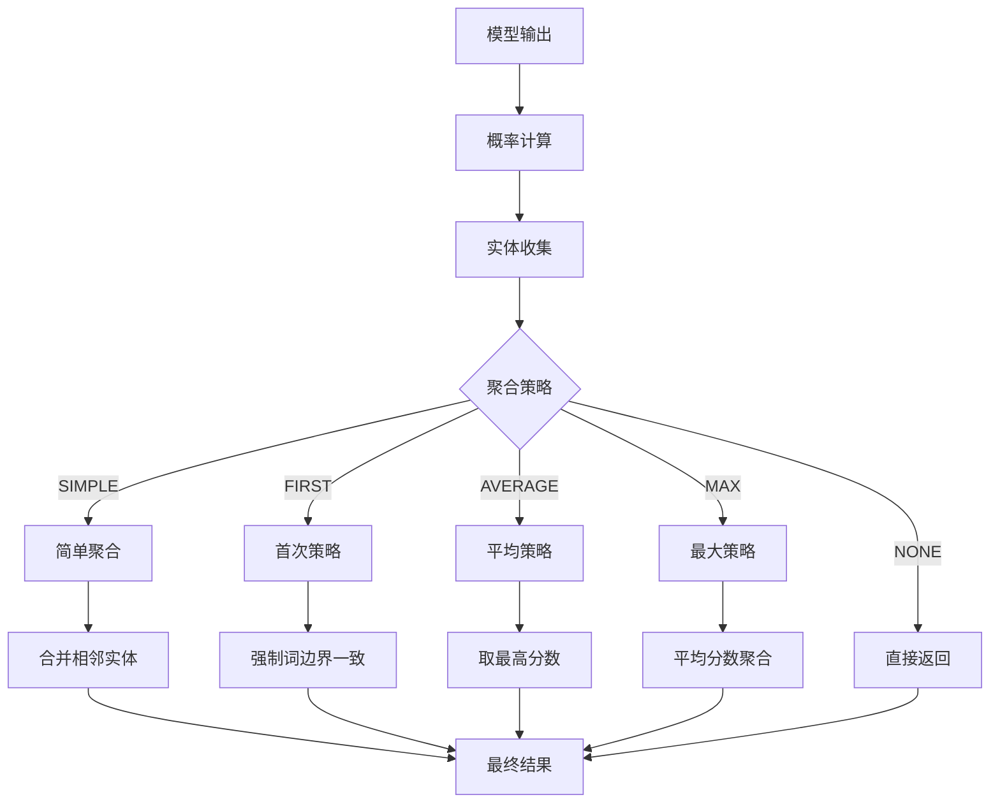
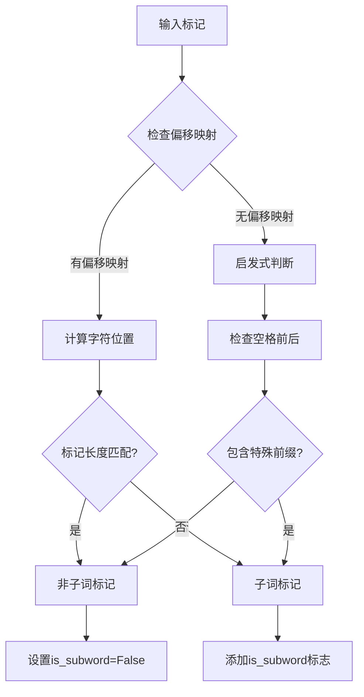
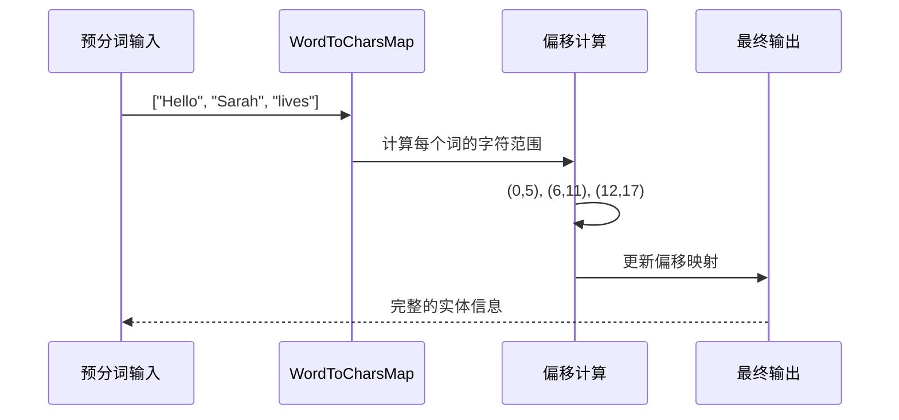
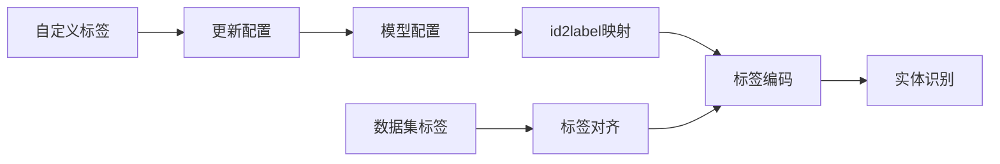
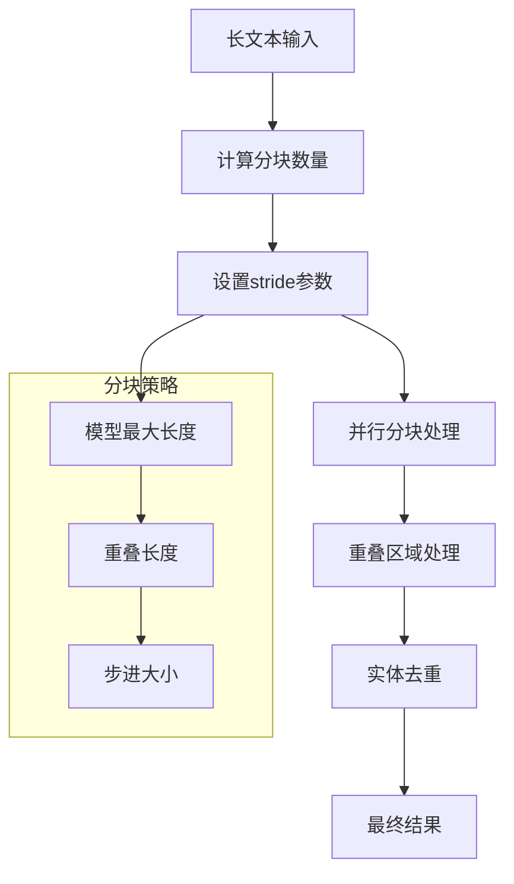

# 命名实体识别Pipeline

<cite>
**本文档中引用的文件**
- [token_classification.py](file://src/transformers/pipelines/token_classification.py)
- [test_pipelines_token_classification.py](file://tests/pipelines/test_pipelines_token_classification.py)
- [README.md](file://examples/pytorch/token-classification/README.md)
- [run_ner.py](file://examples/pytorch/token-classification/run_ner.py)
- [base.py](file://src/transformers/pipelines/base.py)
</cite>

## 目录
1. [简介](#简介)
2. [项目结构](#项目结构)
3. [核心组件](#核心组件)
4. [架构概览](#架构概览)
5. [详细组件分析](#详细组件分析)
6. [子词分割处理](#子词分割处理)
7. [标签方案与实体类型](#标签方案与实体类型)
8. [聚合策略](#聚合策略)
9. [实际应用示例](#实际应用示例)
10. [性能优化与评估](#性能优化与评估)
11. [故障排除指南](#故障排除指南)
12. [结论](#结论)

## 简介

TokenClassificationPipeline是Hugging Face transformers库中专门用于处理标记分类任务的核心组件，特别是在命名实体识别（NER）、词性标注（POS）和分块（chunking）等自然语言处理任务中发挥重要作用。该Pipeline通过统一的接口为用户提供便捷的实体识别功能，支持多种聚合策略来处理复杂的子词分割问题，并能够灵活配置以适应不同的应用场景。

## 项目结构

TokenClassificationPipeline位于transformers库的管道模块中，其主要文件结构如下：



**图表来源**
- [token_classification.py](file://src/transformers/pipelines/token_classification.py#L1-L50)
- [base.py](file://src/transformers/pipelines/base.py#L1-L50)

**章节来源**
- [token_classification.py](file://src/transformers/pipelines/token_classification.py#L1-L100)

## 核心组件

TokenClassificationPipeline包含以下核心组件：

### 主要类结构



**图表来源**
- [token_classification.py](file://src/transformers/pipelines/token_classification.py#L100-L200)

### 关键参数配置

TokenClassificationPipeline支持丰富的配置参数：

| 参数名称 | 类型 | 默认值 | 描述 |
|---------|------|--------|------|
| `ignore_labels` | list[str] | ["O"] | 要忽略的标签列表 |
| `aggregation_strategy` | str/AggregationStrategy | "none" | 实体聚合策略 |
| `stride` | int | None | 分块处理时的重叠长度 |
| `is_split_into_words` | bool | False | 输入是否已分词 |
| `offset_mapping` | list[tuple[int, int]] | None | 字符偏移映射 |
| `delimiter` | str | None | 分词分隔符 |

**章节来源**
- [token_classification.py](file://src/transformers/pipelines/token_classification.py#L125-L200)

## 架构概览

TokenClassificationPipeline采用模块化设计，遵循管道模式（Pipeline Pattern），提供清晰的数据流处理流程：



**图表来源**
- [token_classification.py](file://src/transformers/pipelines/token_classification.py#L250-L350)

## 详细组件分析

### TokenClassificationPipeline类

TokenClassificationPipeline继承自ChunkPipeline，专门处理标记分类任务。其核心方法包括：

#### 初始化过程

初始化过程中，Pipeline会执行以下关键步骤：
1. 检查模型类型是否为TokenClassification模型
2. 创建基础分词器实例
3. 设置参数处理器

#### 参数验证与预处理



**图表来源**
- [token_classification.py](file://src/transformers/pipelines/token_classification.py#L125-L180)

#### 后处理与聚合

后处理阶段是Pipeline的核心功能之一，负责将模型输出转换为用户友好的实体列表：



**图表来源**
- [token_classification.py](file://src/transformers/pipelines/token_classification.py#L350-L450)

**章节来源**
- [token_classification.py](file://src/transformers/pipelines/token_classification.py#L100-L400)

### 聚合策略详解

AggregationStrategy枚举定义了五种不同的实体聚合策略：

#### 1. NONE策略
保持原始模型输出不变，返回每个标记的预测结果。

#### 2. SIMPLE策略
将相邻的相同标签标记组合成完整实体，适用于基本的实体识别任务。

#### 3. FIRST策略
在词边界处强制一致性，使用第一个标记的标签作为整个词的标签。

#### 4. AVERAGE策略
对同一词的所有标记进行分数平均，然后选择最高分数的标签。

#### 5. MAX策略
选择同一词中最高分数的标签作为整个词的标签。

**章节来源**
- [token_classification.py](file://src/transformers/pipelines/token_classification.py#L50-L70)

## 子词分割处理

子词分割是现代NLP模型面临的重要挑战，TokenClassificationPipeline提供了完善的解决方案：

### 子词识别机制



**图表来源**
- [token_classification.py](file://src/transformers/pipelines/token_classification.py#L450-L550)

### 子词到完整词的映射

对于预分词输入，Pipeline使用word_to_chars_map进行精确映射：



**图表来源**
- [token_classification.py](file://src/transformers/pipelines/token_classification.py#L280-L320)

**章节来源**
- [token_classification.py](file://src/transformers/pipelines/token_classification.py#L400-L500)

## 标签方案与实体类型

### BIO/BIOES标签体系

TokenClassificationPipeline支持标准的BIO（Begin-Inside-Outside）标签方案：

| 标签格式 | 含义 | 示例 |
|---------|------|------|
| B-PER | 实体开始（人物） | B-ORG, B-LOC, B-MISC |
| I-PER | 实体内部（人物） | I-ORG, I-LOC, I-MISC |
| O | 非实体 | O标签表示非实体部分 |

### 自定义实体类型配置

用户可以通过修改模型配置来自定义实体类型：



**图表来源**
- [token_classification.py](file://src/transformers/pipelines/token_classification.py#L600-L647)

**章节来源**
- [token_classification.py](file://src/transformers/pipelines/token_classification.py#L600-L647)

## 实际应用示例

### 基础NER任务

以下是使用TokenClassificationPipeline进行命名实体识别的基本示例：

```python
# 基础NER示例
from transformers import pipeline

# 加载预训练模型
ner_pipeline = pipeline("ner", model="dbmdz/bert-large-cased-finetuned-conll03-english")

# 执行实体识别
text = "Hugging Face is a French company that develops tools for building applications using machine learning."
entities = ner_pipeline(text)

# 输出结果
print(entities)
# [{'entity_group': 'ORG', 'score': 0.978, 'word': 'Hugging Face', 'start': 0, 'end': 12}]
```

### 不同聚合策略的应用

```python
# 使用不同聚合策略
text = "Enzo works at the UN"

# NONE策略：显示所有标记
pipeline_none = pipeline("ner", model="model_name", aggregation_strategy="none")
result_none = pipeline_none(text)
# [{'entity': 'I-PER', 'score': 0.998, 'word': 'En', 'start': 0, 'end': 2}]

# SIMPLE策略：简单聚合
pipeline_simple = pipeline("ner", model="model_name", aggregation_strategy="simple")
result_simple = pipeline_simple(text)
# [{'entity_group': 'PER', 'score': 0.997, 'word': 'Enzo', 'start': 0, 'end': 4}]

# FIRST策略：首次策略
pipeline_first = pipeline("ner", model="model_name", aggregation_strategy="first")
result_first = pipeline_first(text)
# [{'entity_group': 'PER', 'score': 0.998, 'word': 'Enzo', 'start': 0, 'end': 4}]
```

### 预分词输入处理

```python
# 预分词输入示例
words = ["Hello", "Sarah", "lives", "in", "New", "York"]
pipeline = pipeline("ner", model="model_name", aggregation_strategy="simple")

# 处理预分词输入
entities = pipeline(words, is_split_into_words=True)
# [{'entity_group': 'PER', 'score': 0.999, 'word': 'Sarah', 'start': 6, 'end': 11}]
```

**章节来源**
- [test_pipelines_token_classification.py](file://tests/pipelines/test_pipelines_token_classification.py#L200-L400)

## 性能优化与评估

### 分块处理优化

对于长文本，TokenClassificationPipeline支持分块处理以提高效率：



**图表来源**
- [token_classification.py](file://src/transformers/pipelines/token_classification.py#L200-L250)

### 性能指标评估

TokenClassificationPipeline支持多种评估指标：

| 指标类型 | 描述 | 应用场景 |
|---------|------|----------|
| 精确率（Precision） | 正确预测的实体数/预测的实体总数 | 关注误报率 |
| 召回率（Recall） | 正确预测的实体数/真实实体总数 | 关注漏报率 |
| F1分数 | 精确率和召回率的调和平均 | 综合评估指标 |
| 准确率（Accuracy） | 正确预测的标记数/总标记数 | 整体准确度 |

**章节来源**
- [test_pipelines_token_classification.py](file://tests/pipelines/test_pipelines_token_classification.py#L150-L250)

## 故障排除指南

### 常见问题与解决方案

#### 1. 子词分割问题
**问题描述**：模型输出的子词标签无法正确映射到原始单词
**解决方案**：
- 确保使用fast tokenizer
- 检查偏移映射是否可用
- 使用适当的聚合策略

#### 2. 内存不足
**问题描述**：处理长文本时出现内存溢出
**解决方案**：
- 减小模型最大长度
- 增加stride参数
- 使用分块处理

#### 3. 标签不一致
**问题描述**：同一实体的不同部分标签不一致
**解决方案**：
- 使用FIRST或MAX聚合策略
- 检查模型训练数据的质量
- 调整标签编码方案

**章节来源**
- [token_classification.py](file://src/transformers/pipelines/token_classification.py#L180-L220)

## 结论

TokenClassificationPipeline是Hugging Face transformers库中功能强大且灵活的命名实体识别工具。它通过完善的子词分割处理、多样化的聚合策略和丰富的配置选项，为用户提供了高质量的实体识别服务。

### 主要优势

1. **统一接口**：提供简洁易用的API
2. **灵活配置**：支持多种聚合策略和参数调整
3. **高效处理**：内置分块处理和并行优化
4. **广泛兼容**：支持多种预训练模型和标签方案

### 应用建议

- 对于生产环境，建议使用FAST tokenizer和适当的聚合策略
- 长文本处理时合理设置stride参数
- 根据具体任务需求选择合适的标签方案
- 定期评估模型性能并进行必要的微调

通过深入理解TokenClassificationPipeline的设计原理和使用方法，开发者可以更好地利用这一强大的工具来构建高质量的自然语言处理应用。