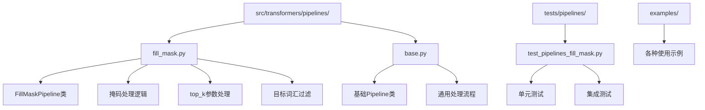
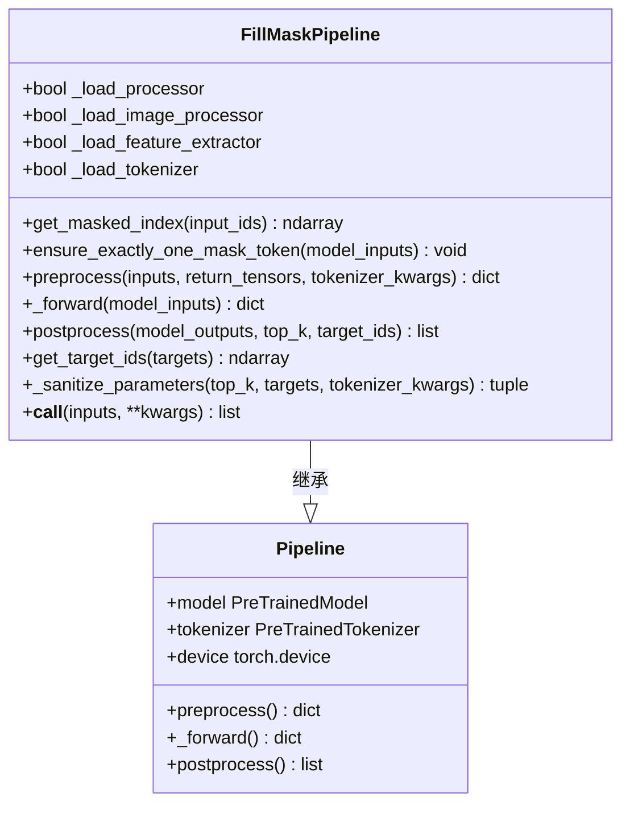
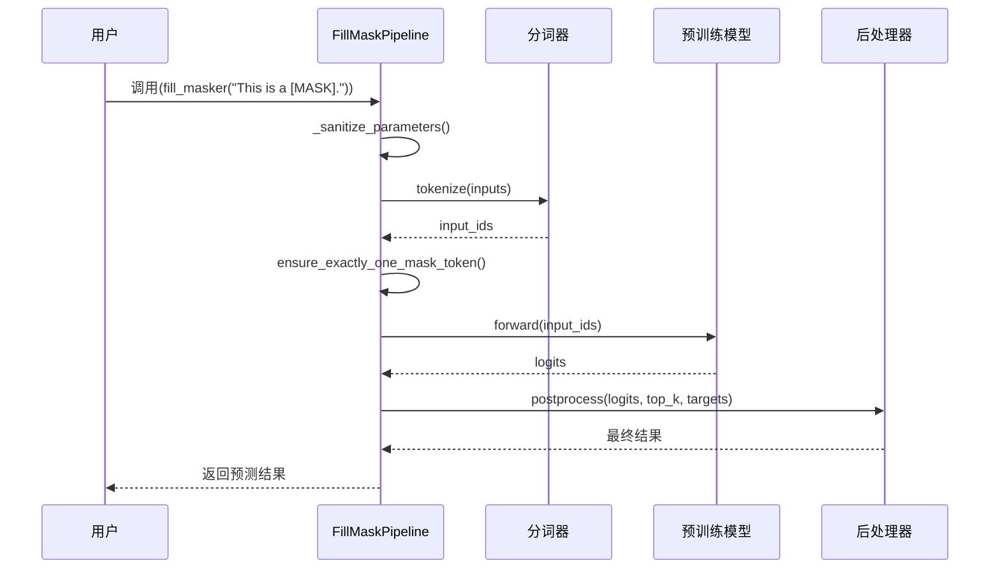
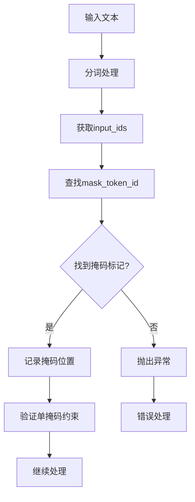
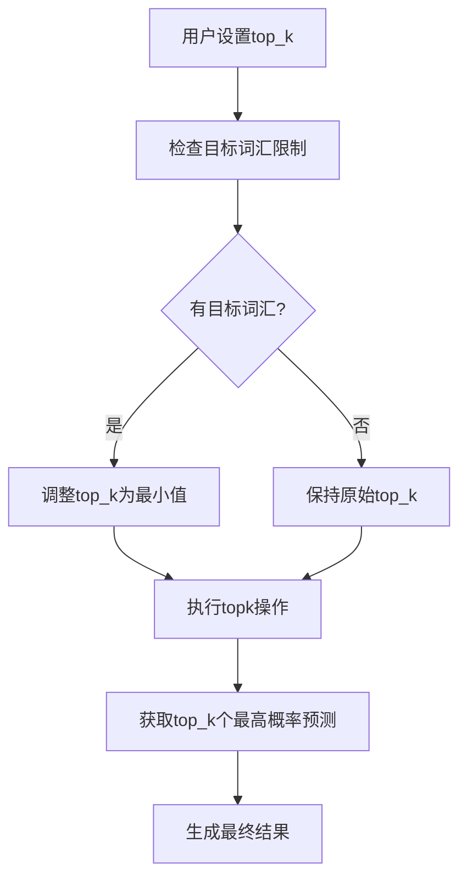
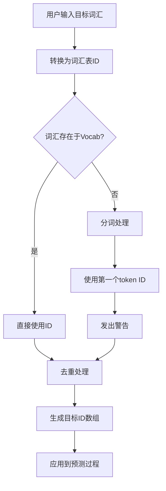
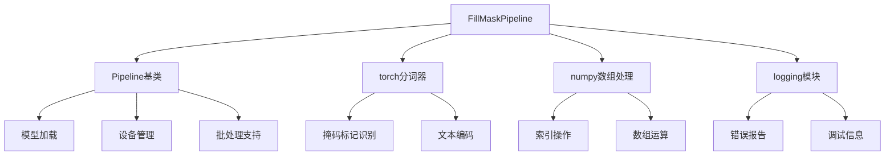

# 填空Pipeline

<cite>
**本文档中引用的文件**
- [fill_mask.py](file://src/transformers/pipelines/fill_mask.py)
- [test_pipelines_fill_mask.py](file://tests/pipelines/test_pipelines_fill_mask.py)
- [base.py](file://src/transformers/pipelines/base.py)
- [__init__.py](file://src/transformers/pipelines/__init__.py)
- [modeling_bert.py](file://src/transformers/models/bert/modeling_bert.py)
</cite>

## 目录
1. [简介](#简介)
2. [项目结构](#项目结构)
3. [核心组件](#核心组件)
4. [架构概览](#架构概览)
5. [详细组件分析](#详细组件分析)
6. [依赖关系分析](#依赖关系分析)
7. [性能考虑](#性能考虑)
8. [故障排除指南](#故障排除指南)
9. [结论](#结论)

## 简介

FillMaskPipeline是Hugging Face Transformers库中的一个强大工具，专门用于掩码语言建模任务。该管道能够识别输入文本中的掩码标记（如[MASK]），并预测最可能的词汇填充，为自然语言处理提供了丰富的应用场景。

FillMaskPipeline的核心功能包括：
- **掩码标记识别**：自动检测输入文本中的[MASK]标记
- **多候选预测**：支持返回多个最可能的填充选项
- **置信度评分**：为每个预测提供概率分数
- **目标词汇限制**：可限制预测范围到特定词汇集合
- **多掩码支持**：实验性支持多个掩码标记的处理

## 项目结构

FillMaskPipeline位于transformers库的管道模块中，其文件组织结构如下：



**图表来源**
- [fill_mask.py](file://src/transformers/pipelines/fill_mask.py#L1-L260)
- [base.py](file://src/transformers/pipelines/base.py#L1-L100)

**章节来源**
- [fill_mask.py](file://src/transformers/pipelines/fill_mask.py#L1-L50)
- [base.py](file://src/transformers/pipelines/base.py#L1-L50)

## 核心组件

FillMaskPipeline由以下核心组件构成：

### 主要类结构



**图表来源**
- [fill_mask.py](file://src/transformers/pipelines/fill_mask.py#L25-L260)
- [base.py](file://src/transformers/pipelines/base.py#L100-L200)

### 关键方法分析

FillMaskPipeline的核心方法包括：

1. **掩码标记检测**：通过`get_masked_index`方法识别输入中的[MASK]标记
2. **预处理阶段**：`preprocess`方法处理输入文本并确保只有一个掩码标记
3. **前向传播**：`_forward`方法执行模型推理
4. **后处理阶段**：`postprocess`方法生成最终的预测结果
5. **目标词汇处理**：`get_target_ids`方法处理用户指定的目标词汇

**章节来源**
- [fill_mask.py](file://src/transformers/pipelines/fill_mask.py#L75-L260)

## 架构概览

FillMaskPipeline采用标准的管道架构模式，遵循transformers库的设计原则：



**图表来源**
- [fill_mask.py](file://src/transformers/pipelines/fill_mask.py#L100-L150)
- [base.py](file://src/transformers/pipelines/base.py#L50-L100)

## 详细组件分析

### 掩码标记识别机制

FillMaskPipeline的核心功能之一是准确识别输入文本中的掩码标记。系统通过以下步骤实现这一功能：



**图表来源**
- [fill_mask.py](file://src/transformers/pipelines/fill_mask.py#L75-L95)

掩码标记识别的关键实现包括：
- 使用`torch.nonzero`函数定位掩码标记的位置
- 验证输入中恰好包含一个掩码标记
- 处理多掩码情况的实验性支持

**章节来源**
- [fill_mask.py](file://src/transformers/pipelines/fill_mask.py#L75-L95)

### top_k参数详解

top_k参数控制返回的预测数量，是FillMaskPipeline的重要配置选项：



**图表来源**
- [fill_mask.py](file://src/transformers/pipelines/fill_mask.py#L130-L150)

top_k参数的工作机制：
1. **默认值**：通常为5个预测结果
2. **动态调整**：当存在目标词汇时，自动调整为最小值
3. **性能优化**：避免不必要的计算开销
4. **用户体验**：提供灵活的结果数量控制

**章节来源**
- [fill_mask.py](file://src/transformers/pipelines/fill_mask.py#L130-L150)

### 目标词汇过滤系统

目标词汇过滤功能允许用户限制预测范围到特定词汇集合：



**图表来源**
- [fill_mask.py](file://src/transformers/pipelines/fill_mask.py#L170-L200)

目标词汇处理的特点：
- **容错机制**：对不存在于词汇表的词汇发出警告
- **智能匹配**：自动选择最佳匹配的token ID
- **重复消除**：自动去除重复的目标词汇
- **性能优化**：减少不必要的词汇查询

**章节来源**
- [fill_mask.py](file://src/transformers/pipelines/fill_mask.py#L170-L200)

### 多掩码支持机制

FillMaskPipeline支持实验性的多掩码处理，这是其重要的扩展功能：

```mermaid
flowchart TD
A[输入包含多个[MASK]] --> B[分别处理每个掩码]
B --> C[独立预测每个位置]
C --> D[生成独立的概率分布]
D --> E[组合所有结果]
E --> F[返回嵌套列表结构]
G[单掩码情况] --> H[返回简单列表]
H --> I[兼容现有API]
```

**图表来源**
- [test_pipelines_fill_mask.py](file://tests/pipelines/test_pipelines_fill_mask.py#L389-L411)

多掩码处理的注意事项：
- **概率独立性**：每个掩码位置的概率是独立计算的
- **联合概率缺失**：不保证联合概率的一致性
- **实验性质**：仍处于实验阶段
- **输出格式**：返回嵌套列表结构

**章节来源**
- [test_pipelines_fill_mask.py](file://tests/pipelines/test_pipelines_fill_mask.py#L389-L411)

### 实际应用场景

FillMaskPipeline在多个领域具有广泛的应用价值：

#### 语言模型评估
```python
# 示例：评估模型的语言理解能力
>>> from transformers import pipeline
>>> fill_masker = pipeline("fill-mask", model="bert-base-uncased")
>>> results = fill_masker("The capital of France is [MASK].")
# 输出：预测巴黎的概率最高
```

#### 同义词替换
```python
# 示例：获取同义词建议
>>> results = fill_masker("She was [MASK] happy", targets=["very", "quite", "extremely"])
# 输出：根据上下文选择合适的副词
```

#### 文本编辑辅助
```python
# 示例：自动完成功能
>>> results = fill_masker("I love to [MASK] my friends", top_k=3)
# 输出：推荐动词作为填充选项
```

**章节来源**
- [test_pipelines_fill_mask.py](file://tests/pipelines/test_pipelines_fill_mask.py#L44-L81)

## 依赖关系分析

FillMaskPipeline的依赖关系体现了transformers库的模块化设计：



**图表来源**
- [fill_mask.py](file://src/transformers/pipelines/fill_mask.py#L1-L15)
- [base.py](file://src/transformers/pipelines/base.py#L1-L50)

主要依赖项说明：
- **torch**：用于张量操作和模型推理
- **numpy**：用于数组处理和索引操作
- **logging**：用于错误处理和调试信息
- **Pipeline基类**：提供标准化的管道接口

**章节来源**
- [fill_mask.py](file://src/transformers/pipelines/fill_mask.py#L1-L15)

## 性能考虑

FillMaskPipeline在设计时充分考虑了性能优化：

### 内存管理
- **张量复制**：在关键操作中使用`numpy.copy()`避免原地修改
- **设备优化**：自动在CPU和GPU之间切换
- **批处理支持**：支持批量处理多个输入

### 计算优化
- **topk剪枝**：只计算最可能的预测结果
- **词汇过滤**：限制预测范围提高效率
- **缓存机制**：复用中间计算结果

### 并发处理
- **异步支持**：支持并发调用
- **资源隔离**：避免内存泄漏
- **错误恢复**：健壮的异常处理机制

## 故障排除指南

### 常见问题及解决方案

#### 1. 没有找到掩码标记
**问题描述**：输入文本中没有[MASK]标记
**解决方案**：确保输入包含有效的掩码标记
**错误信息**：`No mask_token (...) found on the input`

#### 2. 多个掩码标记
**问题描述**：输入包含多个[MASK]标记
**解决方案**：目前仅支持单掩码，可考虑分多次处理
**错误信息**：`fill-mask` pipeline only works for inputs with exactly one token masked

#### 3. 目标词汇无效
**问题描述**：指定的目标词汇不在词汇表中
**解决方案**：检查词汇拼写或使用相关词汇
**警告信息**：`The specified target token (...) does not exist in the model vocabulary`

#### 4. 设备兼容性问题
**问题描述**：模型与当前设备不兼容
**解决方案**：检查CUDA可用性和模型要求
**错误信息**：`PipelineException`

**章节来源**
- [fill_mask.py](file://src/transformers/pipelines/fill_mask.py#L85-L95)
- [test_pipelines_fill_mask.py](file://tests/pipelines/test_pipelines_fill_mask.py#L272-L300)

## 结论

FillMaskPipeline是Hugging Face Transformers库中一个功能强大且设计精良的工具，它成功地将复杂的掩码语言建模任务简化为易于使用的API。通过深入分析其实现机制，我们可以看到：

### 技术优势
- **模块化设计**：清晰的职责分离和可扩展的架构
- **性能优化**：智能的计算剪枝和内存管理
- **用户友好**：直观的API设计和完善的错误处理
- **功能丰富**：支持多种使用场景和高级特性

### 应用价值
- **研究用途**：为自然语言处理研究提供便利工具
- **工业应用**：支持文本生成和内容创作
- **教育意义**：帮助开发者理解掩码语言模型的工作原理
- **创新潜力**：为新的NLP应用提供技术基础

FillMaskPipeline不仅展示了transformers库的设计哲学，也为自然语言处理领域的实践应用提供了强有力的支持。随着技术的不断发展，这个工具将继续在推动AI应用创新方面发挥重要作用。