# 摘要Pipeline

<cite>
**本文档中引用的文件**
- [src/transformers/pipelines/text2text_generation.py](file://src/transformers/pipelines/text2text_generation.py)
- [src/transformers/pipelines/__init__.py](file://src/transformers/pipelines/__init__.py)
- [examples/pytorch/summarization/run_summarization.py](file://examples/pytorch/summarization/run_summarization.py)
- [tests/pipelines/test_pipelines_summarization.py](file://tests/pipelines/test_pipelines_summarization.py)
- [src/transformers/models/bart/modeling_bart.py](file://src/transformers/models/bart/modeling_bart.py)
- [examples/legacy/seq2seq/utils.py](file://examples/legacy/seq2seq/utils.py)
- [examples/legacy/seq2seq/rouge_cli.py](file://examples/legacy/seq2seq/rouge_cli.py)
</cite>

## 目录
1. [简介](#简介)
2. [项目结构](#项目结构)
3. [核心组件](#核心组件)
4. [架构概览](#架构概览)
5. [详细组件分析](#详细组件分析)
6. [模型架构对比](#模型架构对比)
7. [参数配置与优化](#参数配置与优化)
8. [实际应用示例](#实际应用示例)
9. [长文本处理策略](#长文本处理策略)
10. [质量评估方法](#质量评估方法)
11. [故障排除指南](#故障排除指南)
12. [结论](#结论)

## 简介

摘要Pipeline是Hugging Face Transformers库中的一个重要组件，专门用于生成文本摘要。它基于序列到序列(Seq2Seq)模型架构，支持抽取式摘要和生成式摘要两种不同的摘要生成方式。该Pipeline通过统一的接口为用户提供了便捷的摘要生成功能，支持多种预训练模型，包括BART、T5等主流架构。

摘要任务的核心目标是从输入的长文本中提取或生成关键信息的简洁表示，同时保持语义完整性和上下文连贯性。摘要Pipeline不仅关注生成文本的长度控制，还注重内容的相关性和质量评估。

## 项目结构

摘要Pipeline的实现分布在多个模块中，形成了清晰的层次结构：

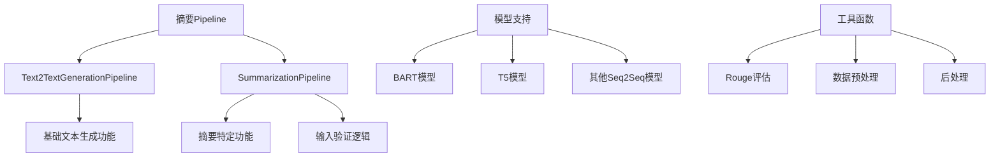

**图表来源**
- [src/transformers/pipelines/text2text_generation.py](file://src/transformers/pipelines/text2text_generation.py#L200-L386)
- [src/transformers/pipelines/__init__.py](file://src/transformers/pipelines/__init__.py#L466-L468)

**章节来源**
- [src/transformers/pipelines/text2text_generation.py](file://src/transformers/pipelines/text2text_generation.py#L1-L50)
- [src/transformers/pipelines/__init__.py](file://src/transformers/pipelines/__init__.py#L1-L100)

## 核心组件

### Text2TextGenerationPipeline

Text2TextGenerationPipeline是摘要Pipeline的基础类，提供了序列到序列文本生成的核心功能：

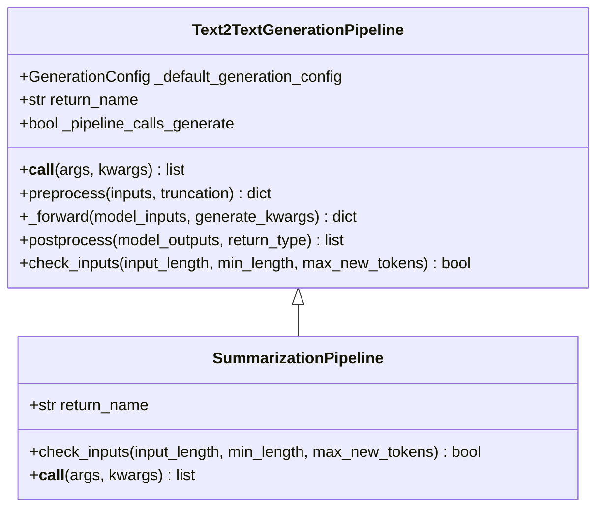

**图表来源**
- [src/transformers/pipelines/text2text_generation.py](file://src/transformers/pipelines/text2text_generation.py#L200-L386)

### 核心特性

1. **默认生成配置**：提供标准化的生成参数设置
2. **输入验证机制**：确保输入数据的格式正确性
3. **批处理支持**：支持批量文本摘要生成
4. **灵活的输出格式**：可选择返回文本或token ID

**章节来源**
- [src/transformers/pipelines/text2text_generation.py](file://src/transformers/pipelines/text2text_generation.py#L200-L280)

## 架构概览

摘要Pipeline采用分层架构设计，从底层的模型抽象到高层的用户接口：

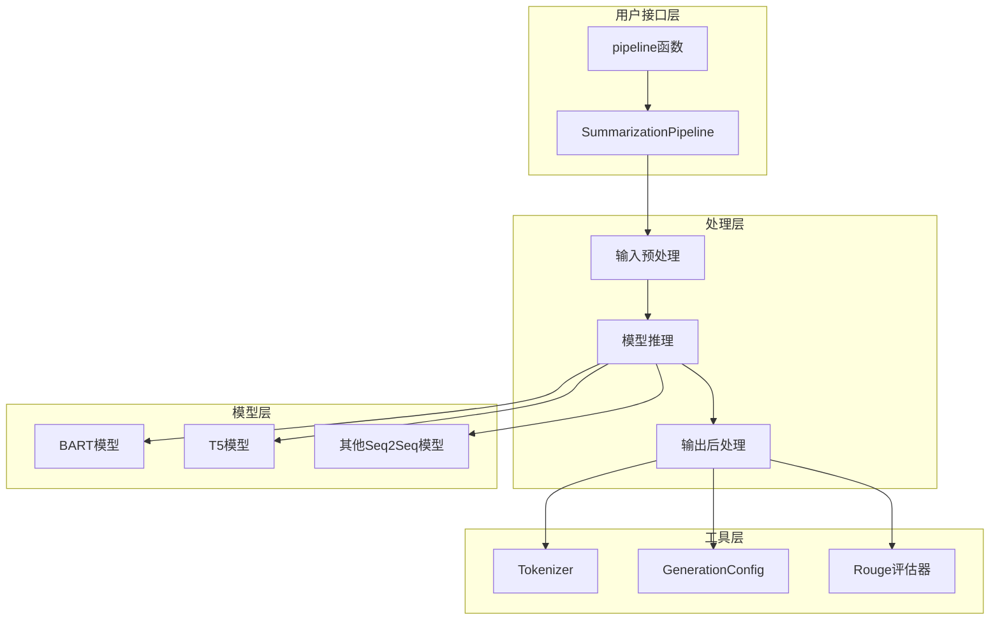

**图表来源**
- [src/transformers/pipelines/text2text_generation.py](file://src/transformers/pipelines/text2text_generation.py#L200-L386)
- [src/transformers/pipelines/__init__.py](file://src/transformers/pipelines/__init__.py#L466-L468)

## 详细组件分析

### 输入预处理流程

摘要Pipeline的输入预处理包含以下关键步骤：

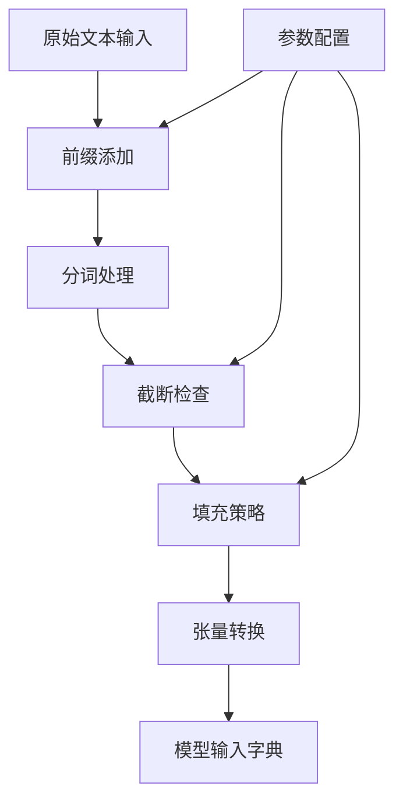

**图表来源**
- [src/transformers/pipelines/text2text_generation.py](file://src/transformers/pipelines/text2text_generation.py#L130-L180)

### 生成过程详解

摘要生成过程涉及复杂的解码策略和参数控制：

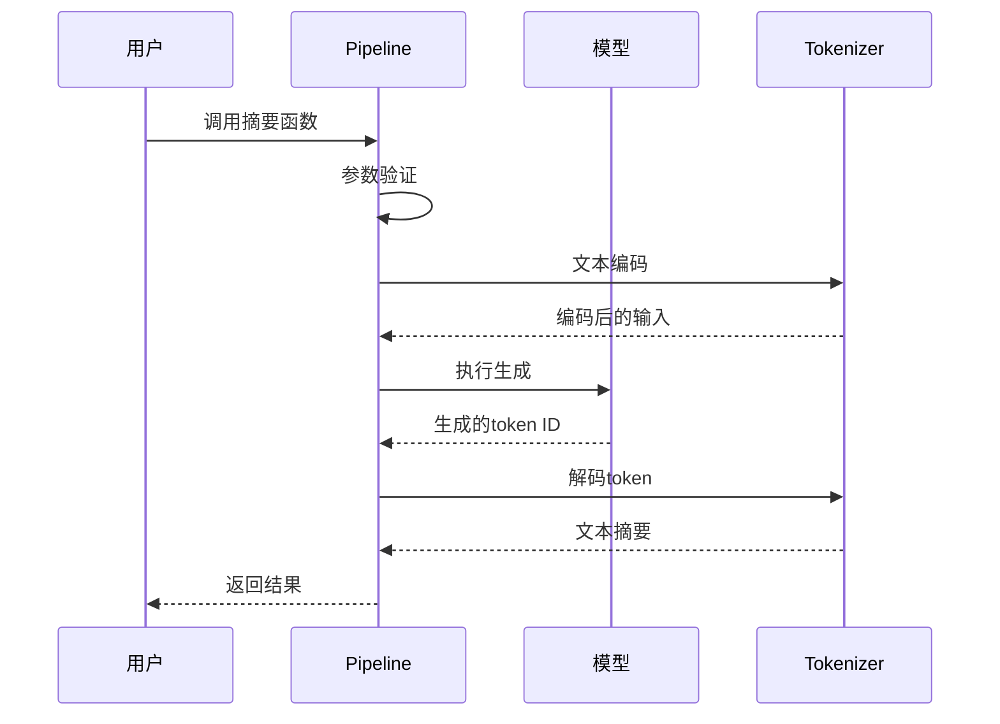

**图表来源**
- [src/transformers/pipelines/text2text_generation.py](file://src/transformers/pipelines/text2text_generation.py#L280-L350)

**章节来源**
- [src/transformers/pipelines/text2text_generation.py](file://src/transformers/pipelines/text2text_generation.py#L280-L386)

## 模型架构对比

### BART vs T5架构特点

不同模型架构在摘要任务中的表现各有特色：

| 特性 | BART | T5 |
|------|------|----|
| **架构类型** | 双向编码器-自回归解码器 | 编码器-解码器架构 |
| **训练目标** | 掩码语言建模 | 文本到文本转换 |
| **适用场景** | 新闻摘要、研究论文 | 多语言摘要、复杂任务 |
| **性能特点** | 更好的上下文理解 | 更强的泛化能力 |
| **典型模型** | bart-large-cnn | google-t5/t5-base |

### 模型选择指南

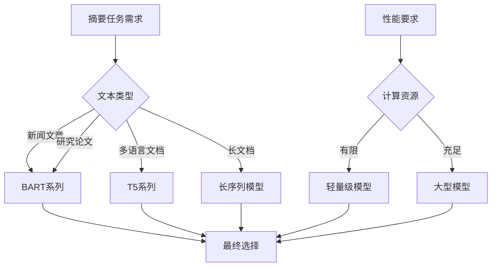

**章节来源**
- [src/transformers/pipelines/text2text_generation.py](file://src/transformers/pipelines/text2text_generation.py#L230-L258)

## 参数配置与优化

### 关键参数详解

摘要Pipeline提供了丰富的参数配置选项来控制生成质量和效率：

| 参数名称 | 默认值 | 功能描述 | 使用建议 |
|----------|--------|----------|----------|
| `max_new_tokens` | 256 | 最大新生成token数 | 根据摘要长度需求调整 |
| `min_length` | 0 | 最小生成长度 | 设置合理的下限避免过短 |
| `num_beams` | 4 | 束搜索宽度 | 平衡质量和速度 |
| `early_stopping` | False | 提前停止策略 | 在长文档中启用 |
| `length_penalty` | 1.0 | 长度惩罚因子 | 控制摘要长度倾向 |

### Beam Search优化策略

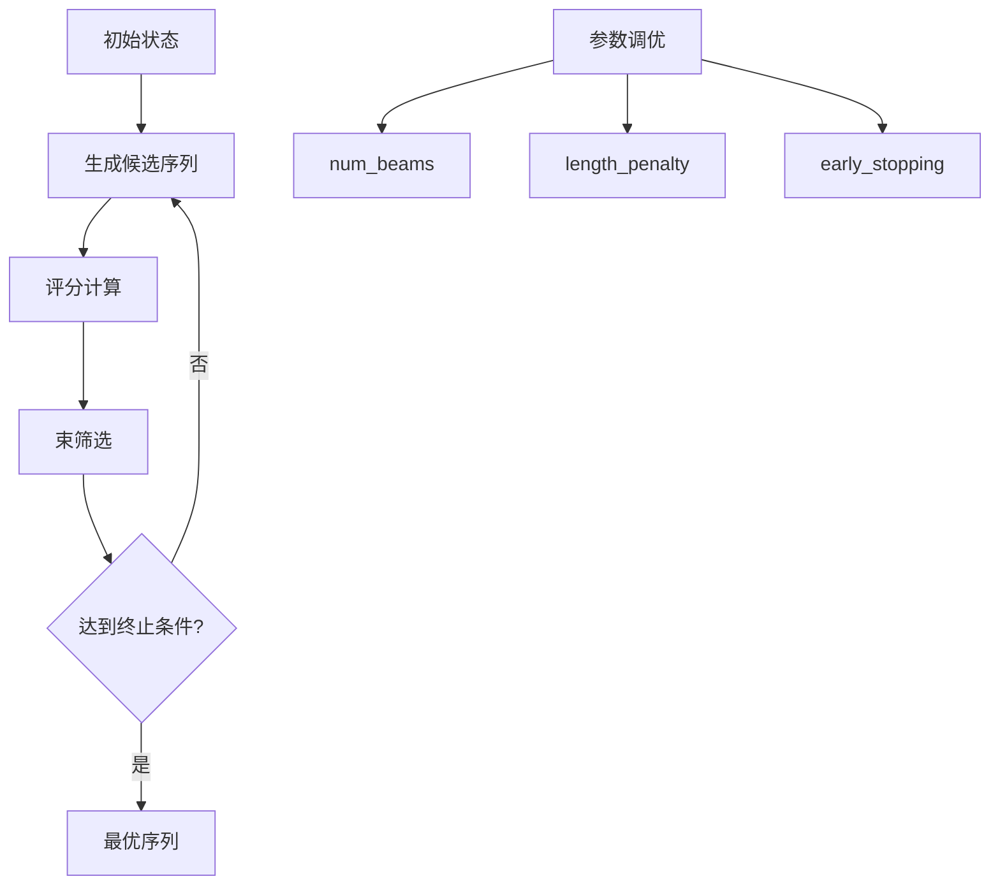

**图表来源**
- [src/transformers/generation/configuration_utils.py](file://src/transformers/generation/configuration_utils.py#L106-L126)

**章节来源**
- [src/transformers/pipelines/text2text_generation.py](file://src/transformers/pipelines/text2text_generation.py#L258-L280)

## 实际应用示例

### 基础使用示例

以下是摘要Pipeline的基本使用方法：

```python
# 基础摘要生成
from transformers import pipeline

# 创建摘要器
summarizer = pipeline("summarization")

# 单个文档摘要
text = "输入的长文本内容..."
summary = summarizer(text, max_length=100, min_length=30, do_sample=False)

# 批量摘要处理
documents = ["文档1...", "文档2...", "文档3..."]
summaries = summarizer(documents, max_length=50, batch_size=4)
```

### 不同场景的应用

#### 新闻文章摘要
```python
# 长新闻文章处理
long_article = "...完整的新闻文章内容..."
summary = summarizer(
    long_article, 
    max_length=150,
    min_length=50,
    length_penalty=2.0,
    num_beams=4
)
```

#### 研究论文摘要
```python
# 学术论文摘要生成
paper_text = "...完整的学术论文..."
summary = summarizer(
    paper_text,
    max_length=200,
    min_length=100,
    early_stopping=True,
    truncation=True
)
```

#### 长篇文档处理
```python
# 大型文档摘要
large_document = "...超长文档内容..."
summary = summarizer(
    large_document,
    max_length=300,
    min_length=100,
    num_beams=6,
    length_penalty=1.5
)
```

**章节来源**
- [tests/pipelines/test_pipelines_summarization.py](file://tests/pipelines/test_pipelines_summarization.py#L27-L63)

## 长文本处理策略

### 挑战与解决方案

长文本摘要面临的主要挑战包括信息丢失、上下文断裂和计算资源限制：

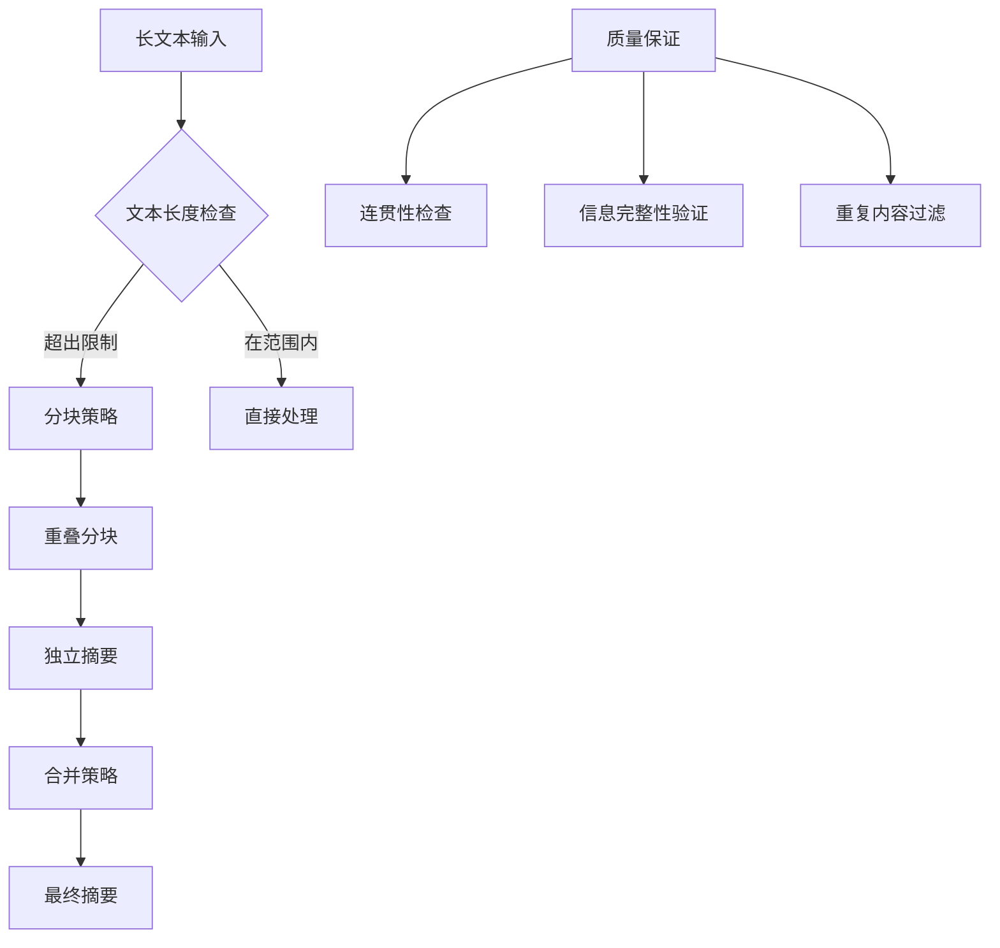

### 分块处理技术

对于超长文档，推荐采用智能分块策略：

1. **固定长度分块**：按字符或token数量分割
2. **语义分块**：基于句子边界进行分割
3. **重叠窗口**：保留上下文信息
4. **优先级排序**：根据重要性分配权重

### 内存优化策略

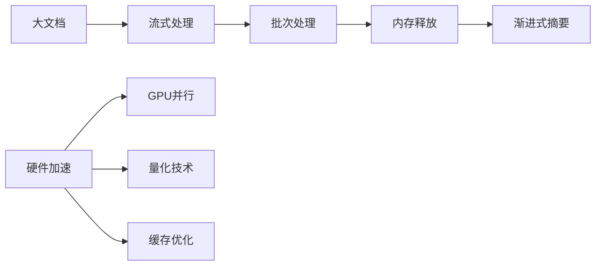

**章节来源**
- [tests/pipelines/test_pipelines_summarization.py](file://tests/pipelines/test_pipelines_summarization.py#L40-L60)

## 质量评估方法

### Rouge指标体系

摘要质量评估主要依赖于Rouge指标，提供了全面的评估维度：

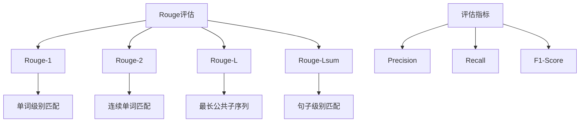

**图表来源**
- [examples/legacy/seq2seq/utils.py](file://examples/legacy/seq2seq/utils.py#L496-L528)

### 评估流程实现

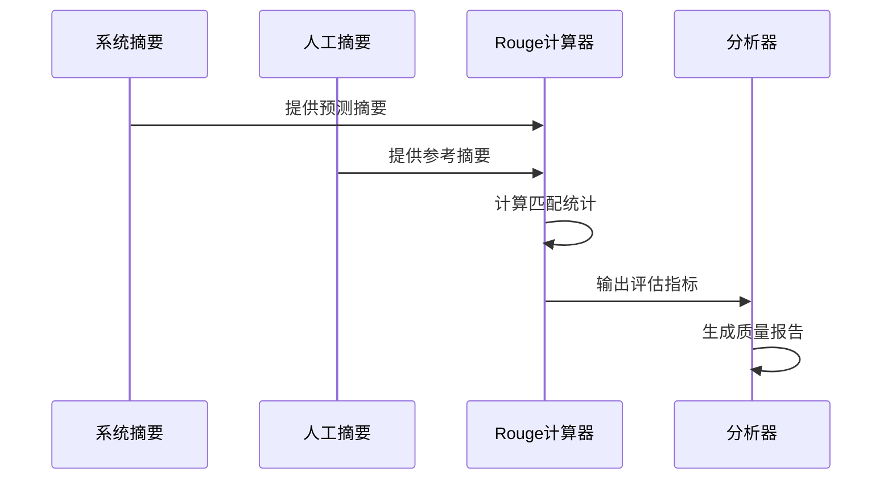

**图表来源**
- [examples/legacy/seq2seq/utils.py](file://examples/legacy/seq2seq/utils.py#L500-L550)

### 评估指标解读

| 指标 | 含义 | 适用场景 | 改进建议 |
|------|------|----------|----------|
| Rouge-1 | 单词级别精确匹配 | 关键词重要性 | 增加词汇多样性 |
| Rouge-2 | 连续词组匹配 | 语句结构保持 | 优化句子组织 |
| Rouge-L | 最长公共子序列 | 整体内容相关性 | 提升语义一致性 |
| Rouge-Lsum | 句子级别匹配 | 段落结构完整性 | 改善段落连贯性 |

**章节来源**
- [examples/pytorch/summarization/run_summarization.py](file://examples/pytorch/summarization/run_summarization.py#L620-L670)

## 故障排除指南

### 常见问题与解决方案

#### 内存不足问题
```python
# 问题：处理大文档时内存溢出
# 解决方案：
summarizer = pipeline("summarization", device=0)  # 使用GPU
# 或者分块处理
chunks = split_text(long_text, max_length=512)
results = [summarizer(chunk) for chunk in chunks]
```

#### 生成质量不佳
```python
# 问题：摘要过于简略或冗长
# 解决方案：
summary = summarizer(
    text,
    max_length=100,      # 调整最大长度
    min_length=30,       # 设置最小长度
    length_penalty=1.5,  # 控制长度倾向
    num_beams=4          # 平衡质量和速度
)
```

#### 性能优化
```python
# 问题：生成速度慢
# 解决方案：
summary = summarizer(
    text,
    num_beams=1,         # 单束搜索
    early_stopping=True, # 提前停止
    max_new_tokens=50    # 限制生成长度
)
```

### 调试技巧

1. **逐步测试**：从简单文本开始验证功能
2. **参数微调**：逐步调整生成参数观察效果
3. **质量监控**：定期使用Rouge指标评估
4. **错误日志**：记录异常情况便于分析

**章节来源**
- [tests/pipelines/test_pipelines_summarization.py](file://tests/pipelines/test_pipelines_summarization.py#L60-L80)

## 结论

摘要Pipeline作为Hugging Face Transformers库的核心组件，为文本摘要任务提供了强大而灵活的解决方案。通过深入理解其架构设计、参数配置和优化策略，开发者可以有效地利用这一工具处理各种规模和类型的文本摘要需求。

### 主要优势

1. **易用性强**：统一的API接口简化了使用复杂度
2. **模型丰富**：支持多种主流Seq2Seq架构
3. **配置灵活**：丰富的参数选项满足不同需求
4. **质量可控**：完善的评估体系确保输出质量

### 发展方向

随着大语言模型的发展，摘要Pipeline将继续演进，在以下方面取得突破：
- 更高效的长文档处理能力
- 更精准的语义理解和生成
- 更智能的多模态融合
- 更优秀的领域适应性

通过持续的技术创新和实践优化，摘要Pipeline将在信息处理和知识管理领域发挥更加重要的作用。