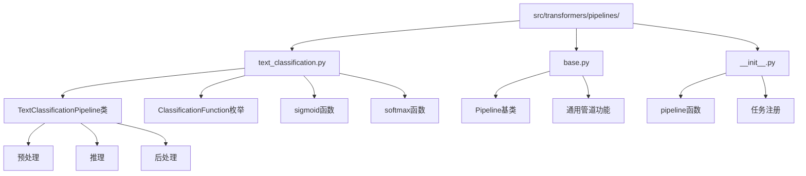
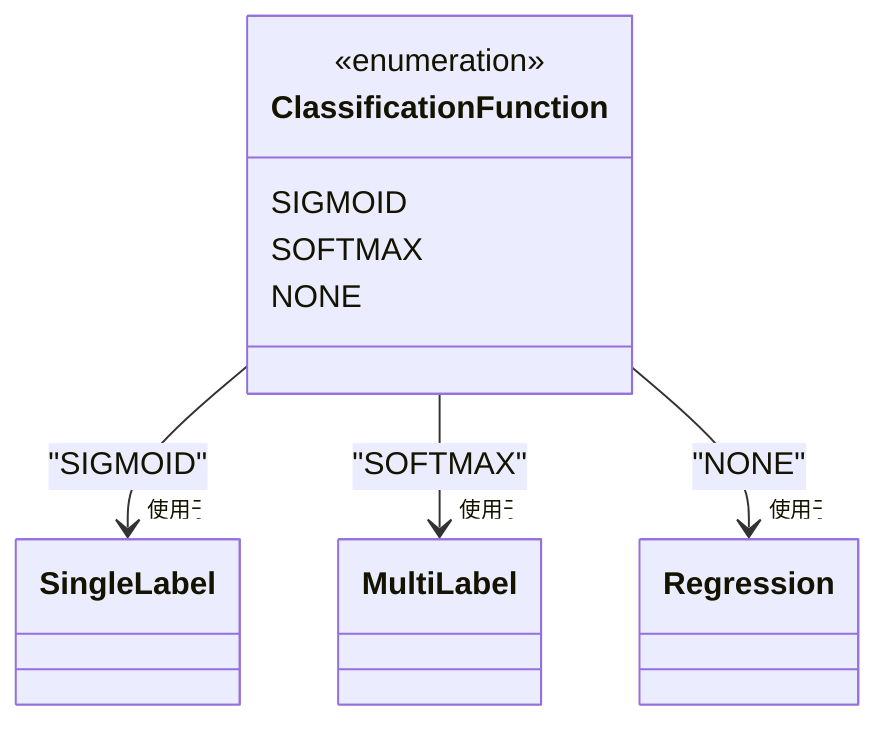
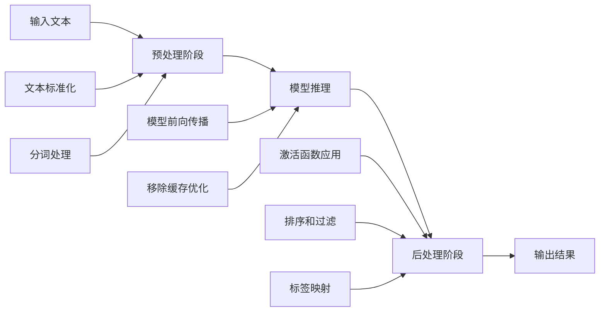
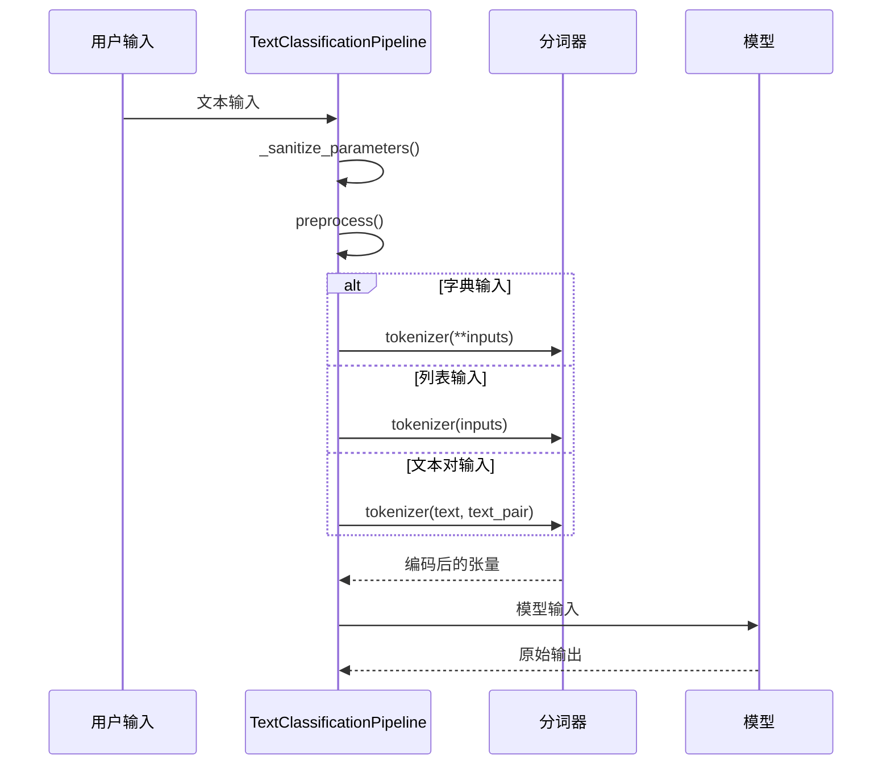
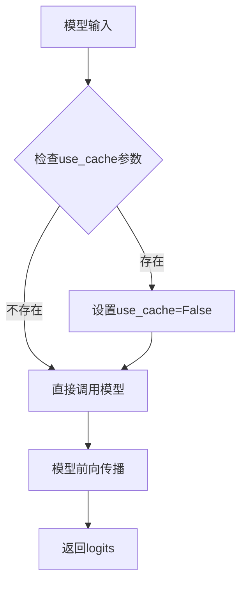
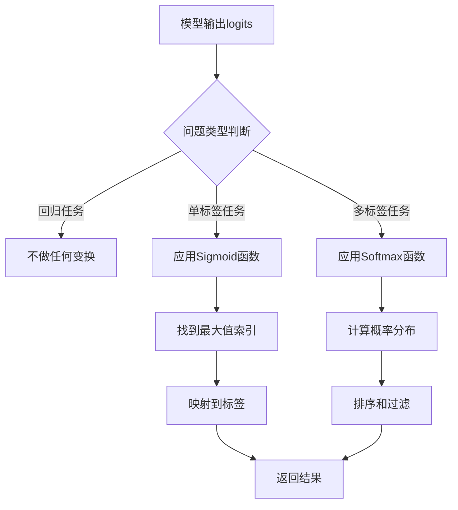
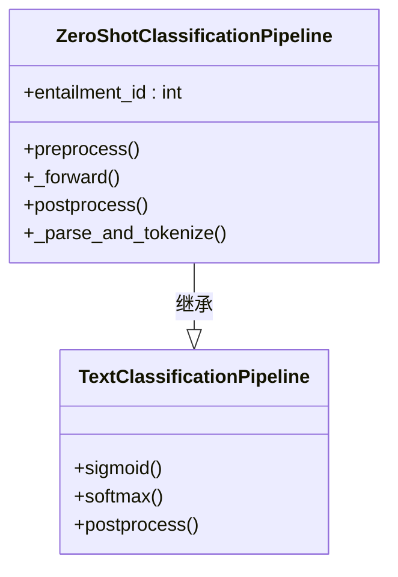
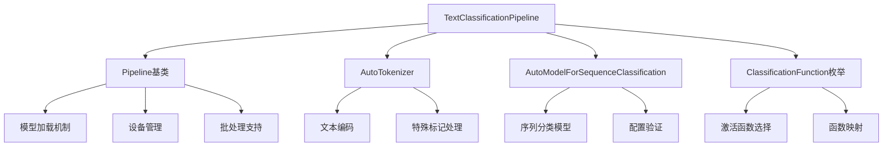

# 文本分类Pipeline

<cite>
**本文档中引用的文件**
- [text_classification.py](file://src/transformers/pipelines/text_classification.py)
- [base.py](file://src/transformers/pipelines/base.py)
- [zero_shot_classification.py](file://src/transformers/pipelines/zero_shot_classification.py)
- [__init__.py](file://src/transformers/pipelines/__init__.py)
- [test_pipelines_text_classification.py](file://tests/pipelines/test_pipelines_text_classification.py)
- [custom_pipeline.py](file://utils/test_module/custom_pipeline.py)
</cite>

## 目录
1. [简介](#简介)
2. [项目结构](#项目结构)
3. [核心组件](#核心组件)
4. [架构概览](#架构概览)
5. [详细组件分析](#详细组件分析)
6. [依赖关系分析](#依赖关系分析)
7. [性能考虑](#性能考虑)
8. [故障排除指南](#故障排除指南)
9. [结论](#结论)

## 简介

TextClassificationPipeline是Hugging Face Transformers库中的一个强大工具，专门用于执行各种文本分类任务。该Pipeline基于`ModelForSequenceClassification`构建，提供了从输入文本到分类结果的完整端到端解决方案。它支持多种分类场景，包括情感分析、主题分类、意图识别等，并且能够处理单标签和多标签分类任务。

该Pipeline的核心优势在于其简洁的API设计和强大的功能扩展性。用户只需几行代码即可完成复杂的文本分类任务，同时还可以通过配置参数来调整行为以满足特定需求。

## 项目结构

TextClassificationPipeline在transformers库中的组织结构如下：

**图表来源**
- [text_classification.py](file://src/transformers/pipelines/text_classification.py#L1-L236)
- [base.py](file://src/transformers/pipelines/base.py#L1-L100)

**章节来源**
- [text_classification.py](file://src/transformers/pipelines/text_classification.py#L1-L50)
- [base.py](file://src/transformers/pipelines/base.py#L1-L50)

## 核心组件

### TextClassificationPipeline类

TextClassificationPipeline是整个文本分类系统的核心类，继承自基础Pipeline类并实现了特定的文本分类逻辑。

#### 主要特性

1. **自动模型检测**：自动验证和加载兼容的序列分类模型
2. **灵活的输入处理**：支持字符串、列表和字典格式的输入
3. **智能激活函数选择**：根据模型配置自动选择合适的激活函数
4. **批量处理支持**：高效处理多个输入文本
5. **置信度控制**：提供多种置信度计算和过滤选项

#### 关键属性

- `_load_tokenizer = True`：指示需要加载分词器
- `return_all_scores = False`：默认不返回所有分数
- `function_to_apply = ClassificationFunction.NONE`：默认不应用激活函数

### ClassificationFunction枚举

定义了三种主要的分类函数：

**图表来源**
- [text_classification.py](file://src/transformers/pipelines/text_classification.py#L25-L30)

**章节来源**
- [text_classification.py](file://src/transformers/pipelines/text_classification.py#L30-L70)

## 架构概览

TextClassificationPipeline采用标准的管道架构模式，包含三个主要阶段：

**图表来源**
- [text_classification.py](file://src/transformers/pipelines/text_classification.py#L169-L236)
- [base.py](file://src/transformers/pipelines/base.py#L700-L800)

## 详细组件分析

### 输入预处理流程

预处理阶段负责将原始输入转换为模型可接受的格式：

**图表来源**
- [text_classification.py](file://src/transformers/pipelines/text_classification.py#L169-L191)

#### 支持的输入格式

1. **字符串输入**：直接文本
2. **列表输入**：多个文本组成的列表
3. **字典输入**：包含`text`和`text_pair`键的字典
4. **文本对输入**：用于比较或相似度计算

### 模型推理过程

推理阶段执行实际的模型预测：

**图表来源**
- [text_classification.py](file://src/transformers/pipelines/text_classification.py#L193-L200)

### 输出后处理流程

后处理阶段将模型输出转换为用户友好的格式：

**图表来源**
- [text_classification.py](file://src/transformers/pipelines/text_classification.py#L202-L236)

**章节来源**
- [text_classification.py](file://src/transformers/pipelines/text_classification.py#L169-L236)

### 零样本分类集成

TextClassificationPipeline还集成了零样本分类功能，允许在没有预定义类别的情况下进行分类：

**图表来源**
- [zero_shot_classification.py](file://src/transformers/pipelines/zero_shot_classification.py#L40-L90)
- [text_classification.py](file://src/transformers/pipelines/text_classification.py#L1-L50)

**章节来源**
- [zero_shot_classification.py](file://src/transformers/pipelines/zero_shot_classification.py#L40-L100)

## 依赖关系分析

TextClassificationPipeline的依赖关系图展示了其与其他组件的交互：

**图表来源**
- [text_classification.py](file://src/transformers/pipelines/text_classification.py#L1-L15)
- [base.py](file://src/transformers/pipelines/base.py#L1-L50)

**章节来源**
- [text_classification.py](file://src/transformers/pipelines/text_classification.py#L1-L20)
- [base.py](file://src/transformers/pipelines/base.py#L1-L50)

## 性能考虑

### 批处理优化

TextClassificationPipeline支持高效的批处理操作，可以显著提高大规模文本分类任务的性能：

1. **自动批处理**：当输入为列表时自动启用批处理
2. **内存管理**：合理管理GPU和CPU内存使用
3. **设备优化**：支持多种硬件加速器

### 激活函数选择策略

根据不同的任务类型自动选择最优的激活函数：

| 任务类型 | 激活函数 | 应用场景 |
|---------|---------|---------|
| 单标签分类 | Softmax | 多个互斥类别 |
| 多标签分类 | Sigmoid | 独立标签预测 |
| 回归任务 | None | 连续值预测 |
| 自定义 | 用户指定 | 特殊需求 |

### 内存优化技巧

1. **动态内存分配**：根据输入大小动态调整内存使用
2. **梯度禁用**：推理时自动禁用梯度计算
3. **缓存优化**：避免不必要的模型缓存

## 故障排除指南

### 常见问题及解决方案

#### 1. 模型加载失败

**问题描述**：无法加载指定的模型

**解决方案**：
- 检查模型名称是否正确
- 确认网络连接正常
- 验证模型是否支持序列分类任务

#### 2. 输入格式错误

**问题描述**：输入数据格式不符合预期

**解决方案**：
- 使用字典格式明确指定`text`和`text_pair`
- 确保输入为字符串或字符串列表
- 避免混合不同格式的输入

#### 3. 性能问题

**问题描述**：推理速度过慢

**解决方案**：
- 启用GPU加速
- 调整批处理大小
- 使用量化模型
- 优化输入数据格式

#### 4. 结果质量不佳

**问题描述**：分类结果不准确

**解决方案**：
- 检查模型选择是否合适
- 验证输入预处理是否正确
- 调整置信度阈值
- 考虑使用更大的模型

**章节来源**
- [test_pipelines_text_classification.py](file://tests/pipelines/test_pipelines_text_classification.py#L50-L150)

## 结论

TextClassificationPipeline是Hugging Face Transformers库中一个功能强大且易于使用的文本分类工具。它通过简洁的API设计和丰富的功能选项，为开发者提供了完整的文本分类解决方案。

### 主要优势

1. **易用性**：简单的API设计，快速上手
2. **灵活性**：支持多种输入格式和配置选项
3. **性能**：内置优化的批处理和内存管理
4. **扩展性**：良好的架构设计支持功能扩展
5. **兼容性**：与各种序列分类模型兼容

### 最佳实践建议

1. **模型选择**：根据具体任务选择合适的预训练模型
2. **参数调优**：合理配置`top_k`、`function_to_apply`等参数
3. **性能优化**：在生产环境中启用GPU加速和批处理
4. **错误处理**：添加适当的异常处理和输入验证
5. **监控指标**：跟踪性能指标和模型准确性

TextClassificationPipeline不仅适用于简单的文本分类任务，还可以作为更复杂NLP应用的基础组件。通过深入理解其内部机制和最佳实践，开发者可以充分发挥其潜力，构建高质量的文本分类系统。