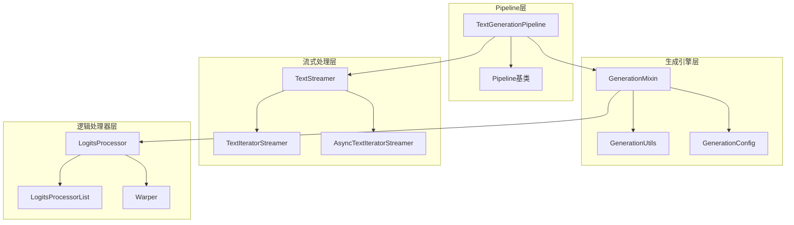
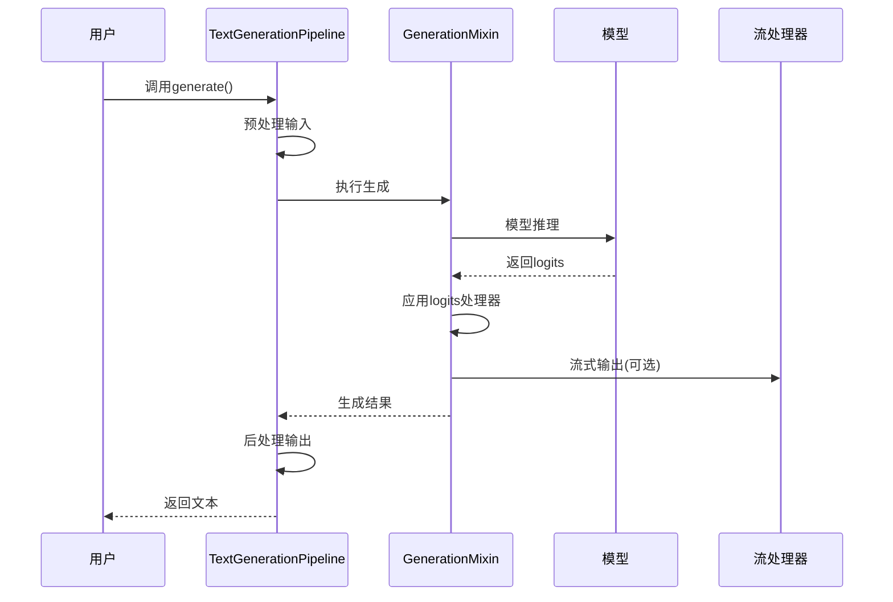
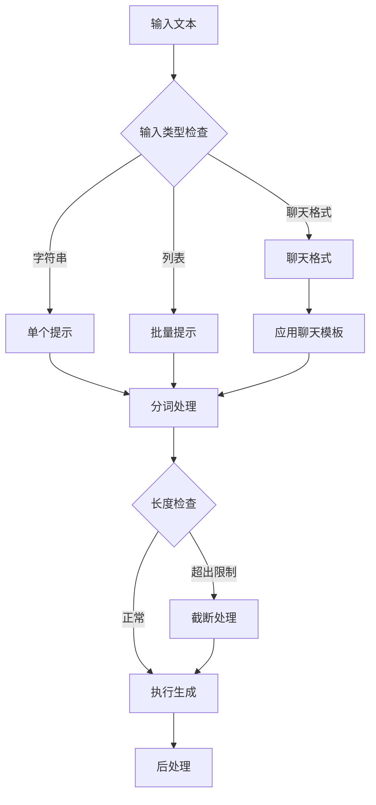
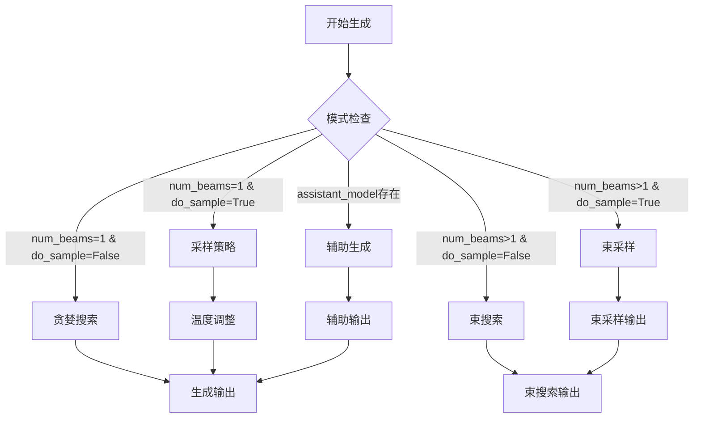
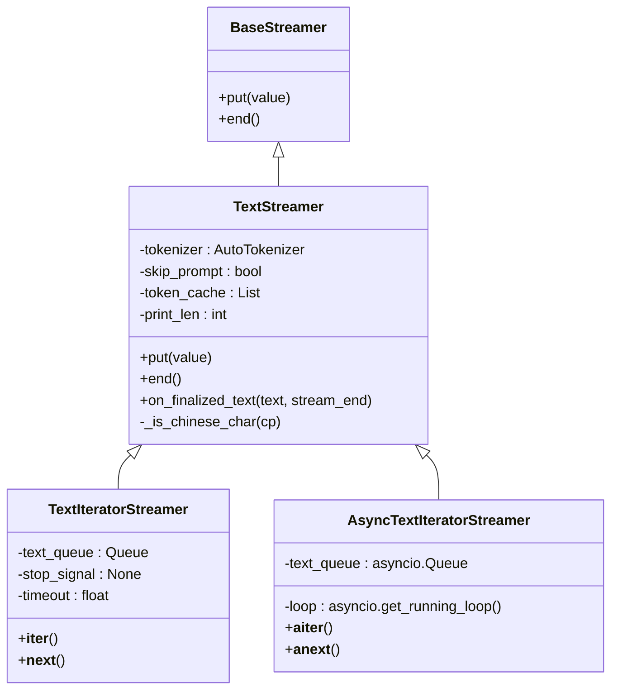
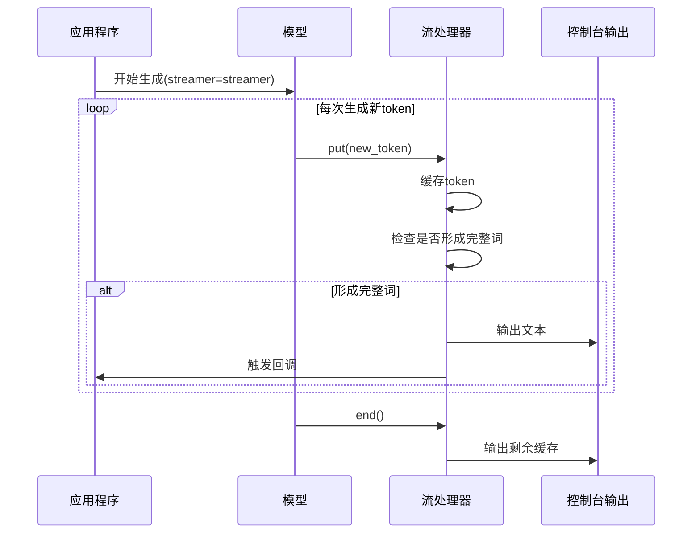
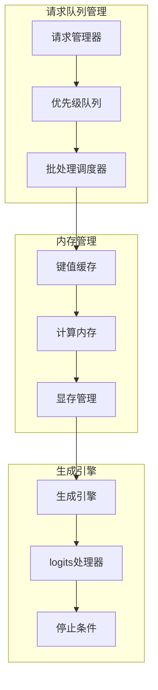

# 文本生成Pipeline

<cite>
**本文档中引用的文件**
- [text_generation.py](file://src/transformers/pipelines/text_generation.py)
- [utils.py](file://src/transformers/generation/utils.py)
- [streamers.py](file://src/transformers/generation/streamers.py)
- [configuration_utils.py](file://src/transformers/generation/configuration_utils.py)
- [logits_process.py](file://src/transformers/generation/logits_process.py)
- [run_generation.py](file://examples/pytorch/text-generation/run_generation.py)
- [continuous_api.py](file://src/transformers/generation/continuous_batching/continuous_api.py)
</cite>

## 目录
1. [简介](#简介)
2. [项目结构](#项目结构)
3. [核心组件](#核心组件)
4. [架构概览](#架构概览)
5. [详细组件分析](#详细组件分析)
6. [生成参数配置](#生成参数配置)
7. [流式生成机制](#流式生成机制)
8. [批处理优化策略](#批处理优化策略)
9. [实际应用示例](#实际应用示例)
10. [性能优化与内存管理](#性能优化与内存管理)
11. [故障排除指南](#故障排除指南)
12. [结论](#结论)

## 简介

Transformers库中的TextGenerationPipeline是一个功能强大的文本生成工具，基于先进的语言模型实现自动化的文本补全、对话生成和内容创作。该Pipeline不仅支持传统的贪婪解码和采样策略，还提供了丰富的生成参数配置选项，包括温度控制、top-k/top-p采样、重复惩罚等高级功能。

本文档将深入探讨TextGenerationPipeline的实现原理、配置方法、使用技巧以及性能优化策略，帮助开发者充分利用这一强大的文本生成工具。

## 项目结构

TextGenerationPipeline的核心实现分布在多个模块中，形成了一个层次化的架构：



**图表来源**
- [text_generation.py](file://src/transformers/pipelines/text_generation.py#L37-L62)
- [utils.py](file://src/transformers/generation/utils.py#L300-L400)
- [streamers.py](file://src/transformers/generation/streamers.py#L20-L50)

**章节来源**
- [text_generation.py](file://src/transformers/pipelines/text_generation.py#L1-L540)
- [utils.py](file://src/transformers/generation/utils.py#L1-L800)

## 核心组件

### TextGenerationPipeline类

TextGenerationPipeline是整个文本生成系统的核心入口点，继承自基础Pipeline类，专门用于处理因果语言模型的文本生成任务。

主要特性：
- 支持单个或批量文本输入
- 自动处理聊天格式输入
- 集成多种生成策略
- 提供灵活的输出格式控制

### GenerationConfig配置系统

GenerationConfig类提供了统一的生成参数管理机制，支持以下关键参数：

| 参数类别 | 主要参数 | 默认值 | 作用描述 |
|---------|---------|--------|----------|
| 长度控制 | max_new_tokens | 256 | 最大生成新词数 |
| 长度控制 | max_length | 20 | 最大序列长度 |
| 长度控制 | min_length | 0 | 最小序列长度 |
| 采样策略 | temperature | 0.7 | 控制随机性程度 |
| 采样策略 | top_k | 50 | top-k过滤阈值 |
| 采样策略 | top_p | 1.0 | top-p累积概率阈值 |
| 采样策略 | repetition_penalty | 1.0 | 重复惩罚系数 |
| 搜索策略 | num_beams | 1 | 束搜索宽度 |

**章节来源**
- [text_generation.py](file://src/transformers/pipelines/text_generation.py#L80-L120)
- [configuration_utils.py](file://src/transformers/generation/configuration_utils.py#L80-L200)

## 架构概览

TextGenerationPipeline采用分层架构设计，从用户接口到底层模型调用形成了清晰的职责分离：



**图表来源**
- [text_generation.py](file://src/transformers/pipelines/text_generation.py#L400-L500)
- [utils.py](file://src/transformers/generation/utils.py#L200-L300)

## 详细组件分析

### 输入预处理机制

TextGenerationPipeline实现了智能的输入预处理系统，能够处理多种输入格式：



**图表来源**
- [text_generation.py](file://src/transformers/pipelines/text_generation.py#L350-L450)

### 生成策略选择

系统支持多种生成策略，根据参数配置自动选择最优策略：



**图表来源**
- [configuration_utils.py](file://src/transformers/generation/configuration_utils.py#L475-L501)

**章节来源**
- [text_generation.py](file://src/transformers/pipelines/text_generation.py#L150-L350)
- [configuration_utils.py](file://src/transformers/generation/configuration_utils.py#L400-L500)

## 生成参数配置

### 核心生成参数详解

#### max_length vs max_new_tokens

这两个参数控制生成序列的长度，但作用方式不同：

- **max_length**: 总序列长度（包含输入和生成部分）
- **max_new_tokens**: 仅生成的新词数

```python
# 示例配置
generation_config = GenerationConfig(
    max_new_tokens=100,      # 生成最多100个新词
    max_length=200,         # 总长度不超过200
    # 如果未指定max_new_tokens，则max_length控制总长度
)
```

#### 温度参数 (temperature)

温度参数控制生成的随机性：

- **temperature = 1.0**: 正常采样，平衡创造性和一致性
- **temperature < 1.0**: 更确定性，倾向于高概率词
- **temperature > 1.0**: 更创造性，探索低概率词

#### Top-k 和 Top-p 采样

这两种策略用于控制词汇选择范围：

- **top_k**: 仅考虑概率最高的k个词
- **top_p**: 考虑累积概率达到p的最小词集

#### 重复惩罚 (repetition_penalty)

防止模型重复生成相同内容：

- **penalty = 1.0**: 无惩罚
- **penalty > 1.0**: 鼓励多样性
- **penalty < 1.0**: 增加重复倾向

**章节来源**
- [configuration_utils.py](file://src/transformers/generation/configuration_utils.py#L100-L200)
- [logits_process.py](file://src/transformers/generation/logits_process.py#L200-L300)

## 流式生成机制

### TextStreamer类

TextStreamer提供了实时文本输出功能，适用于交互式应用：



**图表来源**
- [streamers.py](file://src/transformers/generation/streamers.py#L20-L100)

### 流式生成工作流程



**图表来源**
- [streamers.py](file://src/transformers/generation/streamers.py#L100-L200)

**章节来源**
- [streamers.py](file://src/transformers/generation/streamers.py#L1-L319)

## 批处理优化策略

### 连续批处理 (Continuous Batching)

连续批处理是一种高效的GPU资源利用技术，允许多个请求同时进行但按顺序处理：



**图表来源**
- [continuous_api.py](file://src/transformers/generation/continuous_batching/continuous_api.py#L700-L800)

### 内存优化技术

#### 动态批处理大小调整

系统根据可用内存动态调整批处理大小：

```python
# 内存计算公式
memory_footprint = batch_size * sequence_length * dtype_size * overhead_factor
available_memory = system_memory * memory_ratio

# 自适应调整
if memory_footprint > available_memory:
    batch_size = batch_size // 2
    sequence_length = min(sequence_length, max_seq_length)
```

#### KV缓存优化

通过智能缓存管理减少内存占用：

- **静态缓存**: 固定大小的缓存池
- **动态缓存**: 根据序列长度动态分配
- **量化缓存**: 使用FP16或INT8降低内存需求

**章节来源**
- [continuous_api.py](file://src/transformers/generation/continuous_batching/continuous_api.py#L1-L200)

## 实际应用示例

### 基础文本补全

```python
from transformers import pipeline

# 创建管道
generator = pipeline("text-generation", model="gpt2")

# 基础补全
prompt = "人工智能的未来发展趋势"
result = generator(prompt, max_new_tokens=50, temperature=0.7)
print(result[0]['generated_text'])
```

### 对话生成

```python
# 聊天格式输入
chat_history = [
    {"role": "user", "content": "什么是量子计算？"},
    {"role": "assistant", "content": "量子计算是一种利用量子力学原理进行信息处理的计算方式。"},
    {"role": "user", "content": "它有什么优势？"}
]

result = generator(chat_history, max_new_tokens=100)
print(result[0]['generated_text'])
```

### 创意写作

```python
# 故事创作
story_prompt = {
    "role": "system",
    "content": "你是一位创意作家，请根据以下主题创作一个短篇故事："
}

character_prompt = {
    "role": "user", 
    "content": "一位迷失在时间中的科学家"
}

full_story = generator([story_prompt, character_prompt], max_new_tokens=300)
```

### 流式生成示例

```python
from transformers import TextStreamer

# 设置流式输出
streamer = TextStreamer(tokenizer, skip_prompt=True)

# 流式生成
output = model.generate(
    input_ids,
    max_new_tokens=200,
    streamer=streamer,
    temperature=0.8,
    do_sample=True
)
```

**章节来源**
- [run_generation.py](file://examples/pytorch/text-generation/run_generation.py#L400-L450)

## 性能优化与内存管理

### GPU内存优化策略

#### 混合精度训练

使用FP16或BF16降低内存占用：

```python
# 模型加载时启用混合精度
model = AutoModelForCausalLM.from_pretrained(
    model_name,
    torch_dtype=torch.bfloat16,
    device_map="auto"
)
```

#### 梯度检查点

在内存受限的情况下启用梯度检查点：

```python
generation_config = GenerationConfig(
    gradient_checkpointing=True,
    use_cache=False,  # 禁用KV缓存以节省内存
)
```

### 批处理性能优化

#### 动态批处理

根据序列长度动态调整批处理大小：

```python
def optimize_batch_size(model, input_lengths, max_memory_ratio=0.9):
    """根据输入长度优化批处理大小"""
    max_tokens = model.config.max_position_embeddings
    batch_sizes = []
    
    for length in input_lengths:
        # 计算每个序列所需的内存
        memory_per_sequence = length * model.config.hidden_size * 4
        # 计算最大可能的批处理大小
        max_batch_size = min(
            len(input_lengths),
            max_tokens // length,
            int(max_memory_ratio * available_memory // memory_per_sequence)
        )
        batch_sizes.append(max_batch_size)
    
    return min(batch_sizes)
```

#### 缓存策略优化

```python
# 智能缓存配置
cache_config = {
    "cache_implementation": "static",  # 静态缓存适合固定序列长度
    "cache_config": {
        "num_beams": 4,
        "batch_size": 8
    }
}

generation_config = GenerationConfig(**cache_config)
```

### 并行化策略

#### 数据并行

```python
from accelerate import Accelerator

accelerator = Accelerator()
model = accelerator.prepare(model)

# 在多GPU上分布生成
outputs = accelerator.gather(model.generate(...))
```

#### 张量并行

```python
# 分布式注意力机制
model = AutoModelForCausalLM.from_pretrained(
    model_name,
    attn_implementation="flash_attention_2",
    device_map="auto"
)
```

## 故障排除指南

### 常见问题及解决方案

#### 内存不足错误

**问题**: CUDA out of memory
**解决方案**:
1. 减少批处理大小
2. 启用梯度检查点
3. 使用混合精度训练
4. 启用连续批处理

#### 生成质量不佳

**问题**: 生成内容重复或不连贯
**解决方案**:
1. 调整温度参数 (0.7-1.0)
2. 增加重复惩罚 (1.1-1.3)
3. 使用top-k/top-p采样
4. 检查输入提示的质量

#### 性能问题

**问题**: 生成速度过慢
**解决方案**:
1. 启用KV缓存
2. 使用连续批处理
3. 优化模型配置
4. 启用编译优化

### 调试技巧

#### 生成过程监控

```python
import logging
from transformers import logging as hf_logging

# 启用详细日志
hf_logging.set_verbosity_info()

# 监控生成统计
generation_config = GenerationConfig(
    output_scores=True,
    output_attentions=True,
    output_hidden_states=True
)
```

#### 性能分析

```python
import time
import torch.profiler

with torch.profiler.profile(
    activities=[torch.profiler.ProfilerActivity.CPU, torch.profiler.ProfilerActivity.CUDA],
    record_shapes=True,
    with_stack=True
) as prof:
    outputs = model.generate(input_ids, **generation_config)

print(prof.key_averages().table(sort_by="cuda_time_total"))
```

**章节来源**
- [utils.py](file://src/transformers/generation/utils.py#L3000-L3500)

## 结论

Transformers库的TextGenerationPipeline提供了一个功能强大且灵活的文本生成解决方案。通过深入理解其架构设计、参数配置和优化策略，开发者可以构建出高效、高质量的文本生成应用。

关键要点总结：

1. **模块化设计**: 清晰的分层架构便于维护和扩展
2. **灵活配置**: 丰富的生成参数满足不同应用场景需求
3. **性能优化**: 多种优化策略确保高效运行
4. **流式支持**: 实时输出功能提升用户体验
5. **内存管理**: 智能的内存分配和缓存策略

随着模型规模的不断增长和应用场景的多样化，TextGenerationPipeline将继续演进，为AI应用开发提供更加强大和便捷的工具支持。