# 文本相关Pipeline

<cite>
**本文档中引用的文件**
- [src/transformers/pipelines/__init__.py](file://src/transformers/pipelines/__init__.py)
- [src/transformers/pipelines/text_classification.py](file://src/transformers/pipelines/text_classification.py)
- [src/transformers/pipelines/text_generation.py](file://src/transformers/pipelines/text_generation.py)
- [src/transformers/pipelines/question_answering.py](file://src/transformers/pipelines/question_answering.py)
- [src/transformers/pipelines/fill_mask.py](file://src/transformers/pipelines/fill_mask.py)
- [src/transformers/pipelines/token_classification.py](file://src/transformers/pipelines/token_classification.py)
- [src/transformers/pipelines/text2text_generation.py](file://src/transformers/pipelines/text2text_generation.py)
- [src/transformers/pipelines/document_question_answering.py](file://src/transformers/pipelines/document_question_answering.py)
- [src/transformers/pipelines/base.py](file://src/transformers/pipelines/base.py)
- [src/transformers/generation/streamers.py](file://src/transformers/generation/streamers.py)
</cite>

## 目录
1. [简介](#简介)
2. [Pipeline架构概览](#pipeline架构概览)
3. [文本分类Pipeline](#文本分类pipeline)
4. [文本生成Pipeline](#文本生成pipeline)
5. [问答Pipeline](#问答pipeline)
6. [填空Pipeline](#填空pipeline)
7. [命名实体识别Pipeline](#命名实体识别pipeline)
8. [摘要和翻译Pipeline](#摘要和翻译pipeline)
9. [文档问答Pipeline](#文档问答pipeline)
10. [零样本分类Pipeline](#零样本分类pipeline)
11. [文本编码和解码机制](#文本编码和解码机制)
12. [性能优化和最佳实践](#性能优化和最佳实践)
13. [故障排除指南](#故障排除指南)

## 简介

Transformers库提供了强大的文本处理Pipeline，能够简化各种自然语言处理任务的实现。这些Pipeline封装了复杂的模型推理过程，为开发者提供了简单易用的接口。本文档将详细介绍transformers库中处理文本数据的主要Pipeline类型及其使用方法。

## Pipeline架构概览

所有Pipeline都基于统一的基础架构，遵循相同的生命周期：预处理（preprocess）、模型推理（forward）、后处理（postprocess）。

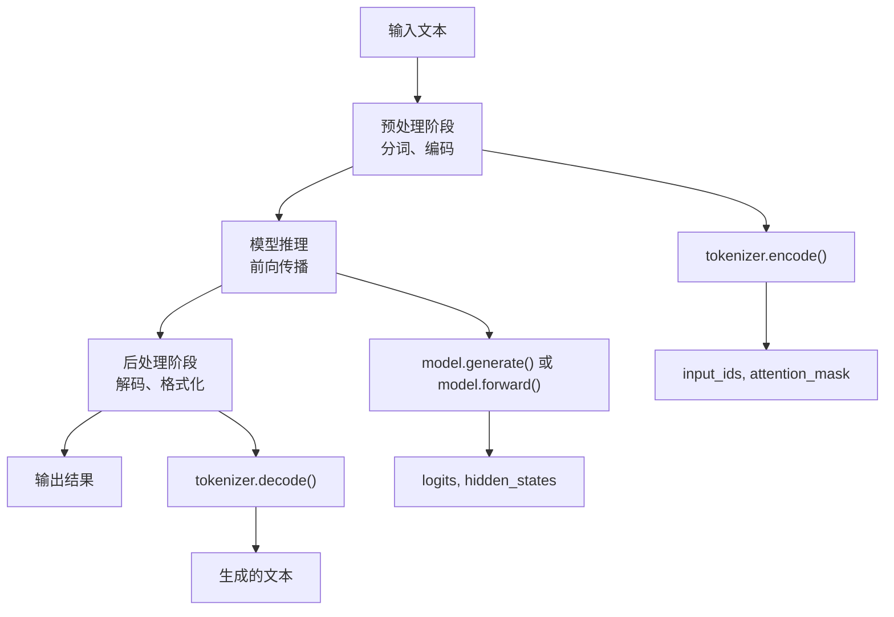

**图表来源**
- [src/transformers/pipelines/base.py](file://src/transformers/pipelines/base.py#L1-L200)

**章节来源**
- [src/transformers/pipelines/base.py](file://src/transformers/pipelines/base.py#L1-L200)

## 文本分类Pipeline

文本分类Pipeline用于对输入文本进行情感分析、主题分类等任务。它支持单标签和多标签分类，并提供灵活的置信度控制。

### 核心特性

- **多任务支持**：情感分析、主题分类、意图识别
- **置信度控制**：通过`function_to_apply`参数控制输出概率计算方式
- **批量处理**：支持批量输入提高效率
- **自定义标签映射**：可配置标签到人类可读名称的映射

### 输入预处理流程

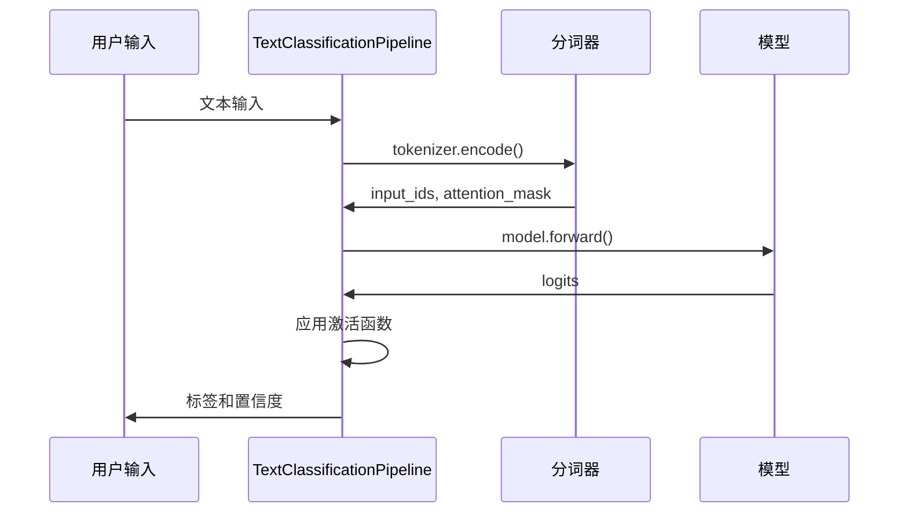

**图表来源**
- [src/transformers/pipelines/text_classification.py](file://src/transformers/pipelines/text_classification.py#L150-L235)

### 置信度阈值配置

文本分类Pipeline支持多种激活函数来控制输出概率：

| 函数类型 | 适用场景 | 数学公式 |
|---------|---------|---------|
| `sigmoid` | 单标签二分类 | σ(x) = 1/(1+e^(-x)) |
| `softmax` | 多标签分类 | softmax(x_i) = e^(x_i)/Σe^(x_j) |
| `none` | 回归任务 | 不应用任何函数 |

### 使用示例

```python
# 基础情感分析
classifier = pipeline("text-classification")
result = classifier("这个产品真的很好用！")

# 自定义置信度函数
result = classifier("这个产品真的很差", 
                   function_to_apply="sigmoid")

# 批量处理
results = classifier(["正面评价", "负面评价", "中性评论"])
```

**章节来源**
- [src/transformers/pipelines/text_classification.py](file://src/transformers/pipelines/text_classification.py#L1-L236)

## 文本生成Pipeline

文本生成Pipeline是最复杂的Pipeline之一，支持多种生成策略和流式输出。它广泛应用于对话系统、内容创作、代码生成等场景。

### 生成参数配置

文本生成Pipeline提供了丰富的参数控制选项：

| 参数类别 | 关键参数 | 默认值 | 功能描述 |
|---------|---------|-------|---------|
| 长度控制 | `max_new_tokens` | 256 | 生成的最大新token数 |
| 长度控制 | `min_new_tokens` | 0 | 生成的最小新token数 |
| 采样策略 | `temperature` | 0.7 | 控制随机性的温度参数 |
| 采样策略 | `top_p` | 1.0 | 核采样的概率阈值 |
| 采样策略 | `top_k` | 50 | 保留最高k个候选token |
| 束搜索 | `num_beams` | 1 | 束搜索的beam数量 |
| 提前停止 | `early_stopping` | False | 是否提前停止生成 |

### 流式生成机制

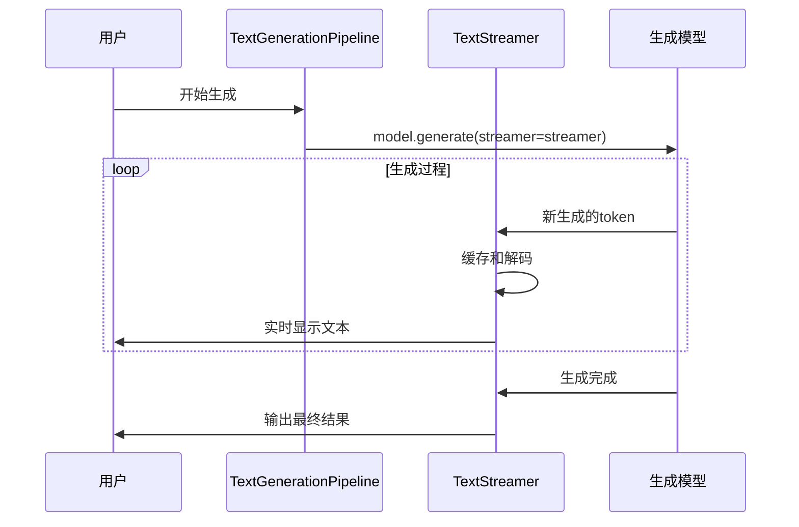

**图表来源**
- [src/transformers/generation/streamers.py](file://src/transformers/generation/streamers.py#L1-L319)

### 流式生成使用模式

#### 同步流式生成
```python
from transformers import pipeline, TextStreamer

generator = pipeline("text-generation")
streamer = TextStreamer(generator.tokenizer)

# 同步流式生成
output = generator("请写一首关于春天的诗：", 
                  streamer=streamer,
                  max_new_tokens=100)
```

#### 异步流式生成
```python
from transformers import pipeline, AsyncTextIteratorStreamer
import asyncio

async def generate_text():
    generator = pipeline("text-generation")
    streamer = AsyncTextIteratorStreamer(generator.tokenizer)
    
    # 在单独线程中启动生成
    generation_kwargs = dict(
        inputs="请写一个故事：",
        streamer=streamer,
        max_new_tokens=200
    )
    
    thread = Thread(target=model.generate, kwargs=generation_kwargs)
    thread.start()
    
    # 异步迭代生成结果
    async for new_text in streamer:
        print(new_text, end="", flush=True)
```

### 批处理生成

```python
# 批量生成多个序列
generator = pipeline("text-generation")
results = generator(
    ["请续写：这是一个测试", "写一封感谢信："],
    num_return_sequences=2,
    max_new_tokens=50,
    do_sample=True
)
```

**章节来源**
- [src/transformers/pipelines/text_generation.py](file://src/transformers/pipelines/text_generation.py#L1-L540)
- [src/transformers/generation/streamers.py](file://src/transformers/generation/streamers.py#L1-L319)

## 问答Pipeline

问答Pipeline支持抽取式和生成式两种问答模式，能够从给定上下文中提取答案或生成新的回答。

### 抽取式问答 vs 生成式问答

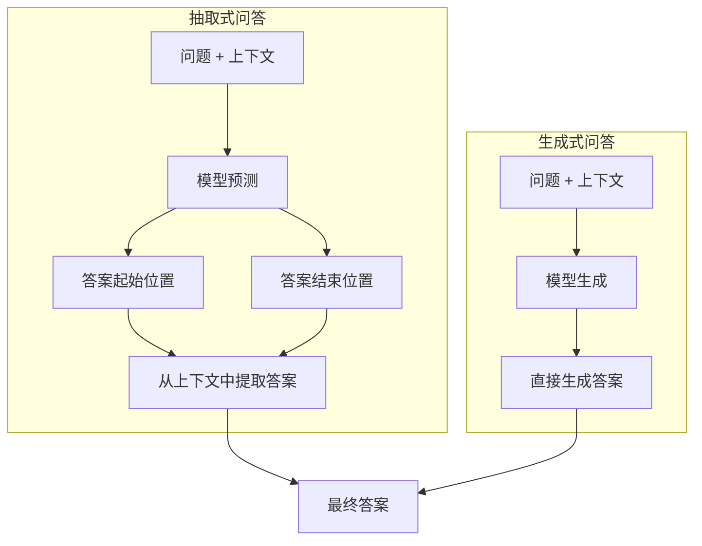

**图表来源**
- [src/transformers/pipelines/question_answering.py](file://src/transformers/pipelines/question_answering.py#L1-L686)

### 长文档问答处理

对于超长文档，Pipeline采用分块处理策略：

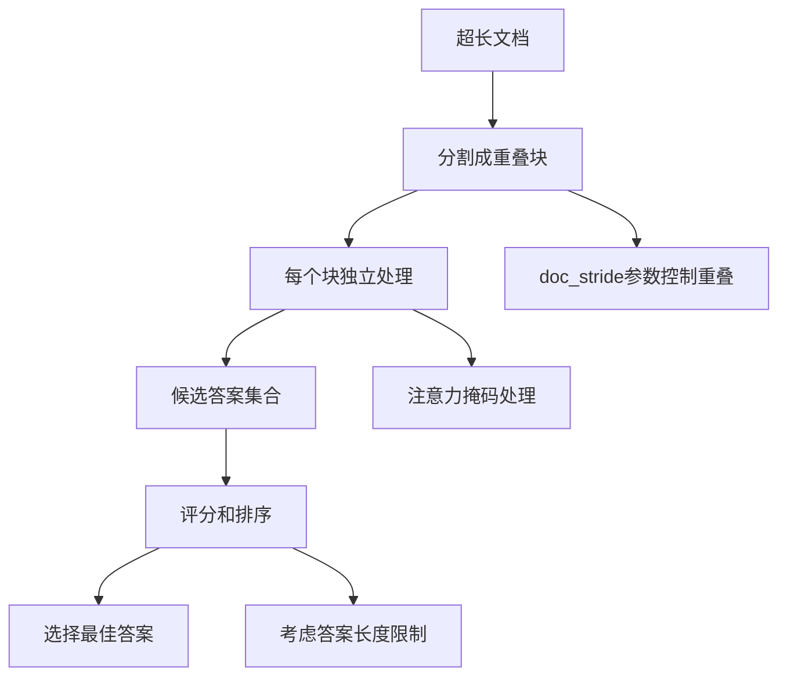

**图表来源**
- [src/transformers/pipelines/question_answering.py](file://src/transformers/pipelines/question_answering.py#L400-L500)

### 参数配置详解

| 参数 | 类型 | 默认值 | 功能描述 |
|-----|------|-------|---------|
| `max_seq_len` | int | 384 | 每个chunk的最大长度 |
| `doc_stride` | int | 128 | 文档重叠部分的长度 |
| `max_answer_len` | int | 15 | 最大答案长度 |
| `top_k` | int | 1 | 返回的答案数量 |
| `handle_impossible_answer` | bool | False | 是否允许返回空答案 |

### 使用示例

```python
# 基础问答
qa_pipeline = pipeline("question-answering")
result = qa_pipeline(
    question="谁创立了HuggingFace？",
    context="HuggingFace成立于巴黎。"
)

# 长文档问答
long_context = "..." * 1000  # 超长文档
results = qa_pipeline(
    question="HuggingFace在哪里成立？",
    context=long_context,
    max_seq_len=512,
    doc_stride=128,
    max_answer_len=20
)

# 批量问答
questions = ["什么是AI？", "机器学习是什么？"]
contexts = ["人工智能是...", "机器学习是一种..."]
results = qa_pipeline(
    question=questions,
    context=contexts
)
```

**章节来源**
- [src/transformers/pipelines/question_answering.py](file://src/transformers/pipelines/question_answering.py#L1-L686)

## 填空Pipeline

填空Pipeline专门用于掩码语言模型的任务，能够预测被遮蔽的token。

### 掩码Token处理

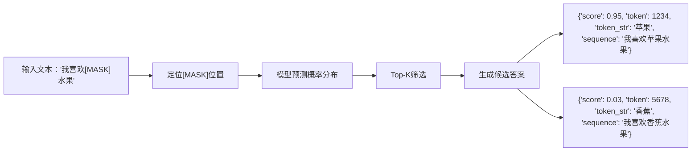

**图表来源**
- [src/transformers/pipelines/fill_mask.py](file://src/transformers/pipelines/fill_mask.py#L1-L260)

### 多掩码支持

填空Pipeline支持多个[MASK]标记的处理：

```python
# 单掩码
result = fill_mask("我喜欢[MASK]水果")

# 多掩码
result = fill_mask("我喜欢[MASK]和[MASK]水果")
```

### 目标词汇限制

```python
# 只考虑特定词汇
result = fill_mask(
    "我喜欢[MASK]水果",
    targets=["苹果", "香蕉", "橙子"]
)
```

**章节来源**
- [src/transformers/pipelines/fill_mask.py](file://src/transformers/pipelines/fill_mask.py#L1-L260)

## 命名实体识别Pipeline

命名实体识别（NER）Pipeline能够识别文本中的实体类型，如人名、地名、组织名等。

### 实体聚合策略

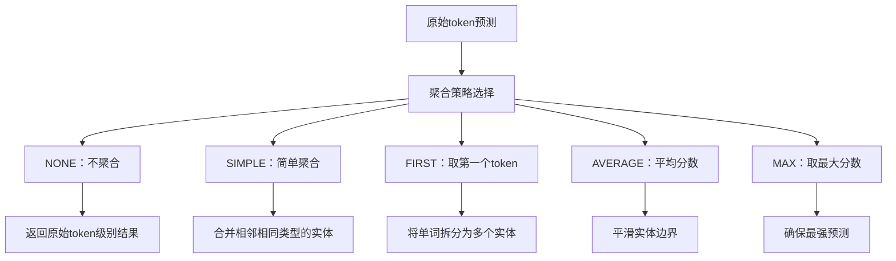

**图表来源**
- [src/transformers/pipelines/token_classification.py](file://src/transformers/pipelines/token_classification.py#L1-L647)

### 聚合策略对比

| 策略 | 优点 | 缺点 | 适用场景 |
|-----|------|------|---------|
| `NONE` | 保持原始粒度 | 结果过于细碎 | 需要精确位置信息 |
| `SIMPLE` | 简单易懂 | 可能产生重复实体 | 一般用途 |
| `FIRST` | 解决单词拆分问题 | 忽略其他token信息 | 词级别任务 |
| `AVERAGE` | 平滑结果 | 可能掩盖强预测 | 需要稳定结果 |
| `MAX` | 确保最佳预测 | 可能忽略其他信息 | 高精度要求 |

### 使用示例

```python
# 基础NER
ner_pipeline = pipeline("ner", aggregation_strategy="simple")
text = "微软公司在北京开设了新的办公室"
entities = ner_pipeline(text)

# 词级别聚合
entities = ner_pipeline(
    text,
    aggregation_strategy="first"
)

# 批量处理
texts = ["张三在北京工作", "李四在上海创业"]
entities = ner_pipeline(texts)
```

**章节来源**
- [src/transformers/pipelines/token_classification.py](file://src/transformers/pipelines/token_classification.py#L1-L647)

## 摘要和翻译Pipeline

摘要和翻译Pipeline都基于seq2seq架构，使用Text2TextGenerationPipeline作为基础类。

### 摘要Pipeline特性

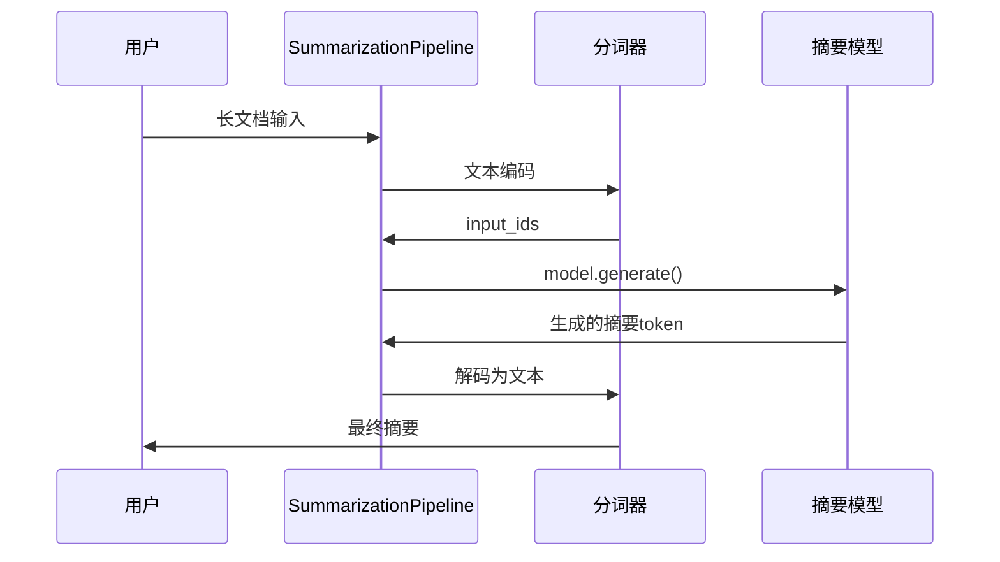

**图表来源**
- [src/transformers/pipelines/text2text_generation.py](file://src/transformers/pipelines/text2text_generation.py#L1-L387)

### 摘要Pipeline参数验证

摘要Pipeline会自动检查输入长度与生成参数的合理性：

```python
# 输入长度检查
def check_inputs(self, input_length: int, min_length: int, max_new_tokens: int):
    if max_new_tokens < min_length:
        logger.warning(f"min_length={min_length}必须小于max_new_tokens={max_new_tokens}")
    
    if input_length < max_new_tokens:
        logger.warning(
            f"max_new_tokens设置为{max_new_tokens}，但输入长度只有{input_length}。"
            f"建议减少max_new_tokens，例如summarizer('...', max_new_tokens={input_length//2})"
        )
```

### 翻译Pipeline多语言支持

```python
# 单一语言对翻译
translator = pipeline("translation_en_to_fr")
result = translator("How are you?")

# 多语言模型翻译
translator = pipeline("translation")
result = translator(
    "Hello world",
    src_lang="en_XX",
    tgt_lang="fr_FR"
)
```

**章节来源**
- [src/transformers/pipelines/text2text_generation.py](file://src/transformers/pipelines/text2text_generation.py#L1-L387)

## 文档问答Pipeline

文档问答Pipeline专门处理包含图像的文档，能够从PDF、扫描件等文档中提取信息。

### 支持的模型类型

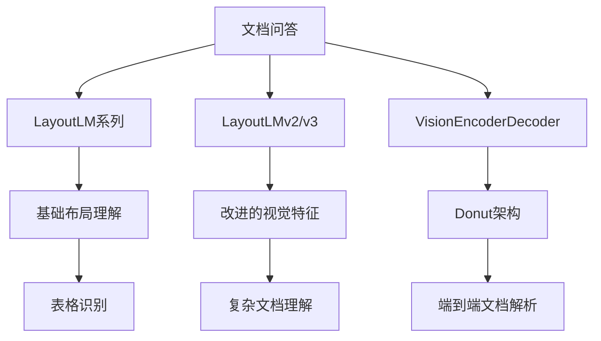

**图表来源**
- [src/transformers/pipelines/document_question_answering.py](file://src/transformers/pipelines/document_question_answering.py#L1-L199)

### OCR集成

文档问答Pipeline支持Tesseract OCR进行文本识别：

```python
# 自动OCR处理
result = document_qa(
    image="invoice.png",
    question="发票号码是多少？"
)

# 自定义OCR参数
result = document_qa(
    image="invoice.png",
    question="发票号码是多少？",
    lang="eng",
    tesseract_config="--psm 6"
)
```

**章节来源**
- [src/transformers/pipelines/document_question_answering.py](file://src/transformers/pipelines/document_question_answering.py#L1-L199)

## 零样本分类Pipeline

零样本分类Pipeline不需要训练数据，通过候选标签的语义理解来进行分类。

### 工作原理

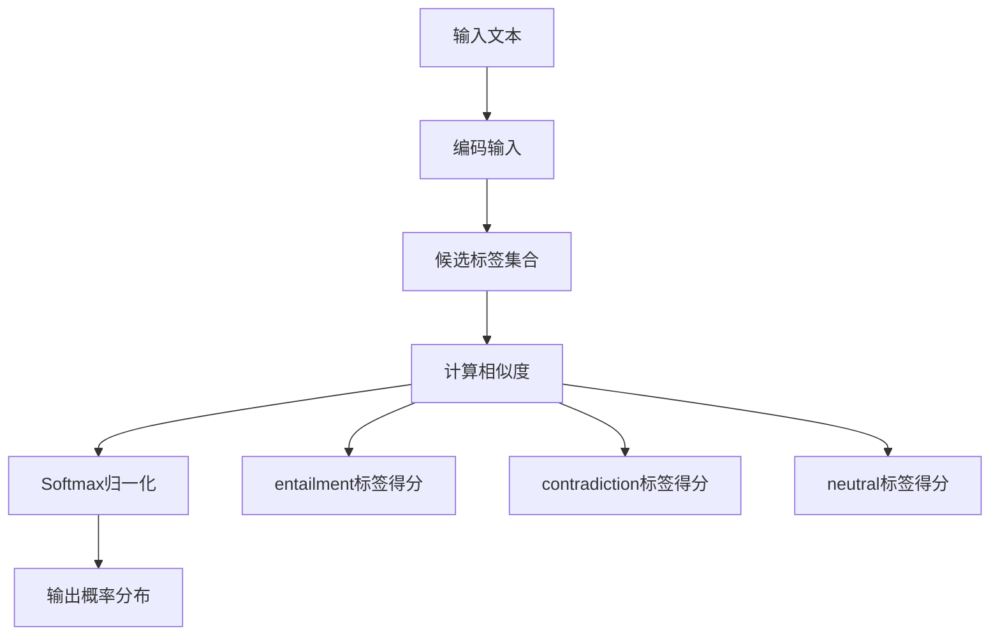

**图表来源**
- [src/transformers/pipelines/__init__.py](file://src/transformers/pipelines/__init__.py#L1-L799)

### 使用示例

```python
# 基础零样本分类
classifier = pipeline("zero-shot-classification")
result = classifier(
    "我今天感觉很糟糕",
    candidate_labels=["积极", "消极", "中性"]
)

# 图像零样本分类
image_classifier = pipeline("zero-shot-image-classification")
result = image_classifier(
    "parrots.png",
    candidate_labels=["黑色和白色", "摄影写实", "绘画"]
)
```

## 文本编码和解码机制

### 编码流程

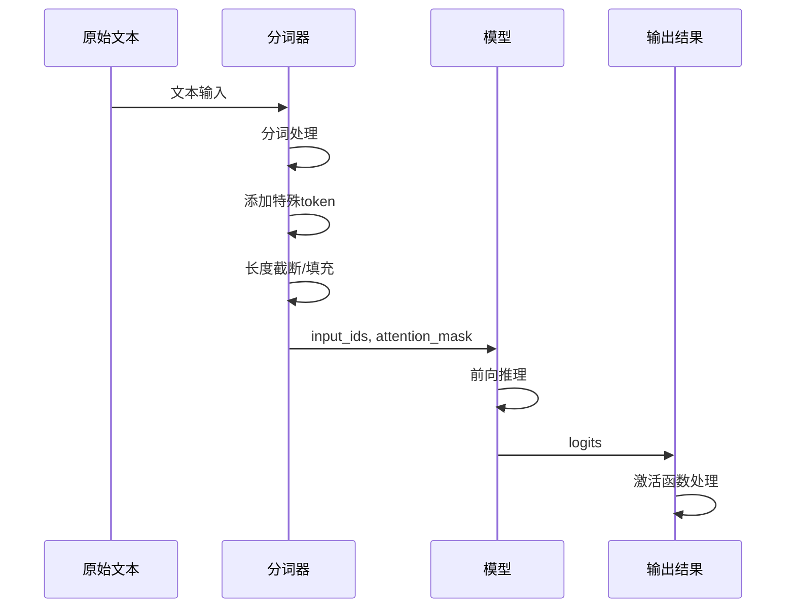

### 解码流程

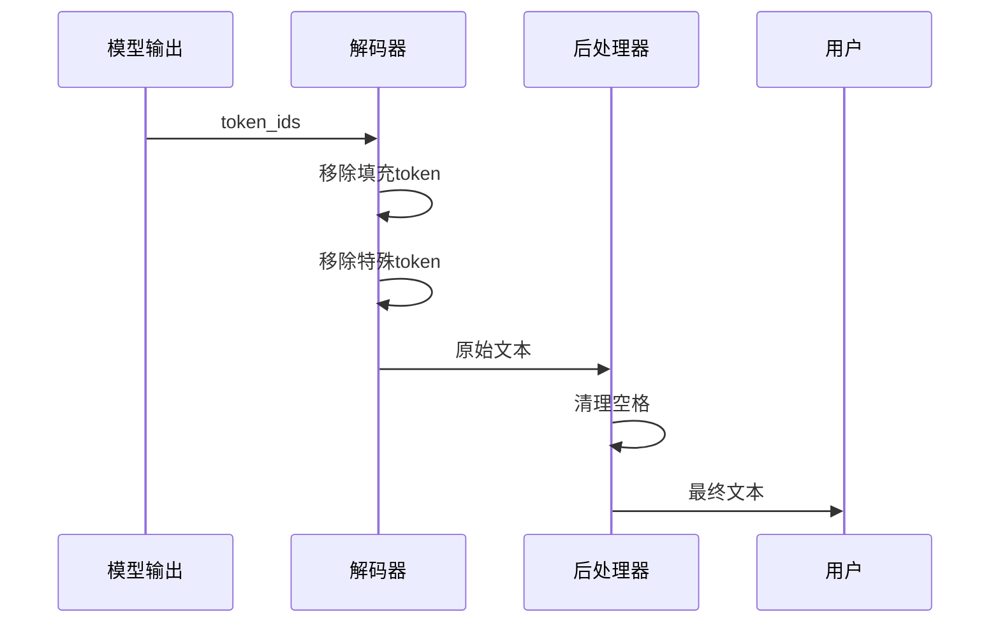

### 特殊Token处理

| Token类型 | 功能 | 示例 |
|----------|------|------|
| `pad_token` | 填充 | `[PAD]` |
| `cls_token` | 分类 | `[CLS]` |
| `sep_token` | 分隔 | `[SEP]` |
| `mask_token` | 掩码 | `[MASK]` |
| `unk_token` | 未知 | `[UNK]` |

## 性能优化和最佳实践

### 批处理优化

```python
# 批处理配置
pipeline = pipeline(
    "text-generation",
    model="gpt2",
    batch_size=4,  # 批处理大小
    device=0        # GPU设备
)

# 批量生成
texts = ["故事开头：", "诗歌创作：", "对话开始：", "总结要点："]
results = pipeline(texts, max_new_tokens=100)
```

### 内存管理

```python
# 模型量化
pipeline = pipeline(
    "text-generation",
    model="gpt2",
    torch_dtype=torch.float16,  # 半精度
    device_map="auto"           # 自动设备分配
)

# 梯度检查点
pipeline.model.gradient_checkpointing_enable()
```

### 缓存策略

```python
# 启用KV缓存
pipeline = pipeline(
    "text-generation",
    model="gpt2",
    use_cache=True
)

# 自定义缓存大小
pipeline.model.generation_config.cache_implementation = "static"
```

## 故障排除指南

### 常见错误及解决方案

| 错误类型 | 症状 | 解决方案 |
|---------|------|---------|
| 内存不足 | CUDA out of memory | 减少batch_size或使用模型量化 |
| 速度慢 | 生成时间过长 | 启用GPU加速或使用更小的模型 |
| 结果质量差 | 输出不连贯 | 调整temperature或使用更好的模型 |
| 编码错误 | 字符乱码 | 检查tokenizer配置和字符集 |

### 调试技巧

```python
# 启用详细日志
import logging
logging.basicConfig(level=logging.DEBUG)

# 检查模型配置
print(pipeline.model.config)

# 验证输入格式
print(pipeline.tokenizer("测试文本"))
```

### 性能监控

```python
import time
import psutil

# 性能测量
start_time = time.time()
start_memory = psutil.Process().memory_info().rss

# 执行Pipeline
result = pipeline("测试文本")

end_time = time.time()
end_memory = psutil.Process().memory_info().rss

print(f"耗时: {end_time - start_time:.2f}s")
print(f"内存使用: {(end_memory - start_memory) / 1024 / 1024:.2f}MB")
```

通过本文档的详细介绍，您应该能够熟练掌握transformers库中各种文本相关Pipeline的使用方法和最佳实践。这些Pipeline不仅简化了NLP任务的实现，还提供了丰富的配置选项来满足不同的应用场景需求。