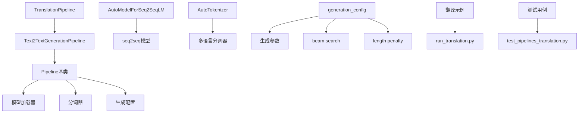
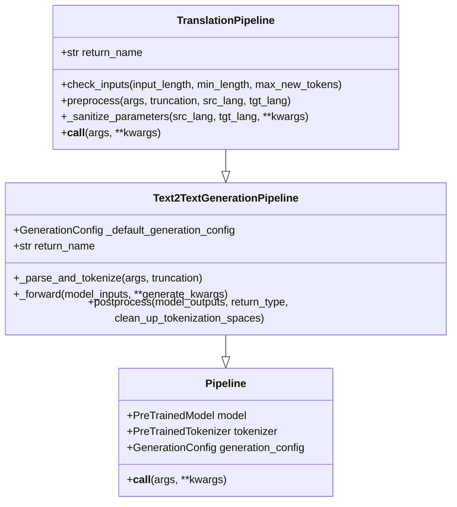
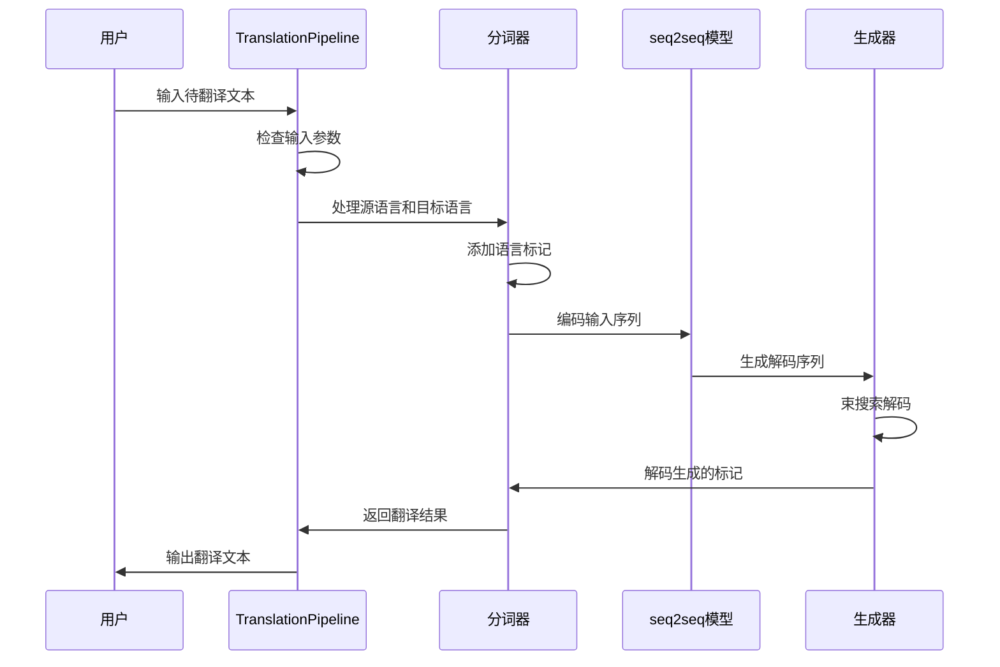
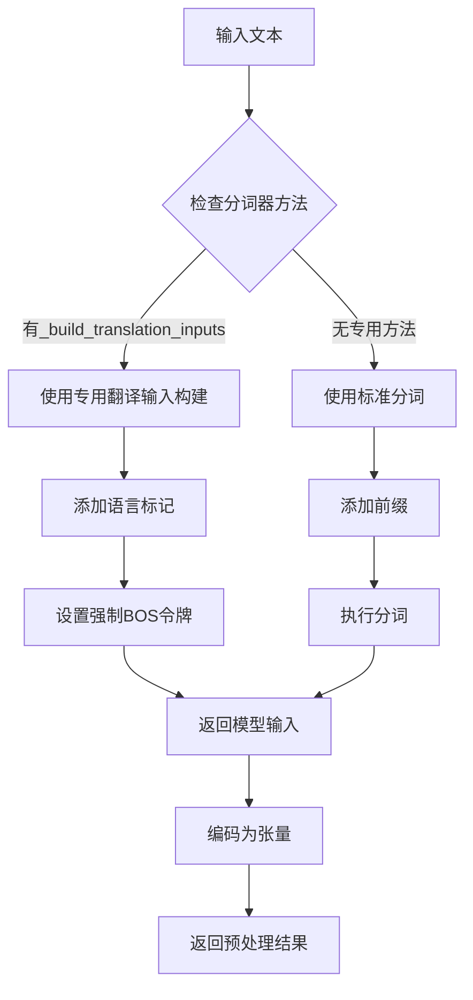
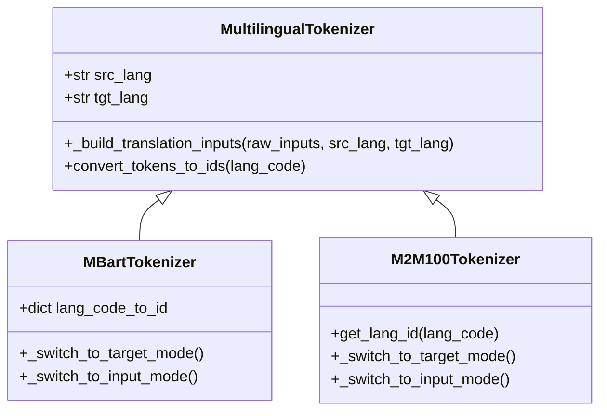
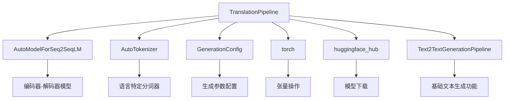

# 翻译Pipeline

<cite>
**本文档中引用的文件**
- [src/transformers/pipelines/text2text_generation.py](file://src/transformers/pipelines/text2text_generation.py)
- [src/transformers/pipelines/__init__.py](file://src/transformers/pipelines/__init__.py)
- [examples/pytorch/translation/run_translation.py](file://examples/pytorch/translation/run_translation.py)
- [tests/pipelines/test_pipelines_translation.py](file://tests/pipelines/test_pipelines_translation.py)
- [src/transformers/generation/utils.py](file://src/transformers/generation/utils.py)
- [src/transformers/generation/configuration_utils.py](file://src/transformers/generation/configuration_utils.py)
</cite>

## 目录
1. [简介](#简介)
2. [项目结构](#项目结构)
3. [核心组件](#核心组件)
4. [架构概览](#架构概览)
5. [详细组件分析](#详细组件分析)
6. [依赖关系分析](#依赖关系分析)
7. [性能考虑](#性能考虑)
8. [故障排除指南](#故障排除指南)
9. [结论](#结论)

## 简介

TranslationPipeline是Hugging Face Transformers库中专门用于文本翻译任务的管道组件。它基于序列到序列（seq2seq）模型架构，能够实现从一种语言到另一种语言的自动文本翻译。该管道支持多种翻译模型，包括单语言对翻译和多语言翻译，并提供了丰富的配置选项来优化翻译质量和性能。

TranslationPipeline继承自Text2TextGenerationPipeline，利用了先进的编码器-解码器架构和注意力机制，为用户提供高质量的机器翻译服务。通过灵活的语言参数配置和强大的生成策略，该管道能够处理各种翻译场景，从简单的文本翻译到复杂的文档翻译。

## 项目结构

TranslationPipeline在transformers库中的组织结构体现了模块化设计原则：



**图表来源**
- [src/transformers/pipelines/text2text_generation.py](file://src/transformers/pipelines/text2text_generation.py#L298-L385)
- [src/transformers/pipelines/__init__.py](file://src/transformers/pipelines/__init__.py#L180-L190)

**章节来源**
- [src/transformers/pipelines/text2text_generation.py](file://src/transformers/pipelines/text2text_generation.py#L298-L385)
- [src/transformers/pipelines/__init__.py](file://src/transformers/pipelines/__init__.py#L180-L190)

## 核心组件

### TranslationPipeline类

TranslationPipeline是翻译功能的核心实现类，它扩展了Text2TextGenerationPipeline的功能，专门为翻译任务进行了优化：



**图表来源**
- [src/transformers/pipelines/text2text_generation.py](file://src/transformers/pipelines/text2text_generation.py#L298-L385)
- [src/transformers/pipelines/text2text_generation.py](file://src/transformers/pipelines/text2text_generation.py#L30-L106)

### 默认生成配置

TranslationPipeline使用以下默认生成配置来确保翻译质量：

| 参数 | 默认值 | 说明 |
|------|--------|------|
| max_new_tokens | 256 | 生成的最大新标记数 |
| num_beams | 4 | 束搜索的束数量 |
| early_stopping | False | 是否启用早期停止 |
| length_penalty | 2.0 | 长度惩罚因子 |

**章节来源**
- [src/transformers/pipelines/text2text_generation.py](file://src/transformers/pipelines/text2text_generation.py#L75-L85)

## 架构概览

TranslationPipeline采用经典的编码器-解码器架构，结合注意力机制实现高质量的文本翻译：



**图表来源**
- [src/transformers/pipelines/text2text_generation.py](file://src/transformers/pipelines/text2text_generation.py#L320-L385)
- [src/transformers/generation/utils.py](file://src/transformers/generation/utils.py#L3241-L3262)

## 详细组件分析

### 语言参数处理

TranslationPipeline支持两种语言参数传递方式：

#### 方法一：任务标识符
```python
# 使用任务标识符指定语言对
translator = pipeline("translation_en_to_fr")
result = translator("Hello world")
```

#### 方法二：显式参数
```python
# 显式指定源语言和目标语言
translator = pipeline("translation", src_lang="en", tgt_lang="fr")
result = translator("Hello world")
```

### 预处理流程

预处理阶段负责将原始文本转换为模型可接受的格式：



**图表来源**
- [src/transformers/pipelines/text2text_generation.py](file://src/transformers/pipelines/text2text_generation.py#L320-L335)

### 生成策略

TranslationPipeline支持多种生成策略来优化翻译质量：

#### 束搜索（Beam Search）
```python
# 启用束搜索以提高翻译质量
outputs = translator("文本", num_beams=4, length_penalty=2.0)
```

#### 长度归一化
通过length_penalty参数控制生成序列的长度偏好：
- 值 > 1.0：鼓励更长的翻译
- 值 < 1.0：鼓励更短的翻译
- 默认值：2.0

#### 词汇限制
可以使用eos_token_id参数限制生成过程的结束条件。

**章节来源**
- [src/transformers/generation/utils.py](file://src/transformers/generation/utils.py#L3241-L3262)
- [src/transformers/generation/configuration_utils.py](file://src/transformers/generation/configuration_utils.py#L106-L122)

### 多语言翻译支持

对于多语言翻译模型，TranslationPipeline提供了专门的语言标记处理：



**图表来源**
- [examples/pytorch/translation/run_translation.py](file://examples/pytorch/translation/run_translation.py#L50-L55)

**章节来源**
- [tests/pipelines/test_pipelines_translation.py](file://tests/pipelines/test_pipelines_translation.py#L112-L140)

### 批量翻译优化

TranslationPipeline支持批量翻译以提高处理效率：

#### 单文本翻译
```python
# 单个文本翻译
result = translator("单个句子")
```

#### 批量文本翻译
```python
# 批量翻译多个句子
texts = ["句子1", "句子2", "句子3"]
results = translator(texts)
```

#### 性能优化策略

| 优化技术 | 说明 | 适用场景 |
|----------|------|----------|
| 批处理 | 将多个输入合并为批次处理 | 大量短文本 |
| 模型量化 | 使用INT8/FP16精度 | 内存受限环境 |
| 动态批处理 | 根据序列长度动态调整批次大小 | 不同长度的文本混合 |
| 缓存机制 | 缓存中间计算结果 | 重复翻译相同内容 |

**章节来源**
- [src/transformers/pipelines/text2text_generation.py](file://src/transformers/pipelines/text2text_generation.py#L350-L365)

## 依赖关系分析

TranslationPipeline与多个组件存在密切的依赖关系：



**图表来源**
- [src/transformers/pipelines/text2text_generation.py](file://src/transformers/pipelines/text2text_generation.py#L1-L20)
- [src/transformers/pipelines/__init__.py](file://src/transformers/pipelines/__init__.py#L180-L190)

**章节来源**
- [src/transformers/pipelines/text2text_generation.py](file://src/transformers/pipelines/text2text_generation.py#L1-L20)
- [src/transformers/pipelines/__init__.py](file://src/transformers/pipelines/__init__.py#L180-L190)

## 性能考虑

### 翻译速度优化

#### 模型选择
- **小模型**：适合实时应用，如T5-tiny
- **中等模型**：平衡质量和速度，如T5-base
- **大模型**：适合高质量翻译，如T5-large

#### 生成参数调优
```python
# 快速翻译配置
fast_config = {
    "max_new_tokens": 100,
    "num_beams": 1,
    "do_sample": False
}

# 质量优先配置
quality_config = {
    "max_new_tokens": 256,
    "num_beams": 4,
    "length_penalty": 2.0,
    "early_stopping": True
}
```

### 内存优化

#### 模型量化
- INT8量化：减少内存占用约50%
- FP16半精度：平衡质量和内存使用
- 动态量化：运行时自动选择精度

#### 批处理策略
```python
# 动态批处理示例
def dynamic_batch_translate(translator, texts, max_batch_size=32):
    results = []
    for i in range(0, len(texts), max_batch_size):
        batch = texts[i:i+max_batch_size]
        batch_results = translator(batch)
        results.extend(batch_results)
    return results
```

## 故障排除指南

### 常见问题及解决方案

#### 1. 语言参数错误
**问题**：`ValueError: Translation requires a src_lang and a tgt_lang`
**解决方案**：
```python
# 确保正确设置语言参数
translator = pipeline("translation", src_lang="en", tgt_lang="fr")
```

#### 2. 模型不兼容
**问题**：模型无法处理特定语言对
**解决方案**：
```python
# 检查模型支持的语言对
from transformers import AutoTokenizer
tokenizer = AutoTokenizer.from_pretrained("model_name")
print(tokenizer.supported_language_codes)
```

#### 3. 内存不足
**问题**：处理大型文本时出现OOM错误
**解决方案**：
```python
# 减少批次大小或使用量化
translator = pipeline("translation", model="small_model", torch_dtype=torch.float16)
```

#### 4. 翻译质量不佳
**问题**：翻译结果不准确或不自然
**解决方案**：
```python
# 调整生成参数
params = {
    "num_beams": 4,
    "length_penalty": 1.5,
    "max_new_tokens": 200,
    "early_stopping": True
}
result = translator(text, **params)
```

**章节来源**
- [tests/pipelines/test_pipelines_translation.py](file://tests/pipelines/test_pipelines_translation.py#L112-L140)

## 结论

TranslationPipeline作为Hugging Face Transformers库中的核心翻译组件，提供了强大而灵活的文本翻译功能。通过基于seq2seq模型的编码器-解码器架构，结合先进的注意力机制和束搜索算法，该管道能够实现高质量的机器翻译。

主要优势包括：
- 支持多种翻译模型和语言对
- 提供丰富的配置选项优化翻译质量
- 兼容批量处理和实时翻译场景
- 集成多种性能优化技术

未来发展方向：
- 更多语言对的支持
- 实时翻译能力的进一步提升
- 多模态翻译（文本+图像）
- 边缘设备上的高效部署

通过合理配置和优化，TranslationPipeline能够满足从个人应用到企业级部署的各种翻译需求，为用户提供可靠、高效的机器翻译解决方案。