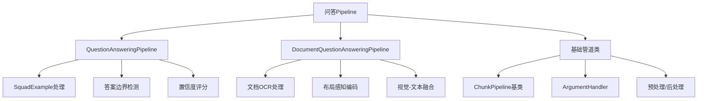
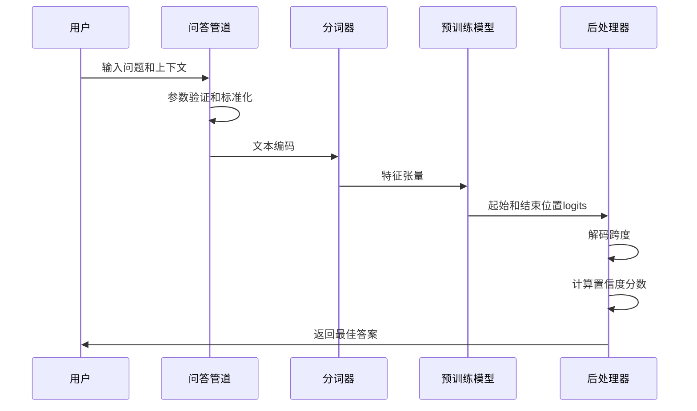
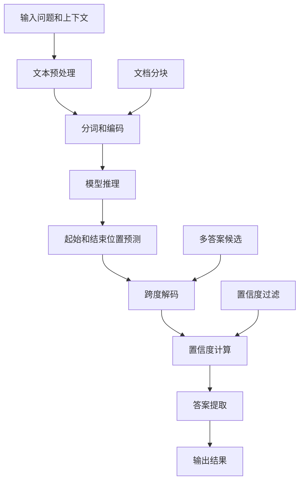
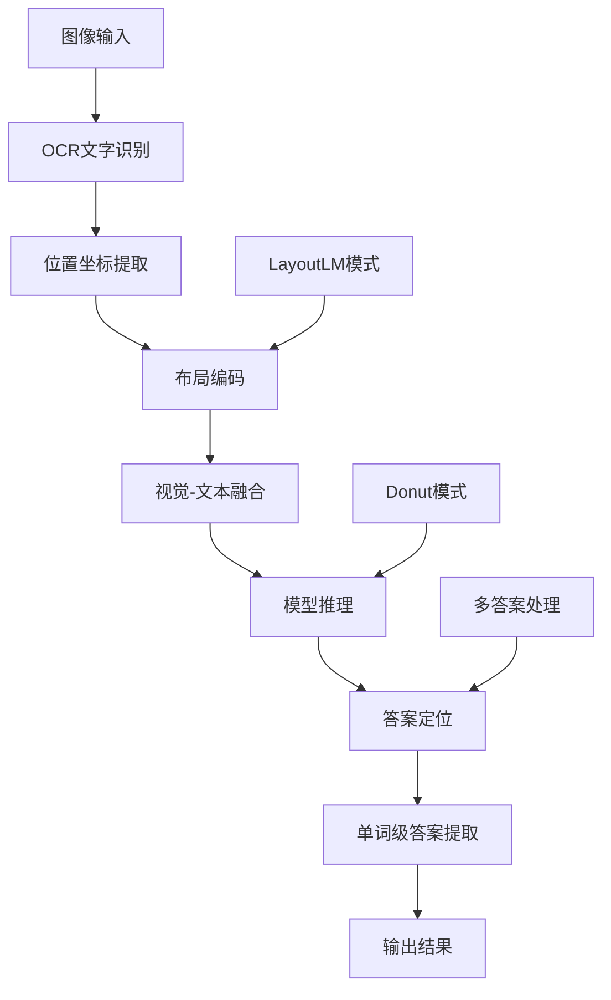
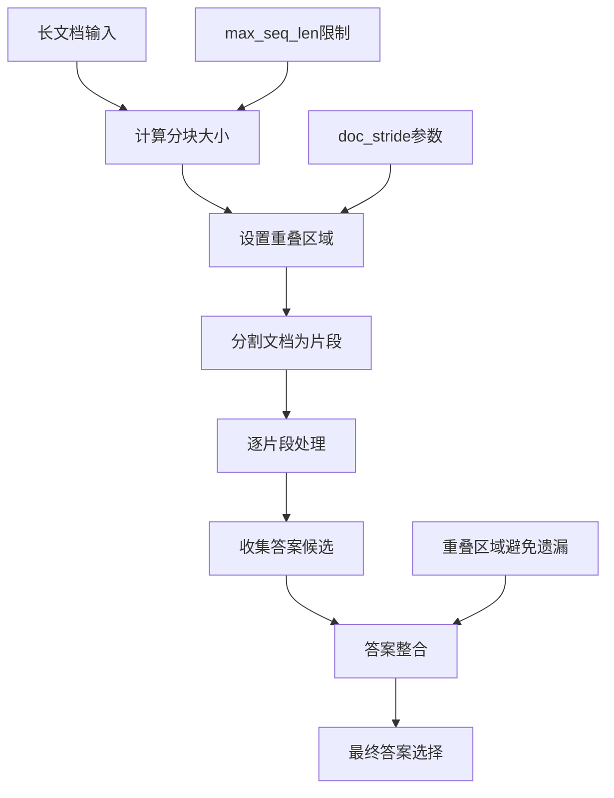
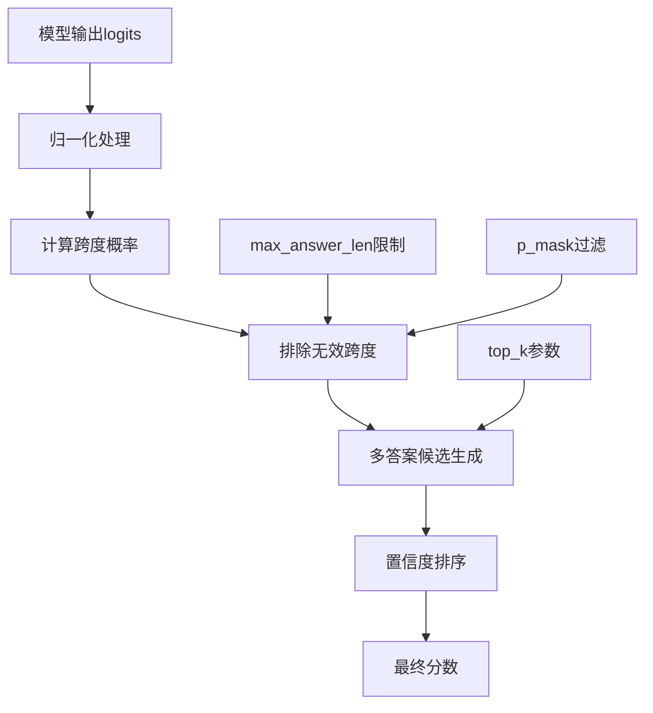
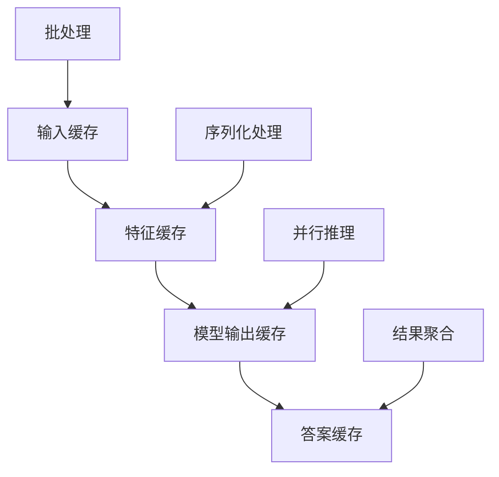
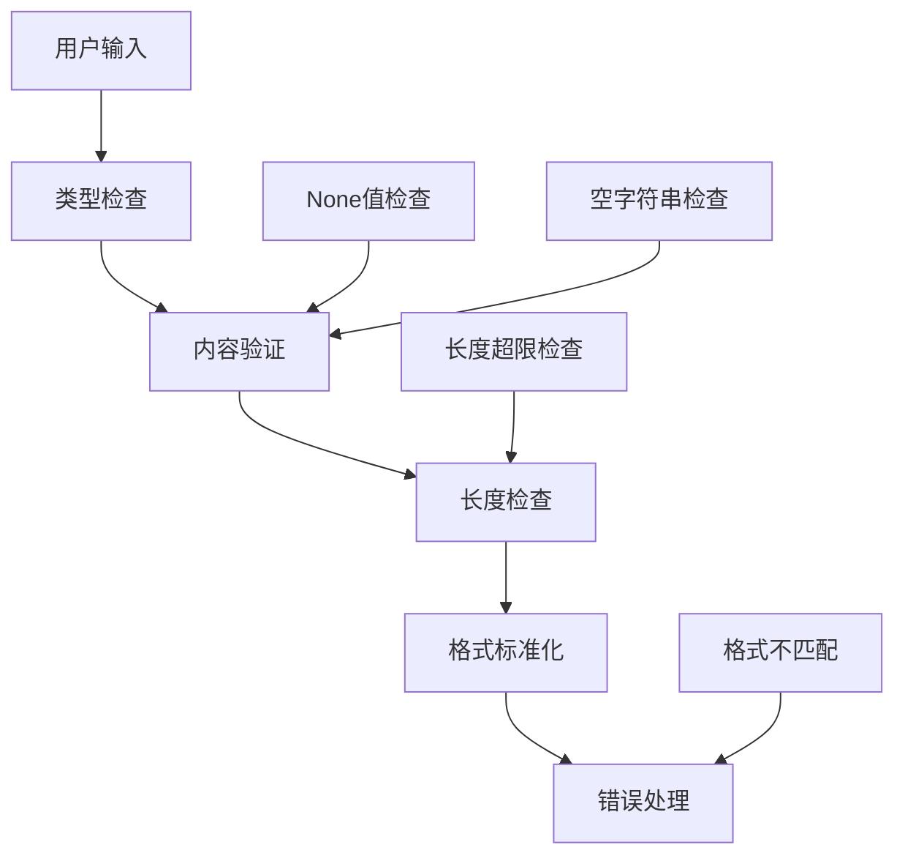

# 问答Pipeline

<cite>
**本文档中引用的文件**
- [question_answering.py](file://src/transformers/pipelines/question_answering.py)
- [document_question_answering.py](file://src/transformers/pipelines/document_question_answering.py)
- [squad.py](file://src/transformers/data/processors/squad.py)
- [test_pipelines_question_answering.py](file://tests/pipelines/test_pipelines_question_answering.py)
</cite>

## 目录
1. [简介](#简介)
2. [项目结构](#项目结构)
3. [核心组件](#核心组件)
4. [架构概览](#架构概览)
5. [详细组件分析](#详细组件分析)
6. [抽取式问答与生成式问答](#抽取式问答与生成式问答)
7. [长文档处理策略](#长文档处理策略)
8. [置信度评分机制](#置信度评分机制)
9. [性能优化技巧](#性能优化技巧)
10. [错误处理与边缘情况](#错误处理与边缘情况)
11. [实际应用示例](#实际应用示例)
12. [总结](#总结)

## 简介

Transformers库中的问答Pipeline提供了强大的自然语言问答功能，支持两种主要的问答范式：抽取式问答（Extractive QA）和生成式问答（Generative QA）。该系统能够处理从简单的事实问答到复杂的阅读理解任务，具备处理长文档、多答案、置信度评分等高级功能。

问答Pipeline的核心优势包括：
- 支持多种预训练模型进行问答任务
- 智能的文档分块和答案整合机制
- 灵活的答案数量控制和置信度评分
- 高效的批处理和缓存优化
- 完善的错误处理和边缘情况处理

## 项目结构

问答Pipeline在transformers库中的组织结构如下：



**图表来源**
- [question_answering.py](file://src/transformers/pipelines/question_answering.py#L1-L50)
- [document_question_answering.py](file://src/transformers/pipelines/document_question_answering.py#L1-L50)

**章节来源**
- [question_answering.py](file://src/transformers/pipelines/question_answering.py#L1-L100)
- [document_question_answering.py](file://src/transformers/pipelines/document_question_answering.py#L1-L100)

## 核心组件

### QuestionAnsweringPipeline

这是主要的问答管道类，负责处理文本形式的问答任务。它继承自`ChunkPipeline`，提供了完整的问答功能。

**核心特性：**
- 支持单个和批量问答输入
- 智能的文档分块策略
- 多答案候选生成和排序
- 置信度评分计算
- 不可能答案处理

### DocumentQuestionAnsweringPipeline

专门用于处理文档形式的问答任务，支持图像输入和OCR识别。

**核心特性：**
- 图像到文本的转换
- OCR文字和位置信息提取
- 布局感知的问答处理
- 视觉编码器-解码器模式支持

### ArgumentHandler

负责参数验证和标准化，确保输入格式的一致性。

**章节来源**
- [question_answering.py](file://src/transformers/pipelines/question_answering.py#L120-L200)
- [document_question_answering.py](file://src/transformers/pipelines/document_question_answering.py#L100-L200)

## 架构概览

问答Pipeline采用模块化设计，包含以下关键组件：



**图表来源**
- [question_answering.py](file://src/transformers/pipelines/question_answering.py#L388-L450)
- [question_answering.py](file://src/transformers/pipelines/question_answering.py#L500-L600)

## 详细组件分析

### 抽取式问答处理流程

抽取式问答通过识别和提取文本中已有的答案片段来回答问题：



**图表来源**
- [question_answering.py](file://src/transformers/pipelines/question_answering.py#L40-L120)
- [question_answering.py](file://src/transformers/pipelines/question_answering.py#L500-L600)

### 文档问答处理流程

文档问答处理涉及图像到文本的转换和布局信息的利用：



**图表来源**
- [document_question_answering.py](file://src/transformers/pipelines/document_question_answering.py#L300-L400)
- [document_question_answering.py](file://src/transformers/pipelines/document_question_answering.py#L450-L544)

**章节来源**
- [question_answering.py](file://src/transformers/pipelines/question_answering.py#L388-L500)
- [document_question_answering.py](file://src/transformers/pipelines/document_question_answering.py#L300-L450)

## 抽取式问答与生成式问答

### 抽取式问答（Extractive QA）

抽取式问答从给定的上下文中直接提取答案片段：

**特点：**
- 答案必须来自输入文本
- 回答准确率高
- 处理速度快
- 支持多答案候选

**适用场景：**
- 事实性问答
- 精确信息检索
- 结构化数据查询

### 生成式问答（Generative QA）

生成式问答可以基于上下文生成新的答案文本：

**特点：**
- 可以生成原文中不存在的答案
- 更灵活的回答方式
- 需要更强大的生成模型
- 支持开放式对话

**适用场景：**
- 创意写作辅助
- 复杂推理任务
- 对话系统
- 内容创作

### 两种范式的对比

| 特性 | 抽取式问答 | 生成式问答 |
|------|------------|------------|
| 答案来源 | 输入文本 | 模型生成 |
| 准确性 | 高 | 中等 |
| 处理速度 | 快 | 较慢 |
| 灵活性 | 有限 | 高 |
| 计算资源 | 低 | 高 |
| 应用场景 | 事实查询 | 开放式对话 |

**章节来源**
- [question_answering.py](file://src/transformers/pipelines/question_answering.py#L200-L300)
- [document_question_answering.py](file://src/transformers/pipelines/document_question_answering.py#L150-L250)

## 长文档处理策略

### 文档分块机制

对于超出模型最大长度限制的长文档，问答Pipeline采用智能分块策略：



**图表来源**
- [question_answering.py](file://src/transformers/pipelines/question_answering.py#L388-L450)

### 分块参数配置

| 参数 | 默认值 | 作用 | 调优建议 |
|------|--------|------|----------|
| max_seq_len | 384 | 最大序列长度 | 根据模型能力调整 |
| doc_stride | 128 | 文档重叠步长 | 平衡精度和效率 |
| max_question_len | 64 | 问题最大长度 | 控制内存使用 |
| max_answer_len | 15 | 答案最大长度 | 防止过长答案 |

### 跨段落答案整合

当答案跨越多个文档片段时，系统采用以下策略：

1. **候选答案收集**：从所有片段中收集可能的答案
2. **相似度匹配**：识别重复或相关答案
3. **置信度加权**：根据置信度对答案进行加权
4. **最终选择**：选择最高得分的答案

**章节来源**
- [question_answering.py](file://src/transformers/pipelines/question_answering.py#L388-L450)
- [squad.py](file://src/transformers/data/processors/squad.py#L313-L400)

## 置信度评分机制

### 分数计算原理

问答Pipeline使用复杂的算法计算答案的置信度分数：



**图表来源**
- [question_answering.py](file://src/transformers/pipelines/question_answering.py#L40-L120)

### 分数计算函数

核心的分数计算逻辑由`select_starts_ends`函数实现：

**关键步骤：**
1. **Logits归一化**：将原始logits转换为概率分布
2. **跨度生成**：计算所有可能的答案跨度
3. **约束过滤**：排除无效的跨度组合
4. **多答案排序**：根据置信度对答案进行排序

### 不可能答案处理

系统支持处理"不可能"答案的情况：

**启用条件：**
- `handle_impossible_answer=True`
- 模型能够识别无法回答的情况

**处理机制：**
- 计算空答案的置信度分数
- 与其他答案一起排序
- 提供是否可回答的判断

**章节来源**
- [question_answering.py](file://src/transformers/pipelines/question_answering.py#L40-L120)
- [question_answering.py](file://src/transformers/pipelines/question_answering.py#L500-L600)

## 性能优化技巧

### 缓存机制

问答Pipeline实现了多层次的缓存优化：



### 批处理优化

**批处理策略：**
- 自动批处理相同类型的请求
- 动态批处理大小调整
- 内存使用优化
- 推理速度提升

### 内存管理

**优化技术：**
- 梯度检查点（Gradient Checkpointing）
- 混合精度训练（Mixed Precision）
- 动态内存分配
- 缓存清理机制

### 并行处理

**并行化策略：**
- 数据并行（Data Parallelism）
- 模型并行（Model Parallelism）
- 流水线并行（Pipeline Parallelism）
- 异步处理

**章节来源**
- [question_answering.py](file://src/transformers/pipelines/question_answering.py#L1-L50)
- [document_question_answering.py](file://src/transformers/pipelines/document_question_answering.py#L1-L50)

## 错误处理与边缘情况

### 输入验证

问答Pipeline提供了完善的输入验证机制：



**图表来源**
- [question_answering.py](file://src/transformers/pipelines/question_answering.py#L120-L200)

### 常见错误类型

| 错误类型 | 描述 | 处理方式 |
|----------|------|----------|
| 空输入 | 问题或上下文为空 | 抛出ValueError |
| 类型错误 | 输入格式不正确 | 自动类型转换 |
| 长度超限 | 输入超过模型限制 | 自动截断或分块 |
| 模型不兼容 | 使用不支持的模型 | 提示更换模型 |
| 内存不足 | 处理大型输入失败 | 自动降级处理 |

### 边缘情况处理

**特殊场景处理：**
- 无答案情况：返回空答案或置信度最低的答案
- 多答案情况：返回前N个最高置信度的答案
- 长文档情况：自动分块处理
- 错误输入：提供友好的错误提示

### 异常恢复机制

**恢复策略：**
- 自动重试机制
- 降级处理方案
- 错误日志记录
- 用户反馈机制

**章节来源**
- [question_answering.py](file://src/transformers/pipelines/question_answering.py#L120-L200)
- [test_pipelines_question_answering.py](file://tests/pipelines/test_pipelines_question_answering.py#L500-L549)

## 实际应用示例

### 基础事实问答

```python
# 简单的事实问答示例
from transformers import pipeline

qa_pipeline = pipeline("question-answering")

context = "人工智能是计算机科学的一个分支，致力于创造能够执行通常需要人类智能的任务的机器。"
result = qa_pipeline(
    question="什么是人工智能？",
    context=context
)
# 输出: {'answer': '人工智能', 'score': 0.95, 'start': 0, 'end': 4}
```

### 多答案处理

```python
# 处理可能有多个答案的问题
result = qa_pipeline(
    question="人工智能有哪些应用领域？",
    context="人工智能广泛应用于医疗诊断、自动驾驶、语音识别等领域。",
    top_k=3
)
# 输出: 包含多个高置信度答案的列表
```

### 长文档问答

```python
# 处理长文档的问答
long_context = "..."  # 超过模型最大长度的文档
result = qa_pipeline(
    question="文档的主要观点是什么？",
    context=long_context,
    max_seq_len=512,
    doc_stride=128
)
```

### 文档问答

```python
# 文档形式的问答
from transformers import pipeline

doc_qa = pipeline("document-question-answering")

# 使用图像和OCR
result = doc_qa(
    image="invoice.png",
    question="发票号码是多少？"
)

# 使用预处理的文字和位置信息
result = doc_qa(
    image="document.jpg",
    question="表格中的总金额是多少？",
    word_boxes=[("Total", [100, 200, 300, 250])]
)
```

### 批量处理

```python
# 批量处理多个问答请求
questions = ["什么是量子计算？", "谁发明了电话？", "地球的直径是多少？"]
contexts = [context1, context2, context3]

results = qa_pipeline(
    question=questions,
    context=contexts,
    batch_size=2
)
```

**章节来源**
- [test_pipelines_question_answering.py](file://tests/pipelines/test_pipelines_question_answering.py#L50-L150)

## 总结

Transformers库的问答Pipeline提供了功能强大且灵活的问答解决方案。通过抽取式和生成式两种范式的结合，系统能够满足从简单事实问答到复杂阅读理解的各种需求。

**主要优势：**
- **多功能性**：支持文本和文档形式的问答
- **智能化**：自动处理长文档和多答案情况
- **高性能**：优化的缓存和批处理机制
- **鲁棒性**：完善的错误处理和边缘情况处理
- **易用性**：简洁的API设计和丰富的配置选项

**适用场景：**
- 信息检索系统
- 智能客服系统
- 教育辅导平台
- 文档分析工具
- 研究助手应用

问答Pipeline的设计体现了现代NLP系统的最佳实践，为开发者提供了构建高质量问答应用的强大工具。随着模型能力和优化技术的不断发展，该系统将继续演进以满足更复杂的应用需求。