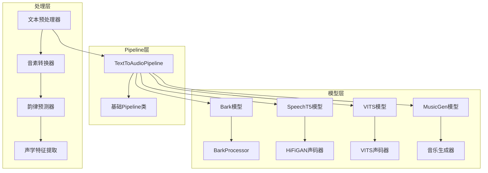
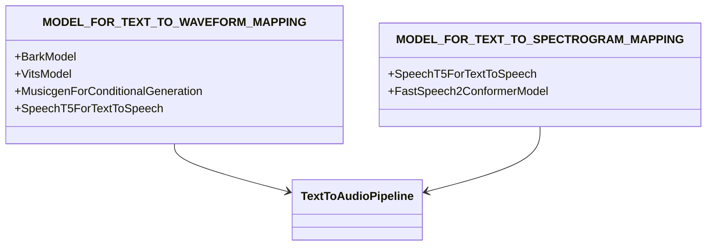
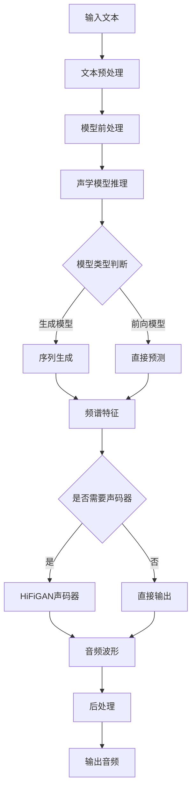
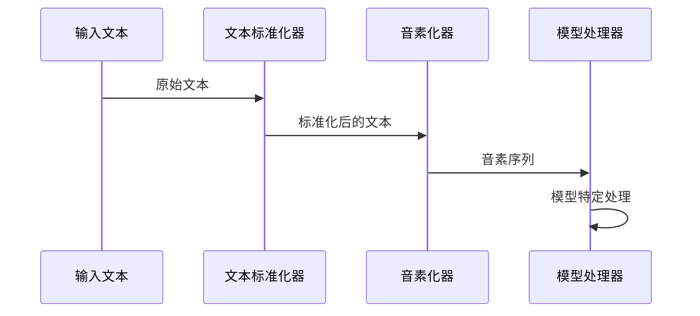
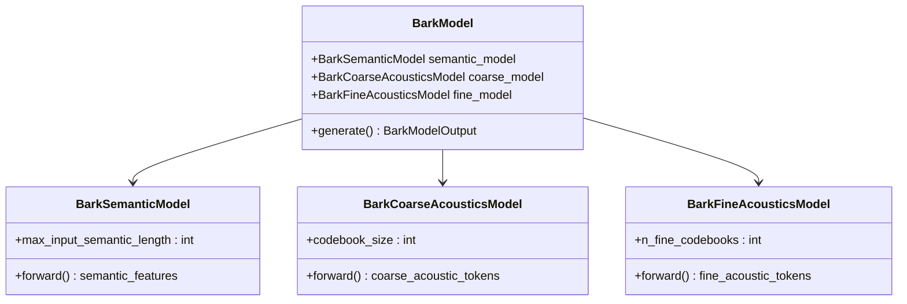
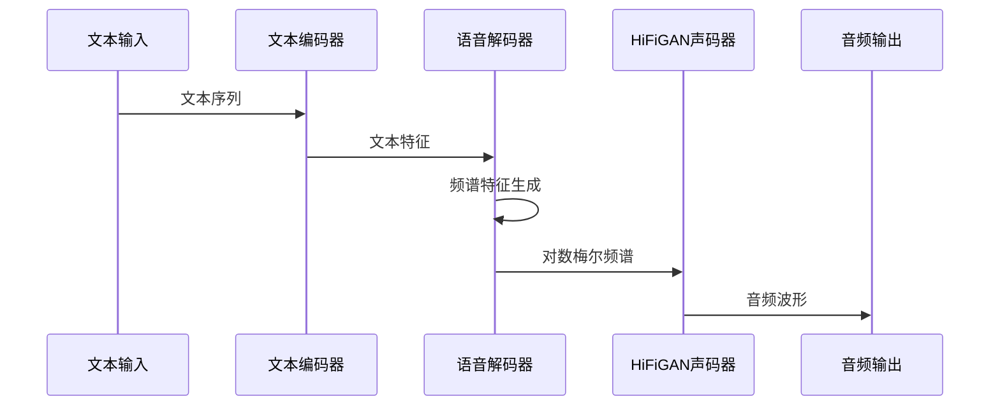
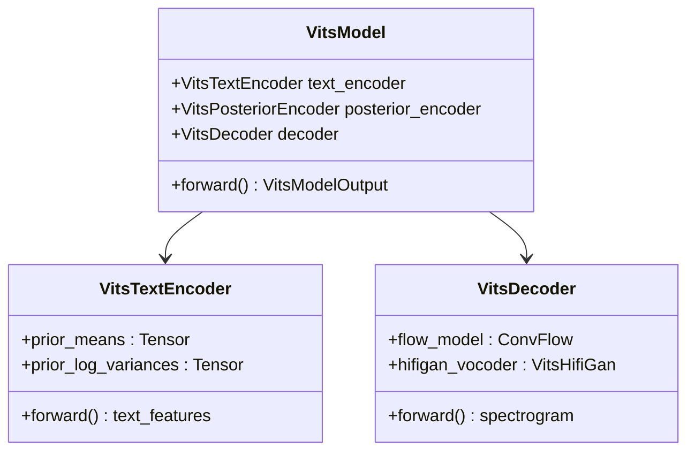
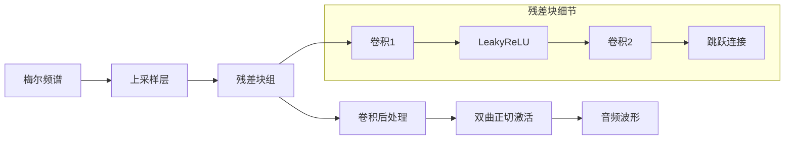
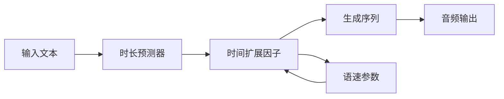
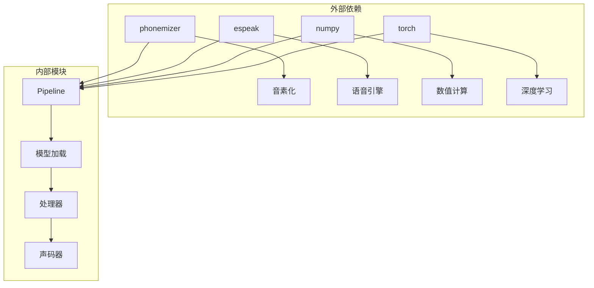

# 文本到音频生成Pipeline

<cite>
**本文档中引用的文件**
- [text_to_audio.py](file://src/transformers/pipelines/text_to_audio.py)
- [modeling_speecht5.py](file://src/transformers/models/speecht5/modeling_speecht5.py)
- [modeling_bark.py](file://src/transformers/models/bark/modeling_bark.py)
- [modeling_vits.py](file://src/transformers/models/vits/modeling_vits.py)
- [processing_bark.py](file://src/transformers/models/bark/processing_bark.py)
- [tokenization_wav2vec2_phoneme.py](file://src/transformers/models/wav2vec2_phoneme/tokenization_wav2vec2_phoneme.py)
- [tokenization_vits.py](file://src/transformers/models/vits/tokenization_vits.py)
- [modeling_auto.py](file://src/transformers/models/auto/modeling_auto.py)
- [test_pipelines_text_to_audio.py](file://tests/pipelines/test_pipelines_text_to_audio.py)
</cite>

## 目录
1. [简介](#简介)
2. [项目结构](#项目结构)
3. [核心组件](#核心组件)
4. [架构概览](#架构概览)
5. [详细组件分析](#详细组件分析)
6. [依赖关系分析](#依赖关系分析)
7. [性能考虑](#性能考虑)
8. [故障排除指南](#故障排除指南)
9. [结论](#结论)

## 简介

Transformers库中的文本到音频生成Pipeline是一个强大的工具，用于将文本转换为自然流畅的语音输出。该Pipeline支持多种先进的TTS（Text-to-Speech）模型，包括Bark、SpeechT5、VITS、MusicGen等，每种模型都有其独特的特点和优势。

本文档深入介绍了transformers库中TTS功能的实现，涵盖了从文本预处理到最终音频生成的完整流程，包括文本标准化、音素转换、韵律预测、声码器和声学模型的协同工作机制，以及如何控制生成音频的音调、语速和情感。

## 项目结构

文本到音频生成Pipeline在transformers库中的组织结构如下：

**图表来源**
- [text_to_audio.py](file://src/transformers/pipelines/text_to_audio.py#L25-L50)
- [modeling_auto.py](file://src/transformers/models/auto/modeling_auto.py#L1638-L1673)

**章节来源**
- [text_to_audio.py](file://src/transformers/pipelines/text_to_audio.py#L1-L50)
- [modeling_auto.py](file://src/transformers/models/auto/modeling_auto.py#L1638-L1673)

## 核心组件

### TextToAudioPipeline类

TextToAudioPipeline是整个TTS系统的核心类，继承自基础Pipeline类，负责协调各个组件的工作。

主要特性：
- 支持多种TTS模型类型
- 自动处理模型特定的预处理和后处理
- 集成声码器进行频谱到波形的转换
- 提供统一的API接口

### 模型映射系统

transformers库通过模型映射系统自动识别和加载合适的TTS模型：

**图表来源**
- [modeling_auto.py](file://src/transformers/models/auto/modeling_auto.py#L1638-L1673)

**章节来源**
- [text_to_audio.py](file://src/transformers/pipelines/text_to_audio.py#L79-L112)
- [modeling_auto.py](file://src/transformers/models/auto/modeling_auto.py#L1638-L1673)

## 架构概览

文本到音频生成Pipeline的整体架构采用模块化设计，包含以下关键层次：

**图表来源**
- [text_to_audio.py](file://src/transformers/pipelines/text_to_audio.py#L113-L193)

## 详细组件分析

### 文本预处理流程

文本预处理是TTS系统的第一步，涉及多个重要的处理阶段：

#### 文本标准化

不同模型对文本的处理方式有所不同：

**图表来源**
- [tokenization_wav2vec2_phoneme.py](file://src/transformers/models/wav2vec2_phoneme/tokenization_wav2vec2_phoneme.py#L176-L259)
- [tokenization_vits.py](file://src/transformers/models/vits/tokenization_vits.py#L175-L204)

#### 音素转换机制

音素转换是将文本转换为音素表示的关键步骤：

| 处理阶段 | 功能描述 | 支持的语言 |
|---------|---------|-----------|
| 字符规范化 | 处理特殊字符和标点符号 | 多语言支持 |
| 音素化 | 将文本转换为音素序列 | 英语、法语、德语等 |
| 韵律标记 | 添加重音和语调信息 | 主要针对英语 |
| 序列对齐 | 确保音素与文本的正确对应 | 所有支持语言 |

**章节来源**
- [tokenization_wav2vec2_phoneme.py](file://src/transformers/models/wav2vec2_phoneme/tokenization_wav2vec2_phoneme.py#L191-L259)
- [tokenization_vits.py](file://src/transformers/models/vits/tokenization_vits.py#L175-L204)

### 声学模型协同工作机制

不同的TTS模型采用不同的声学建模策略：

#### Bark模型架构

Bark模型采用分层生成策略，包含三个主要子模型：

**图表来源**
- [modeling_bark.py](file://src/transformers/models/bark/modeling_bark.py#L1480-L1490)

#### SpeechT5模型架构

SpeechT5采用编码器-解码器架构，结合了语音理解和合成的能力：

**图表来源**
- [modeling_speecht5.py](file://src/transformers/models/speecht5/modeling_speecht5.py#L2168-L2201)

#### VITS模型架构

VITS采用变分自编码器框架，结合了流模型和对抗训练：

**图表来源**
- [modeling_vits.py](file://src/transformers/models/vits/modeling_vits.py#L45-L199)

**章节来源**
- [modeling_bark.py](file://src/transformers/models/bark/modeling_bark.py#L1480-L1490)
- [modeling_speecht5.py](file://src/transformers/models/speecht5/modeling_speecht5.py#L2168-L2201)
- [modeling_vits.py](file://src/transformers/models/vits/modeling_vits.py#L45-L199)

### 声码器和频谱转换

声码器是将频谱特征转换为音频波形的关键组件：

#### HiFiGAN声码器

HiFiGAN是一种高质量的神经声码器，能够生成接近人类听觉质量的音频：

**图表来源**
- [modeling_vits.py](file://src/transformers/models/vits/modeling_vits.py#L452-L520)

#### 多语言支持机制

TTS系统通过多种方式实现多语言支持：

| 支持方式 | 实现原理 | 适用场景 |
|---------|---------|---------|
| 多语言模型 | 单一模型支持多种语言 | 统一部署 |
| 语言特定模型 | 不同语言使用不同模型 | 高质量合成 |
| 预训练+微调 | 在多语言数据上预训练 | 快速适配新语言 |
| 发音字典 | 语言特定的音素映射 | 准确度优先 |

**章节来源**
- [modeling_vits.py](file://src/transformers/models/vits/modeling_vits.py#L452-L520)

### 语音参数控制

TTS系统提供了丰富的参数控制选项，允许用户精确调整生成音频的各个方面：

#### 语速控制

语速控制通过调整生成过程中的时间步长来实现：

#### 音调调节

音调调节可以通过多种方式进行：

- **基频控制**：直接调整基频曲线
- **共振峰调节**：改变声道形状
- **韵律模式**：设置语调和重音模式

#### 情感表达

情感表达通过以下机制实现：

- **能量控制**：调整音频的能量水平
- **节奏变化**：改变说话速度和停顿
- **音色调节**：使用不同的说话人嵌入

**章节来源**
- [text_to_audio.py](file://src/transformers/pipelines/text_to_audio.py#L113-L193)

## 依赖关系分析

TTS系统的依赖关系复杂，涉及多个层次的组件：

**图表来源**
- [text_to_audio.py](file://src/transformers/pipelines/text_to_audio.py#L1-L25)

**章节来源**
- [text_to_audio.py](file://src/transformers/pipelines/text_to_audio.py#L1-L25)

## 性能考虑

### 生成速度优化

为了提高TTS系统的生成速度，可以采用以下策略：

1. **批处理优化**：同时处理多个文本输入
2. **缓存机制**：缓存常用的中间结果
3. **模型量化**：使用量化模型减少计算量
4. **硬件加速**：利用GPU或专用硬件

### 内存使用优化

内存优化对于大规模部署至关重要：

- **梯度检查点**：减少内存占用
- **动态批处理**：根据可用内存调整批大小
- **模型并行**：将大模型分割到多个设备

## 故障排除指南

### 常见问题及解决方案

#### 模型加载失败

**问题描述**：无法加载指定的TTS模型

**解决方案**：
1. 检查模型名称是否正确
2. 确认网络连接正常
3. 验证模型权重文件完整性

#### 音频质量不佳

**问题描述**：生成的音频听起来不自然或有噪声

**解决方案**：
1. 调整生成参数
2. 使用更高分辨率的模型
3. 检查输入文本的标准化

#### 生成速度慢

**问题描述**：TTS生成过程耗时过长

**解决方案**：
1. 使用更小的模型
2. 启用量化
3. 增加批处理大小

**章节来源**
- [test_pipelines_text_to_audio.py](file://tests/pipelines/test_pipelines_text_to_audio.py#L179-L209)

## 结论

Transformers库中的文本到音频生成Pipeline提供了一个强大而灵活的TTS解决方案。通过模块化的架构设计，系统支持多种先进的TTS模型，并提供了丰富的参数控制选项。

主要优势包括：
- **多样化的模型支持**：涵盖从研究级到工业级的各种TTS模型
- **灵活的参数控制**：允许精确调整音调、语速和情感表达
- **多语言支持**：内置多语言TTS能力
- **高质量输出**：通过先进的声码器技术保证音频质量

未来的发展方向可能包括：
- 更高效的模型架构
- 更自然的情感表达
- 更好的实时生成能力
- 更广泛的语言支持

通过深入理解这些组件和机制，开发者可以更好地利用transformers库构建高质量的语音应用。