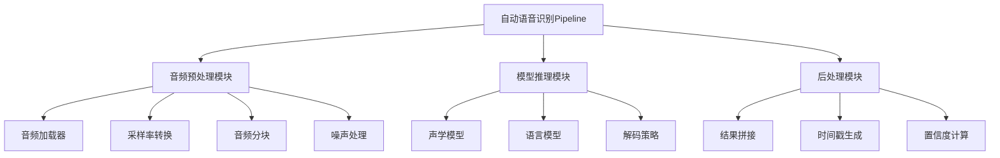
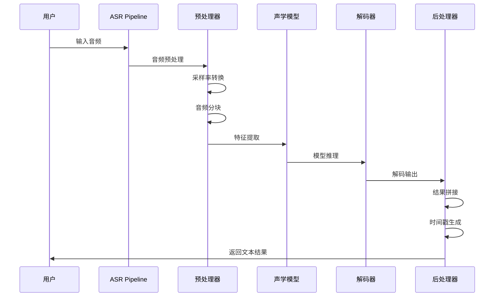
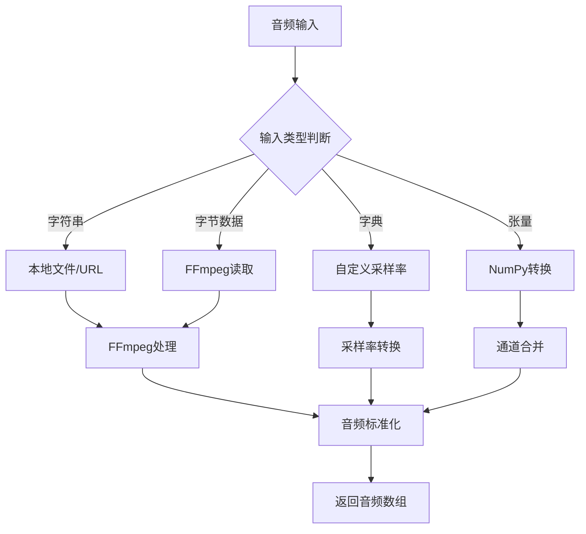
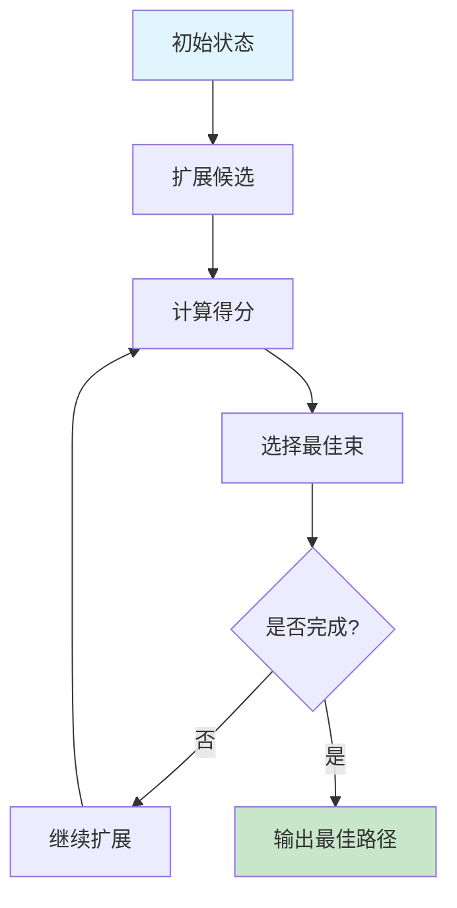
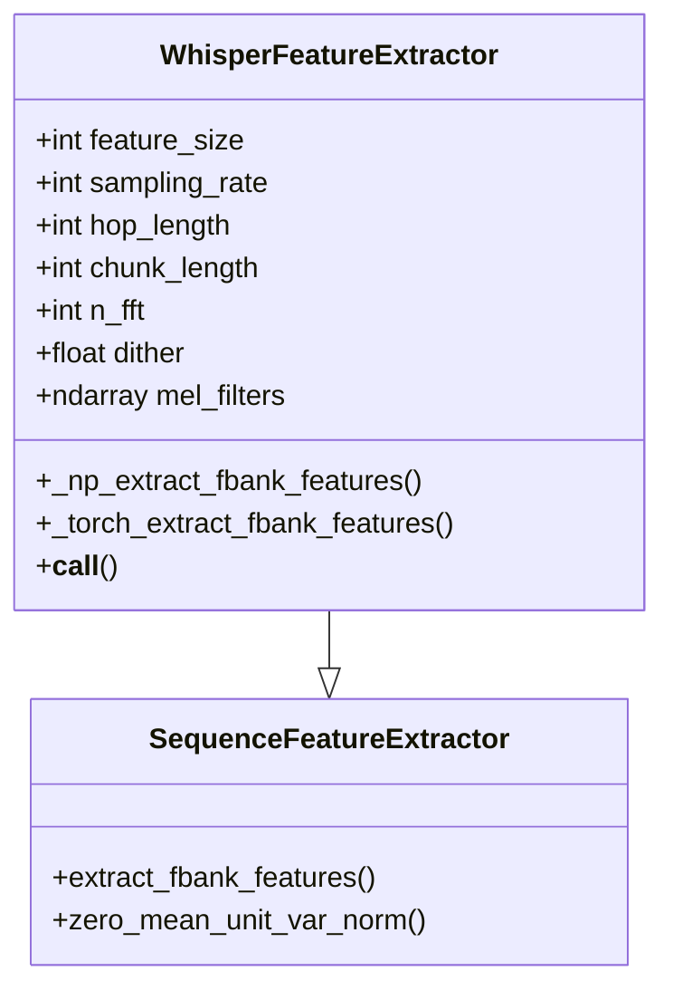
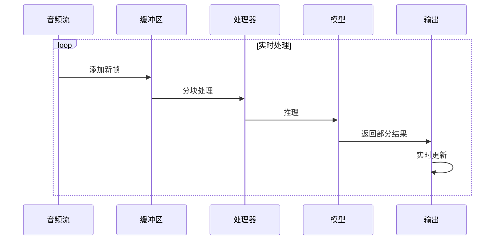
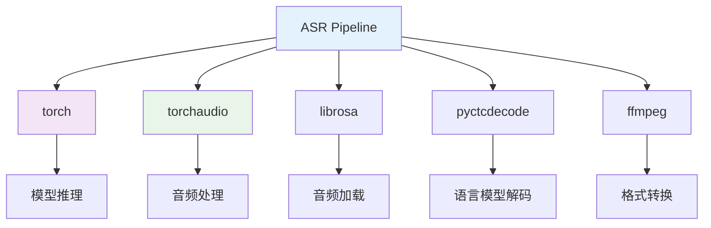

# 自动语音识别Pipeline

<cite>
**本文档中引用的文件**
- [automatic_speech_recognition.py](file://src/transformers/pipelines/automatic_speech_recognition.py)
- [audio_utils.py](file://src/transformers/audio_utils.py)
- [base.py](file://src/transformers/pipelines/base.py)
- [feature_extraction_whisper.py](file://src/transformers/models/whisper/feature_extraction_whisper.py)
- [utils.py](file://src/transformers/audio_utils.py)
- [utils.py](file://src/transformers/generation/utils.py)
</cite>

## 目录
1. [简介](#简介)
2. [项目结构](#项目结构)
3. [核心组件](#核心组件)
4. [架构概览](#架构概览)
5. [详细组件分析](#详细组件分析)
6. [依赖关系分析](#依赖关系分析)
7. [性能考虑](#性能考虑)
8. [故障排除指南](#故障排除指南)
9. [结论](#结论)

## 简介

自动语音识别（ASR）Pipeline是Hugging Face Transformers库中的一个强大组件，专门用于将音频信号转换为文本。该Pipeline支持多种音频格式，提供实时和批量处理能力，并集成了先进的声学模型和语言模型技术。

本文档深入探讨了ASR Pipeline的实现细节，包括音频预处理、模型配置、解码策略和性能优化等方面。

## 项目结构

ASR Pipeline在transformers库中的组织结构如下：



**图表来源**
- [automatic_speech_recognition.py](file://src/transformers/pipelines/automatic_speech_recognition.py#L111-L671)
- [audio_utils.py](file://src/transformers/audio_utils.py#L1-L100)

**章节来源**
- [automatic_speech_recognition.py](file://src/transformers/pipelines/automatic_speech_recognition.py#L1-L50)
- [audio_utils.py](file://src/transformers/audio_utils.py#L1-L50)

## 核心组件

### AutomaticSpeechRecognitionPipeline类

这是ASR Pipeline的主要入口点，继承自`ChunkPipeline`，提供了完整的语音识别功能。

#### 主要特性：
- 支持多种输入格式：本地文件、URL、字节数据、原始音频数组
- 内置音频预处理管道
- 多种解码策略支持
- 实时和批量处理模式

#### 模型类型检测：
```python
# 自动识别模型类型
if model.config.model_type == "whisper":
    self.type = "seq2seq_whisper"
elif model.__class__.__name__ in MODEL_FOR_SPEECH_SEQ_2_SEQ_MAPPING_NAMES.values():
    self.type = "seq2seq"
elif feature_extractor._processor_class and feature_extractor._processor_class.endswith("WithLM"):
    self.type = "ctc_with_lm"
else:
    self.type = "ctc"
```

**章节来源**
- [automatic_speech_recognition.py](file://src/transformers/pipelines/automatic_speech_recognition.py#L111-L671)

## 架构概览

ASR Pipeline采用模块化设计，包含以下主要阶段：



**图表来源**
- [automatic_speech_recognition.py](file://src/transformers/pipelines/automatic_speech_recognition.py#L350-L450)

## 详细组件分析

### 音频预处理流程

#### 1. 音频加载与格式转换

ASR Pipeline支持多种音频输入格式：



**图表来源**
- [automatic_speech_recognition.py](file://src/transformers/pipelines/automatic_speech_recognition.py#L350-L420)

#### 2. 采样率转换机制

Pipeline使用`torchaudio`进行高质量的采样率转换：

```python
# 采样率转换逻辑
if in_sampling_rate != self.feature_extractor.sampling_rate:
    inputs = F.resample(
        torch.from_numpy(inputs) if isinstance(inputs, np.ndarray) else inputs,
        in_sampling_rate,
        self.feature_extractor.sampling_rate,
    ).numpy()
```

#### 3. 音频分块策略

对于长音频，Pipeline实现了智能分块机制：

```python
# 分块迭代器
def chunk_iter(inputs, feature_extractor, chunk_len, stride_left, stride_right, dtype=None):
    inputs_len = inputs.shape[0]
    step = chunk_len - stride_left - stride_right
    for chunk_start_idx in range(0, inputs_len, step):
        chunk_end_idx = chunk_start_idx + chunk_len
        chunk = inputs[chunk_start_idx:chunk_end_idx]
        # 处理每个分块
        processed = feature_extractor(...)
        yield {"is_last": is_last, "stride": stride, **processed}
```

**章节来源**
- [automatic_speech_recognition.py](file://src/transformers/pipelines/automatic_speech_recognition.py#L350-L450)

### 声学模型与语言模型集成

#### 1. 模型配置系统

Pipeline支持多种模型类型的配置：

| 模型类型 | 特性 | 解码策略 |
|---------|------|----------|
| seq2seq_whisper | 序列到序列，支持多语言 | 束搜索，动态时间规整 |
| seq2seq | 标准序列到序列 | 束搜索，贪心解码 |
| ctc | 连续时间分类 | 贪心解码，语言模型 |
| ctc_with_lm | CTC+语言模型 | 束搜索解码 |

#### 2. 强制解码器ID配置

对于多语言识别，可以使用`forced_decoder_ids`：

```python
# 强制语言解码
forced_decoder_ids = processor.get_decoder_prompt_ids(
    task="transcribe",
    language="german",
)
generated_ids = model.generate(
    input_features, 
    forced_decoder_ids=forced_decoder_ids
)
```

**章节来源**
- [automatic_speech_recognition.py](file://src/transformers/pipelines/automatic_speech_recognition.py#L111-L200)

### 解码策略配置

#### 束搜索解码

Pipeline内置了强大的束搜索解码机制：



**图表来源**
- [utils.py](file://src/transformers/generation/utils.py#L3408-L3495)

#### 生成参数配置

默认生成配置：
- `max_new_tokens`: 256
- `num_beams`: 5
- `length_penalty`: 默认值

**章节来源**
- [automatic_speech_recognition.py](file://src/transformers/pipelines/automatic_speech_recognition.py#L150-L180)

### 长音频流式识别

#### 分块策略

对于超长音频，Pipeline提供了分块处理能力：

```python
# 分块处理配置
def preprocess(self, inputs, chunk_length_s=0, stride_length_s=None):
    if chunk_length_s:
        # 计算分块参数
        chunk_len = int(round(chunk_length_s * sampling_rate / align_to) * align_to)
        stride_left = int(round(stride_length_s[0] * sampling_rate / align_to) * align_to)
        stride_right = int(round(stride_length_s[1] * sampling_rate / align_to) * align_to)
        
        # 生成分块
        for item in chunk_iter(...):
            yield item
```

#### 结果拼接方法

Pipeline实现了智能的结果拼接算法：

```python
# 最长公共子序列匹配
def _find_longest_common_sequence(sequences, tokenizer):
    sequence = [tok_id for tok_id in sequences[0][0].tolist() if tok_id not in tokenizer.all_special_ids]
    for new_seq in sequences[1:]:
        # 寻找最长匹配序列
        index = 0
        max_ = 0.0
        # 匹配逻辑...
        sequence.extend(new_sequence[index:])
    return np.array(sequence)
```

**章节来源**
- [automatic_speech_recognition.py](file://src/transformers/pipelines/automatic_speech_recognition.py#L60-L100)

### 特征提取器详解

#### Whisper特征提取器



**图表来源**
- [feature_extraction_whisper.py](file://src/transformers/models/whisper/feature_extraction_whisper.py#L40-L150)

#### 频谱图计算

特征提取器使用自定义的STFT实现：

```python
# 频谱图计算
log_spec = spectrogram(
    waveform,
    window_function(self.n_fft, "hann"),
    frame_length=self.n_fft,
    hop_length=self.hop_length,
    power=2.0,
    dither=self.dither,
    mel_filters=self.mel_filters,
    log_mel="log10",
)
```

**章节来源**
- [feature_extraction_whisper.py](file://src/transformers/models/whisper/feature_extraction_whisper.py#L100-L150)

### 实时音频流处理

#### 流式处理架构



#### 批处理优化

Pipeline支持高效的批处理优化：

```python
# 批处理填充函数
def pad_collate_fn(tokenizer, feature_extractor):
    # 自动填充不同长度的序列
    # 支持左填充和右填充
    # 优化内存使用
```

**章节来源**
- [base.py](file://src/transformers/pipelines/base.py#L100-L200)

### 置信度分数计算

#### 置信度评估

虽然当前Pipeline不直接提供置信度分数，但可以通过以下方式间接获得：

1. **束搜索置信度**：通过`pyctcdecode`的束搜索结果
2. **概率分布**：从模型输出的概率分布计算
3. **词汇表评分**：结合语言模型评分

#### 时间戳精度

Pipeline支持多种时间戳精度：

| 时间戳类型 | 精度 | 用途 |
|-----------|------|------|
| char | 字符级 | 精确到单个字符 |
| word | 单词级 | 精确到单词边界 |
| segment | 段落级 | 整体段落时间戳 |

**章节来源**
- [automatic_speech_recognition.py](file://src/transformers/pipelines/automatic_speech_recognition.py#L230-L280)

## 依赖关系分析

### 核心依赖



**图表来源**
- [automatic_speech_recognition.py](file://src/transformers/pipelines/automatic_speech_recognition.py#L1-L30)

### 可选依赖

- **torchcodec**: 高性能音频解码
- **soundfile**: 音频文件读写
- **soxr**: 高质量重采样

**章节来源**
- [automatic_speech_recognition.py](file://src/transformers/pipelines/automatic_speech_recognition.py#L1-L50)

## 性能考虑

### 内存优化

1. **分块处理**: 避免大音频文件占用过多内存
2. **流式处理**: 支持实时音频流处理
3. **混合精度**: 支持FP16/BF16推理

### 计算优化

1. **GPU加速**: 支持CUDA推理
2. **批处理**: 自动批处理优化
3. **缓存机制**: 结果缓存和复用

### 并发处理

Pipeline支持多线程并发处理多个音频文件。

## 故障排除指南

### 常见问题

#### 1. 音频格式问题
- **问题**: 不支持的音频格式
- **解决方案**: 使用FFmpeg或librosa转换格式

#### 2. 内存不足
- **问题**: 大音频文件导致内存溢出
- **解决方案**: 启用分块处理，调整chunk_length_s参数

#### 3. 采样率不匹配
- **问题**: 音频采样率与模型要求不符
- **解决方案**: 自动采样率转换或手动指定采样率

#### 4. 解码质量问题
- **问题**: 识别结果不准确
- **解决方案**: 调整束搜索参数，使用语言模型

**章节来源**
- [automatic_speech_recognition.py](file://src/transformers/pipelines/automatic_speech_recognition.py#L350-L450)

### 性能调优

#### 1. 参数优化

```python
# 性能优化配置
pipeline = pipeline(
    "automatic-speech-recognition",
    model="openai/whisper-base",
    chunk_length_s=30,  # 分块长度
    stride_length_s=5,  # 重叠长度
    device=0,           # GPU设备
    torch_dtype=torch.float16,  # 混合精度
)
```

#### 2. 批处理优化

```python
# 批处理配置
def optimize_batch_processing():
    # 自动批处理大小调整
    # 内存使用监控
    # 并发控制
```

## 结论

Hugging Face的ASR Pipeline是一个功能强大且灵活的语音识别解决方案。它提供了：

1. **全面的音频处理能力**：支持多种音频格式和预处理步骤
2. **先进的模型集成**：无缝集成各种声学和语言模型
3. **灵活的解码策略**：支持束搜索、贪心解码等多种策略
4. **高性能优化**：内存优化、GPU加速、批处理支持
5. **实时处理能力**：支持流式和批量处理模式

通过合理配置和优化，ASR Pipeline能够满足从研究到生产环境的各种语音识别需求，为开发者提供了构建高质量语音应用的强大工具。