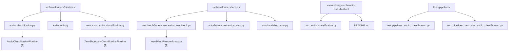
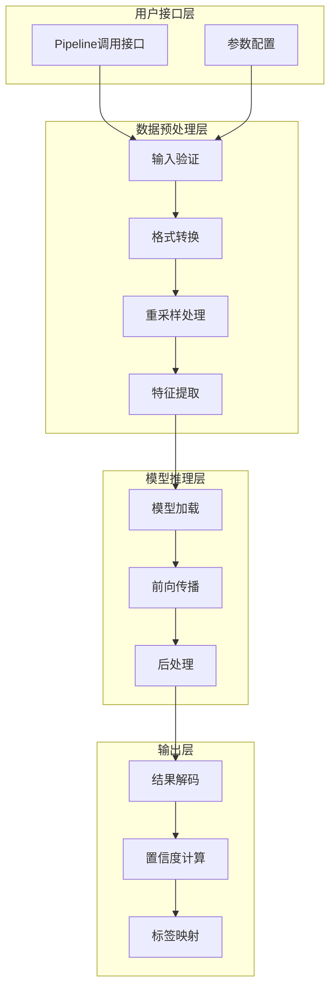
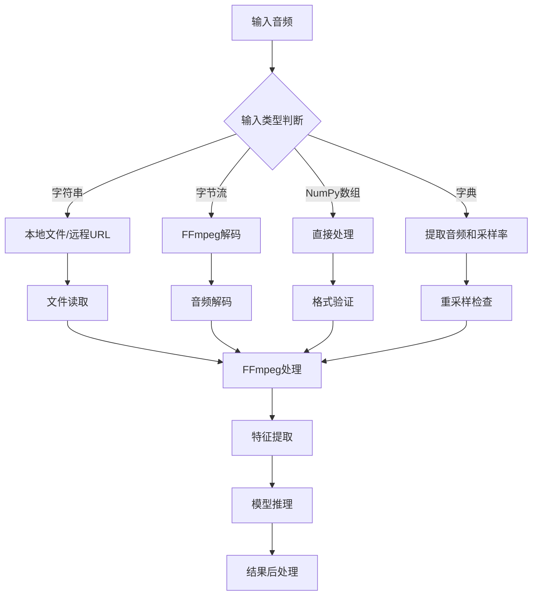
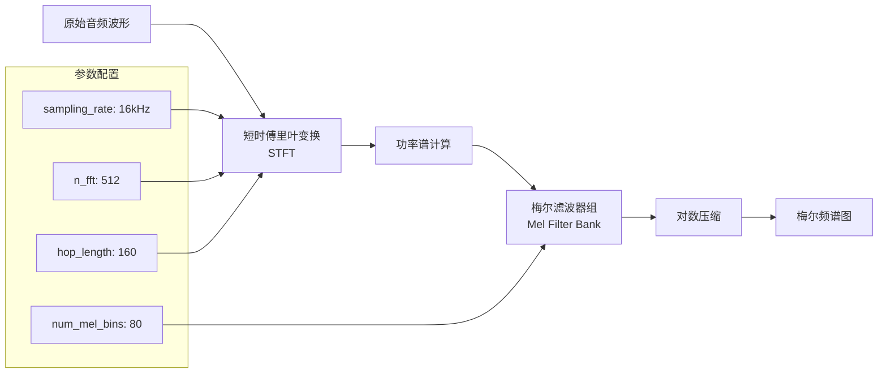
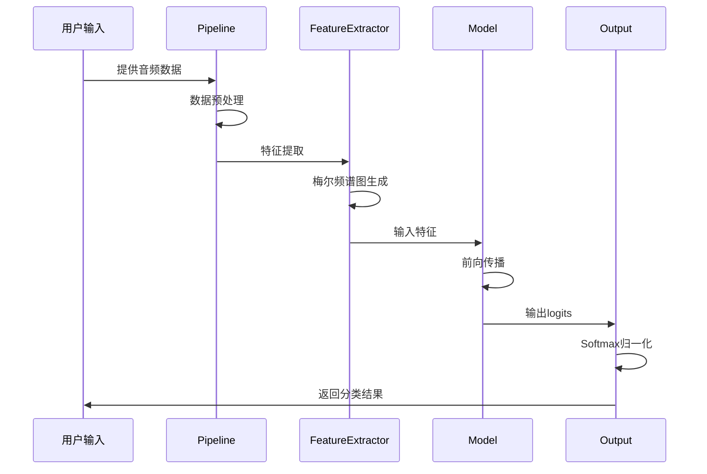

# 音频分类Pipeline

<cite>
**本文档中引用的文件**
- [audio_classification.py](file://src/transformers/pipelines/audio_classification.py)
- [audio_utils.py](file://src/transformers/pipelines/audio_utils.py)
- [zero_shot_audio_classification.py](file://src/transformers/pipelines/zero_shot_audio_classification.py)
- [run_audio_classification.py](file://examples/pytorch/audio-classification/run_audio_classification.py)
- [README.md](file://examples/pytorch/audio-classification/README.md)
- [__init__.py](file://src/transformers/pipelines/__init__.py)
- [wav2vec2_feature_extraction.py](file://src/transformers/models/wav2vec2/feature_extraction_wav2vec2.py)
- [feature_extraction_auto.py](file://src/transformers/models/auto/feature_extraction_auto.py)
- [modeling_auto.py](file://src/transformers/models/auto/modeling_auto.py)
</cite>

## 目录
1. [简介](#简介)
2. [项目结构](#项目结构)
3. [核心组件](#核心组件)
4. [架构概览](#架构概览)
5. [详细组件分析](#详细组件分析)
6. [特征提取过程](#特征提取过程)
7. [分类模型推理](#分类模型推理)
8. [支持的任务类型](#支持的任务类型)
9. [使用示例](#使用示例)
10. [性能优化](#性能优化)
11. [故障排除指南](#故障排除指南)
12. [结论](#结论)

## 简介

Transformers库中的音频分类Pipeline是一个强大的工具，专门用于对音频信号进行分类任务。该Pipeline支持多种音频分类任务，包括语音情感识别、音频事件检测和说话人识别等。它提供了统一的接口，可以处理原始音频波形、音频文件和字节流数据，并通过预训练的深度学习模型进行高效的音频分类。

音频分类Pipeline的核心优势在于其自动化程度高，用户无需关心底层的特征提取和模型推理细节，只需提供音频输入即可获得分类结果。同时，它还支持自定义分类标签映射和置信度分数控制，为不同的应用场景提供了灵活的配置选项。

## 项目结构

音频分类相关的核心文件组织结构如下：



**图表来源**
- [audio_classification.py](file://src/transformers/pipelines/audio_classification.py#L1-L260)
- [zero_shot_audio_classification.py](file://src/transformers/pipelines/zero_shot_audio_classification.py#L1-L162)
- [wav2vec2_feature_extraction.py](file://src/transformers/models/wav2vec2/feature_extraction_wav2vec2.py#L1-L243)

**章节来源**
- [audio_classification.py](file://src/transformers/pipelines/audio_classification.py#L1-L50)
- [zero_shot_audio_classification.py](file://src/transformers/pipelines/zero_shot_audio_classification.py#L1-L50)

## 核心组件

音频分类Pipeline包含以下核心组件：

### 主要类组件

1. **AudioClassificationPipeline**: 标准音频分类管道
2. **ZeroShotAudioClassificationPipeline**: 零样本音频分类管道  
3. **Wav2Vec2FeatureExtractor**: 梅尔频谱图特征提取器
4. **AudioUtils**: 音频处理辅助工具

### 支持的模型类型

音频分类Pipeline支持多种预训练模型：
- Wav2Vec2系列模型
- HuBERT模型
- Data2Vec-Audio模型
- 其他音频分类专用模型

**章节来源**
- [audio_classification.py](file://src/transformers/pipelines/audio_classification.py#L66-L110)
- [zero_shot_audio_classification.py](file://src/transformers/pipelines/zero_shot_audio_classification.py#L32-L72)

## 架构概览

音频分类Pipeline采用模块化设计，主要包含以下几个层次：



**图表来源**
- [audio_classification.py](file://src/transformers/pipelines/audio_classification.py#L112-L260)
- [zero_shot_audio_classification.py](file://src/transformers/pipelines/zero_shot_audio_classification.py#L95-L161)

## 详细组件分析

### AudioClassificationPipeline类

AudioClassificationPipeline是音频分类的主要入口点，继承自基础Pipeline类，提供了完整的音频分类功能。

#### 核心特性

1. **多格式输入支持**: 支持字符串路径、字节流、NumPy数组和字典格式的音频输入
2. **自动重采样**: 能够自动将不同采样率的音频转换为目标采样率
3. **批量处理**: 支持批量音频数据的处理
4. **灵活的输出控制**: 可以控制返回的标签数量和后处理函数

#### 输入处理流程



**图表来源**
- [audio_classification.py](file://src/transformers/pipelines/audio_classification.py#L112-L231)

**章节来源**
- [audio_classification.py](file://src/transformers/pipelines/audio_classification.py#L66-L110)

### ZeroShotAudioClassificationPipeline类

零样本音频分类管道允许在没有特定训练数据的情况下对音频进行分类。

#### 工作原理

1. **候选标签处理**: 将用户提供的候选标签与假设模板结合
2. **文本编码**: 使用CLAP模型的文本编码器处理候选标签
3. **音频编码**: 使用CLAP模型的音频编码器处理输入音频
4. **相似度计算**: 计算音频和文本特征之间的余弦相似度
5. **概率归一化**: 使用softmax函数将相似度转换为概率分数

**章节来源**
- [zero_shot_audio_classification.py](file://src/transformers/pipelines/zero_shot_audio_classification.py#L32-L93)

## 特征提取过程

音频分类Pipeline的核心在于特征提取过程，这决定了模型的性能和适用性。

### 梅尔频谱图生成

梅尔频谱图是音频分类中最常用的特征表示形式之一：



**图表来源**
- [wav2vec2_feature_extraction.py](file://src/transformers/models/wav2vec2/feature_extraction_wav2vec2.py#L44-L98)

### MFCC特征提取

梅尔频率倒谱系数(MFCC)是另一种重要的音频特征：

| 参数 | 默认值 | 说明 |
|------|--------|------|
| n_mfcc | 40 | 倒谱系数的数量 |
| sampling_rate | 16000 | 采样率(Hz) |
| n_fft | 512 | 快速傅里叶变换点数 |
| hop_length | 160 | 帧移长度 |
| n_mels | 80 | 梅尔滤波器数量 |
| dct_type | 2 | 离散余弦变换类型 |

### 音频信号预处理

音频预处理包括以下关键步骤：

1. **重采样**: 将音频调整到模型期望的采样率
2. **归一化**: 对音频幅度进行标准化处理
3. **分帧**: 将连续音频分割成固定长度的帧
4. **加窗**: 应用汉明窗或其他窗口函数减少边界效应

**章节来源**
- [wav2vec2_feature_extraction.py](file://src/transformers/models/wav2vec2/feature_extraction_wav2vec2.py#L75-L120)
- [audio_utils.py](file://src/transformers/pipelines/audio_utils.py#L10-L50)

## 分类模型推理

### 推理流程

音频分类模型的推理过程包含以下关键步骤：



**图表来源**
- [audio_classification.py](file://src/transformers/pipelines/audio_classification.py#L233-L260)

### 结果解码方法

分类结果的解码包括以下步骤：

1. **Logits处理**: 从模型输出中提取logits
2. **Softmax应用**: 将logits转换为概率分布
3. **Top-K选择**: 选择置信度最高的K个预测
4. **标签映射**: 将索引转换为人类可读的标签

### 置信度分数计算

置信度分数的计算遵循以下公式：

```
confidence_score = softmax(logits[i]) = exp(logits[i]) / Σ(exp(logits[j]))
```

其中i表示当前类别，j遍历所有类别。

**章节来源**
- [audio_classification.py](file://src/transformers/pipelines/audio_classification.py#L233-L260)

## 支持的任务类型

音频分类Pipeline支持多种音频理解任务：

### 语音情感识别

- **任务描述**: 识别语音中的情感状态（快乐、悲伤、愤怒等）
- **常用数据集**: IEMOCAP、RAVDESS
- **典型模型**: Wav2Vec2、HuBERT

### 音频事件检测

- **任务描述**: 检测音频中的特定事件（门铃声、狗叫声、汽车喇叭等）
- **应用场景**: 安防监控、智能家居
- **技术特点**: 需要高时间分辨率的特征

### 说话人识别

- **任务描述**: 识别音频中的说话人身份
- **技术挑战**: 适应不同环境噪声和口音变化
- **应用领域**: 安全认证、个性化服务

### 关键词识别

- **任务描述**: 检测音频中是否包含特定关键词
- **实时应用**: 智能助手、语音控制
- **性能要求**: 低延迟、高准确率

**章节来源**
- [README.md](file://examples/pytorch/audio-classification/README.md#L15-L50)

## 使用示例

### 基础音频分类

```python
from transformers import pipeline

# 加载音频分类管道
classifier = pipeline("audio-classification", model="superb/wav2vec2-base-superb-ks")

# 处理音频文件
result = classifier("path/to/audio.wav")
print(result)
# 输出示例: [{'score': 0.997, 'label': '_unknown_'}]
```

### 自定义参数配置

```python
# 自定义top_k和后处理函数
result = classifier(
    audio_data,
    top_k=3,
    function_to_apply="softmax"
)
```

### 零样本音频分类

```python
from transformers import pipeline

# 零样本分类
classifier = pipeline(
    "zero-shot-audio-classification",
    model="laion/clap-htsat-unfused"
)

# 定义候选标签
candidate_labels = [
    "Sound of a dog",
    "Sound of a cat", 
    "Sound of traffic"
]

result = classifier(audio, candidate_labels=candidate_labels)
```

### 批量处理

```python
# 批量处理多个音频
audios = [audio1, audio2, audio3]
results = classifier(audios, batch_size=4)
```

**章节来源**
- [audio_classification.py](file://src/transformers/pipelines/audio_classification.py#L52-L82)
- [zero_shot_audio_classification.py](file://src/transformers/pipelines/zero_shot_audio_classification.py#L41-L72)

## 性能优化

### 内部批处理策略

音频分类Pipeline实现了智能的批处理机制：

1. **动态批大小**: 根据可用内存自动调整批大小
2. **序列填充**: 对不同长度的音频进行智能填充
3. **GPU加速**: 支持CUDA加速和混合精度训练
4. **内存管理**: 实现了高效的内存回收机制

### 性能优化方法

| 优化策略 | 描述 | 效果 |
|----------|------|------|
| 模型量化 | 使用INT8或FP16量化模型 | 减少内存占用，提高推理速度 |
| 批处理 | 合并多个音频请求 | 提高吞吐量，降低延迟 |
| 缓存机制 | 缓存特征提取结果 | 避免重复计算 |
| 异步处理 | 并行处理多个请求 | 提高系统响应能力 |

### 自定义分类标签映射

```python
# 自定义标签映射
custom_labels = {
    0: "positive",
    1: "negative", 
    2: "neutral"
}

# 在模型配置中设置
config.id2label = custom_labels
```

**章节来源**
- [audio_classification.py](file://src/transformers/pipelines/audio_classification.py#L112-L150)

## 故障排除指南

### 常见问题及解决方案

#### 1. FFmpeg相关错误

**问题**: `ffmpeg was not found but is required to load audio files from filename`

**解决方案**: 
- 安装FFmpeg：`sudo apt-get install ffmpeg`
- 或者使用字节流格式输入

#### 2. 采样率不匹配

**问题**: `The model corresponding to this feature extractor was trained using a sampling rate of 16000`

**解决方案**: 
```python
# 显式指定采样率
result = classifier(audio, sampling_rate=16000)
```

#### 3. 内存不足

**问题**: CUDA out of memory

**解决方案**:
- 减小批大小：`batch_size=1`
- 使用CPU模式：`device=-1`
- 启用梯度检查点

#### 4. 音频格式不支持

**问题**: Malformed soundfile

**解决方案**:
- 确保音频文件完整
- 使用支持的格式：WAV、FLAC、MP3
- 检查文件扩展名

### 调试技巧

1. **启用详细日志**: 设置`logging.set_verbosity(logging.INFO)`
2. **检查中间结果**: 在每个阶段打印形状和数据类型
3. **使用小批量测试**: 先用少量数据验证流程
4. **监控资源使用**: 观察CPU和GPU使用情况

**章节来源**
- [audio_utils.py](file://src/transformers/pipelines/audio_utils.py#L10-L50)
- [audio_classification.py](file://src/transformers/pipelines/audio_classification.py#L199-L231)

## 结论

Transformers库的音频分类Pipeline提供了一个强大而灵活的音频分类解决方案。通过统一的接口设计，它简化了音频分类任务的实施过程，同时保持了高度的可定制性和性能。

### 主要优势

1. **易用性**: 简单的API设计，支持多种输入格式
2. **灵活性**: 支持自定义模型、特征提取器和后处理逻辑
3. **性能**: 优化的批处理和内存管理机制
4. **扩展性**: 支持零样本分类和自定义标签映射

### 应用前景

音频分类Pipeline在以下领域具有广阔的应用前景：
- 智能语音助手的情感分析
- 音频内容的自动标注和分类
- 安全监控中的异常声音检测
- 个性化音乐推荐系统

随着音频处理技术的不断发展，音频分类Pipeline将继续演进，为更复杂的音频理解和分析任务提供支持。