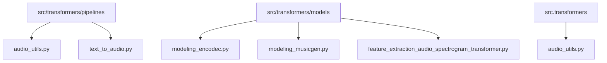
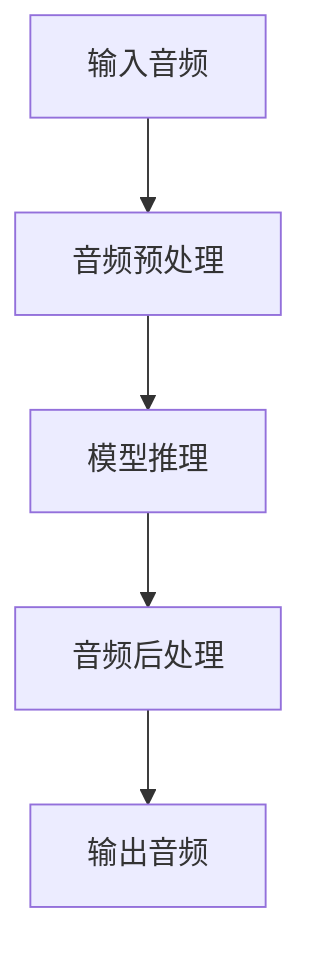
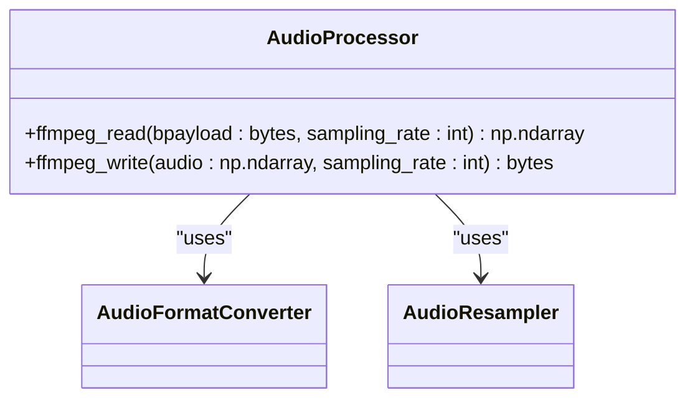
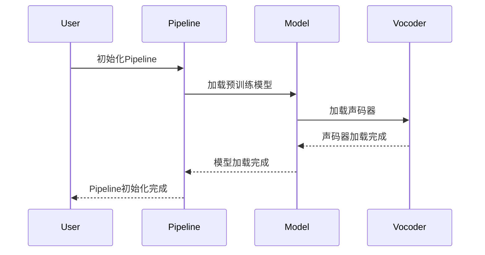
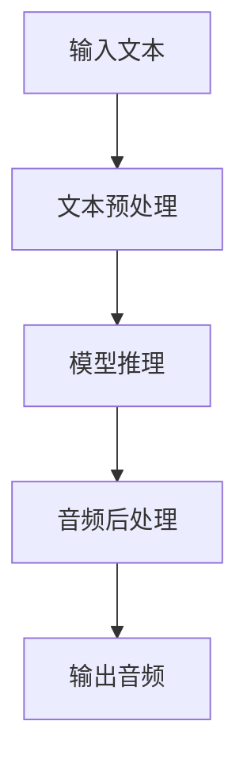
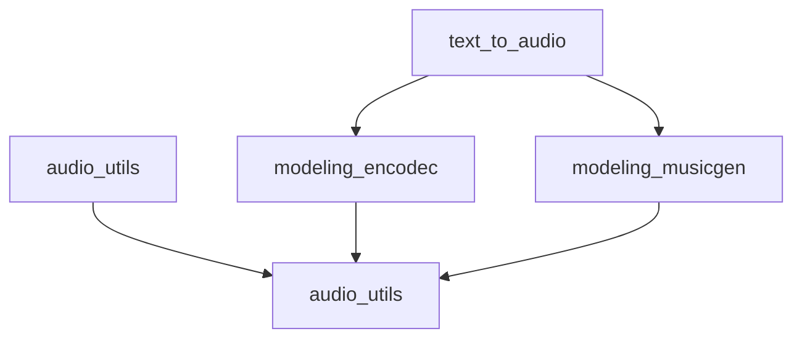

# 音频到音频转换Pipeline

<cite>
**本文档引用的文件**   
- [audio_utils.py](file://src/transformers/pipelines/audio_utils.py)
- [text_to_audio.py](file://src/transformers/pipelines/text_to_audio.py)
- [__init__.py](file://src/transformers/pipelines/__init__.py)
- [modeling_encodec.py](file://src/transformers/models/encodec/modeling_encodec.py)
- [modeling_musicgen.py](file://src/transformers/models/musicgen/modeling_musicgen.py)
- [feature_extraction_audio_spectrogram_transformer.py](file://src/transformers/models/audio_spectrogram_transformer/feature_extraction_audio_spectrogram_transformer.py)
- [audio_utils.py](file://src/transformers/audio_utils.py)
</cite>

## 目录
1. [简介](#简介)
2. [项目结构](#项目结构)
3. [核心组件](#核心组件)
4. [架构概述](#架构概述)
5. [详细组件分析](#详细组件分析)
6. [依赖分析](#依赖分析)
7. [性能考虑](#性能考虑)
8. [故障排除指南](#故障排除指南)
9. [结论](#结论)

## 简介
音频到音频转换Pipeline是transformers库中的一个重要功能，用于实现语音增强、语音转换和音频修复等任务。该Pipeline通过使用各种预训练模型和信号处理技术，将输入音频转换为高质量的输出音频。本文档详细介绍了该Pipeline的实现原理、处理流程、参数配置选项以及实际应用示例。

## 项目结构
transformers库的项目结构清晰，音频相关功能主要集中在`src/transformers/pipelines`和`src/transformers/models`目录下。`pipelines`目录包含各种任务的Pipeline实现，而`models`目录则包含具体的模型实现。

**图表来源**
- [audio_utils.py](file://src/transformers/pipelines/audio_utils.py)
- [text_to_audio.py](file://src/transformers/pipelines/text_to_audio.py)
- [modeling_encodec.py](file://src/transformers/models/encodec/modeling_encodec.py)
- [modeling_musicgen.py](file://src/transformers/models/musicgen/modeling_musicgen.py)
- [feature_extraction_audio_spectrogram_transformer.py](file://src/transformers/models/audio_spectrogram_transformer/feature_extraction_audio_spectrogram_transformer.py)
- [audio_utils.py](file://src/transformers/audio_utils.py)

**章节来源**
- [audio_utils.py](file://src/transformers/pipelines/audio_utils.py)
- [text_to_audio.py](file://src/transformers/pipelines/text_to_audio.py)
- [__init__.py](file://src/transformers/pipelines/__init__.py)

## 核心组件
音频到音频转换Pipeline的核心组件包括音频处理工具、文本到音频模型和特征提取器。这些组件协同工作，实现从输入音频到输出音频的转换。

**章节来源**
- [audio_utils.py](file://src/transformers/pipelines/audio_utils.py#L1-L297)
- [text_to_audio.py](file://src/transformers/pipelines/text_to_audio.py#L1-L270)
- [modeling_encodec.py](file://src/transformers/models/encodec/modeling_encodec.py#L1-L814)

## 架构概述
音频到音频转换Pipeline的架构主要包括输入处理、模型推理和输出生成三个阶段。输入处理阶段负责将原始音频转换为模型可接受的格式，模型推理阶段使用预训练模型进行音频转换，输出生成阶段将模型输出转换为最终的音频文件。

**图表来源**
- [audio_utils.py](file://src/transformers/pipelines/audio_utils.py#L1-L297)
- [text_to_audio.py](file://src/transformers/pipelines/text_to_audio.py#L1-L270)
- [modeling_encodec.py](file://src/transformers/models/encodec/modeling_encodec.py#L1-L814)

## 详细组件分析
### 音频处理工具分析
音频处理工具是音频到音频转换Pipeline的基础，负责处理各种音频格式和参数配置。

#### 音频读取和写入

**图表来源**
- [audio_utils.py](file://src/transformers/pipelines/audio_utils.py#L1-L297)

#### 音频格式支持
音频到音频转换Pipeline支持多种音频格式，包括WAV、FLAC等。这些格式的支持通过FFmpeg实现，确保了广泛的兼容性。

**章节来源**
- [audio_utils.py](file://src/transformers/pipelines/audio_utils.py#L1-L297)

### 文本到音频模型分析
文本到音频模型是音频到音频转换Pipeline的核心，负责将文本转换为音频。

#### 模型初始化

**图表来源**
- [text_to_audio.py](file://src/transformers/pipelines/text_to_audio.py#L1-L270)

#### 模型推理

**图表来源**
- [text_to_audio.py](file://src/transformers/pipelines/text_to_audio.py#L1-L270)

**章节来源**
- [text_to_audio.py](file://src/transformers/pipelines/text_to_audio.py#L1-L270)

## 依赖分析
音频到音频转换Pipeline依赖于多个外部库和内部模块，这些依赖关系确保了Pipeline的完整性和功能性。

**图表来源**
- [audio_utils.py](file://src/transformers/pipelines/audio_utils.py)
- [text_to_audio.py](file://src/transformers/pipelines/text_to_audio.py)
- [modeling_encodec.py](file://src/transformers/models/encodec/modeling_encodec.py)
- [modeling_musicgen.py](file://src/transformers/models/musicgen/modeling_musicgen.py)
- [audio_utils.py](file://src/transformers/audio_utils.py)

**章节来源**
- [audio_utils.py](file://src/transformers/pipelines/audio_utils.py)
- [text_to_audio.py](file://src/transformers/pipelines/text_to_audio.py)
- [modeling_encodec.py](file://src/transformers/models/encodec/modeling_encodec.py)
- [modeling_musicgen.py](file://src/transformers/models/musicgen/modeling_musicgen.py)
- [audio_utils.py](file://src/transformers/audio_utils.py)

## 性能考虑
在使用音频到音频转换Pipeline时，需要考虑以下几个性能因素：

1. **采样率和比特深度**：选择合适的采样率和比特深度可以平衡音频质量和文件大小。
2. **声道设置**：根据应用场景选择单声道或立体声。
3. **处理延迟**：优化模型推理和音频处理流程以减少延迟。

**章节来源**
- [audio_utils.py](file://src/transformers/pipelines/audio_utils.py#L1-L297)
- [text_to_audio.py](file://src/transformers/pipelines/text_to_audio.py#L1-L270)

## 故障排除指南
在使用音频到音频转换Pipeline时，可能会遇到以下常见问题：

1. **音频格式不支持**：确保输入音频格式为WAV或FLAC。
2. **采样率不匹配**：检查输入音频的采样率是否与模型要求一致。
3. **内存不足**：对于大型模型，确保有足够的内存资源。

**章节来源**
- [audio_utils.py](file://src/transformers/pipelines/audio_utils.py#L1-L297)
- [text_to_audio.py](file://src/transformers/pipelines/text_to_audio.py#L1-L270)

## 结论
音频到音频转换Pipeline是transformers库中一个强大且灵活的工具，适用于多种音频处理任务。通过深入了解其架构和组件，用户可以更好地利用这一功能，实现高质量的音频转换。