# 音频相关Pipeline

<cite>
**本文档中引用的文件**
- [automatic_speech_recognition.py](file://src/transformers/pipelines/automatic_speech_recognition.py)
- [audio_classification.py](file://src/transformers/pipelines/audio_classification.py)
- [text_to_audio.py](file://src/transformers/pipelines/text_to_audio.py)
- [audio_utils.py](file://src/transformers/pipelines/audio_utils.py)
- [base.py](file://src/transformers/pipelines/base.py)
- [__init__.py](file://src/transformers/pipelines/__init__.py)
- [feature_extraction_wav2vec2.py](file://src/transformers/models/wav2vec2/feature_extraction_wav2vec2.py)
- [feature_extraction_whisper.py](file://src/transformers/models/whisper/feature_extraction_whisper.py)
- [modeling_bark.py](file://src/transformers/models/bark/modeling_bark.py)
</cite>

## 目录
1. [简介](#简介)
2. [项目结构](#项目结构)
3. [核心组件](#核心组件)
4. [架构概览](#架构概览)
5. [详细组件分析](#详细组件分析)
6. [依赖关系分析](#依赖关系分析)
7. [性能考虑](#性能考虑)
8. [故障排除指南](#故障排除指南)
9. [结论](#结论)

## 简介

Transformers库提供了全面的音频处理Pipeline，涵盖了从自动语音识别(ASR)到文本到音频生成的完整音频处理流程。这些Pipeline专门设计用于处理各种音频任务，包括语音转文字、音频分类、语音增强、语音合成等。

本文档深入介绍了transformers库中音频相关Pipeline的实现细节，包括：
- 自动语音识别(ASR)Pipeline的多模态处理机制
- 音频分类Pipeline的特征提取算法
- 文本到音频生成Pipeline的声码器技术
- 音频预处理和后处理的完整流程
- 批处理策略和内存优化方案

## 项目结构

音频相关Pipeline在transformers库中的组织结构如下：

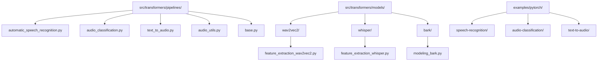

**图表来源**
- [__init__.py](file://src/transformers/pipelines/__init__.py#L1-L100)
- [base.py](file://src/transformers/pipelines/base.py#L1-L50)

**章节来源**
- [__init__.py](file://src/transformers/pipelines/__init__.py#L1-L200)

## 核心组件

### 支持的任务类型

transformers库支持以下主要的音频处理任务：

| 任务类型 | Pipeline类 | 模型支持 | 主要功能 |
|---------|-----------|---------|---------|
| 自动语音识别 | `AutomaticSpeechRecognitionPipeline` | Wav2Vec2, Whisper, CTC模型 | 长音频流式识别、时间戳预测 |
| 音频分类 | `AudioClassificationPipeline` | Wav2Vec2, HuBERT, AST | 声音事件检测、情感分类 |
| 文本到音频 | `TextToAudioPipeline` | Bark, SpeechT5, MusicGen | 语音合成、音乐生成 |
| 特征提取 | `FeatureExtractionPipeline` | 各种音频模型 | 音频特征向量提取 |

### 基础架构

所有音频Pipeline都继承自基础Pipeline类，提供了统一的接口和处理流程：

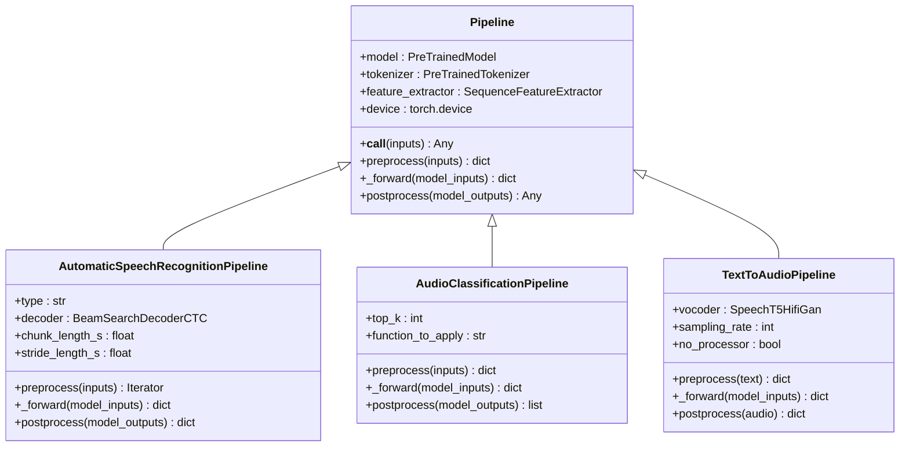

**图表来源**
- [base.py](file://src/transformers/pipelines/base.py#L1-L200)
- [automatic_speech_recognition.py](file://src/transformers/pipelines/automatic_speech_recognition.py#L1-L100)
- [audio_classification.py](file://src/transformers/pipelines/audio_classification.py#L1-L100)
- [text_to_audio.py](file://src/transformers/pipelines/text_to_audio.py#L1-L100)

**章节来源**
- [base.py](file://src/transformers/pipelines/base.py#L1-L200)
- [automatic_speech_recognition.py](file://src/transformers/pipelines/automatic_speech_recognition.py#L1-L200)
- [audio_classification.py](file://src/transformers/pipelines/audio_classification.py#L1-L200)
- [text_to_audio.py](file://src/transformers/pipelines/text_to_audio.py#L1-L200)

## 架构概览

音频Pipeline的整体架构采用模块化设计，每个组件负责特定的功能：

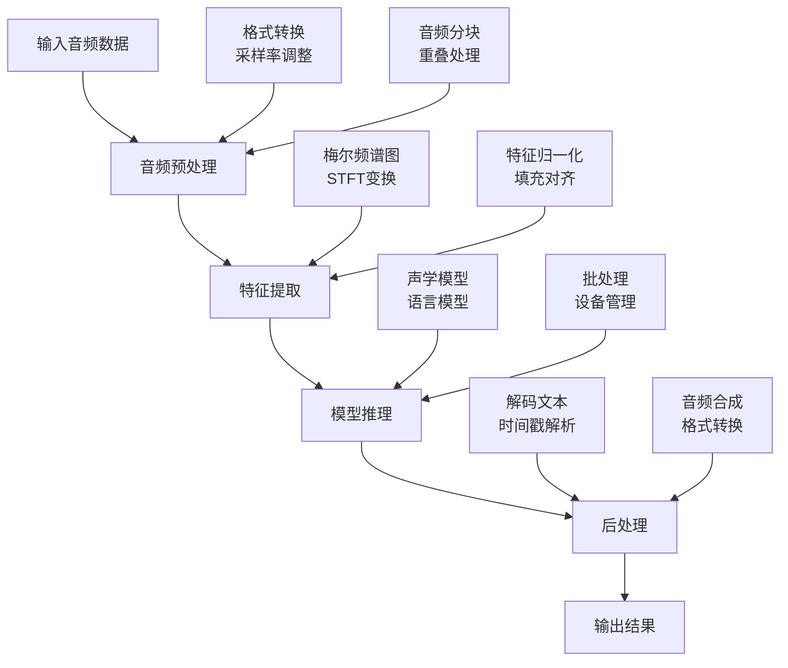

**图表来源**
- [automatic_speech_recognition.py](file://src/transformers/pipelines/automatic_speech_recognition.py#L200-L400)
- [audio_classification.py](file://src/transformers/pipelines/audio_classification.py#L150-L250)
- [text_to_audio.py](file://src/transformers/pipelines/text_to_audio.py#L100-L200)

## 详细组件分析

### 自动语音识别(ASR)Pipeline

ASR Pipeline是处理音频转文字任务的核心组件，具有复杂的多阶段处理流程。

#### 输入处理和音频预处理

ASR Pipeline支持多种输入格式，并提供智能的音频预处理能力：

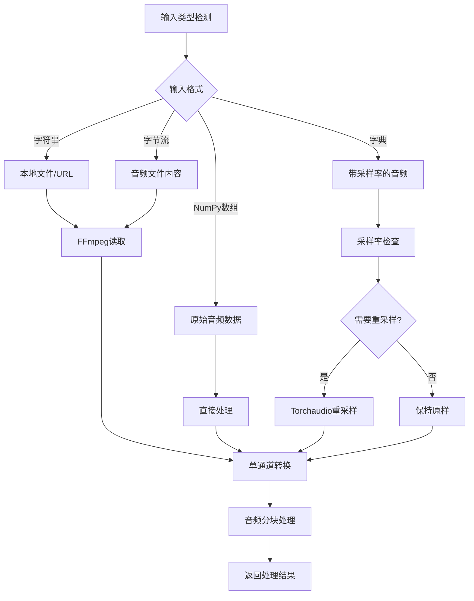

**图表来源**
- [automatic_speech_recognition.py](file://src/transformers/pipelines/automatic_speech_recognition.py#L300-L500)

#### 长音频流式识别机制

对于长音频文件，ASR Pipeline实现了高效的分块处理策略：

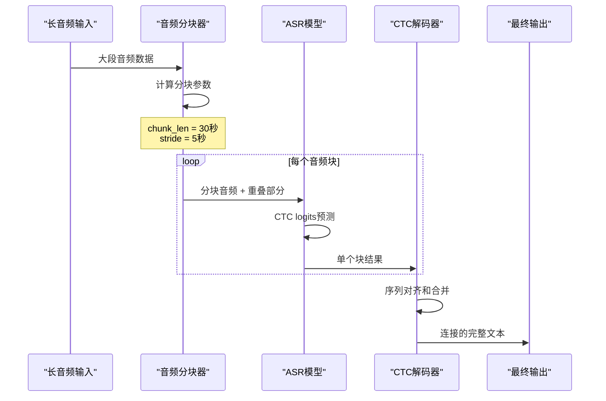

**图表来源**
- [automatic_speech_recognition.py](file://src/transformers/pipelines/automatic_speech_recognition.py#L400-L600)

#### 声学模型推理和语言模型集成

ASR Pipeline支持多种模型架构，每种都有其特定的处理流程：

| 模型类型 | 处理方式 | 时间戳支持 | 特殊功能 |
|---------|---------|-----------|---------|
| CTC模型 | 直接解码 | 字符级/单词级 | Beam搜索解码 |
| CTC+LM | 语言模型增强 | 仅单词级 | 双束搜索 |
| Seq2Seq | 编码器-解码器 | 无 | 自回归生成 |
| Whisper | 多任务学习 | 段落级 | 动态时间规整 |

**章节来源**
- [automatic_speech_recognition.py](file://src/transformers/pipelines/automatic_speech_recognition.py#L1-L673)

### 音频分类Pipeline

音频分类Pipeline专注于从音频中提取特征并进行分类任务。

#### 特征提取过程

音频分类Pipeline使用专门的特征提取器生成高质量的音频表示：

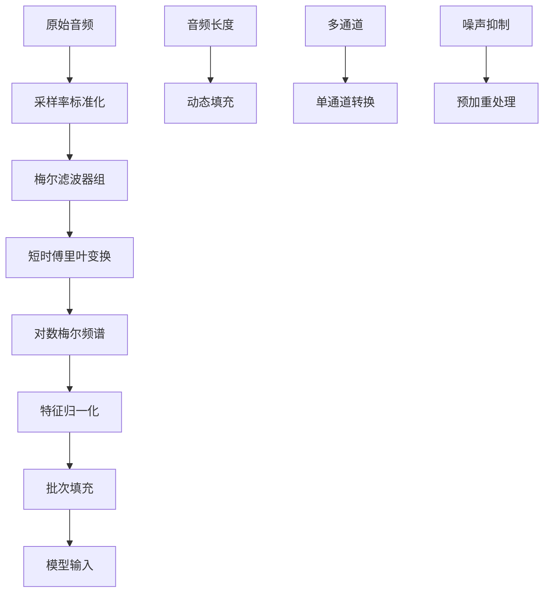

**图表来源**
- [audio_classification.py](file://src/transformers/pipelines/audio_classification.py#L100-L200)

#### 分类结果解码

分类Pipeline提供灵活的结果处理选项：

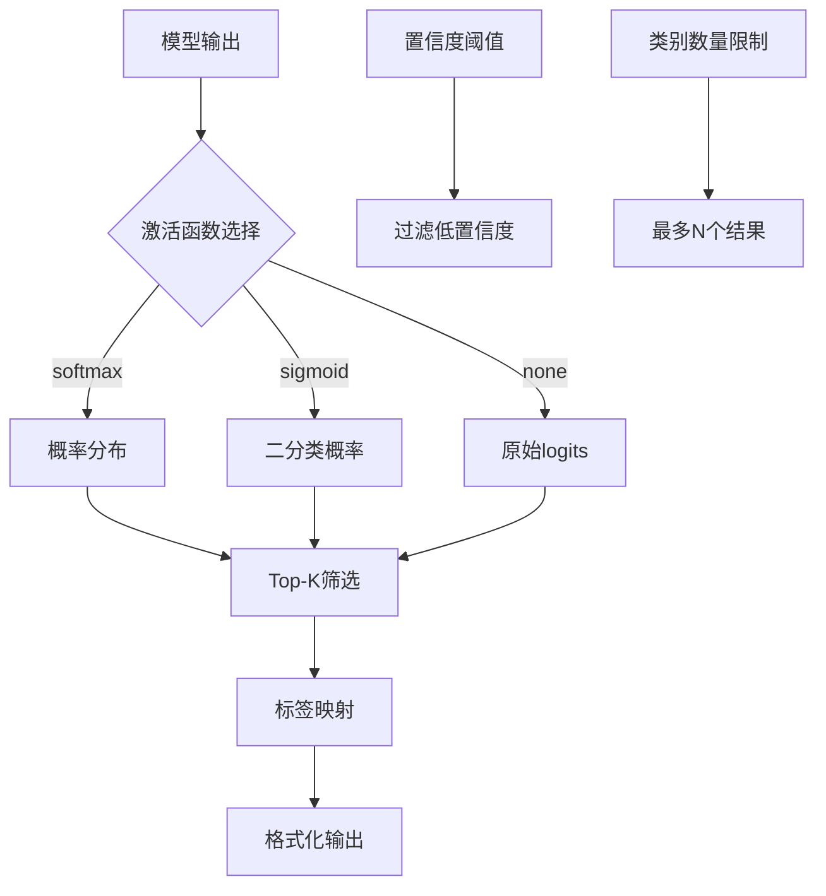

**图表来源**
- [audio_classification.py](file://src/transformers/pipelines/audio_classification.py#L200-L260)

**章节来源**
- [audio_classification.py](file://src/transformers/pipelines/audio_classification.py#L1-L260)

### 文本到音频生成Pipeline

文本到音频Pipeline实现了从文本到自然语音的完整转换流程。

#### 音频生成流程

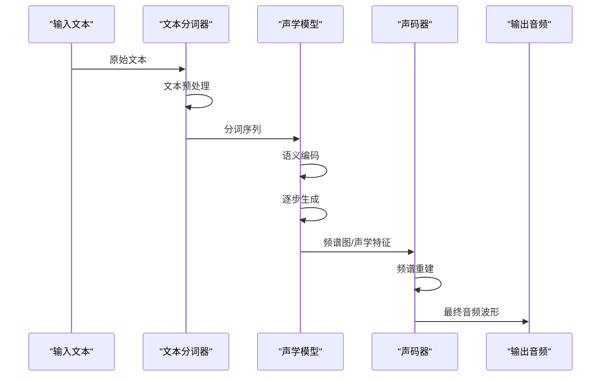

**图表来源**
- [text_to_audio.py](file://src/transformers/pipelines/text_to_audio.py#L150-L250)

#### 不同模型类型的处理差异

| 模型类型 | 输入处理 | 输出格式 | 特殊参数 |
|---------|---------|---------|---------|
| Bark | 多层分词 | 波形 | 温度、长度控制 |
| SpeechT5 | 文本+说话人嵌入 | 频谱图 | 说话人编码器 |
| MusicGen | 文本+条件 | 频谱图 | 音乐风格控制 |
| VITS | 文本+韵律 | 频谱图 | 流模型 |

**章节来源**
- [text_to_audio.py](file://src/transformers/pipelines/text_to_audio.py#L1-L270)

### 音频工具函数

音频工具模块提供了底层的音频处理功能：

#### 音频格式转换和重采样

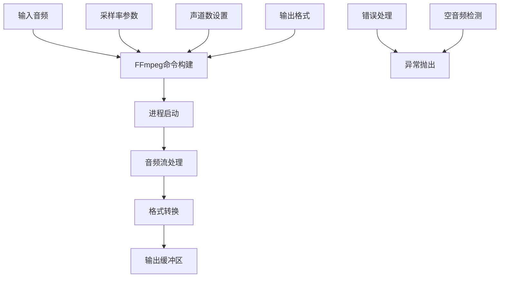

**图表来源**
- [audio_utils.py](file://src/transformers/pipelines/audio_utils.py#L10-L50)

#### 实时音频处理

音频工具模块还支持实时音频流处理：

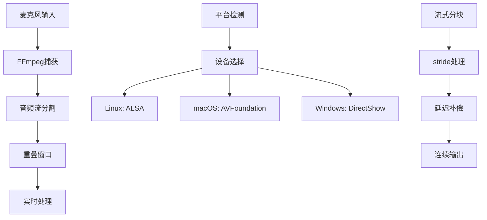

**图表来源**
- [audio_utils.py](file://src/transformers/pipelines/audio_utils.py#L50-L150)

**章节来源**
- [audio_utils.py](file://src/transformers/pipelines/audio_utils.py#L1-L297)

## 依赖关系分析

音频Pipeline的依赖关系展现了复杂的生态系统：

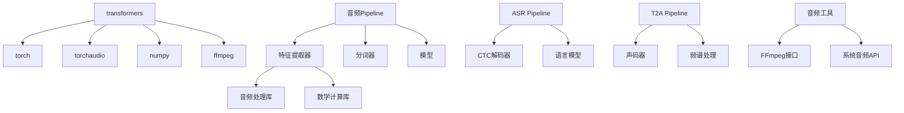

**图表来源**
- [base.py](file://src/transformers/pipelines/base.py#L1-L50)
- [automatic_speech_recognition.py](file://src/transformers/pipelines/automatic_speech_recognition.py#L1-L30)

**章节来源**
- [base.py](file://src/transformers/pipelines/base.py#L1-L200)

## 性能考虑

### 内存优化策略

音频Pipeline采用了多种内存优化技术：

1. **批处理优化**: 自动调整批次大小以适应GPU内存
2. **梯度检查点**: 在推理时减少内存占用
3. **动态形状处理**: 避免不必要的张量重塑
4. **设备间传输最小化**: 减少CPU-GPU数据传输

### 计算效率提升

1. **Flash Attention**: 支持注意力机制的内存高效实现
2. **混合精度**: 使用FP16降低计算成本
3. **并行处理**: 多线程音频预处理
4. **缓存机制**: 重复数据的智能缓存

### 扩展性设计

音频Pipeline支持水平和垂直扩展：

- **分布式推理**: 大模型的分布式处理
- **模型量化**: 减少模型大小和内存需求
- **剪枝优化**: 移除不重要的权重
- **知识蒸馏**: 小模型的大模型效果

## 故障排除指南

### 常见问题和解决方案

#### 音频格式问题

**问题**: 不支持的音频格式
**解决方案**: 使用FFmpeg进行格式转换或安装额外的编解码器

**问题**: 采样率不匹配
**解决方案**: 自动重采样或手动指定采样率参数

#### 内存不足

**问题**: GPU内存溢出
**解决方案**: 减小批次大小或启用梯度检查点

**问题**: CPU内存不足
**解决方案**: 使用流式处理或增加虚拟内存

#### 性能问题

**问题**: 推理速度慢
**解决方案**: 启用混合精度、使用更快的模型变体

**问题**: 延迟过高
**解决方案**: 调整分块大小或使用更小的模型

### 调试技巧

1. **启用详细日志**: 设置日志级别为DEBUG
2. **检查中间结果**: 使用调试模式查看处理步骤
3. **验证输入格式**: 确保音频数据符合预期格式
4. **监控资源使用**: 跟踪内存和GPU利用率

**章节来源**
- [automatic_speech_recognition.py](file://src/transformers/pipelines/automatic_speech_recognition.py#L600-L673)
- [audio_utils.py](file://src/transformers/pipelines/audio_utils.py#L200-L297)

## 结论

Transformers库的音频相关Pipeline提供了一个完整、高效且易于使用的音频处理解决方案。通过模块化设计和丰富的功能支持，这些Pipeline能够满足从研究到生产环境的各种音频处理需求。

### 主要优势

1. **统一接口**: 所有音频Pipeline共享相同的API设计
2. **灵活性**: 支持多种输入格式和处理参数
3. **可扩展性**: 易于添加新的模型和功能
4. **性能优化**: 内置多种优化技术和最佳实践
5. **社区支持**: 活跃的开源社区和持续更新

### 未来发展方向

1. **多模态融合**: 更好的文本-音频交互
2. **实时处理**: 更低延迟的音频处理
3. **模型压缩**: 更高效的模型部署
4. **边缘计算**: 移动设备上的音频处理
5. **质量提升**: 更自然的音频合成效果

通过深入理解这些Pipeline的设计原理和实现细节，开发者可以更好地利用transformers库的强大功能，构建高质量的音频应用程序。