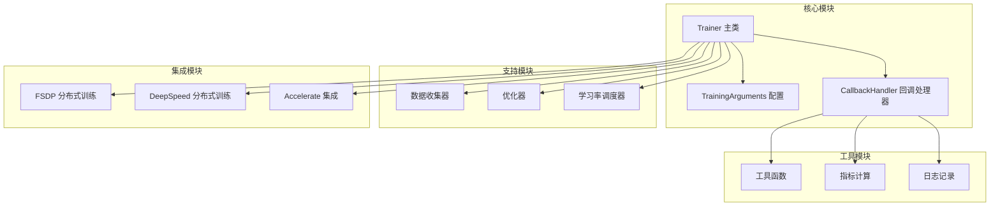
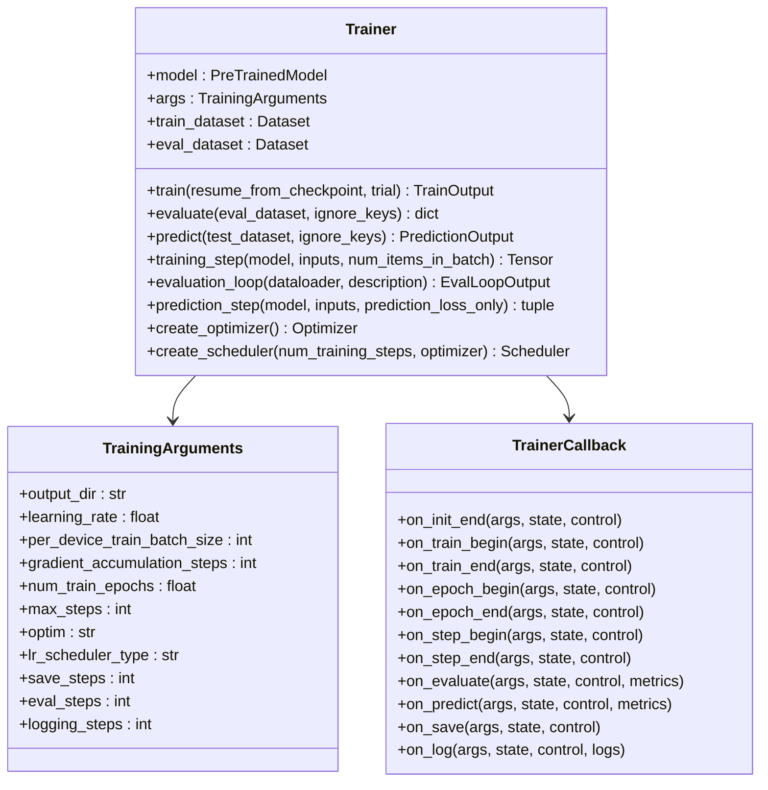
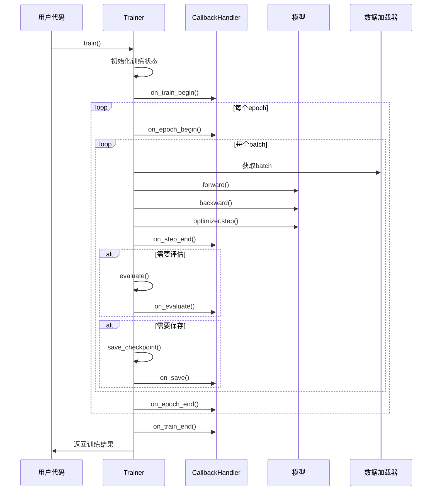
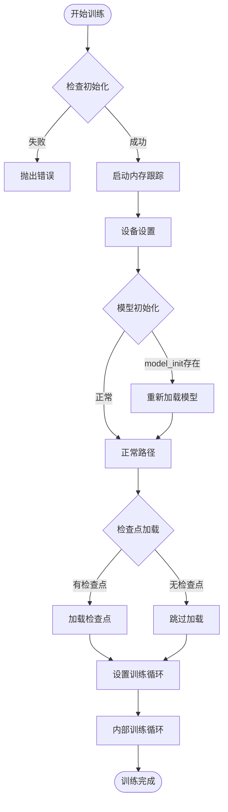
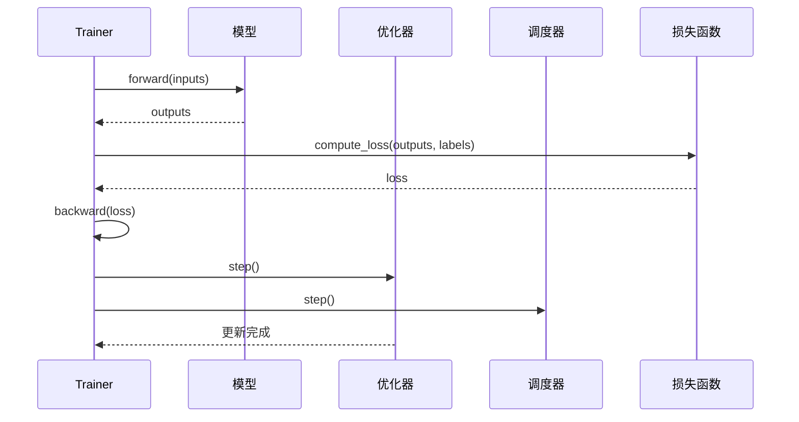
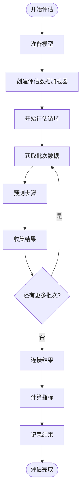
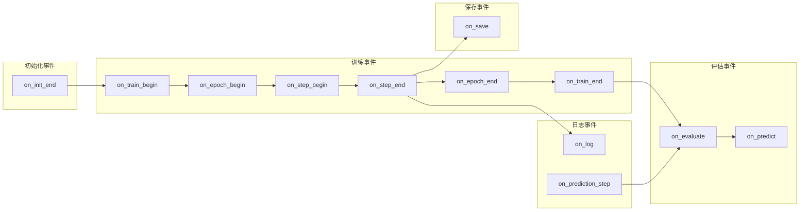
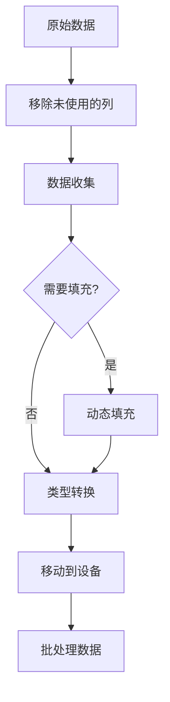
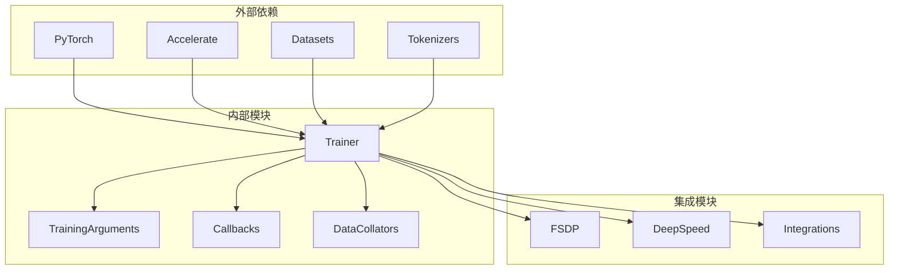

# Trainer API 文档

<cite>
**本文档中引用的文件**
- [trainer.py](file://src/transformers/trainer.py)
- [training_args.py](file://src/transformers/training_args.py)
- [trainer_callback.py](file://src/transformers/trainer_callback.py)
- [data_collator.py](file://src/transformers/data/data_collator.py)
- [fsdp.py](file://src/transformers/integrations/fsdp.py)
- [deepspeed.py](file://src/transformers/integrations/deepspeed.py)
</cite>

## 目录
1. [简介](#简介)
2. [项目结构](#项目结构)
3. [核心组件](#核心组件)
4. [架构概览](#架构概览)
5. [详细组件分析](#详细组件分析)
6. [依赖关系分析](#依赖关系分析)
7. [性能考虑](#性能考虑)
8. [故障排除指南](#故障排除指南)
9. [结论](#结论)

## 简介

Trainer API是Hugging Face Transformers库的核心训练接口，提供了完整的模型训练、评估和预测功能。它是一个功能完备的训练循环，专为🤗 Transformers模型优化，支持多种训练策略、分布式训练和自定义扩展。

Trainer API的主要特点：
- 统一的训练接口，简化模型微调流程
- 内置分布式训练支持（FSDP、DeepSpeed）
- 灵活的回调机制和自定义扩展点
- 完整的数据处理和批处理管理
- 丰富的配置选项和超参数搜索支持

## 项目结构

Trainer API的实现分布在多个模块中，形成了一个层次化的架构：



**图表来源**
- [trainer.py](file://src/transformers/trainer.py#L1-L100)
- [training_args.py](file://src/transformers/training_args.py#L1-L50)
- [trainer_callback.py](file://src/transformers/trainer_callback.py#L1-L50)

**章节来源**
- [trainer.py](file://src/transformers/trainer.py#L1-L200)
- [training_args.py](file://src/transformers/training_args.py#L1-L100)

## 核心组件

### Trainer 类

Trainer是整个训练系统的核心类，提供了统一的训练接口和完整的训练生命周期管理。

#### 主要属性

| 属性 | 类型 | 描述 |
|------|------|------|
| `model` | `PreTrainedModel \| nn.Module` | 要训练或评估的模型 |
| `args` | `TrainingArguments` | 训练参数配置 |
| `data_collator` | `DataCollator` | 数据批处理收集器 |
| `train_dataset` | `Dataset` | 训练数据集 |
| `eval_dataset` | `Dataset` | 评估数据集 |
| `compute_metrics` | `Callable` | 评估指标计算函数 |
| `callbacks` | `List[TrainerCallback]` | 回调函数列表 |

#### 核心方法



**图表来源**
- [trainer.py](file://src/transformers/trainer.py#L200-L300)
- [training_args.py](file://src/transformers/training_args.py#L200-L300)
- [trainer_callback.py](file://src/transformers/trainer_callback.py#L200-L300)

**章节来源**
- [trainer.py](file://src/transformers/trainer.py#L200-L400)

### TrainingArguments 类

TrainingArguments提供了所有训练相关的配置选项，涵盖了从基础训练参数到高级分布式训练设置。

#### 关键配置分类

| 配置类别 | 主要参数 | 描述 |
|----------|----------|------|
| **基础训练** | `learning_rate`, `num_train_epochs`, `max_steps` | 基本训练控制参数 |
| **批处理配置** | `per_device_train_batch_size`, `gradient_accumulation_steps` | 批处理和梯度累积设置 |
| **优化器配置** | `optim`, `weight_decay`, `adam_beta1`, `adam_beta2` | 优化器类型和超参数 |
| **学习率调度** | `lr_scheduler_type`, `warmup_steps`, `warmup_ratio` | 学习率调度策略 |
| **保存与评估** | `save_steps`, `eval_steps`, `logging_steps` | 模型保存和评估频率 |
| **分布式训练** | `fsdp`, `deepspeed`, `parallel_mode` | 分布式训练配置 |
| **混合精度** | `fp16`, `bf16`, `tf32` | 混合精度训练设置 |

**章节来源**
- [training_args.py](file://src/transformers/training_args.py#L200-L800)

## 架构概览

Trainer API采用事件驱动的架构模式，通过回调机制实现灵活的训练流程控制。



**图表来源**
- [trainer.py](file://src/transformers/trainer.py#L2054-L2159)
- [trainer_callback.py](file://src/transformers/trainer_callback.py#L424-L565)

## 详细组件分析

### 训练生命周期管理

Trainer提供了完整的训练生命周期管理，包括初始化、训练、评估和保存等阶段。

#### 训练入口点



**图表来源**
- [trainer.py](file://src/transformers/trainer.py#L2054-L2159)

#### 训练步骤执行

训练步骤是训练过程中的基本单位，包含了前向传播、反向传播和优化器更新。



**图表来源**
- [trainer.py](file://src/transformers/trainer.py#L3725-L3794)

**章节来源**
- [trainer.py](file://src/transformers/trainer.py#L2054-L2500)

### 评估和预测系统

Trainer提供了统一的评估和预测接口，支持批量处理和指标计算。

#### 评估流程



**图表来源**
- [trainer.py](file://src/transformers/trainer.py#L4300-L4500)

#### 预测输出格式

| 输出字段 | 类型 | 描述 |
|----------|------|------|
| `predictions` | `np.ndarray` | 模型预测结果 |
| `label_ids` | `np.ndarray` | 真实标签（如果有） |
| `metrics` | `dict` | 评估指标 |

**章节来源**
- [trainer.py](file://src/transformers/trainer.py#L4136-L4296)

### 回调机制

Trainer的回调机制提供了灵活的训练流程扩展点，允许用户在训练的不同阶段插入自定义逻辑。

#### 回调事件类型



**图表来源**
- [trainer_callback.py](file://src/transformers/trainer_callback.py#L280-L425)

#### 自定义回调示例

```python
class CustomCallback(TrainerCallback):
    def on_step_end(self, args, state, control, **kwargs):
        # 在每个训练步骤结束时执行自定义逻辑
        if state.global_step % 100 == 0:
            print(f"Step {state.global_step} completed")
    
    def on_evaluate(self, args, state, control, metrics, **kwargs):
        # 在每次评估后执行自定义逻辑
        print(f"Evaluation metrics: {metrics}")
```

**章节来源**
- [trainer_callback.py](file://src/transformers/trainer_callback.py#L280-L600)

### 数据处理和批处理

Trainer提供了强大的数据处理能力，支持动态填充、特殊令牌处理和自定义数据收集器。

#### 数据收集器类型

| 收集器类型 | 用途 | 特点 |
|------------|------|------|
| `DefaultDataCollator` | 基础数据批处理 | 处理标签字段，自动类型转换 |
| `DataCollatorWithPadding` | 动态填充 | 根据最大长度填充序列 |
| `DataCollatorForTokenClassification` | 分类任务 | 处理标记级标签 |
| `DataCollatorForSeq2Seq` | 序列到序列任务 | 处理编码器-解码器输入 |
| `DataCollatorForLanguageModeling` | 语言建模 | 支持掩码语言建模 |

#### 数据处理流程



**图表来源**
- [data_collator.py](file://src/transformers/data/data_collator.py#L1-L100)

**章节来源**
- [data_collator.py](file://src/transformers/data/data_collator.py#L1-L800)

### 分布式训练配置

Trainer支持多种分布式训练策略，包括FSDP和DeepSpeed。

#### FSDP配置选项

| 配置项 | 类型 | 描述 |
|--------|------|------|
| `fsdp` | `bool \| str \| list` | 启用FSDP并指定策略 |
| `fsdp_config` | `dict` | FSDP详细配置 |
| `min_num_params` | `int` | 最小参数数量用于自动包装 |
| `transformer_layer_cls_to_wrap` | `list` | 要包装的层类名 |
| `backward_prefetch` | `str` | 反向预取模式 |
| `forward_prefetch` | `bool` | 前向预取 |
| `limit_all_gathers` | `bool` | 限制所有收集操作 |

#### DeepSpeed配置选项

| 配置项 | 类型 | 描述 |
|--------|------|------|
| `deepspeed` | `str \| dict` | DeepSpeed配置文件或字典 |
| `zero_optimization` | `dict` | ZeRO优化配置 |
| `fp16` | `dict` | 半精度训练配置 |
| `bf16` | `dict` | bfloat16训练配置 |
| `optimizer` | `dict` | 优化器配置 |
| `scheduler` | `dict` | 学习率调度器配置 |

**章节来源**
- [fsdp.py](file://src/transformers/integrations/fsdp.py#L1-L54)
- [deepspeed.py](file://src/transformers/integrations/deepspeed.py#L1-L200)

## 依赖关系分析

Trainer API的依赖关系复杂且层次分明，形成了一个稳定的生态系统。



**图表来源**
- [trainer.py](file://src/transformers/trainer.py#L1-L100)

### 关键依赖说明

| 依赖项 | 版本要求 | 用途 |
|--------|----------|------|
| `torch` | >= 1.8.0 | 核心深度学习框架 |
| `accelerate` | >= 0.15.0 | 分布式训练和混合精度 |
| `datasets` | >= 1.4.0 | 数据集处理 |
| `tokenizers` | >= 0.10.0 | 文本处理和分词 |
| `numpy` | >= 1.17 | 数值计算 |
| `scipy` | >= 1.3.0 | 科学计算 |

**章节来源**
- [trainer.py](file://src/transformers/trainer.py#L1-L100)

## 性能考虑

### 内存优化

Trainer提供了多种内存优化策略：

1. **梯度检查点**：减少激活内存占用
2. **混合精度训练**：使用FP16或BF16降低内存需求
3. **动态批处理大小**：自动调整批处理大小以适应内存
4. **CPU缓存清理**：定期清理CUDA缓存

### 计算优化

1. **梯度累积**：模拟大批次训练
2. **异步数据加载**：使用多进程数据加载
3. **编译优化**：支持PyTorch 2.0编译
4. **Tensor Core利用**：充分利用现代GPU的Tensor Core

### 分布式训练优化

1. **通信优化**：减少节点间通信开销
2. **内存分布**：合理分配模型参数到不同设备
3. **负载均衡**：平衡各节点的工作负载

## 故障排除指南

### 常见问题及解决方案

#### 内存不足问题

**症状**：CUDA out of memory错误
**解决方案**：
1. 减少批处理大小
2. 启用梯度检查点
3. 使用混合精度训练
4. 启用自动批处理大小查找

#### 分布式训练问题

**症状**：多GPU训练失败或性能差
**解决方案**：
1. 检查CUDA安装和版本兼容性
2. 验证网络连接和端口配置
3. 使用正确的分布式启动命令
4. 检查环境变量设置

#### 回调函数问题

**症状**：自定义回调不生效
**解决方案**：
1. 确保回调正确继承基类
2. 检查回调注册顺序
3. 验证回调方法签名
4. 添加调试日志

**章节来源**
- [trainer.py](file://src/transformers/trainer.py#L1-L200)

## 结论

Trainer API是Hugging Face Transformers库的核心组件，提供了功能强大且易于使用的模型训练接口。它通过以下特性为用户提供了一个完整的训练解决方案：

### 主要优势

1. **统一接口**：提供一致的训练、评估和预测API
2. **灵活性**：支持多种训练策略和自定义扩展
3. **可扩展性**：内置分布式训练和混合精度支持
4. **易用性**：简化了复杂的训练流程配置

### 最佳实践建议

1. **合理配置批处理大小**：根据可用内存调整批处理参数
2. **选择合适的优化器**：根据任务特点选择优化器类型
3. **使用回调机制**：通过回调实现自定义训练逻辑
4. **监控训练过程**：利用日志和指标跟踪训练进度

### 未来发展

Trainer API将继续演进，重点关注：
- 更好的硬件支持（如Intel XPU、AMD GPU）
- 更高效的分布式训练算法
- 更智能的自动配置和优化
- 更丰富的集成选项

通过深入理解和正确使用Trainer API，开发者可以高效地训练和部署各种类型的机器学习模型，推动AI应用的发展。