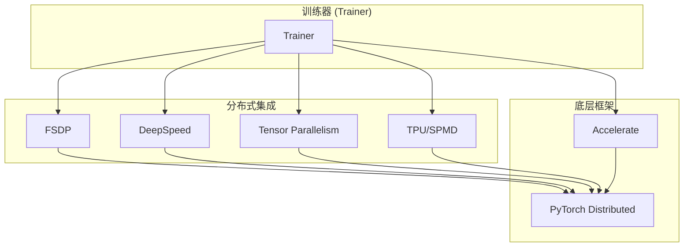
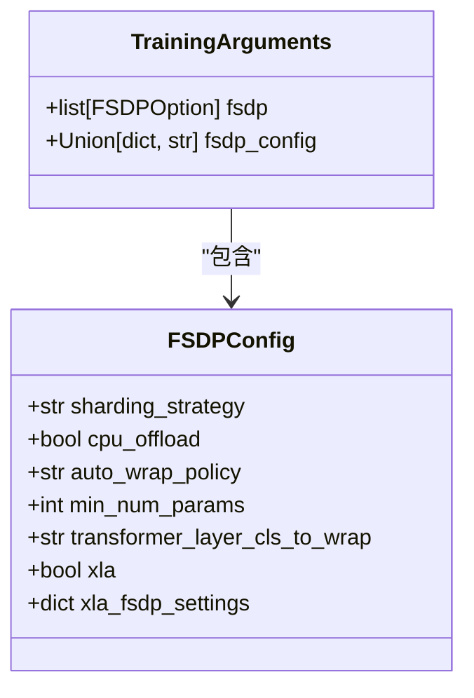
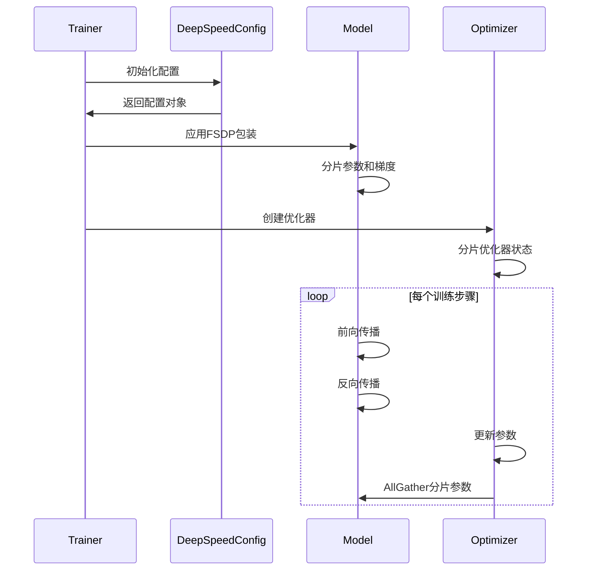

# 分布式训练

<cite>
**本文档中引用的文件**  
- [trainer.py](file://src/transformers/trainer.py)
- [training_args.py](file://src/transformers/training_args.py)
- [deepspeed.py](file://src/transformers/integrations/deepspeed.py)
- [fsdp.py](file://src/transformers/integrations/fsdp.py)
- [distributed_training.py](file://examples/training/distributed_training.py)
- [ds_config_zero2.json](file://tests/deepspeed/ds_config_zero2.json)
- [ds_config_zero3.json](file://tests/deepspeed/ds_config_zero3.json)
- [configuration_utils.py](file://src/transformers/distributed/configuration_utils.py)
</cite>

## 目录
1. [简介](#简介)
2. [分布式训练架构](#分布式训练架构)
3. [FSDP配置与最佳实践](#fsdp配置与最佳实践)
4. [DeepSpeed配置与最佳实践](#deepspeed配置与最佳实践)
5. [多GPU与多节点训练设置](#多gpu与多节点训练设置)
6. [性能调优技巧](#性能调优技巧)
7. [常见问题与解决方案](#常见问题与解决方案)
8. [不同硬件环境下的训练指导](#不同硬件环境下的训练指导)

## 简介

分布式训练是大规模深度学习模型训练的核心技术，它通过将计算和内存负载分布在多个GPU或多个节点上，显著提高了训练效率和可扩展性。Hugging Face Transformers库提供了对多种分布式训练策略的全面支持，包括PyTorch的Fully Sharded Data Parallel (FSDP)和DeepSpeed等先进框架。

本文档旨在为用户提供一个全面的指南，详细说明如何在Transformers库中配置和使用分布式训练。我们将深入探讨FSDP和DeepSpeed的工作原理、适用场景以及配置方法，并提供详细的配置示例来展示如何设置多GPU和多节点训练。此外，我们还将介绍性能调优技巧和常见问题的解决方案，帮助用户在不同的硬件环境下高效地进行分布式训练。

## 分布式训练架构

Transformers库中的分布式训练架构基于PyTorch的分布式训练框架，并通过Accelerate库进行封装和简化。该架构支持多种并行策略，包括数据并行、模型并行和流水线并行，以及它们的组合。



**图示来源**  
- [trainer.py](file://src/transformers/trainer.py)
- [deepspeed.py](file://src/transformers/integrations/deepspeed.py)
- [fsdp.py](file://src/transformers/integrations/fsdp.py)

**本节来源**  
- [trainer.py](file://src/transformers/trainer.py#L1-L100)
- [training_args.py](file://src/transformers/training_args.py#L1-L50)

## FSDP配置与最佳实践

Fully Sharded Data Parallel (FSDP)是PyTorch提供的一种高效的分布式训练策略，它通过将模型参数、梯度和优化器状态分片到不同的设备上来减少内存占用。

### FSDP配置选项

FSDP的配置主要通过`TrainingArguments`中的`fsdp`和`fsdp_config`参数进行设置。`fsdp`参数接受一个字符串列表，指定使用的FSDP选项：

- `"full_shard"`: 对参数、梯度和优化器状态进行分片
- `"shard_grad_op"`: 对优化器状态和梯度进行分片
- `"hybrid_shard"`: 在节点内应用`FULL_SHARD`，并在节点间复制参数
- `"hybrid_shard_zero2"`: 在节点内应用`SHARD_GRAD_OP`，并在节点间复制参数
- `"offload"`: 将参数和梯度卸载到CPU（仅与`"full_shard"`和`"shard_grad_op"`兼容）
- `"auto_wrap"`: 使用`default_auto_wrap_policy`自动递归包装层



**图示来源**  
- [training_args.py](file://src/transformers/training_args.py#L1101-L1130)
- [trainer.py](file://src/transformers/trainer.py#L532-L556)

### FSDP最佳实践

1. **自动包装策略**: 使用`auto_wrap`选项可以自动将模型的层包装成FSDP模块，这对于大型Transformer模型特别有用。

2. **最小参数数量**: 通过设置`min_num_params`，可以指定只有当层的参数数量超过该阈值时才进行分片，这有助于优化内存使用。

3. **XLA集成**: 对于TPU训练，可以启用XLA FSDP支持，通过设置`xla=True`来利用XLA的优化。

4. **预取策略**: 配置`backward_prefetch`和`forward_prefetch`可以优化计算和通信的重叠，提高训练效率。

**本节来源**  
- [training_args.py](file://src/transformers/training_args.py#L2622-L2748)
- [trainer.py](file://src/transformers/trainer.py#L2004-L2024)

## DeepSpeed配置与最佳实践

DeepSpeed是微软开发的一个深度学习优化库，提供了ZeRO（Zero Redundancy Optimizer）等高级优化技术，可以显著减少内存占用并提高训练速度。

### DeepSpeed配置文件

DeepSpeed的配置通常通过一个JSON文件进行，该文件包含了优化器、调度器、混合精度训练和ZeRO优化等设置。以下是一个典型的DeepSpeed配置文件示例：

```json
{
    "fp16": {
        "enabled": "auto",
        "loss_scale": 0,
        "loss_scale_window": 1000,
        "initial_scale_power": 16,
        "hysteresis": 2,
        "min_loss_scale": 1
    },
    "bf16": {
        "enabled": "auto"
    },
    "optimizer": {
        "type": "AdamW",
        "params": {
            "lr": "auto",
            "betas": "auto",
            "eps": "auto",
            "weight_decay": "auto"
        }
    },
    "scheduler": {
        "type": "WarmupLR",
        "params": {
            "warmup_min_lr": "auto",
            "warmup_max_lr": "auto",
            "warmup_num_steps": "auto"
        }
    },
    "zero_optimization": {
        "stage": 3,
        "offload_optimizer": {
            "device": "none",
            "pin_memory": true
        },
        "offload_param": {
            "device": "none",
            "pin_memory": true
        },
        "overlap_comm": true,
        "contiguous_gradients": true,
        "sub_group_size": 1e9,
        "reduce_bucket_size": "auto",
        "stage3_prefetch_bucket_size": "auto",
        "stage3_param_persistence_threshold": "auto",
        "stage3_max_live_parameters": 1e9,
        "stage3_max_reuse_distance": 1e9,
        "stage3_gather_16bit_weights_on_model_save": true
    },
    "gradient_accumulation_steps": "auto",
    "gradient_clipping": "auto",
    "steps_per_print": 2000,
    "train_batch_size": "auto",
    "train_micro_batch_size_per_gpu": "auto",
    "wall_clock_breakdown": false
}
```

### DeepSpeed最佳实践

1. **ZeRO阶段选择**: 根据可用内存和计算资源选择合适的ZeRO阶段。Stage 2分片优化器状态和梯度，而Stage 3进一步分片模型参数。

2. **CPU卸载**: 对于内存受限的环境，可以启用CPU卸载，将优化器状态和参数存储在CPU内存中。

3. **自动配置**: 使用`"auto"`值可以让DeepSpeed根据训练参数自动设置合适的配置，如学习率、批量大小等。

4. **通信优化**: 启用`overlap_comm`可以重叠通信和计算，提高训练效率。



**图示来源**  
- [deepspeed.py](file://src/transformers/integrations/deepspeed.py#L64-L102)
- [ds_config_zero3.json](file://tests/deepspeed/ds_config_zero3.json)

**本节来源**  
- [deepspeed.py](file://src/transformers/integrations/deepspeed.py#L159-L204)
- [ds_config_zero2.json](file://tests/deepspeed/ds_config_zero2.json)
- [ds_config_zero3.json](file://tests/deepspeed/ds_config_zero3.json)

## 多GPU与多节点训练设置

### 单节点多GPU训练

单节点多GPU训练是最常见的分布式训练场景。可以通过`torch.distributed.launch`或`torchrun`来启动训练：

```bash
python -m torch.distributed.launch \
    --nproc_per_node=4 \
    your_training_script.py \
    --fsdp "full_shard auto_wrap" \
    --deepspeed ds_config.json
```

### 多节点训练

多节点训练需要配置节点间的通信，通常通过指定主节点地址和端口来实现：

```bash
# 节点0
python -m torch.distributed.launch \
    --nproc_per_node=4 \
    --nnodes=2 \
    --node_rank=0 \
    --master_addr="192.168.1.1" \
    --master_port=1234 \
    your_training_script.py

# 节点1
python -m torch.distributed.launch \
    --nproc_per_node=4 \
    --nnodes=2 \
    --node_rank=1 \
    --master_addr="192.168.1.1" \
    --master_port=1234 \
    your_training_script.py
```

### MPI设置

对于更复杂的多节点设置，可以使用MPI（Message Passing Interface）：

```bash
mpirun --hostfile hostfile -np 16 \
    --bind-to none --map-by slot \
    -x MASTER_ADDR=192.168.1.1 \
    -x MASTER_PORT=29500 \
    -x NCCL_DEBUG=INFO \
    python your_script.py --backend nccl
```

**本节来源**  
- [distributed_training.py](file://examples/training/distributed_training.py#L0-L113)
- [run_ddp.py](file://tests/sagemaker/scripts/pytorch/run_ddp.py#L0-L51)

## 性能调优技巧

### 混合精度训练

启用混合精度训练可以显著提高训练速度并减少内存占用：

```python
training_args = TrainingArguments(
    fp16=True,  # 或 bf16=True
    fsdp_config={
        "fp16": {"enabled": True},
        "bf16": {"enabled": True}
    }
)
```

### 梯度累积

对于内存受限的环境，可以使用梯度累积来模拟更大的批量大小：

```python
training_args = TrainingArguments(
    per_device_train_batch_size=8,
    gradient_accumulation_steps=4,
    # 实际批量大小 = 8 * 4 = 32
)
```

### 数据加载优化

优化数据加载可以减少I/O瓶颈：

```python
training_args = TrainingArguments(
    dataloader_num_workers=8,
    dataloader_pin_memory=True,
    dataloader_persistent_workers=True
)
```

### 检查点保存

合理配置检查点保存策略可以平衡训练速度和容错能力：

```python
training_args = TrainingArguments(
    save_strategy="steps",
    save_steps=500,
    save_total_limit=3,
    load_best_model_at_end=True
)
```

**本节来源**  
- [training_args.py](file://src/transformers/training_args.py#L860-L895)
- [trainer.py](file://src/transformers/trainer.py#L1998-L2020)

## 常见问题与解决方案

### 内存不足（OOM）

**问题**: 训练过程中出现CUDA内存不足错误。

**解决方案**:
1. 减小`per_device_train_batch_size`
2. 启用梯度累积
3. 使用FSDP或DeepSpeed的CPU卸载功能
4. 启用梯度检查点

```python
training_args = TrainingArguments(
    gradient_checkpointing=True,
    fsdp_config={
        "zero_optimization": {
            "stage": 3,
            "offload_optimizer": {"device": "cpu"},
            "offload_param": {"device": "cpu"}
        }
    }
)
```

### 通信瓶颈

**问题**: 训练速度受限于GPU间的通信。

**解决方案**:
1. 启用通信重叠（`overlap_comm`）
2. 调整`reduce_bucket_size`和`allgather_bucket_size`
3. 使用更快的网络互联（如InfiniBand）

### 模型保存问题

**问题**: 使用FSDP时模型保存出现问题。

**解决方案**:
确保使用正确的保存方法：

```python
# 正确的FSDP模型保存
trainer.save_model()
# 或者
trainer.accelerator.save_model(model, output_dir)
```

**本节来源**  
- [trainer.py](file://src/transformers/trainer.py#L532-L556)
- [deepspeed.py](file://src/transformers/integrations/deepspeed.py#L182-L204)

## 不同硬件环境下的训练指导

### GPU集群

对于GPU集群，推荐使用FSDP或DeepSpeed Stage 2/3：

```python
# GPU集群配置
training_args = TrainingArguments(
    fsdp="full_shard offload auto_wrap",
    fsdp_config={
        "min_num_params": 1e8,
        "transformer_layer_cls_to_wrap": "LlamaDecoderLayer"
    }
)
```

### TPU集群

对于TPU集群，需要启用XLA支持：

```python
# TPU集群配置
training_args = TrainingArguments(
    fsdp="full_shard auto_wrap",
    fsdp_config={
        "xla": True,
        "xla_fsdp_v2": True,
        "xla_fsdp_settings": {
            "compute_dtype": "bfloat16",
            "buffer_dtype": "bfloat16"
        }
    }
)
```

### 混合精度训练

根据硬件支持选择合适的混合精度模式：

```python
# NVIDIA Ampere及更新架构
training_args = TrainingArguments(fp16=True, bf16=False)

# 其他架构
training_args = TrainingArguments(fp16=False, bf16=True)
```

**本节来源**  
- [configuration_utils.py](file://src/transformers/distributed/configuration_utils.py#L0-L111)
- [trainer.py](file://src/transformers/trainer.py#L1805-L1831)