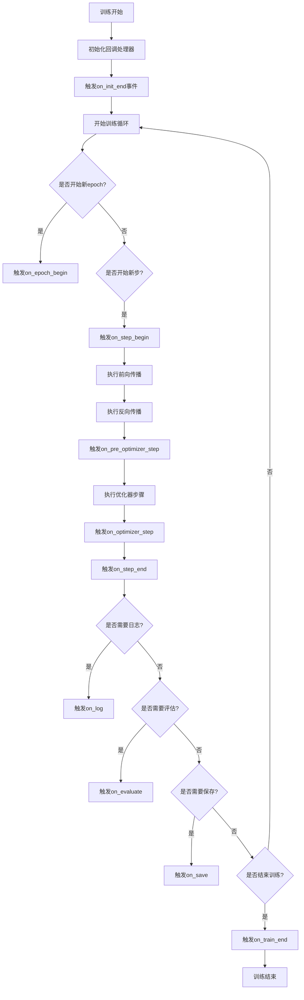
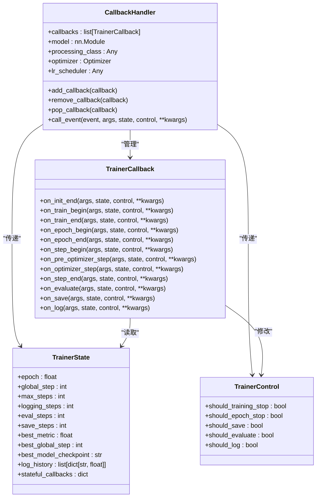
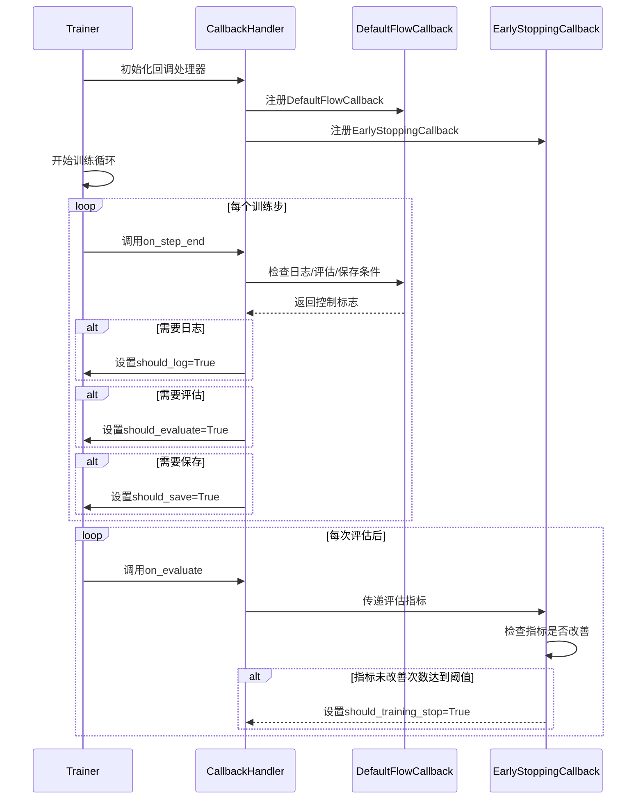
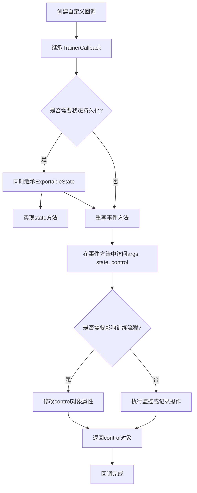
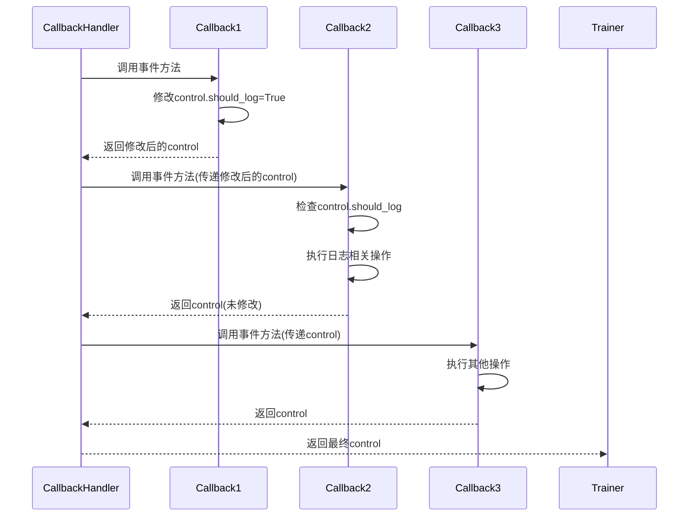
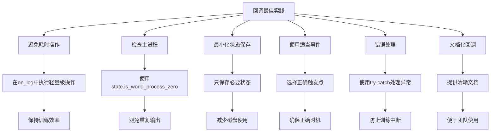

# 回调系统

<cite>
**本文档中引用的文件**   
- [trainer_callback.py](file://src/transformers/trainer_callback.py)
- [trainer.py](file://src/transformers/trainer.py)
- [test_trainer_callback.py](file://tests/trainer/test_trainer_callback.py)
</cite>

## 目录
1. [简介](#简介)
2. [回调机制工作原理](#回调机制工作原理)
3. [核心组件](#核心组件)
4. [内置回调功能](#内置回调功能)
5. [自定义回调开发](#自定义回调开发)
6. [回调执行顺序与交互](#回调执行顺序与交互)
7. [最佳实践](#最佳实践)
8. [结论](#结论)

## 简介

Hugging Face Transformers库中的Trainer回调系统提供了一个灵活的机制，用于在训练过程的各个阶段插入自定义逻辑。该系统允许开发者监控训练过程、保存检查点、调整学习率、实现早停等功能，而无需修改核心训练循环代码。回调系统通过事件驱动架构实现，支持在训练生命周期的特定触发点执行自定义操作。

**Section sources**
- [trainer_callback.py](file://src/transformers/trainer_callback.py#L1-L50)
- [trainer.py](file://src/transformers/trainer.py#L1-L100)

## 回调机制工作原理

Trainer回调系统基于事件驱动架构，通过`CallbackHandler`类管理回调的注册和执行。当训练过程到达特定阶段时，系统会触发相应的事件，按注册顺序调用所有回调函数。回调系统的核心组件包括`TrainerState`、`TrainerControl`和`TrainerCallback`。

`TrainerState`类保存训练过程中的状态信息，如当前epoch、全局步数、最佳指标等。`TrainerControl`类提供控制标志，允许回调影响训练流程，如停止训练、保存检查点或执行评估。`CallbackHandler`负责管理回调列表，并在适当的时间调用它们。

**Diagram sources**
- [trainer_callback.py](file://src/transformers/trainer_callback.py#L200-L300)
- [trainer.py](file://src/transformers/trainer.py#L3000-L3500)

## 核心组件

回调系统的核心由三个主要组件构成：`TrainerCallback`、`TrainerState`和`TrainerControl`。`TrainerCallback`是所有回调的基类，定义了在训练生命周期各个阶段可以重写的事件方法。`TrainerState`保存训练过程中的状态信息，包括当前步数、epoch数、最佳指标等。`TrainerControl`提供控制标志，允许回调影响训练流程。

`CallbackHandler`作为回调系统的中枢，负责管理回调列表并按顺序调用它们。它在初始化时检查是否包含`DefaultFlowCallback`，这是确保训练流程正常工作的关键回调。回调处理器还负责在检查点保存和恢复时处理状态化回调的状态。

**Section sources**
- [trainer_callback.py](file://src/transformers/trainer_callback.py#L268-L565)
- [trainer.py](file://src/transformers/trainer.py#L200-L600)

## 内置回调功能

Transformers库提供了多个内置回调，每个回调负责特定的功能。`DefaultFlowCallback`是核心回调，负责处理日志记录、评估和检查点保存的默认流程。`ProgressCallback`显示训练进度条，`PrinterCallback`简单地打印日志信息。`EarlyStoppingCallback`实现早停功能，当验证指标不再改善时停止训练。

这些内置回调通过`Trainer`的初始化过程自动注册。开发者可以通过`TrainingArguments`中的`disable_tqdm`参数选择使用`ProgressCallback`还是`PrinterCallback`。`EarlyStoppingCallback`需要与`load_best_model_at_end=True`和适当的评估策略配合使用，以确保在训练结束时加载最佳模型。

**Section sources**
- [trainer_callback.py](file://src/transformers/trainer_callback.py#L535-L767)
- [test_trainer_callback.py](file://tests/trainer/test_trainer_callback.py#L1-L100)

## 自定义回调开发

开发者可以通过继承`TrainerCallback`类来创建自定义回调。自定义回调需要重写一个或多个事件方法，如`on_step_end`、`on_epoch_end`或`on_evaluate`。回调可以通过修改`TrainerControl`对象的属性来影响训练流程，例如设置`control.should_save=True`来触发检查点保存。

对于需要在检查点保存和恢复时保持状态的回调，应该同时继承`ExportableState`类并实现`state`方法。这允许回调的状态在训练中断后恢复时被正确恢复。状态化回调在保存检查点时会将其状态序列化到`trainer_state.json`文件中，并在恢复训练时重新创建。

**Section sources**
- [trainer_callback.py](file://src/transformers/trainer_callback.py#L700-L767)
- [test_trainer_callback.py](file://tests/trainer/test_trainer_callback.py#L100-L200)

## 回调执行顺序与交互

回调按注册顺序执行，后注册的回调会附加到回调列表的末尾。当事件触发时，`CallbackHandler`会按顺序调用所有回调，每个回调都有机会修改`TrainerControl`对象。后续回调可以看到前面回调所做的修改，这允许回调之间进行交互。

`DefaultFlowCallback`通常作为第一个回调注册，确保基本的训练流程控制（如日志、评估、保存）被正确设置。自定义回调可以根据需要插入到回调列表的适当位置。开发者可以使用`add_callback`、`remove_callback`和`pop_callback`方法动态管理回调列表。

**Section sources**
- [trainer_callback.py](file://src/transformers/trainer_callback.py#L424-L490)
- [test_trainer_callback.py](file://tests/trainer/test_trainer_callback.py#L200-L300)

## 最佳实践

开发高效回调的最佳实践包括：避免在回调中执行耗时操作，以免影响训练性能；使用`state.is_world_process_zero`检查来确保日志和保存操作只在主进程中执行；对于状态化回调，只保存必要的状态信息以减少检查点大小。

当实现自定义学习率调度器时，建议通过修改优化器的参数组学习率而不是直接修改`lr_scheduler`，因为后者可能在分布式训练中导致不一致。对于复杂的回调逻辑，考虑将其分解为多个专门的回调，以提高代码的可维护性和复用性。

**Section sources**
- [trainer_callback.py](file://src/transformers/trainer_callback.py#L1-L767)
- [trainer.py](file://src/transformers/trainer.py#L1-L5224)

## 结论

Transformers库的回调系统提供了一个强大而灵活的机制，用于自定义和监控训练过程。通过理解回调机制的工作原理、核心组件和执行顺序，开发者可以创建高效的自定义回调来满足特定需求。内置回调提供了常用功能的基础实现，而自定义回调接口允许无限的扩展可能性。遵循最佳实践可以确保回调既有效又高效，不会对训练性能产生负面影响。