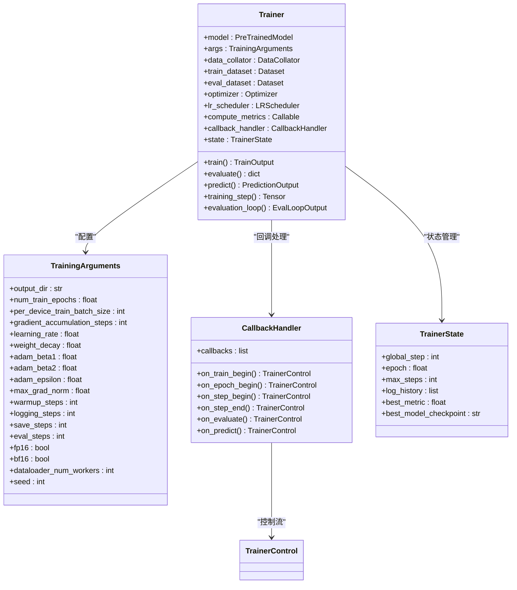
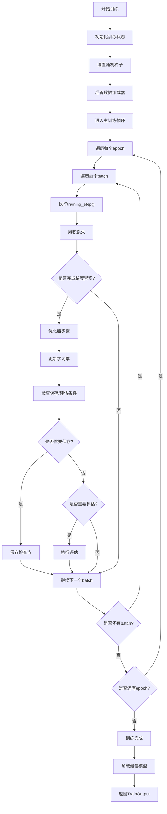
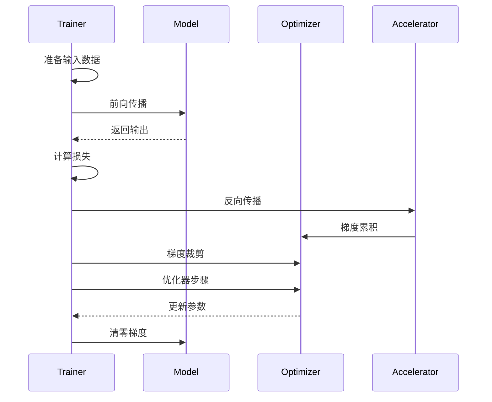
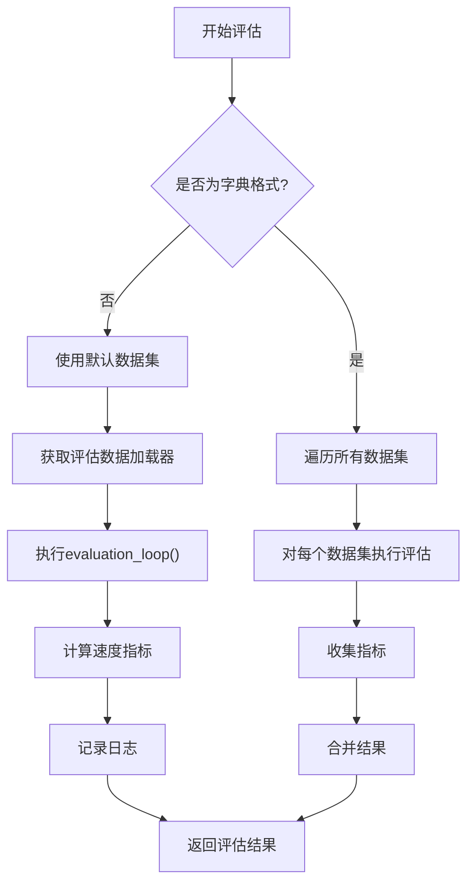
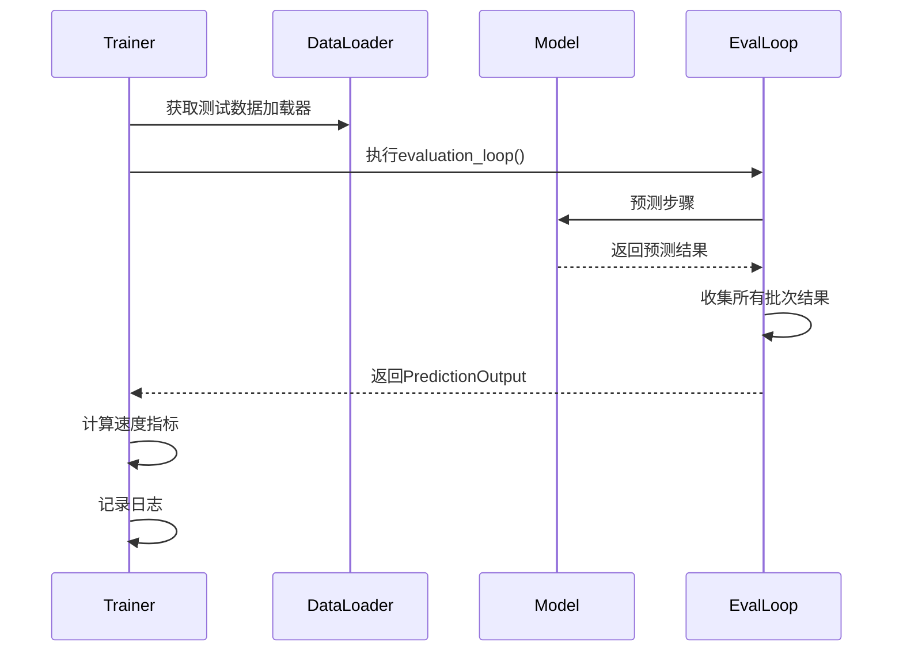
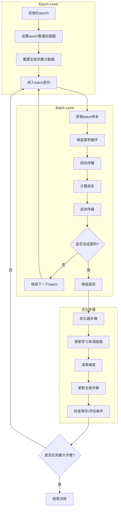
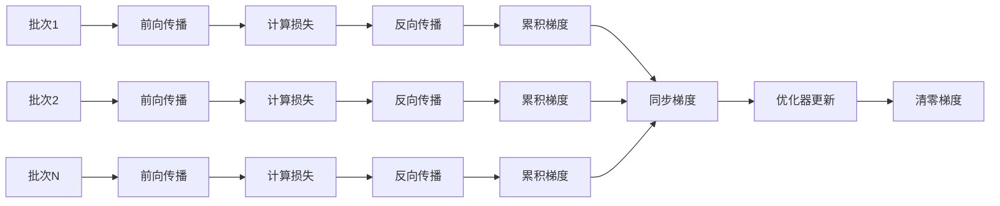
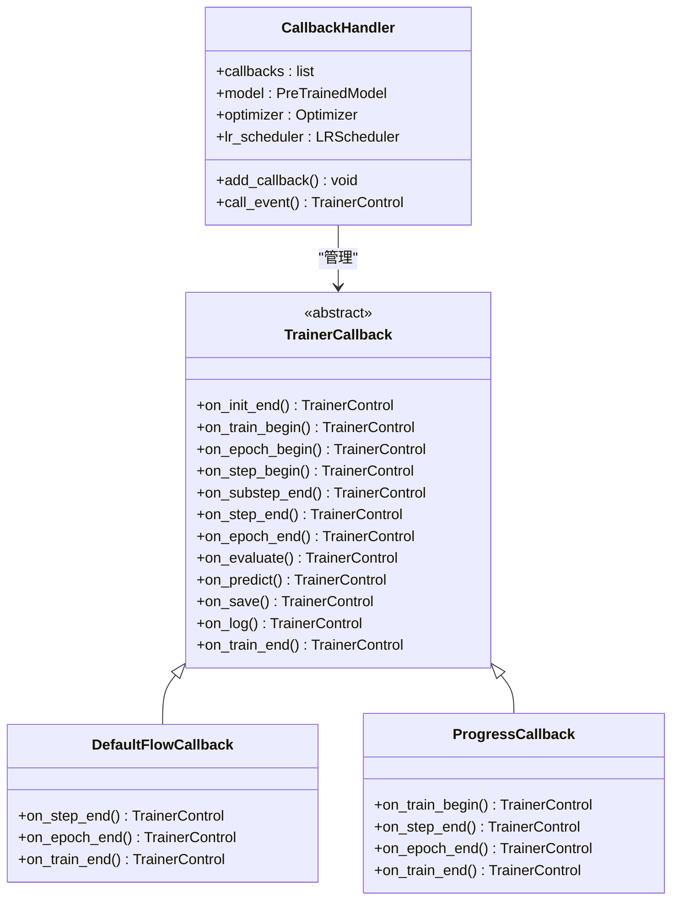
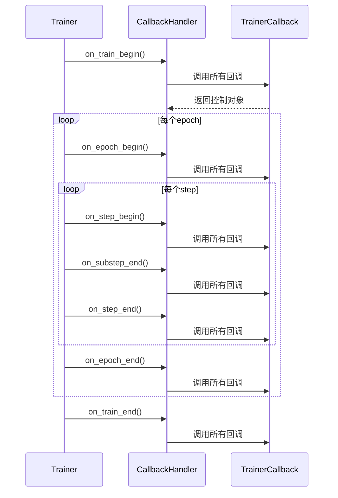

# 核心功能

<cite>
**本文档中引用的文件**
- [trainer.py](file://src/transformers/trainer.py)
- [training_args.py](file://src/transformers/training_args.py)
- [trainer_utils.py](file://src/transformers/trainer_utils.py)
- [trainer_pt_utils.py](file://src/transformers/trainer_pt_utils.py)
- [trainer_callback.py](file://src/transformers/trainer_callback.py)
</cite>

## 目录
1. [简介](#简介)
2. [Trainer类架构概览](#trainer类架构概览)
3. [核心训练方法](#核心训练方法)
4. [评估和预测方法](#评估和预测方法)
5. [训练循环详解](#训练循环详解)
6. [回调系统](#回调系统)
7. [配置和参数管理](#配置和参数管理)
8. [使用模式和最佳实践](#使用模式和最佳实践)
9. [常见问题和解决方案](#常见问题和解决方案)
10. [总结](#总结)

## 简介

Trainer API是Hugging Face Transformers库中用于简化模型训练、评估和预测的核心组件。它提供了一个高度集成的训练框架，支持多种训练策略、分布式训练、混合精度训练等先进特性。本文档将深入解析Trainer类的核心功能，包括其内部工作流程、调用关系以及实际使用方法。

## Trainer类架构概览

Trainer类采用模块化设计，主要包含以下核心组件：



**图表来源**
- [trainer.py](file://src/transformers/trainer.py#L200-L400)
- [training_args.py](file://src/transformers/training_args.py#L200-L400)
- [trainer_callback.py](file://src/transformers/trainer_callback.py#L50-L150)

**章节来源**
- [trainer.py](file://src/transformers/trainer.py#L200-L500)
- [training_args.py](file://src/transformers/training_args.py#L200-L500)

## 核心训练方法

### train() 方法

`train()`方法是Trainer的核心入口点，负责执行完整的训练过程：



**图表来源**
- [trainer.py](file://src/transformers/trainer.py#L2373-L2800)

### training_step() 方法

`training_step()`方法负责单个批次的前向传播、损失计算和反向传播：



**图表来源**
- [trainer.py](file://src/transformers/trainer.py#L3734-L3764)

**章节来源**
- [trainer.py](file://src/transformers/trainer.py#L2373-L2800)
- [trainer.py](file://src/transformers/trainer.py#L3734-L3800)

## 评估和预测方法

### evaluate() 方法

评估方法支持多种评估策略，包括单数据集评估和多数据集评估：



**图表来源**
- [trainer.py](file://src/transformers/trainer.py#L4000-L4100)

### predict() 方法

预测方法提供模型推理功能，支持带标签和不带标签的数据集：



**图表来源**
- [trainer.py](file://src/transformers/trainer.py#L4275-L4307)

**章节来源**
- [trainer.py](file://src/transformers/trainer.py#L4000-L4200)
- [trainer.py](file://src/transformers/trainer.py#L4275-L4307)

## 训练循环详解

### 主训练循环结构

训练循环采用分层设计，支持梯度累积、分布式训练和多种优化策略：



**图表来源**
- [trainer.py](file://src/transformers/trainer.py#L2400-L2600)

### 梯度累积机制

Trainer支持梯度累积以模拟大批次训练：



**图表来源**
- [trainer.py](file://src/transformers/trainer.py#L2450-L2550)

**章节来源**
- [trainer.py](file://src/transformers/trainer.py#L2400-L2600)

## 回调系统

### TrainerCallback架构

Trainer使用回调系统来扩展训练过程中的各种事件处理：



**图表来源**
- [trainer_callback.py](file://src/transformers/trainer_callback.py#L268-L350)

### 回调事件流程



**图表来源**
- [trainer_callback.py](file://src/transformers/trainer_callback.py#L492-L515)

**章节来源**
- [trainer_callback.py](file://src/transformers/trainer_callback.py#L268-L350)

## 配置和参数管理

### TrainingArguments配置

TrainingArguments提供了丰富的配置选项来控制训练行为：

| 参数类别 | 关键参数 | 默认值 | 描述 |
|---------|---------|--------|------|
| **基础训练** | `output_dir` | `"./"` | 输出目录 |
| | `num_train_epochs` | `3.0` | 训练轮数 |
| | `per_device_train_batch_size` | `8` | 每设备批次大小 |
| | `gradient_accumulation_steps` | `1` | 梯度累积步数 |
| | `learning_rate` | `5e-5` | 学习率 |
| | `weight_decay` | `0.0` | 权重衰减 |
| **优化器** | `adam_beta1` | `0.9` | Adam Beta1 |
| | `adam_beta2` | `0.999` | Adam Beta2 |
| | `adam_epsilon` | `1e-8` | Adam Epsilon |
| | `max_grad_norm` | `1.0` | 最大梯度范数 |
| **学习率调度** | `lr_scheduler_type` | `"linear"` | 调度器类型 |
| | `warmup_steps` | `0` | 预热步数 |
| **日志和保存** | `logging_steps` | `500` | 日志步数 |
| | `save_steps` | `500` | 保存步数 |
| | `eval_steps` | `500` | 评估步数 |
| **混合精度** | `fp16` | `False` | FP16训练 |
| | `bf16` | `False` | BF16训练 |
| **分布式** | `local_rank` | `-1` | 本地进程排名 |
| | `ddp_backend` | `"nccl"` | DDP后端 |

**章节来源**
- [training_args.py](file://src/transformers/training_args.py#L200-L800)

## 使用模式和最佳实践

### 基本使用模式

#### 1. 简单文本分类训练

```python
# 基本训练配置
training_args = TrainingArguments(
    output_dir="./results",
    num_train_epochs=3,
    per_device_train_batch_size=16,
    per_device_eval_batch_size=64,
    warmup_steps=500,
    weight_decay=0.01,
    logging_dir="./logs",
    logging_steps=100,
    evaluation_strategy="steps",
    eval_steps=500,
    save_steps=1000,
    load_best_model_at_end=True,
)

# 创建Trainer实例
trainer = Trainer(
    model=model,
    args=training_args,
    train_dataset=train_dataset,
    eval_dataset=eval_dataset,
    compute_metrics=compute_metrics,
)

# 开始训练
trainer.train()
```

#### 2. 微调配置

```python
# 微调特定层的配置
training_args = TrainingArguments(
    output_dir="./fine-tuned-model",
    learning_rate=2e-5,
    per_device_train_batch_size=8,
    gradient_accumulation_steps=4,
    num_train_epochs=3,
    warmup_ratio=0.1,
    weight_decay=0.01,
    fp16=True,
    dataloader_num_workers=4,
    save_total_limit=2,
    load_best_model_at_end=True,
    metric_for_best_model="eval_accuracy",
    greater_is_better=True,
)
```

#### 3. 多GPU训练配置

```python
# 分布式训练配置
training_args = TrainingArguments(
    output_dir="./distributed-results",
    per_device_train_batch_size=16,
    gradient_accumulation_steps=1,
    num_train_epochs=3,
    learning_rate=5e-5,
    warmup_steps=1000,
    weight_decay=0.01,
    dataloader_num_workers=4,
    save_steps=1000,
    eval_steps=1000,
    evaluation_strategy="steps",
    fp16=True,
    dataloader_pin_memory=True,
    dataloader_prefetch_factor=2,
)
```

### 高级配置模式

#### 1. 自定义损失函数

```python
def custom_loss_function(model_outputs, labels, num_items_in_batch):
    # 实现自定义损失计算逻辑
    logits = model_outputs["logits"]
    loss_fn = torch.nn.CrossEntropyLoss()
    loss = loss_fn(logits.view(-1, logits.size(-1)), labels.view(-1))
    return loss

trainer = Trainer(
    model=model,
    args=training_args,
    train_dataset=train_dataset,
    eval_dataset=eval_dataset,
    compute_loss_func=custom_loss_function,
)
```

#### 2. 动态调整学习率

```python
class DynamicLearningRateCallback(TrainerCallback):
    def on_step_end(self, args, state, control, **kwargs):
        # 根据训练进度动态调整学习率
        current_progress = state.epoch / args.num_train_epochs
        if current_progress > 0.5:
            new_lr = args.learning_rate * 0.1
            for param_group in trainer.optimizer.param_groups:
                param_group['lr'] = new_lr
```

#### 3. 自定义评估指标

```python
def compute_custom_metrics(eval_pred):
    predictions, labels = eval_pred
    predictions = np.argmax(predictions, axis=1)
    
    # 计算多个指标
    accuracy = accuracy_score(labels, predictions)
    f1 = f1_score(labels, predictions, average='weighted')
    precision = precision_score(labels, predictions, average='weighted')
    
    return {
        "accuracy": accuracy,
        "f1_score": f1,
        "precision": precision,
    }
```

## 常见问题和解决方案

### 内存优化问题

#### 1. CUDA内存不足

**问题描述**: 训练过程中出现CUDA out of memory错误

**解决方案**:
```python
# 减少批次大小
training_args = TrainingArguments(
    per_device_train_batch_size=4,  # 从8减少到4
    gradient_accumulation_steps=8,   # 从1增加到8
)

# 启用梯度检查点
training_args.gradient_checkpointing = True

# 使用混合精度训练
training_args.fp16 = True
```

#### 2. CPU内存溢出

**问题描述**: 数据加载时CPU内存不足

**解决方案**:
```python
# 减少数据加载器的工作进程数
training_args.dataloader_num_workers = 0

# 启用数据预取限制
training_args.dataloader_prefetch_factor = 2

# 使用可迭代数据集
from torch.utils.data import IterableDataset
```

### 性能优化问题

#### 1. 训练速度慢

**问题描述**: 训练过程运行缓慢

**解决方案**:
```python
# 启用混合精度训练
training_args.fp16 = True

# 优化数据加载
training_args.dataloader_pin_memory = True
training_args.dataloader_prefetch_factor = 2

# 使用更快的编译器
training_args.torch_compile = True

# 优化数据预处理
# 在数据集中实现更高效的数据处理逻辑
```

#### 2. 评估速度慢

**问题描述**: 评估过程耗时过长

**解决方案**:
```python
# 减少评估频率
training_args.eval_steps = 1000  # 从500增加到1000

# 使用批量评估指标
training_args.batch_eval_metrics = True

# 限制评估数据集大小
eval_dataset = eval_dataset.select(range(1000))  # 只使用前1000个样本
```

### 训练稳定性问题

#### 1. 损失震荡或发散

**问题描述**: 训练过程中损失不稳定

**解决方案**:
```python
# 调整学习率
training_args.learning_rate = 1e-5  # 从5e-5降低

# 添加梯度裁剪
training_args.max_grad_norm = 1.0

# 增加预热步数
training_args.warmup_steps = 1000

# 使用更稳定的优化器
training_args.optim = "adamw_torch_fused"
```

#### 2. 过拟合问题

**问题描述**: 模型在验证集上表现不佳

**解决方案**:
```python
# 添加权重衰减
training_args.weight_decay = 0.01

# 使用早停
from transformers import EarlyStoppingCallback
trainer.add_callback(EarlyStoppingCallback(early_stopping_patience=3))

# 增加dropout
# 在模型定义中添加dropout层

# 使用数据增强
# 在数据预处理中添加数据增强操作
```

### 分布式训练问题

#### 1. 进程同步问题

**问题描述**: 多GPU训练时出现同步错误

**解决方案**:
```python
# 正确设置分布式环境
export CUDA_VISIBLE_DEVICES=0,1,2,3
export MASTER_PORT=29500

# 使用正确的分布式后端
training_args.ddp_backend = "nccl"

# 确保所有进程都有相同的随机种子
training_args.seed = 42
```

#### 2. 混合精度训练问题

**问题描述**: FP16训练时数值不稳定

**解决方案**:
```python
# 启用损失缩放
training_args.fp16 = True
training_args.fp16_opt_level = "O1"

# 使用更稳定的混合精度库
training_args.fp16 = True
training_args.tf32 = True  # 对于支持的GPU

# 检查模型兼容性
# 确保模型支持混合精度训练
```

**章节来源**
- [trainer.py](file://src/transformers/trainer.py#L2400-L2800)
- [training_args.py](file://src/transformers/training_args.py#L200-L800)

## 总结

Trainer API作为Hugging Face Transformers的核心组件，提供了完整而灵活的训练框架。通过深入理解其内部机制，开发者可以：

1. **掌握核心功能**: 理解训练、评估和预测方法的工作原理
2. **优化训练过程**: 通过合理的配置和回调系统提升训练效率
3. **解决常见问题**: 应用最佳实践解决内存、性能和稳定性问题
4. **扩展功能**: 通过自定义回调和损失函数实现特殊需求

Trainer的设计哲学是"开箱即用"的同时保持高度可定制性，这使得它能够适应从简单实验到大规模生产部署的各种场景。随着深度学习技术的不断发展，Trainer也在持续演进，为研究者和工程师提供更好的工具支持。