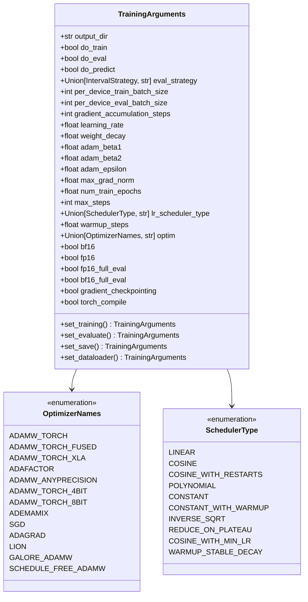
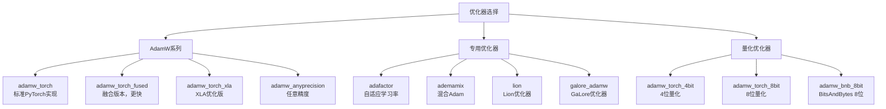
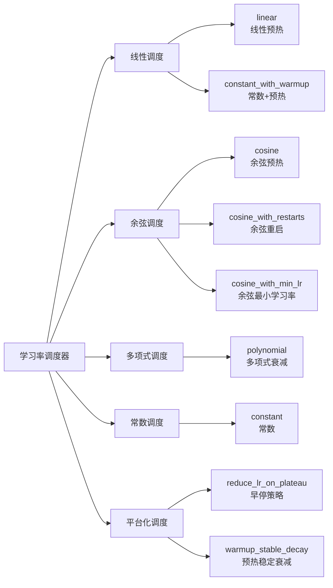

# 训练参数

<cite>
**本文档中引用的文件**
- [training_args.py](file://src/transformers/training_args.py)
- [trainer.py](file://src/transformers/trainer.py)
- [optimization.py](file://src/transformers/optimization.py)
- [trainer_utils.py](file://src/transformers/trainer_utils.py)
- [run_clm.py](file://examples/pytorch/language-modeling/run_clm.py)
- [test_trainer.py](file://tests/trainer/test_trainer.py)
</cite>

## 目录
1. [简介](#简介)
2. [TrainingArguments类概述](#trainingarguments类概述)
3. [核心训练参数](#核心训练参数)
4. [优化器配置](#优化器配置)
5. [学习率调度器](#学习率调度器)
6. [评估与保存策略](#评估与保存策略)
7. [分布式训练配置](#分布式训练配置)
8. [混合精度训练](#混合精度训练)
9. [数据加载器配置](#数据加载器配置)
10. [实用方法](#实用方法)
11. [配置示例](#配置示例)
12. [参数调优指南](#参数调优指南)
13. [常见问题与解决方案](#常见问题与解决方案)

## 简介

TrainingArguments是Hugging Face Transformers库中用于配置训练过程的核心类。它包含了训练过程中所有重要的超参数设置，从基础的学习率到复杂的分布式训练配置。本文档将全面介绍TrainingArguments类的所有配置选项，帮助用户理解每个参数的作用、合理取值范围以及对训练过程的影响。

## TrainingArguments类概述

TrainingArguments是一个数据类，继承自Python的dataclass模块。它通过字段注解定义了训练过程中的各种配置参数，每个参数都有默认值、类型约束和详细的文档说明。



**图表来源**
- [training_args.py](file://src/transformers/training_args.py#L198-L597)
- [trainer_utils.py](file://src/transformers/trainer_utils.py#L390-L418)

**章节来源**
- [training_args.py](file://src/transformers/training_args.py#L198-L597)

## 核心训练参数

### 基础训练配置

#### 输出目录与训练控制

| 参数 | 类型 | 默认值 | 描述 |
|------|------|--------|------|
| `output_dir` | `str` | `"trainer_output"` | 模型预测和检查点的输出目录 |
| `do_train` | `bool` | `False` | 是否运行训练 |
| `do_eval` | `bool` | 自动设置 | 是否在验证集上运行评估 |
| `do_predict` | `bool` | `False` | 是否在测试集上运行预测 |

#### 批次大小配置

| 参数 | 类型 | 默认值 | 描述 |
|------|------|--------|------|
| `per_device_train_batch_size` | `int` | `8` | 每个设备的训练批次大小 |
| `per_device_eval_batch_size` | `int` | `8` | 每个设备的评估批次大小 |
| `gradient_accumulation_steps` | `int` | `1` | 梯度累积步数 |

**重要说明：全局批次大小计算公式**
```
全局批次大小 = per_device_train_batch_size × 设备数量
```

#### 学习率与权重衰减

| 参数 | 类型 | 默认值 | 描述 |
|------|------|--------|------|
| `learning_rate` | `float` | `5e-5` | 初始学习率 |
| `weight_decay` | `float` | `0` | 权重衰减系数 |
| `adam_beta1` | `float` | `0.9` | Adam优化器的beta1参数 |
| `adam_beta2` | `float` | `0.999` | Adam优化器的beta2参数 |
| `adam_epsilon` | `float` | `1e-8` | Adam优化器的epsilon参数 |
| `max_grad_norm` | `float` | `1.0` | 最大梯度范数（梯度裁剪） |

### 训练循环配置

| 参数 | 类型 | 默认值 | 描述 |
|------|------|--------|------|
| `num_train_epochs` | `float` | `3.0` | 总训练轮数 |
| `max_steps` | `int` | `-1` | 最大训练步数（覆盖epochs） |
| `warmup_steps` | `float` | `0` | 预热步数（可以是比例值） |

**章节来源**
- [training_args.py](file://src/transformers/training_args.py#L250-L350)

## 优化器配置

### 支持的优化器类型

TrainingArguments支持多种优化器，每种都有其特定的适用场景：



**图表来源**
- [training_args.py](file://src/transformers/training_args.py#L140-L200)

### 优化器参数配置

| 参数 | 类型 | 默认值 | 描述 |
|------|------|--------|------|
| `optim` | `Union[OptimizerNames, str]` | `"adamw_torch"` | 使用的优化器类型 |
| `optim_args` | `Optional[str]` | `None` | 传递给优化器的可选参数 |
| `optim_target_modules` | `Union[None, str, list[str]]` | `None` | 优化的目标模块（GaLore算法专用） |

**推荐优化器选择：**

1. **标准训练任务**：`adamw_torch` 或 `adamw_torch_fused`
2. **内存受限环境**：`adamw_torch_8bit` 或 `adamw_bnb_8bit`
3. **大模型训练**：`adafactor`
4. **参数高效微调**：`galore_adamw`

**章节来源**
- [training_args.py](file://src/transformers/training_args.py#L140-L200)
- [optimization.py](file://src/transformers/optimization.py#L663-L695)

## 学习率调度器

### 调度器类型

TrainingArguments支持多种学习率调度策略：



**图表来源**
- [trainer_utils.py](file://src/transformers/trainer_utils.py#L390-L418)

### 调度器参数配置

| 参数 | 类型 | 默认值 | 描述 |
|------|------|--------|------|
| `lr_scheduler_type` | `Union[SchedulerType, str]` | `"linear"` | 调度器类型 |
| `lr_scheduler_kwargs` | `Optional[Union[dict, str]]` | `None` | 调度器的额外参数 |
| `warmup_steps` | `float` | `0` | 预热步数 |

### 常用调度器配置示例

1. **线性预热**（默认）
```python
args = TrainingArguments(...)
args.lr_scheduler_type = "linear"
args.warmup_steps = 1000
```

2. **余弦预热**
```python
args = TrainingArguments(...)
args.lr_scheduler_type = "cosine"
args.warmup_steps = 500
```

3. **常数+预热**
```python
args = TrainingArguments(...)
args.lr_scheduler_type = "constant_with_warmup"
args.warmup_steps = 1000
```

4. **多项式衰减**
```python
args = TrainingArguments(...)
args.lr_scheduler_type = "polynomial"
args.lr_scheduler_kwargs = {"power": 2.0, "lr_end": 1e-7}
```

**章节来源**
- [trainer_utils.py](file://src/transformers/trainer_utils.py#L390-L418)
- [optimization.py](file://src/transformers/optimization.py#L578-L601)

## 评估与保存策略

### 评估策略配置

| 参数 | 类型 | 默认值 | 描述 |
|------|------|--------|------|
| `eval_strategy` | `Union[IntervalStrategy, str]` | `"no"` | 评估策略 |
| `eval_steps` | `Optional[float]` | `None` | 评估间隔步数 |
| `eval_accumulation_steps` | `Optional[int]` | `None` | 评估累积步数 |
| `eval_delay` | `float` | `0` | 首次评估延迟 |
| `prediction_loss_only` | `bool` | `False` | 仅返回损失值 |

### 日志策略配置

| 参数 | 类型 | 默认值 | 描述 |
|------|------|--------|------|
| `logging_strategy` | `Union[IntervalStrategy, str]` | `"steps"` | 日志策略 |
| `logging_steps` | `float` | `500` | 日志间隔步数 |
| `logging_first_step` | `bool` | `False` | 是否记录第一个步骤 |
| `logging_nan_inf_filter` | `bool` | `True` | 过滤NaN和Inf损失 |

### 保存策略配置

| 参数 | 类型 | 默认值 | 描述 |
|------|------|--------|------|
| `save_strategy` | `Union[SaveStrategy, str]` | `"steps"` | 保存策略 |
| `save_steps` | `float` | `500` | 保存间隔步数 |
| `save_total_limit` | `Optional[int]` | `None` | 最大保存检查点数量 |
| `save_safetensors` | `bool` | `True` | 使用安全张量格式 |
| `save_only_model` | `bool` | `False` | 仅保存模型权重 |

### 加载最佳模型配置

| 参数 | 类型 | 默认值 | 描述 |
|------|------|--------|------|
| `load_best_model_at_end` | `bool` | `False` | 训练结束时加载最佳模型 |
| `metric_for_best_model` | `Optional[str]` | `None` | 用于比较模型的最佳指标 |
| `greater_is_better` | `Optional[bool]` | `None` | 更好的指标是否更大 |

**章节来源**
- [training_args.py](file://src/transformers/training_args.py#L350-L450)

## 分布式训练配置

### 多GPU训练

| 参数 | 类型 | 默认值 | 描述 |
|------|------|--------|------|
| `ddp_backend` | `Optional[str]` | `None` | 分布式后端（nccl, mpi, gloo等） |
| `ddp_find_unused_parameters` | `Optional[bool]` | `None` | 查找未使用参数 |
| `ddp_bucket_cap_mb` | `Optional[int]` | `None` | DDP桶容量（MB） |
| `ddp_broadcast_buffers` | `Optional[bool]` | `None` | 广播缓冲区 |
| `ddp_timeout` | `int` | `1800` | DDP超时时间（秒） |

### FSDP配置

| 参数 | 类型 | 默认值 | 描述 |
|------|------|--------|------|
| `fsdp` | `Optional[Union[list[FSDPOption], str]]` | `None` | FSDP配置选项 |
| `fsdp_config` | `Optional[Union[dict[str, Any], str]]` | `None` | FSDP配置字典或文件路径 |

### DeepSpeed配置

| 参数 | 类型 | 默认值 | 描述 |
|------|------|--------|------|
| `deepspeed` | `Optional[Union[dict, str]]` | `None` | DeepSpeed配置 |

### Accelerate配置

| 参数 | 类型 | 默认值 | 描述 |
|------|------|--------|--------|
| `accelerator_config` | `Optional[Union[dict, str]]` | `None` | Accelerate配置 |
| `parallelism_config` | `Optional[ParallelismConfig]` | `None` | 并行配置 |

**章节来源**
- [training_args.py](file://src/transformers/training_args.py#L450-L550)

## 混合精度训练

### 精度配置选项

| 参数 | 类型 | 默认值 | 描述 |
|------|------|--------|------|
| `bf16` | `bool` | `False` | 使用bfloat16混合精度 |
| `fp16` | `bool` | `False` | 使用float16混合精度 |
| `bf16_full_eval` | `bool` | `False` | 全bf16评估 |
| `fp16_full_eval` | `bool` | `False` | 全float16评估 |
| `tf32` | `Optional[bool]` | `None` | 启用TF32模式 |

### 混合精度注意事项

1. **互斥性**：`bf16` 和 `fp16` 不能同时为`True`
2. **硬件要求**：
   - `bf16`：需要Ampere架构GPU或Intel XPU
   - `fp16`：通用支持
3. **评估精度**：评估时的精度设置会影响性能但可能影响指标准确性

**章节来源**
- [training_args.py](file://src/transformers/training_args.py#L550-L600)

## 数据加载器配置

### 批次处理配置

| 参数 | 类型 | 默认值 | 描述 |
|------|------|--------|------|
| `dataloader_drop_last` | `bool` | `False` | 是否丢弃最后一个不完整批次 |
| `dataloader_num_workers` | `int` | `0` | 数据加载器工作进程数 |
| `dataloader_pin_memory` | `bool` | `True` | 是否固定内存 |
| `dataloader_persistent_workers` | `bool` | `False` | 是否保持工作进程 |
| `dataloader_prefetch_factor` | `Optional[int]` | `None` | 预取因子 |

### 数据采样配置

| 参数 | 类型 | 默认值 | 描述 |
|------|------|--------|------|
| `group_by_length` | `bool` | `False` | 是否按长度分组样本 |
| `length_column_name` | `str` | `"length"` | 预计算长度的列名 |
| `auto_find_batch_size` | `bool` | `False` | 自动查找合适批次大小 |
| `ignore_data_skip` | `bool` | `False` | 忽略数据跳过 |

### 内存优化配置

| 参数 | 类型 | 默认值 | 描述 |
|------|------|--------|------|
| `skip_memory_metrics` | `bool` | `True` | 跳过内存指标收集 |
| `torch_empty_cache_steps` | `Optional[int]` | `None` | 清空缓存步数 |

**章节来源**
- [training_args.py](file://src/transformers/training_args.py#L600-L700)

## 实用方法

TrainingArguments提供了多个实用方法来简化参数设置：

### set_training方法

用于快速设置训练相关参数：

```python
def set_training(
    self,
    learning_rate: float = 5e-5,
    batch_size: int = 8,
    weight_decay: float = 0,
    num_epochs: float = 3,
    max_steps: int = -1,
    gradient_accumulation_steps: int = 1,
    seed: int = 42,
    gradient_checkpointing: bool = False,
):
```

### set_evaluate方法

用于设置评估相关参数：

```python
def set_evaluate(
    self,
    strategy: Union[str, IntervalStrategy] = "no",
    steps: int = 500,
    batch_size: int = 8,
    accumulation_steps: Optional[int] = None,
    delay: Optional[float] = None,
    loss_only: bool = False,
):
```

### set_save方法

用于设置保存相关参数：

```python
def set_save(
    self,
    strategy: Union[str, IntervalStrategy] = "steps",
    steps: int = 500,
    total_limit: Optional[int] = None,
    on_each_node: bool = False,
):
```

### set_dataloader方法

用于设置数据加载器参数：

```python
def set_dataloader(
    self,
    train_batch_size: int = 8,
    eval_batch_size: int = 8,
    drop_last: bool = False,
    num_workers: int = 0,
    pin_memory: bool = True,
    persistent_workers: bool = False,
    prefetch_factor: Optional[int] = None,
    auto_find_batch_size: bool = False,
    ignore_data_skip: bool = False,
    sampler_seed: Optional[int] = None,
):
```

**章节来源**
- [training_args.py](file://src/transformers/training_args.py#L2107-L2651)

## 配置示例

### 基础文本分类配置

```python
from transformers import TrainingArguments

# 基础配置
args = TrainingArguments(
    output_dir="./results",
    num_train_epochs=3,
    per_device_train_batch_size=16,
    per_device_eval_batch_size=64,
    learning_rate=2e-5,
    weight_decay=0.01,
    warmup_steps=500,
    logging_dir="./logs",
    logging_steps=100,
    evaluation_strategy="steps",
    eval_steps=500,
    save_strategy="steps",
    save_steps=500,
    load_best_model_at_end=True,
    metric_for_best_model="accuracy",
    greater_is_better=True,
    fp16=True
)
```

### 大模型训练配置

```python
# 大模型训练配置
args = TrainingArguments(
    output_dir="./large_model_results",
    num_train_epochs=1,
    per_device_train_batch_size=4,
    gradient_accumulation_steps=8,
    learning_rate=1e-4,
    weight_decay=0.1,
    warmup_steps=1000,
    lr_scheduler_type="cosine",
    logging_steps=10,
    save_steps=1000,
    eval_steps=1000,
    gradient_checkpointing=True,
    bf16=True,
    dataloader_num_workers=4,
    remove_unused_columns=False,
    group_by_length=True
)
```

### 分布式训练配置

```python
# 分布式训练配置
args = TrainingArguments(
    output_dir="./distributed_results",
    num_train_epochs=3,
    per_device_train_batch_size=8,
    gradient_accumulation_steps=2,
    learning_rate=5e-5,
    warmup_steps=1000,
    logging_steps=50,
    save_steps=1000,
    evaluation_strategy="steps",
    eval_steps=1000,
    ddp_backend="nccl",
    ddp_timeout=1800,
    dataloader_num_workers=2,
    dataloader_pin_memory=True
)
```

### 混合精度配置

```python
# 混合精度配置
args = TrainingArguments(
    output_dir="./mixed_precision_results",
    num_train_epochs=3,
    per_device_train_batch_size=16,
    learning_rate=2e-5,
    fp16=True,  # 使用FP16
    dataloader_pin_memory=True,
    dataloader_num_workers=4,
    gradient_checkpointing=True
)
```

## 参数调优指南

### 学习率调优

#### 学习率选择原则

1. **小批次训练**：学习率应适当降低
2. **大批次训练**：可以使用更大的学习率
3. **预训练模型**：通常使用较小的学习率
4. **微调任务**：学习率通常比预训练更小

#### 学习率搜索策略

```python
# 学习率网格搜索示例
learning_rates = [1e-5, 2e-5, 5e-5, 1e-4, 2e-4]
for lr in learning_rates:
    args = TrainingArguments(
        learning_rate=lr,
        # 其他参数...
    )
    # 运行训练并记录结果
```

### 批次大小调优

#### 批次大小考虑因素

1. **内存限制**：确保批次大小不超过GPU内存
2. **收敛质量**：大批次可能影响最终性能
3. **梯度累积**：当批次太大时使用梯度累积

#### 动态批次大小调整

```python
# 自动查找合适批次大小
args = TrainingArguments(
    auto_find_batch_size=True,
    # 其他参数...
)
```

### 正则化参数调优

#### 权重衰减（Weight Decay）

| 任务类型 | 推荐范围 | 说明 |
|----------|----------|------|
| 文本分类 | 0.01-0.1 | 中等正则化 |
| 序列标注 | 0.001-0.01 | 较弱正则化 |
| 语言建模 | 0.01-0.1 | 需要正则化 |
| 对话系统 | 0.001-0.005 | 弱正则化 |

#### 预热策略

```python
# 不同预热策略的效果
args_linear = TrainingArguments(
    warmup_steps=1000,
    lr_scheduler_type="linear"
)

args_cosine = TrainingArguments(
    warmup_steps=500,
    lr_scheduler_type="cosine"
)

args_constant = TrainingArguments(
    warmup_steps=1000,
    lr_scheduler_type="constant_with_warmup"
)
```

### 调度器选择指南

#### 不同任务的调度器推荐

1. **短训练任务**（< 1000步）：`constant` 或 `constant_with_warmup`
2. **中等训练任务**（1000-10000步）：`linear` 或 `cosine`
3. **长训练任务**（> 10000步）：`cosine_with_restarts` 或 `polynomial`
4. **需要早停**：`reduce_lr_on_plateau`

## 常见问题与解决方案

### 内存不足问题

#### 问题症状
- CUDA out of memory错误
- 训练过程中断

#### 解决方案

1. **减少批次大小**
```python
args = TrainingArguments(
    per_device_train_batch_size=4,  # 减少批次大小
    gradient_accumulation_steps=8,   # 增加梯度累积步数
)
```

2. **启用梯度检查点**
```python
args = TrainingArguments(
    gradient_checkpointing=True,      # 启用梯度检查点
    per_device_train_batch_size=8,
)
```

3. **使用混合精度**
```python
args = TrainingArguments(
    fp16=True,                       # 使用FP16
    # 或者
    bf16=True,                       # 使用BF16
)
```

4. **自动查找批次大小**
```python
args = TrainingArguments(
    auto_find_batch_size=True,        # 自动查找合适批次大小
)
```

### 训练速度优化

#### 性能优化策略

1. **数据加载优化**
```python
args = TrainingArguments(
    dataloader_num_workers=4,         # 增加数据加载器工作进程
    dataloader_pin_memory=True,       # 固定内存
    dataloader_prefetch_factor=2,     # 预取因子
    dataloader_persistent_workers=True, # 保持工作进程
)
```

2. **编译优化**
```python
args = TrainingArguments(
    torch_compile=True,               # 启用torch.compile
    torch_compile_backend="inductor", # 使用inductor后端
)
```

3. **Liger内核优化**
```python
args = TrainingArguments(
    use_liger_kernel=True,            # 启用Liger内核
    liger_kernel_config={"rope": True, "swiglu": True}, # 配置内核
)
```

### 数值稳定性问题

#### 问题症状
- 损失变为NaN或Inf
- 梯度爆炸

#### 解决方案

1. **调整学习率**
```python
args = TrainingArguments(
    learning_rate=1e-4,               # 使用较小的学习率
    max_grad_norm=1.0,                # 设置梯度裁剪
)
```

2. **启用NaN过滤**
```python
args = TrainingArguments(
    logging_nan_inf_filter=True,      # 过滤NaN和Inf损失
)
```

3. **调试模式**
```python
args = TrainingArguments(
    debug="underflow_overflow",       # 启用溢出检测
)
```

### 分布式训练问题

#### 常见问题及解决方案

1. **DDP超时问题**
```python
args = TrainingArguments(
    ddp_timeout=3600,                 # 增加超时时间
)
```

2. **网络连接问题**
```python
args = TrainingArguments(
    ddp_backend="nccl",               # 使用NCCL后端
    ddp_find_unused_parameters=False, # 查找未使用参数
)
```

3. **同步问题**
```python
args = TrainingArguments(
    ddp_broadcast_buffers=True,       # 广播缓冲区
    ddp_bucket_cap_mb=25,            # 设置桶容量
)
```

**章节来源**
- [trainer.py](file://src/transformers/trainer.py#L400-L600)

## 结论

TrainingArguments类提供了丰富的配置选项来满足不同训练需求。通过合理配置这些参数，可以显著提升训练效率和模型性能。在实际使用中，建议：

1. **从基础配置开始**，逐步调整参数
2. **监控训练过程**，及时发现问题
3. **根据硬件条件**选择合适的配置
4. **参考社区经验**，避免常见陷阱

掌握这些训练参数的配置技巧，将有助于您更好地利用Hugging Face Transformers进行模型训练。