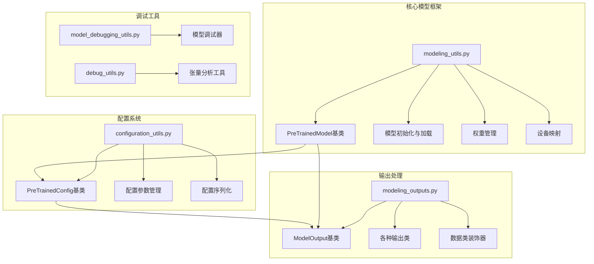
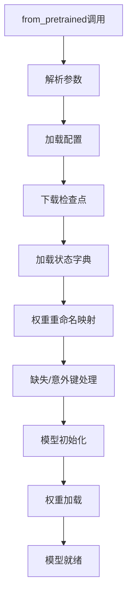
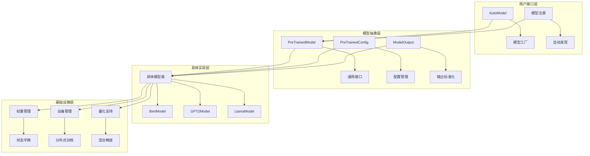
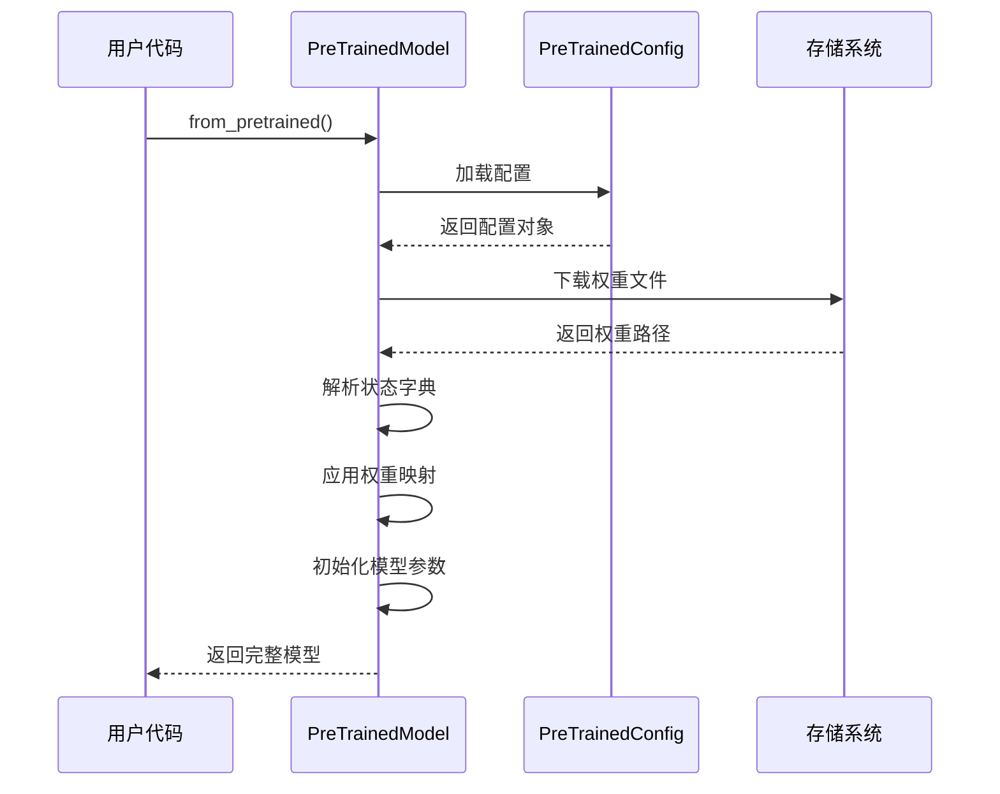
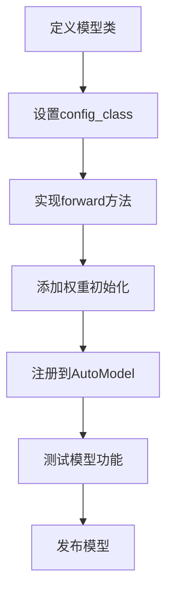
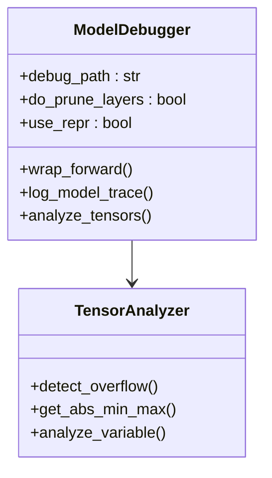
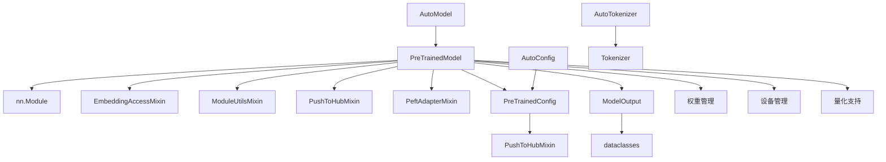

# 模型API

<cite>
**本文档中引用的文件**
- [modeling_utils.py](file://src/transformers/modeling_utils.py)
- [configuration_utils.py](file://src/transformers/configuration_utils.py)
- [modeling_outputs.py](file://src/transformers/modeling_outputs.py)
- [model_debugging_utils.py](file://src/transformers/model_debugging_utils.py)
- [debug_utils.py](file://src/transformers/debug_utils.py)
- [custom_modeling.py](file://tests/utils/test_module/custom_modeling.py)
</cite>

## 目录
1. [简介](#简介)
2. [项目结构](#项目结构)
3. [核心组件](#核心组件)
4. [架构概览](#架构概览)
5. [详细组件分析](#详细组件分析)
6. [依赖关系分析](#依赖关系分析)
7. [性能考虑](#性能考虑)
8. [故障排除指南](#故障排除指南)
9. [结论](#结论)

## 简介

Transformers库提供了完整的模型API框架，基于`PreTrainedModel`基类构建，支持多种深度学习模型的统一接口。该框架包含模型配置管理、权重加载与保存、模型输出处理、自定义模型扩展等功能模块，为开发者提供了灵活且强大的模型开发环境。

## 项目结构

Transformers模型API的核心文件组织结构如下：



**图表来源**
- [modeling_utils.py](file://src/transformers/modeling_utils.py#L1643-L1700)
- [configuration_utils.py](file://src/transformers/configuration_utils.py#L60-L120)
- [modeling_outputs.py](file://src/transformers/modeling_outputs.py#L20-L80)

## 核心组件

### ModelingUtils基类

`PreTrainedModel`是所有预训练模型的基础类，提供了统一的模型接口和功能：

#### 主要特性
- **配置管理**：通过`config_class`属性指定配置类
- **权重加载**：支持从预训练模型加载权重
- **设备管理**：支持多GPU和分布式训练
- **量化支持**：集成各种量化技术
- **注意力机制**：支持多种注意力实现

#### 关键方法

##### from_pretrained方法


**图表来源**
- [modeling_utils.py](file://src/transformers/modeling_utils.py#L4080-L4200)

##### save_pretrained方法
负责保存模型的配置和权重到指定目录。

##### forward方法
模型的前向传播入口点，子类需要实现具体的前向计算逻辑。

**章节来源**
- [modeling_utils.py](file://src/transformers/modeling_utils.py#L1643-L2000)

### Configuration类设计

`PreTrainedConfig`提供了模型配置的统一管理接口：

#### 配置参数继承机制
- **基础配置**：通过`base_config_key`支持复合配置
- **属性映射**：`attribute_map`提供属性别名支持
- **递归设置**：配置变更会自动应用到子配置

#### 配置参数覆盖机制
- **优先级顺序**：子类属性 > 注解类型 > 全局类属性 > 全局注解
- **动态验证**：运行时参数验证和类型检查
- **向后兼容**：支持旧版本配置格式

**章节来源**
- [configuration_utils.py](file://src/transformers/configuration_utils.py#L60-L400)

### ModelOutput设计模式

`ModelOutput`提供了标准化的模型输出接口：

#### 数据类装饰器
使用`@dataclass`装饰器确保输出的一致性和可访问性。

#### 输出类层次结构
- **BaseModelOutput**：基础模型输出
- **CausalLMOutput**：因果语言模型输出
- **Seq2SeqModelOutput**：序列到序列模型输出
- **各种特定任务输出类**：针对不同任务优化的输出格式

**章节来源**
- [modeling_outputs.py](file://src/transformers/modeling_outputs.py#L20-L800)

## 架构概览

Transformers模型API采用分层架构设计，各层职责明确：



**图表来源**
- [modeling_utils.py](file://src/transformers/modeling_utils.py#L1643-L1700)
- [configuration_utils.py](file://src/transformers/configuration_utils.py#L60-L120)

## 详细组件分析

### 模型权重管理系统

#### 权重加载流程


**图表来源**
- [modeling_utils.py](file://src/transformers/modeling_utils.py#L4080-L4300)

#### 状态字典处理
- **键重命名**：处理不同版本间的参数名称变化
- **形状匹配**：处理参数维度不匹配的情况
- **缺失键处理**：自动初始化缺失的参数
- **意外键过滤**：忽略不需要的参数

#### 模型共享机制
- **权重绑定**：通过`_tied_weights_keys`实现参数共享
- **内存优化**：利用Python的引用机制减少内存占用
- **分布式同步**：在多GPU环境中同步共享参数

**章节来源**
- [modeling_utils.py](file://src/transformers/modeling_utils.py#L4500-L5000)

### 自定义模型架构指南

#### 创建自定义模型的基本步骤

1. **继承基类**
```python
class CustomModel(PreTrainedModel):
    config_class = CustomConfig
    base_model_prefix = "custom"
```

2. **实现前向传播**
```python
def forward(self, input_ids, attention_mask=None, **kwargs):
    # 实现具体的前向计算逻辑
    return outputs
```

3. **权重初始化**
```python
def _init_weights(self, module):
    # 实现自定义的权重初始化逻辑
    pass
```

#### 模型注册流程


**图表来源**
- [custom_modeling.py](file://tests/utils/test_module/custom_modeling.py#L5-L18)

**章节来源**
- [custom_modeling.py](file://tests/utils/test_module/custom_modeling.py#L1-L20)

### 模型转换和兼容性处理

#### PyTorch到TensorFlow转换
- **权重映射**：建立PyTorch和TensorFlow参数间的对应关系
- **形状调整**：处理不同框架间的张量形状差异
- **激活函数**：统一不同框架的激活函数实现

#### 不同精度间的转换
- **混合精度**：支持FP16、BF16和FP32间的自动转换
- **量化转换**：支持INT8、INT4等量化格式
- **精度验证**：确保转换过程中的数值稳定性

**章节来源**
- [modeling_utils.py](file://src/transformers/modeling_utils.py#L4000-L4100)

### 模型调试和性能分析工具

#### 调试工具集

##### 模型调试器


**图表来源**
- [model_debugging_utils.py](file://src/transformers/model_debugging_utils.py#L260-L300)

##### 性能分析工具
- **内存分析**：监控模型的内存使用情况
- **计算分析**：测量前向传播和反向传播的时间开销
- **梯度分析**：检测梯度爆炸和消失问题

#### 使用示例
```python
# 启用模型调试
with model_addition_debugger_context(model, debug_path="./debug"):
    outputs = model(inputs)
```

**章节来源**
- [model_debugging_utils.py](file://src/transformers/model_debugging_utils.py#L200-L400)
- [debug_utils.py](file://src/transformers/debug_utils.py#L180-L220)

## 依赖关系分析

### 核心依赖关系图



**图表来源**
- [modeling_utils.py](file://src/transformers/modeling_utils.py#L1643-L1650)
- [configuration_utils.py](file://src/transformers/configuration_utils.py#L60-L70)

### 外部依赖

主要外部依赖包括：
- **PyTorch**：深度学习框架基础
- **Hugging Face Hub**：模型存储和分发
- **Safetensors**：安全的权重序列化
- **Accelerate**：分布式训练支持

**章节来源**
- [modeling_utils.py](file://src/transformers/modeling_utils.py#L1-L100)

## 性能考虑

### 内存优化策略
- **延迟初始化**：使用`no_init_weights`上下文管理器
- **设备映射**：支持大模型的设备间权重分布
- **梯度检查点**：通过`gradient_checkpointing_enable()`减少内存占用
- **混合精度**：自动使用AMP提高训练效率

### 计算优化
- **注意力优化**：支持Flash Attention、SDPA等高效注意力实现
- **并行处理**：支持张量并行和流水线并行
- **缓存机制**：KV缓存加速推理过程

### 扩展性设计
- **插件架构**：支持自定义注意力实现
- **量化支持**：集成多种量化技术
- **分布式友好**：原生支持多GPU和多节点训练

## 故障排除指南

### 常见问题及解决方案

#### 权重加载问题
- **问题**：权重形状不匹配
- **解决方案**：使用`ignore_mismatched_sizes=True`参数

#### 设备相关问题
- **问题**：CUDA内存不足
- **解决方案**：使用`device_map="auto"`或启用CPU卸载

#### 性能问题
- **问题**：推理速度慢
- **解决方案**：启用Flash Attention或使用量化模型

**章节来源**
- [modeling_utils.py](file://src/transformers/modeling_utils.py#L4800-L5000)

### 调试技巧
- **启用调试日志**：设置`logging.set_verbosity_debug()`
- **使用调试器**：结合`model_addition_debugger_context`进行详细分析
- **性能分析**：使用内置的性能分析工具

## 结论

Transformers库的模型API提供了一个完整、灵活且高性能的深度学习模型开发框架。通过`PreTrainedModel`基类的统一接口，开发者可以轻松地加载、修改和扩展各种预训练模型。配置系统的灵活性使得模型参数管理变得简单直观，而丰富的调试工具则为模型开发和优化提供了强有力的支持。

该框架的设计充分考虑了现代深度学习的需求，支持大规模模型的训练和推理，同时保持了良好的可扩展性和易用性。无论是研究者还是工程师，都可以通过这个框架快速构建和部署高质量的AI应用。