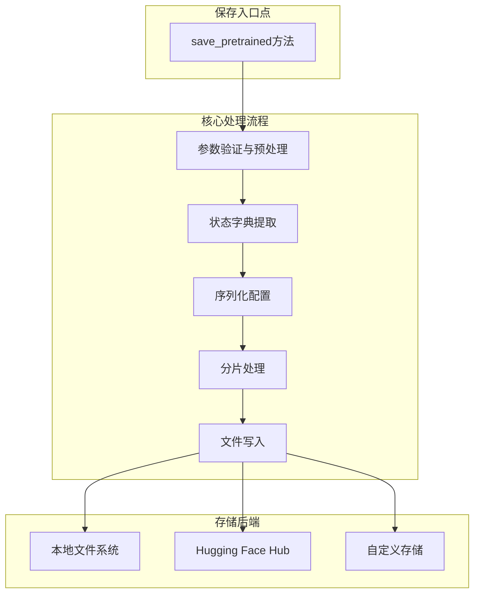
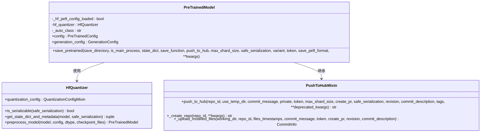
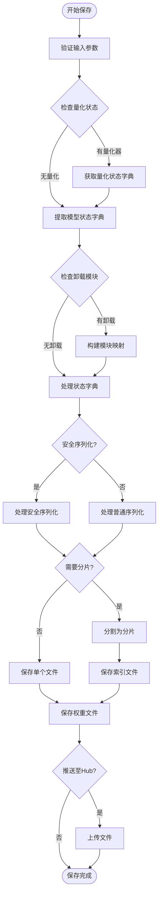
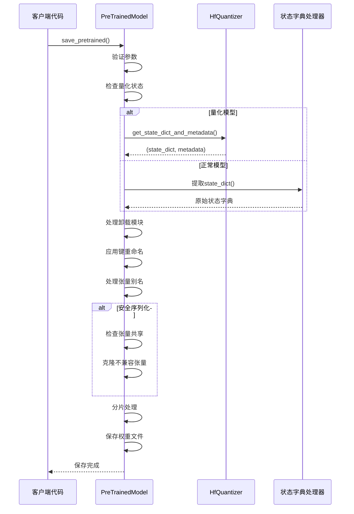
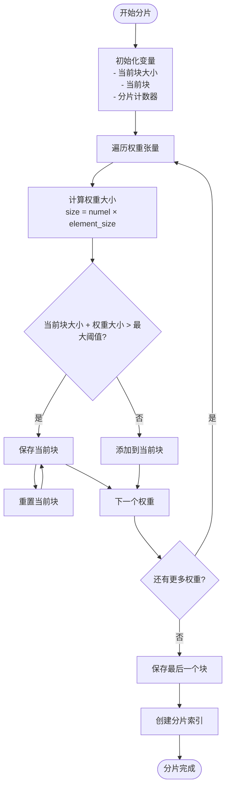
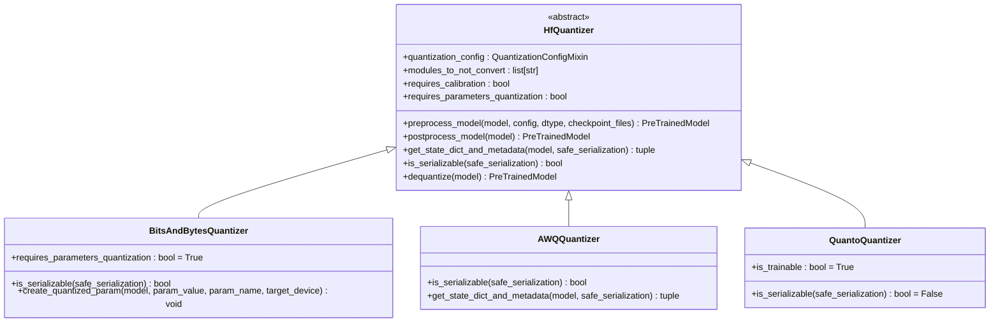
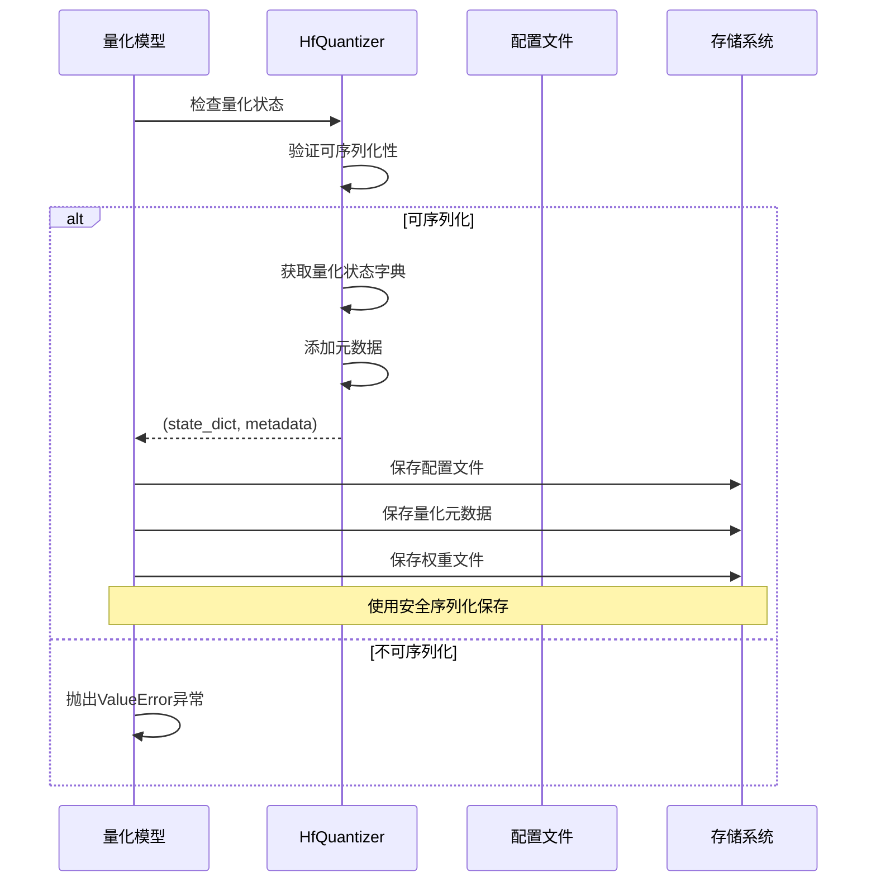
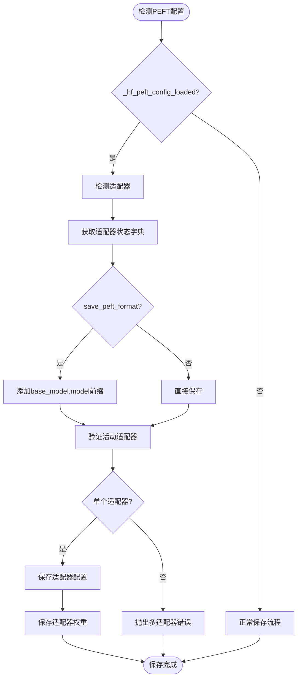
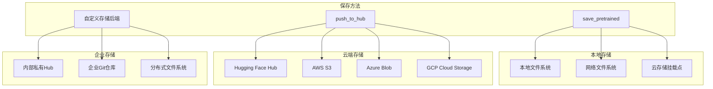
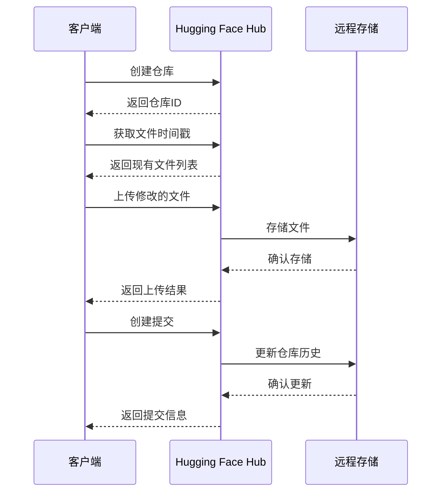

# 模型保存机制

<cite>
**本文档中引用的文件**
- [modeling_utils.py](file://src/transformers/modeling_utils.py)
- [configuration_utils.py](file://src/transformers/configuration_utils.py)
- [hub.py](file://src/transformers/utils/hub.py)
- [base.py](file://src/transformers/quantizers/base.py)
- [dynamic_module_utils.py](file://src/transformers/dynamic_module_utils.py)
- [peft.py](file://src/transformers/integrations/peft.py)
- [__init__.py](file://src/transformers/utils/__init__.py)
- [safetensors_conversion.py](file://src/transformers/safetensors_conversion.py)
</cite>

## 目录
1. [简介](#简介)
2. [核心架构概述](#核心架构概述)
3. [save_pretrained方法详解](#save_pretrained方法详解)
4. [序列化流程深度分析](#序列化流程深度分析)
5. [分片保存策略](#分片保存策略)
6. [量化模型保存](#量化模型保存)
7. [适配器权重保存](#适配器权重保存)
8. [存储位置与权限管理](#存储位置与权限管理)
9. [最佳实践指南](#最佳实践指南)
10. [故障排除](#故障排除)

## 简介

Transformers库提供了强大而灵活的模型保存机制，支持多种存储格式、分片策略和部署场景。本文档深入解析`save_pretrained`方法的完整序列化流程，涵盖从基础配置保存到复杂量化模型处理的各个方面。

## 核心架构概述

模型保存机制的核心架构基于以下关键组件：



**图表来源**
- [modeling_utils.py](file://src/transformers/modeling_utils.py#L3447-L3870)

## save_pretrained方法详解

### 方法签名与参数

`save_pretrained`方法是所有预训练模型类的核心保存接口，提供了丰富的配置选项：



**图表来源**
- [modeling_utils.py](file://src/transformers/modeling_utils.py#L3447-L3870)
- [base.py](file://src/transformers/quantizers/base.py#L43-L370)
- [hub.py](file://src/transformers/utils/hub.py#L797-L836)

### 核心参数说明

| 参数名 | 类型 | 默认值 | 描述 |
|--------|------|--------|------|
| `save_directory` | `str \| os.PathLike` | 必需 | 保存目录路径 |
| `is_main_process` | `bool` | `True` | 是否为主进程 |
| `state_dict` | `Optional[dict]` | `None` | 自定义状态字典 |
| `save_function` | `Callable` | `torch.save` | 保存函数 |
| `push_to_hub` | `bool` | `False` | 是否推送到Hub |
| `max_shard_size` | `Union[int, str]` | `"5GB"` | 最大分片大小 |
| `safe_serialization` | `bool` | `True` | 是否使用安全序列化 |
| `variant` | `Optional[str]` | `None` | 权重变体标识 |
| `token` | `Optional[Union[str, bool]]` | `None` | 认证令牌 |
| `save_peft_format` | `bool` | `True` | 是否保存PEFT格式 |

**节来源**
- [modeling_utils.py](file://src/transformers/modeling_utils.py#L3447-L3540)

## 序列化流程深度分析

### 完整序列化流程图



**图表来源**
- [modeling_utils.py](file://src/transformers/modeling_utils.py#L3542-L3870)

### 状态字典处理

状态字典是模型保存的核心数据结构，包含所有可学习参数和缓冲区：



**图表来源**
- [modeling_utils.py](file://src/transformers/modeling_utils.py#L3542-L3787)

**节来源**
- [modeling_utils.py](file://src/transformers/modeling_utils.py#L3542-L3787)

## 分片保存策略

### 分片算法实现

Transformers库实现了智能的分片算法，能够根据指定的最大分片大小自动分割大型模型：



**图表来源**
- [modeling_utils.py](file://src/transformers/modeling_utils.py#L3755-L3783)

### 分片配置选项

| 配置项 | 类型 | 默认值 | 描述 |
|--------|------|--------|------|
| `max_shard_size` | `Union[int, str]` | `"5GB"` | 单个分片最大大小 |
| `filename_pattern` | `str` | 自动生成 | 分片文件命名模式 |
| `safe_serialization` | `bool` | `True` | 是否使用安全序列化 |

### 分片文件命名规范

分片文件遵循统一的命名规范：
- 主权重文件：`pytorch_model.bin` 或 `model.safetensors`
- 分片索引：`pytorch_model.bin.index.json` 或 `model.safetensors.index.json`
- 分片文件：`pytorch_model-00001-of-00005.bin` 或 `model-00001-of-00005.safetensors`

**节来源**
- [modeling_utils.py](file://src/transformers/modeling_utils.py#L3755-L3783)

## 量化模型保存

### 量化器抽象层

量化模型的保存通过`HfQuantizer`抽象层实现，支持多种量化方法：



**图表来源**
- [base.py](file://src/transformers/quantizers/base.py#L43-L370)

### 量化模型保存流程



**图表来源**
- [modeling_utils.py](file://src/transformers/modeling_utils.py#L3512-L3540)
- [base.py](file://src/transformers/quantizers/base.py#L320-L370)

### 支持的量化方法

| 量化方法 | 序列化支持 | 参数量化 | 校准要求 |
|----------|------------|----------|----------|
| `bitsandbytes` | 是 | 是 | 否 |
| `awq` | 是 | 否 | 是 |
| `quanto` | 否 | 是 | 否 |
| `gptq` | 是 | 否 | 是 |
| `hqq` | 是 | 是 | 否 |

**节来源**
- [modeling_utils.py](file://src/transformers/modeling_utils.py#L3512-L3540)
- [base.py](file://src/transformers/quantizers/base.py#L320-L370)

## 适配器权重保存

### PEFT适配器处理

当模型加载了PEFT适配器时，保存机制会自动检测并处理适配器权重：



**图表来源**
- [modeling_utils.py](file://src/transformers/modeling_utils.py#L3592-L3618)
- [peft.py](file://src/transformers/integrations/peft.py#L469-L495)

### 适配器保存配置

| 配置项 | 默认值 | 描述 |
|--------|--------|------|
| `save_peft_format` | `True` | 是否使用PEFT标准格式 |
| `active_adapter` | 自动检测 | 当前激活的适配器名称 |
| `peft_config` | 适配器配置 | PEFT配置对象 |

### 适配器权重转换

PEFT格式的适配器权重会自动添加前缀以匹配PEFT库的预期格式：

```python
# 转换前的键名
"lora_A.weight"  # 适配器内部键名

# 转换后的键名（当save_peft_format=True时）
"base_model.model.lora_A.weight"  # PEFT标准格式
```

**节来源**
- [modeling_utils.py](file://src/transformers/modeling_utils.py#L3592-L3618)
- [peft.py](file://src/transformers/integrations/peft.py#L469-L495)

## 存储位置与权限管理

### 多种存储后端支持

Transformers库支持多种存储后端，满足不同的部署需求：



### Hugging Face Hub集成



**图表来源**
- [hub.py](file://src/transformers/utils/hub.py#L732-L836)

### 权限管理配置

| 权限级别 | 访问范围 | 推荐场景 |
|----------|----------|----------|
| 公开 | 所有用户可见 | 开源模型发布 |
| 私有 | 仅授权用户可见 | 企业内部模型 |
| 受限 | 需要申请访问 | 敏感数据模型 |
| 只读 | 仅下载权限 | 模型分发 |

### 版本控制最佳实践

1. **语义化版本控制**：使用`v1.0.0`格式的版本标签
2. **分支策略**：主分支为稳定版本，功能分支为开发版本
3. **提交消息**：使用清晰的提交描述
4. **标签管理**：为重要里程碑创建标签

**节来源**
- [hub.py](file://src/transformers/utils/hub.py#L732-L836)

## 最佳实践指南

### 性能优化建议

1. **选择合适的序列化格式**：
   - 生产环境推荐使用`safe_serialization=True`
   - 开发测试可以使用`safe_serialization=False`提高速度

2. **合理设置分片大小**：
   - 小型模型：`max_shard_size="2GB"`
   - 中型模型：`max_shard_size="5GB"`（默认）
   - 大型模型：`max_shard_size="10GB"`

3. **内存使用优化**：
   - 对于超大模型，考虑使用`low_cpu_mem_usage=True`
   - 在分布式环境中确保有足够的CPU内存

### 安全性考虑

1. **敏感信息保护**：
   - 避免在配置文件中存储敏感信息
   - 使用环境变量或密钥管理系统

2. **访问控制**：
   - 设置适当的仓库权限
   - 定期审查访问权限

3. **完整性验证**：
   - 启用文件校验和
   - 使用HTTPS传输

### 兼容性保证

1. **向后兼容性**：
   - 保持配置文件格式稳定
   - 提供迁移工具

2. **跨平台支持**：
   - 测试不同操作系统
   - 确保路径分隔符正确处理

3. **依赖版本管理**：
   - 明确声明依赖版本
   - 提供降级方案

## 故障排除

### 常见问题及解决方案

| 问题类型 | 症状 | 解决方案 |
|----------|------|----------|
| 内存不足 | `CUDA out of memory` | 减小`max_shard_size`或使用`low_cpu_mem_usage=True` |
| 序列化失败 | `RuntimeError: safetensors` | 设置`safe_serialization=False` |
| 权限错误 | `Permission denied` | 检查目录写入权限 |
| 网络超时 | `Connection timeout` | 增加超时时间或使用代理 |
| 分片冲突 | `File exists` | 清理旧的分片文件 |

### 调试技巧

1. **启用详细日志**：
```python
import logging
logging.basicConfig(level=logging.DEBUG)
```

2. **检查文件完整性**：
```python
from transformers import AutoModel
model = AutoModel.from_pretrained("path/to/save", local_files_only=True)
```

3. **验证分片一致性**：
```python
import json
with open("pytorch_model.bin.index.json") as f:
    index = json.load(f)
    print(f"Total parameters: {index['metadata']['total_parameters']}")
```

### 性能监控

1. **保存时间测量**：
```python
import time
start_time = time.time()
model.save_pretrained("path/to/save")
print(f"Save time: {time.time() - start_time:.2f} seconds")
```

2. **磁盘空间监控**：
```python
import shutil
total, used, free = shutil.disk_usage("path/to/save")
print(f"Free space: {free / 1024**3:.2f} GB")
```

3. **内存使用跟踪**：
```python
import psutil
process = psutil.Process()
print(f"Memory usage: {process.memory_info().rss / 1024**2:.2f} MB")
```

**节来源**
- [modeling_utils.py](file://src/transformers/modeling_utils.py#L3447-L3870)

## 结论

Transformers库的模型保存机制是一个功能强大且设计精良的系统，它不仅支持传统的模型保存方式，还提供了先进的分片、量化和适配器处理能力。通过深入理解其内部工作原理，开发者可以更好地利用这些功能来优化模型的存储和部署。

关键要点总结：
- `save_pretrained`方法是统一的保存入口，支持多种配置选项
- 分片机制能够有效处理大型模型的存储需求
- 量化模型保存需要特定的量化器支持
- PEFT适配器权重保存具有特殊的格式转换逻辑
- 多种存储后端和权限管理选项提供了灵活的部署方案

通过遵循本文档提供的最佳实践和故障排除指南，开发者可以确保模型保存过程的可靠性、安全性和性能。