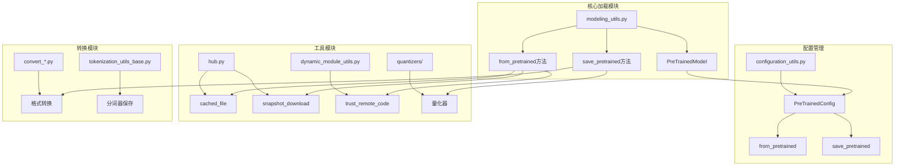
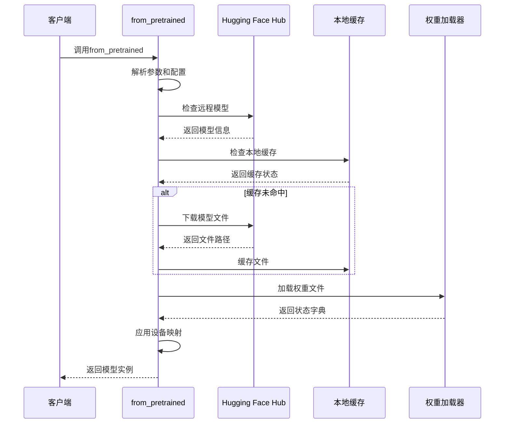
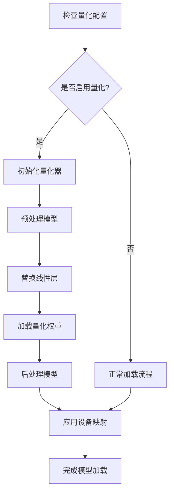
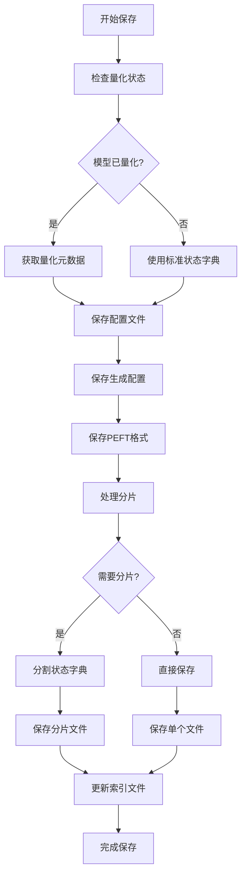
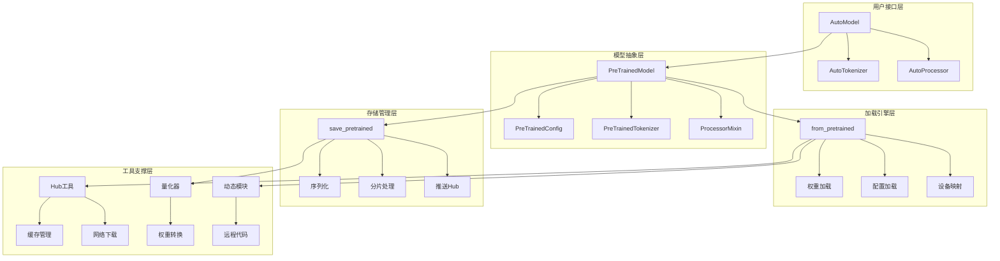
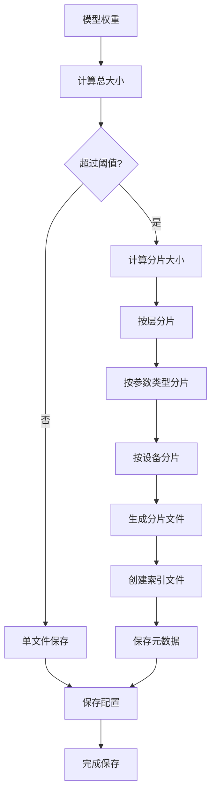
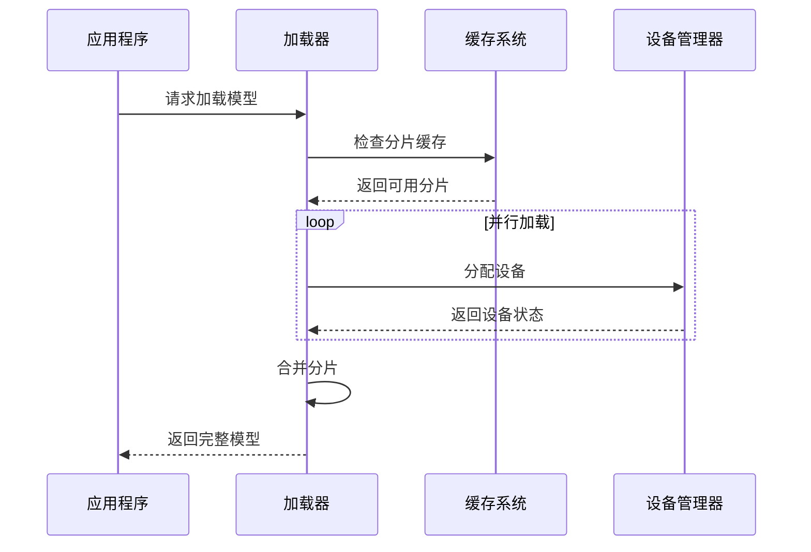
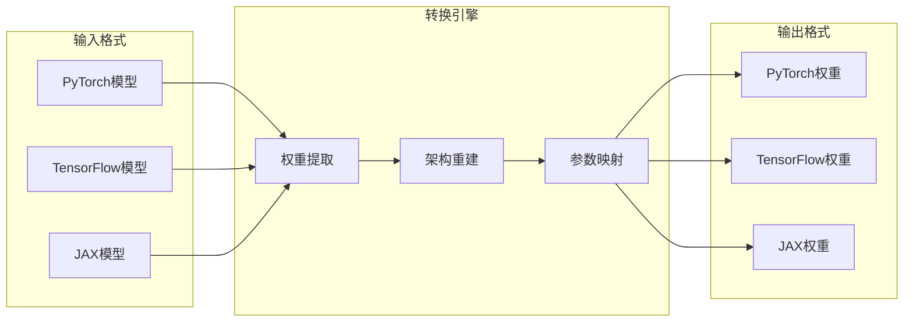
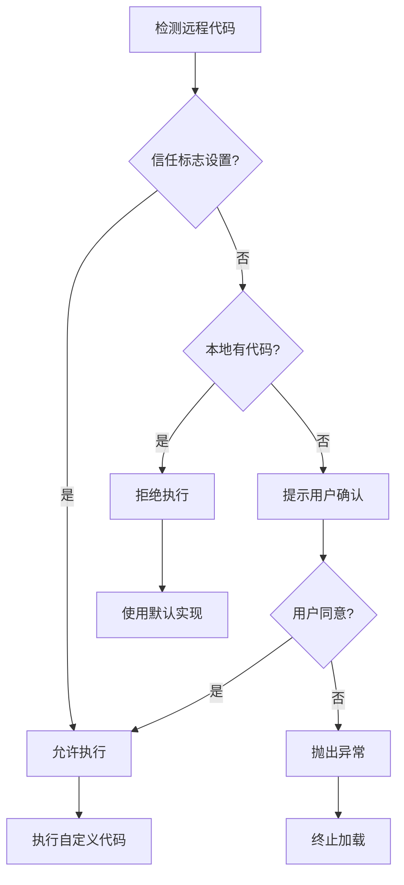
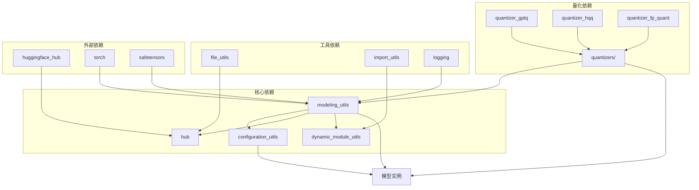

# 模型加载与保存

<cite>
**本文档中引用的文件**
- [modeling_utils.py](file://src/transformers/modeling_utils.py)
- [configuration_utils.py](file://src/transformers/configuration_utils.py)
- [hub.py](file://src/transformers/utils/hub.py)
- [dynamic_module_utils.py](file://src/transformers/dynamic_module_utils.py)
- [SECURITY.md](file://SECURITY.md)
- [quantizer_gptq.py](file://src/transformers/quantizers/quantizer_gptq.py)
- [quantizer_hqq.py](file://src/transformers/quantizers/quantizer_hqq.py)
- [quantizer_fp_quant.py](file://src/transformers/quantizers/quantizer_fp_quant.py)
- [convert_llama_weights_to_hf.py](file://src/transformers/models/llama/convert_llama_weights_to_hf.py)
- [convert_switch_transformers_original_flax_checkpoint_to_pytorch.py](file://src/transformers/models/switch_transformers/convert_switch_transformers_original_flax_checkpoint_to_pytorch.py)
</cite>

## 目录
1. [简介](#简介)
2. [项目结构概览](#项目结构概览)
3. [核心组件](#核心组件)
4. [架构概览](#架构概览)
5. [详细组件分析](#详细组件分析)
6. [依赖关系分析](#依赖关系分析)
7. [性能考虑](#性能考虑)
8. [故障排除指南](#故障排除指南)
9. [结论](#结论)

## 简介

Transformers库提供了强大而灵活的模型加载与保存功能，支持从Hugging Face Hub、本地文件系统以及各种格式的模型权重加载。该系统具备以下核心特性：

- **多格式支持**：支持PyTorch、TensorFlow、JAX等多种深度学习框架的模型格式
- **智能缓存**：自动管理模型权重的下载和本地缓存
- **设备映射**：支持大模型在多GPU环境中的分布式加载
- **量化集成**：无缝集成各种量化技术（INT8、INT4、GPTQ等）
- **安全机制**：完善的远程代码验证和安全加载机制
- **分片存储**：针对超大模型的智能分片加载和保存

## 项目结构概览

Transformers库的模型加载与保存功能主要分布在以下几个关键模块中：



**图表来源**
- [modeling_utils.py](file://src/transformers/modeling_utils.py#L4264-L4287)
- [configuration_utils.py](file://src/transformers/configuration_utils.py#L490-L595)
- [hub.py](file://src/transformers/utils/hub.py#L382-L416)

## 核心组件

### from_pretrained方法实现机制

`from_pretrained`是Transformers库中最核心的方法，负责从各种来源加载预训练模型。其工作机制如下：

#### 权重下载与缓存管理



**图表来源**
- [modeling_utils.py](file://src/transformers/modeling_utils.py#L4264-L4287)
- [hub.py](file://src/transformers/utils/hub.py#L382-L416)

#### 设备映射与内存优化

系统支持多种设备映射策略来处理大模型：

| 映射类型 | 描述 | 适用场景 |
|---------|------|----------|
| `device_map="auto"` | 自动分配策略 | 多GPU环境下的最优分配 |
| `device_map={"layer": "gpu:0"}` | 手动指定 | 特定层的精确控制 |
| `device_map="cpu"` | 全部CPU加载 | 内存受限环境 |
| `device_map="disk"` | 磁盘卸载 | 超大模型的内存管理 |

#### 量化集成机制



**图表来源**
- [quantizer_gptq.py](file://src/transformers/quantizers/quantizer_gptq.py#L81-L106)
- [quantizer_hqq.py](file://src/transformers/quantizers/quantizer_hqq.py#L159-L187)

**节来源**
- [modeling_utils.py](file://src/transformers/modeling_utils.py#L4264-L4287)
- [modeling_utils.py](file://src/transformers/modeling_utils.py#L4440-L4468)

### save_pretrained方法序列化流程

`save_pretrained`方法负责将模型及其相关组件保存到磁盘或上传到Hugging Face Hub：

#### 配置保存流程



**图表来源**
- [modeling_utils.py](file://src/transformers/modeling_utils.py#L3447-L3870)

#### 分词器和处理器保存

除了模型权重，系统还会保存相关的配置文件：

| 文件类型 | 用途 | 格式 |
|---------|------|------|
| `config.json` | 模型配置 | JSON |
| `generation_config.json` | 生成配置 | JSON |
| `tokenizer_config.json` | 分词器配置 | JSON |
| `special_tokens_map.json` | 特殊标记映射 | JSON |
| `added_tokens.json` | 添加的标记 | JSON |
| `pytorch_model.bin` | 模型权重 | PyTorch二进制 |
| `model.safetensors` | 安全张量权重 | SafeTensors格式 |

**节来源**
- [modeling_utils.py](file://src/transformers/modeling_utils.py#L3447-L3870)

## 架构概览

Transformers的模型加载与保存架构采用分层设计，确保了功能的模块化和可扩展性：



**图表来源**
- [modeling_utils.py](file://src/transformers/modeling_utils.py#L4264-L4287)
- [configuration_utils.py](file://src/transformers/configuration_utils.py#L490-L595)

## 详细组件分析

### 大型模型分片存储与加载优化

#### 分片策略

对于超过单个文件大小限制的大模型，系统采用智能分片策略：



**图表来源**
- [modeling_utils.py](file://src/transformers/modeling_utils.py#L3800-L3870)

#### 加载优化机制



**图表来源**
- [modeling_utils.py](file://src/transformers/modeling_utils.py#L692-L730)

### 模型转换详细指南

#### PyTorch ↔ TensorFlow 互操作性

系统提供了多种格式间的转换支持：



**图表来源**
- [convert_llama_weights_to_hf.py](file://src/transformers/models/llama/convert_llama_weights_to_hf.py#L249-L271)
- [convert_switch_transformers_original_flax_checkpoint_to_pytorch.py](file://src/transformers/models/switch_transformers/convert_switch_transformers_original_flax_checkpoint_to_pytorch.py#L0-L35)

#### 关键转换步骤

| 步骤 | PyTorch | TensorFlow | JAX |
|------|---------|------------|-----|
| 权重提取 | `state_dict()` | `get_weights()` | `params` |
| 架构重建 | 直接继承 | 动态构建 | 函数式编程 |
| 参数映射 | 名称匹配 | 层级对应 | 结构化参数 |
| 类型转换 | `torch.Tensor` | `tf.Tensor` | `jax.Array` |

**节来源**
- [convert_llama_weights_to_hf.py](file://src/transformers/models/llama/convert_llama_weights_to_hf.py#L249-L271)

### 安全加载机制与风险防范

#### 远程代码验证



**图表来源**
- [dynamic_module_utils.py](file://src/transformers/dynamic_module_utils.py#L659-L690)

#### 安全最佳实践

| 安全措施 | 实现方式 | 风险等级 |
|---------|----------|----------|
| SafeTensors格式 | 默认启用 | 高 |
| 远程代码验证 | 用户确认机制 | 中 |
| 权限检查 | 文件权限验证 | 高 |
| 数字签名 | 模型完整性校验 | 中 |
| 网络隔离 | 仅本地文件模式 | 最高 |

**节来源**
- [SECURITY.md](file://SECURITY.md#L0-L27)
- [dynamic_module_utils.py](file://src/transformers/dynamic_module_utils.py#L659-L690)

### 实际代码示例场景

#### Hugging Face Hub加载

```python
# 基础模型加载
model = AutoModel.from_pretrained("bert-base-uncased")

# 带配置的加载
model = AutoModel.from_pretrained(
    "bert-base-uncased",
    output_attentions=True,
    torch_dtype=torch.float16,
    device_map="auto"
)

# 使用量化
model = AutoModel.from_pretrained(
    "microsoft/DialoGPT-large",
    quantization_config=BitsAndBytesConfig(
        load_in_4bit=True,
        bnb_4bit_compute_dtype=torch.float16
    )
)
```

#### 本地加载

```python
# 本地目录加载
model = AutoModel.from_pretrained("./local_model_dir")

# 子文件夹加载
model = AutoModel.from_pretrained(
    "./model_repo",
    subfolder="pytorch_model"
)

# 变体加载
model = AutoModel.from_pretrained(
    "microsoft/DialoGPT-large",
    variant="float16"
)
```

#### 自定义路径加载

```python
# 指定缓存目录
model = AutoModel.from_pretrained(
    "bert-base-uncased",
    cache_dir="./custom_cache"
)

# 强制重新下载
model = AutoModel.from_pretrained(
    "bert-base-uncased",
    force_download=True
)

# 离线模式
model = AutoModel.from_pretrained(
    "bert-base-uncased",
    local_files_only=True
)
```

**节来源**
- [modeling_utils.py](file://src/transformers/modeling_utils.py#L4264-L4287)

## 依赖关系分析

Transformers的模型加载与保存功能涉及多个模块间的复杂依赖关系：



**图表来源**
- [modeling_utils.py](file://src/transformers/modeling_utils.py#L1-L50)
- [configuration_utils.py](file://src/transformers/configuration_utils.py#L1-L50)

**节来源**
- [modeling_utils.py](file://src/transformers/modeling_utils.py#L1-L50)
- [configuration_utils.py](file://src/transformers/configuration_utils.py#L1-L50)

## 性能考虑

### 内存优化策略

1. **延迟加载**：仅在需要时加载模型参数
2. **设备卸载**：将不活跃的层卸载到CPU或磁盘
3. **混合精度**：使用FP16/BF16减少内存占用
4. **梯度检查点**：在推理时减少内存使用

### 网络优化

1. **断点续传**：支持大文件的中断恢复
2. **并行下载**：多线程同时下载多个分片
3. **压缩传输**：使用gzip等压缩算法
4. **CDN加速**：利用内容分发网络

### 缓存策略

1. **智能缓存**：根据使用频率管理缓存
2. **版本控制**：支持模型版本的独立缓存
3. **清理机制**：定期清理过期缓存文件
4. **共享缓存**：多用户间的缓存共享

## 故障排除指南

### 常见问题及解决方案

#### 权重不匹配错误

```python
# 错误：权重形状不匹配
# 解决方案：忽略不匹配的权重
model = AutoModel.from_pretrained(
    "custom_model",
    ignore_mismatched_sizes=True
)
```

#### 内存不足问题

```python
# 解决方案1：使用设备映射
model = AutoModel.from_pretrained(
    "large_model",
    device_map="auto",
    max_memory={0: "10GB", 1: "10GB"}
)

# 解决方案2：启用CPU卸载
model = AutoModel.from_pretrained(
    "large_model",
    device_map="auto",
    offload_folder="./offload"
)
```

#### 量化兼容性问题

```python
# 检查量化配置兼容性
try:
    model = AutoModel.from_pretrained(
        "quantized_model",
        quantization_config=BitsAndBytesConfig(load_in_4bit=True)
    )
except Exception as e:
    # 回退到非量化版本
    model = AutoModel.from_pretrained("quantized_model")
```

**节来源**
- [modeling_utils.py](file://src/transformers/modeling_utils.py#L4659-L4681)

## 结论

Transformers库的模型加载与保存功能是一个高度集成和优化的系统，具备以下优势：

1. **全面的格式支持**：无缝支持多种深度学习框架的模型格式
2. **智能的资源管理**：通过设备映射和分片技术处理超大模型
3. **强大的安全机制**：完善的远程代码验证和安全加载保护
4. **灵活的配置选项**：丰富的参数控制满足不同使用场景
5. **优秀的性能表现**：多层次的优化策略确保高效运行

该系统为研究人员和开发者提供了可靠、高效的模型加载与保存解决方案，是现代深度学习工作流中不可或缺的重要组成部分。随着模型规模的不断增长和新格式的出现，这一系统将继续演进以满足日益增长的需求。