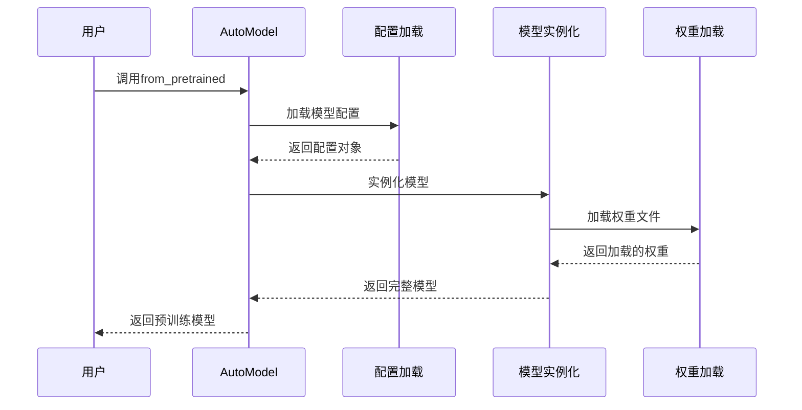
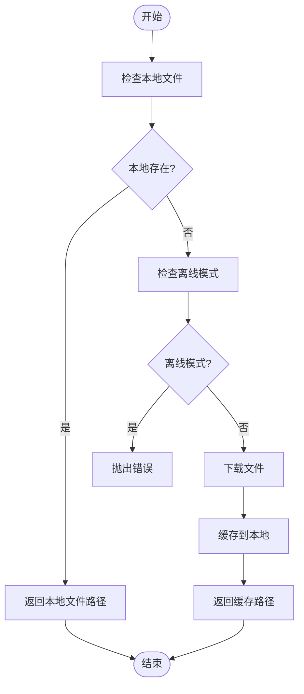
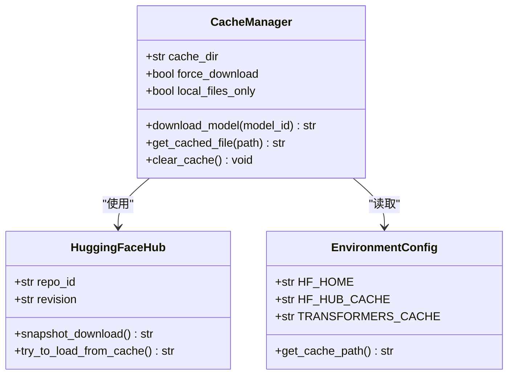
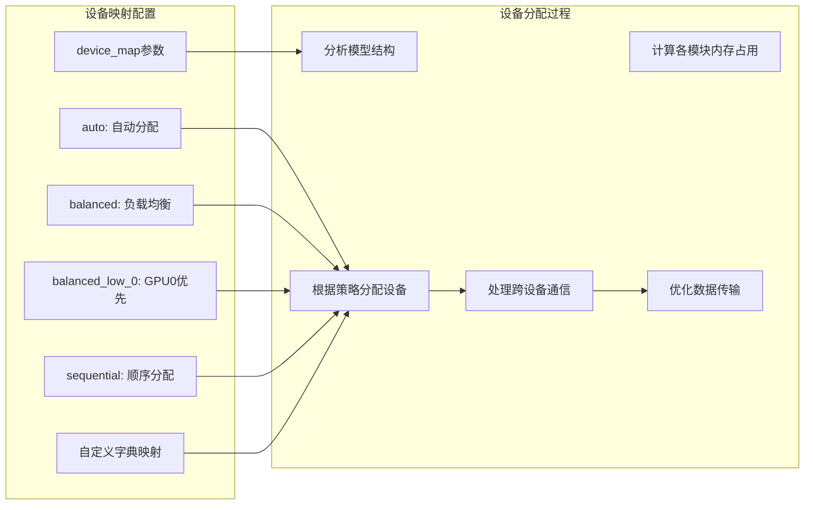
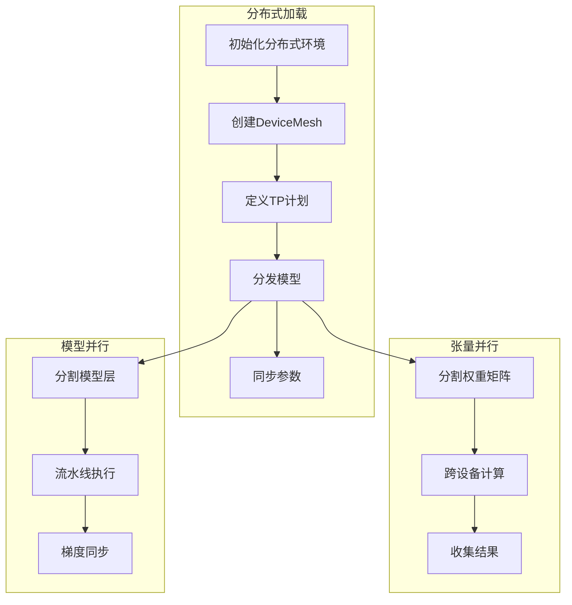
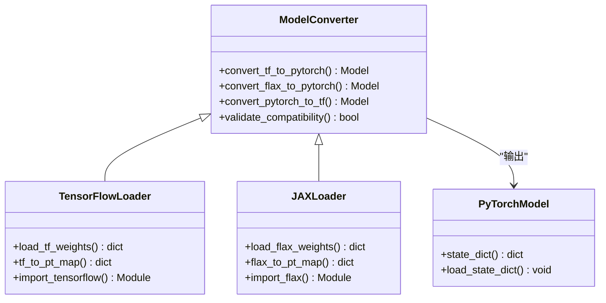
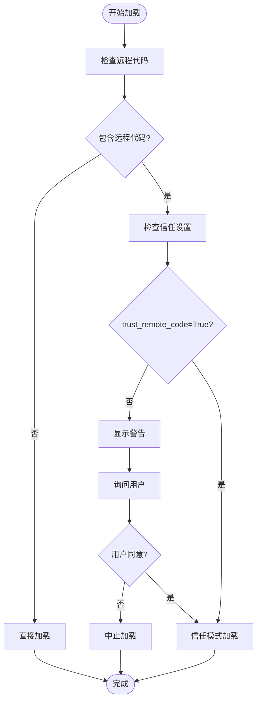
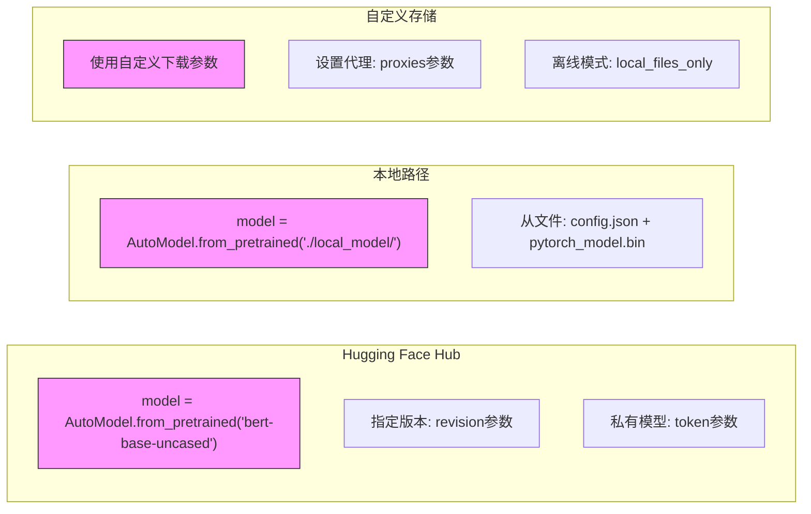
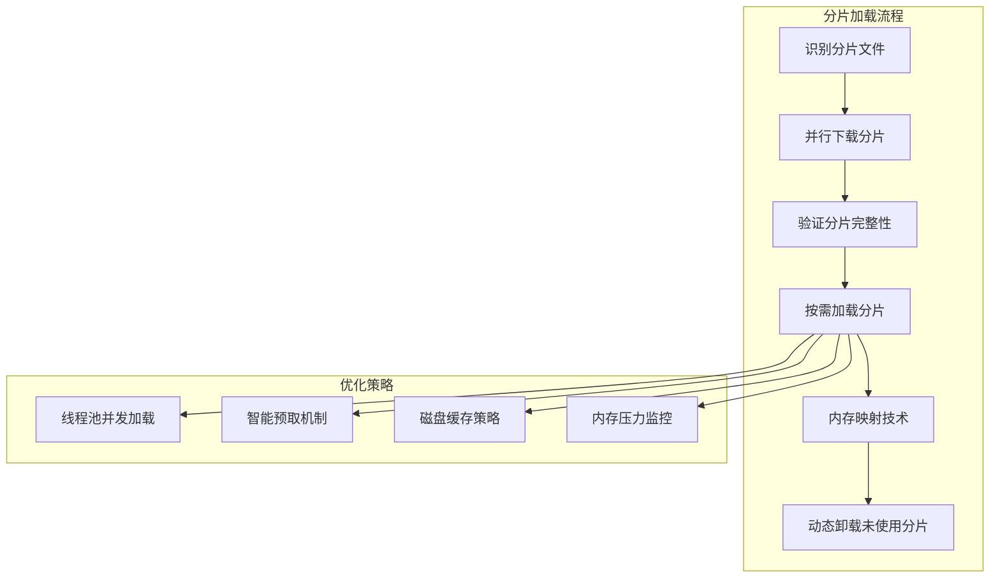

# 模型加载机制

<cite>
**本文档中引用的文件**  
- [modeling_utils.py](file://src/transformers/modeling_utils.py)
- [hub.py](file://src/transformers/utils/hub.py)
- [dynamic_module_utils.py](file://src/transformers/dynamic_module_utils.py)
- [configuration_utils.py](file://src/transformers/configuration_utils.py)
- [auto_factory.py](file://src/transformers/models/auto/auto_factory.py)
</cite>

## 目录
1. [引言](#引言)
2. [from_pretrained方法实现](#from_pretrained方法实现)
3. [模型权重下载流程](#模型权重下载流程)
4. [缓存管理策略](#缓存管理策略)
5. [设备映射机制](#设备映射机制)
6. [分布式加载优化](#分布式加载优化)
7. [跨框架互操作性](#跨框架互操作性)
8. [安全加载模式](#安全加载模式)
9. [代码示例](#代码示例)
10. [大型模型分片加载](#大型模型分片加载)

## 引言
Hugging Face Transformers库提供了一套完整的模型加载机制，通过`from_pretrained`方法实现了从Hugging Face Hub、本地路径和自定义存储位置加载预训练模型的功能。该机制不仅支持PyTorch、TensorFlow和JAX等不同框架之间的模型加载互操作性，还包含了安全加载模式下的风险防范措施。

## from_pretrained方法实现
`from_pretrained`方法是Transformers库中加载预训练模型的核心接口，它在`PreTrainedModel`类中定义，为所有模型提供了统一的加载方式。

**Diagram sources**
- [modeling_utils.py](file://src/transformers/modeling_utils.py#L4058-L4650)

**Section sources**
- [modeling_utils.py](file://src/transformers/modeling_utils.py#L4058-L4650)

## 模型权重下载流程
模型权重的下载流程通过`cached_file`函数实现，该函数负责从远程仓库或本地路径获取模型文件。

**Diagram sources**
- [hub.py](file://src/transformers/utils/hub.py#L382-L579)

**Section sources**
- [hub.py](file://src/transformers/utils/hub.py#L382-L579)

## 缓存管理策略
Transformers库采用多级缓存策略来管理下载的模型文件，确保高效重复使用已下载的资源。

**Diagram sources**
- [hub.py](file://src/transformers/utils/hub.py#L89-L113)
- [dynamic_module_utils.py](file://src/transformers/dynamic_module_utils.py#L314-L338)

**Section sources**
- [hub.py](file://src/transformers/utils/hub.py#L89-L113)
- [dynamic_module_utils.py](file://src/transformers/dynamic_module_utils.py#L314-L338)

## 设备映射机制
设备映射机制允许将模型的不同部分分配到不同的计算设备上，实现高效的内存管理和并行计算。

**Diagram sources**
- [modeling_utils.py](file://src/transformers/modeling_utils.py#L4250-L4450)
- [accelerate.py](file://src/transformers/integrations/accelerate.py#L537-L556)

**Section sources**
- [modeling_utils.py](file://src/transformers/modeling_utils.py#L4250-L4450)
- [accelerate.py](file://src/transformers/integrations/accelerate.py#L537-L556)

## 分布式加载优化
对于大型模型，Transformers库提供了分布式加载优化功能，支持张量并行和模型并行等高级技术。

**Diagram sources**
- [modeling_utils.py](file://src/transformers/modeling_utils.py#L4470-L4500)
- [modeling_utils.py](file://src/transformers/modeling_utils.py#L4250-L4450)

**Section sources**
- [modeling_utils.py](file://src/transformers/modeling_utils.py#L4470-L4500)
- [modeling_utils.py](file://src/transformers/modeling_utils.py#L4250-L4450)

## 跨框架互操作性
Transformers库支持在PyTorch、TensorFlow和JAX之间进行模型加载互操作，通过转换函数实现不同框架模型的兼容。

**Diagram sources**
- [convert_gpt2_original_tf_checkpoint_to_pytorch.py](file://src/transformers/models/gpt2/convert_gpt2_original_tf_checkpoint_to_pytorch.py#L29-L51)
- [convert_switch_transformers_original_flax_checkpoint_to_pytorch.py](file://src/transformers/models/switch_transformers/convert_switch_transformers_original_flax_checkpoint_to_pytorch.py#L34-L61)

**Section sources**
- [convert_gpt2_original_tf_checkpoint_to_pytorch.py](file://src/transformers/models/gpt2/convert_gpt2_original_tf_checkpoint_to_pytorch.py#L29-L51)
- [convert_switch_transformers_original_flax_checkpoint_to_pytorch.py](file://src/transformers/models/switch_transformers/convert_switch_transformers_original_flax_checkpoint_to_pytorch.py#L34-L61)

## 安全加载模式
安全加载模式通过`trust_remote_code`参数控制，防止执行不受信任的远程代码，保护用户环境安全。

**Diagram sources**
- [dynamic_module_utils.py](file://src/transformers/dynamic_module_utils.py#L659-L740)
- [SECURITY.md](file://SECURITY.md#L0-L27)

**Section sources**
- [dynamic_module_utils.py](file://src/transformers/dynamic_module_utils.py#L659-L740)
- [SECURITY.md](file://SECURITY.md#L0-L27)

## 代码示例
以下代码示例展示了从不同来源加载模型的各种场景。

**Diagram sources**
- [auto_factory.py](file://src/transformers/models/auto/auto_factory.py#L249-L375)
- [configuration_utils.py](file://src/transformers/configuration_utils.py#L490-L595)

**Section sources**
- [auto_factory.py](file://src/transformers/models/auto/auto_factory.py#L249-L375)
- [configuration_utils.py](file://src/transformers/configuration_utils.py#L490-L595)

## 大型模型分片加载
对于大型模型，Transformers库支持分片加载机制，通过分块处理模型权重文件来降低内存占用。

**Diagram sources**
- [modeling_utils.py](file://src/transformers/modeling_utils.py#L4450-L4650)
- [hub.py](file://src/transformers/utils/hub.py#L382-L579)

**Section sources**
- [modeling_utils.py](file://src/transformers/modeling_utils.py#L4450-L4650)
- [hub.py](file://src/transformers/utils/hub.py#L382-L579)