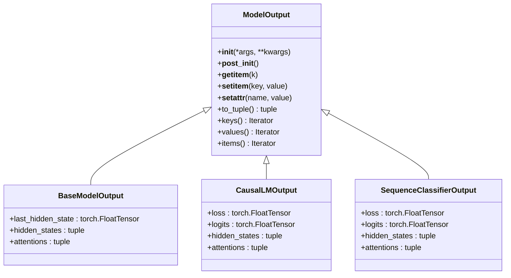
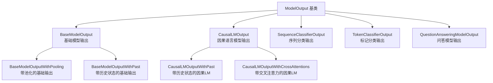

# 模型输出处理

<cite>
**本文档中引用的文件**
- [modeling_outputs.py](file://src/transformers/modeling_outputs.py)
- [generic.py](file://src/transformers/utils/generic.py)
- [test_model_output.py](file://tests/utils/test_model_output.py)
- [modeling_emu3.py](file://src/transformers/models/emu3/modeling_emu3.py)
- [modeling_pix2struct.py](file://src/transformers/models/pix2struct/modeling_pix2struct.py)
</cite>

## 目录
1. [简介](#简介)
2. [ModelOutput基类设计](#modeloutput基类设计)
3. [核心输出类架构](#核心输出类架构)
4. [具体输出类详解](#具体输出类详解)
5. [输出数据访问与处理](#输出数据访问与处理)
6. [自定义输出类创建](#自定义输出类创建)
7. [序列化与反序列化](#序列化与反序列化)
8. [分布式环境处理](#分布式环境处理)
9. [最佳实践指南](#最佳实践指南)
10. [故障排除](#故障排除)

## 简介

Transformers库中的模型输出处理系统提供了一套统一且灵活的数据结构来封装模型的各种输出结果。该系统的核心是`ModelOutput`基类，它为所有模型输出提供了标准化的接口，支持字典式访问、元组索引、属性访问等多种操作方式。

## ModelOutput基类设计

### 设计理念

`ModelOutput`基类继承自`OrderedDict`，结合了字典的灵活性和数据类的类型安全性。其设计具有以下特点：

- **类型安全**：通过`@dataclass`装饰器确保字段类型正确性
- **灵活访问**：支持字典式键值访问和属性访问
- **序列化友好**：内置序列化机制，支持PyTorch分布式训练
- **不可变性**：防止意外修改，保证数据完整性

### 核心特性



**图表来源**
- [generic.py](file://src/transformers/utils/generic.py#L223-L364)
- [modeling_outputs.py](file://src/transformers/modeling_outputs.py#L25-L50)

**章节来源**
- [generic.py](file://src/transformers/utils/generic.py#L223-L364)

## 核心输出类架构

### 基础输出类层次结构

Transformers库定义了一系列专门化的输出类，每个类都针对特定的任务类型进行了优化：



**图表来源**
- [modeling_outputs.py](file://src/transformers/modeling_outputs.py#L25-L100)
- [modeling_outputs.py](file://src/transformers/modeling_outputs.py#L693-L773)

### 字段结构规范

所有输出类都遵循统一的字段结构规范：

| 字段名称 | 类型 | 描述 | 必需性 |
|---------|------|------|--------|
| `loss` | `torch.FloatTensor` | 损失值，用于训练时计算梯度 | 可选 |
| `logits` | `torch.FloatTensor` | 模型预测的原始分数 | 可选 |
| `hidden_states` | `tuple[torch.FloatTensor, ...]` | 各层隐藏状态的元组 | 可选 |
| `attentions` | `tuple[torch.FloatTensor, ...]` | 注意力权重的元组 | 可选 |

**章节来源**
- [modeling_outputs.py](file://src/transformers/modeling_outputs.py#L25-L100)

## 具体输出类详解

### CausalLMOutput（因果语言模型输出）

`CausalLMOutput`是最常用的输出类之一，专门用于因果语言建模任务：

```python
@dataclass
class CausalLMOutput(ModelOutput):
    """
    因果语言模型输出的基础类
    
    Args:
        loss: 语言建模损失（下一个token预测）
        logits: 语言建模头的预测分数（SoftMax前）
        hidden_states: 各层隐藏状态
        attentions: 注意力权重
    """
    loss: Optional[torch.FloatTensor] = None
    logits: Optional[torch.FloatTensor] = None
    hidden_states: Optional[tuple[torch.FloatTensor, ...]] = None
    attentions: Optional[tuple[torch.FloatTensor, ...]] = None
```

### SequenceClassifierOutput（序列分类输出）

用于文本分类任务的标准输出类：

```python
@dataclass
class SequenceClassifierOutput(ModelOutput):
    """
    序列分类模型输出的基础类
    
    Args:
        loss: 分类（或回归）损失
        logits: 分类分数（SoftMax前）
        hidden_states: 各层隐藏状态
        attentions: 注意力权重
    """
    loss: Optional[torch.FloatTensor] = None
    logits: Optional[torch.FloatTensor] = None
    hidden_states: Optional[tuple[torch.FloatTensor, ...]] = None
    attentions: Optional[tuple[torch.FloatTensor, ...]] = None
```

### 特殊用途输出类

#### QuestionAnsweringModelOutput（问答模型输出）

专为问答任务设计，包含开始和结束位置的logits：

```python
@dataclass
class QuestionAnsweringModelOutput(ModelOutput):
    """
    问答模型输出的基础类
    
    Args:
        loss: 总跨度提取损失
        start_logits: 跨度起始位置分数
        end_logits: 跨度结束位置分数
        hidden_states: 各层隐藏状态
        attentions: 注意力权重
    """
    loss: Optional[torch.FloatTensor] = None
    start_logits: Optional[torch.FloatTensor] = None
    end_logits: Optional[torch.FloatTensor] = None
    hidden_states: Optional[tuple[torch.FloatTensor, ...]] = None
    attentions: Optional[tuple[torch.FloatTensor, ...]] = None
```

**章节来源**
- [modeling_outputs.py](file://src/transformers/modeling_outputs.py#L693-L773)
- [modeling_outputs.py](file://src/transformers/modeling_outputs.py#L974-L1000)

## 输出数据访问与处理

### 多样化访问方式

`ModelOutput`支持多种灵活的数据访问方式：

#### 属性访问
```python
# 推荐方式：属性访问
output = model(input_ids)
logits = output.logits
loss = output.loss
```

#### 字典式访问
```python
# 字典式访问
logits = output['logits']
loss = output.get('loss', None)
```

#### 索引访问
```python
# 索引访问（按顺序）
for i, value in enumerate(output):
    print(f"第{i}个字段: {value}")
```

#### 元组转换
```python
# 转换为元组（排除None值）
output_tuple = output.to_tuple()
print(output_tuple)  # (logits, hidden_states, attentions)
```

### 嵌套数据处理

对于复杂的嵌套输出结构，可以使用以下方法：

```python
# 检查字段是否存在
if hasattr(output, 'past_key_values'):
    past_kv = output.past_key_values

# 遍历所有非空字段
for field_name, field_value in output.items():
    print(f"{field_name}: {field_value.shape if field_value is not None else None}")

# 条件处理
if output.loss is not None:
    # 训练模式下的处理
    loss.backward()
else:
    # 推理模式下的处理
    predictions = torch.argmax(output.logits, dim=-1)
```

**章节来源**
- [generic.py](file://src/transformers/utils/generic.py#L320-L364)

## 自定义输出类创建

### 创建自定义输出类

要创建自定义输出类，需要遵循以下步骤：

#### 步骤1：定义数据类
```python
from dataclasses import dataclass
from transformers import ModelOutput
import torch

@dataclass
class CustomModelOutput(ModelOutput):
    """
    自定义模型输出类示例
    
    Args:
        loss: 损失值
        custom_scores: 自定义分数
        auxiliary_info: 辅助信息
        hidden_states: 隐藏状态
    """
    loss: Optional[torch.FloatTensor] = None
    custom_scores: Optional[torch.FloatTensor] = None
    auxiliary_info: Optional[dict] = None
    hidden_states: Optional[tuple[torch.FloatTensor, ...]] = None
    attentions: Optional[tuple[torch.FloatTensor, ...]] = None
```

#### 步骤2：在模型中使用
```python
class CustomModel(torch.nn.Module):
    def forward(self, input_ids, attention_mask=None, labels=None):
        # 模型前向传播
        hidden_states = self.transformer(input_ids, attention_mask=attention_mask)
        
        # 计算自定义分数
        custom_scores = self.custom_head(hidden_states)
        
        # 构建输出
        output_dict = {
            'loss': None,
            'custom_scores': custom_scores,
            'auxiliary_info': {'sequence_lengths': input_ids.size(1)},
            'hidden_states': hidden_states,
            'attentions': None
        }
        
        return CustomModelOutput(**output_dict)
```

### 扩展标准输出格式

#### 添加新字段
```python
@dataclass
class ExtendedCausalLMOutput(CausalLMOutput):
    """
    扩展的因果语言模型输出，添加了辅助损失
    """
    auxiliary_loss: Optional[torch.FloatTensor] = None
    router_probs: Optional[tuple[torch.FloatTensor]] = None
```

#### 修改现有行为
```python
@dataclass
class EnhancedModelOutput(ModelOutput):
    # 重写某些行为
    def __post_init__(self):
        super().__post_init__()
        # 添加额外的验证逻辑
        if self.custom_scores is not None:
            assert self.custom_scores.dim() == 2, "custom_scores必须是二维张量"
```

**章节来源**
- [test_model_output.py](file://tests/utils/test_model_output.py#L25-L40)

## 序列化与反序列化

### 内置序列化支持

`ModelOutput`内置了完整的序列化支持，包括：

#### Pickle序列化
```python
import pickle

# 序列化
output = model(input_ids)
serialized_output = pickle.dumps(output)

# 反序列化
deserialized_output = pickle.loads(serialized_output)
```

#### Torch序列化
```python
import torch

# Torch保存
torch.save(output, 'output.pt')

# Torch加载
loaded_output = torch.load('output.pt')
```

### 序列化最佳实践

#### 1. 大张量处理
```python
# 对于大型张量，考虑使用内存映射
class MemoryEfficientOutput(ModelOutput):
    def __reduce__(self):
        # 自定义序列化逻辑
        state = self.__dict__.copy()
        # 将大张量转换为可序列化的格式
        for key, value in state.items():
            if isinstance(value, torch.Tensor) and value.numel() > 1000000:
                state[key] = value.cpu().numpy()
        return self.__class__, (), state
```

#### 2. 安全序列化
```python
import json
import torch

def serialize_model_output(output, path):
    """安全序列化ModelOutput到JSON"""
    def tensor_to_dict(tensor):
        return {
            'shape': tensor.shape,
            'dtype': str(tensor.dtype),
            'data': tensor.cpu().numpy().tolist()
        }
    
    serializable_dict = {}
    for key, value in output.items():
        if isinstance(value, torch.Tensor):
            serializable_dict[key] = tensor_to_dict(value)
        elif isinstance(value, (list, tuple)):
            serializable_dict[key] = [
                tensor_to_dict(item) if isinstance(item, torch.Tensor) else item
                for item in value
            ]
        else:
            serializable_dict[key] = value
    
    with open(path, 'w') as f:
        json.dump(serializable_dict, f, indent=2)

def deserialize_model_output(path):
    """从JSON反序列化ModelOutput"""
    import numpy as np
    
    with open(path, 'r') as f:
        data = json.load(f)
    
    output_dict = {}
    for key, value in data.items():
        if isinstance(value, dict) and 'shape' in value:
            tensor = torch.tensor(np.array(value['data']), dtype=value['dtype'])
            output_dict[key] = tensor
        elif isinstance(value, list):
            output_dict[key] = [
                torch.tensor(np.array(item['data']), dtype=item['dtype']) 
                if isinstance(item, dict) and 'shape' in item else item
                for item in value
            ]
        else:
            output_dict[key] = value
    
    return ModelOutput(output_dict)
```

**章节来源**
- [generic.py](file://src/transformers/utils/generic.py#L340-L364)

## 分布式环境处理

### PyTorch分布式兼容性

`ModelOutput`与PyTorch分布式训练完全兼容，特别是与`DistributedDataParallel`配合使用时：

#### 自动注册为PyTree节点
```python
# 在ModelOutput子类中自动注册
def __init_subclass__(cls) -> None:
    if _is_torch_available:
        from torch.utils._pytree import register_pytree_node
        
        register_pytree_node(
            cls,
            _model_output_flatten,
            partial(_model_output_unflatten, output_type=cls),
            serialized_type_name=f"{cls.__module__}.{cls.__name__}",
        )
```

#### 分布式训练中的使用
```python
import torch
from torch.nn.parallel import DistributedDataParallel as DDP
from transformers import ModelOutput

# 定义模型
class MyModel(torch.nn.Module):
    def forward(self, input_ids):
        # 前向传播
        hidden_states = self.transformer(input_ids)
        logits = self.classifier(hidden_states)
        
        # 返回ModelOutput
        return ModelOutput(
            loss=None,
            logits=logits,
            hidden_states=hidden_states
        )

# 初始化分布式环境
model = MyModel()
model = DDP(model, device_ids=[rank], find_unused_parameters=True)

# 在分布式环境中正常工作
outputs = model(input_ids)
# 梯度会正确同步
```

### 多GPU处理注意事项

#### 1. 张量设备管理
```python
def process_output_for_multi_gpu(output, device):
    """确保输出张量在正确的设备上"""
    processed_output = {}
    for key, value in output.items():
        if isinstance(value, torch.Tensor):
            processed_output[key] = value.to(device)
        elif isinstance(value, (list, tuple)):
            processed_output[key] = [
                v.to(device) if isinstance(v, torch.Tensor) else v 
                for v in value
            ]
        else:
            processed_output[key] = value
    return ModelOutput(processed_output)
```

#### 2. 内存优化
```python
def optimize_output_memory(output):
    """优化输出内存使用"""
    optimized_output = {}
    for key, value in output.items():
        if isinstance(value, torch.Tensor):
            # 使用共享内存
            optimized_output[key] = value.share_memory_()
        else:
            optimized_output[key] = value
    return ModelOutput(optimized_output)
```

**章节来源**
- [generic.py](file://src/transformers/utils/generic.py#L230-L245)

## 最佳实践指南

### 1. 输出类选择指南

根据任务类型选择合适的输出类：

```python
# 文本分类
output = SequenceClassifierOutput(
    loss=loss,
    logits=logits,
    hidden_states=hidden_states
)

# 语言模型
output = CausalLMOutput(
    loss=loss,
    logits=logits,
    hidden_states=hidden_states
)

# 问答任务
output = QuestionAnsweringModelOutput(
    loss=loss,
    start_logits=start_logits,
    end_logits=end_logits,
    hidden_states=hidden_states
)
```

### 2. 错误处理策略

```python
def safe_process_output(output):
    """安全处理模型输出"""
    try:
        # 检查必需字段
        if not hasattr(output, 'logits'):
            raise ValueError("输出缺少logits字段")
        
        # 检查张量形状
        if output.logits is not None:
            assert output.logits.dim() == 3, "logits应该是三维张量"
        
        # 处理可选字段
        confidence_scores = None
        if hasattr(output, 'confidence'):
            confidence_scores = torch.softmax(output.confidence, dim=-1)
        
        return {
            'predictions': torch.argmax(output.logits, dim=-1),
            'confidences': confidence_scores,
            'has_loss': output.loss is not None
        }
        
    except Exception as e:
        logger.error(f"处理输出时出错: {e}")
        return None
```

### 3. 性能优化建议

#### 批处理优化
```python
def batch_process_outputs(outputs_list):
    """批量处理多个输出"""
    batch_results = {
        'logits': [],
        'losses': [],
        'sequence_lengths': []
    }
    
    for output in outputs_list:
        if output.logits is not None:
            batch_results['logits'].append(output.logits)
        if output.loss is not None:
            batch_results['losses'].append(output.loss)
        batch_results['sequence_lengths'].append(output.logits.size(1))
    
    # 合并张量
    if batch_results['logits']:
        batch_results['logits'] = torch.cat(batch_results['logits'], dim=0)
    
    return batch_results
```

#### 内存管理
```python
def memory_efficient_output_processing(output, keep_only=['logits', 'loss']):
    """只保留必要的输出字段以节省内存"""
    filtered_output = {}
    for field in keep_only:
        if hasattr(output, field):
            filtered_output[field] = getattr(output, field)
    
    return ModelOutput(filtered_output)
```

### 4. 调试和监控

```python
def debug_output_structure(output):
    """调试输出结构"""
    print(f"输出类型: {type(output)}")
    print(f"字段数量: {len(output)}")
    print("字段详情:")
    
    for i, (key, value) in enumerate(output.items()):
        if isinstance(value, torch.Tensor):
            print(f"  {i}. {key}: {value.shape} {value.dtype}")
        else:
            print(f"  {i}. {key}: {type(value)}")
```

## 故障排除

### 常见问题及解决方案

#### 1. TypeError: 'ModelOutput' object is not subscriptable
**问题**: 尝试使用字典语法访问`ModelOutput`对象
```python
# 错误用法
result = output['logits']  # TypeError
```

**解决方案**: 使用属性访问
```python
# 正确用法
result = output.logits
```

#### 2. AttributeError: 'ModelOutput' object has no attribute
**问题**: 访问不存在的字段
```python
# 错误用法
hidden_states = output.hidden_states  # 如果没有hidden_states会报错
```

**解决方案**: 使用安全访问
```python
# 安全访问
hidden_states = getattr(output, 'hidden_states', None)
# 或者
hidden_states = output.get('hidden_states')
```

#### 3. 分布式训练中的梯度同步问题
**问题**: 使用`ModelOutput`时梯度未正确同步

**解决方案**: 确保正确使用`DistributedDataParallel`
```python
# 确保模型包装在DDP中
model = DDP(model, device_ids=[rank])

# 在前向传播中返回ModelOutput
def forward(self, input_ids):
    outputs = model(input_ids)
    # 确保loss存在以触发梯度计算
    if outputs.loss is not None:
        outputs.loss.backward()
    return outputs
```

#### 4. 序列化失败
**问题**: 复杂的`ModelOutput`无法序列化

**解决方案**: 实现自定义序列化
```python
def custom_serialize(output):
    """自定义序列化复杂输出"""
    state = {}
    for key, value in output.items():
        if isinstance(value, torch.Tensor):
            state[key] = {
                'data': value.cpu().numpy(),
                'shape': value.shape,
                'dtype': str(value.dtype)
            }
        elif isinstance(value, (list, tuple)):
            state[key] = [custom_serialize(item) if isinstance(item, ModelOutput) else item 
                         for item in value]
        else:
            state[key] = value
    return state
```

### 调试工具

```python
def diagnose_model_output(output):
    """诊断模型输出问题"""
    issues = []
    
    # 检查必需字段
    required_fields = ['logits']
    for field in required_fields:
        if not hasattr(output, field):
            issues.append(f"缺少必需字段: {field}")
    
    # 检查张量形状
    if hasattr(output, 'logits') and output.logits is not None:
        if output.logits.dim() != 3:
            issues.append(f"logits维度错误: {output.logits.dim()} (应为3)")
    
    # 检查数值稳定性
    if hasattr(output, 'logits') and output.logits is not None:
        if torch.isnan(output.logits).any():
            issues.append("logits包含NaN值")
        if torch.isinf(output.logits).any():
            issues.append("logits包含无穷大值")
    
    return issues
```

**章节来源**
- [test_model_output.py](file://tests/utils/test_model_output.py#L100-L150)

## 结论

Transformers库的模型输出处理系统提供了一个强大而灵活的框架，用于封装和管理各种深度学习模型的输出。通过合理使用`ModelOutput`基类及其派生类，开发者可以：

1. **获得类型安全**：利用Python类型注解确保代码质量
2. **享受灵活访问**：支持多种数据访问方式
3. **简化调试**：提供丰富的调试和诊断工具
4. **优化性能**：支持内存管理和性能优化
5. **适应分布式**：无缝集成到分布式训练环境中

掌握这些输出处理技术将帮助开发者构建更加健壮和高效的机器学习应用程序。