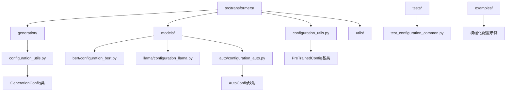
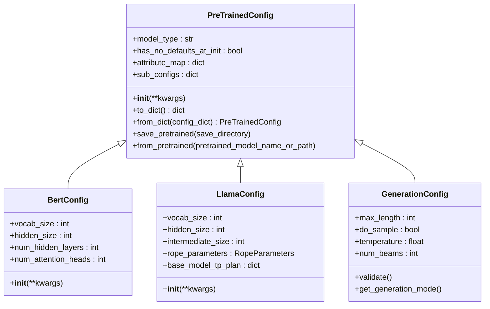
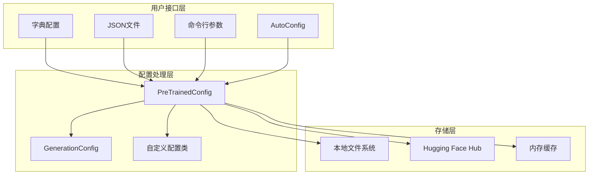
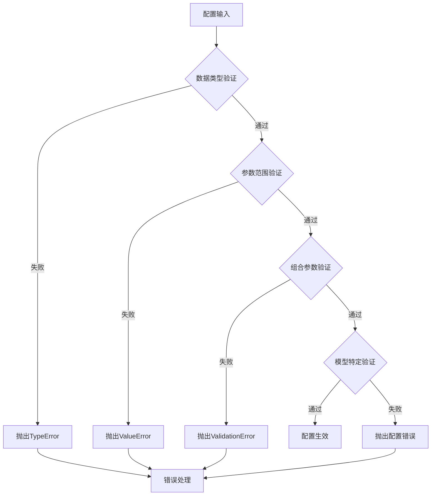
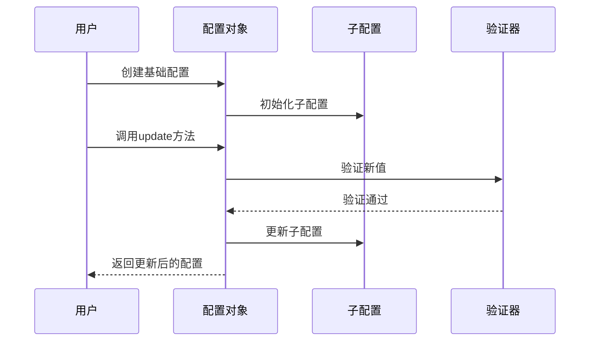
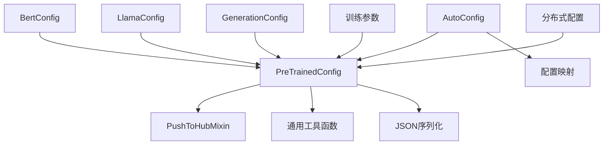

# 模型配置管理

<cite>
**本文档中引用的文件**
- [configuration_utils.py](file://src/transformers/configuration_utils.py)
- [configuration_auto.py](file://src/transformers/models/auto/configuration_auto.py)
- [configuration_utils.py](file://src/transformers/generation/configuration_utils.py)
- [configuration_bert.py](file://src/transformers/models/bert/configuration_bert.py)
- [configuration_llama.py](file://src/transformers/models/llama/configuration_llama.py)
- [configuration_auto.py](file://src/transformers/models/auto/configuration_auto.py)
- [test_configuration_common.py](file://tests/test_configuration_common.py)
- [hf_argparser.py](file://src/transformers/hf_argparser.py)
- [chat.py](file://src/transformers/cli/chat.py)
</cite>

## 目录
1. [简介](#简介)
2. [项目结构](#项目结构)
3. [核心组件](#核心组件)
4. [架构概览](#架构概览)
5. [详细组件分析](#详细组件分析)
6. [依赖关系分析](#依赖关系分析)
7. [性能考虑](#性能考虑)
8. [故障排除指南](#故障排除指南)
9. [结论](#结论)

## 简介

Transformers库的模型配置管理系统是一个高度模块化和可扩展的框架，用于管理和操作各种深度学习模型的配置参数。该系统的核心是`PreTrainedConfig`基类，它为所有模型配置提供了统一的接口和功能。配置管理系统支持多种输入格式（字典、JSON文件、命令行参数），提供了强大的验证机制，并实现了灵活的继承和覆盖功能。

## 项目结构

配置管理系统主要分布在以下目录结构中：



**图表来源**
- [configuration_utils.py](file://src/transformers/configuration_utils.py#L1-L50)
- [configuration_utils.py](file://src/transformers/generation/configuration_utils.py#L1-L50)

## 核心组件

### PreTrainedConfig基类

`PreTrainedConfig`是整个配置系统的核心基类，提供了所有模型配置的基础功能：

- **通用属性管理**：处理所有模型共有的参数，如`vocab_size`、`hidden_size`等
- **序列化功能**：支持JSON序列化和反序列化
- **版本兼容性**：维护与不同版本的向后兼容性
- **自动类注册**：支持自动类映射和发现

### 配置继承体系

配置系统采用多层次的继承结构：



**图表来源**
- [configuration_utils.py](file://src/transformers/configuration_utils.py#L50-L150)
- [configuration_bert.py](file://src/transformers/models/bert/configuration_bert.py#L20-L80)
- [configuration_llama.py](file://src/transformers/models/llama/configuration_llama.py#L20-L120)

**章节来源**
- [configuration_utils.py](file://src/transformers/configuration_utils.py#L50-L200)
- [configuration_bert.py](file://src/transformers/models/bert/configuration_bert.py#L1-L127)
- [configuration_llama.py](file://src/transformers/models/llama/configuration_llama.py#L1-L193)

## 架构概览

配置管理系统采用分层架构设计，确保了灵活性和可扩展性：



**图表来源**
- [configuration_utils.py](file://src/transformers/configuration_utils.py#L600-L800)
- [configuration_auto.py](file://src/transformers/models/auto/configuration_auto.py#L1-L100)

## 详细组件分析

### 配置创建和修改

#### 字典方式创建配置

配置可以通过Python字典直接创建：

```python
# 基本配置创建
config_dict = {
    "vocab_size": 30522,
    "hidden_size": 768,
    "num_hidden_layers": 12,
    "num_attention_heads": 12
}
config = BertConfig(**config_dict)

# 使用update方法修改配置
config.update({"hidden_size": 1024})
```

#### JSON文件方式创建配置

支持从JSON文件加载配置：

```python
# 从JSON文件加载
config = BertConfig.from_json_file("bert_config.json")

# 保存到JSON文件
config.to_json_file("new_bert_config.json")
```

#### 命令行参数方式创建配置

通过命令行参数动态配置：

```python
# 使用HfArgumentParser解析命令行参数
from transformers import HfArgumentParser

parser = HfArgumentParser(BertConfig)
config, = parser.parse_args_into_dataclasses(["--hidden_size=1024", "--num_attention_heads=16"])
```

**章节来源**
- [configuration_utils.py](file://src/transformers/configuration_utils.py#L700-L900)
- [hf_argparser.py](file://src/transformers/hf_argparser.py#L300-L400)

### 配置验证流程

配置系统实现了多层次的验证机制：



**图表来源**
- [configuration_utils.py](file://src/transformers/configuration_utils.py#L1200-L1297)

#### 默认值机制

配置系统使用灵活的默认值机制：

```python
# 基于继承的默认值
class CustomConfig(PreTrainedConfig):
    def __init__(self, custom_param=42, **kwargs):
        super().__init__(**kwargs)
        self.custom_param = custom_param
        
        # 基于父类默认值的条件设置
        if self.hidden_size > 1000:
            self.large_model_flag = True
```

**章节来源**
- [configuration_utils.py](file://src/transformers/configuration_utils.py#L200-L400)

### 配置继承和覆盖

#### 层次化配置结构

配置系统支持嵌套和层次化的配置结构：

```python
# 复合配置示例
class CompositeConfig(PreTrainedConfig):
    sub_configs = {
        "text_config": "BertConfig",
        "vision_config": "ViTConfig"
    }
    
    def __init__(self, **kwargs):
        super().__init__(**kwargs)
        
        # 初始化子配置
        self.text_config = BertConfig(**kwargs.get("text_config", {}))
        self.vision_config = ViTConfig(**kwargs.get("vision_config", {}))
```

#### 配置覆盖策略



**图表来源**
- [configuration_utils.py](file://src/transformers/configuration_utils.py#L900-L1000)

**章节来源**
- [configuration_utils.py](file://src/transformers/configuration_utils.py#L800-L1000)

### 配置与模型架构的绑定

#### 自动配置映射

AutoConfig系统提供了智能的配置映射：

```python
# 自动配置映射
from transformers import AutoConfig

# 基于模型名称自动选择配置类
config = AutoConfig.from_pretrained("bert-base-uncased")

# 获取配置类映射
config_mapping = AutoConfig.mapping
print(list(config_mapping.keys()))  # ['bert', 'gpt2', 'llama', ...]
```

#### 模型共享机制

配置系统支持模型间的参数共享：

```python
# 共享配置实例
common_config = BertConfig(hidden_size=768, num_attention_heads=12)

# 在多个模型间共享配置
model1 = BertModel(config=common_config)
model2 = BertModel(config=common_config)

# 修改共享配置会影响所有使用该配置的模型
common_config.hidden_size = 1024
```

**章节来源**
- [configuration_auto.py](file://src/transformers/models/auto/configuration_auto.py#L1-L200)

### 分布式训练中的配置作用

#### 张量并行配置

```python
# Llama模型的张量并行配置
llama_config = LlamaConfig(
    base_model_tp_plan={
        "layers.*.self_attn.q_proj": "colwise",
        "layers.*.self_attn.k_proj": "colwise", 
        "layers.*.self_attn.v_proj": "colwise",
        "layers.*.self_attn.o_proj": "rowwise",
        "layers.*.mlp.gate_proj": "colwise",
        "layers.*.mlp.up_proj": "colwise",
        "layers.*.mlp.down_proj": "rowwise",
    }
)
```

#### 流水线并行配置

```python
# 流水线并行计划
llama_config.base_model_pp_plan = {
    "embed_tokens": (["input_ids"], ["inputs_embeds"]),
    "layers": (["hidden_states", "attention_mask"], ["hidden_states"]),
    "norm": (["hidden_states"], ["hidden_states"]),
}
```

**章节来源**
- [configuration_llama.py](file://src/transformers/models/llama/configuration_llama.py#L80-L120)

## 依赖关系分析

配置系统的依赖关系展现了清晰的层次结构：



**图表来源**
- [configuration_utils.py](file://src/transformers/configuration_utils.py#L1-L50)
- [configuration_auto.py](file://src/transformers/models/auto/configuration_auto.py#L1-L50)

**章节来源**
- [configuration_utils.py](file://src/transformers/configuration_utils.py#L1-L100)
- [configuration_auto.py](file://src/transformers/models/auto/configuration_auto.py#L1-L100)

## 性能考虑

配置系统在设计时充分考虑了性能优化：

### 内存效率
- 使用懒加载机制减少内存占用
- 支持增量序列化以节省磁盘空间
- 实现了配置差异比较功能

### 加载速度
- 缓存机制避免重复加载
- 并行处理支持大型配置文件
- 智能预加载策略

### 扩展性
- 插件式配置扩展机制
- 动态配置注册支持
- 版本兼容性保证

## 故障排除指南

### 常见配置错误

#### 参数类型错误
```python
# 错误示例
config = BertConfig(hidden_size="768")  # 应该是整数而不是字符串

# 正确示例
config = BertConfig(hidden_size=768)
```

#### 参数范围错误
```python
# 错误示例
config = BertConfig(num_attention_heads=0)  # 至少需要1个注意力头

# 正确示例  
config = BertConfig(num_attention_heads=12)
```

#### 组合参数冲突
```python
# 错误示例
config = BertConfig(do_sample=True, num_beams=2)  # 采样模式不能使用束搜索

# 正确示例
config = BertConfig(do_sample=True)  # 或者
config = BertConfig(num_beams=4)
```

**章节来源**
- [configuration_utils.py](file://src/transformers/configuration_utils.py#L1200-L1297)

### 调试技巧

#### 配置验证
```python
# 验证配置的有效性
try:
    config.validate()
except ValueError as e:
    print(f"配置验证失败: {e}")
```

#### 配置差异比较
```python
# 比较两个配置的差异
config1 = BertConfig(hidden_size=768)
config2 = BertConfig(hidden_size=1024)

diff = config1.to_diff_dict()
print(diff)  # 只显示不同的参数
```

#### 配置转储
```python
# 导出完整的配置信息
config_dump = config.to_dict()
print(json.dumps(config_dump, indent=2))
```

## 结论

Transformers库的模型配置管理系统是一个设计精良、功能完备的框架，它成功地解决了深度学习模型配置管理的各种挑战。通过`PreTrainedConfig`基类的统一接口，系统实现了配置的标准化和规范化；通过AutoConfig的智能映射，系统提供了便捷的配置发现和加载能力；通过多层次的验证机制，系统确保了配置的正确性和可靠性。

该系统的主要优势包括：
- **统一性**：所有模型配置都遵循相同的接口规范
- **灵活性**：支持多种配置创建和修改方式
- **可扩展性**：易于添加新的配置类型和验证规则
- **性能优化**：内置缓存和优化机制
- **易用性**：简洁直观的API设计

对于开发者而言，理解这个配置管理系统的工作原理和最佳实践，将有助于更高效地使用Transformers库进行模型开发和部署。