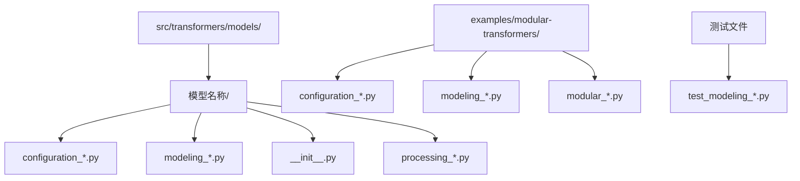
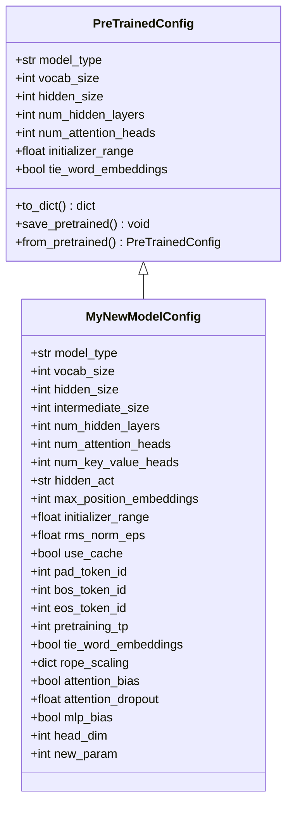
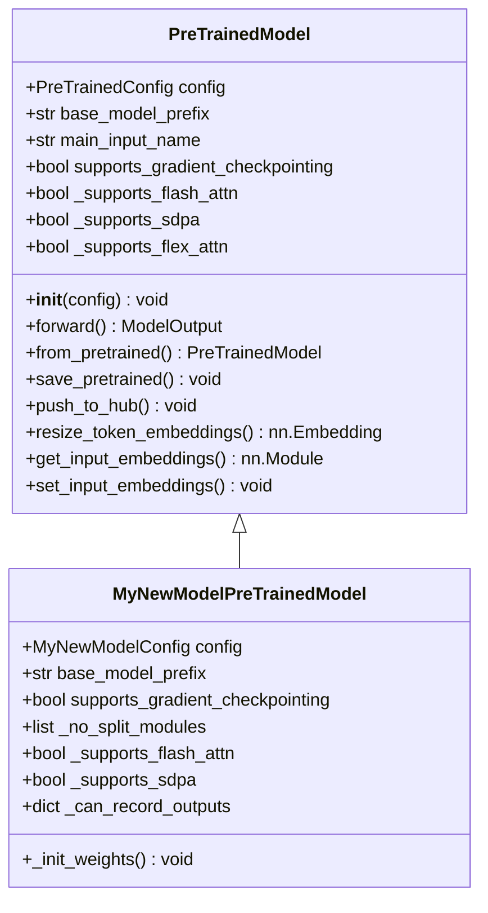
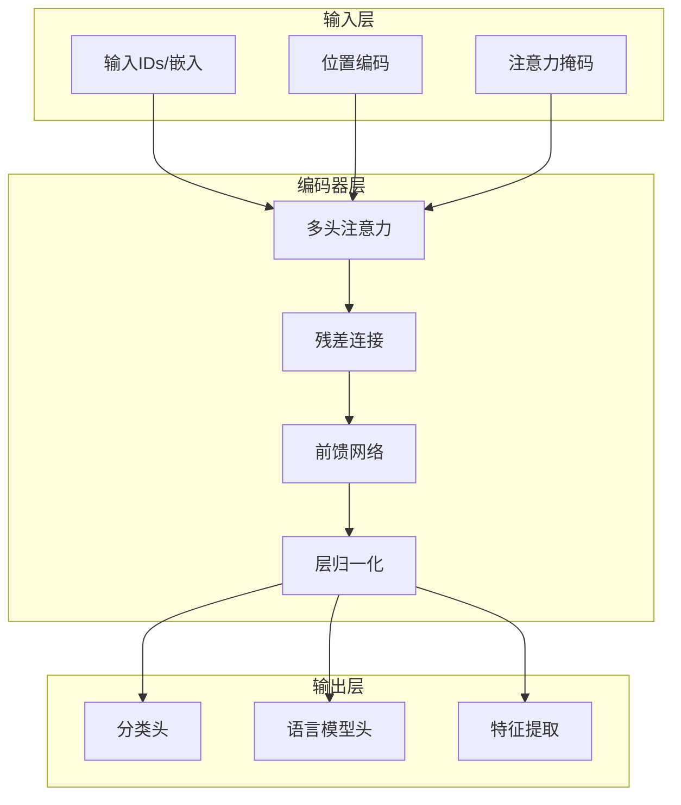
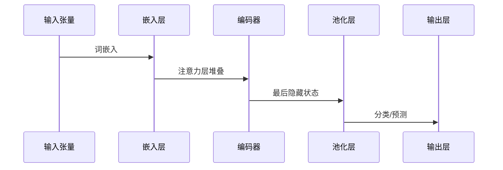
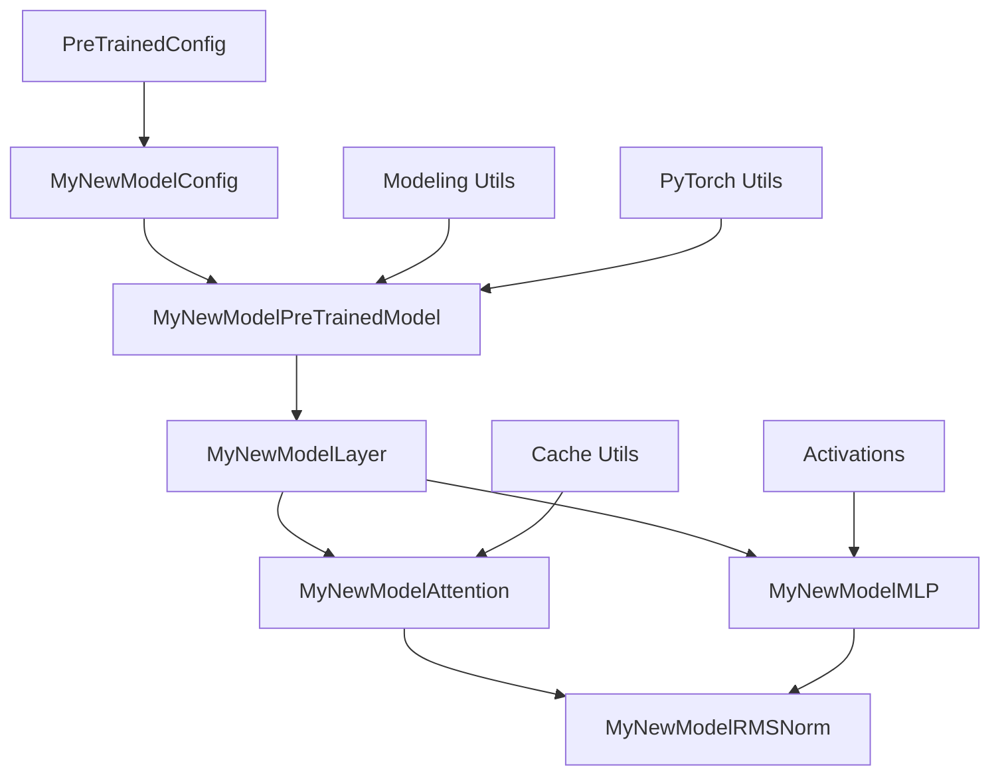

# 模型创建

<cite>
**本文档中引用的文件**
- [modeling_utils.py](file://src/transformers/modeling_utils.py)
- [configuration_utils.py](file://src/transformers/configuration_utils.py)
- [modeling_outputs.py](file://src/transformers/modeling_outputs.py)
- [modeling_my_new_model2.py](file://examples/modular-transformers/modeling_my_new_model2.py)
- [configuration_my_new_model.py](file://examples/modular-transformers/configuration_my_new_model.py)
- [modeling_dummy_bert.py](file://examples/modular-transformers/modeling_dummy_bert.py)
- [add_new_model_like.py](file://src/transformers/cli/add_new_model_like.py)
</cite>

## 目录
1. [简介](#简介)
2. [项目结构概览](#项目结构概览)
3. [核心组件](#核心组件)
4. [架构概览](#架构概览)
5. [详细组件分析](#详细组件分析)
6. [依赖关系分析](#依赖关系分析)
7. [性能考虑](#性能考虑)
8. [故障排除指南](#故障排除指南)
9. [结论](#结论)

## 简介

本文档提供了在Hugging Face Transformers库中创建新模型的全面指南。它涵盖了从基础配置类到复杂模型架构的所有必要步骤，包括最佳实践、代码示例和常见问题的解决方案。

Transformers库采用模块化设计，支持多种模型类型，包括文本、图像、音频和多模态模型。每个模型都遵循统一的架构模式，确保一致性和可维护性。

## 项目结构概览

Transformers库的模型创建遵循以下目录结构：



**图表来源**
- [modeling_my_new_model2.py](file://examples/modular-transformers/modeling_my_new_model2.py#L1-L50)
- [configuration_my_new_model.py](file://examples/modular-transformers/configuration_my_new_model.py#L1-L50)

**章节来源**
- [modeling_my_new_model2.py](file://examples/modular-transformers/modeling_my_new_model2.py#L1-L273)
- [configuration_my_new_model.py](file://examples/modular-transformers/configuration_my_new_model.py#L1-L214)

## 核心组件

### 配置类（Configuration）

配置类是模型架构的核心定义，负责存储所有超参数和配置选项。



**图表来源**
- [configuration_my_new_model.py](file://examples/modular-transformers/configuration_my_new_model.py#L15-L214)

### 基础模型类（PreTrainedModel）

所有模型都继承自`PreTrainedModel`基类，该类提供了通用功能：



**图表来源**
- [modeling_my_new_model2.py](file://examples/modular-transformers/modeling_my_new_model2.py#L220-L273)

**章节来源**
- [modeling_my_new_model2.py](file://examples/modular-transformers/modeling_my_new_model2.py#L220-L273)
- [configuration_my_new_model.py](file://examples/modular-transformers/configuration_my_new_model.py#L15-L214)

## 架构概览

Transformers模型架构遵循分层设计原则：



**图表来源**
- [modeling_dummy_bert.py](file://examples/modular-transformers/modeling_dummy_bert.py#L1-L100)
- [modeling_my_new_model2.py](file://examples/modular-transformers/modeling_my_new_model2.py#L1-L100)

## 详细组件分析

### 1. 配置类实现

配置类负责定义模型的所有超参数：

#### 关键属性说明

| 属性名 | 类型 | 默认值 | 描述 |
|--------|------|--------|------|
| `vocab_size` | int | 32000 | 词汇表大小 |
| `hidden_size` | int | 4096 | 隐藏层维度 |
| `num_hidden_layers` | int | 32 | 隐藏层数量 |
| `num_attention_heads` | int | 32 | 注意力头数量 |
| `intermediate_size` | int | 11008 | 中间层维度 |
| `hidden_act` | str | "silu" | 隐藏层激活函数 |
| `initializer_range` | float | 0.02 | 权重初始化范围 |
| `rms_norm_eps` | float | 1e-6 | RMS归一化的epsilon值 |

#### 自定义配置示例

```python
# 基于现有模型创建新配置
class NewModelConfig(PreTrainedConfig):
    model_type = "new_model"
    
    def __init__(self, 
                 vocab_size=32000,
                 hidden_size=4096,
                 num_hidden_layers=32,
                 num_attention_heads=32,
                 intermediate_size=11008,
                 hidden_act="silu",
                 max_position_embeddings=2048,
                 initializer_range=0.02,
                 rms_norm_eps=1e-6,
                 use_cache=True,
                 pad_token_id=None,
                 bos_token_id=1,
                 eos_token_id=2,
                 pretraining_tp=1,
                 tie_word_embeddings=False,
                 rope_scaling=None,
                 attention_bias=False,
                 attention_dropout=0.0,
                 mlp_bias=True,
                 head_dim=None,
                 new_param=0,
                 **kwargs):
        # 参数验证和设置
        self.vocab_size = vocab_size
        self.max_position_embeddings = max_position_embeddings
        self.hidden_size = hidden_size
        self.intermediate_size = intermediate_size
        self.num_hidden_layers = num_hidden_layers
        self.num_attention_heads = num_attention_heads
        
        # 计算派生参数
        if num_key_value_heads is None:
            num_key_value_heads = num_attention_heads
        self.num_key_value_heads = num_key_value_heads
        
        self.hidden_act = hidden_act
        self.initializer_range = initializer_range
        self.rms_norm_eps = rms_norm_eps
        self.pretraining_tp = pretraining_tp
        self.use_cache = use_cache
        self.attention_bias = attention_bias
        self.attention_dropout = attention_dropout
        self.mlp_bias = mlp_bias
        self.head_dim = head_dim if head_dim is not None else self.hidden_size // self.num_attention_heads
        
        # 处理RoPE参数
        rope_scaling = kwargs.pop("rope_scaling", None)
        self.rope_parameters = rope_scaling or rope_parameters
        
        super().__init__(
            pad_token_id=pad_token_id,
            bos_token_id=bos_token_id,
            eos_token_id=eos_token_id,
            tie_word_embeddings=tie_word_embeddings,
            **kwargs
        )
        self.new_param = new_param
```

### 2. 模型类实现

模型类实现具体的前向传播逻辑：

#### 基础模型结构



**图表来源**
- [modeling_dummy_bert.py](file://examples/modular-transformers/modeling_dummy_bert.py#L600-L780)

#### 关键组件实现

##### 嵌入层（Embeddings）
```python
class MyNewModelEmbeddings(nn.Module):
    def __init__(self, config):
        super().__init__()
        self.word_embeddings = nn.Embedding(config.vocab_size, config.hidden_size, 
                                          padding_idx=config.pad_token_id)
        self.position_embeddings = nn.Embedding(config.max_position_embeddings, config.hidden_size)
        self.token_type_embeddings = nn.Embedding(config.type_vocab_size, config.hidden_size)
        
        self.LayerNorm = nn.LayerNorm(config.hidden_size, eps=config.layer_norm_eps)
        self.dropout = nn.Dropout(config.hidden_dropout_prob)
        
    def forward(self, input_ids, token_type_ids=None, position_ids=None, inputs_embeds=None):
        # 实现嵌入逻辑
        pass
```

##### 注意力机制（Attention）
```python
class MyNewModelAttention(nn.Module):
    def __init__(self, config, layer_idx=None):
        super().__init__()
        self.config = config
        self.layer_idx = layer_idx
        
        # 注意力头配置
        self.num_attention_heads = config.num_attention_heads
        self.attention_head_size = config.hidden_size // config.num_attention_heads
        self.all_head_size = self.num_attention_heads * self.attention_head_size
        
        # 线性变换层
        self.query = nn.Linear(config.hidden_size, self.all_head_size)
        self.key = nn.Linear(config.hidden_size, self.all_head_size)
        self.value = nn.Linear(config.hidden_size, self.all_head_size)
        
        self.dropout = nn.Dropout(config.attention_probs_dropout_prob)
    
    def forward(self, hidden_states, attention_mask=None, past_key_value=None):
        # 实现注意力计算
        pass
```

##### 前馈网络（Feed Forward）
```python
class MyNewModelMLP(nn.Module):
    def __init__(self, config):
        super().__init__()
        self.gate_proj = nn.Linear(config.hidden_size, config.intermediate_size, bias=config.mlp_bias)
        self.up_proj = nn.Linear(config.hidden_size, config.intermediate_size, bias=config.mlp_bias)
        self.down_proj = nn.Linear(config.intermediate_size, config.hidden_size, bias=config.mlp_bias)
        self.act_fn = ACT2FN[config.hidden_act]
    
    def forward(self, x):
        down_proj = self.down_proj(self.act_fn(self.gate_proj(x)) * self.up_proj(x))
        return down_proj
```

### 3. 前向传播实现

前向传播函数是模型的核心逻辑：

```python
@auto_docstring
class MyNewModelForSequenceClassification(MyNewModelPreTrainedModel):
    def __init__(self, config):
        super().__init__(config)
        self.model = MyNewModelMainLayer(config)
        self.classifier = nn.Linear(config.hidden_size, config.num_labels)
        
        # 初始化权重
        self.post_init()
    
    def forward(self, 
                input_ids=None,
                attention_mask=None,
                token_type_ids=None,
                position_ids=None,
                inputs_embeds=None,
                labels=None,
                output_attentions=None,
                output_hidden_states=None,
                return_dict=None):
        
        # 调用主模型
        outputs = self.model(
            input_ids=input_ids,
            attention_mask=attention_mask,
            token_type_ids=token_type_ids,
            position_ids=position_ids,
            inputs_embeds=inputs_embeds,
            output_attentions=output_attentions,
            output_hidden_states=output_hidden_states,
            return_dict=return_dict
        )
        
        # 获取池化后的特征
        pooled_output = outputs[1]
        
        # 分类
        logits = self.classifier(pooled_output)
        
        loss = None
        if labels is not None:
            loss_fct = CrossEntropyLoss()
            loss = loss_fct(logits.view(-1, self.config.num_labels), labels.view(-1))
        
        if not return_dict:
            output = (logits,) + outputs[2:]
            return ((loss,) + output) if loss is not None else output
        
        return SequenceClassifierOutput(
            loss=loss,
            logits=logits,
            hidden_states=outputs.hidden_states,
            attentions=outputs.attentions
        )
```

### 4. 权重初始化

正确的权重初始化对模型训练至关重要：

```python
def _init_weights(self, module):
    """初始化权重"""
    if isinstance(module, nn.Linear):
        # 正态分布初始化
        module.weight.data.normal_(mean=0.0, std=self.config.initializer_range)
        if module.bias is not None:
            module.bias.data.zero_()
    elif isinstance(module, nn.Embedding):
        module.weight.data.normal_(mean=0.0, std=self.config.initializer_range)
        if module.padding_idx is not None:
            module.weight.data[module.padding_idx].zero_()
    elif isinstance(module, nn.LayerNorm):
        module.bias.data.zero_()
        module.weight.data.fill_(1.0)
    elif isinstance(module, MyNewModelLayer):
        # 特定层的初始化
        module.norm.weight.data.fill_(1.0)
```

**章节来源**
- [modeling_my_new_model2.py](file://examples/modular-transformers/modeling_my_new_model2.py#L220-L273)
- [configuration_my_new_model.py](file://examples/modular-transformers/configuration_my_new_model.py#L15-L214)
- [modeling_dummy_bert.py](file://examples/modular-transformers/modeling_dummy_bert.py#L600-L780)

## 依赖关系分析

模型创建涉及多个组件之间的复杂依赖关系：



**图表来源**
- [modeling_my_new_model2.py](file://examples/modular-transformers/modeling_my_new_model2.py#L1-L50)
- [configuration_my_new_model.py](file://examples/modular-transformers/configuration_my_new_model.py#L1-L50)

**章节来源**
- [modeling_my_new_model2.py](file://examples/modular-transformers/modeling_my_new_model2.py#L1-L273)
- [configuration_my_new_model.py](file://examples/modular-transformers/configuration_my_new_model.py#L1-L214)

## 性能考虑

### 内存优化

1. **梯度检查点（Gradient Checkpointing）**
```python
class MyNewModelPreTrainedModel(PreTrainedModel):
    supports_gradient_checkpointing = True
    _no_split_modules = ["MyNewModelLayer"]
```

2. **混合精度训练**
```python
# 在模型初始化时设置精度
model = MyNewModel.from_pretrained(
    "path/to/checkpoint",
    torch_dtype=torch.float16,
    device_map="auto"
)
```

3. **注意力优化**
```python
# 启用Flash Attention
model = MyNewModel.from_pretrained(
    "path/to/checkpoint",
    attn_implementation="flash_attention_2"
)
```

### 计算优化

1. **张量并行（Tensor Parallelism）**
```python
# 配置张量并行计划
base_model_tp_plan = {
    "layers.*.self_attn.q_proj": "colwise",
    "layers.*.self_attn.k_proj": "colwise", 
    "layers.*.self_attn.v_proj": "colwise",
    "layers.*.self_attn.o_proj": "rowwise",
    "layers.*.mlp.gate_proj": "colwise",
    "layers.*.mlp.up_proj": "colwise",
    "layers.*.mlp.down_proj": "rowwise",
}
```

2. **管道并行（Pipeline Parallelism）**
```python
base_model_pp_plan = {
    "embed_tokens": (["input_ids"], ["inputs_embeds"]),
    "layers": (["hidden_states", "attention_mask"], ["hidden_states"]),
    "norm": (["hidden_states"], ["hidden_states"]),
}
```

## 故障排除指南

### 常见问题及解决方案

#### 1. 内存不足错误
**问题**: CUDA out of memory
**解决方案**:
- 启用梯度检查点：`model.gradient_checkpointing_enable()`
- 使用混合精度：`torch_dtype=torch.float16`
- 减少批次大小
- 启用CPU卸载：`offload_state_dict=True`

#### 2. 权重不匹配
**问题**: 加载预训练权重时出现键不匹配
**解决方案**:
```python
# 忽略特定键
config._keys_to_ignore_on_load_missing = ["some_key"]
config._keys_to_ignore_on_load_unexpected = ["another_key"]
```

#### 3. 注意力掩码问题
**问题**: 注意力掩码形状不匹配
**解决方案**:
```python
# 确保掩码形状正确
attention_mask = attention_mask[:, None, None, :]
```

#### 4. 多模态数据处理
**问题**: 不同模态数据格式不一致
**解决方案**:
```python
# 统一输入格式
def prepare_inputs(self, texts, images):
    text_inputs = self.tokenizer(texts, return_tensors="pt")
    image_inputs = self.image_processor(images, return_tensors="pt")
    
    # 合并输入
    return {**text_inputs, **image_inputs}
```

**章节来源**
- [modeling_utils.py](file://src/transformers/modeling_utils.py#L1643-L2247)

## 结论

本文档提供了在Hugging Face Transformers库中创建新模型的完整指南。关键要点包括：

1. **模块化设计**: 遵循配置-模型分离的设计模式
2. **继承体系**: 正确继承基类并实现必需的方法
3. **权重初始化**: 使用适当的初始化策略
4. **性能优化**: 利用现代优化技术提升效率
5. **兼容性**: 确保与现有工具链的兼容性

通过遵循这些最佳实践，开发者可以创建高质量、高性能的深度学习模型，并将其集成到Transformers生态系统中。