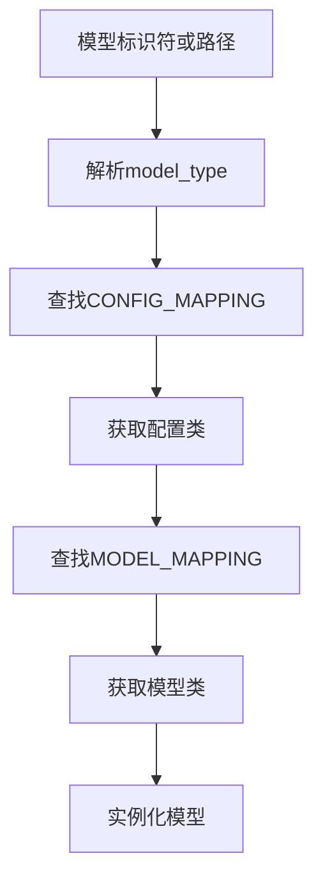
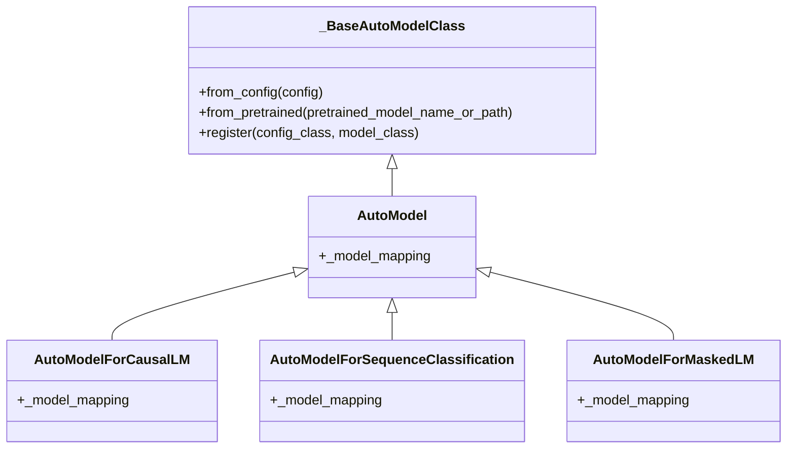

# 模型注册

<cite>
**本文档中引用的文件**   
- [modeling_auto.py](file://src/transformers/models/auto/modeling_auto.py)
- [configuration_auto.py](file://src/transformers/models/auto/configuration_auto.py)
- [auto_factory.py](file://src/transformers/models/auto/auto_factory.py)
- [__init__.py](file://src/transformers/models/__init__.py)
- [configuration_bert.py](file://src/transformers/models/bert/configuration_bert.py)
- [modeling_bert.py](file://src/transformers/models/bert/modeling_bert.py)
- [test_modeling_auto.py](file://tests/models/auto/test_modeling_auto.py)
</cite>

## 目录
1. [引言](#引言)
2. [模型注册机制](#模型注册机制)
3. [AutoModel系统架构](#automodel系统架构)
4. [模型注册流程](#模型注册流程)
5. [命名规范](#命名规范)
6. [实际案例](#实际案例)
7. [常见错误排查](#常见错误排查)
8. [结论](#结论)

## 引言
本文档详细介绍了在Transformers库中将新模型注册到AutoModel系统的过程。AutoModel系统采用工厂模式，允许用户通过`AutoModel.from_pretrained()`方法动态加载各种预训练模型。本文将全面解释模型注册的内部机制、配置要求、实现步骤以及常见问题的解决方案。

## 模型注册机制

Transformers库中的模型注册机制基于工厂模式实现，通过映射配置类和模型类来实现自动模型加载。核心机制包括配置映射和模型映射两个部分。

配置映射（CONFIG_MAPPING）将模型类型字符串与相应的配置类关联，而模型映射（MODEL_MAPPING）则将配置类与具体的模型实现类关联。当用户调用`AutoModel.from_pretrained()`时，系统首先根据模型标识符或配置文件中的`model_type`字段确定配置类，然后通过模型映射找到对应的模型类并实例化。



**Diagram sources**
- [modeling_auto.py](file://src/transformers/models/auto/modeling_auto.py#L1813-L1838)
- [configuration_auto.py](file://src/transformers/models/auto/configuration_auto.py#L1369-L1393)

**Section sources**
- [modeling_auto.py](file://src/transformers/models/auto/modeling_auto.py#L1813-L1838)
- [configuration_auto.py](file://src/transformers/models/auto/configuration_auto.py#L1369-L1393)

## AutoModel系统架构

AutoModel系统由多个组件构成，包括基础自动模型类、各种特定任务的自动模型类以及映射管理器。系统采用延迟加载机制，只有在实际需要时才导入相应的模型模块。

系统架构中的核心组件是`_BaseAutoModelClass`，它定义了自动模型的基本行为，包括从配置和预训练模型加载实例的方法。各种特定任务的自动模型类（如`AutoModelForCausalLM`、`AutoModelForSequenceClassification`等）都继承自这个基类，并通过不同的模型映射来支持特定任务。



**Diagram sources**
- [modeling_auto.py](file://src/transformers/models/auto/modeling_auto.py#L182-L217)
- [auto_factory.py](file://src/transformers/models/auto/auto_factory.py#L182-L217)

**Section sources**
- [modeling_auto.py](file://src/transformers/models/auto/modeling_auto.py#L182-L217)
- [auto_factory.py](file://src/transformers/models/auto/auto_factory.py#L182-L217)

## 模型注册流程

将新模型注册到AutoModel系统需要遵循特定的流程，主要包括在`models/__init__.py`中添加模型映射、确保配置类正确设置以及验证模型类的命名规范。

### 添加模型映射

在`src/transformers/models/auto/modeling_auto.py`文件中，有多个映射字典用于不同类型的自动模型。要注册新模型，需要在相应的映射中添加条目：

```python
MODEL_MAPPING_NAMES = OrderedDict([
    # Base model mapping
    ("new_model", "NewModel"),
    # ... 其他模型
])

MODEL_FOR_CAUSAL_LM_MAPPING_NAMES = OrderedDict([
    # Model for Causal LM mapping
    ("new_model", "NewModelForCausalLM"),
    # ... 其他模型
])

MODEL_FOR_SEQUENCE_CLASSIFICATION_MAPPING_NAMES = OrderedDict([
    # Model for Sequence Classification mapping
    ("new_model", "NewModelForSequenceClassification"),
    # ... 其他模型
])
```

每个映射字典都使用模型类型字符串作为键，模型类名作为值。对于支持多种任务的模型，需要在多个映射中添加相应的条目。

### 配置类注册

模型的配置类必须正确设置`model_type`属性，这是AutoModel系统识别模型类型的关键。以BERT模型为例：

```python
class BertConfig(PreTrainedConfig):
    model_type = "bert"
    
    def __init__(self, **kwargs):
        super().__init__(**kwargs)
        # 配置参数
```

`model_type`属性的值应该与映射字典中的键一致。当系统解析模型配置时，会使用这个属性来查找对应的模型实现。

### 模型类注册

模型类的实现需要遵循特定的命名规范，并正确关联其配置类。模型类通常通过`config_class`属性指定其对应的配置类：

```python
class NewModel(PreTrainedModel):
    config_class = NewModelConfig
    # 模型实现
```

这种关联确保了AutoModel系统能够正确地将配置与模型实现匹配。

**Section sources**
- [modeling_auto.py](file://src/transformers/models/auto/modeling_auto.py#L1813-L1838)
- [configuration_bert.py](file://src/transformers/models/bert/configuration_bert.py#L0-L126)
- [modeling_bert.py](file://src/transformers/models/bert/modeling_bert.py#L0-L199)

## 命名规范

为了确保AutoModel系统的兼容性，模型和配置类的命名需要遵循严格的规范。这些规范包括文件命名、类命名和模块结构等方面。

### 文件和模块命名

模型相关的文件应该按照以下模式组织：
- 配置文件：`configuration_{model_name}.py`
- 模型实现文件：`modeling_{model_name}.py`
- 分词器文件：`tokenization_{model_name}.py` 和 `tokenization_{model_name}_fast.py`

这些文件应该放在`src/transformers/models/{model_name}/`目录下，其中`{model_name}`是模型的小写名称。

### 类命名规范

模型和配置类的命名需要遵循以下规则：
- 配置类：`{ModelName}Config`
- 基础模型类：`{ModelName}Model`
- 因果语言模型类：`{ModelName}ForCausalLM`
- 序列分类模型类：`{ModelName}ForSequenceClassification`
- 掩码语言模型类：`{ModelName}ForMaskedLM`
- 问答模型类：`{ModelName}ForQuestionAnswering`

其中`{ModelName}`是模型名称的驼峰命名形式。例如，对于名为"new_model"的模型，其配置类应命名为`NewModelConfig`，基础模型类应命名为`NewModelModel`。

### 模型类型字符串

在映射字典中使用的模型类型字符串应该是小写的模型名称，不包含特殊字符。这个字符串需要与配置类中的`model_type`属性值完全匹配。

**Section sources**
- [__init__.py](file://src/transformers/models/__init__.py#L0-L399)
- [configuration_bert.py](file://src/transformers/models/bert/configuration_bert.py#L0-L126)
- [modeling_bert.py](file://src/transformers/models/bert/modeling_bert.py#L0-L199)

## 实际案例

本节通过一个实际案例展示如何将新模型正确注册到AutoModel系统，并确保能够通过`AutoModel.from_pretrained()`方法加载。

### 案例：注册新模型"MyNewModel"

假设我们要注册一个名为"MyNewModel"的新模型，以下是完整的注册步骤：

1. **创建模型目录和文件结构**
```
src/transformers/models/mynewmodel/
├── __init__.py
├── configuration_mynewmodel.py
├── modeling_mynewmodel.py
```

2. **实现配置类**
```python
# configuration_mynewmodel.py
class MyNewModelConfig(PreTrainedConfig):
    model_type = "mynewmodel"
    
    def __init__(self, vocab_size=30522, hidden_size=768, **kwargs):
        super().__init__(**kwargs)
        self.vocab_size = vocab_size
        self.hidden_size = hidden_size
```

3. **实现模型类**
```python
# modeling_mynewmodel.py
class MyNewModel(PreTrainedModel):
    config_class = MyNewModelConfig
    
    def __init__(self, config):
        super().__init__(config)
        # 模型实现
        self.embeddings = nn.Embedding(config.vocab_size, config.hidden_size)
        
    def forward(self, input_ids, **kwargs):
        # 前向传播实现
        pass

class MyNewModelForCausalLM(PreTrainedModel):
    config_class = MyNewModelConfig
    
    def __init__(self, config):
        super().__init__(config)
        self.transformer = MyNewModel(config)
        self.lm_head = nn.Linear(config.hidden_size, config.vocab_size, bias=False)
        
    def forward(self, input_ids, **kwargs):
        # 因果语言模型前向传播
        pass
```

4. **更新映射字典**
在`modeling_auto.py`中添加映射条目：
```python
MODEL_MAPPING_NAMES = OrderedDict([
    ("mynewmodel", "MyNewModel"),
    # ... 其他模型
])

MODEL_FOR_CAUSAL_LM_MAPPING_NAMES = OrderedDict([
    ("mynewmodel", "MyNewModelForCausalLM"),
    # ... 其他模型
])
```

5. **验证模型加载**
```python
from transformers import AutoModel, AutoModelForCausalLM

# 加载基础模型
model = AutoModel.from_pretrained("path/to/mynewmodel")
assert isinstance(model, MyNewModel)

# 加载因果语言模型
lm_model = AutoModelForCausalLM.from_pretrained("path/to/mynewmodel")
assert isinstance(lm_model, MyNewModelForCausalLM)
```

这个案例展示了完整的模型注册流程，从文件创建到映射更新，再到最终的加载验证。

**Section sources**
- [modeling_auto.py](file://src/transformers/models/auto/modeling_auto.py#L1813-L1838)
- [configuration_bert.py](file://src/transformers/models/bert/configuration_bert.py#L0-L126)
- [modeling_bert.py](file://src/transformers/models/bert/modeling_bert.py#L0-L199)

## 常见错误排查

在模型注册过程中可能会遇到各种问题，本节列出常见错误及其解决方案。

### 配置类与模型类型不匹配

**错误信息**：
```
ValueError: The config you are passing has a `model_type` attribute that is not consistent with the model type you passed
```

**原因**：配置类中的`model_type`属性值与映射字典中的键不一致。

**解决方案**：确保配置类的`model_type`属性值与映射字典中的键完全匹配，包括大小写和拼写。

### 模型类未正确关联配置类

**错误信息**：
```
ValueError: The model class you are passing has a `config_class` attribute that is not consistent with the config class you passed
```

**原因**：模型类的`config_class`属性未正确设置，或设置的配置类与实际传递的配置类不匹配。

**解决方案**：在模型类中正确设置`config_class`属性，指向正确的配置类。

### 映射字典中缺少条目

**错误信息**：
```
ValueError: Unrecognized configuration class for this kind of AutoModel
```

**原因**：在相应的映射字典中缺少模型类型的条目。

**解决方案**：检查所有相关的映射字典（如`MODEL_MAPPING_NAMES`、`MODEL_FOR_CAUSAL_LM_MAPPING_NAMES`等），确保在需要的映射中添加了正确的条目。

### 动态导入问题

**错误信息**：
```
Could not find {attr} neither in {module} nor in {transformers_module}
```

**原因**：系统无法找到指定的模型类，可能是由于模块路径错误或类名拼写错误。

**解决方案**：检查模型文件的路径和命名是否符合规范，确保类名正确无误。

### 架构字段不匹配

**错误信息**：
```
The model is not compatible with the specified architecture
```

**原因**：配置中的`architectures`字段与实际的模型类名不匹配。

**解决方案**：确保配置中的`architectures`字段包含正确的模型类名，或者让系统使用映射字典中的默认值。

**Section sources**
- [modeling_auto.py](file://src/transformers/models/auto/modeling_auto.py#L182-L217)
- [configuration_auto.py](file://src/transformers/models/auto/configuration_auto.py#L1369-L1393)
- [test_modeling_auto.py](file://tests/models/auto/test_modeling_auto.py#L0-L199)

## 结论

本文档全面介绍了Transformers库中AutoModel系统的模型注册机制。通过理解工厂模式的实现原理、掌握正确的注册流程和命名规范，开发者可以成功地将新模型集成到AutoModel系统中。

关键要点包括：
- 模型注册依赖于配置映射和模型映射两个核心机制
- 必须在`modeling_auto.py`的相应映射字典中添加模型条目
- 配置类必须正确设置`model_type`属性
- 模型类需要遵循严格的命名规范并与配置类正确关联
- 可以通过`AutoModel.from_pretrained()`方法验证注册是否成功

遵循这些指导原则，可以确保新模型与AutoModel系统的完全兼容性，为用户提供一致和便捷的模型加载体验。