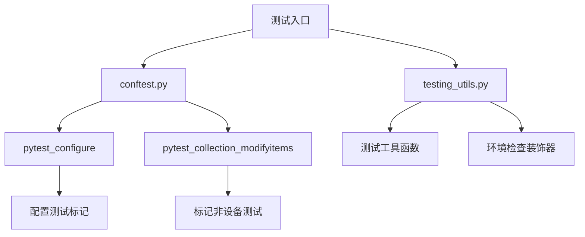
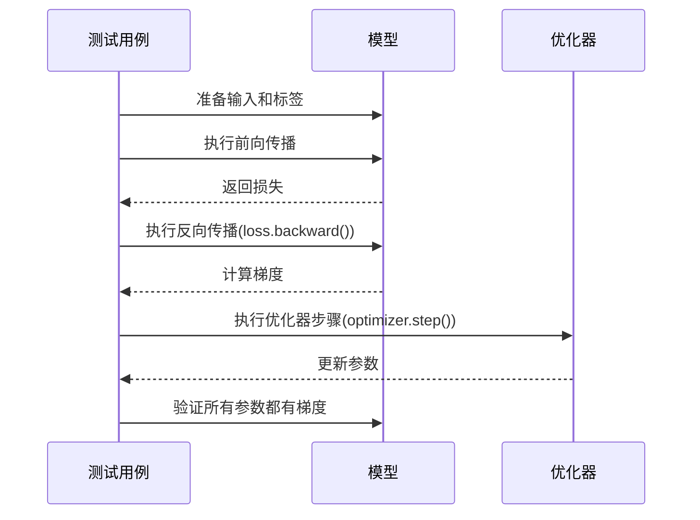
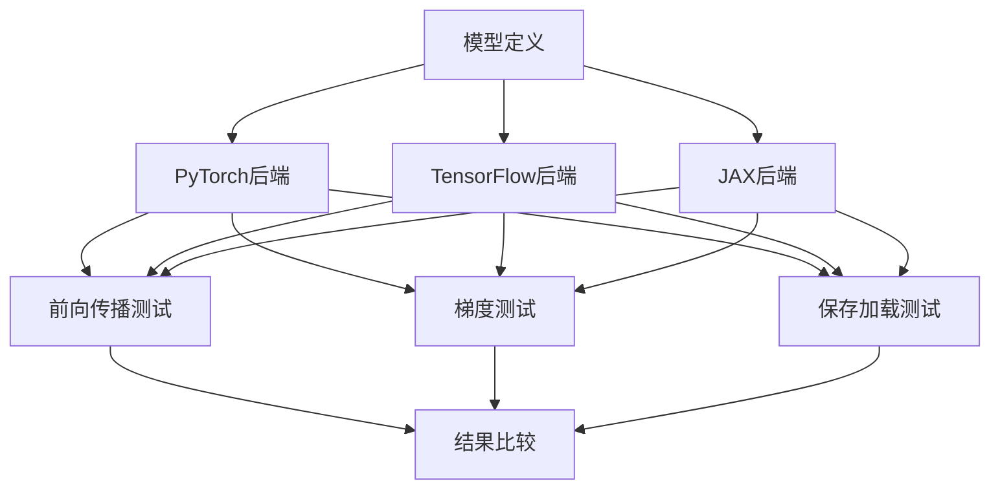

# 模型测试

<cite>
**本文档中引用的文件**  
- [test_modeling_common.py](file://tests/test_modeling_common.py)
- [testing_utils.py](file://src/transformers/testing_utils.py)
- [conftest.py](file://conftest.py)
- [test_modeling_bert.py](file://tests/models/bert/test_modeling_bert.py)
- [test_modeling_zamba2.py](file://tests/models/zamba2/test_modeling_zamba2.py)
- [test_modeling_zamba.py](file://tests/models/zamba/test_modeling_zamba.py)
- [test_modeling_maskformer.py](file://tests/models/maskformer/test_modeling_maskformer.py)
- [test_modeling_layoutlmv2.py](file://tests/models/layoutlmv2/test_modeling_layoutlmv2.py)
</cite>

## 目录
1. [引言](#引言)
2. [测试框架与工具](#测试框架与工具)
3. [核心测试类型](#核心测试类型)
4. [测试覆盖率与验证要求](#测试覆盖率与验证要求)
5. [跨后端兼容性测试](#跨后端兼容性测试)
6. [性能基准测试](#性能基准测试)
7. [测试用例编写实践](#测试用例编写实践)
8. [结论](#结论)

## 引言
本指南旨在为Hugging Face Transformers库中的新模型开发提供全面的测试要求和验证流程。文档详细说明了如何编写模型测试用例，包括前向传播、梯度计算、保存加载等关键测试类型。同时，本文档涵盖了测试覆盖率、数值精度验证和性能基准的具体要求，并通过实际案例展示如何使用unittest框架进行测试代码的编写。

## 测试框架与工具

### 测试基础设施
Transformers库使用pytest作为主要的测试框架，结合unittest.TestCase进行测试用例的组织和执行。测试代码主要位于`tests/`目录下，特别是`tests/models/`子目录中包含了针对各个模型的具体测试文件。



**图源**
- [conftest.py](file://conftest.py#L0-L152)
- [testing_utils.py](file://src/transformers/testing_utils.py#L0-L4079)

### 核心测试基类
`ModelTesterMixin`是所有模型测试的核心基类，定义了通用的测试方法和断言逻辑。该类位于`tests/test_modeling_common.py`文件中，为所有具体的模型测试提供了统一的接口和功能。

**测试基类功能**
- **前向传播测试**: 验证模型的基本前向传播功能
- **保存加载测试**: 确保模型可以正确保存和重新加载
- **梯度检查**: 验证训练过程中的梯度计算
- **确定性测试**: 确保相同输入产生相同输出
- **批处理等价性**: 验证批处理和单样本处理结果的一致性

**节源**
- [test_modeling_common.py](file://tests/test_modeling_common.py#L2729-L2740)

## 核心测试类型

### 前向传播测试
前向传播测试是模型测试的基础，验证模型在不同配置下的基本功能。测试用例需要覆盖模型的所有主要组件和功能变体。

```python
def create_and_check_model(self, config, input_ids, token_type_ids, input_mask, sequence_labels, token_labels, choice_labels):
    model = BertModel(config=config)
    model.to(torch_device)
    model.eval()
    result = model(input_ids, attention_mask=input_mask, token_type_ids=token_type_ids)
    self.parent.assertEqual(result.last_hidden_state.shape, (self.batch_size, self.seq_length, self.hidden_size))
    self.parent.assertEqual(result.pooler_output.shape, (self.batch_size, self.hidden_size))
```

**节源**
- [test_modeling_bert.py](file://tests/models/bert/test_modeling_bert.py#L0-L200)

### 梯度测试
梯度测试确保模型在训练过程中能够正确计算梯度，这对于模型的可训练性至关重要。测试包括梯度检查点功能的验证。



**图源**
- [test_modeling_common.py](file://tests/test_modeling_common.py#L1200-L1600)

### 保存加载测试
保存加载测试验证模型的持久化功能，确保模型可以在不同会话之间正确保存和恢复。

```python
def test_save_load(self):
    def check_save_load(out1, out2):
        out_2 = out2.cpu().numpy()
        out_2[np.isnan(out_2)] = 0
        out_2 = out_2[~np.isneginf(out_2)]
        
        out_1 = out1.cpu().numpy()
        out_1[np.isnan(out_1)] = 0
        out_1 = out_1[~np.isneginf(out_1)]
        max_diff = np.amax(np.abs(out_1 - out_2))
        self.assertLessEqual(max_diff, 1e-5)

    for model_class in self.all_model_classes:
        config, inputs_dict = self.model_tester.prepare_config_and_inputs_for_common()
        model = model_class(config)
        model.to(torch_device)
        model.eval()
        with torch.no_grad():
            first = model(**self._prepare_for_class(inputs_dict, model_class))[0]

        with tempfile.TemporaryDirectory() as tmpdirname:
            model.save_pretrained(tmpdirname)
            model = model_class.from_pretrained(tmpdirname)
            model.to(torch_device)
            with torch.no_grad():
                second = model(**self._prepare_for_class(inputs_dict, model_class))[0]
```

**节源**
- [test_modeling_common.py](file://tests/test_modeling_common.py#L800-L1200)

## 测试覆盖率与验证要求

### 数值精度验证
数值精度验证确保模型在不同设备和精度设置下的计算结果一致性。测试使用`torch.testing.assert_close`进行高精度比较。

```python
torch.testing.assert_close(
    logits[1, -1, :40].cpu(),
    EXPECTED_LOGITS_NO_GRAD_1,
    rtol=1e-3,
    atol=6e-3 if torch_device == "cpu" else 1e-3,
)
```

**节源**
- [test_modeling_zamba2.py](file://tests/models/zamba2/test_modeling_zamba2.py#L604-L628)

### 批处理等价性测试
批处理等价性测试验证模型在批量处理和单样本处理时输出的一致性，这对于确保模型的正确实现至关重要。

```python
def test_batching_equivalence(self, atol=1e-5, rtol=1e-5):
    def recursive_check(batched_object, single_row_object, model_name, key):
        if isinstance(batched_object, (list, tuple)):
            for batched_object_value, single_row_object_value in zip(batched_object, single_row_object):
                recursive_check(batched_object_value, single_row_object_value, model_name, key)
        elif batched_object is None or not isinstance(batched_object, torch.Tensor):
            return
        else:
            slice_ids = [slice(0, index) for index in single_row_object.shape]
            batched_row = batched_object[slice_ids]
            self.assertFalse(torch.isnan(batched_row).any())
            self.assertFalse(torch.isinf(batched_row).any())
            self.assertFalse(torch.isnan(single_row_object).any())
            self.assertFalse(torch.isinf(single_row_object).any())
            torch.testing.assert_close(batched_row, single_row_object, atol=atol, rtol=rtol)
```

**节源**
- [test_modeling_common.py](file://tests/test_modeling_common.py#L1200-L1600)

## 跨后端兼容性测试

### 多后端支持
Transformers库支持多种深度学习后端，包括PyTorch、TensorFlow和JAX。测试框架需要确保模型在不同后端下的行为一致性。



**图源**
- [test_modeling_maskformer.py](file://tests/models/maskformer/test_modeling_maskformer.py#L391-L417)
- [test_modeling_layoutlmv2.py](file://tests/models/layoutlmv2/test_modeling_layoutlmv2.py#L430-L456)

## 性能基准测试

### 基准测试框架
性能基准测试确保模型在不同硬件配置下的性能表现符合预期。测试包括推理速度、内存使用和训练效率的测量。

```python
def test_determinism(self):
    config, inputs_dict = self.model_tester.prepare_config_and_inputs_for_common()

    def check_determinism(first, second):
        if torch.all(torch.isnan(first)) and torch.all(torch.isnan(second)):
            return
            
        out_1 = first.cpu().numpy()
        out_2 = second.cpu().numpy()
        out_1 = out_1[~np.isnan(out_1)]
        out_2 = out_2[~np.isneginf(out_2)]
        max_diff = np.amax(np.abs(out_1 - out_2))
        self.assertLessEqual(max_diff, 1e-5)
```

**节源**
- [test_modeling_common.py](file://tests/test_modeling_common.py#L800-L1200)

## 测试用例编写实践

### 测试类结构
每个模型测试类都遵循特定的结构模式，继承自`ModelTesterMixin`并实现具体的测试逻辑。

```python
class BertModelTester:
    def __init__(
        self,
        parent,
        batch_size=13,
        seq_length=7,
        is_training=True,
        use_input_mask=True,
        use_token_type_ids=True,
        use_labels=True,
        vocab_size=99,
        hidden_size=32,
        num_hidden_layers=2,
        num_attention_heads=4,
        intermediate_size=37,
        hidden_act="gelu",
        hidden_dropout_prob=0.1,
        attention_probs_dropout_prob=0.1,
        max_position_embeddings=512,
        type_vocab_size=16,
        type_sequence_label_size=2,
        initializer_range=0.02,
        num_labels=3,
        num_choices=4,
        scope=None,
    ):
        self.parent = parent
        self.batch_size = batch_size
        self.seq_length = seq_length
        self.is_training = is_training
        self.use_input_mask = use_input_mask
        self.use_token_type_ids = use_token_type_ids
        self.use_labels = use_labels
        self.vocab_size = vocab_size
        self.hidden_size = hidden_size
        self.num_hidden_layers = num_hidden_layers
        self.num_attention_heads = num_attention_heads
        self.intermediate_size = intermediate_size
        self.hidden_act = hidden_act
        self.hidden_dropout_prob = hidden_dropout_prob
        self.attention_probs_dropout_prob = attention_probs_dropout_prob
        self.max_position_embeddings = max_position_embeddings
        self.type_vocab_size = type_vocab_size
        self.type_sequence_label_size = type_sequence_label_size
        self.initializer_range = initializer_range
        self.num_labels = num_labels
        self.num_choices = num_choices
        self.scope = scope
```

**节源**
- [test_modeling_bert.py](file://tests/models/bert/test_modeling_bert.py#L0-L200)

### 测试装饰器
测试装饰器用于控制测试的执行条件和环境要求，确保测试在适当的环境下运行。

```python
@require_torch
class ModelTesterMixin:
    model_tester = None
    all_model_classes = ()
    test_resize_embeddings = True
    test_resize_position_embeddings = False
    test_mismatched_shapes = True
    test_missing_keys = True
    test_torch_exportable = False
```

**节源**
- [testing_utils.py](file://src/transformers/testing_utils.py#L0-L4079)

## 结论
本指南提供了Transformers库中模型测试的全面框架和最佳实践。通过遵循这些测试要求和验证流程，可以确保新模型的质量和可靠性。测试不仅涵盖了基本的功能验证，还包括了数值精度、性能基准和跨后端兼容性等高级验证需求。建议在开发新模型时，严格按照本指南的要求编写测试用例，以确保模型的高质量和可维护性。