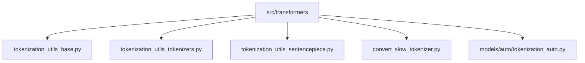
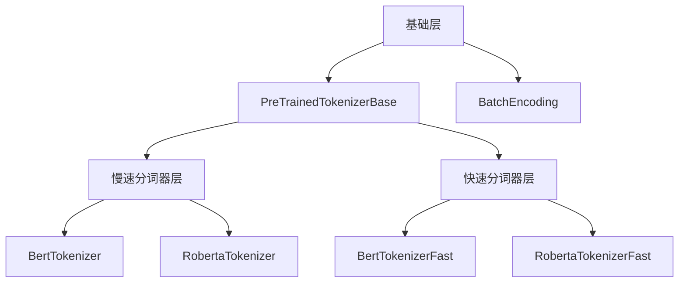
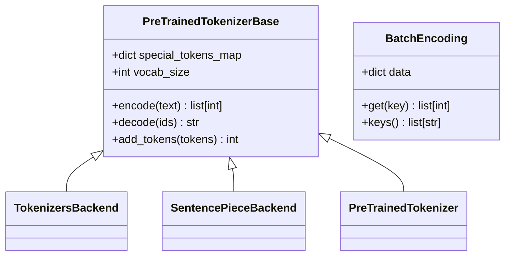
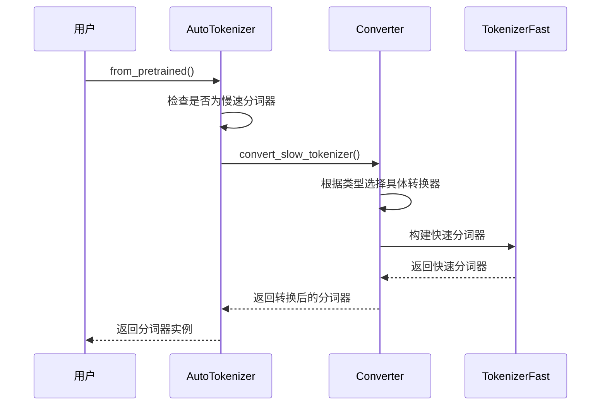
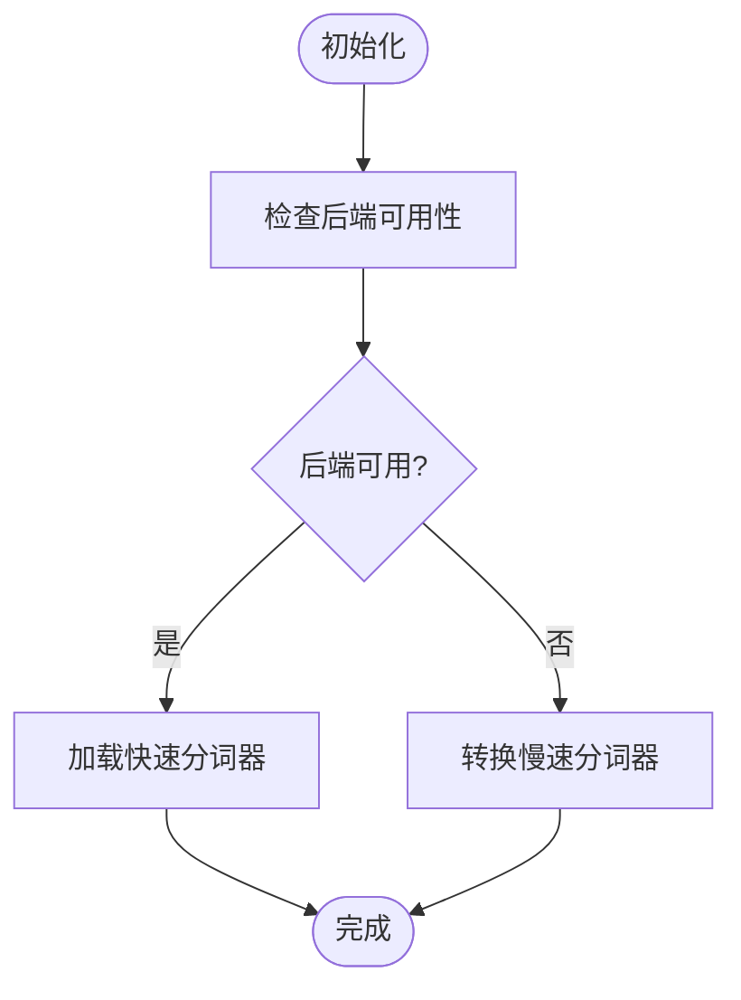
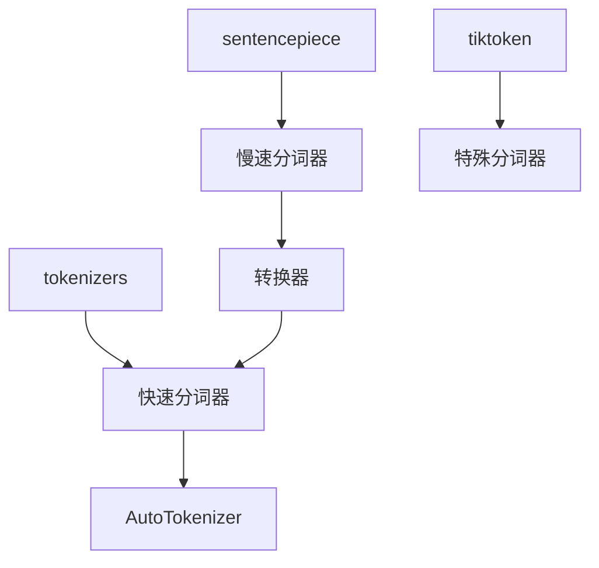

# 分词器重构

<cite>
**本文档中引用的文件**   
- [convert_slow_tokenizer.py](file://src/transformers/convert_slow_tokenizer.py)
- [tokenization_utils_base.py](file://src/transformers/tokenization_utils_base.py)
- [tokenization_utils_tokenizers.py](file://src/transformers/tokenization_utils_tokenizers.py)
- [tokenization_utils_sentencepiece.py](file://src/transformers/tokenization_utils_sentencepiece.py)
- [tokenization_auto.py](file://src/transformers/models/auto/tokenization_auto.py)
- [convert_slow_tokenizers_checkpoints_to_fast.py](file://src/transformers/convert_slow_tokenizers_checkpoints_to_fast.py)
- [check_tokenizers.py](file://scripts/check_tokenizers.py)
</cite>

## 目录
1. [简介](#简介)
2. [项目结构](#项目结构)
3. [核心组件](#核心组件)
4. [架构概述](#架构概述)
5. [详细组件分析](#详细组件分析)
6. [依赖分析](#依赖分析)
7. [性能考虑](#性能考虑)
8. [故障排除指南](#故障排除指南)
9. [结论](#结论)

## 简介
本文档详细分析了Transformers库中分词器系统的重构，重点关注从慢速分词器（基于Python）到快速分词器（基于Rust的tokenizers库）的转换机制。该重构旨在提高分词性能，同时保持与现有模型和工作流的兼容性。

## 项目结构
分词器相关的核心文件分布在`src/transformers`目录下，主要包含基础工具、慢速分词器、快速分词器以及转换逻辑。

**Diagram sources**
- [tokenization_utils_base.py](file://src/transformers/tokenization_utils_base.py)
- [tokenization_utils_tokenizers.py](file://src/transformers/tokenization_utils_tokenizers.py)
- [tokenization_utils_sentencepiece.py](file://src/transformers/tokenization_utils_sentencepiece.py)
- [convert_slow_tokenizer.py](file://src/transformers/convert_slow_tokenizer.py)
- [tokenization_auto.py](file://src/transformers/models/auto/tokenization_auto.py)

## 核心组件
分词器系统的核心组件包括基础类、慢速分词器、快速分词器和转换器。这些组件共同实现了分词功能的抽象和具体实现。

**Section sources**
- [tokenization_utils_base.py](file://src/transformers/tokenization_utils_base.py)
- [tokenization_utils_tokenizers.py](file://src/transformers/tokenization_utils_tokenizers.py)
- [tokenization_utils_sentencepiece.py](file://src/transformers/tokenization_utils_sentencepiece.py)

## 架构概述
分词器系统的架构分为三层：基础层提供通用功能，慢速分词器层实现具体的分词逻辑，快速分词器层提供高性能的分词实现。

**Diagram sources**
- [tokenization_utils_base.py](file://src/transformers/tokenization_utils_base.py)
- [tokenization_utils_tokenizers.py](file://src/transformers/tokenization_utils_tokenizers.py)
- [tokenization_utils_sentencepiece.py](file://src/transformers/tokenization_utils_sentencepiece.py)

## 详细组件分析

### 基础组件分析
基础组件提供了分词器系统的核心功能，包括特殊令牌处理、编码和解码等。

**Diagram sources**
- [tokenization_utils_base.py](file://src/transformers/tokenization_utils_base.py)

### 转换器组件分析
转换器组件负责将慢速分词器转换为快速分词器，确保功能一致性和性能提升。

**Diagram sources**
- [convert_slow_tokenizer.py](file://src/transformers/convert_slow_tokenizer.py)
- [tokenization_utils_tokenizers.py](file://src/transformers/tokenization_utils_tokenizers.py)

### 快速分词器组件分析
快速分词器组件基于Rust的tokenizers库，提供高性能的分词实现。

**Diagram sources**
- [tokenization_utils_tokenizers.py](file://src/transformers/tokenization_utils_tokenizers.py)

## 依赖分析
分词器系统依赖于多个外部库和内部模块，这些依赖关系确保了系统的完整性和功能性。

**Diagram sources**
- [tokenization_utils_tokenizers.py](file://src/transformers/tokenization_utils_tokenizers.py)
- [tokenization_utils_sentencepiece.py](file://src/transformers/tokenization_utils_sentencepiece.py)
- [convert_slow_tokenizer.py](file://src/transformers/convert_slow_tokenizer.py)

## 性能考虑
分词器重构的主要目标是提高性能。快速分词器通过使用Rust实现，显著提升了分词速度，特别是在处理大规模文本时。

## 故障排除指南
在使用分词器时，可能会遇到一些常见问题，如分词结果不一致、性能问题等。以下是一些常见的故障排除方法：

**Section sources**
- [check_tokenizers.py](file://scripts/check_tokenizers.py)
- [convert_slow_tokenizer.py](file://src/transformers/convert_slow_tokenizer.py)

## 结论
分词器重构是Transformers库中的一个重要改进，通过引入快速分词器，显著提升了分词性能。该重构保持了与现有模型和工作流的兼容性，同时为未来的优化提供了基础。