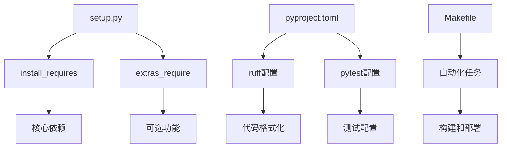
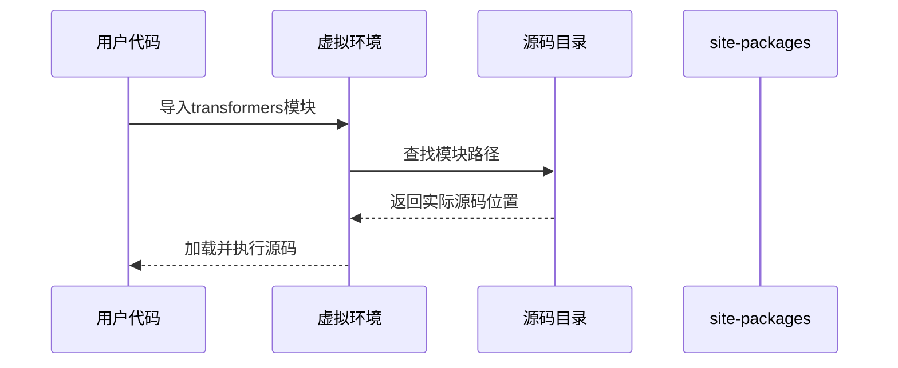
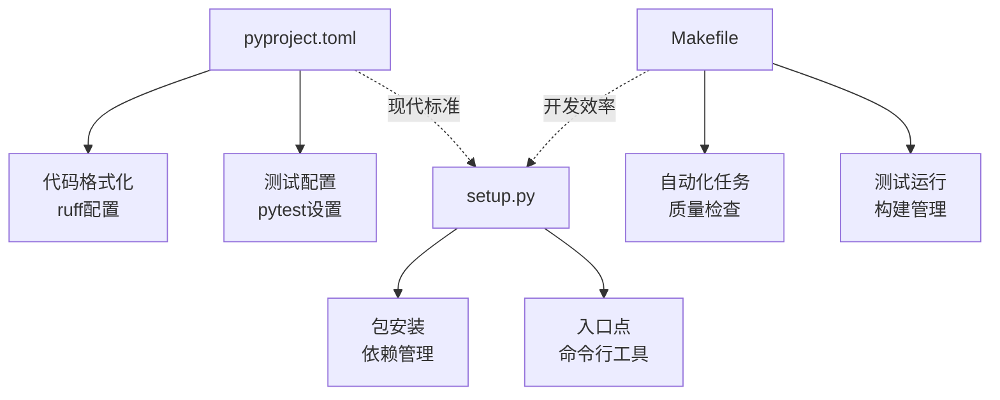

# 从源码安装

<cite>
**本文档中引用的文件**
- [README.md](file://README.md)
- [setup.py](file://setup.py)
- [pyproject.toml](file://pyproject.toml)
- [Makefile](file://Makefile)
- [CONTRIBUTING.md](file://CONTRIBUTING.md)
- [check_build.py](file://utils/check_build.py)
</cite>

## 目录
1. [简介](#简介)
2. [准备工作](#准备工作)
3. [克隆GitHub仓库](#克隆github仓库)
4. [安装依赖项](#安装依赖项)
5. [开发模式安装](#开发模式安装)
6. [文件结构与配置](#文件结构与配置)
7. [验证安装](#验证安装)
8. [环境配置指导](#环境配置指导)
9. [故障排除指南](#故障排除指南)
10. [总结](#总结)

## 简介

从源码安装transformers库是获取最新功能、参与开源贡献或进行深度定制的重要方式。本指南将详细介绍从克隆GitHub仓库到完成开发环境配置的完整流程，帮助您顺利安装并使用transformers库的最新版本。

transformers库作为最先进的预训练模型框架，支持文本、计算机视觉、音频、视频和多模态模型的推理和训练。通过源码安装，您可以：
- 获取最新的功能和修复
- 进行自定义开发和贡献
- 调试和修改核心代码
- 测试实验性功能

## 准备工作

在开始安装之前，请确保您的系统满足以下要求：

### 系统要求
- **Python版本**: 3.10或更高版本
- **操作系统**: 支持Windows、macOS和Linux
- **内存**: 至少4GB RAM（推荐8GB以上）
- **存储空间**: 至少2GB可用空间

### 必需工具
- **Git**: 版本控制系统
- **Python包管理器**: pip或uv
- **虚拟环境**: 推荐使用venv或uv venv

### 创建虚拟环境

```bash
# 使用venv创建虚拟环境
python -m venv .transformers-env
source .transformers-env/bin/activate  # Linux/macOS
# 或
.\.transformers-env\Scripts\activate  # Windows

# 使用uv创建虚拟环境（更快）
uv venv .transformers-env
source .transformers-env/bin/activate  # Linux/macOS
```

## 克隆GitHub仓库

### 基本克隆命令

```bash
# 克隆主分支
git clone https://github.com/huggingface/transformers.git
cd transformers

# 如果需要特定分支
git clone -b main https://github.com/huggingface/transformers.git
cd transformers
```

### 分支选择策略

- **main分支**: 最稳定的生产版本
- **开发分支**: 包含最新功能和改进
- **特性分支**: 针对特定功能的开发分支

### 远程仓库配置

```bash
# 添加上游仓库以便同步更新
git remote add upstream https://github.com/huggingface/transformers.git

# 查看远程仓库配置
git remote -v
```

**节来源**
- [CONTRIBUTING.md](file://CONTRIBUTING.md#L253-L265)

## 安装依赖项

### 方法一：使用Makefile命令

transformers提供了专门的Makefile来简化依赖管理和安装过程。

#### 基本安装命令

```bash
# 安装所有依赖（包括开发工具）
make install

# 或者使用pip直接安装
pip install -e ".[dev]"
```

#### Makefile提供的其他有用命令

```bash
# 更新依赖版本表
make deps_table_update

# 检查代码质量
make quality

# 自动格式化代码
make style

# 运行测试
make test
```

### 方法二：直接使用pip命令

#### 开发模式安装

```bash
# 基本开发模式安装
pip install -e .

# 包含特定功能集
pip install -e ".[torch]"
pip install -e ".[dev]"
pip install -e ".[quality]"
```

#### 选项功能包

transformers支持多种功能扩展包：

| 功能包 | 描述 | 包含内容 |
|--------|------|----------|
| `[torch]` | PyTorch支持 | PyTorch、加速器 |
| `[dev]` | 开发环境 | 所有开发依赖 |
| `[quality]` | 代码质量 | 格式化、检查工具 |
| `[testing]` | 测试环境 | 测试框架和工具 |
| `[all]` | 完整功能 | 所有可选功能 |

### 依赖管理机制



**图表来源**
- [setup.py](file://setup.py#L449-L456)
- [pyproject.toml](file://pyproject.toml#L1-L74)

**节来源**
- [setup.py](file://setup.py#L449-L456)
- [Makefile](file://Makefile#L1-L137)

## 开发模式安装

### pip install -e .详解

开发模式安装（editable mode）是源码安装的核心优势：

#### 安装命令

```bash
# 开发模式安装
pip install -e .

# 包含特定功能的开发模式安装
pip install -e ".[dev]"
```

#### 开发模式的优势

1. **实时代码更新**: 修改源码后无需重新安装即可生效
2. **调试便利**: 可以设置断点并查看源码
3. **贡献友好**: 方便提交PR和代码审查
4. **资源节省**: 不会复制文件到site-packages目录

#### 开发模式的工作原理



**图表来源**
- [setup.py](file://setup.py#L449-L456)

### 环境隔离

#### 推荐的目录结构

```
project/
├── transformers/           # 源码克隆目录
├── .transformers-env/     # 虚拟环境
├── my-project/           # 您的项目
└── requirements.txt      # 项目依赖
```

#### 虚拟环境最佳实践

```bash
# 在项目根目录创建虚拟环境
python -m venv ../.transformers-env
source ../.transformers-env/bin/activate

# 安装transformers源码
cd transformers
pip install -e .
```

**节来源**
- [CONTRIBUTING.md](file://CONTRIBUTING.md#L270-L290)

## 文件结构与配置

### 关键配置文件

#### setup.py - 主要安装配置

setup.py是传统的Python包安装配置文件，定义了：

- **包基本信息**: 名称、版本、作者等
- **依赖关系**: 核心依赖和可选功能
- **入口点**: 命令行工具配置
- **包结构**: 包含哪些模块和文件

#### pyproject.toml - 现代配置标准

pyproject.toml遵循PEP 518标准，提供：

- **构建系统**: 指定构建工具
- **代码质量**: ruff格式化和检查配置
- **测试配置**: pytest参数设置
- **覆盖范围**: 测试覆盖率配置

#### Makefile - 自动化任务

Makefile提供了丰富的自动化任务：

- **代码质量**: 样式检查、格式化
- **测试运行**: 单元测试、集成测试
- **构建管理**: 发布准备、版本控制
- **开发辅助**: 依赖更新、一致性检查

### 文件关系图



**图表来源**
- [setup.py](file://setup.py#L1-L50)
- [pyproject.toml](file://pyproject.toml#L1-L74)
- [Makefile](file://Makefile#L1-L137)

**节来源**
- [setup.py](file://setup.py#L1-L456)
- [pyproject.toml](file://pyproject.toml#L1-L74)
- [Makefile](file://Makefile#L1-L137)

## 验证安装

### 基本导入测试

```python
# 基本功能测试
try:
    import transformers
    print(f"transformers版本: {transformers.__version__}")
    print("安装成功！")
except ImportError as e:
    print(f"安装失败: {e}")
```

### 功能完整性测试

#### 测试核心功能

```python
# 测试管道功能
from transformers import pipeline

try:
    # 文本分类管道
    classifier = pipeline("text-classification")
    result = classifier("我喜欢使用transformers库！")
    print("文本分类测试通过:", result)
    
    # 文本生成管道
    generator = pipeline("text-generation")
    result = generator("人工智能的未来是", max_length=50)
    print("文本生成测试通过")
    
except Exception as e:
    print(f"功能测试失败: {e}")
```

#### 测试模型加载

```python
# 测试模型加载
from transformers import AutoTokenizer, AutoModel

try:
    # 加载示例模型
    tokenizer = AutoTokenizer.from_pretrained("distilbert-base-uncased")
    model = AutoModel.from_pretrained("distilbert-base-uncased")
    print("模型加载测试通过")
    
except Exception as e:
    print(f"模型加载测试失败: {e}")
```

### 自动化验证脚本

transformers提供了内置的验证工具：

```bash
# 使用内置检查脚本
python utils/check_build.py --check_lib

# 运行完整的构建检查
make quality
```

### 性能基准测试

```python
# 简单性能测试
import time
from transformers import pipeline

def test_pipeline_performance():
    pipe = pipeline("text-generation", model="distilgpt2")
    
    start_time = time.time()
    result = pipe("人工智能", max_length=50)
    end_time = time.time()
    
    print(f"生成50个token耗时: {end_time - start_time:.2f}秒")
    return end_time - start_time

# 运行性能测试
test_pipeline_performance()
```

**节来源**
- [check_build.py](file://utils/check_build.py#L38-L49)

## 环境配置指导

### 开发环境配置

#### 推荐的开发工具

```bash
# 安装开发工具
pip install -e ".[dev]"

# 安装代码质量工具
pip install -e ".[quality]"

# 安装测试工具
pip install -e ".[testing]"
```

#### IDE配置建议

##### VS Code配置

```json
{
    "python.defaultInterpreterPath": "./.transformers-env/bin/python",
    "python.formatting.provider": "ruff",
    "python.linting.enabled": true,
    "python.linting.ruffEnabled": true,
    "python.testing.pytestEnabled": true
}
```

##### PyCharm配置

1. 设置解释器为虚拟环境
2. 启用Ruff代码检查
3. 配置pytest测试运行器

### 贡献者环境设置

#### Fork和同步工作流

```bash
# 1. Fork仓库（在GitHub上操作）
# 2. 克隆你的Fork
git clone https://github.com/YOUR_USERNAME/transformers.git
cd transformers

# 3. 添加上游仓库
git remote add upstream https://github.com/huggingface/transformers.git

# 4. 创建开发分支
git checkout -b feature/your-feature-name

# 5. 安装开发环境
pip install -e ".[dev]"
```

#### 代码规范检查

```bash
# 运行代码质量检查
make quality

# 自动修复可修复的问题
make fixup

# 运行一致性检查
make repo-consistency
```

### 多平台配置

#### Windows配置

```powershell
# 设置Git行尾转换
git config core.autocrlf input

# 使用WSL（推荐）
# 在WSL中按照Linux步骤操作
```

#### macOS配置

```bash
# 安装Homebrew（如果未安装）
/bin/bash -c "$(curl -fsSL https://raw.githubusercontent.com/Homebrew/install/HEAD/install.sh)"

# 安装Git
brew install git
```

#### Linux配置

```bash
# Ubuntu/Debian
sudo apt update
sudo apt install git python3-venv

# CentOS/RHEL/Fedora
sudo yum install git python3-virtualenv
# 或
sudo dnf install git python3-virtualenv
```

**节来源**
- [CONTRIBUTING.md](file://CONTRIBUTING.md#L253-L386)

## 故障排除指南

### 常见安装问题

#### 问题1：pip安装失败

**症状**: `pip install -e .` 报错

**可能原因**:
- Python版本过低
- 缺少编译工具
- 内存不足

**解决方案**:

```bash
# 检查Python版本
python --version

# 升级pip
pip install --upgrade pip

# 安装编译工具（Linux）
sudo apt install build-essential  # Ubuntu/Debian
sudo yum install gcc gcc-c++      # CentOS/RHEL

# 使用质量依赖安装
pip install -e ".[quality]"
```

#### 问题2：CUDA相关错误

**症状**: PyTorch CUDA初始化失败

**解决方案**:

```bash
# 检查CUDA可用性
python -c "import torch; print(torch.cuda.is_available())"

# 安装CPU版本的PyTorch
pip install torch torchvision torchaudio --index-url https://download.pytorch.org/whl/cpu

# 或者指定版本
pip install torch==2.2.0+cpu torchvision==0.17.0+cpu torchaudio==2.2.0+cpu --index-url https://download.pytorch.org/whl/cpu
```

#### 问题3：依赖冲突

**症状**: `ImportError` 或 `VersionConflict`

**解决方案**:

```bash
# 清理已安装的transformers
pip uninstall transformers

# 清理缓存
pip cache purge

# 重新安装
pip install -e ".[dev]"
```

### 编译错误处理

#### C++编译器问题

```bash
# Linux: 安装GCC
sudo apt install g++

# macOS: 安装Xcode命令行工具
xcode-select --install

# Windows: 安装Visual Studio Build Tools
# 下载并安装: https://visualstudio.microsoft.com/downloads/#build-tools-for-visual-studio-2022
```

#### CUDA编译问题

```bash
# 检查CUDA版本
nvcc --version

# 设置CUDA路径（Linux）
export CUDA_HOME=/usr/local/cuda
export LD_LIBRARY_PATH=$CUDA_HOME/lib64:$LD_LIBRARY_PATH

# 设置CUDA路径（Windows）
set CUDA_HOME=C:\Program Files\NVIDIA GPU Computing Toolkit\CUDA\v11.8
set PATH=%CUDA_HOME%\bin;%PATH%
```

### 性能优化

#### 内存优化

```python
# 设置环境变量优化内存使用
import os
os.environ['PYTORCH_CUDA_ALLOC_CONF'] = 'max_split_size_mb:128'
```

#### 并行处理优化

```bash
# 使用多个进程运行测试
pytest -n auto

# 限制并发数
pytest -n 4
```

### 调试技巧

#### 启用详细日志

```python
import logging
logging.basicConfig(level=logging.DEBUG)

from transformers import logging
logging.set_verbosity_debug()
```

#### 源码调试

```python
# 在IDE中设置断点
import transformers
import pdb; pdb.set_trace()

# 或使用Python内置调试器
import sys
sys.breakpointhook = lambda: pdb.set_trace()
```

### 社区支持

#### 获取帮助的渠道

1. **GitHub Issues**: [https://github.com/huggingface/transformers/issues](https://github.com/huggingface/transformers/issues)
2. **Discord社区**: [https://discord.com/invite/hugging-face](https://discord.com/invite/hugging-face)
3. **论坛**: [https://discuss.huggingface.co/](https://discuss.huggingface.co/)
4. **文档**: [https://huggingface.co/docs/transformers](https://huggingface.co/docs/transformers)

#### 提交问题报告

```bash
# 收集系统信息
transformers env

# 或手动收集
python -c "
import platform; import sys; import transformers
print(f'Platform: {platform.platform()}')
print(f'Python: {sys.version}')
print(f'Transformers: {transformers.__version__}')
"
```

## 总结

从源码安装transformers库是一个强大且灵活的方式，让您能够：
- 访问最新的功能和改进
- 进行深度定制和贡献
- 进行高效的开发和调试
- 参与开源社区建设

### 关键要点回顾

1. **环境准备**: 确保Python 3.10+和适当的虚拟环境
2. **源码获取**: 正确克隆GitHub仓库并配置远程
3. **依赖管理**: 使用Makefile或pip进行依赖安装
4. **开发模式**: 利用`pip install -e .`实现实时更新
5. **验证测试**: 通过多种方式确认安装成功
6. **持续维护**: 定期更新和保持环境整洁

### 下一步建议

- 探索transformers的官方示例和教程
- 参与社区讨论和贡献
- 尝试自定义模型和功能
- 关注新版本的功能和改进

通过本指南，您应该已经掌握了从源码安装transformers库的完整流程。无论是用于研究、开发还是贡献，这种安装方式都将为您提供最大的灵活性和控制力。