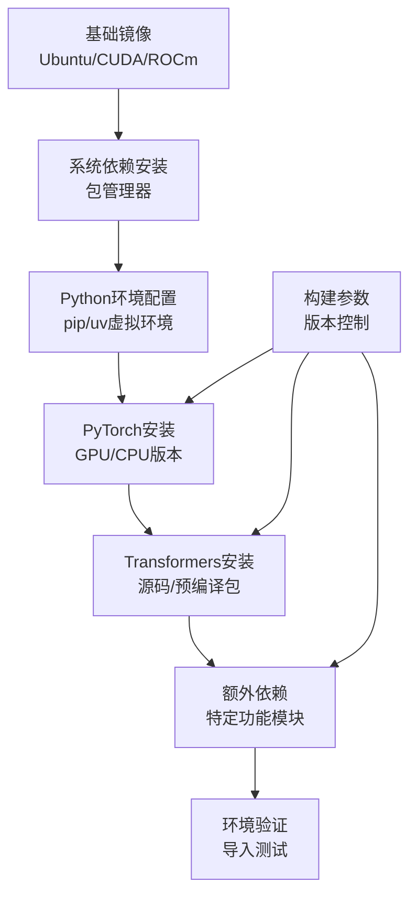
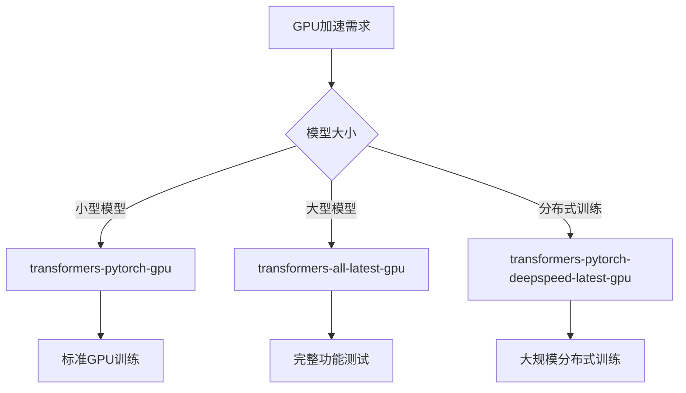

# 使用Docker安装Transformers库详细指南

<cite>
**本文档中引用的文件**
- [docker/README.md](file://docker/README.md)
- [docker/transformers-pytorch-gpu/Dockerfile](file://docker/transformers-pytorch-gpu/Dockerfile)
- [docker/transformers-all-latest-gpu/Dockerfile](file://docker/transformers-all-latest-gpu/Dockerfile)
- [docker/transformers-gpu/Dockerfile](file://docker/transformers-gpu/Dockerfile)
- [docker/transformers-intel-cpu/Dockerfile](file://docker/transformers-intel-cpu/Dockerfile)
- [docker/transformers-pytorch-amd-gpu/Dockerfile](file://docker/transformers-pytorch-amd-gpu/Dockerfile)
- [docker/transformers-pytorch-deepspeed-latest-gpu/Dockerfile](file://docker/transformers-pytorch-deepspeed-latest-gpu/Dockerfile)
- [docker/transformers-pytorch-tpu/Dockerfile](file://docker/transformers-pytorch-tpu/Dockerfile)
- [docker/transformers-pytorch-xpu/Dockerfile](file://docker/transformers-pytorch-xpu/Dockerfile)
- [docker/transformers-pytorch-tpu/docker-entrypoint.sh](file://docker/transformers-pytorch-tpu/docker-entrypoint.sh)
- [examples/metrics-monitoring/docker-compose.yml](file://examples/metrics-monitoring/docker-compose.yml)
</cite>

## 目录
1. [简介](#简介)
2. [Docker安装优势](#docker安装优势)
3. [官方Docker镜像](#官方docker镜像)
4. [自定义Dockerfile构建](#自定义dockerfile构建)
5. [运行容器](#运行容器)
6. [镜像选择指南](#镜像选择指南)
7. [生产环境部署最佳实践](#生产环境部署最佳实践)
8. [故障排除指南](#故障排除指南)
9. [总结](#总结)

## 简介

Docker是一种容器化技术，能够为机器学习应用提供一致、可移植且隔离的运行环境。对于Transformers库而言，使用Docker安装具有诸多优势，包括环境隔离、依赖管理简化、跨平台兼容性以及快速部署能力。

本指南将详细介绍如何使用Docker安装和配置Transformers库，涵盖从基础安装到高级部署的各种场景。

## Docker安装优势

### 环境隔离
Docker提供完全隔离的运行环境，避免了系统级依赖冲突。每个容器都包含运行Transformers所需的所有依赖项，确保在任何环境中都能一致运行。

### 快速部署
通过预配置的Docker镜像，可以在几分钟内完成Transformers的完整安装和配置，无需手动处理复杂的依赖关系。

### 版本控制
Docker镜像支持精确的版本控制，确保开发、测试和生产环境的一致性。

### 资源管理
容器化的资源使用更加可控，便于监控和优化性能。

### 多平台支持
Docker镜像可以在不同的操作系统和硬件平台上运行，提供良好的可移植性。

## 官方Docker镜像

### 拉取官方镜像

Transformers项目提供了多个官方Docker镜像，满足不同的使用需求：

#### PyTorch GPU镜像
```bash
docker pull huggingface/transformers-pytorch-gpu
```

#### 最新GPU镜像
```bash
docker pull huggingface/transformers-all-latest-gpu
```

#### CPU专用镜像
```bash
docker pull huggingface/transformers-intel-cpu
```

#### AMD GPU镜像
```bash
docker pull huggingface/transformers-pytorch-amd-gpu
```

#### TPU镜像
```bash
docker pull huggingface/transformers-pytorch-tpu
```

#### XPU镜像
```bash
docker pull huggingface/transformers-pytorch-xpu
```

### 镜像特点对比

| 镜像类型 | GPU支持 | 包含组件 | 适用场景 |
|---------|---------|----------|----------|
| transformers-pytorch-gpu | NVIDIA CUDA | 基础依赖 | 标准GPU训练 |
| transformers-all-latest-gpu | NVIDIA CUDA | 全部测试依赖 | 完整功能测试 |
| transformers-intel-cpu | Intel CPU | 优化CPU性能 | CPU推理部署 |
| transformers-pytorch-amd-gpu | AMD ROCm | AMD GPU支持 | AMD硬件加速 |
| transformers-pytorch-tpu | Google TPU | TPU优化 | TPU集群训练 |
| transformers-pytorch-xpu | Intel XPU | Intel GPU | Intel硬件加速 |

**节来源**
- [docker/README.md](file://docker/README.md#L1-L10)

## 自定义Dockerfile构建

### 基础架构分析

Transformers的Docker镜像采用分层构建策略，确保高效性和可维护性：



**图表来源**
- [docker/transformers-pytorch-gpu/Dockerfile](file://docker/transformers-pytorch-gpu/Dockerfile#L1-L37)
- [docker/transformers-all-latest-gpu/Dockerfile](file://docker/transformers-all-latest-gpu/Dockerfile#L1-L82)

### PyTorch GPU镜像详解

以`transformers-pytorch-gpu`为例，分析其构建过程：

#### 基础环境配置
- 使用NVIDIA CUDA 12.6.0基础镜像
- 设置Debian前端为非交互模式
- 安装必要的系统依赖包

#### PyTorch版本管理
通过构建参数控制PyTorch版本：
- `PYTORCH='2.8.0'` - 主要PyTorch版本
- `TORCH_VISION=''` - 可选的vision版本
- `TORCH_AUDIO=''` - 可选的audio版本
- `CUDA='cu126'` - CUDA版本标识

#### 依赖安装策略
1. **基础安装**：使用`-e ./transformers[dev-torch,testing,video]`进行可编辑安装
2. **版本控制**：通过条件语句动态设置版本号
3. **索引URL**：指定PyTorch官方仓库地址

### 全功能GPU镜像特性

`transformers-all-latest-gpu`镜像包含更广泛的依赖：

#### 扩展功能模块
- **计算机视觉**：detectron2目标检测框架
- **音频处理**：pytesseract OCR识别
- **视频分析**：av库用于视频处理
- **量化工具**：bitsandbytes、quanto量化库
- **优化框架**：accelerate、peft、optimum

#### 性能优化
- **Flash Attention**：高性能注意力机制
- **Intel OpenMP**：CPU并行计算优化
- **内存管理**：TCMalloc内存分配器

### 构建自定义镜像

#### 创建自定义Dockerfile
```dockerfile
FROM huggingface/transformers-pytorch-gpu:latest

# 添加自定义依赖
RUN python3 -m pip install --no-cache-dir custom-package

# 复制本地代码
COPY . /workspace/transformers
WORKDIR /workspace/transformers

# 安装开发版本
RUN python3 -m pip install --no-cache-dir -e .
```

#### 构建命令
```bash
docker build -t my-transformers:custom .
```

**节来源**
- [docker/transformers-pytorch-gpu/Dockerfile](file://docker/transformers-pytorch-gpu/Dockerfile#L1-L37)
- [docker/transformers-all-latest-gpu/Dockerfile](file://docker/transformers-all-latest-gpu/Dockerfile#L1-L82)

## 运行容器

### 基础运行命令

#### 启动基本容器
```bash
# 启动交互式容器
docker run -it --rm huggingface/transformers-pytorch-gpu bash

# 后台运行容器
docker run -d --name transformers-container huggingface/transformers-pytorch-gpu
```

### GPU加速配置

#### NVIDIA GPU支持
```bash
# 基础GPU支持
docker run --gpus all -it huggingface/transformers-pytorch-gpu bash

# 指定GPU设备
docker run --gpus '"device=0,1"' -it huggingface/transformers-pytorch-gpu bash

# 完整GPU配置
docker run --gpus all --ipc=host --ulimit memlock=-1 --ulimit stack=67108864 \
           -v /tmp/.X11-unix:/tmp/.X11-unix \
           -e DISPLAY=$DISPLAY \
           -it huggingface/transformers-pytorch-gpu bash
```

#### AMD GPU配置
```bash
# ROCm GPU支持
docker run --device=/dev/kfd --device=/dev/dri \
           --group-add video \
           --security-opt seccomp=unconfined \
           --cap-add SYS_PTRACE \
           -it huggingface/transformers-pytorch-amd-gpu bash
```

#### TPU配置
```bash
# Google Cloud TPU
docker run --privileged \
           -e KUBE_GOOGLE_CLOUD_TPU_ENDPOINTS="grpc://your-tpu-endpoint" \
           -it huggingface/transformers-pytorch-tpu bash
```

### 数据卷挂载

#### 模型文件挂载
```bash
# 挂载模型目录
docker run -v /path/to/models:/models \
           -it huggingface/transformers-pytorch-gpu bash

# 挂载工作目录
docker run -v $(pwd)/workspace:/workspace \
           -it huggingface/transformers-pytorch-gpu bash
```

#### 权限配置
```bash
# 设置正确的文件权限
docker run -v /host/path:/container/path \
           -u $(id -u):$(id -g) \
           -it huggingface/transformers-pytorch-gpu bash
```

### 网络配置

#### 端口映射
```bash
# Web服务端口映射
docker run -p 8080:80 \
           -it huggingface/transformers-pytorch-gpu bash

# 多端口映射
docker run -p 8080:80 -p 8081:81 -p 8082:82 \
           -it huggingface/transformers-pytorch-gpu bash
```

#### 网络模式
```bash
# 主机网络
docker run --network host \
           -it huggingface/transformers-pytorch-gpu bash

# 自定义网络
docker network create transformers-net
docker run --network transformers-net \
           -it huggingface/transformers-pytorch-gpu bash
```

### 环境变量配置

#### 内存限制
```bash
# 共享内存大小
docker run --shm-size 1g \
           -it huggingface/transformers-pytorch-gpu bash
```

#### 设备访问
```bash
# USB设备访问
docker run --device=/dev/usb-device \
           -it huggingface/transformers-pytorch-gpu bash

# 音频设备访问
docker run --device=/dev/snd \
           -it huggingface/transformers-pytorch-gpu bash
```

## 镜像选择指南

### GPU加速场景

#### NVIDIA GPU优先选择


**图表来源**
- [docker/transformers-pytorch-gpu/Dockerfile](file://docker/transformers-pytorch-gpu/Dockerfile#L1-L37)
- [docker/transformers-all-latest-gpu/Dockerfile](file://docker/transformers-all-latest-gpu/Dockerfile#L1-L82)
- [docker/transformers-pytorch-deepspeed-latest-gpu/Dockerfile](file://docker/transformers-pytorch-deepspeed-latest-gpu/Dockerfile#L1-L58)

#### AMD GPU选择
```bash
# AMD GPU专用镜像
docker pull huggingface/transformers-pytorch-amd-gpu

# 配置ROCm环境
docker run --device=/dev/kfd --device=/dev/dri \
           --group-add video \
           --security-opt seccomp=unconfined \
           -it huggingface/transformers-pytorch-amd-gpu bash
```

#### Intel XPU选择
```bash
# Intel XPU镜像
docker pull huggingface/transformers-pytorch-xpu

# 配置Intel GPU
docker run --device=/dev/dri \
           -it huggingface/transformers-pytorch-xpu bash
```

### CPU环境配置

#### Intel CPU优化
```bash
# Intel CPU专用镜像
docker pull huggingface/transformers-intel-cpu

# 性能优化配置
docker run --cpuset-cpus="0-3" \
           --memory=8g \
           -it huggingface/transformers-intel-cpu bash
```

#### 通用CPU环境
```bash
# 标准CPU镜像
docker run -it huggingface/transformers-intel-cpu bash

# 多核CPU配置
docker run --cpus="4.0" \
           -it huggingface/transformers-intel-cpu bash
```

### 特殊硬件配置

#### TPU环境
```bash
# Google Cloud TPU配置
docker run --privileged \
           -e KUBE_GOOGLE_CLOUD_TPU_ENDPOINTS="grpc://your-tpu-endpoint" \
           -it huggingface/transformers-pytorch-tpu bash
```

#### 生产环境考虑
- **资源限制**：设置CPU和内存限制
- **健康检查**：配置容器健康检查
- **日志管理**：集成日志收集系统
- **监控告警**：添加监控指标

**节来源**
- [docker/transformers-intel-cpu/Dockerfile](file://docker/transformers-intel-cpu/Dockerfile#L1-L72)
- [docker/transformers-pytorch-tpu/Dockerfile](file://docker/transformers-pytorch-tpu/Dockerfile#L1-L66)
- [docker/transformers-pytorch-xpu/Dockerfile](file://docker/transformers-pytorch-xpu/Dockerfile#L1-L104)

## 生产环境部署最佳实践

### 容器编排

#### Docker Compose配置
基于Transformers项目的监控配置示例：

```yaml
services:
  transformers-api:
    image: huggingface/transformers-all-latest-gpu:latest
    ports:
      - "8080:80"
    volumes:
      - ./models:/models
      - ./cache:/cache
    environment:
      - CUDA_VISIBLE_DEVICES=0
      - HF_HOME=/cache/huggingface
    deploy:
      resources:
        reservations:
          devices:
            - driver: nvidia
              count: 1
              capabilities: [gpu]
    healthcheck:
      test: ["CMD-SHELL", "curl -f http://localhost/health || exit 1"]
      interval: 30s
      timeout: 10s
      retries: 3
```

#### Kubernetes部署
```yaml
apiVersion: apps/v1
kind: Deployment
metadata:
  name: transformers-deployment
spec:
  replicas: 3
  selector:
    matchLabels:
      app: transformers
  template:
    metadata:
      labels:
        app: transformers
    spec:
      containers:
      - name: transformers
        image: huggingface/transformers-all-latest-gpu:latest
        ports:
        - containerPort: 80
        resources:
          limits:
            nvidia.com/gpu: 1
            memory: "8Gi"
          requests:
            nvidia.com/gpu: 1
            memory: "4Gi"
        volumeMounts:
        - name: models-volume
          mountPath: /models
        env:
        - name: CUDA_VISIBLE_DEVICES
          value: "0"
      volumes:
      - name: models-volume
        persistentVolumeClaim:
          claimName: models-pvc
```

### 性能优化

#### 内存管理
```bash
# 设置共享内存大小
docker run --shm-size=2g \
           -it huggingface/transformers-pytorch-gpu bash

# 内存限制配置
docker run --memory=8g --memory-swap=8g \
           -it huggingface/transformers-pytorch-gpu bash
```

#### CPU亲和性
```bash
# 设置CPU核心绑定
docker run --cpuset-cpus="0-3" \
           -it huggingface/transformers-intel-cpu bash

# CPU调度优化
docker run --cpu-shares=1024 \
           -it huggingface/transformers-intel-cpu bash
```

#### 存储优化
```bash
# 使用SSD存储
docker run -v /ssd/models:/models \
           -it huggingface/transformers-pytorch-gpu bash

# 缓存优化
docker run -v /tmp/cache:/cache \
           -it huggingface/transformers-pytorch-gpu bash
```

### 安全配置

#### 用户权限
```bash
# 使用非root用户
docker run --user $(id -u):$(id -g) \
           -it huggingface/transformers-pytorch-gpu bash

# 安全上下文
docker run --security-opt=no-new-privileges \
           -it huggingface/transformers-pytorch-gpu bash
```

#### 网络安全
```bash
# 隔离网络
docker run --network=none \
           -it huggingface/transformers-pytorch-gpu bash

# 端口白名单
docker run -p 8080:80 \
           -it huggingface/transformers-pytorch-gpu bash
```

### 监控和日志

#### 日志配置
```bash
# 日志驱动配置
docker run --log-driver=json-file \
           --log-opt=max-size=10m \
           --log-opt=max-file=3 \
           -it huggingface/transformers-pytorch-gpu bash

# 实时日志查看
docker logs -f transformers-container
```

#### 健康检查
```bash
# 健康检查配置
docker run --health-cmd="python -c 'import transformers'" \
           --health-interval=30s \
           --health-timeout=10s \
           -it huggingface/transformers-pytorch-gpu bash
```

**节来源**
- [examples/metrics-monitoring/docker-compose.yml](file://examples/metrics-monitoring/docker-compose.yml#L1-L56)

## 故障排除指南

### GPU驱动问题

#### NVIDIA GPU问题

##### 驱动不兼容
```bash
# 检查GPU可用性
docker run --gpus all \
           -it huggingface/transformers-pytorch-gpu bash

# 验证CUDA版本
python -c "import torch; print(torch.version.cuda)"
```

##### 解决方案
1. **更新驱动程序**
   ```bash
   # Ubuntu系统更新
   sudo apt update && sudo apt install nvidia-driver-525
   ```

2. **使用兼容镜像**
   ```bash
   # 指定特定CUDA版本
   docker pull huggingface/transformers-pytorch-gpu:cu117
   ```

3. **检查GPU状态**
   ```bash
   # 在主机上检查GPU
   nvidia-smi
   
   # 在容器内检查
   nvidia-smi
   ```

#### AMD GPU问题

##### ROCm环境配置
```bash
# 检查ROCm支持
docker run --device=/dev/kfd --device=/dev/dri \
           -it huggingface/transformers-pytorch-amd-gpu bash

# 验证AMD GPU
python -c "import torch; print(torch.cuda.is_available())"
```

##### 常见错误解决
- **权限不足**：确保用户在`render`和`video`组中
- **内核模块**：加载必要的ROCm内核模块
- **固件更新**：更新GPU固件

#### Intel XPU问题

##### 硬件检测
```bash
# 检查Intel GPU
docker run -it huggingface/transformers-pytorch-xpu bash

# 验证XPU支持
python -c "import torch; print(torch.xpu.is_available())"
```

##### 驱动配置
- **安装Intel GPU驱动**
- **配置OpenCL环境**
- **设置环境变量**

### 端口映射问题

#### 端口冲突
```bash
# 检查端口占用
netstat -tulpn | grep :8080

# 使用动态端口映射
docker run -P -p 8080:80 \
           -it huggingface/transformers-pytorch-gpu bash
```

#### 网络连接问题
```bash
# 测试容器网络
docker run -it --network host \
           huggingface/transformers-pytorch-gpu bash

# 检查防火墙设置
sudo ufw status
```

### 内存和资源问题

#### 内存不足
```bash
# 监控内存使用
docker stats

# 增加内存限制
docker run --memory=16g \
           -it huggingface/transformers-pytorch-gpu bash
```

#### 共享内存限制
```bash
# 增加共享内存大小
docker run --shm-size=4g \
           -it huggingface/transformers-pytorch-gpu bash

# 检查当前设置
df -h /dev/shm
```

### 权限和文件系统问题

#### 文件权限
```bash
# 检查文件权限
ls -la /path/to/models

# 使用正确用户
docker run --user $(id -u):$(id -g) \
           -it huggingface/transformers-pytorch-gpu bash
```

#### 卷挂载问题
```bash
# 检查挂载点
docker inspect transformers-container | grep Mounts

# 权限修复
chmod -R 755 /host/path
```

### 依赖和版本问题

#### Python包冲突
```bash
# 清理pip缓存
docker run -it huggingface/transformers-pytorch-gpu bash
pip cache purge

# 重新安装依赖
pip install --upgrade --force-reinstall transformers
```

#### CUDA版本不匹配
```bash
# 检查CUDA版本
python -c "import torch; print(torch.version.cuda)"

# 使用兼容镜像
docker pull huggingface/transformers-pytorch-gpu:cu117
```

### 调试技巧

#### 进入容器调试
```bash
# 启动交互式shell
docker exec -it transformers-container bash

# 查看容器日志
docker logs transformers-container

# 监控实时日志
docker logs -f transformers-container
```

#### 网络诊断
```bash
# 检查网络连通性
docker run --network container:transformers-container \
           -it huggingface/transformers-pytorch-gpu bash

# 端口扫描
docker run --network container:transformers-container \
           -it huggingface/transformers-pytorch-gpu bash
```

#### 性能分析
```bash
# GPU使用率监控
docker run --gpus all \
           -it huggingface/transformers-pytorch-gpu bash

# 内存使用分析
docker stats transformers-container
```

### 常见错误代码

| 错误类型 | 症状 | 解决方案 |
|---------|------|----------|
| CUDA_ERROR_NO_DEVICE | 无法找到GPU设备 | 检查驱动和权限 |
| OutOfMemoryError | 内存不足 | 增加内存限制 |
| Permission denied | 权限问题 | 检查文件权限 |
| Port already in use | 端口冲突 | 更换端口或停止服务 |
| Image not found | 镜像不存在 | 拉取正确镜像 |

**节来源**
- [docker/transformers-pytorch-tpu/docker-entrypoint.sh](file://docker/transformers-pytorch-tpu/docker-entrypoint.sh#L1-L7)

## 总结

使用Docker安装Transformers库提供了强大而灵活的解决方案，能够满足从开发测试到生产部署的各种需求。通过本指南，您应该能够：

### 关键要点回顾
1. **环境一致性**：Docker确保在不同环境中的一致性体验
2. **GPU加速**：支持NVIDIA、AMD、Intel等多种GPU平台
3. **灵活配置**：可根据需求选择合适的镜像和配置
4. **易于部署**：简化了复杂的依赖管理和配置过程

### 最佳实践总结
- **选择合适的镜像**：根据硬件和功能需求选择对应镜像
- **合理资源配置**：设置适当的CPU、内存和GPU资源限制
- **安全考虑**：使用非root用户，配置网络安全
- **监控运维**：实施有效的监控和日志管理策略

### 下一步建议
1. **实际部署**：在开发环境中尝试不同的配置选项
2. **性能调优**：根据具体应用场景优化资源配置
3. **自动化部署**：结合CI/CD流程实现自动化部署
4. **监控完善**：建立完善的监控和告警机制

通过遵循本指南的最佳实践，您可以充分利用Docker的强大功能，为Transformers应用提供稳定、高效的运行环境。