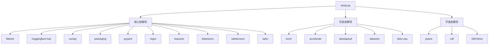
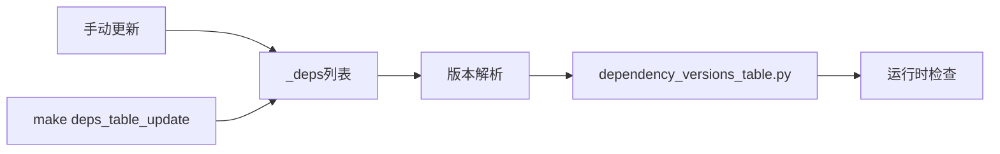

# 通过pip安装transformers库详细指南

<cite>
**本文档中引用的文件**
- [README.md](file://README.md)
- [setup.py](file://setup.py)
- [pyproject.toml](file://pyproject.toml)
- [src/transformers/dependency_versions_table.py](file://src/transformers/dependency_versions_table.py)
- [src/transformers/utils/import_utils.py](file://src/transformers/utils/import_utils.py)
- [ISSUES.md](file://ISSUES.md)
</cite>

## 目录
1. [简介](#简介)
2. [系统要求](#系统要求)
3. [基本安装](#基本安装)
4. [带框架支持的安装](#带框架支持的安装)
5. [附加功能包详解](#附加功能包详解)
6. [版本控制与安装选项](#版本控制与安装选项)
7. [依赖项解析机制](#依赖项解析机制)
8. [虚拟环境设置](#虚拟环境设置)
9. [常见安装问题与解决方案](#常见安装问题与解决方案)
10. [高级安装优化](#高级安装优化)
11. [故障排除指南](#故障排除指南)

## 简介

transformers库是Hugging Face开发的最先进的预训练模型框架，支持文本、计算机视觉、音频、视频和多模态模型的推理和训练。本指南将详细介绍如何通过pip安装transformers库，并提供从基础到高级的各种安装选项。

transformers库的核心特性包括：
- 统一的模型定义框架
- 支持多种深度学习框架
- 跨平台兼容性
- 丰富的预训练模型生态

## 系统要求

### Python版本要求
- **最低要求**: Python 3.10.0+
- **推荐版本**: Python 3.10+（获得最佳兼容性）

### 深度学习框架要求
transformers库需要至少安装以下框架之一：
- **PyTorch**: 版本 ≥ 2.2.0
- **TensorFlow**: 版本 ≥ 2.6.0
- **Flax/JAX**: 版本 ≥ 0.4.1

### 硬件要求
- **GPU支持**: CUDA 10.2+（用于GPU加速）
- **内存**: 至少4GB RAM（推荐8GB+）
- **存储**: 至少2GB可用空间

**节来源**
- [README.md](file://README.md#L75-L85)
- [setup.py](file://setup.py#L411-L433)

## 基本安装

### 标准pip安装

最简单的安装方式是使用标准pip命令：

```bash
pip install transformers
```

这个命令会安装transformers库的基础版本，包含核心功能但不包含任何额外的框架支持。

### 使用虚拟环境

强烈建议在虚拟环境中安装transformers库：

```bash
# 创建虚拟环境
python -m venv .my-env

# 激活虚拟环境（Linux/macOS）
source .my-env/bin/activate

# 激活虚拟环境（Windows）
.my-env\Scripts\activate
```

### uv包管理器安装

对于更快的包管理体验，可以使用uv：

```bash
# 安装uv
pip install uv

# 使用uv安装transformers
uv pip install "transformers[torch]"
```

**节来源**
- [README.md](file://README.md#L75-L95)

## 带框架支持的安装

### PyTorch支持安装

```bash
pip install "transformers[torch]"
```

这将安装：
- 核心transformers库
- PyTorch框架支持
- 相关的加速库（accelerate）

### TensorFlow CPU支持安装

```bash
pip install "transformers[tf-cpu]"
```

### TensorFlow GPU支持安装

```bash
pip install "transformers[tf-gpu]"
```

### Flax/JAX支持安装

```bash
pip install "transformers[flax]"
```

### 多框架组合安装

```bash
pip install "transformers[torch,tf-cpu]"
```

### 完整功能安装

```bash
pip install "transformers[all]"
```

**节来源**
- [setup.py](file://setup.py#L265-L350)

## 附加功能包详解

### 框架相关附加包

| 附加包名称 | 功能描述 | 适用场景 |
|-----------|----------|----------|
| `torch` | PyTorch框架支持 | PyTorch模型训练和推理 |
| `tf-cpu` | TensorFlow CPU支持 | CPU上的模型推理 |
| `tf-gpu` | TensorFlow GPU支持 | GPU加速的模型推理 |
| `flax` | Flax/JAX框架支持 | JAX生态系统集成 |

### 功能扩展附加包

| 附加包名称 | 功能描述 | 依赖项 |
|-----------|----------|--------|
| `audio` | 音频处理功能 | librosa, pyctcdecode, phonemizer, kenlm |
| `vision` | 计算机视觉功能 | Pillow |
| `speech` | 语音识别功能 | torchaudio + audio |
| `torch-speech` | PyTorch语音功能 | torchaudio + audio |
| `torch-vision` | PyTorch视觉功能 | torchvision + vision |
| `natten` | 注意力网络扩展 | natten |
| `codecarbon` | 碳足迹监控 | codecarbon |

### 开发工具附加包

| 附加包名称 | 功能描述 | 用途 |
|-----------|----------|------|
| `testing` | 测试框架 | 运行测试套件 |
| `dev` | 开发环境 | 完整开发工具链 |
| `dev-torch` | PyTorch开发环境 | PyTorch相关开发 |
| `quality` | 代码质量检查 | 代码风格和质量检查 |

### 集成附加包

| 附加包名称 | 功能描述 | 应用场景 |
|-----------|----------|----------|
| `sagemaker` | AWS SageMaker集成 | 云端模型部署 |
| `deepspeed` | DeepSpeed分布式训练 | 大模型训练加速 |
| `optuna` | 超参数优化 | 自动化超参数调优 |
| `ray` | Ray分布式计算 | 分布式任务调度 |

**节来源**
- [setup.py](file://setup.py#L265-L350)

## 版本控制与安装选项

### 安装特定版本

```bash
# 安装特定版本
pip install transformers==4.38.0

# 安装最新稳定版
pip install transformers

# 安装预发布版本
pip install transformers==5.0.0.dev0
```

### 安装最新开发版本

```bash
# 从源码安装最新版本
git clone https://github.com/huggingface/transformers.git
cd transformers
pip install ".[torch]"
```

### 安装预发布版本

```bash
# 安装预发布版本
pip install --pre transformers

# 从特定分支安装
pip install git+https://github.com/huggingface/transformers.git@main
```

### 离线安装

```bash
# 下载wheel文件
pip download transformers

# 离线安装
pip install transformers-*.whl
```

**节来源**
- [setup.py](file://setup.py#L53-L87)

## 依赖项解析机制

### setup.py中的依赖项定义

transformers库使用复杂的依赖项管理系统，主要通过`setup.py`文件定义：



**图表来源**
- [setup.py](file://setup.py#L89-L260)

### pyproject.toml配置

项目使用`pyproject.toml`进行现代Python打包配置：

- **代码格式化**: 使用Black风格的代码格式化
- **代码检查**: Ruff静态分析工具
- **测试配置**: pytest测试框架配置
- **类型检查**: 支持类型注解

### 依赖版本管理

依赖项版本通过`dependency_versions_table.py`自动管理：



**图表来源**
- [setup.py](file://setup.py#L89-L260)
- [src/transformers/dependency_versions_table.py](file://src/transformers/dependency_versions_table.py#L1-L96)

**节来源**
- [setup.py](file://setup.py#L89-L260)
- [pyproject.toml](file://pyproject.toml#L1-L74)

## 虚拟环境设置

### 使用venv创建虚拟环境

```bash
# 创建虚拟环境
python -m venv transformers-env

# Linux/macOS激活
source transformers-env/bin/activate

# Windows激活
transformers-env\Scripts\activate
```

### 使用conda创建环境

```bash
# 创建conda环境
conda create -n transformers-env python=3.10

# 激活环境
conda activate transformers-env

# 安装transformers
pip install transformers
```

### 环境隔离最佳实践

```bash
# 检查Python版本
python --version

# 检查pip版本
pip --version

# 创建隔离环境
python -m venv isolated-env
source isolated-env/bin/activate
```

## 常见安装问题与解决方案

### 依赖冲突问题

**问题症状**:
```
ERROR: pip's dependency resolver does not currently consider all the packages that are installed.
```

**解决方案**:
```bash
# 强制重新解析依赖
pip install --upgrade --force-reinstall transformers

# 使用兼容性模式
pip install --use-feature=2020-resolver transformers
```

### 权限问题

**问题症状**:
```
Permission denied: '/usr/local/lib/python3.x/site-packages'
```

**解决方案**:
```bash
# 使用用户目录安装
pip install --user transformers

# 在虚拟环境中安装
python -m venv temp-env
source temp-env/bin/activate
pip install transformers
```

### 网络连接问题

**问题症状**:
```
Could not fetch URL https://pypi.org/simple/transformers/: There was a problem confirming the ssl certificate
```

**解决方案**:
```bash
# 使用国内镜像源
pip install transformers -i https://pypi.tuna.tsinghua.edu.cn/simple

# 设置临时镜像
pip install transformers --index-url https://mirrors.aliyun.com/pypi/simple/
```

### 内存不足问题

**问题症状**:
```
OSError: [Errno 12] Cannot allocate memory
```

**解决方案**:
```bash
# 增加swap空间
sudo fallocate -l 4G /swapfile
sudo chmod 600 /swapfile
sudo mkswap /swapfile
sudo swapon /swapfile

# 使用轻量级安装
pip install transformers==4.30.0
```

**节来源**
- [ISSUES.md](file://ISSUES.md#L46-L222)

## 高级安装优化

### 并行安装优化

```bash
# 使用并行安装
pip install -j4 transformers

# 使用缓存优化
pip install --no-cache-dir transformers
```

### 离线安装优化

```bash
# 批量下载依赖
pip download transformers[all] -d ./downloads

# 离线安装
pip install --no-index --find-links=./downloads transformers
```

### Docker容器优化

```dockerfile
# Dockerfile优化示例
FROM python:3.10-slim

# 安装系统依赖
RUN apt-get update && apt-get install -y \
    git \
    gcc \
    && rm -rf /var/lib/apt/lists/*

# 创建应用目录
WORKDIR /app

# 复制依赖文件
COPY requirements.txt .

# 安装Python依赖
RUN pip install --no-cache-dir -r requirements.txt

# 复制应用代码
COPY . .

# 创建非root用户
RUN useradd -m -u 1000 -g 1000 appuser
USER appuser

# 设置入口点
ENTRYPOINT ["python", "-m", "transformers"]
```

### 性能优化配置

```bash
# 设置环境变量优化性能
export TRANSFORMERS_CACHE=/path/to/fast/storage
export HF_HOME=/path/to/cache

# 使用更快的下载源
export HF_ENDPOINT=https://hf-mirror.com
```

## 故障排除指南

### 安装验证

```python
# 验证安装是否成功
try:
    import transformers
    print(f"transformers版本: {transformers.__version__}")
    print("安装成功！")
except ImportError as e:
    print(f"安装失败: {e}")
```

### 框架兼容性检查

```python
# 检查PyTorch可用性
import transformers.utils.import_utils as import_utils
print(f"PyTorch可用: {import_utils.is_torch_available()}")

# 检查版本兼容性
print(f"PyTorch版本: {import_utils.get_torch_version()}")
```

### 日志调试

```bash
# 启用详细日志
export TRANSFORMERS_VERBOSITY=debug
pip install transformers

# 查看安装日志
pip install transformers 2>&1 | tee install.log
```

### 清理和重装

```bash
# 清理损坏的安装
pip uninstall transformers
rm -rf ~/.cache/huggingface/transformers/*

# 重新安装
pip install transformers
```

### 社区支持资源

- **官方文档**: https://huggingface.co/docs/transformers
- **GitHub Issues**: https://github.com/huggingface/transformers/issues
- **Hugging Face论坛**: https://discuss.huggingface.co/
- **Stack Overflow**: 标签`transformers`

**节来源**
- [src/transformers/utils/import_utils.py](file://src/transformers/utils/import_utils.py#L80-L199)
- [ISSUES.md](file://ISSUES.md#L46-L222)

## 结论

通过本指南，您应该能够：
1. 理解transformers库的安装要求和系统需求
2. 掌握各种安装选项和附加功能包的使用
3. 解决常见的安装问题和依赖冲突
4. 优化安装过程以提高效率
5. 利用虚拟环境确保环境隔离

记住，选择合适的安装选项取决于您的具体需求：如果只需要基本功能，使用标准安装；如果需要特定框架支持，使用相应的附加包；如果进行开发工作，考虑完整开发环境安装。

定期更新transformers库以获得最新的功能和修复是非常重要的。始终检查官方文档以获取最新的安装指南和最佳实践。