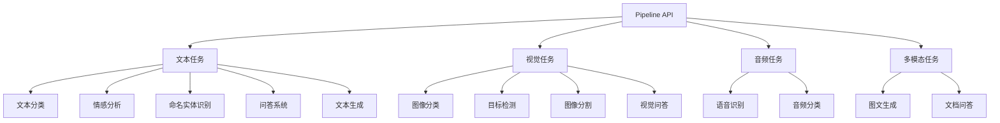

# 快速入门

<cite>
**本文档中引用的文件**
- [README.md](file://README.md)
- [run_classification.py](file://examples/pytorch/text-classification/run_classification.py)
- [run_qa.py](file://examples/pytorch/question-answering/run_qa.py)
- [run_generation.py](file://examples/pytorch/text-generation/run_generation.py)
- [run_ner.py](file://examples/pytorch/token-classification/run_ner.py)
- [__init__.py](file://src/transformers/pipelines/__init__.py)
</cite>

## 目录
1. [简介](#简介)
2. [安装和设置](#安装和设置)
3. [Pipeline API基础](#pipeline-api基础)
4. [文本分类任务](#文本分类任务)
5. [问答任务](#问答任务)
6. [文本生成任务](#文本生成任务)
7. [命名实体识别](#命名实体识别)
8. [AutoModel和AutoTokenizer](#automodel和autotokenizer)
9. [处理输入和解析输出](#处理输入和解析输出)
10. [调试技巧和最佳实践](#调试技巧和最佳实践)
11. [常见问题解决](#常见问题解决)
12. [总结](#总结)

## 简介

Transformers库是一个功能强大的自然语言处理工具包，提供了预训练模型的统一接口。本快速入门指南将帮助您从零开始使用transformers库，涵盖最常见的NLP任务。

Transformers库的核心优势：
- 统一的API设计，学习成本低
- 支持多种模态的任务（文本、图像、音频等）
- 预训练模型开箱即用
- 模块化架构，易于扩展

## 安装和设置

### 环境要求

```bash
# Python 3.9+
# PyTorch 2.1+

# 创建虚拟环境
python -m venv .transformers-env
source .transformers-env/bin/activate

# 安装transformers
pip install "transformers[torch]"
```

### 基本导入

```python
import torch
from transformers import pipeline, AutoModel, AutoTokenizer
```

## Pipeline API基础

Pipeline API是使用transformers库最简单的方式，它封装了模型加载、预处理和后处理的完整流程。

### 基本使用模式

```python
# 创建pipeline实例
classifier = pipeline(task="sentiment-analysis")

# 直接调用进行预测
result = classifier("We are very happy to introduce pipeline to the transformers repository.")
print(result)
# 输出: [{'label': 'POSITIVE', 'score': 0.9996980428695679}]
```

### Pipeline支持的任务类型



**图表来源**
- [__init__.py](file://src/transformers/pipelines/__init__.py#L150-L250)

### 自动任务推断

```python
# 根据模型自动推断任务类型
task = pipeline("distilbert-base-uncased-finetuned-sst-2-english")
# 自动识别为 "text-classification"
```

**节来源**
- [__init__.py](file://src/transformers/pipelines/__init__.py#L400-L500)

## 文本分类任务

文本分类是最常见的NLP任务之一，用于将文本分配到预定义的类别中。

### 基础情感分析

```python
from transformers import pipeline

# 创建情感分析pipeline
sentiment_analyzer = pipeline("sentiment-analysis")

# 执行情感分析
texts = [
    "I love this product!",
    "This is terrible.",
    "The movie was okay, nothing special."
]

results = sentiment_analyzer(texts)
for text, result in zip(texts, results):
    print(f"文本: {text}")
    print(f"结果: {result}")
    print("---")
```

### 多标签分类

```python
# 多标签文本分类
classifier = pipeline("text-classification", top_k=3)

text = "Python is a versatile programming language used in web development, data science, and artificial intelligence."
results = classifier(text)

print("预测结果:")
for result in results:
    print(f"- {result['label']}: {result['score']:.4f}")
```

### 自定义分类器

```python
# 使用特定模型进行分类
custom_classifier = pipeline(
    "text-classification",
    model="bert-base-uncased",
    tokenizer="bert-base-uncased"
)

result = custom_classifier("This is a great movie!")
print(result)
```

**节来源**
- [run_classification.py](file://examples/pytorch/text-classification/run_classification.py#L1-L100)

## 问答任务

问答系统能够根据给定的上下文回答相关问题。

### 基础问答

```python
from transformers import pipeline

# 创建问答pipeline
qa_pipeline = pipeline("question-answering")

# 执行问答
context = """
The Hugging Face Transformers library provides state-of-the-art pretrained models for inference and training.
It supports text, computer vision, audio, video, and multimodal models.
The library acts as a model-definition framework for machine learning with text.
"""

question = "What does the Transformers library provide?"

result = qa_pipeline(question=question, context=context)
print(f"答案: {result['answer']}")
print(f"置信度: {result['score']:.4f}")
print(f"起始位置: {result['start']}")
print(f"结束位置: {result['end']}")
```

### 批量问答

```python
# 批量执行问答
questions = [
    "What is the Transformers library?",
    "What does it support?",
    "How does it act?"
]

results = qa_pipeline(question=questions, context=context)
for question, result in zip(questions, results):
    print(f"问题: {question}")
    print(f"答案: {result['answer']}")
    print("---")
```

### 处理无法回答的情况

```python
# 启用无法回答选项
result = qa_pipeline(
    question="What is the capital of France?",
    context=context,
    handle_impossible_answer=True
)
print(f"答案: {result['answer']}")
print(f"是否可回答: {result['answer'] != 'IMPOSSIBLE'}")
```

**节来源**
- [run_qa.py](file://examples/pytorch/question-answering/run_qa.py#L1-L100)

## 文本生成任务

文本生成任务可以根据提示生成连贯的文本内容。

### 基础文本生成

```python
from transformers import pipeline

# 创建文本生成pipeline
generator = pipeline("text-generation")

# 简单文本生成
prompt = "The future of artificial intelligence is"
result = generator(prompt, max_length=50, num_return_sequences=1)
print(result[0]['generated_text'])
```

### 对话式生成

```python
# 对话式文本生成
chat = [
    {"role": "system", "content": "你是一个有用的AI助手。"},
    {"role": "user", "content": "你好，请介绍一下自己。"},
    {"role": "assistant", "content": "你好！我是由OpenAI开发的人工智能助手。"},
    {"role": "user", "content": "你能做什么？"}
]

generator = pipeline("text-generation", model="microsoft/DialoGPT-medium")
result = generator(chat, max_new_tokens=100)
print(result[0]['generated_text'][-1]['content'])
```

### 控制生成参数

```python
# 设置生成参数
generator = pipeline("text-generation")

params = {
    "max_length": 100,
    "num_return_sequences": 2,
    "temperature": 0.7,
    "top_p": 0.9,
    "do_sample": True,
    "early_stopping": True
}

prompt = "人工智能的发展趋势是"
results = generator(prompt, **params)

for i, result in enumerate(results):
    print(f"生成 {i+1}: {result['generated_text']}")
    print("---")
```

### 使用不同的模型

```python
# 使用不同的预训练模型
models = [
    "gpt2",
    "distilgpt2",
    "microsoft/DialoGPT-large"
]

for model_name in models:
    print(f"\n使用模型: {model_name}")
    generator = pipeline("text-generation", model=model_name)
    result = generator("人工智能", max_length=50)
    print(result[0]['generated_text'])
```

**节来源**
- [run_generation.py](file://examples/pytorch/text-generation/run_generation.py#L1-L100)

## 命名实体识别

命名实体识别任务用于识别文本中的特定实体，如人名、地名、组织名等。

### 基础NER

```python
from transformers import pipeline

# 创建NER pipeline
ner_pipeline = pipeline("ner")

# 执行命名实体识别
text = "苹果公司于2023年发布了iPhone 15 Pro手机。"

entities = ner_pipeline(text)
for entity in entities:
    print(f"实体: {entity['word']}")
    print(f"类型: {entity['entity']}")
    print(f"置信度: {entity['score']:.4f}")
    print("---")
```

### 处理长文本

```python
# 处理长文本时的NER
long_text = """
北京是中国的首都，位于华北平原的北部边缘。上海是中国最大的城市之一，
也是重要的经济、金融、贸易和航运中心。广州是广东省的省会，是华南地区的重要城市。
"""

# 将长文本分割成句子
import nltk
nltk.download('punkt')
sentences = nltk.sent_tokenize(long_text)

for i, sentence in enumerate(sentences):
    print(f"句子 {i+1}: {sentence}")
    entities = ner_pipeline(sentence)
    if entities:
        print("识别到的实体:")
        for entity in entities:
            print(f"- {entity['word']} ({entity['entity']})")
    print("---")
```

### 自定义实体类型

```python
# 使用特定的NER模型
custom_ner = pipeline(
    "ner",
    model="dbmdz/bert-large-cased-finetuned-conll03-english",
    tokenizer="dbmdz/bert-large-cased-finetuned-conll03-english"
)

text = "Microsoft Corporation is headquartered in Redmond, Washington."
entities = custom_ner(text)

print("自定义NER结果:")
for entity in entities:
    print(f"{entity['word']} -> {entity['entity']}")
```

**节来源**
- [run_ner.py](file://examples/pytorch/token-classification/run_ner.py#L1-L100)

## AutoModel和AutoTokenizer

对于需要更精细控制的高级用例，可以直接使用AutoModel和AutoTokenizer类。

### 基础模型加载

```python
from transformers import AutoTokenizer, AutoModel

# 加载预训练模型和分词器
model_name = "bert-base-uncased"
tokenizer = AutoTokenizer.from_pretrained(model_name)
model = AutoModel.from_pretrained(model_name)

# 准备输入
text = "Transformers库非常强大！"
inputs = tokenizer(text, return_tensors="pt")

# 获取模型输出
with torch.no_grad():
    outputs = model(**inputs)

# 提取特征
last_hidden_state = outputs.last_hidden_state
print(f"特征维度: {last_hidden_state.shape}")
```

### 分类任务模型

```python
from transformers import AutoTokenizer, AutoModelForSequenceClassification

# 加载分类模型
model_name = "distilbert-base-uncased-finetuned-sst-2-english"
tokenizer = AutoTokenizer.from_pretrained(model_name)
model = AutoModelForSequenceClassification.from_pretrained(model_name)

# 执行分类
text = "I had a wonderful experience!"
inputs = tokenizer(text, return_tensors="pt")
outputs = model(**inputs)
predictions = torch.nn.functional.softmax(outputs.logits, dim=-1)

print(f"积极情绪概率: {predictions[0][1].item():.4f}")
print(f"消极情绪概率: {predictions[0][0].item():.4f}")
```

### 问答模型

```python
from transformers import AutoTokenizer, AutoModelForQuestionAnswering

# 加载问答模型
model_name = "distilbert-base-cased-distilled-squad"
tokenizer = AutoTokenizer.from_pretrained(model_name)
model = AutoModelForQuestionAnswering.from_pretrained(model_name)

# 准备问答数据
context = "The Eiffel Tower is located in Paris, France."
question = "Where is the Eiffel Tower located?"

# 编码输入
inputs = tokenizer(question, context, return_tensors="pt")
start_scores, end_scores = model(**inputs).values()

# 获取答案
start_index = torch.argmax(start_scores)
end_index = torch.argmax(end_scores)

answer_tokens = inputs.input_ids[0][start_index:end_index+1]
answer = tokenizer.decode(answer_tokens)
print(f"答案: {answer}")
```

### 文本生成模型

```python
from transformers import AutoTokenizer, AutoModelForCausalLM

# 加载生成模型
model_name = "gpt2"
tokenizer = AutoTokenizer.from_pretrained(model_name)
model = AutoModelForCausalLM.from_pretrained(model_name)

# 设置特殊token
tokenizer.pad_token = tokenizer.eos_token

# 生成文本
prompt = "人工智能的未来"
inputs = tokenizer(prompt, return_tensors="pt")
generate_ids = model.generate(inputs.input_ids, max_length=100)
generated_text = tokenizer.decode(generate_ids[0], skip_special_tokens=True)

print(f"生成的文本: {generated_text}")
```

## 处理输入和解析输出

### 输入预处理

```python
def preprocess_text(text, max_length=512, truncation=True, padding=True):
    """文本预处理函数"""
    # 文本清理
    text = text.strip()
    
    # 长度截断
    if len(text) > max_length:
        text = text[:max_length]
        if truncation:
            text = text.rsplit(' ', 1)[0]  # 截断到最近的空格
    
    return text

# 使用示例
texts = [
    "这是一段较短的文本。",
    "这是一个较长的文本示例，包含很多内容，可能会超过最大长度限制。" * 10
]

for text in texts:
    processed = preprocess_text(text, max_length=100)
    print(f"原始长度: {len(text)}")
    print(f"处理后长度: {len(processed)}")
    print(f"处理后文本: {processed[:50]}...")
    print("---")
```

### 输出解析

```python
def parse_sentiment_result(result):
    """情感分析结果解析"""
    if isinstance(result, list):
        return [
            {
                "label": item["label"],
                "score": round(item["score"], 4),
                "confidence": f"{item['score']:.2%}"
            } for item in result
        ]
    else:
        return {
            "label": result["label"],
            "score": round(result["score"], 4),
            "confidence": f"{result['score']:.2%}"
        }

# 使用示例
sentiment_result = [
    {"label": "POSITIVE", "score": 0.9997},
    {"label": "NEGATIVE", "score": 0.0003}
]

parsed = parse_sentiment_result(sentiment_result)
for item in parsed:
    print(f"标签: {item['label']}, 置信度: {item['confidence']}")
```

### 批量处理优化

```python
def batch_process_texts(texts, pipeline_func, batch_size=32):
    """批量处理文本以提高效率"""
    results = []
    
    for i in range(0, len(texts), batch_size):
        batch = texts[i:i + batch_size]
        batch_results = pipeline_func(batch)
        results.extend(batch_results)
        
        # 打印进度
        progress = min(i + batch_size, len(texts))
        print(f"处理进度: {progress}/{len(texts)} ({progress/len(texts)*100:.1f}%)")
    
    return results

# 使用示例
texts = ["文本1", "文本2", "文本3", "文本4", "文本5"]
pipeline_func = pipeline("sentiment-analysis")

results = batch_process_texts(texts, pipeline_func)
print(f"总共处理了 {len(results)} 条结果")
```

## 调试技巧和最佳实践

### 性能监控

```python
import time
import psutil
import torch

def monitor_performance(func, *args, **kwargs):
    """性能监控装饰器"""
    def wrapper(*args, **kwargs):
        # 内存监控
        initial_memory = psutil.Process().memory_info().rss / 1024 / 1024
        
        # 时间监控
        start_time = time.time()
        
        # 执行函数
        result = func(*args, **kwargs)
        
        # 计算耗时
        end_time = time.time()
        elapsed_time = end_time - start_time
        
        # 内存使用情况
        final_memory = psutil.Process().memory_info().rss / 1024 / 1024
        memory_used = final_memory - initial_memory
        
        print(f"执行时间: {elapsed_time:.2f}秒")
        print(f"内存使用: {memory_used:.2f}MB")
        print(f"GPU内存: {torch.cuda.memory_allocated()/1024**2:.2f}MB" if torch.cuda.is_available() else "CPU模式")
        
        return result
    return wrapper

# 使用示例
@monitor_performance
def analyze_sentiment(texts):
    classifier = pipeline("sentiment-analysis")
    return classifier(texts)

texts = ["这是一个测试文本。"] * 100
results = analyze_sentiment(texts)
```

### 错误处理

```python
def robust_pipeline_call(pipeline_func, inputs, retries=3, delay=1):
    """带重试机制的管道调用"""
    for attempt in range(retries):
        try:
            return pipeline_func(inputs)
        except torch.cuda.OutOfMemoryError:
            print(f"GPU内存不足，尝试 {attempt + 1}/{retries}")
            if attempt < retries - 1:
                torch.cuda.empty_cache()
                time.sleep(delay)
        except Exception as e:
            print(f"发生错误: {e}")
            if attempt < retries - 1:
                time.sleep(delay)
    
    raise RuntimeError(f"多次尝试失败，无法处理输入: {inputs}")

# 使用示例
classifier = pipeline("sentiment-analysis")
texts = ["正常文本"] * 10

try:
    results = robust_pipeline_call(classifier, texts)
    print(results)
except RuntimeError as e:
    print(f"最终错误: {e}")
```

### 缓存策略

```python
import functools
from functools import lru_cache

@lru_cache(maxsize=1000)
def cached_pipeline_call(task, text, model=None):
    """带缓存的管道调用"""
    if model is None:
        pipe = pipeline(task)
    else:
        pipe = pipeline(task, model=model)
    
    return pipe(text)

# 使用示例
texts = ["重复的文本"] * 5
for text in texts:
    result = cached_pipeline_call("sentiment-analysis", text)
    print(f"文本: {text[:20]}..., 结果: {result}")
```

### 设备管理

```python
def get_optimal_device():
    """获取最优设备"""
    if torch.cuda.is_available():
        return torch.device("cuda")
    elif hasattr(torch.backends, "mps") and torch.backends.mps.is_available():
        return torch.device("mps")
    else:
        return torch.device("cpu")

def load_model_on_device(model_name):
    """在最优设备上加载模型"""
    device = get_optimal_device()
    print(f"使用设备: {device}")
    
    tokenizer = AutoTokenizer.from_pretrained(model_name)
    model = AutoModel.from_pretrained(model_name).to(device)
    
    return tokenizer, model, device

# 使用示例
tokenizer, model, device = load_model_on_device("bert-base-uncased")
```

## 常见问题解决

### 内存不足问题

```python
# 解决方案1：使用量化
from transformers import BitsAndBytesConfig

quantization_config = BitsAndBytesConfig(
    load_in_4bit=True,
    bnb_4bit_compute_dtype=torch.float16,
    bnb_4bit_use_double_quant=True,
    bnb_4bit_quant_type="nf4"
)

model = AutoModel.from_pretrained(
    "microsoft/DialoGPT-large",
    quantization_config=quantization_config
)

# 解决方案2：梯度检查点
model.gradient_checkpointing_enable()

# 解决方案3：批处理大小调整
def process_with_batch_size(texts, batch_size=4):
    results = []
    for i in range(0, len(texts), batch_size):
        batch = texts[i:i + batch_size]
        batch_results = classifier(batch)
        results.extend(batch_results)
        torch.cuda.empty_cache()  # 清理GPU缓存
    return results
```

### 模型下载问题

```python
# 设置缓存目录
import os
os.environ["TRANSFORMERS_CACHE"] = "/path/to/custom/cache"

# 离线模式
def load_model_offline(model_name):
    try:
        tokenizer = AutoTokenizer.from_pretrained(model_name)
        model = AutoModel.from_pretrained(model_name)
        return tokenizer, model
    except Exception as e:
        print(f"在线加载失败: {e}")
        # 尝试本地加载
        local_path = f"./models/{model_name.split('/')[-1]}"
        if os.path.exists(local_path):
            tokenizer = AutoTokenizer.from_pretrained(local_path)
            model = AutoModel.from_pretrained(local_path)
            return tokenizer, model
        else:
            raise FileNotFoundError(f"模型 {model_name} 在本地也不存在")

# 使用示例
tokenizer, model = load_model_offline("distilbert-base-uncased-finetuned-sst-2-english")
```

### 多语言支持

```python
# 多语言文本分类
def classify_multilingual_text(text, language="auto"):
    """多语言文本分类"""
    # 根据语言选择合适的模型
    if language == "auto":
        # 可以使用语言检测库
        from langdetect import detect
        language = detect(text)
    
    model_map = {
        "en": "distilbert-base-uncased-finetuned-sst-2-english",
        "zh": "bert-base-chinese",
        "es": "dccuchile/bert-base-spanish-wwm-cased",
        "fr": "nlptown/bert-base-multilingual-cased-sentiment"
    }
    
    model_name = model_map.get(language, "distilbert-base-uncased-finetuned-sst-2-english")
    classifier = pipeline("sentiment-analysis", model=model_name)
    
    return classifier(text)

# 使用示例
texts = [
    "I love this product!",           # 英语
    "我喜欢这个产品！",               # 中文
    "¡Me encanta este producto!"      # 西班牙语
]

for text in texts:
    result = classify_multilingual_text(text)
    print(f"文本: {text[:30]}...")
    print(f"语言: {classify_multilingual_text(text, 'auto')}")
    print(f"结果: {result}")
    print("---")
```

## 总结

本快速入门指南涵盖了transformers库的核心功能和使用方法：

### 主要要点

1. **Pipeline API**：最简单的使用方式，适合快速原型开发和生产部署
2. **AutoModel/AutoTokenizer**：提供更精细的控制，适合研究和定制需求
3. **任务多样性**：支持文本、视觉、音频和多模态任务
4. **性能优化**：通过缓存、批处理、设备管理等方式提升效率
5. **错误处理**：合理的异常处理和重试机制确保稳定性

### 下一步建议

1. 探索更多任务类型，如图像分类、语音识别等
2. 学习模型微调和迁移学习
3. 研究模型优化技术，如量化、蒸馏等
4. 参考官方文档和社区示例

### 资源链接

- [官方文档](https://huggingface.co/docs/transformers)
- [模型库](https://huggingface.co/models)
- [示例脚本](https://github.com/huggingface/transformers/tree/main/examples)
- [社区论坛](https://discuss.huggingface.co/)

通过本指南的学习，您应该能够熟练使用transformers库进行各种NLP任务，并具备解决常见问题的能力。随着实践的深入，您可以探索更高级的功能和定制化选项。