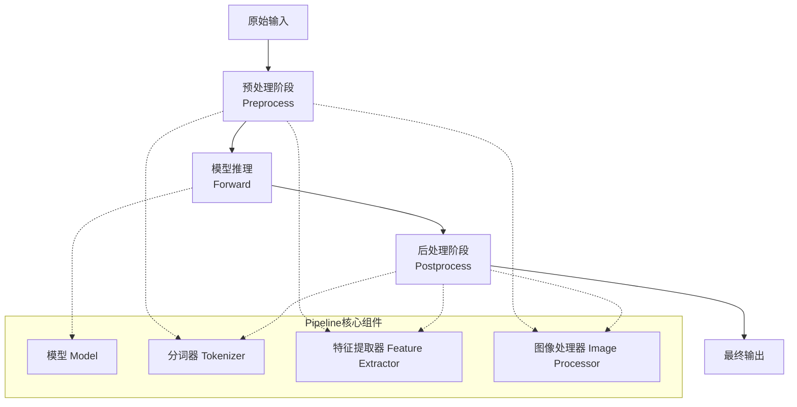
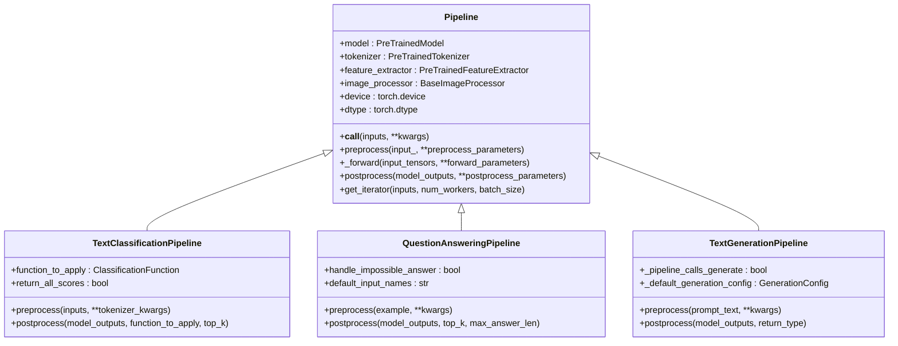
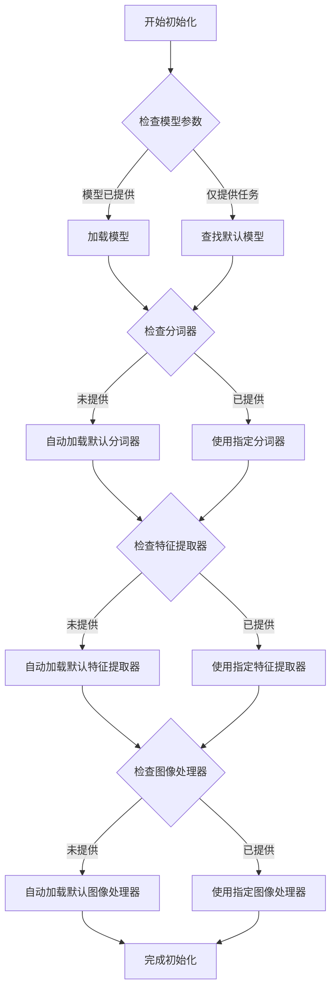

# 使用Pipeline进行推理

<cite>
**本文档中引用的文件**
- [src/transformers/pipelines/__init__.py](file://src/transformers/pipelines/__init__.py)
- [src/transformers/pipelines/base.py](file://src/transformers/pipelines/base.py)
- [src/transformers/pipelines/text_classification.py](file://src/transformers/pipelines/text_classification.py)
- [src/transformers/pipelines/question_answering.py](file://src/transformers/pipelines/question_answering.py)
- [src/transformers/pipelines/text_generation.py](file://src/transformers/pipelines/text_generation.py)
- [src/transformers/pipelines/image_classification.py](file://src/transformers/pipelines/image_classification.py)
- [src/transformers/pipelines/pt_utils.py](file://src/transformers/pipelines/pt_utils.py)
</cite>

## 目录
1. [简介](#简介)
2. [Pipeline架构概述](#pipeline架构概述)
3. [核心组件详解](#核心组件详解)
4. [主要任务类型Pipeline](#主要任务类型pipeline)
5. [参数配置与优化](#参数配置与优化)
6. [自定义Pipeline开发](#自定义pipeline开发)
7. [性能优化技巧](#性能优化技巧)
8. [故障排除指南](#故障排除指南)
9. [最佳实践](#最佳实践)
10. [总结](#总结)

## 简介

Transformers库中的Pipeline API提供了一个简洁而强大的接口，用于执行各种机器学习任务。Pipeline将复杂的模型、分词器和预处理器封装在一起，为用户提供了统一的使用体验。无论您是初学者还是高级开发者，Pipeline都能帮助您快速部署和使用最先进的AI模型。

### 主要特性

- **简化使用**：一键加载预训练模型和相关组件
- **多模态支持**：支持文本、图像、音频等多种输入类型
- **自动预处理**：自动处理输入数据的标准化和格式化
- **批量处理**：高效处理大量数据
- **设备管理**：智能的GPU/CPU资源分配
- **扩展性**：支持自定义任务和模型

## Pipeline架构概述

Pipeline的设计遵循模块化原则，将整个推理流程分解为清晰的阶段：



**图表来源**
- [src/transformers/pipelines/base.py](file://src/transformers/pipelines/base.py#L800-L1378)

### 核心设计原则

1. **职责分离**：每个阶段专注于特定的任务
2. **可扩展性**：支持自定义预处理和后处理逻辑
3. **设备抽象**：隐藏底层硬件细节
4. **类型安全**：提供完整的类型提示

**章节来源**
- [src/transformers/pipelines/base.py](file://src/transformers/pipelines/base.py#L800-L1378)

## 核心组件详解

### Pipeline基类

Pipeline基类定义了所有Pipeline的基本结构和行为：



**图表来源**
- [src/transformers/pipelines/base.py](file://src/transformers/pipelines/base.py#L800-L1378)
- [src/transformers/pipelines/text_classification.py](file://src/transformers/pipelines/text_classification.py#L40-L236)
- [src/transformers/pipelines/question_answering.py](file://src/transformers/pipelines/question_answering.py#L200-L686)
- [src/transformers/pipelines/text_generation.py](file://src/transformers/pipelines/text_generation.py#L40-L540)

### 组件加载机制

Pipeline通过智能的组件加载机制确保所需的所有组件都可用：



**图表来源**
- [src/transformers/pipelines/__init__.py](file://src/transformers/pipelines/__init__.py#L900-L1073)

**章节来源**
- [src/transformers/pipelines/base.py](file://src/transformers/pipelines/base.py#L800-L1378)
- [src/transformers/pipelines/__init__.py](file://src/transformers/pipelines/__init__.py#L900-L1073)

## 主要任务类型Pipeline

### 文本分类Pipeline

文本分类Pipeline用于对文本进行情感分析、主题分类等任务：

#### 基本用法

```python
from transformers import pipeline

# 情感分析
classifier = pipeline("sentiment-analysis")
result = classifier("我非常喜欢这个产品！")
# 输出: [{'label': 'POSITIVE', 'score': 0.9998}]

# 多样本分类
texts = ["这部电影很棒", "服务态度很差", "中规中矩"]
results = classifier(texts)
```

#### 高级配置

```python
# 自定义模型和分词器
from transformers import AutoModelForSequenceClassification, AutoTokenizer

model = AutoModelForSequenceClassification.from_pretrained("bert-base-uncased")
tokenizer = AutoTokenizer.from_pretrained("bert-base-uncased")
classifier = pipeline("text-classification", model=model, tokenizer=tokenizer)

# 返回所有分数
results = classifier("这是一个测试", return_all_scores=True)

# 指定top-k结果
results = classifier("这是一个测试", top_k=3)
```

**章节来源**
- [src/transformers/pipelines/text_classification.py](file://src/transformers/pipelines/text_classification.py#L40-L236)

### 问答Pipeline

问答Pipeline专门用于抽取式问答任务：

#### 基本用法

```python
from transformers import pipeline

qa_pipeline = pipeline("question-answering")
result = qa_pipeline(
    question="谁写了《哈利波特》？",
    context="《哈利波特》系列小说由英国作家J.K.罗琳创作，首部作品于1997年出版。"
)
# 输出: {'score': 0.9999, 'start': 25, 'end': 33, 'answer': 'J.K.罗琳'}
```

#### 高级配置

```python
# 处理长上下文
result = qa_pipeline(
    question="《哈利波特》的作者是谁？",
    context=long_context_text,
    max_answer_len=50,
    doc_stride=128
)

# 处理多个问题
questions = [
    {"question": "《哈利波特》的作者是谁？", "context": context},
    {"question": "第一部作品何时出版？", "context": context}
]
results = qa_pipeline(questions)
```

**章节来源**
- [src/transformers/pipelines/question_answering.py](file://src/transformers/pipelines/question_answering.py#L200-L686)

### 文本生成Pipeline

文本生成Pipeline支持对话和自由文本生成：

#### 基本用法

```python
from transformers import pipeline

generator = pipeline("text-generation")
result = generator("人工智能的未来是")
# 输出: [{'generated_text': '人工智能的未来是充满希望的领域，它将继续改变我们的生活和工作方式。'}]
```

#### 对话模式

```python
# 对话模式
chat_history = [
    {"role": "user", "content": "你好，请介绍一下自己"},
    {"role": "assistant", "content": "我是人工智能助手，很高兴为您服务。"},
    {"role": "user", "content": "你能做什么？"}
]
result = generator(chat_history, max_new_tokens=50)
```

#### 生成控制

```python
# 控制生成参数
result = generator(
    "写一首关于春天的诗：",
    max_new_tokens=100,
    temperature=0.8,
    repetition_penalty=1.1,
    do_sample=True
)
```

**章节来源**
- [src/transformers/pipelines/text_generation.py](file://src/transformers/pipelines/text_generation.py#L40-L540)

### 图像分类Pipeline

图像分类Pipeline用于识别图像中的对象或场景：

#### 基本用法

```python
from transformers import pipeline

image_classifier = pipeline("image-classification")
result = image_classifier("https://example.com/cat.jpg")
# 输出: [{'label': 'cat', 'score': 0.999}]
```

#### 批量处理

```python
# 处理多个图像
images = [
    "cat.jpg",
    "dog.jpg", 
    "bird.jpg"
]
results = image_classifier(images, top_k=3)
```

**章节来源**
- [src/transformers/pipelines/image_classification.py](file://src/transformers/pipelines/image_classification.py#L60-L230)

## 参数配置与优化

### 设备配置

Pipeline支持灵活的设备配置：

```python
# CPU推理
pipeline("text-classification", device="cpu")

# GPU推理
pipeline("text-classification", device=0)  # 第一个GPU
pipeline("text-classification", device="cuda:1")  # 第二个GPU

# 自动检测设备
pipeline("text-classification")  # 默认使用第一个可用设备
```

### 精度配置

```python
# 半精度推理
pipeline("text-classification", dtype=torch.float16)

# BF16精度
pipeline("text-classification", dtype=torch.bfloat16)

# 自动精度选择
pipeline("text-classification", dtype="auto")
```

### 批量处理配置

```python
# 设置批次大小
pipeline("text-classification", batch_size=32)

# 并行工作线程数
pipeline("text-classification", num_workers=4)
```

### 性能优化参数

```python
# 启用模型量化
pipeline("text-classification", torch_dtype=torch.float16)

# 使用加速库
pipeline("text-classification", device_map="auto")

# 预热模型
pipe = pipeline("text-classification")
# 预热
pipe(["预热文本"])
```

**章节来源**
- [src/transformers/pipelines/base.py](file://src/transformers/pipelines/base.py#L800-L1378)

## 自定义Pipeline开发

### 创建自定义Pipeline

您可以基于现有Pipeline创建新的任务类型：

```python
from transformers import Pipeline, AutoModel, AutoTokenizer
import torch

class CustomTextPipeline(Pipeline):
    def __init__(self, model, tokenizer, **kwargs):
        super().__init__(model=model, tokenizer=tokenizer, **kwargs)
        
    def _sanitize_parameters(self, **kwargs):
        preprocess_kwargs = {}
        forward_kwargs = {}
        postprocess_kwargs = {}
        return preprocess_kwargs, forward_kwargs, postprocess_kwargs
        
    def preprocess(self, inputs):
        # 自定义预处理逻辑
        return self.tokenizer(inputs, return_tensors="pt")
        
    def _forward(self, model_inputs):
        # 自定义模型推理
        with torch.no_grad():
            outputs = self.model(**model_inputs)
        return outputs
        
    def postprocess(self, model_outputs):
        # 自定义后处理逻辑
        predictions = torch.softmax(model_outputs.logits, dim=-1)
        return predictions.tolist()
```

### 注册自定义Pipeline

```python
from transformers.pipelines import PIPELINE_REGISTRY

# 注册自定义Pipeline
PIPELINE_REGISTRY.register_pipeline(
    "custom-task",
    pipeline_class=CustomTextPipeline,
    pt_model=(AutoModel,),
    default={"model": "bert-base-uncased"},
    type="text"
)
```

### 扩展现有Pipeline

```python
class EnhancedQAPipeline(QuestionAnsweringPipeline):
    def __init__(self, *args, **kwargs):
        super().__init__(*args, **kwargs)
        self.custom_threshold = 0.8
        
    def postprocess(self, model_outputs, **kwargs):
        results = super().postprocess(model_outputs, **kwargs)
        
        # 添加自定义后处理
        for result in results:
            if result['score'] > self.custom_threshold:
                result['confidence_level'] = 'HIGH'
            else:
                result['confidence_level'] = 'LOW'
                
        return results
```

**章节来源**
- [src/transformers/pipelines/base.py](file://src/transformers/pipelines/base.py#L1350-L1378)

## 性能优化技巧

### 内存优化

```python
# 使用梯度检查点
from transformers import BitsAndBytesConfig

config = BitsAndBytesConfig(
    load_in_8bit=True,
    llm_int8_threshold=6.0
)

pipeline("text-generation", model="gpt2", quantization_config=config)
```

### 推理速度优化

```python
# 使用编译优化
import torch
torch._dynamo.config.optimize_ddp = False

# 使用torch.compile
model = torch.compile(model)

# 使用ONNX Runtime
from optimum.onnxruntime import ORTModelForCausalLM

model = ORTModelForCausalLM.from_pretrained("gpt2", export=True)
```

### 批量处理优化

```python
# 智能批次大小调整
def optimize_batch_size(pipeline, sample_inputs):
    batch_sizes = [1, 2, 4, 8, 16, 32]
    best_time = float('inf')
    best_batch_size = 1
    
    for batch_size in batch_sizes:
        try:
            start_time = time.time()
            pipeline(sample_inputs[:batch_size], batch_size=batch_size)
            end_time = time.time()
            
            if end_time - start_time < best_time:
                best_time = end_time - start_time
                best_batch_size = batch_size
        except:
            break
            
    return best_batch_size
```

### 缓存策略

```python
# 实现简单的缓存
import functools
from transformers import cache_utils

@functools.lru_cache(maxsize=128)
def cached_inference(pipeline, text):
    return pipeline(text)

# 使用缓存
result = cached_inference(pipe, "重复的文本")
```

**章节来源**
- [src/transformers/pipelines/pt_utils.py](file://src/transformers/pipelines/pt_utils.py#L124-L158)

## 故障排除指南

### 常见错误及解决方案

#### 1. 内存不足错误

**错误信息**：
```
RuntimeError: CUDA out of memory
```

**解决方案**：
```python
# 减少批次大小
pipeline("text-classification", batch_size=1)

# 使用半精度
pipeline("text-classification", dtype=torch.float16)

# 使用CPU
pipeline("text-classification", device="cpu")

# 分批处理
def process_large_dataset(pipeline, texts, batch_size=16):
    results = []
    for i in range(0, len(texts), batch_size):
        batch = texts[i:i+batch_size]
        batch_results = pipeline(batch)
        results.extend(batch_results)
        torch.cuda.empty_cache()  # 清理GPU缓存
    return results
```

#### 2. 输入格式错误

**错误信息**：
```
ValueError: Invalid input format
```

**解决方案**：
```python
# 文本分类输入验证
def validate_text_classification_input(text):
    if isinstance(text, str):
        return text.strip()
    elif isinstance(text, list):
        return [item.strip() if isinstance(item, str) else str(item) for item in text]
    else:
        raise ValueError("输入必须是字符串或字符串列表")

# 使用验证后的输入
validated_input = validate_text_classification_input(user_input)
result = pipeline("text-classification", validated_input)
```

#### 3. 设备不匹配错误

**错误信息**：
```
RuntimeError: Expected all tensors to be on the same device
```

**解决方案**：
```python
# 确保所有组件在相同设备上
def ensure_device_consistency(pipeline):
    device = pipeline.device
    if hasattr(pipeline.model, 'to'):
        pipeline.model.to(device)
    if hasattr(pipeline.tokenizer, 'model_max_length'):
        pipeline.tokenizer.model_max_length = min(
            pipeline.tokenizer.model_max_length,
            pipeline.model.config.max_position_embeddings
        )
```

#### 4. 模型加载失败

**错误信息**：
```
OSError: Can't load model
```

**解决方案**：
```python
# 提供本地路径
pipeline("text-classification", model="./local_model_path")

# 使用缓存目录
pipeline("text-classification", cache_dir="./model_cache")

# 检查网络连接
import requests
try:
    requests.get("https://huggingface.co", timeout=5)
except:
    print("网络连接失败，请检查网络设置")
```

### 调试技巧

```python
# 启用详细日志
import logging
logging.basicConfig(level=logging.DEBUG)

# 检查Pipeline状态
def debug_pipeline_status(pipeline):
    print(f"设备: {pipeline.device}")
    print(f"模型类型: {type(pipeline.model).__name__}")
    print(f"分词器类型: {type(pipeline.tokenizer).__name__}")
    print(f"批次大小: {getattr(pipeline, '_batch_size', '默认')}")
    print(f"工作线程数: {getattr(pipeline, '_num_workers', '默认')}")

# 性能监控
import time
def monitor_inference_time(pipeline, inputs):
    start_time = time.time()
    result = pipeline(inputs)
    end_time = time.time()
    print(f"推理时间: {end_time - start_time:.2f}秒")
    return result
```

**章节来源**
- [src/transformers/pipelines/base.py](file://src/transformers/pipelines/base.py#L355-L402)

## 最佳实践

### 1. 模型选择策略

```python
# 根据任务选择合适的模型
TASK_MODELS = {
    "text-classification": "distilbert-base-uncased-finetuned-sst-2-english",
    "question-answering": "distilbert-base-cased-distilled-squad",
    "text-generation": "gpt2",
    "image-classification": "google/vit-base-patch16-224",
    "sentiment-analysis": "cardiffnlp/twitter-roberta-base-sentiment-latest"
}

def get_optimal_pipeline(task):
    return pipeline(task, model=TASK_MODELS.get(task))
```

### 2. 批量处理最佳实践

```python
# 智能批量处理
def smart_batch_processing(pipeline, inputs, max_batch_size=32):
    if len(inputs) <= max_batch_size:
        return pipeline(inputs)
    
    # 分块处理
    results = []
    for i in range(0, len(inputs), max_batch_size):
        batch = inputs[i:i + max_batch_size]
        batch_result = pipeline(batch)
        results.extend(batch_result)
        # 可选：清理缓存
        if torch.cuda.is_available():
            torch.cuda.empty_cache()
    return results
```

### 3. 错误处理和重试机制

```python
import time
from typing import Callable, Any

def robust_pipeline_call(
    pipeline_func: Callable,
    inputs: Any,
    max_retries: int = 3,
    delay: int = 1
) -> Any:
    """带重试机制的管道调用"""
    for attempt in range(max_retries):
        try:
            return pipeline_func(inputs)
        except torch.cuda.OutOfMemoryError:
            if attempt < max_retries - 1:
                print(f"内存不足，重试 {attempt + 1}/{max_retries}")
                time.sleep(delay)
                torch.cuda.empty_cache()
            else:
                raise
        except Exception as e:
            if attempt < max_retries - 1:
                print(f"错误: {e}，重试 {attempt + 1}/{max_retries}")
                time.sleep(delay)
            else:
                raise
```

### 4. 资源管理

```python
# 上下文管理器确保资源正确释放
from contextlib import contextmanager

@contextmanager
def managed_pipeline(task, **kwargs):
    pipe = pipeline(task, **kwargs)
    try:
        yield pipe
    finally:
        # 清理资源
        if hasattr(pipe, 'model'):
            del pipe.model
        if hasattr(pipe, 'tokenizer'):
            del pipe.tokenizer
        torch.cuda.empty_cache()

# 使用示例
with managed_pipeline("text-classification") as pipe:
    result = pipe("测试文本")
```

### 5. 性能基准测试

```python
import time
import psutil
import torch

def benchmark_pipeline(pipeline, inputs, iterations=10):
    """基准测试Pipeline性能"""
    # 预热
    _ = pipeline(inputs[0])
    
    # 收集内存信息
    process = psutil.Process()
    start_memory = process.memory_info().rss / 1024 / 1024  # MB
    
    # 测试推理
    times = []
    for _ in range(iterations):
        start_time = time.time()
        _ = pipeline(inputs)
        end_time = time.time()
        times.append(end_time - start_time)
    
    end_memory = process.memory_info().rss / 1024 / 1024  # MB
    
    return {
        "avg_time": sum(times) / len(times),
        "min_time": min(times),
        "max_time": max(times),
        "memory_used": end_memory - start_memory,
        "throughput": len(inputs) / (sum(times) / len(times))
    }
```

## 总结

Transformers库的Pipeline API提供了一个强大而灵活的框架，用于部署和使用各种机器学习模型。通过本文档，我们深入探讨了：

1. **架构设计**：Pipeline的模块化设计和核心组件
2. **任务类型**：涵盖了文本、图像、音频等主要任务的Pipeline
3. **配置优化**：设备、精度、批量处理等关键参数的配置
4. **自定义开发**：如何创建和扩展Pipeline以满足特定需求
5. **性能优化**：内存管理、推理速度提升等优化技巧
6. **故障排除**：常见问题的诊断和解决方案

### 关键要点

- **简洁性**：Pipeline提供了一键使用的便利性
- **灵活性**：支持自定义和扩展
- **性能**：内置多种优化策略
- **可靠性**：完善的错误处理和调试工具

### 下一步建议

1. **实践应用**：在实际项目中尝试不同的Pipeline配置
2. **性能调优**：根据具体需求优化参数设置
3. **自定义扩展**：开发符合特定业务需求的Pipeline
4. **社区贡献**：分享您的经验和改进

通过掌握Pipeline API，您可以快速构建高质量的AI应用程序，充分发挥Transformer模型的强大能力。