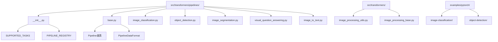
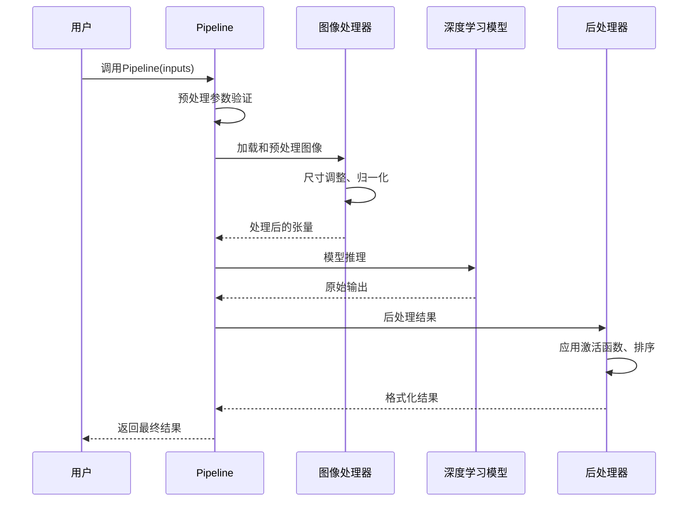
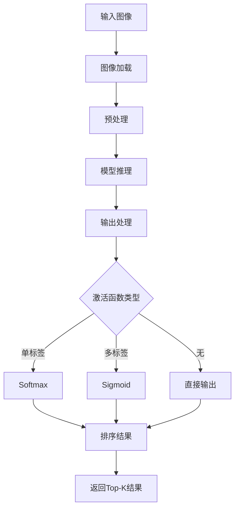
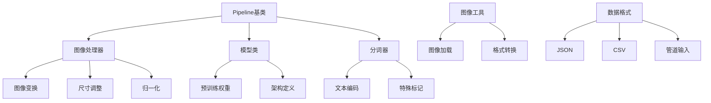

# 图像任务Pipeline

<cite>
**本文档中引用的文件**
- [src/transformers/pipelines/__init__.py](file://src/transformers/pipelines/__init__.py)
- [src/transformers/pipelines/base.py](file://src/transformers/pipelines/base.py)
- [src/transformers/pipelines/image_classification.py](file://src/transformers/pipelines/image_classification.py)
- [src/transformers/pipelines/object_detection.py](file://src/transformers/pipelines/object_detection.py)
- [src/transformers/pipelines/image_segmentation.py](file://src/transformers/pipelines/image_segmentation.py)
- [src/transformers/pipelines/visual_question_answering.py](file://src/transformers/pipelines/visual_question_answering.py)
- [src/transformers/pipelines/image_to_text.py](file://src/transformers/pipelines/image_to_text.py)
- [src/transformers/image_processing_utils.py](file://src/transformers/image_processing_utils.py)
- [src/transformers/image_processing_base.py](file://src/transformers/image_processing_base.py)
- [examples/pytorch/image-classification/run_image_classification.py](file://examples/pytorch/image-classification/run_image_classification.py)
</cite>

## 目录
1. [简介](#简介)
2. [项目结构](#项目结构)
3. [核心组件](#核心组件)
4. [架构概览](#架构概览)
5. [详细组件分析](#详细组件分析)
6. [依赖关系分析](#依赖关系分析)
7. [性能考虑](#性能考虑)
8. [故障排除指南](#故障排除指南)
9. [结论](#结论)

## 简介

Transformers库中的图像任务Pipeline提供了一套完整的计算机视觉解决方案，涵盖了从基础的图像分类到复杂的视觉问答等多个任务。这些Pipeline通过统一的接口简化了深度学习模型的使用，使开发者能够快速部署各种图像处理应用。

本文档将详细介绍transformers库中图像相关Pipeline的实现原理、使用方法和最佳实践，包括：
- 图像分类Pipeline：识别图像中的主要对象类别
- 目标检测Pipeline：定位图像中的多个对象并标注边界框
- 图像分割Pipeline：生成像素级的对象掩码
- 视觉问答Pipeline：回答关于图像内容的问题
- 图像到文本Pipeline：生成图像描述性文本

## 项目结构

transformers库中的图像Pipeline组织结构如下：



**图表来源**
- [src/transformers/pipelines/__init__.py](file://src/transformers/pipelines/__init__.py#L1-L50)
- [src/transformers/pipelines/base.py](file://src/transformers/pipelines/base.py#L1-L50)

**章节来源**
- [src/transformers/pipelines/__init__.py](file://src/transformers/pipelines/__init__.py#L1-L100)
- [src/transformers/pipelines/base.py](file://src/transformers/pipelines/base.py#L1-L100)

## 核心组件

### Pipeline注册系统

transformers库使用统一的Pipeline注册系统来管理所有支持的任务类型。每个图像Pipeline都在`SUPPORTED_TASKS`字典中注册，包含以下信息：

- **任务标识符**：如"image-classification"、"object-detection"等
- **实现类**：对应的具体Pipeline类
- **模型类型映射**：支持的模型类列表
- **默认模型**：该任务的默认预训练模型
- **任务类型**："image"或"multimodal"

### 基础Pipeline类

所有图像Pipeline都继承自`Pipeline`基类，该类提供了通用的功能：

- **预处理**：图像加载、尺寸调整、归一化
- **模型推理**：调用深度学习模型进行预测
- **后处理**：结果格式化、阈值过滤
- **批处理支持**：支持单张图像和批量图像处理

**章节来源**
- [src/transformers/pipelines/base.py](file://src/transformers/pipelines/base.py#L600-L800)
- [src/transformers/pipelines/__init__.py](file://src/transformers/pipelines/__init__.py#L150-L300)

## 架构概览

图像Pipeline的整体架构遵循经典的深度学习工作流：



**图表来源**
- [src/transformers/pipelines/base.py](file://src/transformers/pipelines/base.py#L700-L900)
- [src/transformers/pipelines/image_classification.py](file://src/transformers/pipelines/image_classification.py#L150-L200)

## 详细组件分析

### 图像分类Pipeline

图像分类Pipeline是最基础的视觉任务，用于识别图像中的主要对象类别。

#### 核心功能
- **多标签分类**：支持单标签和多标签分类任务
- **激活函数选择**：自动选择合适的激活函数（sigmoid、softmax）
- **置信度排序**：返回最高概率的前k个类别

#### 使用示例

```python
# 基本用法
classifier = pipeline("image-classification")
results = classifier("image.jpg")

# 自定义参数
results = classifier("image.jpg", top_k=3, function_to_apply="softmax")
```

#### 实现细节



**图表来源**
- [src/transformers/pipelines/image_classification.py](file://src/transformers/pipelines/image_classification.py#L180-L230)

**章节来源**
- [src/transformers/pipelines/image_classification.py](file://src/transformers/pipelines/image_classification.py#L1-L230)

### 目标检测Pipeline

目标检测Pipeline不仅识别图像中的对象，还提供它们的位置信息。

#### 核心功能
- **边界框检测**：定位每个检测到的对象
- **置信度过滤**：根据阈值过滤低置信度检测
- **坐标转换**：将相对坐标转换为绝对坐标

#### 输出格式

目标检测Pipeline返回包含以下信息的字典列表：
- **label**：检测到的对象类别
- **score**：检测置信度分数
- **box**：边界框坐标（xmin, ymin, xmax, ymax）

**章节来源**
- [src/transformers/pipelines/object_detection.py](file://src/transformers/pipelines/object_detection.py#L1-L198)

### 图像分割Pipeline

图像分割Pipeline生成像素级的对象掩码，提供最精确的图像理解。

#### 支持的分割类型
- **语义分割**：按类别对所有像素进行分割
- **实例分割**：区分同一类别的不同实例
- **全景分割**：结合语义和实例分割

#### 分割参数

| 参数 | 默认值 | 描述 |
|------|--------|------|
| threshold | 0.9 | 对象检测阈值 |
| mask_threshold | 0.5 | 掩码二值化阈值 |
| overlap_mask_area_threshold | 0.5 | 掩码重叠面积阈值 |

**章节来源**
- [src/transformers/pipelines/image_segmentation.py](file://src/transformers/pipelines/image_segmentation.py#L1-L224)

### 视觉问答Pipeline

视觉问答Pipeline结合了自然语言处理和计算机视觉技术，能够回答关于图像内容的问题。

#### 核心特性
- **多模态输入**：同时处理图像和文本
- **生成式回答**：支持开放式问题回答
- **检索式回答**：支持封闭式答案选择

#### 使用模式

```python
# 单图像单问题
result = oracle(question="这是什么？", image="image.jpg")

# 批量处理
results = oracle(
    image=["image1.jpg", "image2.jpg"],
    question="这张图片里有什么？"
)
```

**章节来源**
- [src/transformers/pipelines/visual_question_answering.py](file://src/transformers/pipelines/visual_question_answering.py#L1-L213)

### 图像到文本Pipeline

图像到文本Pipeline生成描述性文本，将视觉信息转换为自然语言。

#### 支持的模型类型
- **Vision-Encoder-Decoder**：编码器-解码器架构
- **GIT**：Generative Image-to-text Transformer
- **Pix2Struct**：表格结构化理解

#### 条件生成

某些模型支持条件生成，允许用户指定特定的提示词：

```python
# 无条件生成
caption = captioner("image.jpg")

# 条件生成
caption = captioner("image.jpg", prompt="这是一只猫")
```

**章节来源**
- [src/transformers/pipelines/image_to_text.py](file://src/transformers/pipelines/image_to_text.py#L1-L230)

## 依赖关系分析

图像Pipeline系统的依赖关系复杂，涉及多个模块的协作：



**图表来源**
- [src/transformers/pipelines/base.py](file://src/transformers/pipelines/base.py#L1-L100)
- [src/transformers/image_processing_utils.py](file://src/transformers/image_processing_utils.py#L1-L100)

**章节来源**
- [src/transformers/pipelines/base.py](file://src/transformers/pipelines/base.py#L1-L200)
- [src/transformers/image_processing_utils.py](file://src/transformers/image_processing_utils.py#L1-L200)

## 性能考虑

### 批处理优化

transformers库提供了多种批处理策略来提高性能：

1. **静态批处理**：固定大小的批次
2. **动态批处理**：根据输入大小调整批次
3. **流水线批处理**：重叠预处理和推理

### 内存管理

- **梯度检查点**：减少内存使用
- **混合精度**：使用FP16降低内存占用
- **模型量化**：减小模型大小

### 设备优化

- **GPU加速**：利用CUDA进行并行计算
- **CPU优化**：多核并行处理
- **移动设备**：ARM优化支持

## 故障排除指南

### 常见问题及解决方案

#### 1. 内存不足错误

**症状**：CUDA out of memory错误
**解决方案**：
- 减少批处理大小
- 使用混合精度训练
- 启用梯度检查点

#### 2. 输入格式不匹配

**症状**：图像格式或尺寸错误
**解决方案**：
- 使用正确的图像处理器
- 确保输入符合模型要求的尺寸

#### 3. 模型加载失败

**症状**：无法下载或加载预训练模型
**解决方案**：
- 检查网络连接
- 验证模型名称正确性
- 使用本地缓存路径

#### 4. 性能问题

**症状**：推理速度过慢
**解决方案**：
- 启用模型量化
- 使用更高效的图像处理器
- 优化批处理设置

### 调试技巧

1. **启用详细日志**：设置`logging.set_verbosity(logging.INFO)`
2. **检查中间结果**：在预处理和后处理阶段添加调试输出
3. **性能分析**：使用profiling工具分析瓶颈

**章节来源**
- [src/transformers/pipelines/base.py](file://src/transformers/pipelines/base.py#L1200-L1378)

## 结论

Transformers库的图像任务Pipeline提供了一个强大而灵活的框架，用于构建各种计算机视觉应用。通过统一的接口设计，开发者可以轻松地在不同的任务之间切换，而无需重新学习复杂的API。

### 主要优势

1. **易用性**：简洁的API设计，开箱即用
2. **灵活性**：支持多种输入格式和自定义参数
3. **可扩展性**：易于集成新的模型和任务
4. **性能**：内置优化机制，支持高效推理

### 最佳实践建议

1. **选择合适的Pipeline**：根据具体需求选择最适合的图像任务
2. **优化批处理**：合理设置批处理大小以平衡速度和内存使用
3. **监控性能**：定期评估和优化推理性能
4. **错误处理**：实现健壮的错误处理机制

通过掌握这些图像Pipeline的核心概念和使用方法，开发者可以快速构建高质量的计算机视觉应用程序，充分发挥深度学习技术的潜力。