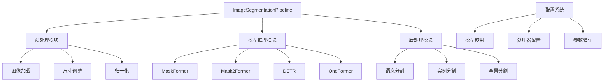
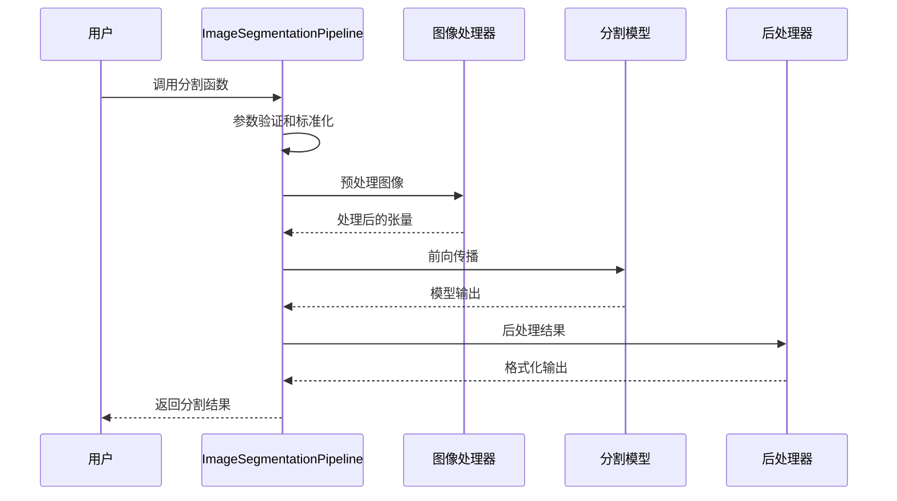
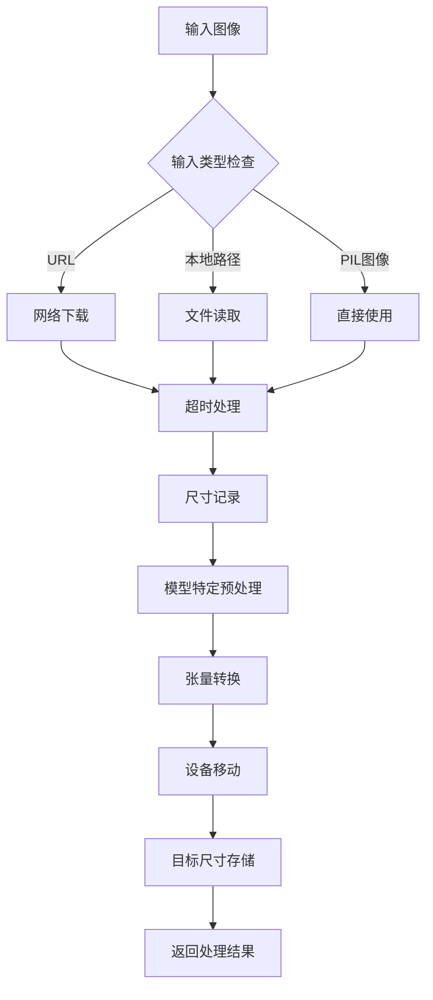
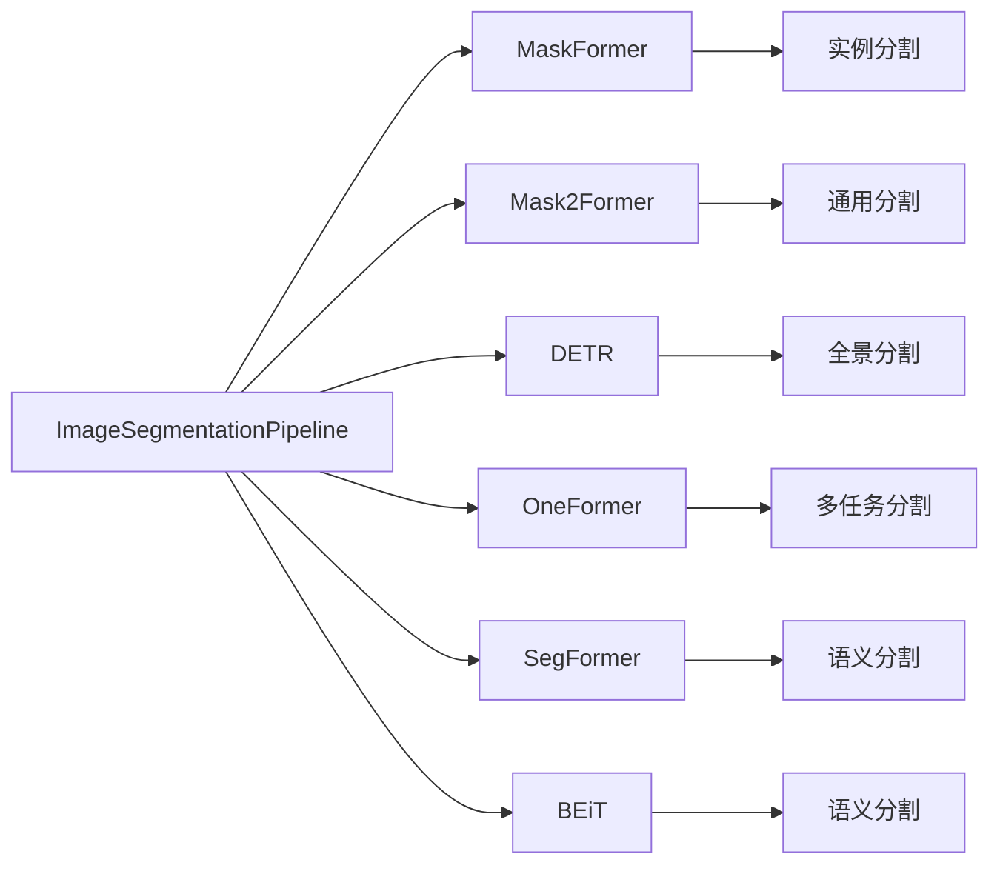
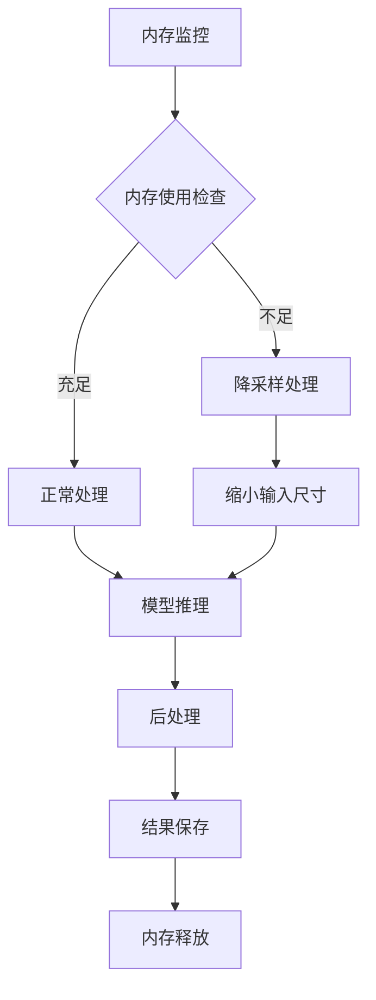

# 图像分割Pipeline

<cite>
**本文档中引用的文件**
- [image_segmentation.py](file://src/transformers/pipelines/image_segmentation.py)
- [test_pipelines_image_segmentation.py](file://tests/pipelines/test_pipelines_image_segmentation.py)
- [run_semantic_segmentation.py](file://examples/pytorch/semantic-segmentation/run_semantic_segmentation.py)
- [run_instance_segmentation.py](file://examples/pytorch/instance-segmentation/run_instance_segmentation.py)
- [modeling_maskformer.py](file://src/transformers/models/maskformer/modeling_maskformer.py)
- [modeling_mask2former.py](file://src/transformers/models/mask2former/modeling_mask2former.py)
- [configuration_mask2former.py](file://src/transformers/models/mask2former/configuration_mask2former.py)
- [modeling_oneformer.py](file://src/transformers/models/oneformer/modeling_oneformer.py)
- [modeling_detr.py](file://src/transformers/models/detr/modeling_detr.py)
</cite>

## 目录
1. [简介](#简介)
2. [项目结构](#项目结构)
3. [核心组件](#核心组件)
4. [架构概览](#架构概览)
5. [详细组件分析](#详细组件分析)
6. [分割模式详解](#分割模式详解)
7. [模型支持与配置](#模型支持与配置)
8. [性能优化与最佳实践](#性能优化与最佳实践)
9. [故障排除指南](#故障排除指南)
10. [结论](#结论)

## 简介

Transformers库中的ImageSegmentationPipeline是一个功能强大的图像分割工具，能够执行语义分割、实例分割和全景分割任务。该Pipeline基于先进的深度学习模型，如MaskFormer、Mask2Former和DETR，为计算机视觉任务提供了统一的接口。

### 主要特性

- **多模式支持**：支持语义分割、实例分割和全景分割
- **模型兼容性**：兼容多种先进的分割模型架构
- **灵活配置**：提供丰富的参数调节选项
- **批量处理**：支持单张和批量图像处理
- **高质量输出**：生成精确的分割掩码和分类标签

## 项目结构

**图表来源**
- [image_segmentation.py](file://src/transformers/pipelines/image_segmentation.py#L1-L50)

**章节来源**
- [image_segmentation.py](file://src/transformers/pipelines/image_segmentation.py#L1-L224)

## 核心组件

### ImageSegmentationPipeline类

ImageSegmentationPipeline是整个分割系统的核心类，继承自基础Pipeline类，专门负责图像分割任务的端到端处理。

#### 主要方法

- **`__init__`**: 初始化Pipeline，检查模型类型兼容性
- **`_sanitize_parameters`**: 参数验证和标准化
- **`__call__`**: 主要的调用接口，处理输入并返回结果
- **`preprocess`**: 图像预处理和模型输入准备
- **`_forward`**: 模型前向传播
- **`postprocess`**: 结果后处理和格式化

#### 关键属性

- `_load_processor`: 控制是否加载处理器
- `_load_image_processor`: 是否需要图像处理器
- `_load_feature_extractor`: 特征提取器加载控制
- `_load_tokenizer`: 分词器加载（主要用于OneFormer）

**章节来源**
- [image_segmentation.py](file://src/transformers/pipelines/image_segmentation.py#L25-L112)

## 架构概览

**图表来源**
- [image_segmentation.py](file://src/transformers/pipelines/image_segmentation.py#L114-L224)

## 详细组件分析

### 输入处理流程

**图表来源**
- [image_segmentation.py](file://src/transformers/pipelines/image_segmentation.py#L145-L177)

### 后处理算法

后处理阶段根据不同的分割任务采用相应的解码算法：

#### 语义分割后处理
- 对模型输出进行argmax操作
- 生成单一类别的分割图
- 创建二值掩码

#### 实例分割后处理  
- 应用阈值过滤预测结果
- 使用匈牙利匹配算法关联掩码和类别
- 生成实例级别的分割结果

#### 全景分割后处理
- 结合语义和实例分割结果
- 处理重叠区域的合并
- 生成统一的分割图

**章节来源**
- [image_segmentation.py](file://src/transformers/pipelines/image_segmentation.py#L178-L224)

## 分割模式详解

### 语义分割 (Semantic Segmentation)

语义分割将图像中的每个像素分配给一个语义类别，不区分同一类别的不同实例。

#### 特点
- **全局视角**：关注整体场景理解
- **类别覆盖**：识别所有语义类别
- **无实例区分**：相同类别的对象被视为同一实体

#### 应用场景
- 场景解析
- 医学图像分析
- 自动驾驶环境理解

### 实例分割 (Instance Segmentation)

实例分割不仅识别像素的语义类别，还区分同一类别的不同实例。

#### 特点
- **实例级精度**：区分同一类别的不同对象
- **边界清晰**：精确定位对象轮廓
- **数量统计**：可统计实例数量

#### 应用场景
- 目标检测与跟踪
- 工业质检
- 安防监控

### 全景分割 (Panoptic Segmentation)

全景分割结合了语义分割和实例分割的优势，既识别语义类别又区分实例。

#### 特点
- **完整性**：覆盖所有像素
- **一致性**：避免语义和实例分割之间的冲突
- **实用性**：提供最丰富的场景描述

#### 应用场景
- 高级计算机视觉任务
- 机器人感知
- 增强现实

**章节来源**
- [image_segmentation.py](file://src/transformers/pipelines/image_segmentation.py#L178-L204)

## 模型支持与配置

### 支持的模型架构

**图表来源**
- [modeling_maskformer.py](file://src/transformers/models/maskformer/modeling_maskformer.py#L1-L100)
- [modeling_mask2former.py](file://src/transformers/models/mask2former/modeling_mask2former.py#L1-L100)

### MaskFormer配置参数

MaskFormer是专门用于实例分割的先进模型，具有以下关键配置：

| 参数名称 | 默认值 | 描述 |
|---------|--------|------|
| `num_queries` | 100 | 查询数量，决定最大检测对象数 |
| `class_weight` | 2.0 | 类别损失权重 |
| `mask_weight` | 5.0 | 掩码损失权重 |
| `dice_weight` | 5.0 | Dice损失权重 |
| `no_object_weight` | 0.1 | 无对象类别的权重 |
| `dropout` | 0.1 | Dropout概率 |

### Mask2Former配置参数

Mask2Former是通用分割模型，支持多种分割任务：

| 参数名称 | 默认值 | 描述 |
|---------|--------|------|
| `hidden_dim` | 256 | 隐藏层维度 |
| `encoder_layers` | 6 | 编码器层数 |
| `decoder_layers` | 10 | 解码器层数 |
| `num_attention_heads` | 8 | 注意力头数 |
| `common_stride` | 4 | 特征图步长 |
| `use_auxiliary_loss` | True | 是否使用辅助损失 |

**章节来源**
- [configuration_mask2former.py](file://src/transformers/models/mask2former/configuration_mask2former.py#L1-L200)

## 性能优化与最佳实践

### 参数调优策略

#### 阈值设置
- **threshold**: 控制预测置信度，影响检测到的对象数量
- **mask_threshold**: 决定掩码的二值化阈值
- **overlap_mask_area_threshold**: 过滤小区域掩码

#### 分辨率优化
- **输入尺寸**: 平衡精度和速度
- **特征图尺寸**: 影响细节保留能力
- **批处理大小**: 根据GPU内存调整

### 内存管理

### 批处理策略

对于大批量图像处理，建议采用以下策略：
- **分块处理**: 将大批次分解为小批次
- **异步处理**: 利用多线程提高效率
- **缓存机制**: 缓存中间结果减少重复计算

**章节来源**
- [test_pipelines_image_segmentation.py](file://tests/pipelines/test_pipelines_image_segmentation.py#L100-L200)

## 故障排除指南

### 常见问题及解决方案

#### 模型不支持特定任务
**问题**: 尝试在不支持的模型上执行特定分割任务
**解决方案**: 检查模型的分割能力，选择合适的模型或任务类型

#### 内存不足错误
**问题**: 处理大图像时出现内存溢出
**解决方案**: 减小输入图像尺寸，降低批处理大小，或使用梯度累积

#### 分割质量不佳
**问题**: 输出掩码质量不高，边界模糊
**解决方案**: 调整阈值参数，使用更高分辨率的模型，或后处理优化

#### 性能瓶颈
**问题**: 处理速度过慢
**解决方案**: 优化输入尺寸，使用量化模型，启用混合精度训练

### 调试技巧

1. **可视化中间结果**: 检查预处理和后处理步骤的输出
2. **参数敏感性分析**: 测试不同参数组合的影响
3. **模型性能对比**: 比较不同模型在同一数据集上的表现
4. **硬件资源监控**: 监控CPU、GPU和内存使用情况

**章节来源**
- [test_pipelines_image_segmentation.py](file://tests/pipelines/test_pipelines_image_segmentation.py#L200-L400)

## 结论

Transformers库的ImageSegmentationPipeline提供了一个强大而灵活的图像分割解决方案。通过支持多种分割模式、先进的模型架构和丰富的配置选项，它能够满足从基础研究到工业应用的各种需求。

### 主要优势

- **统一接口**: 为不同分割任务提供一致的API
- **模型多样性**: 支持多种先进的分割模型
- **参数灵活性**: 提供细粒度的参数控制
- **性能优化**: 内置多种优化策略
- **易于使用**: 简洁的API设计，快速上手

### 发展方向

随着计算机视觉技术的不断发展，ImageSegmentationPipeline将继续演进，可能的发展方向包括：
- 更高效的模型架构
- 更智能的自动参数调优
- 更好的跨模态融合能力
- 更广泛的硬件支持

通过本文档的详细介绍，用户可以充分利用ImageSegmentationPipeline的强大功能，实现高质量的图像分割任务。