# 图像分类Pipeline

<cite>
**本文档中引用的文件**
- [image_classification.py](file://src/transformers/pipelines/image_classification.py)
- [__init__.py](file://src/transformers/pipelines/__init__.py)
- [base.py](file://src/transformers/pipelines/base.py)
- [test_pipelines_image_classification.py](file://tests/pipelines/test_pipelines_image_classification.py)
- [modeling_auto.py](file://src/transformers/models/auto/modeling_auto.py)
- [image_processing_utils.py](file://src/transformers/image_processing_utils.py)
- [image_processing_base.py](file://src/transformers/image_processing_base.py)
</cite>

## 目录
1. [简介](#简介)
2. [项目结构](#项目结构)
3. [核心组件](#核心组件)
4. [架构概览](#架构概览)
5. [详细组件分析](#详细组件分析)
6. [依赖关系分析](#依赖关系分析)
7. [性能考虑](#性能考虑)
8. [故障排除指南](#故障排除指南)
9. [结论](#结论)

## 简介

ImageClassificationPipeline是Hugging Face Transformers库中的一个强大工具，专门用于执行图像分类任务。该管道提供了统一的接口，可以轻松地对单张或批量图像进行分类预测，支持多种预训练模型和自定义配置。

### 主要特性

- **多格式输入支持**：支持本地路径、HTTP链接和PIL图像对象
- **批量处理能力**：高效处理多个图像的批量分类
- **灵活的后处理选项**：可配置的置信度函数和top-k结果筛选
- **广泛的模型兼容性**：支持多种视觉模型架构
- **自动预处理**：智能的图像预处理和标准化

## 项目结构

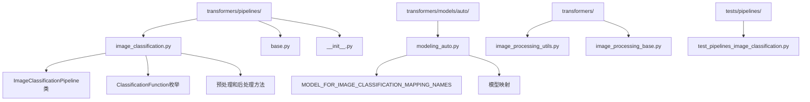

**图表来源**
- [image_classification.py](file://src/transformers/pipelines/image_classification.py#L1-L230)
- [modeling_auto.py](file://src/transformers/models/auto/modeling_auto.py#L857-L889)

## 核心组件

### ImageClassificationPipeline类

ImageClassificationPipeline是图像分类管道的核心类，继承自基础Pipeline类，专门处理图像分类任务。

#### 主要属性

| 属性名 | 类型 | 默认值 | 描述 |
|--------|------|--------|------|
| `function_to_apply` | ClassificationFunction | ClassificationFunction.NONE | 后处理时应用的函数类型 |
| `_load_processor` | bool | False | 是否需要加载通用处理器 |
| `_load_image_processor` | bool | True | 是否需要加载图像处理器 |
| `_load_feature_extractor` | bool | False | 是否需要加载特征提取器 |
| `_load_tokenizer` | bool | False | 是否需要加载分词器 |

#### 支持的模型类型

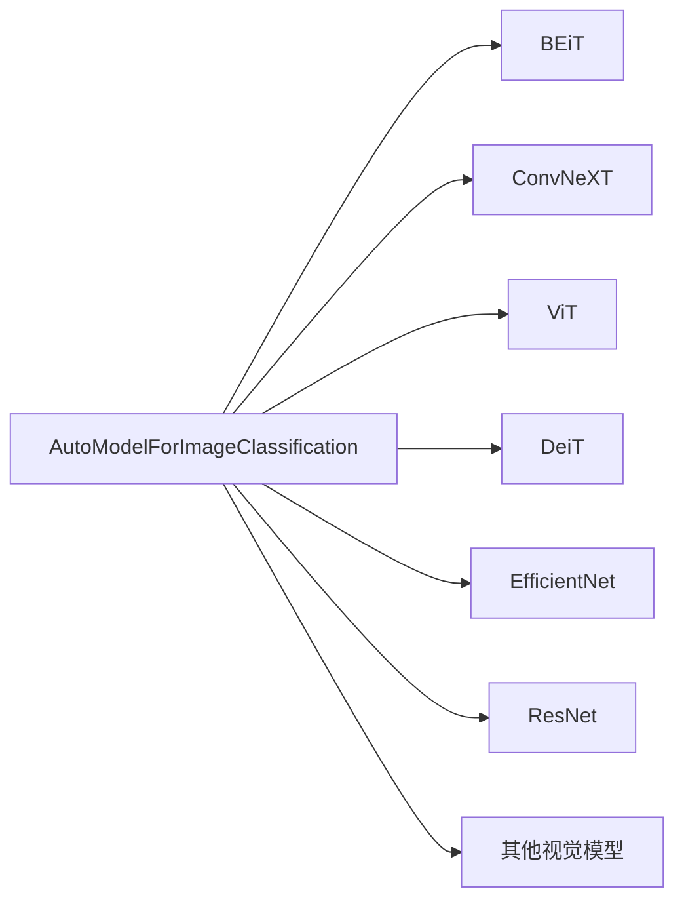

**图表来源**
- [modeling_auto.py](file://src/transformers/models/auto/modeling_auto.py#L857-L889)

**节来源**
- [image_classification.py](file://src/transformers/pipelines/image_classification.py#L72-L105)

## 架构概览

### 管道工作流程

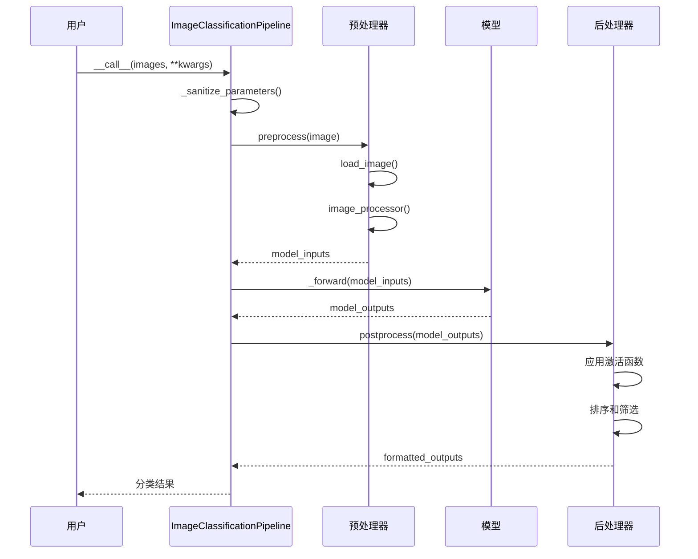

**图表来源**
- [image_classification.py](file://src/transformers/pipelines/image_classification.py#L182-L228)
- [base.py](file://src/transformers/pipelines/base.py#L1317-L1376)

### 输入输出处理流程

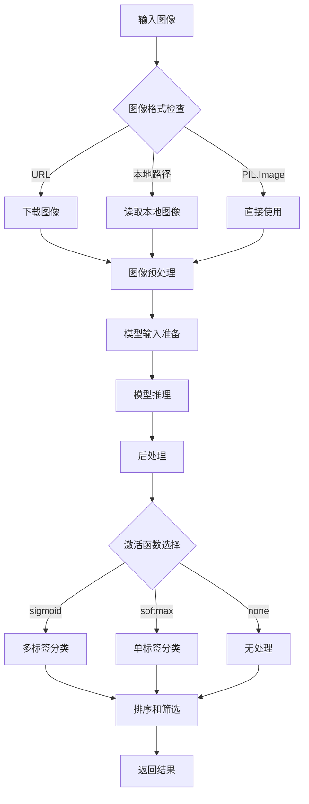

**图表来源**
- [image_classification.py](file://src/transformers/pipelines/image_classification.py#L182-L228)

## 详细组件分析

### 输入处理组件

#### 图像加载和预处理

ImageClassificationPipeline支持三种类型的输入：

1. **URL字符串**：远程图像链接
2. **本地文件路径**：本地图像文件路径
3. **PIL.Image对象**：已加载的图像对象

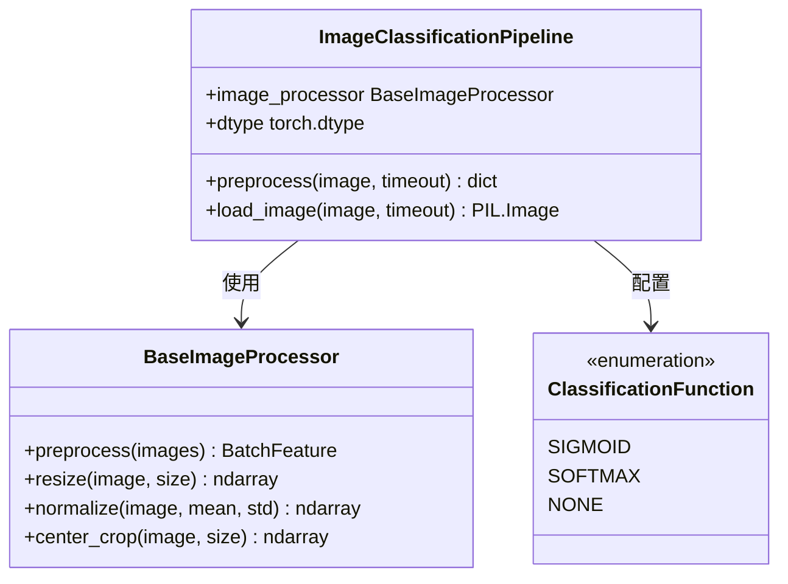

**图表来源**
- [image_classification.py](file://src/transformers/pipelines/image_classification.py#L182-L186)
- [image_processing_utils.py](file://src/transformers/image_processing_utils.py#L35-L50)

#### 参数验证和清理

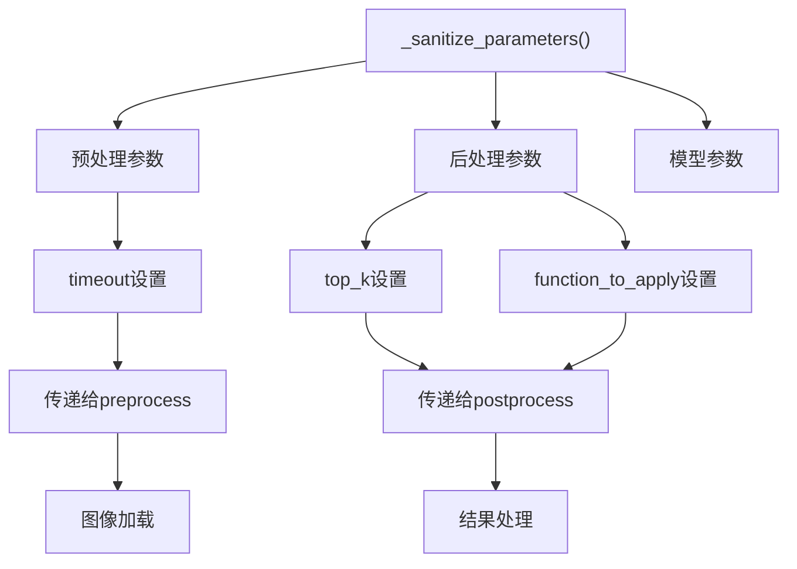

**图表来源**
- [image_classification.py](file://src/transformers/pipelines/image_classification.py#L107-L118)

**节来源**
- [image_classification.py](file://src/transformers/pipelines/image_classification.py#L107-L118)

### 模型推理组件

#### 前向传播处理

模型推理过程包括以下步骤：

1. **模型输入准备**：将预处理后的图像转换为模型所需的张量格式
2. **设备适配**：确保模型和输入数据在相同的设备上
3. **推理执行**：调用模型进行前向传播

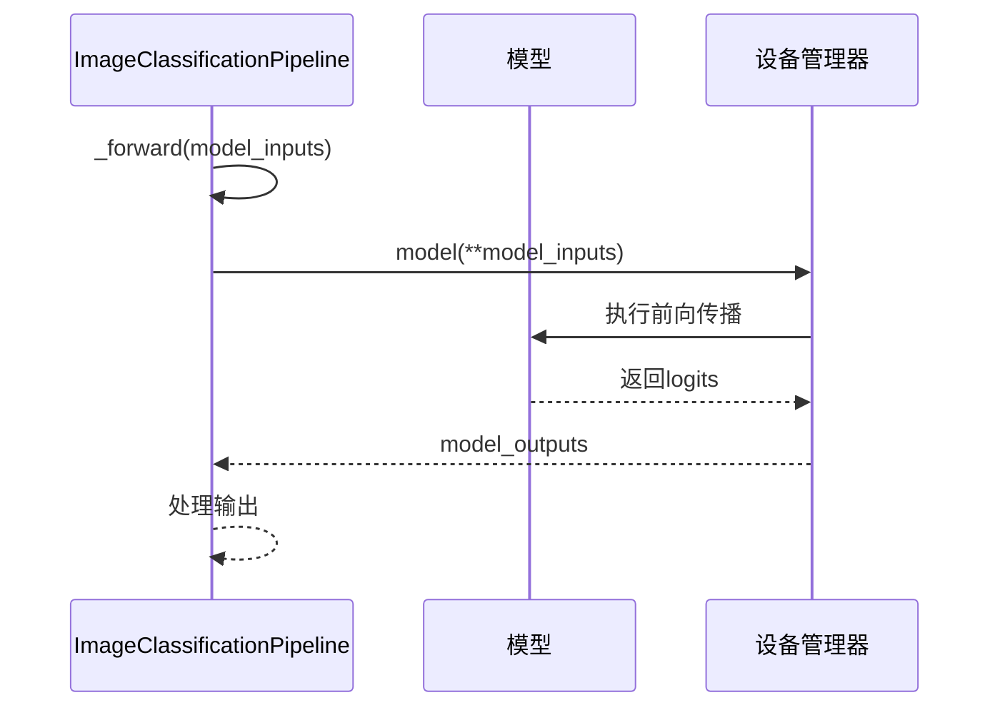

**图表来源**
- [image_classification.py](file://src/transformers/pipelines/image_classification.py#L188-L190)

**节来源**
- [image_classification.py](file://src/transformers/pipelines/image_classification.py#L188-L190)

### 输出处理组件

#### 后处理和结果格式化

后处理阶段负责将原始模型输出转换为用户友好的分类结果：

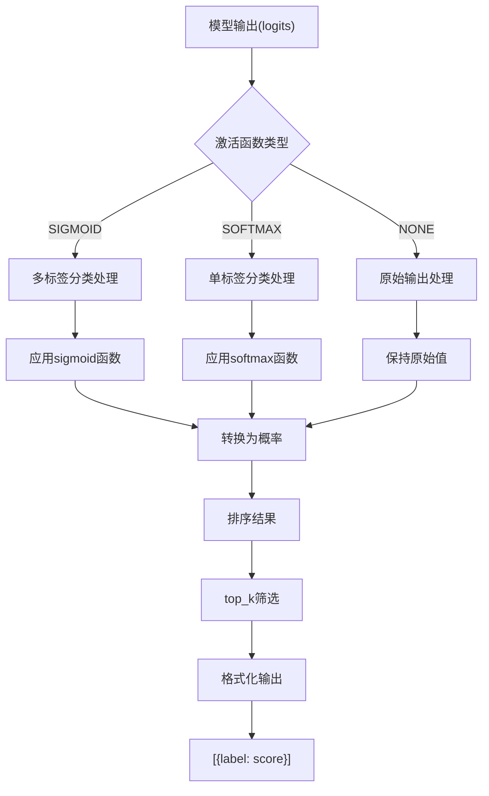

**图表来源**
- [image_classification.py](file://src/transformers/pipelines/image_classification.py#L192-L228)

#### 自动激活函数选择

系统根据模型配置自动选择合适的激活函数：

| 模型配置 | 激活函数 | 说明 |
|----------|----------|------|
| `problem_type == "multi_label_classification"` | SIGMOID | 多标签分类任务 |
| `num_labels == 1` | SIGMOID | 单标签二分类任务 |
| `problem_type == "single_label_classification"` | SOFTMAX | 单标签多分类任务 |
| `num_labels > 1` | SOFTMAX | 单标签多分类任务 |
| 其他情况 | NONE | 不应用激活函数 |

**节来源**
- [image_classification.py](file://src/transformers/pipelines/image_classification.py#L192-L228)

### 批处理优化

#### 批量图像处理

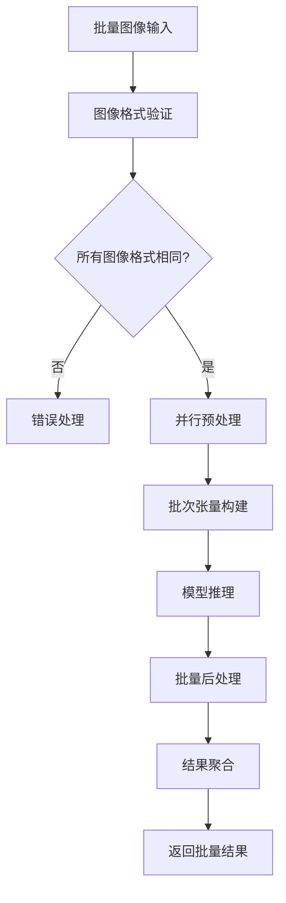

**图表来源**
- [test_pipelines_image_classification.py](file://tests/pipelines/test_pipelines_image_classification.py#L80-L120)

**节来源**
- [test_pipelines_image_classification.py](file://tests/pipelines/test_pipelines_image_classification.py#L80-L120)

## 依赖关系分析

### 核心依赖关系

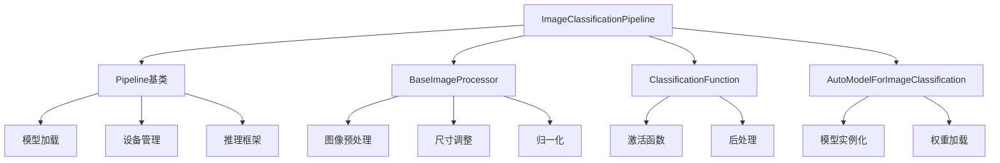

**图表来源**
- [image_classification.py](file://src/transformers/pipelines/image_classification.py#L1-L30)
- [base.py](file://src/transformers/pipelines/base.py#L1-L50)

### 模型映射关系

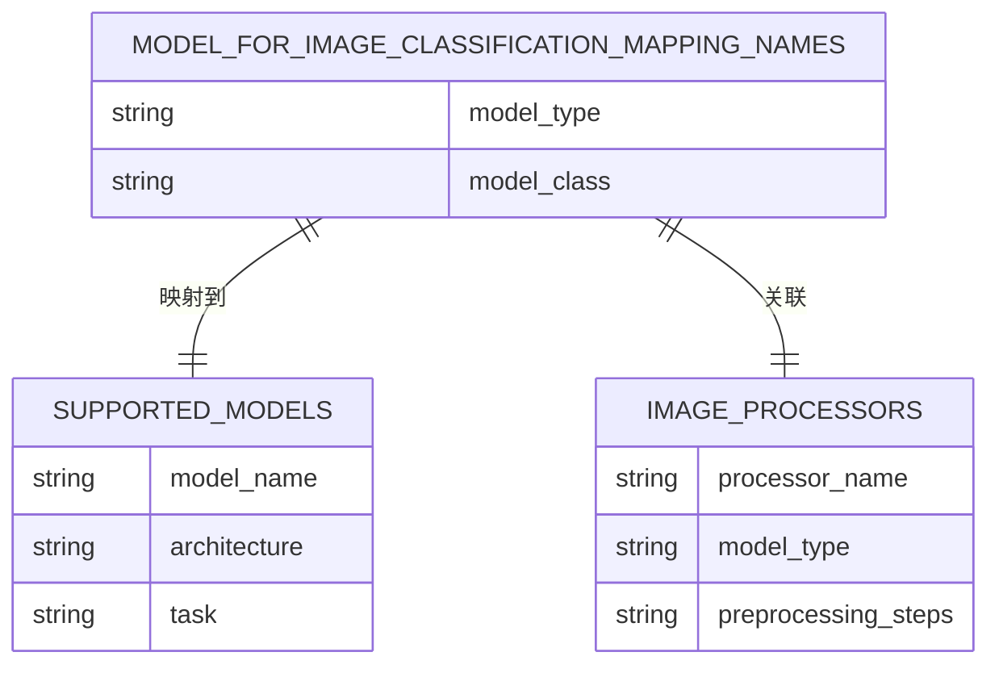

**图表来源**
- [modeling_auto.py](file://src/transformers/models/auto/modeling_auto.py#L857-L889)
- [__init__.py](file://src/transformers/pipelines/__init__.py#L141-L330)

**节来源**
- [modeling_auto.py](file://src/transformers/models/auto/modeling_auto.py#L857-L889)

## 性能考虑

### 内存优化策略

1. **动态数据类型转换**：
   - 自动检测和转换低精度浮点数（bfloat16, float16）
   - 在需要时转换为float32进行数值计算

2. **设备内存管理**：
   - 智能设备分配和释放
   - 支持CPU和GPU之间的数据传输

3. **批处理优化**：
   - 动态批次大小调整
   - 内存使用监控和优化

### 推理性能优化

| 优化技术 | 描述 | 适用场景 |
|----------|------|----------|
| 混合精度推理 | 使用float16/bfloat16减少内存占用 | GPU推理 |
| 批处理 | 并行处理多个图像 | 批量处理 |
| 缓存机制 | 缓存预处理结果 | 重复处理相似图像 |
| 异步处理 | 非阻塞图像下载 | 网络IO密集任务 |

### 设备选择指南

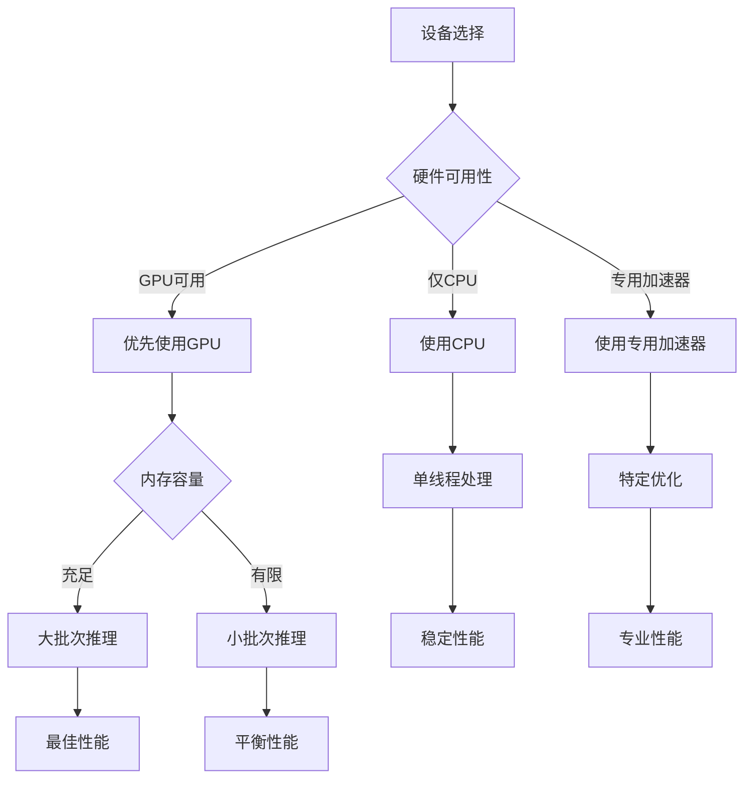

## 故障排除指南

### 常见错误和解决方案

#### 1. 输入尺寸不匹配

**错误症状**：`RuntimeError: Sizes of tensors cannot be multiplied`

**解决方案**：
- 检查图像尺寸是否符合模型要求
- 使用适当的图像处理器配置
- 调整模型输入尺寸参数

#### 2. 设备内存不足

**错误症状**：`CUDA out of memory`

**解决方案**：
```python
# 减少批次大小
classifier = pipeline("image-classification", model="large-model", batch_size=1)

# 使用混合精度
classifier = pipeline("image-classification", model="large-model", dtype=torch.float16)

# 使用CPU
classifier = pipeline("image-classification", model="large-model", device="cpu")
```

#### 3. 图像格式问题

**错误症状**：`ValueError: Unsupported image format`

**解决方案**：
- 确保图像格式受支持（PNG, JPEG, BMP等）
- 检查图像文件完整性
- 转换图像格式

#### 4. 网络超时问题

**错误症状**：`TimeoutError: Request timed out`

**解决方案**：
```python
# 设置超时时间
classifier = pipeline("image-classification")
result = classifier("http://example.com/image.jpg", timeout=30.0)
```

### 性能调试技巧

#### 内存使用监控

```python
import torch
import psutil
import gc

def monitor_memory():
    if torch.cuda.is_available():
        print(f"CUDA内存使用: {torch.cuda.memory_allocated() / 1024**3:.2f} GB")
        print(f"CUDA内存缓存: {torch.cuda.memory_reserved() / 1024**3:.2f} GB")
    
    print(f"系统内存使用: {psutil.virtual_memory().percent}%")
    
    # 清理缓存
    torch.cuda.empty_cache()
    gc.collect()
```

#### 推理时间测量

```python
import time
from contextlib import contextmanager

@contextmanager
def timer():
    start = time.time()
    yield
    end = time.time()
    print(f"推理耗时: {end - start:.2f}秒")

# 使用示例
with timer():
    results = classifier(images)
```

### 最佳实践建议

1. **模型选择**：
   - 根据任务需求选择合适大小的模型
   - 考虑推理速度和准确性的平衡

2. **批量处理**：
   - 合理设置批次大小以平衡内存和性能
   - 对于不同尺寸的图像，考虑分组处理

3. **资源管理**：
   - 及时释放不需要的模型和处理器
   - 监控系统资源使用情况

4. **错误处理**：
   - 实现健壮的异常处理机制
   - 提供有意义的错误信息

**节来源**
- [test_pipelines_image_classification.py](file://tests/pipelines/test_pipelines_image_classification.py#L143-L174)

## 结论

ImageClassificationPipeline是Hugging Face Transformers库中功能强大且易于使用的图像分类工具。它通过统一的接口简化了复杂的图像分类任务，支持多种输入格式、灵活的配置选项和高效的批量处理能力。

### 主要优势

1. **易用性**：简洁的API设计，只需一行代码即可完成图像分类
2. **灵活性**：支持多种输入格式和自定义配置
3. **性能**：内置优化的批处理和内存管理
4. **扩展性**：广泛支持各种视觉模型架构

### 适用场景

- **研究和开发**：快速原型开发和模型评估
- **生产环境**：高并发的图像分类服务
- **教育和学习**：图像分类算法的学习和实验

### 未来发展方向

随着计算机视觉技术的不断发展，ImageClassificationPipeline将继续演进，支持更多先进的模型架构和优化技术，为用户提供更加强大和便捷的图像分类解决方案。